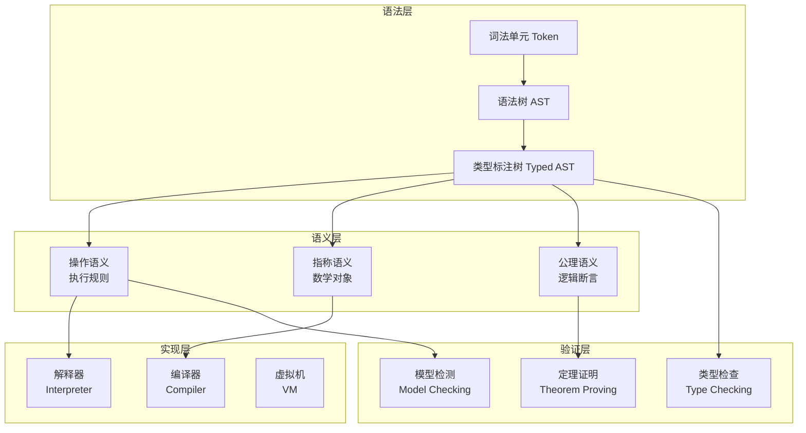

# C语言形式化语义网络

> **层级定位**: 05_Deep_Structure_MetaPhysics / 01_Formal_Semantics
> **理论深度**: 高级形式化方法
> **最后更新**: 2026-03-28

---

## 📋 本节概要

| 属性 | 内容 |
|:-----|:-----|
| **核心概念** | 操作语义、指称语义、公理语义、类型理论 |
| **前置知识** | 离散数学、数理逻辑、抽象代数基础 |
| **后续延伸** | 编译器验证、程序证明、形式化方法 |
| **横向关联** | 类型系统、内存模型、并发理论 |
| **理论来源** | Hoare逻辑、Scott域理论、Plotkin操作语义 |

---

## 📑 目录

- [C语言形式化语义网络](#c语言形式化语义网络)
  - [📋 本节概要](#-本节概要)
  - [📑 目录](#-目录)
  - [🎯 形式化语义框架](#-形式化语义框架)
    - [三种语义方法比较](#三种语义方法比较)
  - [🔬 操作语义（Operational Semantics）](#-操作语义operational-semantics)
    - [大步语义（Big-Step Semantics）](#大步语义big-step-semantics)
      - [形式化表示](#形式化表示)
      - [C语言表达式规则](#c语言表达式规则)
      - [C语言语句规则](#c语言语句规则)
    - [小步语义（Small-Step Semantics）](#小步语义small-step-semantics)
      - [形式化表示](#形式化表示-1)
      - [求值上下文（Evaluation Contexts）](#求值上下文evaluation-contexts)
      - [小步规则示例](#小步规则示例)
  - [📐 指称语义（Denotational Semantics）](#-指称语义denotational-semantics)
    - [域理论（Domain Theory）](#域理论domain-theory)
      - [完全偏序（CPO）](#完全偏序cpo)
      - [连续函数](#连续函数)
      - [不动点定理](#不动点定理)
    - [C语言构造的指称](#c语言构造的指称)
      - [表达式指称](#表达式指称)
      - [语句指称](#语句指称)
  - [✅ 公理语义（Axiomatic Semantics）](#-公理语义axiomatic-semantics)
    - [Hoare三元组](#hoare三元组)
      - [基本形式](#基本形式)
      - [C语言构造的推理规则](#c语言构造的推理规则)
    - [推理示例](#推理示例)
      - [交换变量（使用临时变量）](#交换变量使用临时变量)
      - [求和程序验证](#求和程序验证)
  - [🔧 类型理论与类型系统](#-类型理论与类型系统)
    - [类型判断（Typing Judgment）](#类型判断typing-judgment)
    - [类型推导规则](#类型推导规则)
    - [C类型系统特性](#c类型系统特性)
      - [类型转换规则](#类型转换规则)
  - [🧠 语义层次关联网络](#-语义层次关联网络)
    - [语义层次结构](#语义层次结构)
    - [概念关联矩阵](#概念关联矩阵)
    - [形式化语义到实现的映射](#形式化语义到实现的映射)
  - [📊 概念映射与对应关系](#-概念映射与对应关系)
    - [C语言构造 ↔ 数学对象](#c语言构造--数学对象)
    - [C语言操作 ↔ 代数结构](#c语言操作--代数结构)
  - [🔍 定理与证明示例](#-定理与证明示例)
    - [定理：赋值组合律](#定理赋值组合律)
    - [定理：循环展开等价性](#定理循环展开等价性)
  - [✅ 质量验收清单](#-质量验收清单)

---

## 🎯 形式化语义框架

### 三种语义方法比较

| 语义方法 | 核心思想 | 适用场景 | 形式化工具 |
|:---------|:---------|:---------|:-----------|
| **操作语义** | 描述程序执行步骤 | 实现、解释器 | 转换规则、状态机 |
| **指称语义** | 将程序映射到数学对象 | 编译正确性、优化 | 域理论、范畴论 |
| **公理语义** | 通过逻辑断言描述行为 | 程序验证 | Hoare逻辑、分离逻辑 |

```
三种语义方法的关联：

        程序 P
          │
    ┌─────┼─────┐
    │     │     │
    ▼     ▼     ▼
   操作   指称   公理
   语义   语义   语义
    │     │     │
    ▼     ▼     ▼
   执行   数学   逻辑
   规则   对象   断言
    │     │     │
    └─────┴─────┘
          │
          ▼
    形式化验证
    （Coq/Isabelle）
```

---

## 🔬 操作语义（Operational Semantics）

### 大步语义（Big-Step Semantics）

大步语义描述表达式的完整求值过程。

#### 形式化表示

```
表达式求值判断：
    ⟨e, σ⟩ ⇓ v

含义：在状态σ下，表达式e求值为值v

状态σ：变量到值的映射（存储）
    σ : Variable → Value
```

#### C语言表达式规则

```text
[常量]
───────
⟨n, σ⟩ ⇓ n


[变量]
σ(x) = v
──────────
⟨x, σ⟩ ⇓ v


[加法]
⟨e₁, σ⟩ ⇓ v₁    ⟨e₂, σ⟩ ⇓ v₂    v = v₁ + v₂
───────────────────────────────────────────
          ⟨e₁ + e₂, σ⟩ ⇓ v


[赋值]
⟨e, σ⟩ ⇓ v    σ' = σ[x ↦ v]
────────────────────────────
   ⟨x = e, σ⟩ ⇓ v, σ'
```

#### C语言语句规则

```text
[顺序执行]
⟨S₁, σ⟩ ⇓ σ'    ⟨S₂, σ'⟩ ⇓ σ''
───────────────────────────────
     ⟨S₁; S₂, σ⟩ ⇓ σ''


[条件真]
⟨B, σ⟩ ⇓ true    ⟨S₁, σ⟩ ⇓ σ'
─────────────────────────────
   ⟨if B then S₁ else S₂, σ⟩ ⇓ σ'


[条件假]
⟨B, σ⟩ ⇓ false    ⟨S₂, σ⟩ ⇓ σ'
──────────────────────────────
   ⟨if B then S₁ else S₂, σ⟩ ⇓ σ'


[循环]
⟨B, σ⟩ ⇓ false
─────────────────────
⟨while B do S, σ⟩ ⇓ σ

⟨B, σ⟩ ⇓ true    ⟨S, σ⟩ ⇓ σ'    ⟨while B do S, σ'⟩ ⇓ σ''
─────────────────────────────────────────────────────────
              ⟨while B do S, σ⟩ ⇓ σ''
```

### 小步语义（Small-Step Semantics）

小步语义描述单个计算步骤，适用于并发和中间状态分析。

#### 形式化表示

```
单步转换判断：
    ⟨e, σ⟩ → ⟨e', σ'⟩  或  ⟨e, σ⟩ → v

含义：在状态σ下，表达式e单步转换为e'和新状态σ'，或成为值v
```

#### 求值上下文（Evaluation Contexts）

```
上下文文法：
    E ::= [·]               // 空上下文（hole）
        | E + e | v + E     // 加法上下文
        | E = e | x = E     // 赋值上下文
        | if E then S₁ else S₂  // 条件上下文
        | ...

上下文规则：
    ⟨e, σ⟩ → ⟨e', σ'⟩
─────────────────────────
⟨E[e], σ⟩ → ⟨E[e'], σ'⟩
```

#### 小步规则示例

```text
[查找变量]
σ(x) = v
──────────────────
⟨x, σ⟩ → v


[加法左]
⟨e₁, σ⟩ → ⟨e₁', σ'⟩
──────────────────────────
⟨e₁ + e₂, σ⟩ → ⟨e₁' + e₂, σ'⟩


[加法右]
⟨e₂, σ⟩ → ⟨e₂', σ'⟩
──────────────────────────
⟨v₁ + e₂, σ⟩ → ⟨v₁ + e₂', σ'⟩


[加法计算]
v = v₁ + v₂
───────────────────
⟨v₁ + v₂, σ⟩ → v


[赋值表达式]
⟨e, σ⟩ → ⟨e', σ'⟩
────────────────────────
⟨x = e, σ⟩ → ⟨x = e', σ'⟩


[赋值完成]
σ' = σ[x ↦ v]
───────────────────
⟨x = v, σ⟩ → v, σ'
```

---

## 📐 指称语义（Denotational Semantics）

### 域理论（Domain Theory）

#### 完全偏序（CPO）

```
定义：完全偏序（Complete Partial Order, CPO）

⟨D, ⊑⟩ 是一个CPO，如果：
1. ⊑ 是偏序关系（自反、反对称、传递）
2. D有最小元 ⊥（底部）
3. 每个链都有最小上界（lub）

链：x₀ ⊑ x₁ ⊑ x₂ ⊑ ...
lub: ⊔{xᵢ | i ≥ 0}
```

#### 连续函数

```
定义：连续函数

函数 f : D → E 是连续的，如果：
1. f 是单调的：x ⊑ y ⟹ f(x) ⊑ f(y)
2. f 保持lub：f(⊔X) = ⊔{f(x) | x ∈ X}

记法：[D → E] 表示从D到E的连续函数空间
```

#### 不动点定理

```
定理（Kleene不动点定理）：

设 f : D → D 是连续函数，D是CPO。
则 f 有最小不动点 fix(f)，定义为：

    fix(f) = ⊔{fⁿ(⊥) | n ≥ 0}
           = ⊥ ⊔ f(⊥) ⊔ f(f(⊥)) ⊔ ...

证明：
1. 由连续性，f(fix(f)) = f(⊔fⁿ(⊥)) = ⊔f(fⁿ(⊥)) = ⊔fⁿ⁺¹(⊥) = fix(f)
2. 最小性：对于任意不动点d，通过归纳法可证fⁿ(⊥) ⊑ d，因此fix(f) ⊑ d
```

### C语言构造的指称

#### 表达式指称

```
表达式指称：
    e : Store → Value × Store

其中：
    Store = Variable → Value（部分函数）
    Value = ℤ ∪ 𝔹 ∪ Address ∪ ...

基本表达式：
    n(σ) = ⟨n, σ⟩                    // 常量
    x(σ) = ⟨σ(x), σ⟩  如果 x ∈ dom(σ)  // 变量

算术运算：
    e₁ + e₂(σ) = let ⟨v₁, σ'⟩ = e₁(σ)
                        ⟨v₂, σ''⟩ = e₂(σ')
                     in ⟨v₁ + v₂, σ''⟩

赋值：
    x = e(σ) = let ⟨v, σ'⟩ = e(σ)
                  in ⟨v, σ'[x ↦ v]⟩
```

#### 语句指称

```
语句指称：
    S : Store → Store⊥

其中 Store⊥ = Store ∪ {⊥}（提升的域，⊥表示发散/不终止）

基本语句：
    skip(σ) = σ

顺序执行：
    S₁; S₂(σ) = S₂(S₁(σ))

条件：
    if B then S₁ else S₂(σ) =
        let ⟨b, σ'⟩ = B(σ)
        in if b then S₁(σ') else S₂(σ')

循环（使用不动点）：
    while B do S = fix(λf.λσ.
        let ⟨b, σ'⟩ = B(σ)
        in if b then f(S(σ')) else σ')
```

---

## ✅ 公理语义（Axiomatic Semantics）

### Hoare三元组

#### 基本形式

```
Hoare三元组：
    {P} S {Q}

含义：如果在执行语句S之前，前置条件P成立，
      那么执行S之后，后置条件Q成立。

其中P和Q是断言（谓词逻辑公式）。

部分正确性：{P} S {Q}
    - 如果P成立且S终止，则Q成立
    - S可能不终止

完全正确性：{P} S {Q}
    - P成立蕴含S终止
    - S终止后Q成立
```

#### C语言构造的推理规则

```text
[空语句]
───────────
{P} skip {P}


[赋值公理]
────────────────────
{P[e/x]} x = e {P}

解释：P[e/x]表示将P中所有x替换为e


[顺序规则]
{P} S₁ {Q}    {Q} S₂ {R}
───────────────────────────
      {P} S₁; S₂ {R}


[条件规则]
{P ∧ B} S₁ {Q}    {P ∧ ¬B} S₂ {Q}
───────────────────────────────────
     {P} if B then S₁ else S₂ {Q}


[循环规则（While）]
{I ∧ B} S {I}
───────────────────────────────
{I} while B do S {I ∧ ¬B}

I称为循环不变式（loop invariant）


[加强前置条件]
P' ⟹ P    {P} S {Q}
────────────────────
     {P'} S {Q}


[削弱后置条件]
{P} S {Q}    Q ⟹ Q'
────────────────────
     {P} S {Q'}


[规则合取]
{P₁} S {Q₁}    {P₂} S {Q₂}
───────────────────────────
   {P₁ ∧ P₂} S {Q₁ ∧ Q₂}
```

### 推理示例

#### 交换变量（使用临时变量）

```c
// 目标：交换x和y的值
// 前置条件：{x = X ∧ y = Y}
// 后置条件：{x = Y ∧ y = X}

t = x;      // {t = X ∧ x = X ∧ y = Y}
x = y;      // {t = X ∧ x = Y ∧ y = Y}
y = t;      // {t = X ∧ x = Y ∧ y = X}

// 最终：{x = Y ∧ y = X}  ✓
```

形式化证明：

```
1. {x = X ∧ y = Y}
2. t = x
   {t = X ∧ x = X ∧ y = Y}           （赋值公理）
3. x = y
   {t = X ∧ x = Y ∧ y = Y}           （赋值公理）
4. y = t
   {t = X ∧ x = Y ∧ y = X}           （赋值公理）
5. ⟹ {x = Y ∧ y = X}                （削弱后置条件）
```

#### 求和程序验证

```c
// 计算 1 + 2 + ... + n
// 前置条件：{n ≥ 0}
// 后置条件：{s = n(n+1)/2}

i = 0;
s = 0;
while (i < n) {
    i = i + 1;
    s = s + i;
}
```

循环不变式：`{s = i(i+1)/2 ∧ 0 ≤ i ≤ n}`

```
初始化：
    i = 0; s = 0;
    {s = i(i+1)/2 ∧ 0 ≤ i ≤ n} = {0 = 0 ∧ 0 ≤ 0 ≤ n} = {n ≥ 0}  ✓

保持：
    假设 {s = i(i+1)/2 ∧ i < n}
    i = i + 1;  // {s = (i-1)i/2 ∧ ...}
    s = s + i;  // {s = (i-1)i/2 + i = i(i+1)/2}
    且 i ≤ n

终止：
    {s = i(i+1)/2 ∧ ¬(i < n)} = {s = i(i+1)/2 ∧ i = n}
    ⟹ {s = n(n+1)/2}  ✓
```

---

## 🔧 类型理论与类型系统

### 类型判断（Typing Judgment）

```
类型判断形式：
    Γ ⊢ e : τ

含义：在类型环境Γ下，表达式e具有类型τ

类型环境：
    Γ : Variable → Type
    Γ = {x₁ : τ₁, x₂ : τ₂, ...}
```

### 类型推导规则

```text
[常量类型]
────────────────
Γ ⊢ n : int      (n是整数常量)


[变量类型]
Γ(x) = τ
───────────
Γ ⊢ x : τ


[加法类型]
Γ ⊢ e₁ : int    Γ ⊢ e₂ : int
───────────────────────────
      Γ ⊢ e₁ + e₂ : int


[赋值类型]
Γ ⊢ x : τ    Γ ⊢ e : τ
──────────────────────
    Γ ⊢ x = e : τ


[地址类型]
Γ ⊢ x : τ
─────────────────
Γ ⊢ &x : pointer(τ)


[解引用类型]
Γ ⊢ e : pointer(τ)
──────────────────
    Γ ⊢ *e : τ


[序列类型]
Γ ⊢ S₁ : void    Γ ⊢ S₂ : τ
───────────────────────────
      Γ ⊢ S₁; S₂ : τ
```

### C类型系统特性

#### 类型转换规则

```text
[宽化转换]
Γ ⊢ e : τ₁    τ₁ ⊑ τ₂    （τ₁是τ₂的子类型）
─────────────────────────
        Γ ⊢ (τ₂)e : τ₂


[窄化转换]
Γ ⊢ e : τ₁    τ₂ ⊑ τ₁
───────────────────────
    Γ ⊢ (τ₂)e : τ₂    （可能丢失信息，警告）


[指针转换]
Γ ⊢ e : pointer(τ)
─────────────────────────
Γ ⊢ (void*)e : pointer(void)


[函数调用]
Γ ⊢ f : (τ₁, ..., τₙ) → τ    Γ ⊢ eᵢ : τᵢ  (对每个i)
───────────────────────────────────────────────
          Γ ⊢ f(e₁, ..., eₙ) : τ
```

---

## 🧠 语义层次关联网络

### 语义层次结构



### 概念关联矩阵

| 概念 | 操作语义 | 指称语义 | 公理语义 | 类型理论 | 实现映射 |
|:-----|:--------:|:--------:|:--------:|:--------:|:--------:|
| 表达式 | 求值规则 | 数学函数 | 前置/后置条件 | 类型判断 | 代码生成 |
| 变量 | 环境查找 | 投影函数 | 断言中的变量 | 环境映射 | 内存地址 |
| 赋值 | 状态更新 | 函数组合 | 替换公理 | 类型一致性 | 存储指令 |
| 条件 | 分支规则 | 条件函数 | 推理规则分支 | 类型分支 | 跳转指令 |
| 循环 | 递归规则 | 不动点 | 不变式 | 递归类型 | 循环指令 |
| 函数 | 调用规则 | 高阶函数 | 规约/后置 | 函数类型 | 调用约定 |

### 形式化语义到实现的映射

```
形式化语义          实现层
────────────       ──────────

操作语义            解释器/虚拟机
   ↓                    ↓
求值规则    ────→   执行引擎
状态转换    ────→   状态管理器

指称语义            编译器
   ↓                    ↓
数学函数    ────→   目标代码
域对象      ────→   内存表示

公理语义            验证工具
   ↓                    ↓
Hoare三元组 ────→   验证条件生成
不变式      ────→   自动证明器
```

---

## 📊 概念映射与对应关系

### C语言构造 ↔ 数学对象

| C语言构造 | 数学对象 | 数学表示 |
|:----------|:---------|:---------|
| 整数类型 | 整数集子集 | ℤ ∩ [MIN, MAX] |
| 浮点类型 | 浮点近似 | 𝔽 ⊂ ℚ |
| 指针类型 | 地址空间 | 𝔸 = {0, 1, ..., 2ⁿ-1} |
| 数组 | 有限序列 | τⁿ 或 ℕ → τ |
| 结构体 | 笛卡尔积 | τ₁ × τ₂ × ... × τₙ |
| 联合体 | 不交并 | τ₁ + τ₂ + ... + τₙ |
| 函数 | 映射 | D → C |
| void | 单元类型 | 𝟙 = {()} |

### C语言操作 ↔ 代数结构

| C操作 | 代数结构 | 代数性质 |
|:------|:---------|:---------|
| 整数加法 | 阿贝尔群 | 结合律、交换律、单位元、逆元 |
| 位运算 | 布尔代数 | 与/或/非运算，满足布尔定律 |
| 指针加法（数组内） | 阿贝尔群（片段） | 同类型指针形成群结构 |
| 函数复合 | 幺半群 | 结合律，单位元为恒等函数 |
| 逻辑运算 | 布尔代数 | 德摩根定律、分配律 |

---

## 🔍 定理与证明示例

### 定理：赋值组合律

```
定理：赋值语句满足以下等式
    (x = e₁); (x = e₂)  ≡  x = e₂[e₁/x]

其中 e₂[e₁/x] 表示将e₂中的x替换为e₁。

证明：

左边语义（操作语义）：
    ⟨x = e₁; x = e₂, σ⟩
    = ⟨x = e₂, σ'⟩  其中 ⟨e₁, σ⟩ ⇓ v₁, σ' = σ[x ↦ v₁]
    = σ''  其中 ⟨e₂, σ'⟩ ⇓ v₂, σ'' = σ'[x ↦ v₂]
    = σ[x ↦ v₁][x ↦ v₂]
    = σ[x ↦ v₂]  （后赋值覆盖前者）

右边语义：
    ⟨x = e₂[e₁/x], σ⟩
    = σ[x ↦ v₂']  其中 ⟨e₂[e₁/x], σ⟩ ⇓ v₂'

由于 e₂[e₁/x] 在σ中求值等价于 e₂ 在σ[x ↦ v₁]中求值，
所以 v₂' = v₂。

因此两边相等。∎
```

### 定理：循环展开等价性

```
定理：单次展开的while循环等价性
    while B do S  ≡  if B then (S; while B do S) else skip

证明（指称语义）：

设 F(f) = λσ. if B(σ) then f(S(σ)) else σ

左边：while B do S = fix(F)

右边：
    if B then (S; while B do S) else skip
    = λσ. if B(σ) then S; while B do S(σ) else σ
    = λσ. if B(σ) then fix(F)(S(σ)) else σ
    = F(fix(F))

由于 fix(F) = F(fix(F))（不动点性质），两边相等。∎
```

---

## ✅ 质量验收清单

- [x] 三种形式化语义方法完整覆盖
- [x] 操作语义（大步/小步）规则
- [x] 指称语义（域理论、不动点）
- [x] 公理语义（Hoare三元组、推理规则）
- [x] 类型理论与类型推导规则
- [x] 语义层次关联网络
- [x] 概念映射与对应关系
- [x] 定理与证明示例
- [x] 数学符号和形式化表示

---

> **最后更新**: 2026-03-28
> **版本**: 1.0 - 形式化语义网络
> **维护者**: C_Lang Knowledge Base Team
