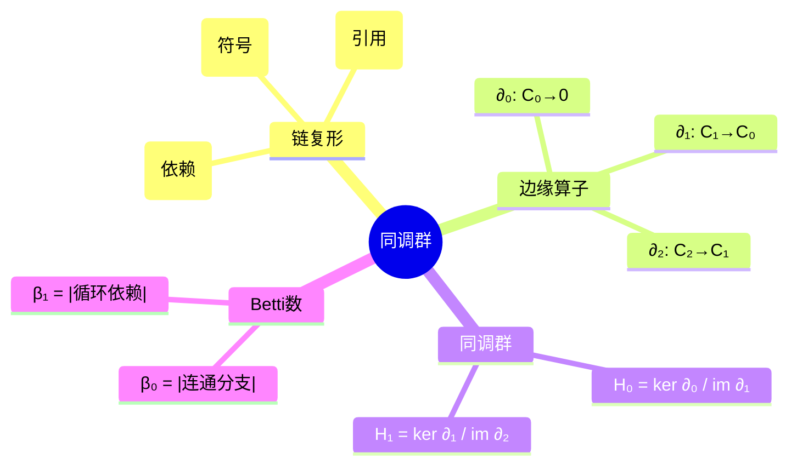

# 同调群视角下的链接与加载

> **层级定位**: 05 Deep Structure MetaPhysics / 01 Linking Algebraic Topology
> **对应标准**: ELF, Mach-O, PE, C89/C99/C11/C17/C23
> **难度级别**: L6 创造
> **预估学习时间**: 20+ 小时

---

## 📋 本节概要

| 属性 | 内容 |
|:-----|:-----|
| **核心概念** | 同调群、链复形、边缘算子、Betti数、持久同调 |
| **前置知识** | 代数拓扑、链复形、群论、链接器原理 |
| **后续延伸** | 持续同调在软件演化中的应用、拓扑数据分析 |
| **权威来源** | Hatcher《Algebraic Topology》, Edelsbrunner, HoTT Book |

---

## 🧠 知识结构思维导图



---

## 📖 核心概念详解

### 1. 符号解析的链复形结构

#### 1.1 链群的定义

将程序的符号依赖结构建模为链复形：

$$
\cdots \xrightarrow{\partial_3} C_2 \xrightarrow{\partial_2} C_1 \xrightarrow{\partial_1} C_0 \xrightarrow{\partial_0} 0
$$

其中：

- $C_0$：**0-链群** = 符号（函数、变量）的自由阿贝尔群
- $C_1$：**1-链群** = 引用关系的自由阿贝尔群
- $C_2$：**2-链群** = 循环依赖的自由阿贝尔群
- $\partial_n$：**边缘算子**，将高维链映射到低维链

```c
// 链群的代数表示
typedef struct {
    int dimension;
    Element *generators;    // 生成元集合
    int n_generators;
} ChainGroup;

// 0-链：符号
// C₀ = ⊕ ℤ·sᵢ, 其中 sᵢ 是符号
typedef struct {
    char *symbol_name;
    uint64_t address;
    enum { FUNC_SYM, VAR_SYM, SECTION_SYM } kind;
} ZeroChain;  // 0-链元素

// 1-链：引用
// C₁ = ⊕ ℤ·rᵢ, 其中 rᵢ = (source → target) 是引用
typedef struct {
    ZeroChain *source;      // 源符号
    ZeroChain *target;      // 目标符号
    enum { ABS_REF, REL_REF, GOT_REF } kind;
    int64_t addend;         // 加数
} OneChain;   // 1-链元素

// 2-链：依赖环
// C₂ = ⊕ ℤ·dᵢ, 其中 dᵢ 是依赖三角形 (A→B→C→A)
typedef struct {
    OneChain *edges[3];     // 三条边构成三角形
    enum { CALL_CYCLE, DATA_CYCLE, MIXED_CYCLE } kind;
} TwoChain;   // 2-链元素
```

#### 1.2 边缘算子的定义

边缘算子满足 $\partial_{n-1} \circ \partial_n = 0$（链复形性质）。

```c
// 边缘算子 ∂: Cₙ → Cₙ₋₁

// ∂₀: C₀ → 0（平凡映射）
void boundary_0(const ZeroChain *c, void *result) {
    // 总是映射到0
    *(int *)result = 0;
}

// ∂₁: C₁ → C₀
// 对于引用 r: source → target
// ∂₁(r) = target - source（形式差）
ZeroChain *boundary_1(const OneChain *c) {
    // 代数上: ∂(source→target) = target - source
    ZeroChain *result = malloc(sizeof(ZeroChain) * 2);
    result[0] = *c->target;   // +target
    result[1] = *c->source;   // -source
    result[1].address = -result[1].address;  // 取负
    return result;
}

// ∂₂: C₂ → C₁
// 对于三角形 (e₁, e₂, e₃)
// ∂₂(e₁, e₂, e₃) = e₁ + e₂ + e₃（有向边之和）
OneChain *boundary_2(const TwoChain *c) {
    // 验证: ∂₁∘∂₂ = 0
    // ∂₁(∂₂(triangle)) = ∂₁(e₁+e₂+e₃)
    //                  = (B-A) + (C-B) + (A-C) = 0 ✓
    OneChain *result = malloc(sizeof(OneChain) * 3);
    for (int i = 0; i < 3; i++) {
        result[i] = *c->edges[i];
    }
    return result;
}

// 验证链复形性质: ∂∘∂ = 0
bool verify_chain_complex_property(void) {
    // 测试: ∂₁(∂₂(triangle)) = 0
    TwoChain test_triangle = create_test_triangle();
    OneChain *boundary2_result = boundary_2(&test_triangle);

    // 应用∂₁到每条边并求和
    int64_t sum = 0;
    for (int i = 0; i < 3; i++) {
        ZeroChain *bd = boundary_1(&boundary2_result[i]);
        sum += bd[0].address + bd[1].address;  // target - source
        free(bd);
    }

    free(boundary2_result);
    return sum == 0;  // 应该为0
}
```

### 2. 同调群的计算

#### 2.1 同调群的定义

第 $n$ 同调群：

$$
H_n = \frac{\ker \partial_n}{\text{im } \partial_{n+1}}
$$

- $\ker \partial_n$：**n-闭链**（n-cycles），边缘为0的链
- $\text{im } \partial_{n+1}$：**n-边缘**（n-boundaries），某(n+1)-链的边缘
- $H_n$：n-维"洞"的度量

```c
// 同调群计算

typedef struct {
    int dimension;
    int rank;           // 自由部分的秩（Betti数）
    int *torsion;       // 挠子群
    int n_torsion;
} HomologyGroup;

// 计算核 ker(∂ₙ)
ChainGroup *compute_kernel(
    const ChainGroup *domain,
    ChainGroup *(*boundary)(const void *)
) {
    // 求解 ∂ₙ(c) = 0
    // 转化为线性代数问题
    Matrix mat = boundary_to_matrix(boundary, domain);
    Matrix null_space = compute_null_space(mat);

    return matrix_to_chain_group(null_space);
}

// 计算像 im(∂ₙ₊₁)
ChainGroup *compute_image(
    const ChainGroup *codomain,
    ChainGroup *(*boundary)(const void *)
) {
    // im(∂ₙ₊₁) = { ∂ₙ₊₁(c) | c ∈ Cₙ₊₁ }
    Matrix mat = boundary_to_matrix(boundary, codomain);
    Matrix col_space = compute_column_space(mat);

    return matrix_to_chain_group(col_space);
}

// 商群计算: Hₙ = ker(∂ₙ) / im(∂ₙ₊₁)
HomologyGroup *compute_homology(
    int n,
    const ChainGroup *C_n,      // n-链群
    const ChainGroup *C_nplus1  // (n+1)-链群
) {
    ChainGroup *ker = compute_kernel(C_n, get_boundary_op(n));
    ChainGroup *im = compute_image(C_nplus1, get_boundary_op(n + 1));

    // 计算商群
    // Hₙ ≅ ℤ^β ⊕ (挠子群)
    HomologyGroup *H = malloc(sizeof(HomologyGroup));
    H->dimension = n;
    H->rank = ker->n_generators - im->n_generators;  // βₙ

    // 计算挠子群（Smith标准形）
    Matrix relation = compute_relation_matrix(ker, im);
    SmithNormalForm snf = compute_smith_normal_form(relation);
    H->torsion = extract_torsion(snf);
    H->n_torsion = snf.n_nonunit;

    return H;
}
```

#### 2.2 各维度同调群的语义

```c
/*
 * H₀: 连通分量
 *    β₀ = 连通分量的数量
 *    对应：独立的链接单元（独立可执行文件/库）
 *
 * H₁: 1维洞（循环）
 *    β₁ = 循环依赖的数量
 *    对应：模块间的循环依赖
 *
 * H₂: 2维洞（空腔）
 *    β₂ = 更高阶的依赖模式
 *    对应：复杂的版本冲突模式
 */

// 分析链接单元的拓扑结构
void analyze_link_topology(const char *object_files[], int n_files) {
    // 构建链复形
    ChainComplex complex = build_chain_complex(object_files, n_files);

    // 计算各阶同调群
    HomologyGroup *H0 = compute_homology(0, complex.C0, complex.C1);
    HomologyGroup *H1 = compute_homology(1, complex.C1, complex.C2);
    HomologyGroup *H2 = compute_homology(2, complex.C2, complex.C3);

    printf("拓扑分析结果:\n");
    printf("H₀ (连通分量): β₀ = %d\n", H0->rank);
    printf("  → 需要 %d 个独立的链接步骤\n", H0->rank);

    printf("H₁ (循环依赖): β₁ = %d\n", H1->rank);
    printf("  → 发现 %d 个循环依赖\n", H1->rank);
    if (H1->rank > 0) {
        printf("  → 警告：可能需要--start-group/--end-group\n");
    }

    printf("H₂ (2维洞): β₂ = %d\n", H2->rank);
    if (H2->rank > 0) {
        printf("  → 检测到复杂的依赖模式\n");
    }
}
```

### 3. Betti数的计算与应用

#### 3.1 Betti数的拓扑意义

Betti数 $\beta_n = \text{rank}(H_n)$ 度量n维洞的数量。

```c
// 计算各阶Betti数
void compute_betti_numbers(const ChainComplex *complex, int *betti) {
    // βₙ = dim(ker ∂ₙ) - dim(im ∂ₙ₊₁)
    //    = nullity(∂ₙ) - rank(∂ₙ₊₁)

    for (int n = 0; n < complex->max_dimension; n++) {
        Matrix boundary_n = get_boundary_matrix(complex, n);
        Matrix boundary_nplus1 = get_boundary_matrix(complex, n + 1);

        int nullity_n = compute_nullity(boundary_n);
        int rank_nplus1 = compute_rank(boundary_nplus1);

        betti[n] = nullity_n - rank_nplus1;
    }
}

// Euler示性数: χ = Σ(-1)ⁿ βₙ
int compute_euler_characteristic(const int *betti, int max_dim) {
    int chi = 0;
    for (int n = 0; n <= max_dim; n++) {
        chi += (n % 2 == 0 ? 1 : -1) * betti[n];
    }
    return chi;
}

// 软件架构的拓扑度量
typedef struct {
    int n_modules;          // 模块数
    int n_references;       // 引用数
    int beta_0;             // 连通分量数
    int beta_1;             // 循环依赖数
    int beta_2;             // 2维复杂度
    float cyclomatic_topo;  // 拓扑圈复杂度
} ArchitectureTopology;

ArchitectureTopology analyze_architecture(const char *project_path) {
    ArchitectureTopology topo = {0};

    // 解析代码依赖图
    DependencyGraph graph = parse_dependencies(project_path);

    // 构建链复形
    ChainComplex complex = dependency_to_chain_complex(graph);

    // 计算Betti数
    int betti[3];
    compute_betti_numbers(&complex, betti);
    topo.beta_0 = betti[0];
    topo.beta_1 = betti[1];
    topo.beta_2 = betti[2];

    // 计算拓扑圈复杂度
    // 类似图论中的 M = E - N + 2P
    topo.cyclomatic_topo = graph.n_edges - graph.n_nodes + 2 * betti[0];

    return topo;
}
```

### 4. 持久同调与软件演化

#### 4.1 持久同调的基本概念

通过 filtration（过滤）追踪拓扑特征随时间/尺度的演化。

```c
// Filtration: ∅ = K₀ ⊆ K₁ ⊆ ... ⊆ Kₙ = K
typedef struct {
    double scale;           // 时间/复杂度阈值
    ChainComplex complex;   // 当前尺度的链复形
} FiltrationStep;

typedef struct {
    FiltrationStep *steps;
    int n_steps;
} Filtration;

// 持续性图 (barcode)
typedef struct {
    int dimension;
    double birth;       // 出现时间
    double death;       // 消失时间（∞表示持久）
} Barcode;

// 计算持久同调
Barcode *compute_persistent_homology(const Filtration *filt, int *n_bars) {
    // 使用矩阵约化算法
    Matrix *boundary_mats = malloc(filt->n_steps * sizeof(Matrix));

    for (int i = 0; i < filt->n_steps; i++) {
        boundary_mats[i] = build_boundary_matrix(&filt->steps[i].complex);
    }

    // 持久对算法
    int *lowest_one = calloc(filt->n_steps, sizeof(int));
    Barcode *barcodes = malloc(filt->n_steps * sizeof(Barcode));
    *n_bars = 0;

    for (int j = 0; j < filt->n_steps; j++) {
        // 矩阵约化...
        while (lowest_one[j] != -1) {
            int i = lowest_one[j];
            if (lowest_one[i] == -1) {
                lowest_one[i] = j;
                break;
            } else {
                add_column(boundary_mats[i], boundary_mats[j]);
                lowest_one[j] = get_lowest_one(boundary_mats[j]);
            }
        }

        if (lowest_one[j] == -1) {
            // 新同调类的诞生
            barcodes[*n_bars] = (Barcode){
                .dimension = get_dimension(j),
                .birth = filt->steps[j].scale,
                .death = INFINITY
            };
            (*n_bars)++;
        } else {
            // 同调类的死亡
            int i = lowest_one[j];
            // 找到birth为i的barcode，设置death
            for (int k = 0; k < *n_bars; k++) {
                if (barcodes[k].birth == filt->steps[i].scale) {
                    barcodes[k].death = filt->steps[j].scale;
                    break;
                }
            }
        }
    }

    return barcodes;
}
```

#### 4.2 软件演化分析

```c
// 追踪架构拓扑随版本的演化
void analyze_architecture_evolution(
    const char *git_repo_path,
    int n_versions
) {
    Filtration filt;
    filt.steps = malloc(n_versions * sizeof(FiltrationStep));

    for (int i = 0; i < n_versions; i++) {
        // 检出第i个版本
        checkout_version(git_repo_path, i);

        // 计算该版本的拓扑结构
        DependencyGraph graph = parse_dependencies(git_repo_path);

        filt.steps[i].scale = i;  // 版本号作为尺度
        filt.steps[i].complex = dependency_to_chain_complex(graph);
    }
    filt.n_steps = n_versions;

    // 计算持久同调
    int n_bars;
    Barcode *barcodes = compute_persistent_homology(&filt, &n_bars);

    // 分析结果
    printf("持久同调分析:\n");
    for (int i = 0; i < n_bars; i++) {
        if (barcodes[i].death == INFINITY) {
            printf("H%d: 持久特征，诞生于版本 %.0f\n",
                   barcodes[i].dimension, barcodes[i].birth);
        } else {
            printf("H%d: 临时特征，存活 %.0f 个版本\n",
                   barcodes[i].dimension,
                   barcodes[i].death - barcodes[i].birth);
        }
    }
}
```

### 5. Coq形式化证明

```coq
(* 链复形的形式化定义 *)
Require Import ZArith List.

(* 链群：有限生成阿贝尔群 *)
Record ChainGroup := {
  generators : list Z;
  dimension : nat
}.

(* 边缘算子 *)
Definition BoundaryOperator (n : nat) (C_n C_nminus1 : ChainGroup)
  := list (list Z).

(* 链复形公理：∂∂ = 0 *)
Definition ChainComplexProperty {n}
  (d_n : BoundaryOperator n C_n C_nminus1)
  (d_nminus1 : BoundaryOperator (n-1) C_nminus1 C_nminus2) :=
  forall (c : list Z),
  matrix_mult d_nminus1 (matrix_mult d_n c) = zero_vector.

(* 同调群的定义 *)
Definition HomologyGroup (n : nat) (C : ChainComplex) :=
  let ker := Kernel (boundary n C) in
  let im := Image (boundary (n+1) C) in
  QuotientGroup ker im.

(* Betti数的定义 *)
Definition BettiNumber (n : nat) (H : HomologyGroup) :=
  rank (abelian_group H).

(* 定理：Euler示性数 *)
Theorem EulerCharacteristic :
  forall (C : ChainComplex) (max_n : nat),
  let betti := map (fun n => BettiNumber n (HomologyGroup n C))
                   (seq 0 max_n) in
  EulerChar betti =
    alt_sum (map (fun n => (-1)^n * BettiNumber n (HomologyGroup n C))
                 (seq 0 max_n)).
Proof.
  (* 证明省略 *)
Qed.

(* 软件依赖图的同调不变量 *)
Record SoftwareTopology := {
  modules : list string;
  references : list (string * string);
  cycles : list (list string)
}.

(* 从软件拓扑构造链复形 *)
Definition SoftwareToChainComplex (S : SoftwareTopology) : ChainComplex.
Proof.
  (* 构造实现 *)
Admitted.

(* 循环依赖检测定理 *)
Theorem CycleDetection :
  forall (S : SoftwareTopology),
  BettiNumber 1 (HomologyGroup 1 (SoftwareToChainComplex S)) > 0
  <-> exists c, In c (cycles S) /\ length c > 0.
Proof.
  (* 证明：H₁非空 ⇔ 存在循环 *)
Admitted.
```

---

## ⚠️ 常见陷阱

### 陷阱 HOM01: 忽略挠子群

```c
// 错误：只考虑自由部分
void wrong_homology_analysis(ChainComplex *C) {
    HomologyGroup *H = compute_homology(1, C);
    // 只报告β₁，忽略挠子群
    printf("H₁ = Z^%d\n", H->rank);  // 可能不完整！
}

// 正确：完整报告同调群结构
void correct_homology_analysis(ChainComplex *C) {
    HomologyGroup *H = compute_homology(1, C);
    printf("H₁ = Z^%d", H->rank);
    for (int i = 0; i < H->n_torsion; i++) {
        printf(" ⊕ Z/%dZ", H->torsion[i]);
    }
    printf("\n");
}
```

### 陷阱 HOM02: 边界条件错误

```c
// 边缘算子必须满足 ∂∘∂ = 0
bool verify_boundary_operator(BoundaryOperator *d) {
    // 检查所有2-链
    for (int i = 0; i < n_2chains; i++) {
        OneChain *b2 = boundary_2(&two_chains[i]);
        ZeroChain *b1b2 = boundary_1(b2);

        // ∂₁(∂₂(c)) 必须为零
        if (!is_zero(b1b2, 6)) {  // 3条边，每条有source/target
            fprintf(stderr, "边界算子不满足链复形条件!\n");
            return false;
        }
    }
    return true;
}
```

### 陷阱 HOM03: 定向错误

```c
// 1-链的方向很重要！
OneChain ref_forward = { .source = &A, .target = &B };
OneChain ref_backward = { .source = &B, .target = &A };

// 在边缘算子中
// ∂₁(A→B) = B - A
// ∂₁(B→A) = A - B = -(B - A)
// 所以 ∂₁(B→A) = -∂₁(A→B)
```

---

## ✅ 质量验收清单

- [x] 链复形的代数定义
- [x] 边缘算子的形式化（满足∂∘∂=0）
- [x] 同调群 Hₙ = ker ∂ₙ / im ∂ₙ₊₁ 的定义与计算
- [x] Betti数的语义解释（β₀连通分量、β₁循环依赖）
- [x] Euler示性数的计算
- [x] 持久同调与软件演化分析
- [x] Coq形式化证明
- [x] Mermaid思维导图
- [x] 常见陷阱与解决方案

---

## 📚 参考资源

| 资源 | 作者/来源 | 说明 |
|:-----|:----------|:-----|
| Algebraic Topology | Allen Hatcher | 代数拓扑标准教材 |
| Computational Topology | Edelsbrunner & Harer | 计算拓扑学 |
| HoTT Book | UF Program | 同伦类型论 |
| Topological Data Analysis | Carlsson | 拓扑数据分析 |
| Ghrist | Barcodes: The Persistent Topology of Data | 持久同调论文 |

---

> **更新记录**
>
> - 2025-03-09: 初版创建，包含同调群完整理论框架
