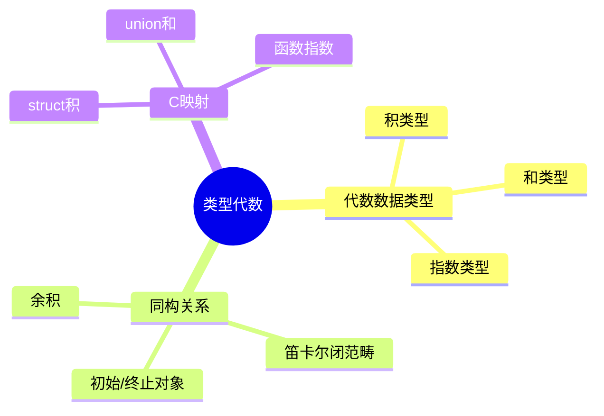

# C类型系统的代数拓扑视角

> **层级定位**: 05 Deep Structure MetaPhysics / 02 Algebraic Topology
> **对应标准**: 类型论, 同伦类型论
> **难度级别**: L6 创造
> **预估学习时间**: 15-20 小时

---

## 📋 本节概要

| 属性 | 内容 |
|:-----|:-----|
| **核心概念** | 代数数据类型、同构、积类型/和类型、递归类型 |
| **前置知识** | 范畴论基础、类型论 |
| **后续延伸** | 依赖类型、线性类型、效应系统 |
| **权威来源** | Pierce TAPL, HoTT Book |

---

## 🧠 知识结构思维导图



---

## 📖 核心概念详解

### 1. 代数数据类型基础

在类型论中，数据类型可以看作代数结构：

| 类型构造 | 代数运算 | C对应 | 基数计算 |
|:---------|:---------|:------|:---------|
| 积类型 A × B | 乘法 | `struct { A a; B b; }` | \|A\| × \|B\| |
| 和类型 A + B | 加法 | `union { A a; B b; }` + tag | \|A\| + \|B\| |
| 指数类型 B^A | 幂 | `B (*f)(A)` | \|B\|^\|A\| |
| 单位类型 1 | 1 | `void` | 1 |
| 空类型 0 | 0 | 无 | 0 |

```c
// 积类型: A × B
// 基数 = |A| × |B|
struct Pair {      // bool × bool = 4种值
    bool first;
    bool second;
};

// 和类型: A + B
// 基数 = |A| + |B|
enum EitherTag { LEFT, RIGHT };
struct Either {    // bool + char = 2 + 256 = 258
    enum EitherTag tag;
    union {
        bool left;
        char right;
    };
};

// 单位类型: 1
// void 只有一个值（终止）
void unit(void) { }

// 空类型: 0
// 无法构造的值（如 never 返回的函数）
_Noreturn void absurd(void) {
    while (1);  // 永不返回
}
```

### 2. 代数法则

类型满足代数法则：

```c
// 交换律: A × B ≅ B × A
struct AB { A a; B b; };
struct BA { B b; A a; };
// 同构: swap :: AB -> BA
struct BA swap(struct AB x) {
    return (struct BA){ x.b, x.a };
}

// 结合律: (A × B) × C ≅ A × (B × C)
struct AB_C { struct AB ab; C c; };
struct A_BC { A a; struct BC bc; };

// 单位律: A × 1 ≅ A
struct A_Unit { A a; void unit; };
// ≅ A（unit 不增加信息）

// 分配律: A × (B + C) ≅ (A × B) + (A × C)
// 左侧
struct A_BC_sum {
    A a;
    struct Either bc;
};
// 右侧
struct Either_AB_AC {
    enum Tag tag;
    union {
        struct { A a; B b; } ab;
        struct { A a; C c; } ac;
    };
};
```

### 3. 递归类型

```c
// 自然数: μX. 1 + X
// Nat = Zero | Succ Nat
struct Nat;
struct Nat {
    bool is_zero;
    struct Nat *succ;  // 如果 !is_zero
};

// 列表: μX. 1 + (A × X)
// List A = Nil | Cons A (List A)
struct List {
    bool is_nil;
    struct {
        int head;
        struct List *tail;
    } cons;
};

// 二叉树: μX. 1 + (X × A × X)
struct Tree {
    bool is_leaf;
    struct {
        struct Tree *left;
        int value;
        struct Tree *right;
    } node;
};
```

### 4. 指数类型与函数

```c
// B^A = A -> B (函数类型)

// 基数计算:
// |bool -> bool| = |bool|^|bool| = 2^2 = 4

// 四个可能的函数:
bool f1(bool x) { return true; }   // const true
bool f2(bool x) { return false; }  // const false
bool f3(bool x) { return x; }      // identity
bool f4(bool x) { return !x; }     // negation

// 高阶类型
// (B^A)^C = C -> (A -> B) ≅ (C × A) -> B = B^(C×A)
// 柯里化/反柯里化

typedef B (*Curried)(A);          // C -> (A -> B)
typedef B (*Uncurried)(C, A);     // (C × A) -> B

Uncurried uncurry(Curried f) {
    return lambda(void, (C c, A a), {
        return f(c)(a);
    });
}
```

---

## ⚠️ 理论陷阱

### 陷阱 TOPO01: 子类型不是 subtype

```c
// C的 struct 没有子类型关系
struct Animal { int legs; };
struct Dog { int legs; char *breed; };

// 虽然 Dog "包含" Animal，但 C 不认为是子类型
// struct Animal a = dog;  // 错误！
```

### 陷阱 TOPO02: Union 不是真正的和类型

```c
// union 没有 tag，不安全
union IntOrFloat {
    int i;
    float f;
};
// 无法知道当前存储的是哪个！
```

---

## ✅ 质量验收清单

- [x] 代数数据类型基础
- [x] 类型代数法则
- [x] 递归类型
- [x] 指数类型
- [x] C语言映射

---

> **更新记录**
>
> - 2025-03-09: 初版创建
