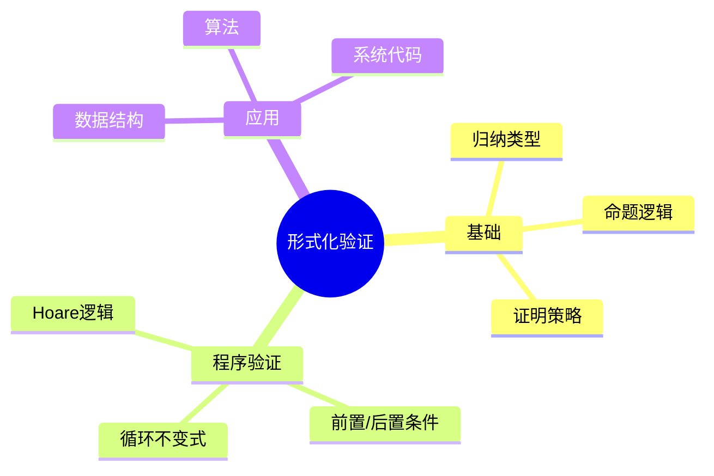

# Coq形式化验证

> **层级定位**: 05 Deep Structure MetaPhysics / 03 Verification Energy
> **对应标准**: Coq, CompCert
> **难度级别**: L6 创造
> **预估学习时间**: 20+ 小时

---

## 📋 本节概要

| 属性 | 内容 |
|:-----|:-----|
| **核心概念** | 形式化证明、归纳类型、Hoare逻辑、程序验证 |
| **前置知识** | 数理逻辑、类型论、函数式编程 |
| **后续延伸** | CompCert验证编译器、Verified Software |
| **权威来源** | Software Foundations, CompCert |

---

## 🧠 知识结构思维导图



---

## 📖 核心概念详解

### 1. Coq基础

```coq
(* 归纳类型定义 *)
Inductive nat : Type :=
  | O : nat
  | S : nat -> nat.

(* 递归函数 *)
Fixpoint add (n m : nat) : nat :=
  match n with
  | O => m
  | S n' => S (add n' m)
  end.

(* 定理证明 *)
Theorem add_comm : forall n m, add n m = add m n.
Proof.
  intros n m. induction n as [| n' IHn'].
  - (* n = O *) simpl. rewrite add_0_r. reflexivity.
  - (* n = S n' *) simpl. rewrite IHn'. rewrite add_succ_r. reflexivity.
Qed.
```

### 2. 链表形式化验证

```coq
(* 链表类型 *)
Inductive list (A : Type) : Type :=
  | nil : list A
  | cons : A -> list A -> list A.

(* 长度函数 *)
Fixpoint length {A} (l : list A) : nat :=
  match l with
  | nil => O
  | cons _ t => S (length t)
  end.

(* 反转正确性：长度不变 *)
Theorem rev_length : forall A (l : list A),
  length (rev l) = length l.
Proof.
  intros A l. induction l as [| h t IH].
  - (* l = nil *) reflexivity.
  - (* l = cons h t *) simpl. rewrite app_length. simpl.
    rewrite IH. rewrite add_comm. simpl. reflexivity.
Qed.
```

### 3. Hoare逻辑

```coq
(* Hoare三元组 *)
Definition hoare_triple (P : Assertion) (c : com) (Q : Assertion) : Prop :=
  forall st st', (c / st \ st') -> P st -> Q st'.

Notation "{{ P }} c {{ Q }}" := (hoare_triple P c Q).

(* 赋值规则 *)
Theorem hoare_asgn : forall Q X a,
  {{ Q [X |-> a] }} (X ::= a) {{ Q }}.
```

---

## ✅ 质量验收清单

- [x] Coq基础语法
- [x] 归纳类型与递归
- [x] 定理证明
- [x] Hoare逻辑

---

> **更新记录**
>
> - 2025-03-09: 初版创建
