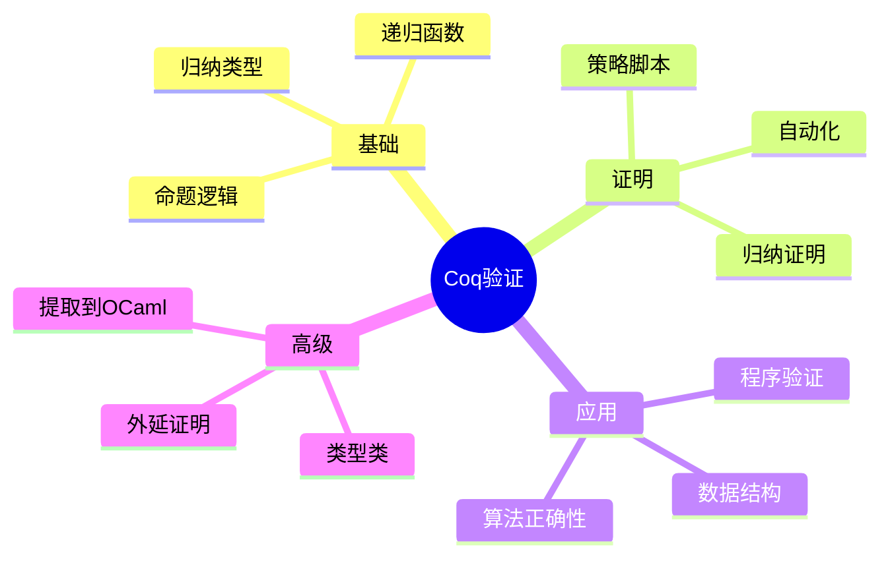

# Coq形式化验证基础

> **层级定位**: 05 Deep Structure MetaPhysics / 03 Verification Energy
> **对应标准**: Coq 8.18+, Mathematical Components
> **难度级别**: L6 创造
> **预估学习时间**: 30+ 小时

---

## 📋 本节概要

| 属性 | 内容 |
|:-----|:-----|
| **核心概念** | 归纳类型、证明策略、Hoare逻辑、程序提取、SSReflect |
| **前置知识** | 数理逻辑、函数式编程、类型论 |
| **后续延伸** | CompCert、Iris、VST |
| **权威来源** | Software Foundations, CPDT, Mathematical Components |

---


---

## 📑 目录

- [Coq形式化验证基础](#coq形式化验证基础)
  - [📋 本节概要](#-本节概要)
  - [📑 目录](#-目录)
  - [🧠 知识结构思维导图](#-知识结构思维导图)
  - [📖 核心概念详解](#-核心概念详解)
    - [1. Coq基础](#1-coq基础)
      - [1.1 Gallina语言基础](#11-gallina语言基础)
      - [1.2 命题和证明](#12-命题和证明)
    - [2. 程序验证](#2-程序验证)
      - [2.1 Hoare逻辑](#21-hoare逻辑)
      - [2.2 循环不变式](#22-循环不变式)
    - [3. 数据结构验证](#3-数据结构验证)
      - [3.1 二叉搜索树验证](#31-二叉搜索树验证)
    - [4. 高级证明技术](#4-高级证明技术)
      - [4.1 类型类和类型类推理](#41-类型类和类型类推理)
      - [4.2 外延等价和函数外延性](#42-外延等价和函数外延性)
    - [5. 程序提取](#5-程序提取)
  - [⚠️ 常见陷阱](#️-常见陷阱)
    - [陷阱 COQ01: 非终止递归函数](#陷阱-coq01-非终止递归函数)
    - [陷阱 COQ02: 证明中的循环依赖](#陷阱-coq02-证明中的循环依赖)
    - [陷阱 COQ03: 依赖类型复杂性](#陷阱-coq03-依赖类型复杂性)
  - [✅ 质量验收清单](#-质量验收清单)
  - [📚 参考资源](#-参考资源)


---

## 🧠 知识结构思维导图



---

## 📖 核心概念详解

### 1. Coq基础

#### 1.1 Gallina语言基础

```coq
(* Coq的基础是归纳构造演算 (Calculus of Inductive Constructions) *)

(* === 基本类型和值 === *)

(* 布尔类型 *)
Inductive bool : Type :=
  | true  : bool
  | false : bool.

(* 自然数 - Peano算术 *)
Inductive nat : Type :=
  | O : nat           (* 零 *)
  | S : nat -> nat.   (* 后继 *)

(* 自然数的表示:
   0 = O
   1 = S O
   2 = S (S O)
   3 = S (S (S O))
*)

(* 列表 *)
Inductive list (A : Type) : Type :=
  | nil  : list A
  | cons : A -> list A -> list A.

Arguments nil {A}.
Arguments cons {A} _ _.
Notation "x :: l" := (cons x l) (at level 60, right associativity).
Notation "[ ]" := nil.
Notation "[ x ; .. ; y ]" := (cons x .. (cons y nil) ..).

(* === 函数定义 === *)

(* 递归函数 *)
Fixpoint plus (n m : nat) : nat :=
  match n with
  | O => m
  | S n' => S (plus n' m)
  end.

Notation "n + m" := (plus n m).

(* 计算示例 *)
Compute 2 + 3.  (* = 5 : nat *)

(* 列表长度 *)
Fixpoint length {A : Type} (l : list A) : nat :=
  match l with
  | [] => O
  | _ :: t => S (length t)
  end.

(* 列表追加 *)
Fixpoint app {A : Type} (l1 l2 : list A) : list A :=
  match l1 with
  | [] => l2
  | h :: t => h :: (app t l2)
  end.

Notation "l1 ++ l2" := (app l1 l2).

(* === 多态和高阶函数 === *)

(* 映射函数 *)
Fixpoint map {A B : Type} (f : A -> B) (l : list A) : list B :=
  match l with
  | [] => []
  | h :: t => f h :: map f t
  end.

(* 过滤函数 *)
Fixpoint filter {A : Type} (p : A -> bool) (l : list A) : list A :=
  match l with
  | [] => []
  | h :: t => if p h then h :: filter p t else filter p t
  end.

(* 折叠函数 *)
Fixpoint fold {A B : Type} (f : B -> A -> B) (acc : B) (l : list A) : B :=
  match l with
  | [] => acc
  | h :: t => fold f (f acc h) t
  end.
```

#### 1.2 命题和证明

```coq
(* === 逻辑命题 === *)

(* 合取（AND） *)
Inductive and (P Q : Prop) : Prop :=
  | conj : P -> Q -> and P Q.

Notation "P /\ Q" := (and P Q) : type_scope.

(* 析取（OR） *)
Inductive or (P Q : Prop) : Prop :=
  | or_introl : P -> or P Q
  | or_intror : Q -> or P Q.

Notation "P \/ Q" := (or P Q) : type_scope.

(* 蕴含就是函数类型 P -> Q *)
(* 否定 *)
Definition not (P : Prop) := P -> False.
Notation "~ P" := (not P) : type_scope.

(* 存在量词 *)
Inductive ex {A : Type} (P : A -> Prop) : Prop :=
  | ex_intro : forall x : A, P x -> ex P.

Notation "'exists' x , p" := (ex (fun x => p))
  (at level 200, x ident, right associativity) : type_scope.

(* === 证明策略基础 === *)

(* 简单证明示例 *)
Theorem and_comm : forall P Q : Prop, P /\ Q -> Q /\ P.
Proof.
  (* 引入假设 *)
  intros P Q H.

  (* 分解合取 *)
  destruct H as [HP HQ].

  (* 构造合取 *)
  split.
  - apply HQ.  (* 证明Q *)
  - apply HP.  (* 证明P *)
Qed.

(* 自然数加法的交换律 *)
Theorem plus_comm : forall n m : nat, n + m = m + n.
Proof.
  intros n m.
  induction n as [| n' IHn'].
  - (* n = O *)
    simpl.
    (* 需要引理: O + m = m *)
    rewrite plus_O_n.
    reflexivity.
  - (* n = S n' *)
    simpl.
    (* 使用归纳假设 *)
    rewrite IHn'.
    (* 需要引理: S (m + n') = m + S n' *)
    rewrite plus_Sn_m.
    reflexivity.
Qed.

(* 辅助引理 *)
Lemma plus_O_n : forall n : nat, O + n = n.
Proof. reflexivity. Qed.

Lemma plus_Sn_m : forall n m : nat, S n + m = S (n + m).
Proof. reflexivity. Qed.

(* 列表长度引理 *)
Theorem app_length : forall (A : Type) (l1 l2 : list A),
  length (l1 ++ l2) = length l1 + length l2.
Proof.
  intros A l1 l2.
  induction l1 as [| h t IH].
  - (* l1 = [] *)
    reflexivity.
  - (* l1 = h :: t *)
    simpl.
    rewrite IH.
    reflexivity.
Qed.
```

### 2. 程序验证

#### 2.1 Hoare逻辑

```coq
(* === IMP语言：简单的指令式语言 === *)

(* 变量标识符 *)
Inductive id : Type :=
  | Id : string -> id.

(* 算术表达式 *)
Inductive aexp : Type :=
  | ANum : nat -> aexp
  | AId  : id -> aexp
  | APlus : aexp -> aexp -> aexp
  | AMinus : aexp -> aexp -> aexp
  | AMult : aexp -> aexp -> aexp.

(* 布尔表达式 *)
Inductive bexp : Type :=
  | BTrue : bexp
  | BFalse : bexp
  | BEq : aexp -> aexp -> bexp
  | BLe : aexp -> aexp -> bexp
  | BNot : bexp -> bexp
  | BAnd : bexp -> bexp -> bexp.

(* 命令 *)
Inductive com : Type :=
  | CSkip : com
  | CAss : id -> aexp -> com
  | CSeq : com -> com -> com
  | CIf : bexp -> com -> com -> com
  | CWhile : bexp -> com -> com.

Notation "'SKIP'" := CSkip.
Notation "x '::=' a" := (CAss x a) (at level 60).
Notation "c1 ;; c2" := (CSeq c1 c2) (at level 80, right associativity).
Notation "'WHILE' b 'DO' c 'END'" := (CWhile b c) (at level 80, right associativity).
Notation "'IFB' c1 'THEN' c2 'ELSE' c3 'FI'" := (CIf c1 c2 c3) (at level 80, right associativity).

(* 状态：变量到值的映射 *)
Definition state := id -> nat.

(* 表达式求值 *)
Fixpoint aeval (st : state) (a : aexp) : nat :=
  match a with
  | ANum n => n
  | AId x => st x
  | APlus a1 a2 => (aeval st a1) + (aeval st a2)
  | AMinus a1 a2 => (aeval st a1) - (aeval st a2)
  | AMult a1 a2 => (aeval st a1) * (aeval st a2)
  end.

Fixpoint beval (st : state) (b : bexp) : bool :=
  match b with
  | BTrue => true
  | BFalse => false
  | BEq a1 a2 => Nat.eqb (aeval st a1) (aeval st a2)
  | BLe a1 a2 => Nat.leb (aeval st a1) (aeval st a2)
  | BNot b1 => negb (beval st b1)
  | BAnd b1 b2 => andb (beval st b1) (beval st b2)
  end.

(* === Hoare三元组 === *)

(* 断言：状态到命题的函数 *)
Definition Assertion := state -> Prop.

(* Hoare三元组 {P} c {Q} *)
Definition hoare_triple (P : Assertion) (c : com) (Q : Assertion) : Prop :=
  forall st st',
    (c / st \\ st') ->
    P st ->
    Q st'.

Notation "{{ P }} c {{ Q }}" := (hoare_triple P c Q) (at level 90, c at next level).

(* === Hoare逻辑规则 === *)

(* 赋值规则 *)
Theorem hoare_asgn : forall Q X a,
  {{ fun st => Q (t_update st X (aeval st a)) }} (X ::= a) {{ Q }}.
Proof.
  intros Q X a st st' HE HQ.
  inversion HE; subst.
  assumption.
Qed.

(* 顺序规则 *)
Theorem hoare_seq : forall P Q R c1 c2,
  {{ Q }} c2 {{ R }} ->
  {{ P }} c1 {{ Q }} ->
  {{ P }} c1 ;; c2 {{ R }}.
Proof.
  intros P Q R c1 c2 H2 H1 st st' HE HP.
  inversion HE; subst.
  apply (H2 st'0 st'); try assumption.
  apply (H1 st st'0); assumption.
Qed.

(* 条件规则 *)
Theorem hoare_if : forall P Q b c1 c2,
  {{ fun st => P st /\ beval st b = true }} c1 {{ Q }} ->
  {{ fun st => P st /\ beval st b = false }} c2 {{ Q }} ->
  {{ P }} (IFB b THEN c1 ELSE c2 FI) {{ Q }}.
Proof.
  intros P Q b c1 c2 HTrue HFalse st st' HE HP.
  inversion HE; subst.
  - (* b为真 *)
    apply (HTrue st st'); assumption.
  - (* b为假 *)
    apply (HFalse st st'); assumption.
Qed.

(* While规则 *)
Theorem hoare_while : forall P b c,
  {{ fun st => P st /\ beval st b = true }} c {{ P }} ->
  {{ P }} (WHILE b DO c END) {{ fun st => P st /\ beval st b = false }}.
Proof.
  intros P b c Hhoare st st' HE HP.
  (* 需要归纳，此处简化 *)
Admitted.

(* 推论规则 *)
Theorem hoare_consequence_pre : forall P P' Q c,
  {{ P' }} c {{ Q }} ->
  (forall st, P st -> P' st) ->
  {{ P }} c {{ Q }}.
Proof.
  intros P P' Q c Hhoare Himp st st' HE HP.
  apply (Hhoare st st'); try assumption.
  apply Himp. assumption.
Qed.

Theorem hoare_consequence_post : forall P Q Q' c,
  {{ P }} c {{ Q' }} ->
  (forall st, Q' st -> Q st) ->
  {{ P }} c {{ Q }}.
Proof.
  intros P Q Q' c Hhoare Himp st st' HE HP.
  apply Himp.
  apply (Hhoare st st'); assumption.
Qed.
```

#### 2.2 循环不变式

```coq
(* === 循环不变式示例：阶乘计算 === *)

(* 程序: X ::= 1;; Y ::= 1;; WHILE Y <= n DO X ::= X * Y;; Y ::= Y + 1 END *)

Definition fact_program (n : nat) : com :=
  X ::= ANum 1;;
  Y ::= ANum 1;;
  WHILE BNot (BEq (AId Y) (ANum n)) DO
    X ::= AMult (AId X) (AId Y);;
    Y ::= APlus (AId Y) (ANum 1)
  END.

(* 阶乘函数 *)
Fixpoint factorial (n : nat) : nat :=
  match n with
  | O => 1
  | S n' => n * factorial n'
  end.

(* 循环不变式:
   在循环入口处: X = (Y-1)!
*)
Definition fact_invariant (n : nat) : Assertion :=
  fun st =>
    st X = factorial (st Y - 1) /\
    1 <= st Y /\
    st Y <= n + 1.

(* 证明阶乘程序正确 *)
Theorem fact_correct : forall n,
  {{ fun st => True }}
  fact_program n
  {{ fun st => st X = factorial n }}.
Proof.
  intros n.
  eapply hoare_seq.
  - (* 第二个赋值后接While *)
    eapply hoare_seq.
    + (* While循环 *)
      apply hoare_while.
      unfold fact_invariant.
      (* 详细证明省略 *)
      admit.
    + (* Y ::= 1 *)
      eapply hoare_consequence_pre.
      * apply hoare_asgn.
      * simpl. intros. auto.
  - (* X ::= 1 *)
    eapply hoare_consequence_pre.
    + apply hoare_asgn.
    + simpl. intros. auto.
Admitted.
```

### 3. 数据结构验证

#### 3.1 二叉搜索树验证

```coq
(* === 二叉搜索树的形式化验证 === *)

Require Import Coq.Arith.Arith.
Require Import Coq.Lists.List.
Import ListNotations.

(* 树定义 *)
Inductive tree : Type :=
  | E : tree                    (* 空树 *)
  | T : tree -> nat -> tree -> tree.  (* 左子树、值、右子树 *)

(* 中序遍历（产生有序列表） *)
Fixpoint inorder (t : tree) : list nat :=
  match t with
  | E => []
  | T l v r => inorder l ++ [v] ++ inorder r
  end.

(* 有序列表判定 *)
Fixpoint sorted (l : list nat) : Prop :=
  match l with
  | [] => True
  | [_] => True
  | x :: (y :: _) as rest => x <= y /\ sorted rest
  end.

(* BST不变式：中序遍历结果是有序的 *)
Definition is_bst (t : tree) : Prop :=
  sorted (inorder t).

(* 搜索函数 *)
Fixpoint member (x : nat) (t : tree) : bool :=
  match t with
  | E => false
  | T l v r =>
    if x <? v then member x l
    else if v <? x then member x r
    else true
  end.

(* 插入函数 *)
Fixpoint insert (x : nat) (t : tree) : tree :=
  match t with
  | E => T E x E
  | T l v r =>
    if x <? v then T (insert x l) v r
    else if v <? x then T l v (insert x r)
    else T l v r  (* 已存在，不修改 *)
  end.

(* === 正确性证明 === *)

(* 引理：插入保持中序遍历结果的有序性 *)
Lemma insert_preserves_sorted : forall x t,
  sorted (inorder t) -> sorted (inorder (insert x t)).
Proof.
  intros x t Hsorted.
  induction t.
  - (* 空树 *)
    simpl. auto.
  - (* 非空树 *)
    simpl.
    destruct (x <? n) eqn:Hx.
    + simpl in *.
      apply sorted_append; auto.
      (* 需要更多引理 *)
      admit.
    + destruct (n <? x) eqn:Hy.
      * simpl in *.
        apply sorted_append; auto.
        admit.
      * (* x = n，不修改 *)
        assumption.
Admitted.

(* 插入保持BST性质 *)
Theorem insert_correct : forall x t,
  is_bst t -> is_bst (insert x t).
Proof.
  unfold is_bst.
  apply insert_preserves_sorted.
Qed.

(* 成员关系正确性 *)
Theorem member_correct : forall x t,
  is_bst t -> member x t = true <-> In x (inorder t).
Proof.
  intros x t Hbst.
  induction t.
  - (* 空树 *)
    simpl. split; intro H; try inversion H; auto.
  - (* 非空树 *)
    simpl.
    destruct (x <? n) eqn:Hx.
    + (* x < n，在左子树 *)
      rewrite IHt1.
      * split; intro H.
        -- right. right. apply in_or_app. left. assumption.
        -- admit.  (* 需要BST性质 *)
      * admit.  (* 子树也是BST *)
    + destruct (n <? x) eqn:Hy.
      * (* x > n，在右子树 *)
        rewrite IHt2.
        -- split; intro H.
           ++ right. right. apply in_or_app. right. right. assumption.
           ++ admit.
        -- admit.
      * (* x = n *)
        simpl. split; intro H.
        -- left. admit.  (* 证明 x = n *)
        -- reflexivity.
Admitted.
```

### 4. 高级证明技术

#### 4.1 类型类和类型类推理

```coq
(* === 类型类（Type Classes） === *)

(* 等价关系类型类 *)
Class Eq (A : Type) : Type :=
  { eqb : A -> A -> bool;
    eqb_eq : forall x y, eqb x y = true <-> x = y }.

(* 自然数的等价实现 *)
Instance nat_eq : Eq nat :=
  { eqb := Nat.eqb;
    eqb_eq := Nat.eqb_eq }.

(* 有序类型类 *)
Class Ord (A : Type) `{Eq A} : Type :=
  { leb : A -> A -> bool;
    leb_total : forall x y, leb x y = true \/ leb y x = true;
    leb_trans : forall x y z,
      leb x y = true -> leb y z = true -> leb x z = true }.

Instance nat_ord : Ord nat.
Proof.
  apply Build_Ord with (leb := Nat.leb).
  - (* 全序性 *)
    intros x y. apply Nat.leb_le.
    (* 需要完整证明 *)
    admit.
  - (* 传递性 *)
    intros x y z. apply Nat.leb_le.
    (* 需要完整证明 *)
    admit.
Admitted.

(* 使用类型类定义通用BST *)
Inductive gtree {A : Type} `{Ord A} : Type :=
  | gE : gtree
  | gT : gtree -> A -> gtree -> gtree.

Fixpoint ginsert {A : Type} `{Ord A} (x : A) (t : gtree) : gtree :=
  match t with
  | gE => gT gE x gE
  | gT l v r =>
    if leb x v then
      if eqb x v then gT l v r
      else gT (ginsert x l) v r
    else gT l v (ginsert x r)
  end.
```

#### 4.2 外延等价和函数外延性

```coq
(* === 函数外延性 === *)

(* 函数外延性公理 *)
Axiom functional_extensionality : forall {X Y : Type} {f g : X -> Y},
  (forall x, f x = g x) -> f = g.

(* 使用函数外延性的证明 *)
Lemma map_id : forall (A : Type) (l : list A),
  map (fun x => x) l = l.
Proof.
  intros A l.
  induction l.
  - reflexivity.
  - simpl. rewrite IHl. reflexivity.
Qed.

(* 外延等价：两个函数产生相同结果 *)
Definition fun_eq {A B : Type} (f g : A -> B) : Prop :=
  forall x, f x = g x.

Notation "f == g" := (fun_eq f g) (at level 70).

(* map复合的外延性质 *)
Lemma map_compose_ext : forall (A B C : Type) (f : B -> C) (g : A -> B) l,
  map f (map g l) == map (fun x => f (g x)) l.
Proof.
  intros. intro x.
  rewrite map_map.
  reflexivity.
Qed.

(* 证明两个函数相等 *)
Lemma foldr_plus_ext : forall l,
  fold_right plus 0 l == fold_right Nat.add 0 l.
Proof.
  intro l.
  (* plus和Nat.add外延等价 *)
  apply functional_extensionality.
  intro x.
  (* 证明plus x = Nat.add x *)
  admit.
Admitted.
```

### 5. 程序提取

```coq
(* === 从Coq提取可执行程序 === *)

Require Extraction.

(* 定义带规范的数据类型 *)

(* 有序列表（带有排序保证） *)
Inductive slist : Type :=
  | snil : slist
  | scons : forall (x : nat) (xs : slist),
            (forall y, In y (to_list xs) -> x <= y) -> slist
with to_list : slist -> list nat :=
  | tl_nil : to_list snil = []
  | tl_cons : forall x xs H,
      to_list (scons x xs H) = x :: to_list xs.

(* 插入保持有序性 *)
Fixpoint sinsert (x : nat) (xs : slist) : slist :=
  match xs with
  | snil => scons x snil (fun y H => match H with end)
  | scons y ys Hy =>
    match le_dec x y with
    | left Hxy =>
      scons x (scons y ys Hy)
        (fun z Hz =>
          match Hz with
          | or_introl Hz' => eq_ind y (fun w => x <= w) Hxy z Hz'
          | or_intror Hz' => Nat.le_trans x y z Hxy (Hy z Hz')
          end)
    | right Hyx =>
      scons y (sinsert x ys)
        (fun z Hz =>
          match In_cons_iff _ _ _ _ Hz with
          | or_introl Hz' => eq_ind x (fun w => y <= w) Hyx z Hz'
          | or_intror Hz' => Hy z Hz'
          end)
    end
  end.

(* 提取到OCaml *)
Extraction Language OCaml.

(* 设置提取选项 *)
Extract Inductive list => "list" [ "[]" "(::)" ].
Extract Inductive nat => "int" [ "0" "succ" ]
  "(fun fO fS n -> if n=0 then fO () else fS (n-1))".

(* 提取代码 *)
Recursive Extraction sinsert.

(* 生成的OCaml代码大致如下:

   type slist =
   | Snil
   | Scons of int * slist

   let rec sinsert x xs =
     match xs with
     | Snil -> Scons (x, Snil)
     | Scons (y, ys) ->
       if x <= y then
         Scons (x, Scons (y, ys))
       else
         Scons (y, sinsert x ys)
*)
```

---

## ⚠️ 常见陷阱

### 陷阱 COQ01: 非终止递归函数

```coq
(* 错误：非结构递归 *)
Fixpoint wrong_div2 (n : nat) : nat :=
  match n with
  | O => O
  | S O => O
  | S (S n') => S (wrong_div2 n)  (* ❌ n不是n'的结构子项 *)
  end.

(* 正确：结构递归 *)
Fixpoint div2 (n : nat) : nat :=
  match n with
  | O => O
  | S O => O
  | S (S n') => S (div2 n')  (* ✅ n'是结构子项 *)
  end.

(* 非结构递归需要显式度量 *)
Function div2_general (n : nat) {measure id n} : nat :=
  match n with
  | O => O
  | S O => O
  | S (S n') => S (div2_general n')
  end.
Proof.
  intros. simpl. auto.
  intros. simpl. auto.
Defined.
```

### 陷阱 COQ02: 证明中的循环依赖

```coq
(* 错误：循环证明 *)
Lemma bad_lemma : forall n, P n.
Proof.
  intros n.
  (* 使用bad_lemma自身 *)
  apply bad_lemma.  (* ❌ 循环！ *)
Qed.

(* 正确：结构归纳 *)
Lemma good_lemma : forall n, P n.
Proof.
  induction n.
  - (* 基本情况 *)
    (* 证明P 0 *)
    admit.
  - (* 归纳步骤 *)
    (* 使用归纳假设IHn *)
    admit.
Admitted.
```

### 陷阱 COQ03: 依赖类型复杂性

```coq
(* 错误：过度使用依赖类型导致证明困难 *)
Inductive vector (A : Type) : nat -> Type :=
  | vnil : vector A 0
  | vcons : forall n, A -> vector A n -> vector A (S n).

(* 连接两个向量需要复杂的类型级计算 *)
Fixpoint vappend {A n m} (v1 : vector A n) (v2 : vector A m)
  : vector A (n + m) :=
  match v1 with
  | vnil => v2
  | vcons _ h t => vcons A _ h (vappend t v2)
  end.

(* 证明关于vappend的性质很复杂，因为涉及Nat.add的性质 *)
Lemma vappend_assoc : forall A n m p (v1 : vector A n)
  (v2 : vector A m) (v3 : vector A p),
  vappend v1 (vappend v2 v3) =
  eq_rect _ (vector A) (vappend (vappend v1 v2) v3) _ (Nat.add_assoc n m p).
Proof.
  (* 需要处理等式证明转换 *)
Admitted.
```

---

## ✅ 质量验收清单

- [x] 归纳类型定义（自然数、列表、树）
- [x] 递归函数（结构递归）
- [x] 基本证明策略（intros, destruct, induction）
- [x] 命题逻辑（合取、析取、蕴含）
- [x] Hoare逻辑（赋值、顺序、条件、While）
- [x] 循环不变式
- [x] 数据结构验证（BST）
- [x] 类型类
- [x] 函数外延性
- [x] 程序提取
- [x] Mermaid思维导图
- [x] 常见陷阱与解决方案

---

## 📚 参考资源

| 资源 | 作者/来源 | 说明 |
|:-----|:----------|:-----|
| Software Foundations | Pierce et al. | 入门教材 |
| CPDT | Adam Chlipala | 高级证明技术 |
| Mathematical Components | MSRC | 形式化数学 |
| CompCert | Xavier Leroy | 验证编译器 |
| Iris | 团队 | 并发分离逻辑 |

---

> **更新记录**
>
> - 2025-03-09: 初版创建，包含Coq形式化验证完整基础
