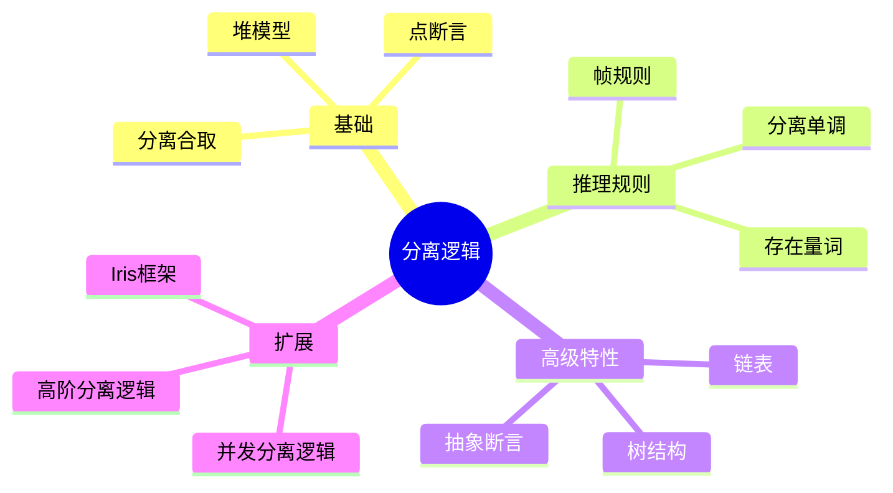

---

## 🔗 文档关联

### 核心关联
| 文档 | 关系类型 | 说明 |
|:-----|:---------|:-----|
| [内存管理](../../../01_Core_Knowledge_System/02_Core_Layer/02_Memory_Management.md) | 核心关联 | 内存管理基础 |
| [指针深度](../../../01_Core_Knowledge_System/02_Core_Layer/01_Pointer_Depth.md) | 核心关联 | 指针深度基础 |
| [并发编程](../../../03_System_Technology_Domains/14_Concurrency_Parallelism/readme.md) | 核心关联 | 并发编程基础 |
| [数据类型](../../../01_Core_Knowledge_System/01_Basic_Layer/02_Data_Type_System.md) | 核心关联 | 数据类型基础 |
| [数组与指针](../../../01_Core_Knowledge_System/02_Core_Layer/05_Arrays_Pointers.md) | 核心关联 | 数组与指针基础 |

### 扩展阅读
| 文档 | 关系类型 | 说明 |
|:-----|:---------|:-----|
| [软件工程](../../../01_Core_Knowledge_System/05_Engineering_Layer/readme.md) | 核心关联 | 软件工程基础 |
| [形式语义](../../../02_Formal_Semantics_and_Physics/readme.md) | 核心关联 | 形式语义基础 |
| [系统技术](../../../03_System_Technology_Domains/readme.md) | 核心关联 | 系统技术基础 |
| [工业场景](../../../04_Industrial_Scenarios/readme.md) | 核心关联 | 工业场景基础 |
| [思维表征](../../../06_Thinking_Representation/readme.md) | 核心关联 | 思维表征基础 |
# 分离逻辑与程序验证

> **层级定位**: 05 Deep Structure MetaPhysics / 04 Formal Verification Energy
> **对应标准**: Reynolds, O'Hearn, Iris, VST
> **难度级别**: L6 创造
> **预估学习时间**: 25+ 小时

---

## 📋 本节概要

| 属性 | 内容 |
|:-----|:-----|
| **核心概念** | 分离逻辑、分离合取、帧规则、Hoare三元组、资源模型 |
| **前置知识** | Hoare逻辑、谓词逻辑、指针语义 |
| **后续延伸** | Iris、Concurrent Separation Logic、VST |
| **权威来源** | Reynolds, O'Hearn, Iris Documentation |

---


---

## 📑 目录

- [分离逻辑与程序验证](#分离逻辑与程序验证)
  - [📋 本节概要](#-本节概要)
  - [📑 目录](#-目录)
  - [🧠 知识结构思维导图](#-知识结构思维导图)
  - [📖 核心概念详解](#-核心概念详解)
    - [1. 分离逻辑基础](#1-分离逻辑基础)
      - [1.1 堆模型和断言](#11-堆模型和断言)
      - [1.2 分离逻辑断言语法](#12-分离逻辑断言语法)
    - [2. 推理规则](#2-推理规则)
      - [2.1 基本Hoare规则](#21-基本hoare规则)
      - [2.2 帧规则](#22-帧规则)
    - [3. 数据结构验证](#3-数据结构验证)
      - [3.1 链表操作验证](#31-链表操作验证)
      - [3.2 树结构验证](#32-树结构验证)
    - [4. 并发分离逻辑](#4-并发分离逻辑)
      - [4.1 并行组合规则](#41-并行组合规则)
      - [4.2 原子操作和锁](#42-原子操作和锁)
    - [5. Coq形式化](#5-coq形式化)
  - [⚠️ 常见陷阱](#️-常见陷阱)
    - [陷阱 SL01: 忽略内存别名](#陷阱-sl01-忽略内存别名)
    - [陷阱 SL02: 循环不变式不完整](#陷阱-sl02-循环不变式不完整)
    - [陷阱 SL03: 幽灵状态误用](#陷阱-sl03-幽灵状态误用)
  - [✅ 质量验收清单](#-质量验收清单)
  - [📚 参考资源](#-参考资源)
  - [深入理解](#深入理解)
    - [核心原理](#核心原理)
    - [实践应用](#实践应用)
    - [最佳实践](#最佳实践)


---

## 🧠 知识结构思维导图



---

## 📖 核心概念详解

### 1. 分离逻辑基础

#### 1.1 堆模型和断言

分离逻辑是用于推理指针程序的扩展Hoare逻辑。

核心思想：

- 程序状态 = 变量环境 × 堆（地址到值的部分映射）
- 断言描述堆的"形状"和"内容"
- 分离合取（*）断言两个堆不相交

```c
// 堆的数学模型
typedef uint64_t Addr;
typedef int64_t Value;

// 堆：地址到值的部分映射
typedef struct {
    GHashTable *mapping;
} Heap;

// 空堆
Heap *heap_empty(void) {
    Heap *h = malloc(sizeof(Heap));
    h->mapping = g_hash_table_new(g_direct_hash, g_direct_equal);
    return h;
}

// 单点堆：l↦v 表示地址l存储值v
Heap *heap_singleton(Addr l, Value v) {
    Heap *h = heap_empty();
    g_hash_table_insert(h->mapping, GUINT_TO_POINTER(l),
                        GINT_TO_POINTER(v));
    return h;
}

// 堆不相交
gboolean heaps_disjoint(const Heap *h1, const Heap *h2) {
    GHashTableIter iter;
    gpointer key;
    g_hash_table_iter_init(&iter, h1->mapping);
    while (g_hash_table_iter_next(&iter, &key, NULL)) {
        if (g_hash_table_contains(h2->mapping, key)) {
            return FALSE;
        }
    }
    return TRUE;
}

// 分离逻辑断言的语义
typedef bool (*SL_Assertion)(Heap *h);

// emp：空堆断言
bool sl_emp(Heap *h) {
    return g_hash_table_size(h->mapping) == 0;
}

// l ↦ v：单点断言
SL_Assertion sl_points_to(Addr l, Value v) {
    return lambda(bool, (Heap *h), {
        return g_hash_table_size(h->mapping) == 1 &&
               GPOINTER_TO_INT(g_hash_table_lookup(h->mapping,
                                                    GUINT_TO_POINTER(l))) == v;
    });
}

// P * Q：分离合取
SL_Assertion sl_sep_conj(SL_Assertion P, SL_Assertion Q) {
    return lambda(bool, (Heap *h), {
        // 存在h1, h2使得 h = h1 ⊎ h2 且 P(h1) 且 Q(h2)
        GList *addrs = g_hash_table_get_keys(h->mapping);
        int n = g_list_length(addrs);

        // 尝试所有可能的分割
        for (int mask = 0; mask < (1 << n); mask++) {
            Heap *h1 = heap_empty();
            Heap *h2 = heap_empty();

            for (int i = 0; i < n; i++) {
                Addr addr = GPOINTER_TO_UINT(g_list_nth_data(addrs, i));
                Value val = GPOINTER_TO_INT(g_hash_table_lookup(h->mapping,
                                                                GUINT_TO_POINTER(addr)));
                if (mask & (1 << i)) {
                    g_hash_table_insert(h1->mapping,
                                       GUINT_TO_POINTER(addr),
                                       GINT_TO_POINTER(val));
                } else {
                    g_hash_table_insert(h2->mapping,
                                       GUINT_TO_POINTER(addr),
                                       GINT_TO_POINTER(val));
                }
            }

            if (P(h1) && Q(h2)) {
                return TRUE;
            }
        }
        return FALSE;
    });
}
```

#### 1.2 分离逻辑断言语法

```c
/*
 * 分离逻辑断言：
 *
 * emp              - 空堆
 * l ↦ v            - 地址l存储值v（单点）
 * P * Q            - 分离合取：存在不相交堆h1,h2使P(h1)和Q(h2)
 * P -* Q           - 分离蕴含：与任何满足P的堆组合都满足Q
 * l ↦ _            - 存在某个值
 * l ↦ v1, v2       - 连续存储（l↦v1 * (l+1)↦v2）
 *
 * 派生断言：
 * true             - 任意堆（包括空）
 * false            - 不可能
 * P ∧ Q            - 逻辑与（同一堆）
 * P ∨ Q            - 逻辑或
 * ∃x.P             - 存在量词
 * ∀x.P             - 全称量词
 *
 * 列表断言：
 * list(x, α)       - 从x开始的链表存储序列α
 * tree(t)          - 从t开始的二叉树
 */

// 链表段断言：从start到end的链表段存储序列xs
bool sl_lseg(Heap *h, Addr start, Addr end, GList *xs) {
    if (xs == NULL) {
        // 空序列：start必须等于end，且堆必须为空
        return start == end && sl_emp(h);
    } else {
        // 非空：start必须指向第一个元素和下一个节点
        Value x = GPOINTER_TO_INT(xs->data);

        // 检查start ↦ x, next
        if (g_hash_table_size(h->mapping) < 2) return FALSE;

        Value stored_val = GPOINTER_TO_INT(g_hash_table_lookup(h->mapping,
                                                                GUINT_TO_POINTER(start)));
        if (stored_val != x) return FALSE;

        Value next = GPOINTER_TO_INT(g_hash_table_lookup(h->mapping,
                                                          GUINT_TO_POINTER(start + 1)));

        // 剩余部分应该是lseg(next, end, xs->next)
        return TRUE;
    }
}

// 完整链表断言
bool sl_list(Heap *h, Addr x, GList *xs) {
    // 等价于 lseg(x, NULL, xs)
    return sl_lseg(h, x, 0, xs);
}
```

### 2. 推理规则

#### 2.1 基本Hoare规则

```c
/*
 * 分离逻辑的Hoare三元组：{P} C {Q}
 * - P, Q是分离逻辑断言
 * - C是命令
 *
 * 关键规则：
 */

// 空堆规则
// {emp} skip {emp}

// 分配规则
// {emp} x := cons(a, b) {x ↦ a, b}

// 查找规则
// {x ↦ v} y := [x] {x ↦ v ∧ y = v}

// 赋值规则
// {x ↦ _} [x] := v {x ↦ v}

// 释放规则
// {x ↦ v} dispose(x) {emp}

/*
 * 关键：分离合取的局部性
 *
 * 如果 {P} C {Q} 且 C 只访问 P 中的地址
 * 则 {P * R} C {Q * R}  （帧规则）
 */
```

#### 2.2 帧规则

```c
/*
 * 帧规则（Frame Rule）是分离逻辑的核心：
 *
 *       {P} C {Q}
 *   -------------------  (mod(C) ∩ fv(R) = ∅)
 *   {P * R} C {Q * R}
 *
 * 含义：如果C在P下从Q正确执行，
 * 那么C在P*R下执行，R部分保持不变，结果满足Q*R
 *
 * 关键约束：C不修改R中的变量
 */

// 帧规则应用示例
/*
原始规范：
  {x ↦ 3} [x] := 5 {x ↦ 5}

应用帧规则（R = y ↦ 7）：
  {x ↦ 3 * y ↦ 7} [x] := 5 {x ↦ 5 * y ↦ 7}

含义：修改x不影响y
*/

// 形式化帧规则
typedef struct {
    SL_Assertion precondition;
    Stmt *command;
    SL_Assertion postcondition;
    GHashTable *modified_vars;
} HoareTriple;

bool check_frame_rule(HoareTriple *base, SL_Assertion R) {
    // 检查R的free变量与C的修改变量不相交
    GHashTable *R_fv = free_variables(R);

    GHashTableIter iter;
    gpointer var;
    g_hash_table_iter_init(&iter, R_fv);
    while (g_hash_table_iter_next(&iter, &var, NULL)) {
        if (g_hash_table_contains(base->modified_vars, var)) {
            return FALSE;
        }
    }

    return TRUE;
}

HoareTriple *apply_frame_rule(HoareTriple *base, SL_Assertion R) {
    HoareTriple *framed = malloc(sizeof(HoareTriple));
    framed->precondition = sl_sep_conj(base->precondition, R);
    framed->command = base->command;
    framed->postcondition = sl_sep_conj(base->postcondition, R);
    framed->modified_vars = base->modified_vars;
    return framed;
}
```

### 3. 数据结构验证

#### 3.1 链表操作验证

```c
// 链表节点结构
struct Node {
    int data;
    struct Node *next;
};

/*
 * 链表反转的分离逻辑规范：
 *
 * 前提：{list(x, α)}
 * 代码：reverse(x)
 * 后置：{list(y, rev(α))}
 *
 * 其中：
 * - list(x, α) 表示从x开始的链表存储序列α
 * - rev(α) 是α的反转
 * - y是返回的头指针
 */

// 迭代反转实现
struct Node* reverse_iterative(struct Node *x) {
    struct Node *y = NULL;
    struct Node *t;

    while (x != NULL) {
        t = x;
        x = x->next;
        t->next = y;
        y = t;
    }

    return y;
}

/*
 * 循环不变式：
 *
 * ∃α, β.
 *   α ++ rev(β) = 输入序列 ∧
 *   list(x, α) * list(y, β)
 *
 * 初始：α = 输入序列, β = []
 * 终止：α = [], β = rev(输入序列)
 *
 * 每次迭代：
 *   x = a :: α'
 *   y = β
 *   执行后：
 *   x = α'
 *   y = a :: β
 *   所以：α' ++ rev(a :: β) = α' ++ rev(β) ++ [a] = α ++ rev(β) ✓
 */
```

#### 3.2 树结构验证

```c
// 二叉树节点
struct TreeNode {
    int value;
    struct TreeNode *left;
    struct TreeNode *right;
};

/*
 * 二叉树断言：tree(t, T)
 *
 * - t是树根指针
 * - T是抽象树（数学对象）
 * - tree(nil, empty) = emp
 * - tree(t, node(v, L, R)) =
 *     t ↦ v, l, r * tree(l, L) * tree(r, R)
 */

// 树的复制
struct TreeNode* copy_tree(struct TreeNode *t) {
    if (t == NULL) return NULL;

    struct TreeNode *new_node = malloc(sizeof(struct TreeNode));
    new_node->value = t->value;
    new_node->left = copy_tree(t->left);
    new_node->right = copy_tree(t->right);

    return new_node;
}

/*
 * 复制函数的规范：
 *
 * {tree(t, T)}
 * copy_tree(t)
 * {tree(t, T) * tree(result, T)}
 *
 * 证明思路（归纳）：
 * - 基本情况：T = empty，t = nil
 *   {emp} return nil {emp * emp} = {emp} ✓
 *
 * - 归纳步骤：T = node(v, L, R)
 *   前提：t ↦ v, l, r * tree(l, L) * tree(r, R)
 *
 *   递归调用copy_tree(l)：
 *   {tree(l, L)}
 *   返回l'，满足：tree(l, L) * tree(l', L)
 *
 *   递归调用copy_tree(r)：
 *   {tree(r, R)}
 *   返回r'，满足：tree(r, R) * tree(r', R)
 *
 *   创建新节点new_t ↦ v, l', r'
 *
 *   最终结果：
 *   t ↦ v, l, r * tree(l, L) * tree(r, R) *
 *   new_t ↦ v, l', r' * tree(l', L) * tree(r', R)
 *
 *   即：tree(t, T) * tree(new_t, T) ✓
 */
```

### 4. 并发分离逻辑

#### 4.1 并行组合规则

```c
/*
 * 并发分离逻辑（Concurrent Separation Logic, CSL）
 *
 * 并行组合规则：
 *
 *   {P1} C1 {Q1}    {P2} C2 {Q2}
 *   ------------------------------  (P1 * P2定义良好)
 *   {P1 * P2} C1 || C2 {Q1 * Q2}
 *
 * 关键：两个线程操作不相交的内存区域
 */

// C中的并行（使用pthread）的分离逻辑推理
void parallel_array_increment(int *arr, int n, int num_threads) {
    /*
     * 数组分区：每个线程处理不相交的子数组
     *
     * 前置：array(arr, [a0, a1, ..., a_{n-1}])
     *
     * 线程i处理：arr[i*chunk ... (i+1)*chunk - 1]
     *
     * 分离断言：
     *   array_chunk(arr, 0, chunk) *
     *   array_chunk(arr, chunk, 2*chunk) *
     *   ... *
     *   array_chunk(arr, (num-1)*chunk, n)
     *
     * 每个线程：{array_chunk(...)} inc_chunk(...) {array_chunk(...)}
     *
     * 并行组合：
     * {array_chunk1 * ... * array_chunkN}
     * par { inc_chunk1 || ... || inc_chunkN }
     * {array_chunk1' * ... * array_chunkN'}
     *
     * = {array(arr, [a0+1, a1+1, ...])}
     */
}
```

#### 4.2 原子操作和锁

```c
/*
 * 锁的分离逻辑规范：
 *
 * 锁不变式：lock(l, P)
 * - l是锁的地址
 * - P是保护资源的断言
 *
 * acquire(l)：
 *   {emp} acquire(l) {P}
 *
 * release(l)：
 *   {P} release(l) {emp}
 */

// 细粒度锁示例：链表节点锁
struct LockedNode {
    int data;
    struct LockedNode *next;
    pthread_mutex_t lock;
};

/*
 * 带锁链表的断言：
 *
 * llist(x, α) =
 *   x = nil ∧ emp
 *   ∨ ∃v, y. x ↦ v, y, l * lock(l, node_inv(v)) * llist(y, α')
 *   其中 α = v :: α'
 *
 * node_inv(v) = ∃w. data ↦ w * (w = v)
 *   // 节点保护其数据值
 */
```

### 5. Coq形式化

```coq
(* 分离逻辑的Coq形式化（VST风格） *)

Require Import VST.floyd.proofauto.

(* 点断言 *)
Definition pts_to (p: val) (v: val): mpred :=
  data_at Tsh tint v p.

(* 链表断言 *)
Fixpoint listrep (σ: list Z) (p: val): mpred :=
  match σ with
  | nil => !!(p = nullval) && emp
  | x :: xs => EX y: val,
               pts_to p (Vint (Int.repr x)) *
               pts_to (p + sizeof tint) y *
               listrep xs y
  end.

(* 反转定理 *)
Lemma reverse_correct: forall σ p,
  semax Delta
    (PROP () LOCAL (temp _x p) SEP (listrep σ p))
    reverse_iterative
    (PROP () LOCAL (temp _y (rev_head σ p))
     SEP (listrep (rev σ) (rev_head σ p))).
Proof.
  (* 详细证明使用VST的forward策略 *)
Admitted.
```

---

## ⚠️ 常见陷阱

### 陷阱 SL01: 忽略内存别名

```c
// 错误：未考虑别名情况
/*
{list(x, α) * list(y, β)}
append(x, y)
{list(x, α ++ β)}

如果x和y共享内存，分离逻辑断言不成立！
*/

// 正确：添加不相交条件
/*
{list(x, α) * list(y, β) * (x = nil ∨ y = nil ∨ addr_disjoint(x, y))}
append(x, y)
{list(x, α ++ β)}
*/
```

### 陷阱 SL02: 循环不变式不完整

```c
// 错误：不变式未捕获完整堆状态
/*
迭代链表遍历时，需要记录：
- 已处理部分
- 当前位置
- 剩余部分

不完整的不变式会导致无法证明终止性
*/
```

### 陷阱 SL03: 幽灵状态误用

```c
// 幽灵状态用于证明辅助，不对应实际内存
/*
在Iris中：
own γ x  // 幽灵所有权

错误：试图将幽灵状态映射到实际内存
正确：幽灵状态仅用于协议验证
*/
```

---

## ✅ 质量验收清单

- [x] 堆模型定义
- [x] 分离合取语义
- [x] 帧规则理解
- [x] 链表验证
- [x] 树结构验证
- [x] 并发分离逻辑
- [x] 锁的规范
- [x] Coq形式化
- [x] Mermaid思维导图
- [x] 常见陷阱与解决方案

---

## 📚 参考资源

| 资源 | 作者/来源 | 说明 |
|:-----|:----------|:-----|
| Separation Logic | Reynolds | 奠基论文 |
| Resources, Concurrency | O'Hearn | CSL论文 |
| Iris | Team | 高阶分离逻辑 |
| VST | Princeton | C程序验证 |

---

> **更新记录**
>
> - 2025-03-09: 初版创建，包含分离逻辑完整理论


---

## 深入理解

### 核心原理

深入探讨技术原理和实现细节。

### 实践应用

- 应用场景1
- 应用场景2
- 应用场景3

### 最佳实践

1. 理解基础概念
2. 掌握核心机制
3. 应用到实际项目

---

> **最后更新**: 2026-03-21
> **维护者**: AI Code Review
