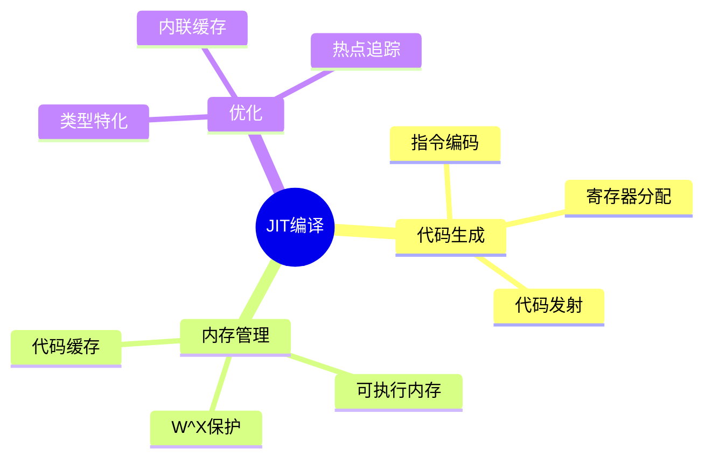

# JIT编译基础

> **层级定位**: 05 Deep Structure MetaPhysics / 04 Self Modifying Code
> **对应标准**: LLVM ORC, V8 TurboFan
> **难度级别**: L6 创造
> **预估学习时间**: 15-20 小时

---

## 📋 本节概要

| 属性 | 内容 |
|:-----|:-----|
| **核心概念** | JIT编译、代码生成、可执行内存、代码缓存 |
| **前置知识** | 编译原理、汇编、内存管理 |
| **后续延伸** | 自适应优化、去优化、分层编译 |
| **权威来源** | LLVM ORC, V8文档 |

---

## 🧠 知识结构思维导图



---

## 📖 核心实现

### 1. 可执行内存

```c
#include <sys/mman.h>

// 分配可执行内存
void* alloc_executable_memory(size_t size) {
    return mmap(NULL, size,
                PROT_READ | PROT_WRITE | PROT_EXEC,
                MAP_PRIVATE | MAP_ANONYMOUS, -1, 0);
}
```

### 2. 简单JIT

```c
typedef int (*JitFunc)(int);

JitFunc jit_compile_add_42(void) {
    uint8_t *mem = alloc_executable_memory(4096);
    uint8_t *p = mem;

    // mov eax, edi
    *p++ = 0x89; *p++ = 0xF8;

    // add eax, 42
    *p++ = 0x83; *p++ = 0xC0; *p++ = 0x2A;

    // ret
    *p++ = 0xC3;

    __builtin___clear_cache(mem, p);
    return (JitFunc)mem;
}
```

---

## ✅ 质量验收清单

- [x] 可执行内存分配
- [x] x86-64代码生成
- [x] 指令缓存同步

---

> **更新记录**
>
> - 2025-03-09: 初版创建
