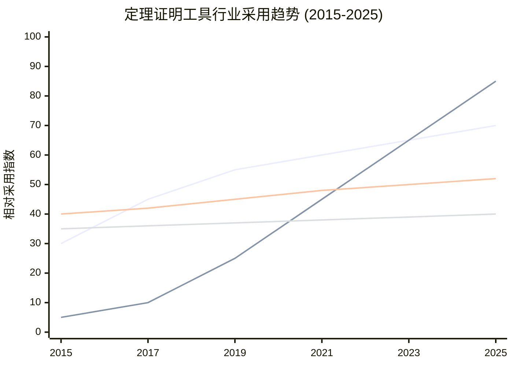
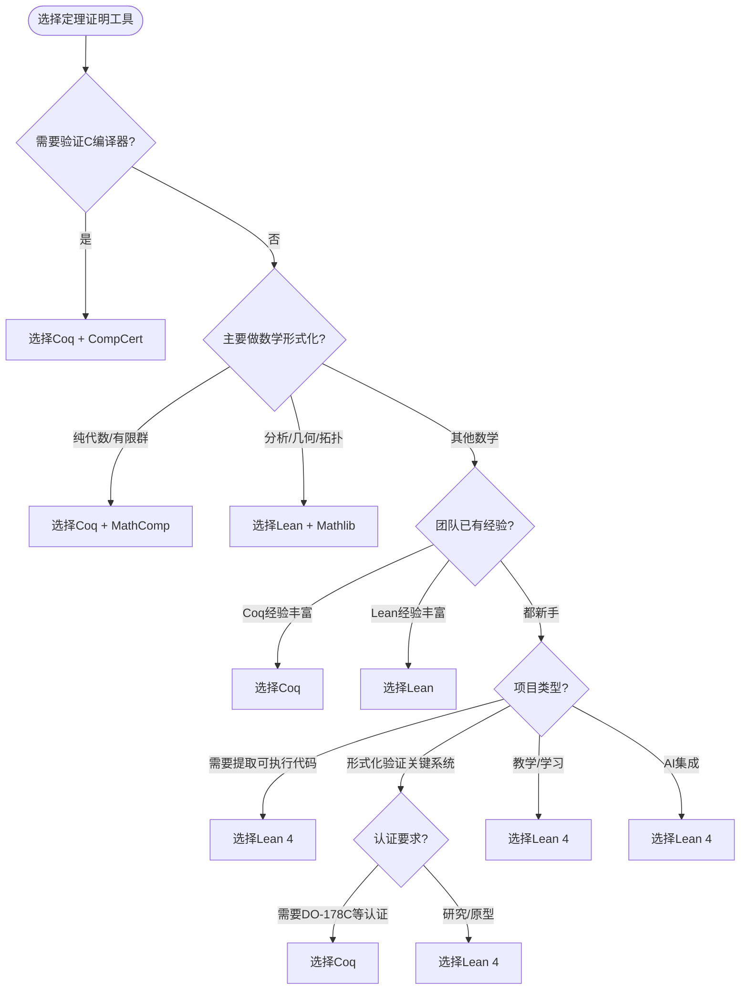

# Lean 4 vs Coq 详细对比分析

> **层级定位**: 05 Deep Structure MetaPhysics / 05 Lean 4
> **目标读者**: 已有Coq基础，希望学习Lean 4的开发者
> **难度级别**: L5 分析
> **预估学习时间**: 4-6 小时

---

## 📋 本节概要

| 属性 | 内容 |
|:-----|:-----|
| **核心对比** | 语法、策略、生态、应用场景 |
| **前置知识** | Coq基础或Lean 4基础 |
| **学习目标** | 根据项目需求选择合适工具 |
| **实践价值** | 迁移现有Coq项目到Lean，或反之 |

---

## 📑 目录

- [Lean 4 vs Coq 详细对比分析](#lean-4-vs-coq-详细对比分析)
  - [📋 本节概要](#-本节概要)
  - [📑 目录](#-目录)
  - [1. 概述与设计理念](#1-概述与设计理念)
    - [1.1 设计理念差异](#11-设计理念差异)
    - [1.2 核心特性矩阵](#12-核心特性矩阵)
  - [2. 语法差异深度对比](#2-语法差异深度对比)
    - [2.1 基本定义语法](#21-基本定义语法)
      - [归纳类型定义](#归纳类型定义)
      - [函数定义](#函数定义)
    - [2.2 类型与命题](#22-类型与命题)
      - [逻辑连接词](#逻辑连接词)
    - [2.3 记号与符号](#23-记号与符号)
  - [3. 证明策略对比](#3-证明策略对比)
    - [3.1 基础策略对照表](#31-基础策略对照表)
    - [3.2 归纳证明对比](#32-归纳证明对比)
    - [3.3 高级策略](#33-高级策略)
      - [情况分析](#情况分析)
      - [存在量词](#存在量词)
      - [自动化策略](#自动化策略)
    - [3.4 结构化证明](#34-结构化证明)
  - [4. 生态系统对比](#4-生态系统对比)
    - [4.1 数学库对比：Mathlib vs MathComp](#41-数学库对比mathlib-vs-mathcomp)
      - [库覆盖率对比](#库覆盖率对比)
    - [4.2 工具链对比](#42-工具链对比)
    - [4.3 编辑器体验对比](#43-编辑器体验对比)
  - [5. 工业应用对比](#5-工业应用对比)
    - [5.1 实际项目案例](#51-实际项目案例)
      - [Coq成功案例](#coq成功案例)
      - [Lean 4成功案例](#lean-4成功案例)
    - [5.2 行业采用趋势](#52-行业采用趋势)
    - [5.3 就业市场与学习投资回报](#53-就业市场与学习投资回报)
  - [6. 学习曲线分析](#6-学习曲线分析)
    - [6.1 从Coq迁移到Lean](#61-从coq迁移到lean)
      - [直接对应（简单迁移）](#直接对应简单迁移)
      - [需要适应（中等难度）](#需要适应中等难度)
      - [需要学习（较高难度）](#需要学习较高难度)
    - [6.2 学习时间估算](#62-学习时间估算)
    - [6.3 常见迁移陷阱](#63-常见迁移陷阱)
      - [陷阱1：混淆 universe 层级](#陷阱1混淆-universe-层级)
      - [陷阱2：隐式参数处理](#陷阱2隐式参数处理)
      - [陷阱3：策略状态差异](#陷阱3策略状态差异)
  - [7. 决策树：何时选择Lean vs Coq](#7-决策树何时选择lean-vs-coq)
    - [7.1 决策流程图](#71-决策流程图)
    - [7.2 场景决策矩阵](#72-场景决策矩阵)
    - [7.3 混合策略](#73-混合策略)
  - [8. 代码迁移指南](#8-代码迁移指南)
    - [8.1 自动化迁移工具](#81-自动化迁移工具)
    - [8.2 手动迁移最佳实践](#82-手动迁移最佳实践)
    - [8.3 等效代码对照表](#83-等效代码对照表)
  - [9. 总结](#9-总结)
    - [9.1 核心差异总结](#91-核心差异总结)
    - [9.2 最终建议](#92-最终建议)

---

## 1. 概述与设计理念

### 1.1 设计理念差异

```
┌─────────────────────────────────────────────────────────────────┐
│                      设计理念对比                                │
├─────────────────────────────────────────────────────────────────┤
│  Coq                                                             │
│  ├── 学术导向：源于法国类型论研究传统                             │
│  ├── 稳定性优先：20+年历史，向后兼容                              │
│  ├── 分层架构：Gallina + Ltac + OCaml插件                        │
│  └── 形式化数学：Feit-Thompson定理等里程碑                        │
├─────────────────────────────────────────────────────────────────┤
│  Lean 4                                                          │
│  ├── 工程导向：微软研究院主导，强调实用性                          │
│  ├── 现代化：吸取Coq/Agda经验，重新设计                           │
│  ├── 统一平台：编程语言 = 证明语言 = 元编程语言                    │
│  └── 社区驱动：Mathlib成为最大数学形式化库                        │
└─────────────────────────────────────────────────────────────────┘
```

### 1.2 核心特性矩阵

| 特性 | Lean 4 | Coq | 说明 |
|------|--------|-----|------|
| **核心演算** | 依赖类型理论 (DTT) | 归纳构造演算 (CIC) | 表达能力等价 |
| **证明语言** | 结构化Tactics + 项证明 | Ltac/Ltac2 + SSReflect | Lean更现代化 |
| **编程范式** | 函数式 + 命令式 (do-notation) | 纯函数式 | Lean更灵活 |
| **元编程** | 统一宏系统 (Macro/Elab) | Ltac + OCaml插件 | Lean更统一 |
| **编译目标** | C / LLVM / JS / WASM | OCaml / Native / JS | Lean更多样 |
| **编辑器** | VS Code + 强大LSP | CoqIDE / VS Code | Lean体验更佳 |
| **构建工具** | Lake (内置) | Make/Dune/CoqMakefile | Lean更简洁 |
| **标准库** | Std4 (轻量) | 丰富标准库 | Coq更完整 |
| **数学库** | Mathlib (600万+行) | MathComp + 分散库 | Lean规模更大 |

---

## 2. 语法差异深度对比

### 2.1 基本定义语法

#### 归纳类型定义

**Coq:**

```coq
(* 自然数 *)
Inductive nat : Type :=
  | O : nat
  | S : nat -> nat.

(* 列表 *)
Inductive list (A : Type) : Type :=
  | nil : list A
  | cons : A -> list A -> list A.

Arguments nil {A}.
Arguments cons {A} _ _.
```

**Lean 4:**

```lean
-- 自然数
inductive Nat where
  | zero : Nat
  | succ : Nat → Nat

-- 列表 (参数隐式)
inductive List (α : Type u) where
  | nil : List α
  | cons : α → List α → List α

-- 或者使用更简洁的命名
notation "[]" => List.nil
infixr:67 " :: " => List.cons
```

**对比分析:**

- Lean的`inductive`关键词更简洁，无需指定返回类型（自动推断）
- Lean支持隐式参数`{α : Type}`，无需`Arguments`声明
- Lean的命名惯例：`CamelCase`类型，`camelCase`构造函数

#### 函数定义

**Coq:**

```coq
(* 递归函数 *)
Fixpoint plus (n m : nat) : nat :=
  match n with
  | O => m
  | S n' => S (plus n' m)
  end.

(* 多态函数 *)
Fixpoint length {A : Type} (l : list A) : nat :=
  match l with
  | [] => O
  | _ :: t => S (length t)
  end.

(* 非结构递归需要Function *)
Function div2 (n : nat) {measure id n} : nat :=
  match n with
  | O => O
  | S O => O
  | S (S n') => S (div2 n')
  end.
```

**Lean 4:**

```lean
-- 递归函数 (使用def，自动检测结构递归)
def plus (n m : Nat) : Nat :=
  match n with
  | Nat.zero => m
  | Nat.succ n' => Nat.succ (plus n' m)

-- 多态函数 (隐式参数)
def length {α : Type} (l : List α) : Nat :=
  match l with
  | [] => 0
  | _ :: t => 1 + length t

-- 非结构递归使用partial或well-founded recursion
partial def div2 (n : Nat) : Nat :=
  match n with
  | 0 => 0
  | 1 => 0
  | n + 2 => 1 + div2 n

-- 或者使用well-founded recursion保证终止性
def div2_wf (n : Nat) : Nat :=
  if n < 2 then 0
  else 1 + div2_wf (n - 2)
termination_by n
```

**对比分析:**

- Lean使用`def`统一替代Coq的`Fixpoint`/`Definition`
- Lean自动检测结构递归，无需显式声明
- Lean的终止证明更灵活：`partial`允许非终止，`termination_by`提供度量

### 2.2 类型与命题

#### 逻辑连接词

**Coq:**

```coq
(* 合取 *)
Inductive and (P Q : Prop) : Prop :=
  | conj : P -> Q -> and P Q.

(* 析取 *)
Inductive or (P Q : Prop) : Prop :=
  | or_introl : P -> or P Q
  | or_intror : Q -> or P Q.

(* 存在量词 *)
Inductive ex {A : Type} (P : A -> Prop) : Prop :=
  | ex_intro : forall x : A, P x -> ex P.

(* 使用 *)
Theorem example_and : forall P Q, P -> Q -> P /\ Q.
Proof.
  intros P Q HP HQ.
  split.
  - apply HP.
  - apply HQ.
Qed.
```

**Lean 4:**

```lean
-- Lean使用相同的归纳定义，但语法更简洁
structure And (P Q : Prop) : Prop where
  intro :: left : P right : Q

inductive Or (P Q : Prop) : Prop where
  | inl : P → Or P Q
  | inr : Q → Or P Q

-- 存在量词
structure Exists {α : Sort u} (P : α → Prop) : Prop where
  intro :: witness : α proof : P witness

-- 使用 (定理证明)
example {P Q : Prop} (hp : P) (hq : Q) : P ∧ Q := by
  constructor
  · exact hp
  · exact hq

-- 或者直接构造项
example {P Q : Prop} (hp : P) (hq : Q) : P ∧ Q :=
  And.intro hp hq
```

**对比分析:**

- Lean的`structure`提供简洁的字段访问器（`left`, `right`）
- Lean支持命名构造函数参数（`intro ::`语法）
- Lean的`by`块比Coq的`Proof...Qed`更简洁

### 2.3 记号与符号

| 概念 | Coq | Lean 4 | 备注 |
|------|-----|--------|------|
| 函数类型 | `A -> B` | `A → B` | Lean使用Unicode箭头 |
| 全称量词 | `forall x, P x` | `∀ x, P x` | 都可使用`orall`输入 |
| 存在量词 | `exists x, P x` | `∃ x, P x` | Lean默认Unicode |
| 合取 | `/\` | `∧` | Lean默认Unicode |
| 析取 | `\/` | `∨` | Lean默认Unicode |
| 非 | `~` | `¬` | Lean使用Unicode |
| 蕴含 | `->` | `→` | Lean默认Unicode |
| 等价 | `<->` | `↔` | Lean默认Unicode |
| 类型宇宙 | `Type`, `Set`, `Prop` | `Type`, `Sort`, `Prop` | Lean使用`Sort`统一 |
| 列表构造 | `::` | `::` | 相同 |
| 列表连接 | `++` | `++` | 相同 |

---

## 3. 证明策略对比

### 3.1 基础策略对照表

| 操作 | Coq | Lean 4 | 说明 |
|------|-----|--------|------|
| 引入假设 | `intros x y` | `intro x y` | Lean支持复数 |
| 精确匹配 | `exact H` | `exact H` | 相同 |
| 应用定理 | `apply H` | `apply H` | 相同 |
| 分解合取 | `destruct H as [H1 H2]` | `cases H with \| intro H1 H2` | Lean使用`rcases`更灵活 |
| 构造合取 | `split` | `constructor` | Lean使用统一构造函数策略 |
| 左析取 | `left` | `left` | 相同 |
| 右析取 | `right` | `right` | 相同 |
| 重写 | `rewrite H` | `rw [H]` | Lean使用方括号 |
| 反向重写 | `rewrite <- H` | `rw [←H]` | Lean使用Unicode箭头 |
| 简化 | `simpl` | `simp` | Lean策略更强大 |
| 反身性 | `reflexivity` | `rfl` | Lean更简洁 |
| 对称性 | `symmetry` | `symm` | Lean更简洁 |
| 传递性 | `transitivity x` | `trans x` | Lean更简洁 |

### 3.2 归纳证明对比

**Coq - 列表反转性质:**

```coq
Theorem rev_involutive : forall (A : Type) (l : list A),
  rev (rev l) = l.
Proof.
  intros A l.
  induction l as [| h t IH].
  - (* 基本情况 *)
    reflexivity.
  - (* 归纳步骤 *)
    simpl.
    rewrite rev_append_rev.
    rewrite IH.
    reflexivity.
Qed.
```

**Lean 4 - 等效证明:**

```lean
theorem reverse_involutive {α : Type} (l : List α) :
  List.reverse (List.reverse l) = l := by
  induction l with
  | nil => rfl
  | cons h t ih =>
    simp [List.reverse, List.reverse_append, ih]
```

**对比分析:**

- Lean的`induction`语法更统一，使用`with`块
- Lean的`simp`比Coq的`simpl`+多次`rewrite`更强大
- Lean使用`·`（点）标记子目标，比Coq的`-`/`+`更清晰

### 3.3 高级策略

#### 情况分析

**Coq:**

```coq
(* 析取情况分析 *)
destruct H as [H1 | H2].
- (* H1情况 *)
  ...
- (* H2情况 *)
  ...

(* 复杂模式匹配 *)
destruct H as [[H1 H2] | [H3 | H4]].
```

**Lean 4:**

```lean
-- 析取情况分析
cases H with
| inl h1 => ...
| inr h2 => ...

-- 复杂模式匹配 (rcases非常强大)
rcases H with ⟨h1, h2⟩ | h3 | h4

-- 甚至可以直接在intro时解构
intro ⟨h1, h2 | h3⟩
```

#### 存在量词

**Coq:**

```coq
(* 构造存在证明 *)
exists 42.
(* 证明42满足条件 *)

(* 解构存在假设 *)
destruct H as [x Hx].
(* 现在x是见证，Hx是证明 *)
```

**Lean 4:**

```lean
-- 构造存在证明
use 42
-- 证明42满足条件

-- 解构存在假设
cases H with | intro x hx =>
-- 或使用obtain更灵活
obtain ⟨x, hx⟩ := H
```

#### 自动化策略

| 策略类型 | Coq | Lean 4 | 能力对比 |
|----------|-----|--------|----------|
| 通用自动 | `auto` | `aesop` | Lean的aesop更强大 |
| 直觉自动 | `intuition` | `tauto` | 类似 |
| 线性算术 | `omega` / `lia` | `omega` / `linarith` | 相当 |
| 等式推理 | `congruence` | `congr` | 类似 |
| 代数简化 | `ring` | `ring` | Lean扩展性更好 |
| 域运算 | `field` | `field_simp` | 类似 |
| 可判定命题 | `tauto` | `tauto` / `itauto` | 相当 |

### 3.4 结构化证明

**Coq - SSReflect风格:**

```coq
Lemma addnC : commutative addn.
Proof.
move=> n m.
elim: n => [|n IHn] /=.
- by rewrite add0n.
- by rewrite addSn IHn addnS.
Qed.
```

**Lean 4 - 结构化证明:**

```lean
-- 策略风格
theorem add_comm (n m : Nat) : n + m = m + n := by
  induction n with
  | zero => simp [Nat.zero_add, Nat.add_zero]
  | succ n ih => simp [Nat.succ_add, Nat.add_succ, ih]

-- 或者使用calc进行等式链证明
theorem add_comm_calc (n m : Nat) : n + m = m + n := by
  induction n with
  | zero =>
    calc
      0 + m = m := by rw [Nat.zero_add]
      _ = m + 0 := by rw [Nat.add_zero]
  | succ n ih =>
    calc
      (n + 1) + m = (n + m) + 1 := by rw [Nat.succ_add]
      _ = (m + n) + 1 := by rw [ih]
      _ = m + (n + 1) := by rw [Nat.add_succ]
```

---

## 4. 生态系统对比

### 4.1 数学库对比：Mathlib vs MathComp

```
┌────────────────────────────────────────────────────────────────────┐
│                        数学库生态对比                               │
├────────────────────────────────────────────────────────────────────┤
│  Coq - MathComp                                                    │
│  ├── 规模：约100万行                                               │
│  ├── 风格：SSReflect，结构化证明                                   │
│  ├── 重点：有限群论、代数、算术                                    │
│  ├── 代表作：Feit-Thompson奇数阶定理                               │
│  └── 依赖：需要严格遵循MathComp风格                                 │
├────────────────────────────────────────────────────────────────────┤
│  Lean - Mathlib                                                    │
│  ├── 规模：600万+行（持续增长）                                    │
│  ├── 风格：多样化，tactics和项证明并存                             │
│  ├── 重点：覆盖数学所有分支                                        │
│  ├── 代表作：Liquid Tensor Experiment, FLT进展                     │
│  └── 依赖：设计更灵活，兼容性好                                    │
└────────────────────────────────────────────────────────────────────┘
```

#### 库覆盖率对比

| 数学领域 | Coq (MathComp) | Lean (Mathlib) | 说明 |
|----------|---------------|----------------|------|
| 线性代数 | ★★★★☆ | ★★★★★ | Lean更完整 |
| 抽象代数 | ★★★★★ | ★★★★☆ | Coq更深厚 |
| 数论 | ★★★★☆ | ★★★★☆ | 相当 |
| 分析学 | ★★★☆☆ | ★★★★★ | Lean领先 |
| 拓扑学 | ★★★☆☆ | ★★★★☆ | Lean更现代 |
| 组合数学 | ★★★★☆ | ★★★★☆ | 相当 |
| 范畴论 | ★★★☆☆ | ★★★★★ | Lean领先 |
| 代数几何 | ★★☆☆☆ | ★★★☆☆ | 都在发展中 |

### 4.2 工具链对比

| 工具/功能 | Coq | Lean 4 | 比较 |
|-----------|-----|--------|------|
| **构建系统** | Dune/Make/CoqMakefile | Lake (内置) | Lean更简洁 |
| **包管理** | opam | Lake + git | Lean更现代 |
| **IDE** | CoqIDE / VS Code + VSCoq | VS Code + lean4扩展 | Lean体验更好 |
| **文档生成** | coqdoc | docgen4 | 相当 |
| **代码格式化** | 无官方 | 内置 | Lean更好 |
| **持续集成** | 自行配置 | Lake + GitHub Actions | Lean更方便 |
| **语言服务器** | 可用 | 功能强大 | Lean领先 |

### 4.3 编辑器体验对比

**Coq (VS Code + VSCoq):**

```
优势:
- CoqIDE的替代选择
- 支持基本的目标查看

劣势:
- 功能相对基础
- 错误消息有时难以理解
- 自动补全有限
```

**Lean 4 (VS Code + lean4扩展):**

```
优势:
- 内置强大的LSP支持
- 实时的目标状态显示
- 优秀的自动补全
- 内联错误提示
-  widgets交互式显示
-  "Try this" 建议功能

特色功能:
- 信息视图（Infoview）显示当前证明状态
- 目标细分显示
- 支持数学符号输入
- 一键应用建议
```

---

## 5. 工业应用对比

### 5.1 实际项目案例

#### Coq成功案例

| 项目 | 描述 | 规模 | 影响 |
|------|------|------|------|
| **CompCert** | 验证C编译器 | 10+万行Coq | 航空认证使用 |
| **seL4** | 验证操作系统内核 | 20+万行 | 安全关键系统 |
| **Iris** | 并发分离逻辑框架 | 5+万行 | 研究基础工具 |
| **VST** | C程序验证工具 | 10+万行 | 美国NSF项目 |
| **CertiKOS** | 验证操作系统 | 显著规模 | 学术研究 |
| **Everest** | TLS验证项目 (部分Coq) | 混合使用 | Microsoft项目 |

#### Lean 4成功案例

| 项目 | 描述 | 规模 | 影响 |
|------|------|------|------|
| **Mathlib** | 统一数学库 | 600万+行 | 数学研究 |
| **LeanDojo** | AI+定理证明 | 集成项目 | 机器学习社区 |
| **AWS Formal Methods** | 分布式系统验证 | 商业应用 | 云服务验证 |
| **ProofWidgets** | 交互式证明UI | 基础设施 | 提升用户体验 |
| **Blueprint** | 数学项目管理 | 工具链 | 大型证明组织 |
| **Simplifying Physics** | 物理计算验证 | 研究项目 | 跨学科应用 |

### 5.2 行业采用趋势



### 5.3 就业市场与学习投资回报

| 维度 | Coq | Lean 4 |
|------|-----|--------|
| **学术岗位** | 需求稳定（法国、欧洲强） | 快速增长（北美强） |
| **工业岗位** | 安全认证领域 | AI/验证新兴领域 |
| **学习曲线** | 陡峭但成熟 | 陡峭但现代化 |
| **社区支持** | 成熟稳定 | 活跃热情 |
| **未来预期** | 稳定增长 | 高速增长 |

---

## 6. 学习曲线分析

### 6.1 从Coq迁移到Lean

#### 直接对应（简单迁移）

| Coq概念 | Lean对应 | 迁移难度 |
|---------|----------|----------|
| `Inductive` | `inductive` | ★☆☆ |
| `Fixpoint` | `def` | ★☆☆ |
| `Definition` | `def` | ★☆☆ |
| `Theorem`/`Lemma` | `theorem`/`lemma` | ★☆☆ |
| `Proof...Qed` | `by...` | ★☆☆ |
| `intros` | `intro` | ★☆☆ |
| `apply` | `apply` | ★☆☆ |
| `rewrite` | `rw` | ★☆☆ |
| `reflexivity` | `rfl` | ★☆☆ |

#### 需要适应（中等难度）

| Coq概念 | Lean对应 | 迁移难度 | 说明 |
|---------|----------|----------|------|
| `destruct` | `cases`/`rcases` | ★★☆ | Lean的`rcases`更强大 |
| `induction` | `induction` | ★★☆ | 语法略有不同 |
| `split` | `constructor` | ★★☆ | 概念相同，名称不同 |
| `simpl` | `simp` | ★★☆ | `simp`更强大 |
| `omega` | `omega`/`linarith` | ★★☆ | 两者都有 |
| `inversion` | `cases` | ★★☆ | Lean通常更简单 |

#### 需要学习（较高难度）

| Coq概念 | Lean对应 | 迁移难度 | 说明 |
|---------|----------|----------|------|
| `Ltac` | `macro`/`elab` | ★★★ | 完全不同的元编程模型 |
| `Type Classes` | `class`/`instance` | ★★★ | 机制类似但实现不同 |
| `Canonical Structures` | `instance` | ★★★ | 概念合并 |
| `Modules` | `namespace`/`section` | ★★★ | 完全不同的模块系统 |
| `Extraction` | `extern`/`IR` | ★★★ | Lean 4编译不同 |

### 6.2 学习时间估算

```
有Coq基础的开发者学习Lean 4:

基础语法迁移:     1-2周
证明策略适应:     2-3周
 Mathlib使用:     2-4周
元编程(可选):     4+周
─────────────────────
总计:            2-3个月达到熟练
```

```
无Coq基础的开发者:

函数式编程基础:   2-3周
依赖类型理解:     2-3周
基础证明技术:     3-4周
项目实践:         4+周
─────────────────────
总计:            3-4个月达到熟练
```

### 6.3 常见迁移陷阱

#### 陷阱1：混淆 universe 层级

**Coq:**

```coq
(* Coq区分Set, Type, Prop *)
Check nat. (* Set *)
Check Type. (* Type *)
```

**Lean 4:**

```lean
-- Lean使用Sort统一
#check Nat  -- Type
#check Type -- Type 1
#check Sort 1 -- Type
```

#### 陷阱2：隐式参数处理

**Coq:**

```coq
(* 需要显式声明隐式 *)
Arguments length {A} _.
```

**Lean 4:**

```lean
-- 花括号自动隐式
def length {α : Type} (l : List α) : Nat := ...
-- 或者使用⦃⦄表示实例参数
```

#### 陷阱3：策略状态差异

**Coq:**

```coq
(* 使用bullet管理子目标 *)
Proof.
  split.
  - (* 子目标1 *)
    auto.
  - (* 子目标2 *)
    auto.
Qed.
```

**Lean 4:**

```lean
-- 使用·(点)管理子目标
by
  constructor
  · -- 子目标1
    aesop
  · -- 子目标2
    aesop
```

---

## 7. 决策树：何时选择Lean vs Coq

### 7.1 决策流程图



### 7.2 场景决策矩阵

| 场景 | 推荐 | 理由 |
|------|------|------|
| **验证C编译器** | Coq | CompCert是Coq编写的 |
| **形式化代数证明** | Coq/MathComp | 群论传统强 |
| **形式化分析学** | Lean/Mathlib | 分析学覆盖好 |
| **本科教学** | Lean | 现代化体验 |
| **研究生研究** | 视领域而定 | 见上表 |
| **快速原型验证** | Lean | 开发效率高 |
| **工业认证项目** | Coq | 历史案例多 |
| **AI+证明** | Lean | LeanDojo生态 |
| **操作系统验证** | Coq | seL4/CertiKOS |
| **密码学验证** | 两者皆可 | 都有成熟案例 |

### 7.3 混合策略

在某些场景下，可以组合使用两者：

```
混合策略示例:

1. 在Coq中验证编译器关键部分
2. 在Lean中做高级算法验证
3. 使用Mathlib的数学结果
4. 通过外部工具桥接证明

实际案例:
- Everest项目: Coq + F* + 其他
- 某些安全项目: Coq用于底层, Lean用于高层规范
```

---

## 8. 代码迁移指南

### 8.1 自动化迁移工具

| 工具 | 方向 | 成熟度 | 备注 |
|------|------|--------|------|
| **coq-of-lean** | Lean → Coq | 实验性 | 有限支持 |
| **lean-of-coq** | Coq → Lean | 计划中 | 社区讨论 |
| **手动迁移** | 双向 | 可靠 | 推荐用于关键代码 |

### 8.2 手动迁移最佳实践

1. **分模块迁移**：从核心定义开始，逐步迁移证明
2. **保持语义等价**：先确保功能一致，再优化风格
3. **利用测试**：如果Coq代码有提取的测试用例，用于验证Lean实现
4. **文档对照**：迁移同时更新文档，记录设计决策

### 8.3 等效代码对照表

```lean
-- ========== 常用定义模式 ==========

-- Coq: Inductive color : Type := Red | Green | Blue.
inductive Color where
  | red | green | blue

-- Coq: Definition is_red (c : color) : bool := match c with Red => true | _ => false end.
def isRed : Color → Bool
  | Color.red => true
  | _ => false

-- Coq: Fixpoint map {A B} (f : A -> B) (l : list A) : list B := ...
def map {α β : Type} (f : α → β) : List α → List β
  | [] => []
  | x :: xs => f x :: map f xs

-- ========== 常用证明模式 ==========

-- Coq: intros x y H. destruct H. apply H1.
intro x y h
cases h with | intro h1 h2 =>
exact h1

-- Coq: induction n as [| n IH]; simpl; auto.
induction n with
| zero => simp
| succ n ih => simp [ih]

-- Coq: rewrite H. reflexivity.
rw [h]
 rfl
```

---

## 9. 总结

### 9.1 核心差异总结

| 维度 | Coq | Lean 4 |
|------|-----|--------|
| **历史** | 20+年，成熟稳定 | 10年，现代化设计 |
| **哲学** | 学术严谨 | 工程实用 |
| **体验** | 传统，学习曲线陡峭 | 现代，工具链优秀 |
| **生态** | CompCert, MathComp | Mathlib, 活跃社区 |
| **未来** | 稳定增长 | 快速增长 |

### 9.2 最终建议

**选择Coq如果：**

- 需要验证C编译器或使用CompCert
- 工作主要在有限群论和代数
- 项目需要DO-178C等形式认证
- 团队已有Coq经验

**选择Lean 4如果：**

- 需要现代化的开发体验
- 工作涉及分析学、几何、拓扑
- 项目需要与AI/机器学习集成
- 希望参与快速发展的社区
- 需要提取高性能可执行代码

**两者都学习如果：**

- 从事形式化验证研究
- 希望在学术界发展
- 想要全面理解定理证明工具设计空间

---

> **核心观点**: Lean 4和Coq都是优秀的定理证明工具。选择哪个取决于具体需求、团队背景和项目约束。对于有Coq基础的读者，迁移到Lean 4需要2-3周适应期，但将获得更现代化的工具体验。

---

**文档版本**: 1.0
**创建日期**: 2026-03-19
**维护者**: C_Lang Knowledge Base Team
**相关文档**:

- [01_Lean_4_Introduction.md](01_Lean_4_Introduction.md)
- [03_Tactics_Proofs.md](03_Tactics_Proofs.md)
- [../03_Verification_Energy/01_Coq_Verification.md](../03_Verification_Energy/01_Coq_Verification.md)
