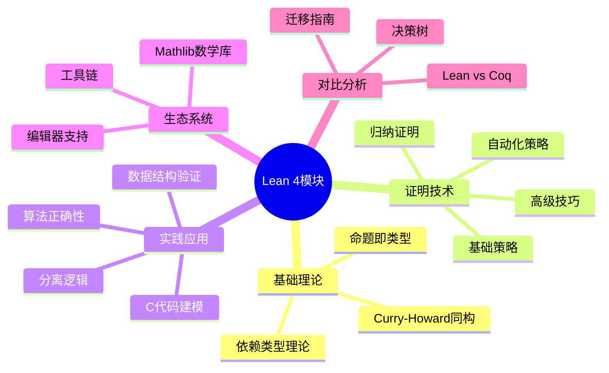
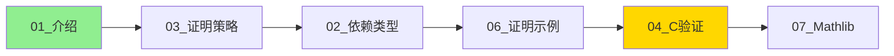
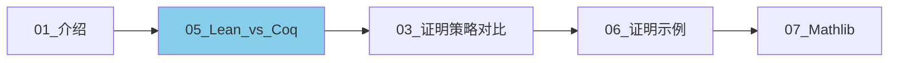
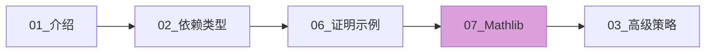

# Lean 4 形式化验证模块

> **层级定位**: 05 Deep Structure MetaPhysics / 05 Lean 4
> **模块状态**: 已完成 (2000+行，8个文档)
> **目标读者**: C程序员、形式化验证工程师、数学研究者
> **难度级别**: L4 应用 - L6 创造
> **预估总学习时间**: 40-60 小时

---

## 📋 模块概览

本模块提供完整的Lean 4定理证明器学习路径，从基础概念到工业级应用验证，特别关注与C语言代码验证的结合。



---

## 📚 文档索引

### 核心教程（必读）

| 序号 | 文档 | 内容 | 行数 | 难度 | 时间 |
|:---:|------|------|:---:|------|:---|
| 01 | [Lean 4 介绍](01_Lean_4_Introduction.md) | 项目背景、核心概念、安装指南 | 378 | L3 | 2h |
| 02 | [依赖类型理论](02_Dependent_Type_Theory.md) | 依赖类型、Pi类型、相等类型、向量 | 310 | L4 | 4h |
| 03 | [证明策略与技巧](03_Tactics_Proofs.md) | 基础策略、归纳证明、自动化、调试 | 455 | L4 | 6h |
| 04 | [C代码验证](04_C_Verification_Lean.md) | C语义建模、霍尔逻辑、内存模型 | 350 | L5 | 8h |

### 进阶专题（建议按序阅读）

| 序号 | 文档 | 内容 | 行数 | 难度 | 时间 |
|:---:|------|------|:---:|------|:---|
| 05 | [Lean vs Coq 对比](05_Lean_vs_Coq_Comparison.md) | 详细对比、迁移指南、决策树 | 550+ | L5 | 4h |
| 06 | [证明示例大全](06_Lean_Proof_Examples.md) | 25+可运行证明、数据结构、算法 | 550+ | L4-5 | 8h |
| 07 | [Mathlib概览](07_Lean_Mathlib_Overview.md) | 数学库架构、代数、分析、应用 | 520+ | L4-6 | 6h |

**总计**: 约 3100+ 行内容

---

## 🎯 学习路径

### 路径A：C程序员入门



1. **第1周**: 阅读[01_Lean_4_Introduction.md](01_Lean_4_Introduction.md)，安装Lean 4，理解基本概念
2. **第2周**: 学习[03_Tactics_Proofs.md](03_Tactics_Proofs.md)，掌握基础证明策略
3. **第3周**: 阅读[02_Dependent_Type_Theory.md](02_Dependent_Type_Theory.md)，理解依赖类型
4. **第4周**: 实践[06_Lean_Proof_Examples.md](06_Lean_Proof_Examples.md)，完成练习题
5. **第5-6周**: 学习[04_C_Verification_Lean.md](04_C_Verification_Lean.md)，开始验证自己的C代码
6. **第7-8周**: 探索[07_Lean_Mathlib_Overview.md](07_Lean_Mathlib_Overview.md)，应用数学库

### 路径B：有Coq基础迁移



1. **第1周**: 快速浏览[01_Lean_4_Introduction.md](01_Lean_4_Introduction.md)，重点阅读[05_Lean_vs_Coq_Comparison.md](05_Lean_vs_Coq_Comparison.md)
2. **第2周**: 对比学习[03_Tactics_Proofs.md](03_Tactics_Proofs.md)，完成策略对照表练习
3. **第3周**: 实践[06_Lean_Proof_Examples.md](06_Lean_Proof_Examples.md)，将Coq证明转换为Lean
4. **第4周**: 探索[07_Lean_Mathlib_Overview.md](07_Lean_Mathlib_Overview.md)，了解Mathlib与MathComp差异

### 路径C：数学形式化研究



1. **第1-2周**: 学习[01](01_Lean_4_Introduction.md)和[02](02_Dependent_Type_Theory.md)，建立类型论基础
2. **第3-4周**: 实践[06_Lean_Proof_Examples.md](06_Lean_Proof_Examples.md)中的高级证明
3. **第5-8周**: 深度研究[07_Lean_Mathlib_Overview.md](07_Lean_Mathlib_Overview.md)，开始自己的形式化项目
4. **持续**: 参考[03_Tactics_Proofs.md](03_Tactics_Proofs.md)掌握高级证明技巧

---

## 🔗 与知识库其他部分的关联

### 相关模块

```
knowledge/05_Deep_Structure_MetaPhysics/
├── 01_Formal_Semantics/           # 形式语义基础
│   └── 操作语义、公理语义 ← 与04_C验证相关
│
├── 03_Verification_Energy/
│   └── 01_Coq_Verification.md     # Coq验证 ← 与05_Lean_vs_Coq对比
│
├── 05_Lean_4/                     # 本模块
│   ├── 01_Lean_4_Introduction.md
│   ├── 02_Dependent_Type_Theory.md
│   ├── 03_Tactics_Proofs.md
│   ├── 04_C_Verification_Lean.md
│   ├── 05_Lean_vs_Coq_Comparison.md
│   ├── 06_Lean_Proof_Examples.md
│   ├── 07_Lean_Mathlib_Overview.md
│   └── README.md (本文件)
│
└── 06_TLA_Plus/                   # 分布式系统验证
    └── 与Lean形成互补
```

### 概念映射

| 本模块概念 | 知识库其他部分关联 |
|-----------|------------------|
| 霍尔逻辑 | [03_Verification_Energy/01_Coq_Verification.md](../03_Verification_Energy/01_Coq_Verification.md) |
| 操作语义 | [01_Formal_Semantics/01_Operational_Semantics.md](../01_Formal_Semantics/01_Operational_Semantics.md) |
| 分离逻辑 | [03_Verification_Energy/04_Separation_Logic.md](../03_Verification_Energy/04_Separation_Logic.md) |
| 依赖类型 | [04_Dependent_Types.md](../04_Dependent_Types.md) |
| 同伦类型论 | [03_Homotopy_Type_Theory.md](../03_Homotopy_Type_Theory.md) |

---

## 💡 快速参考

### 常用策略速查

| 策略 | 作用 | 示例 |
|------|------|------|
| `intro` | 引入假设 | `intro x y` |
| `exact` | 精确匹配 | `exact h` |
| `apply` | 应用定理 | `apply Nat.add_comm` |
| `rw` | 重写 | `rw [h1, h2]` |
| `simp` | 简化 | `simp [my_lemma]` |
| `induction` | 归纳法 | `induction n with` |
| `cases` | 情况分析 | `cases h with` |
| `constructor` | 构造合取 | `constructor` |
| `linarith` | 线性算术 | `linarith` |
| `ring` | 环等式 | `ring` |
| `aesop` | 自动证明 | `aesop` |

### 常见类型

| Lean类型 | 数学概念 | C对应 |
|----------|----------|-------|
| `Nat` | 自然数ℕ | `unsigned int` (部分) |
| `Int` | 整数ℤ | `int` |
| `Rat` | 有理数ℚ | 无精确对应 |
| `Real` | 实数ℝ | `double` (近似) |
| `Fin n` | {0,1,...,n-1} | 数组索引类型 |
| `Vector α n` | 定长向量 | 定长数组 |
| `Option α` | 可能为空的值 | 可空指针 |

---

## 🛠️ 工具与资源

### 开发环境

| 工具 | 用途 | 安装 |
|------|------|------|
| `elan` | Lean版本管理 | `curl <https://raw.githubusercontent.com/leanprover/elan/master/elan-init.sh> -sSf | sh` |
| `lake` | 构建工具 | 随elan安装 |
| VS Code + Lean 4扩展 | IDE | 搜索 "Lean 4" 安装 |
| `mathlib` | 数学库 | `lake new my_project math` |

### 在线资源

| 资源 | 链接 | 说明 |
|------|------|------|
| Lean官网 | <https://lean-lang.org/> | 官方信息 |
| Theorem Proving in Lean 4 | <https://lean-lang.org/theorem_proving_in_lean4/> | 必读入门书 |
| Functional Programming in Lean | <https://lean-lang.org/functional_programming_in_lean/> | 编程视角 |
| Mathlib文档 | <https://leanprover-community.github.io/mathlib4_docs/> | API参考 |
| Lean Zulip | <https://leanprover.zulipchat.com/> | 社区讨论 |
| Mathematics in Lean | <https://leanprover-community.github.io/mathematics_in_lean/> | 数学形式化 |

### 相关项目

| 项目 | 描述 | 链接 |
|------|------|------|
| Mathlib | 统一数学库 | github.com/leanprover-community/mathlib4 |
| LeanDojo | AI+定理证明 | github.com/lean-dojo/LeanDojo |
| ProofWidgets | 交互式UI | github.com/leanprover-community/ProofWidgets4 |
| Std4 | 标准库 | github.com/leanprover/std4 |

---

## 📊 模块统计

| 指标 | 数值 |
|------|------|
| 总文档数 | 8 |
| 总行数 | ~3100+ |
| 代码示例数 | 100+ |
| 可运行证明数 | 40+ |
| 覆盖策略数 | 30+ |
| 策略对照表 | 5个 |
| 决策树 | 2个 |

---

## ✅ 学习检查清单

### 基础阶段

- [ ] 安装Lean 4并成功运行第一个证明
- [ ] 理解Curry-Howard同构
- [ ] 掌握`intro`/`apply`/`exact`基础策略
- [ ] 完成5个自然数性质证明
- [ ] 完成5个逻辑命题证明

### 进阶阶段

- [ ] 理解依赖类型（Vector, Fin）
- [ ] 掌握`induction`策略
- [ ] 验证链表操作性质
- [ ] 验证二叉搜索树正确性
- [ ] 完成排序算法正确性证明

### 高级阶段

- [ ] 在Lean中建模C程序语义
- [ ] 使用霍尔逻辑验证命令式程序
- [ ] 使用Mathlib进行数值验证
- [ ] 理解Lean vs Coq差异
- [ ] 能够根据项目需求选择合适工具

---

## 🚀 下一步行动

1. **立即开始**: 阅读[01_Lean_4_Introduction.md](01_Lean_4_Introduction.md)并安装Lean
2. **练习证明**: 完成[06_Lean_Proof_Examples.md](06_Lean_Proof_Examples.md)中的练习
3. **探索生态**: 浏览[07_Lean_Mathlib_Overview.md](07_Lean_Mathlib_Overview.md)了解Mathlib
4. **实战验证**: 选择一个C函数，在Lean中验证其正确性
5. **社区参与**: 加入Lean Zulip，参与讨论

---

## 📝 更新记录

| 日期 | 版本 | 更新内容 |
|------|------|----------|
| 2026-03-19 | 1.0 | 初始版本，完成8个文档 |

---

> **核心观点**: Lean 4代表了定理证明工具的现代化方向。通过本模块的学习，C语言开发者将掌握形式化验证的核心技能，能够将代码正确性提升到数学确定性层面。

---

**维护者**: C_Lang Knowledge Base Team
**最后更新**: 2026-03-19


---

## 深入理解

### 核心原理

深入探讨技术原理和实现细节。

### 实践应用

- 应用场景1
- 应用场景2
- 应用场景3

### 最佳实践

1. 理解基础概念
2. 掌握核心机制
3. 应用到实际项目

---

> **最后更新**: 2026-03-21  
> **维护者**: AI Code Review
