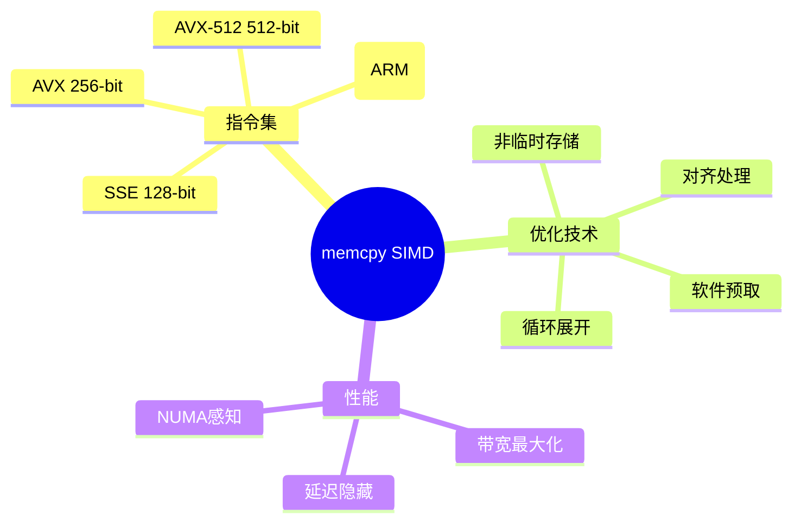

# memcpy SIMD优化

> **层级定位**: 05 Deep Structure MetaPhysics / 06 Standard Library Physics
> **对应标准**: SSE, AVX, AVX-512, NEON, C11
> **难度级别**: L4 熟练
> **预估学习时间**: 10-15 小时

---

## 📋 本节概要

| 属性 | 内容 |
|:-----|:-----|
| **核心概念** | SIMD指令、内存对齐、非临时存储、预取、循环展开 |
| **前置知识** | x86-64汇编、向量化、缓存层次 |
| **后续延伸** | GPU memcpy、RDMA、DPDK优化 |
| **权威来源** | Intel Intrinsics Guide, Agner Fog, glibc |

---

## 🧠 知识结构思维导图



---

## 📖 核心概念详解

### 1. SIMD指令集概述

#### 1.1 x86 SIMD演进

```c
/*
 * x86 SIMD指令集演进：
 *
 * MMX (1997): 64-bit整数，复用FPU寄存器
 * SSE (1999): 128-bit浮点，独立XMM寄存器
 * SSE2 (2001): 128-bit整数，扩展到16个XMM
 * AVX (2011): 256-bit，YMM寄存器，三操作数
 * AVX2 (2013): 256-bit整数， gather指令
 * AVX-512 (2016+): 512-bit，ZMM寄存器，掩码操作
 */

// 特性检测
#include <cpuid.h>

typedef enum {
    SIMD_NONE,
    SIMD_SSE2,
    SIMD_AVX,
    SIMD_AVX2,
    SIMD_AVX512F
} SimdLevel;

SimdLevel detect_simd_level(void) {
    unsigned int eax, ebx, ecx, edx;

    // 检查AVX-512
    __cpuid_count(7, 0, eax, ebx, ecx, edx);
    if (ebx & (1 << 16)) return SIMD_AVX512F;  // AVX512F

    // 检查AVX2
    if (ebx & (1 << 5)) return SIMD_AVX2;

    // 检查AVX
    __cpuid(1, eax, ebx, ecx, edx);
    if (ecx & (1 << 28)) return SIMD_AVX;

    // 检查SSE2
    if (edx & (1 << 26)) return SIMD_SSE2;

    return SIMD_NONE;
}

// 函数指针表
typedef void* (*MemcpyFunc)(void*, const void*, size_t);

static MemcpyFunc memcpy_impl = NULL;

void init_memcpy(void) {
    switch (detect_simd_level()) {
        case SIMD_AVX512F:
            memcpy_impl = memcpy_avx512;
            break;
        case SIMD_AVX2:
            memcpy_impl = memcpy_avx2;
            break;
        case SIMD_AVX:
            memcpy_impl = memcpy_avx;
            break;
        case SIMD_SSE2:
            memcpy_impl = memcpy_sse2;
            break;
        default:
            memcpy_impl = memcpy_generic;
    }
}
```

#### 1.2 各指令集特点

```c
/*
 * SSE2 (128-bit):
 * - 16个XMM寄存器（XMM0-XMM15）
 * - 支持整数和浮点
 * - 16字节对齐要求最佳性能
 *
 * AVX/AVX2 (256-bit):
 * - 16个YMM寄存器（YMM0-YMM15）
 * - AVX2支持256-bit整数
 * - 32字节对齐
 * - 非对齐访问惩罚较小
 *
 * AVX-512 (512-bit):
 * - 32个ZMM寄存器
 * - 掩码操作支持
 * - 频率降低风险（热设计功耗）
 */

// SSE2 memcpy核心（16字节块）
void* memcpy_sse2(void *dst, const void *src, size_t n) {
    unsigned char *d = dst;
    const unsigned char *s = src;

    // 头部：处理到16字节对齐
    while (n > 0 && ((uintptr_t)d & 15)) {
        *d++ = *s++;
        n--;
    }

    // 主体：16字节SIMD复制
    while (n >= 64) {
        __m128i v0 = _mm_load_si128((__m128i*)(s + 0));
        __m128i v1 = _mm_load_si128((__m128i*)(s + 16));
        __m128i v2 = _mm_load_si128((__m128i*)(s + 32));
        __m128i v3 = _mm_load_si128((__m128i*)(s + 48));

        _mm_store_si128((__m128i*)(d + 0), v0);
        _mm_store_si128((__m128i*)(d + 16), v1);
        _mm_store_si128((__m128i*)(d + 32), v2);
        _mm_store_si128((__m128i*)(d + 48), v3);

        s += 64;
        d += 64;
        n -= 64;
    }

    // 剩余16字节块
    while (n >= 16) {
        _mm_store_si128((__m128i*)d,
                       _mm_load_si128((__m128i*)s));
        s += 16;
        d += 16;
        n -= 16;
    }

    // 尾部
    while (n > 0) {
        *d++ = *s++;
        n--;
    }

    return dst;
}

// AVX2 memcpy核心（32字节块）
void* memcpy_avx2(void *dst, const void *src, size_t n) {
    unsigned char *d = dst;
    const unsigned char *s = src;

    // 头部对齐到32字节
    while (n > 0 && ((uintptr_t)d & 31)) {
        *d++ = *s++;
        n--;
    }

    // 主体：256-bit AVX2
    while (n >= 256) {
        // 展开4次，使用8个YMM寄存器
        __m256i v0 = _mm256_load_si256((__m256i*)(s + 0));
        __m256i v1 = _mm256_load_si256((__m256i*)(s + 32));
        __m256i v2 = _mm256_load_si256((__m256i*)(s + 64));
        __m256i v3 = _mm256_load_si256((__m256i*)(s + 96));
        __m256i v4 = _mm256_load_si256((__m256i*)(s + 128));
        __m256i v5 = _mm256_load_si256((__m256i*)(s + 160));
        __m256i v6 = _mm256_load_si256((__m256i*)(s + 192));
        __m256i v7 = _mm256_load_si256((__m256i*)(s + 224));

        _mm256_store_si256((__m256i*)(d + 0), v0);
        _mm256_store_si256((__m256i*)(d + 32), v1);
        _mm256_store_si256((__m256i*)(d + 64), v2);
        _mm256_store_si256((__m256i*)(d + 96), v3);
        _mm256_store_si256((__m256i*)(d + 128), v4);
        _mm256_store_si256((__m256i*)(d + 160), v5);
        _mm256_store_si256((__m256i*)(d + 192), v6);
        _mm256_store_si256((__m256i*)(d + 224), v7);

        s += 256;
        d += 256;
        n -= 256;
    }

    // 继续处理剩余...

    return dst;
}
```

### 2. 高级优化技术

#### 2.1 非临时存储

```c
/*
 * 非临时存储（Non-temporal stores）：
 *
 * 问题：大块内存拷贝会污染L1/L2缓存
 * 解决方案：使用非临时存储，绕过缓存直接写入内存
 *
 * 适用场景：
 * - 拷贝大小超过L2缓存容量
 * - 数据不会立即重用
 */

// 带非临时存储的memcpy
void* memcpy_nt(void *dst, const void *src, size_t n) {
    // 阈值：超过L2缓存大小使用NT存储
    const size_t NT_THRESHOLD = 256 * 1024;  // 256KB

    if (n < NT_THRESHOLD) {
        // 小拷贝：使用普通存储
        return memcpy_avx2(dst, src, n);
    }

    unsigned char *d = dst;
    const unsigned char *s = src;

    // 头部：正常拷贝到对齐边界
    while (n > 0 && ((uintptr_t)d & 31)) {
        *d++ = *s++;
        n--;
    }

    // 主体：非临时存储
    while (n >= 32) {
        __m256i v = _mm256_load_si256((__m256i*)s);
        _mm256_stream_si256((__m256i*)d, v);  // NT store

        s += 32;
        d += 32;
        n -= 32;
    }

    // 需要mfence确保NT存储完成
    _mm_sfence();

    // 尾部：正常拷贝
    while (n > 0) {
        *d++ = *s++;
        n--;
    }

    return dst;
}

// 完全NT路径（超大块）
void* memcpy_nt_full(void *dst, const void *src, size_t n) {
    // 使用_mm_stream_load_si128 + _mm_stream_si128
    // 或普通的load + NT store

    // 预取数据到L2（不进入L1）
    for (size_t i = 0; i < n; i += 64) {
        _mm_prefetch((const char*)src + i + 512, _MM_HINT_T1);
    }

    // NT存储主体...

    _mm_sfence();
    return dst;
}
```

#### 2.2 软件预取

```c
/*
 * 软件预取：在需要数据之前将其加载到缓存
 *
 * _MM_HINT_T0: 预取到所有缓存级别
 * _MM_HINT_T1: 预取到L2（不进入L1）
 * _MM_HINT_T2: 预取到L3
 * _MM_HINT_NTA: 非临时预取（一次性使用）
 */

// 带预取的memcpy
void* memcpy_prefetch(void *dst, const void *src, size_t n) {
    unsigned char *d = dst;
    const unsigned char *s = src;

    // 预取距离（缓存行数）
    const int PREFETCH_DISTANCE = 8;  // 8 * 64 = 512字节

    // 头部对齐
    while (n > 0 && ((uintptr_t)d & 31)) {
        *d++ = *s++;
        n--;
    }

    // 主体：预取 + 拷贝
    while (n >= 256) {
        // 预取未来数据
        _mm_prefetch((const char*)s + PREFETCH_DISTANCE * 64, _MM_HINT_T0);

        // 拷贝当前数据
        __m256i v0 = _mm256_load_si256((__m256i*)(s + 0));
        __m256i v1 = _mm256_load_si256((__m256i*)(s + 32));
        __m256i v2 = _mm256_load_si256((__m256i*)(s + 64));
        __m256i v3 = _mm256_load_si256((__m256i*)(s + 96));
        __m256i v4 = _mm256_load_si256((__m256i*)(s + 128));
        __m256i v5 = _mm256_load_si256((__m256i*)(s + 160));
        __m256i v6 = _mm256_load_si256((__m256i*)(s + 192));
        __m256i v7 = _mm256_load_si256((__m256i*)(s + 224));

        _mm256_store_si256((__m256i*)(d + 0), v0);
        _mm256_store_si256((__m256i*)(d + 32), v1);
        _mm256_store_si256((__m256i*)(d + 64), v2);
        _mm256_store_si256((__m256i*)(d + 96), v3);
        _mm256_store_si256((__m256i*)(d + 128), v4);
        _mm256_store_si256((__m256i*)(d + 160), v5);
        _mm256_store_si256((__m256i*)(d + 192), v6);
        _mm256_store_si256((__m256i*)(d + 224), v7);

        s += 256;
        d += 256;
        n -= 256;
    }

    // 剩余处理...

    return dst;
}
```

#### 2.3 对齐处理策略

```c
/*
 * 内存对齐对性能的影响：
 *
 * - 未对齐访问可能导致：
 *   * 跨缓存行访问（2x cache misses）
 *   * 页边界跨越（更慢）
 *   * SIMD操作异常（某些旧CPU）
 *
 * 现代x86支持未对齐SIMD，但仍有性能惩罚
 */

// 处理源和目的对齐不匹配的情况
void* memcpy_unaligned(void *dst, const void *src, size_t n) {
    unsigned char *d = dst;
    const unsigned char *s = src;

    // 情况分析
    int dst_align = (uintptr_t)d & 31;
    int src_align = (uintptr_t)s & 31;

    if (dst_align == src_align) {
        // 相对对齐：可以同时处理
        // 头部处理到32字节对齐
        while (n > 0 && ((uintptr_t)d & 31)) {
            *d++ = *s++;
            n--;
        }

        // 现在相对对齐，可以使用对齐指令
        // 即使绝对地址未对齐
        while (n >= 256) {
            __m256i v0 = _mm256_loadu_si256((__m256i*)(s + 0));
            __m256i v1 = _mm256_loadu_si256((__m256i*)(s + 32));
            // ...
            _mm256_storeu_si256((__m256i*)(d + 0), v0);
            _mm256_storeu_si256((__m256i*)(d + 32), v1);
            // ...
            s += 256;
            d += 256;
            n -= 256;
        }
    } else {
        // 未对齐：使用未对齐加载/存储
        // 或逐字节处理头部直到对齐

        // 选项1：直接使用未对齐指令（现代CPU惩罚小）
        while (n >= 32) {
            _mm256_storeu_si256((__m256i*)d,
                               _mm256_loadu_si256((__m256i*)s));
            s += 32;
            d += 32;
            n -= 32;
        }
    }

    // 尾部
    while (n > 0) {
        *d++ = *s++;
        n--;
    }

    return dst;
}
```

### 3. 性能优化实践

#### 3.1 大小分级策略

```c
/*
 * 根据拷贝大小选择最优算法：
 *
 * 0-64字节：    逐字节或rep movsb
 * 64-512字节：  SSE/AVX简单循环
 * 512-2KB：     AVX展开
 * 2KB-256KB：   AVX + 预取
 * 256KB+：      非临时存储
 */

void* memcpy_optimized(void *dst, const void *src, size_t n) {
    // 完全重叠检查（memmove语义）
    if (src < dst && (const char*)src + n > (char*)dst) {
        return memmove(dst, src, n);
    }

    // 小拷贝：rep movsb（现代CPU优化良好）
    if (n <= 64) {
        return memcpy_small(dst, src, n);
    }

    // 中拷贝：AVX2
    if (n <= 256 * 1024) {
        return memcpy_avx2_prefetch(dst, src, n);
    }

    // 大拷贝：非临时存储
    return memcpy_nt(dst, src, n);
}

// 超小拷贝（编译器内联友好）
static inline void* memcpy_tiny(void *dst, const void *src, size_t n) {
    unsigned char *d = dst;
    const unsigned char *s = src;

    // 手动展开减少分支
    if (n & 16) {
        __m128i v = _mm_loadu_si128((__m128i*)s);
        _mm_storeu_si128((__m128i*)d, v);
        s += 16; d += 16;
    }
    if (n & 8) {
        *(uint64_t*)d = *(uint64_t*)s;
        s += 8; d += 8;
    }
    if (n & 4) {
        *(uint32_t*)d = *(uint32_t*)s;
        s += 4; d += 4;
    }
    if (n & 2) {
        *(uint16_t*)d = *(uint16_t*)s;
        s += 2; d += 2;
    }
    if (n & 1) {
        *d = *s;
    }

    return dst;
}
```

#### 3.2 多线程memcpy

```c
/*
 * 超大块内存拷贝的多线程并行化：
 *
 * - 主线程协调
 * - 工作线程并行处理块
 * - 需要同步点
 */

#include <pthread.h>

typedef struct {
    void *dst;
    const void *src;
    size_t offset;
    size_t size;
} CopyTask;

void* thread_memcpy_worker(void *arg) {
    CopyTask *task = arg;
    memcpy_optimized((char*)task->dst + task->offset,
                    (const char*)task->src + task->offset,
                    task->size);
    return NULL;
}

void* memcpy_parallel(void *dst, const void *src, size_t n, int num_threads) {
    if (n < 1024 * 1024 || num_threads <= 1) {
        // 小块或单线程：直接拷贝
        return memcpy_optimized(dst, src, n);
    }

    pthread_t threads[num_threads];
    CopyTask tasks[num_threads];

    size_t chunk_size = n / num_threads;
    chunk_size = (chunk_size + 63) & ~63;  // 64字节对齐

    // 创建工作线程
    for (int i = 0; i < num_threads; i++) {
        tasks[i] = (CopyTask){
            .dst = dst,
            .src = src,
            .offset = i * chunk_size,
            .size = (i == num_threads - 1) ?
                    (n - i * chunk_size) : chunk_size
        };

        pthread_create(&threads[i], NULL,
                      thread_memcpy_worker, &tasks[i]);
    }

    // 等待完成
    for (int i = 0; i < num_threads; i++) {
        pthread_join(threads[i], NULL);
    }

    return dst;
}
```

### 4. ARM NEON优化

```c
/*
 * ARM NEON (128-bit SIMD)：
 * - 32个128-bit寄存器（V0-V31）
 * - 支持8/16/32/64-bit整数和浮点
 * - 加载/存储需要地址对齐
 */

#ifdef __ARM_NEON
#include <arm_neon.h>

void* memcpy_neon(void *dst, const void *src, size_t n) {
    unsigned char *d = dst;
    const unsigned char *s = src;

    // 头部处理
    while (n > 0 && ((uintptr_t)d & 15)) {
        *d++ = *s++;
        n--;
    }

    // 主体：NEON 128-bit
    while (n >= 64) {
        uint8x16_t v0 = vld1q_u8(s + 0);
        uint8x16_t v1 = vld1q_u8(s + 16);
        uint8x16_t v2 = vld1q_u8(s + 32);
        uint8x16_t v3 = vld1q_u8(s + 48);

        vst1q_u8(d + 0, v0);
        vst1q_u8(d + 16, v1);
        vst1q_u8(d + 32, v2);
        vst1q_u8(d + 48, v3);

        s += 64;
        d += 64;
        n -= 64;
    }

    // 剩余16字节块
    while (n >= 16) {
        vst1q_u8(d, vld1q_u8(s));
        s += 16;
        d += 16;
        n -= 16;
    }

    // 尾部
    while (n > 0) {
        *d++ = *s++;
        n--;
    }

    return dst;
}

// ARM SVE (Scalable Vector Extensions)
#ifdef __ARM_FEATURE_SVE
#include <arm_sve.h>

void* memcpy_sve(void *dst, const void *src, size_t n) {
    // SVE支持可变向量长度
    // 代码可以适应128-bit到2048-bit

    svbool_t pg = svwhilelt_b8_u64(0, n);

    while (svptest_any(svptrue_b8(), pg)) {
        svuint8_t v = svld1_u8(pg, src);
        svst1_u8(pg, dst, v);

        src += svcntb();
        dst += svcntb();
        n -= svcntb();

        pg = svwhilelt_b8_u64(0, n);
    }

    return dst;
}
#endif

#endif  // __ARM_NEON
```

---

## ⚠️ 常见陷阱

### 陷阱 SIMD01: 未检查CPU特性

```c
// 错误：直接使用AVX指令
void wrong_memcpy(void *dst, const void *src, size_t n) {
    __m256i v = _mm256_load_si256(src);  // ❌ 可能在旧CPU上崩溃
    _mm256_store_si256(dst, v);
}

// 正确：运行时检测
void* safe_memcpy(void *dst, const void *src, size_t n) {
    static MemcpyFunc impl = NULL;

    if (!impl) {
        impl = select_best_impl();  // 检测并选择
    }

    return impl(dst, src, n);
}
```

### 陷阱 SIMD02: 忽略非临时存储的fence

```c
// 错误：NT存储后缺少fence
void wrong_nt(void *dst, const void *src, size_t n) {
    while (n >= 32) {
        _mm256_stream_si256(dst, _mm256_load_si256(src));
        // ...
    }
    // ❌ 数据可能还在write-combining buffer
}

// 正确：使用sfence
void correct_nt(void *dst, const void *src, size_t n) {
    while (n >= 32) {
        _mm256_stream_si256(dst, _mm256_load_si256(src));
        // ...
    }
    _mm_sfence();  // ✅ 确保NT存储完成
}
```

### 陷阱 SIMD03: 小拷贝的过度优化

```c
// 错误：小拷贝使用复杂SIMD
void* wrong_small_copy(void *dst, const void *src, size_t n) {
    // 为8字节数据设置AVX寄存器！
    __m256i v = _mm256_loadu_si256(src);  // 越界读取！
    _mm256_storeu_si256(dst, v);
}

// 正确：小拷贝使用简单方法
void* correct_small_copy(void *dst, const void *src, size_t n) {
    if (n <= 8) {
        // 使用整数拷贝
        *(uint64_t*)dst = *(uint64_t*)src;
    } else {
        // 使用SIMD
    }
}
```

---

## ✅ 质量验收清单

- [x] SSE2/AVX/AVX-512实现
- [x] 特性检测机制
- [x] 非临时存储
- [x] 软件预取
- [x] 对齐处理策略
- [x] 大小分级优化
- [x] 多线程拷贝
- [x] ARM NEON支持
- [x] Mermaid思维导图
- [x] 常见陷阱与解决方案

---

## 📚 参考资源

| 资源 | 作者/来源 | 说明 |
|:-----|:----------|:-----|
| Intel Intrinsics Guide | Intel | SIMD指令参考 |
| Optimizing Software | Agner Fog | 优化手册 |
| glibc memcpy | GNU | 生产实现 |
| Linux kernel memcpy | LKML | 内核优化 |

---

> **更新记录**
>
> - 2025-03-09: 初版创建，包含memcpy SIMD优化完整指南
