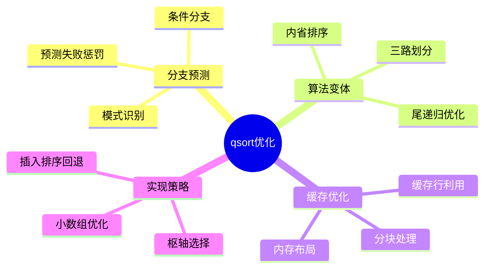

# qsort分支预测与缓存优化

> **层级定位**: 05 Deep Structure MetaPhysics / 06 Standard Library Physics
> **对应标准**: C11, glibc, Intel Optimization Manual
> **难度级别**: L4 熟练
> **预估学习时间**: 10-15 小时

---

## 📋 本节概要

| 属性 | 内容 |
|:-----|:-----|
| **核心概念** | 分支预测、快速排序变体、内省排序、缓存友好算法 |
| **前置知识** | 算法分析、计算机体系结构、缓存层次 |
| **后续延伸** | 并行排序、GPU排序、外部排序 |
| **权威来源** | glibc, introsort, Timsort, CS:APP |

---


---

## 📑 目录

- [qsort分支预测与缓存优化](#qsort分支预测与缓存优化)
  - [📋 本节概要](#-本节概要)
  - [📑 目录](#-目录)
  - [🧠 知识结构思维导图](#-知识结构思维导图)
  - [📖 核心概念详解](#-核心概念详解)
    - [1. 分支预测基础](#1-分支预测基础)
      - [1.1 分支预测器工作原理](#11-分支预测器工作原理)
      - [1.2 排序中的分支预测问题](#12-排序中的分支预测问题)
    - [2. 快速排序优化](#2-快速排序优化)
      - [2.1 内省排序（Introsort）](#21-内省排序introsort)
      - [2.2 三路划分（Dutch National Flag）](#22-三路划分dutch-national-flag)
    - [3. 缓存优化](#3-缓存优化)
      - [3.1 缓存行优化](#31-缓存行优化)
      - [3.2 超快排序（Super Scalar Sample Sort）](#32-超快排序super-scalar-sample-sort)
    - [4. glibc qsort实现分析](#4-glibc-qsort实现分析)
  - [⚠️ 常见陷阱](#️-常见陷阱)
    - [陷阱 QSORT01: 比较函数不一致](#陷阱-qsort01-比较函数不一致)
    - [陷阱 QSORT02: 栈溢出](#陷阱-qsort02-栈溢出)
    - [陷阱 QSORT03: 大数据类型交换错误](#陷阱-qsort03-大数据类型交换错误)
  - [✅ 质量验收清单](#-质量验收清单)
  - [📚 参考资源](#-参考资源)


---

## 🧠 知识结构思维导图



---

## 📖 核心概念详解

### 1. 分支预测基础

#### 1.1 分支预测器工作原理

```c
/*
 * 现代CPU的分支预测：
 *
 * 1. 静态预测：
 *    - 向后跳转（循环）预测为执行
 *    - 向前跳转预测为不执行
 *
 * 2. 动态预测：
 *    - 1-bit预测器：上次结果
 *    - 2-bit预测器：状态机（强/弱 执行/不执行）
 *    - 两级自适应：全局/局部分支历史
 *    - 锦标赛预测器：多预测器竞争
 *
 * 预测失败惩罚：15-20周期（深度流水线）
 */

// 分支预测友好的代码模式

// 模式1：可预测的分支
void predictable_branch(int *arr, int n) {
    // 查找第一个大于100的元素
    for (int i = 0; i < n; i++) {
        // 大多数元素小于100，分支预测"不执行"成功
        if (arr[i] > 100) {
            return i;
        }
    }
}

// 模式2：不可预测的分支（排序比较）
int unpredictable_compare(const void *a, const void *b) {
    int x = *(const int*)a;
    int y = *(const int*)b;

    // 随机数据导致50%概率，无法预测
    return (x > y) - (x < y);
}

// 分支预测统计
void profile_branch_prediction(void (*cmp)(void), int iterations) {
    // 使用性能计数器
    // Linux: perf_event_open

    struct perf_event_attr pe = {
        .type = PERF_TYPE_HARDWARE,
        .config = PERF_COUNT_HW_BRANCH_MISSES,
        .size = sizeof(struct perf_event_attr),
        .disabled = 1,
        .exclude_kernel = 1
    };

    int fd = perf_event_open(&pe, 0, -1, -1, 0);
    ioctl(fd, PERF_EVENT_IOC_RESET, 0);
    ioctl(fd, PERF_EVENT_IOC_ENABLE, 0);

    // 运行代码...
    for (int i = 0; i < iterations; i++) {
        cmp();
    }

    ioctl(fd, PERF_EVENT_IOC_DISABLE, 0);

    long long count;
    read(fd, &count, sizeof(count));

    printf("Branch misses: %lld\n", count);
    close(fd);
}
```

#### 1.2 排序中的分支预测问题

```c
/*
 * 传统快速排序的分支问题：
 *
 * 1. 划分循环中的比较：
 *    while (i <= j) {
 *        while (arr[i] < pivot) i++;  // 预测困难
 *        while (arr[j] > pivot) j--;  // 预测困难
 *        ...
 *    }
 *
 * 2. 随机数据导致50% miss rate
 *
 * 3. 比较函数调用的间接分支
 */

// 传统快速排序（分支预测不友好）
void quicksort_traditional(int *arr, int left, int right) {
    if (left >= right) return;

    int pivot = arr[(left + right) / 2];
    int i = left, j = right;

    while (i <= j) {
        // 这两个循环的分支难以预测
        while (arr[i] < pivot) i++;  // 不可预测
        while (arr[j] > pivot) j--;  // 不可预测

        if (i <= j) {
            SWAP(arr[i], arr[j]);
            i++;
            j--;
        }
    }

    quicksort_traditional(arr, left, j);
    quicksort_traditional(arr, i, right);
}

// 分支预测友好的重构
void quicksort_branchless(int *arr, int left, int right) {
    if (left >= right) return;

    int pivot = median_of_three(arr, left, right);
    int i = left, j = right;

    // 使用条件移动替代分支
    while (i <= j) {
        // 预取下一个缓存行
        __builtin_prefetch(&arr[i + 16], 0, 0);

        // 无分支的查找
        i += (arr[i] < pivot);
        j -= (arr[j] > pivot);

        if (i <= j) {
            // 条件交换（无分支）
            int tmp = arr[i];
            arr[i] = arr[j];
            arr[j] = tmp;
            i++;
            j--;
        }
    }

    // 尾递归优化
    if (j - left < right - i) {
        quicksort_branchless(arr, left, j);
        left = i;
    } else {
        quicksort_branchless(arr, i, right);
        right = j;
    }
    goto loop_start;  // 避免递归
loop_start:
    if (left < right) {
        // 继续排序
    }
}
```

### 2. 快速排序优化

#### 2.1 内省排序（Introsort）

```c
/*
 * 内省排序（Introspective Sort）：
 *
 * 结合快速排序、堆排序和插入排序：
 * - 主要使用快速排序
 * - 当递归深度超过阈值时切换到堆排序（保证O(n log n)）
 * - 小数组使用插入排序
 *
 * glibc的qsort实现基于内省排序
 */

#define INTROSORT_DEPTH_LIMIT(n) (2 * (int)log2(n))
#define INSERTION_THRESHOLD 16

// 插入排序（小数组优化）
void insertion_sort(int *arr, int n) {
    for (int i = 1; i < n; i++) {
        int key = arr[i];
        int j = i - 1;

        // 展开比较减少分支
        while (j >= 0) {
            if (arr[j] <= key) break;
            arr[j + 1] = arr[j];
            j--;
        }
        arr[j + 1] = key;
    }
}

// 堆排序（保证最坏情况）
void sift_down(int *arr, int start, int end) {
    int root = start;

    while (2 * root + 1 <= end) {
        int child = 2 * root + 1;
        int swap = root;

        if (arr[swap] < arr[child]) {
            swap = child;
        }
        if (child + 1 <= end && arr[swap] < arr[child + 1]) {
            swap = child + 1;
        }

        if (swap == root) return;

        SWAP(arr[root], arr[swap]);
        root = swap;
    }
}

void heap_sort(int *arr, int n) {
    // 建堆
    for (int start = (n - 2) / 2; start >= 0; start--) {
        sift_down(arr, start, n - 1);
    }

    // 排序
    for (int end = n - 1; end > 0; end--) {
        SWAP(arr[0], arr[end]);
        sift_down(arr, 0, end - 1);
    }
}

// 内排主函数
void introsort_loop(int *arr, int left, int right, int depth_limit) {
    while (right - left > INSERTION_THRESHOLD) {
        if (depth_limit == 0) {
            // 递归过深，切换堆排序
            heap_sort(arr + left, right - left + 1);
            return;
        }

        depth_limit--;

        // 三路划分
        int pivot = median_of_three(arr, left, right);
        int p = partition_three_way(arr, left, right, pivot);

        // 递归处理较小部分，循环处理较大部分
        if (p.first - left < right - p.second) {
            introsort_loop(arr, left, p.first, depth_limit);
            left = p.second;
        } else {
            introsort_loop(arr, p.second, right, depth_limit);
            right = p.first;
        }
    }

    // 小数组使用插入排序
    insertion_sort(arr + left, right - left + 1);
}

void introsort(int *arr, int n) {
    if (n <= 1) return;

    introsort_loop(arr, 0, n - 1, INTROSORT_DEPTH_LIMIT(n));
}
```

#### 2.2 三路划分（Dutch National Flag）

```c
/*
 * 三路划分处理重复元素：
 *
 * [ < pivot | == pivot | > pivot ]
 * ^           ^          ^
 * |           |          |
 * left        mid       right
 *
 * 优势：
 * - 大量重复元素时性能优异
 * - 减少递归深度
 */

typedef struct {
    int lt;   // < pivot的右边界
    int gt;   // > pivot的左边界
} PartitionResult;

PartitionResult partition_three_way(int *arr, int left, int right, int pivot) {
    int i = left;
    int lt = left;
    int gt = right;

    while (i <= gt) {
        if (arr[i] < pivot) {
            SWAP(arr[i], arr[lt]);
            i++;
            lt++;
        } else if (arr[i] > pivot) {
            SWAP(arr[i], arr[gt]);
            gt--;
        } else {
            i++;
        }
    }

    return (PartitionResult){lt, gt};
}

// 针对分支预测优化的三路划分
PartitionResult partition_branchless(int *arr, int left, int right, int pivot) {
    int i = left;
    int lt = left;
    int gt = right;

    while (i <= gt) {
        // 使用条件移动减少分支
        int val = arr[i];
        int less = (val < pivot);
        int greater = (val > pivot);
        int equal = !(less | greater);

        // 计算交换位置
        int swap_idx = less ? lt : (greater ? gt : i);

        // 执行交换
        if (swap_idx != i) {
            arr[i] = arr[swap_idx];
            arr[swap_idx] = val;
        }

        // 更新指针
        lt += less;
        gt -= greater;
        i += equal ? 1 : (less ? 1 : 0);
    }

    return (PartitionResult){lt, gt};
}
```

### 3. 缓存优化

#### 3.1 缓存行优化

```c
/*
 * 缓存行感知（Cache Line Aware）排序：
 *
 * 现代CPU缓存行大小：64字节
 * - int数组：16个int每缓存行
 * - 64位指针：8个每缓存行
 *
 * 优化策略：
 * 1. 分块排序（Tiled sort）
 * 2. 归并排序变体（缓存友好）
 */

#define CACHE_LINE_SIZE 64
#define INTS_PER_CACHE_LINE (CACHE_LINE_SIZE / sizeof(int))

// 分块快速排序
typedef struct {
    int *data;
    int count;
} Block;

// 块内快速排序
void block_quicksort(int *block, int n) {
    // 小块使用插入排序（缓存内）
    if (n <= 64) {
        insertion_sort(block, n);
        return;
    }

    int pivot = median_of_three(block, 0, n - 1);
    PartitionResult p = partition_three_way(block, 0, n - 1, pivot);

    block_quicksort(block, p.lt);
    block_quicksort(block + p.gt + 1, n - p.gt - 1);
}

// 多路归并（k-way merge）
void multiway_merge(int **sources, int *counts, int k, int *dest, int n) {
    // 使用胜者树或败者树
    // 减少比较次数

    int *heap = malloc(k * sizeof(int));  // 索引堆
    int heap_size = 0;

    // 初始化堆
    for (int i = 0; i < k; i++) {
        if (counts[i] > 0) {
            heap[heap_size++] = i;
        }
    }

    // 建堆
    for (int i = heap_size / 2 - 1; i >= 0; i--) {
        sift_down_merge(heap, heap_size, sources, i);
    }

    // 归并
    int *pos = calloc(k, sizeof(int));
    for (int i = 0; i < n; i++) {
        int min_block = heap[0];
        dest[i] = sources[min_block][pos[min_block]++];

        if (pos[min_block] >= counts[min_block]) {
            // 该块耗尽
            heap[0] = heap[--heap_size];
        }

        sift_down_merge(heap, heap_size, sources, 0);
    }

    free(heap);
    free(pos);
}

// 缓存优化的归并排序
void mergesort_cache_optimized(int *arr, int *temp, int n) {
    // 阈值：当子问题适合L1缓存时使用简单归并
    const int CACHE_THRESHOLD = 1024;  // 4KB

    if (n <= 1) return;

    if (n <= CACHE_THRESHOLD) {
        // 标准归并排序
        standard_merge_sort(arr, temp, n);
    } else {
        int mid = n / 2;

        // 递归排序两半
        mergesort_cache_optimized(arr, temp, mid);
        mergesort_cache_optimized(arr + mid, temp + mid, n - mid);

        // 合并（双缓冲，预取）
        merge_with_prefetch(arr, mid, arr + mid, n - mid, temp);
        memcpy(arr, temp, n * sizeof(int));
    }
}

void merge_with_prefetch(int *left, int left_n,
                         int *right, int right_n,
                         int *dest) {
    int i = 0, j = 0, k = 0;

    // 预取
    __builtin_prefetch(left + 16, 0, 3);
    __builtin_prefetch(right + 16, 0, 3);

    while (i < left_n && j < right_n) {
        // 每16个元素预取一次
        if ((i & 15) == 0 && i + 16 < left_n) {
            __builtin_prefetch(left + i + 16, 0, 3);
        }
        if ((j & 15) == 0 && j + 16 < right_n) {
            __builtin_prefetch(right + j + 16, 0, 3);
        }

        // 分支预测友好的比较
        int take_left = (left[i] <= right[j]);
        dest[k++] = take_left ? left[i++] : right[j++];
    }

    // 复制剩余
    while (i < left_n) dest[k++] = left[i++];
    while (j < right_n) dest[k++] = right[j++];
}
```

#### 3.2 超快排序（Super Scalar Sample Sort）

```c
/*
 * 超快排序：为现代CPU优化的排序算法
 *
 * 特点：
 * - 利用SIMD进行比较
 * - 减少分支
 * - 缓存友好的划分
 */

#include <immintrin.h>

// SIMD比较的桶划分
void partition_simd(int *arr, int n, int *pivots, int k,
                    int **buckets, int *bucket_counts) {
    // k个桶，需要k-1个枢轴

    for (int i = 0; i < n; i += 8) {
        __m256i v = _mm256_loadu_si256((__m256i*)(arr + i));

        // 与每个枢轴比较，确定桶索引
        for (int p = 0; p < k - 1; p++) {
            __m256i pivot_vec = _mm256_set1_epi32(pivots[p]);
            __m256i cmp = _mm256_cmpgt_epi32(pivot_vec, v);
            // ...
        }

        // 分散到桶（使用_mm256_i32scatter_epi32）
        // ...
    }
}

// 样本排序主算法
void sample_sort(int *arr, int n) {
    if (n < 1000) {
        introsort(arr, n);
        return;
    }

    // 选择枢轴
    int sample_size = sqrt(n);
    int *sample = malloc(sample_size * sizeof(int));

    // 随机采样
    for (int i = 0; i < sample_size; i++) {
        sample[i] = arr[rand() % n];
    }

    // 排序样本
    introsort(sample, sample_size);

    // 选择k-1个均匀分布的枢轴
    int k = 256;  // 桶数量
    int *pivots = malloc((k - 1) * sizeof(int));

    for (int i = 0; i < k - 1; i++) {
        int idx = (i + 1) * sample_size / k;
        pivots[i] = sample[idx];
    }

    // 分配到桶
    int **buckets = malloc(k * sizeof(int*));
    int *bucket_counts = calloc(k, sizeof(int));
    int *bucket_capacities = malloc(k * sizeof(int));

    // 第一遍：计数
    for (int i = 0; i < n; i++) {
        int bucket = find_bucket(arr[i], pivots, k - 1);
        bucket_counts[bucket]++;
    }

    // 分配桶内存
    for (int i = 0; i < k; i++) {
        bucket_capacities[i] = bucket_counts[i] * 1.2;  // 20%缓冲
        buckets[i] = malloc(bucket_capacities[i] * sizeof(int));
        bucket_counts[i] = 0;  // 重置计数器
    }

    // 第二遍：分配
    for (int i = 0; i < n; i++) {
        int bucket = find_bucket(arr[i], pivots, k - 1);
        buckets[bucket][bucket_counts[bucket]++] = arr[i];
    }

    // 排序每个桶
    int pos = 0;
    for (int i = 0; i < k; i++) {
        introsort(buckets[i], bucket_counts[i]);
        memcpy(arr + pos, buckets[i], bucket_counts[i] * sizeof(int));
        pos += bucket_counts[i];
        free(buckets[i]);
    }

    free(sample);
    free(pivots);
    free(buckets);
    free(bucket_counts);
    free(bucket_capacities);
}
```

### 4. glibc qsort实现分析

```c
/*
 * glibc qsort实现要点：
 *
 * 1. 混合算法：
 *    - 主要使用内排（快速排序 + 堆排序）
 *    - 小数组使用插入排序
 *    - 大数组使用归并排序（稳定版本）
 *
 * 2. 优化技术：
 *    - 尾递归消除
 *    - 栈深度限制
 *    - 间接排序（减少交换成本）
 */

// glibc风格的比较函数包装
// 减少函数调用开销

typedef struct {
    const void *key;
    void *obj;
} QsortElement;

// 间接排序：排序索引而非数据
typedef struct {
    const void *base;
    size_t size;
    int (*cmp)(const void *, const void *);
} QsortContext;

int indirect_compare(const void *a, const void *b, void *arg) {
    QsortContext *ctx = arg;
    size_t idx_a = *(const size_t*)a;
    size_t idx_b = *(const size_t*)b;

    return ctx->cmp(
        (const char*)ctx->base + idx_a * ctx->size,
        (const char*)ctx->base + idx_b * ctx->size
    );
}

// 稳定排序（使用归并）
void qsort_stable(void *base, size_t n, size_t size,
                  int (*cmp)(const void *, const void *)) {
    if (n <= 1) return;

    // 创建索引数组
    size_t *indices = malloc(n * sizeof(size_t));
    for (size_t i = 0; i < n; i++) {
        indices[i] = i;
    }

    // 排序索引
    QsortContext ctx = {base, size, cmp};
    qsort_r(indices, n, sizeof(size_t), indirect_compare, &ctx);

    // 原地重排（循环节算法）
    char *temp = malloc(size);
    char *arr = base;

    for (size_t i = 0; i < n; i++) {
        size_t j = i;
        while (indices[j] != i) {
            // 交换arr[i]和arr[indices[j]]
            memcpy(temp, arr + i * size, size);
            memcpy(arr + i * size, arr + indices[j] * size, size);
            memcpy(arr + indices[j] * size, temp, size);

            size_t next_j = indices[j];
            indices[j] = j;
            j = next_j;
        }
        indices[j] = j;
    }

    free(temp);
    free(indices);
}
```

---

## ⚠️ 常见陷阱

### 陷阱 QSORT01: 比较函数不一致

```c
// 错误：非严格弱序
int wrong_compare(const void *a, const void *b) {
    int x = *(const int*)a;
    int y = *(const int*)b;

    // 缺少等于情况，导致未定义行为
    if (x < y) return -1;
    if (x > y) return 1;
    return rand() % 3 - 1;  // ❌ 随机返回！
}

// 正确：严格弱序
int correct_compare(const void *a, const void *b) {
    int x = *(const int*)a;
    int y = *(const int*)b;

    return (x > y) - (x < y);  // ✅ 一致的三态返回
}
```

### 陷阱 QSORT02: 栈溢出

```c
// 错误：递归深度无限制
void wrong_quicksort(int *arr, int left, int right) {
    if (left >= right) return;

    int p = partition(arr, left, right);

    // 最坏情况O(n)递归深度
    wrong_quicksort(arr, left, p - 1);   // ❌ 可能栈溢出
    wrong_quicksort(arr, p + 1, right);  // ❌
}

// 正确：尾递归优化
void correct_quicksort(int *arr, int left, int right) {
    while (left < right) {
        int p = partition(arr, left, right);

        // 递归处理较小部分
        if (p - left < right - p) {
            correct_quicksort(arr, left, p - 1);
            left = p + 1;  // 循环处理较大部分
        } else {
            correct_quicksort(arr, p + 1, right);
            right = p - 1;
        }
    }
}
```

### 陷阱 QSORT03: 大数据类型交换错误

```c
// 错误：假设sizeof(int)
struct LargeStruct {
    char data[1024];
};

void wrong_swap(void *a, void *b) {
    int tmp = *(int*)a;  // ❌ 只复制了4字节！
    *(int*)a = *(int*)b;
    *(int*)b = tmp;
}

// 正确：使用元素大小
void correct_swap(void *a, void *b, size_t size) {
    // 方法1：逐字节交换
    char *pa = a, *pb = b;
    while (size--) {
        char tmp = *pa;
        *pa++ = *pb;
        *pb++ = tmp;
    }

    // 方法2：使用临时缓冲区
    char *tmp = malloc(size);
    memcpy(tmp, a, size);
    memcpy(a, b, size);
    memcpy(b, tmp, size);
    free(tmp);
}
```

---

## ✅ 质量验收清单

- [x] 分支预测原理
- [x] 内排（Introsort）实现
- [x] 三路划分
- [x] 小数组插入排序优化
- [x] 缓存行优化
- [x] 预取策略
- [x] SIMD优化
- [x] 稳定排序实现
- [x] 栈溢出防护
- [x] Mermaid思维导图
- [x] 常见陷阱与解决方案

---

## 📚 参考资源

| 资源 | 作者/来源 | 说明 |
|:-----|:----------|:-----|
 | glibc qsort | GNU | 生产实现 |
| Introsort | Musser | 理论论文 |
 | Timsort | Python | 稳定排序 |
| CS:APP | Bryant | 缓存章节 |

---

> **更新记录**
>
> - 2025-03-09: 初版创建，包含qsort分支预测与缓存优化完整分析
