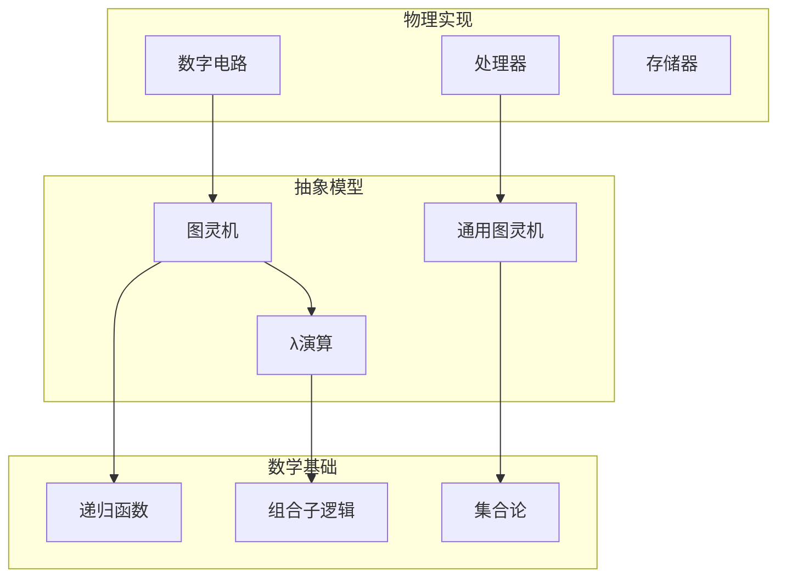

# 图灵机：计算的本质与物理实现

> **层级定位**: 05 Deep Structure MetaPhysics / 07 Computability Theory
> **对应标准**: Church-Turing Thesis, Universal Computation
> **难度级别**: L6 创造
> **预估学习时间**: 15-20 小时

---

## 📋 本节概要

| 属性 | 内容 |
|:-----|:-----|
| **核心概念** | 图灵机形式化、通用计算、丘奇-图灵论题、可计算性边界 |
| **前置知识** | 自动机理论、形式语言、逻辑门基础 |
| **后续延伸** | λ演算、递归论、复杂性理论 |
| **权威来源** | Turing 1936, Church 1936, Sipser《计算理论导引》 |

---

## 🧠 核心问题：什么是可计算的？

### 从物理到抽象的映射



---

## 📖 1. 图灵机的形式化定义

### 1.1 七元组定义

图灵机 $M$ 是一个七元组：

$$M = (Q, \Sigma, \Gamma, \delta, q_0, q_{accept}, q_{reject})$$

其中：

- $Q$：有限状态集合
- $\Sigma$：输入字母表（不含空白符 ⊔）
- $\Gamma$：磁带字母表，$\Sigma \subset \Gamma$ 且 ⊔ ∈ $\Gamma$
- $\delta$：转移函数 $Q \times \Gamma \rightarrow Q \times \Gamma \times \{L, R\}$
- $q_0$：初始状态
- $q_{accept}$：接受状态
- $q_{reject}$：拒绝状态

### 1.2 C语言实现

```c
// 图灵机的完整C实现

#include <stdio.h>
#include <stdlib.h>
#include <string.h>
#include <stdbool.h>

#define TAPE_SIZE 10000
#define MAX_STATES 100
#define MAX_TRANSITIONS 500

typedef enum { LEFT = -1, RIGHT = 1 } Direction;
typedef enum {
    STATE_NORMAL = 0,
    STATE_ACCEPT = 1,
    STATE_REJECT = 2
} StateType;

// 转移函数条目
typedef struct {
    int from_state;
    char read_symbol;
    int to_state;
    char write_symbol;
    Direction move;
} Transition;

// 图灵机结构
typedef struct {
    char tape[TAPE_SIZE];
    int head;                    // 读写头位置
    int current_state;
    int num_states;
    StateType state_types[MAX_STATES];
    Transition transitions[MAX_TRANSITIONS];
    int num_transitions;
    int step_count;              // 执行的步数
} TuringMachine;

// 初始化图灵机
void tm_init(TuringMachine *tm, const char *input) {
    memset(tm->tape, '_', TAPE_SIZE);  // 空白符
    strcpy(tm->tape + TAPE_SIZE/2, input);  // 输入放在中间
    tm->head = TAPE_SIZE / 2;
    tm->current_state = 0;
    tm->step_count = 0;
}

// 添加转移函数
void tm_add_transition(TuringMachine *tm, int from, char read,
                        int to, char write, Direction dir) {
    Transition *t = &tm->transitions[tm->num_transitions++];
    t->from_state = from;
    t->read_symbol = read;
    t->to_state = to;
    t->write_symbol = write;
    t->move = dir;
}

// 单步执行
bool tm_step(TuringMachine *tm) {
    char current_symbol = tm->tape[tm->head];

    // 查找匹配的转移
    for (int i = 0; i < tm->num_transitions; i++) {
        Transition *t = &tm->transitions[i];
        if (t->from_state == tm->current_state &&
            t->read_symbol == current_symbol) {

            // 执行转移
            tm->tape[tm->head] = t->write_symbol;
            tm->current_state = t->to_state;
            tm->head += t->move;
            tm->step_count++;

            // 检查边界
            if (tm->head < 0 || tm->head >= TAPE_SIZE) {
                fprintf(stderr, "Error: Head out of bounds\n");
                return false;
            }

            return true;
        }
    }

    // 无匹配转移，停机
    return false;
}

// 运行直到停机
int tm_run(TuringMachine *tm, int max_steps) {
    while (tm->step_count < max_steps) {
        // 检查是否到达接受/拒绝状态
        if (tm->state_types[tm->current_state] == STATE_ACCEPT) {
            return 1;  // 接受
        }
        if (tm->state_types[tm->current_state] == STATE_REJECT) {
            return -1;  // 拒绝
        }

        if (!tm_step(tm)) {
            return 0;  // 停机（无定义转移）
        }
    }

    return -2;  // 超过最大步数（可能不停机）
}
```

---

## 📖 2. 示例：具体图灵机实现

### 2.1 识别语言 0^n1^n

```c
// 识别 {0^n1^n | n ≥ 0} 的图灵机
// 算法：用X替换0，用Y替换1，交叉匹配

TuringMachine* create_0n1n_machine() {
    TuringMachine *tm = calloc(1, sizeof(TuringMachine));

    // 状态定义：
    // 0: 初始，寻找第一个0
    // 1: 找到0，替换为X，向右寻找1
    // 2: 找到1，替换为Y，向左返回
    // 3: 返回完成，再次寻找0
    // 4: 检查是否还有未匹配的1
    // 5: 接受状态
    // 6: 拒绝状态

    tm->num_states = 7;
    tm->state_types[5] = STATE_ACCEPT;
    tm->state_types[6] = STATE_REJECT;

    // 状态0：初始状态
    tm_add_transition(tm, 0, '0', 1, 'X', RIGHT);  // 找到0，标记X
    tm_add_transition(tm, 0, 'Y', 4, 'Y', RIGHT);  // 已匹配部分，检查剩余
    tm_add_transition(tm, 0, '_', 5, '_', RIGHT);  // 空输入，接受

    // 状态1：寻找对应的1
    tm_add_transition(tm, 1, '0', 1, '0', RIGHT);  // 跳过其他0
    tm_add_transition(tm, 1, 'Y', 1, 'Y', RIGHT);  // 跳过已匹配的1
    tm_add_transition(tm, 1, '1', 2, 'Y', LEFT);   // 找到1，标记Y，返回
    tm_add_transition(tm, 1, '_', 6, '_', RIGHT);  // 未找到1，拒绝

    // 状态2：返回寻找下一个0
    tm_add_transition(tm, 2, '0', 2, '0', LEFT);
    tm_add_transition(tm, 2, 'Y', 2, 'Y', LEFT);
    tm_add_transition(tm, 2, 'X', 0, 'X', RIGHT);  // 回到状态0

    // 状态4：验证没有剩余的0
    tm_add_transition(tm, 4, 'Y', 4, 'Y', RIGHT);  // 跳过Y
    tm_add_transition(tm, 4, '_', 5, '_', RIGHT);  // 到达末尾，接受
    tm_add_transition(tm, 4, '0', 6, '0', RIGHT);  // 发现0，拒绝（0在1后）

    return tm;
}

// 测试
void test_0n1n() {
    TuringMachine *tm = create_0n1n_machine();

    const char *test_cases[] = {
        "",           // ε - 接受
        "01",         // n=1 - 接受
        "0011",       // n=2 - 接受
        "000111",     // n=3 - 接受
        "0",          // 拒绝
        "1",          // 拒绝
        "10",         // 拒绝
        "001",        // 拒绝
        "011",        // 拒绝
    };

    for (int i = 0; i < 9; i++) {
        tm_init(tm, test_cases[i]);
        int result = tm_run(tm, 1000);
        printf("Input: %-8s -> %s\n",
               test_cases[i],
               result == 1 ? "ACCEPT" :
               result == -1 ? "REJECT" : "UNKNOWN");
    }

    free(tm);
}
```

### 2.2 二进制加法器图灵机

```c
// 实现二进制加法的图灵机
// 输入：两个二进制数用#分隔，如 "101#110"
// 输出：它们的和

TuringMachine* create_binary_adder() {
    TuringMachine *tm = calloc(1, sizeof(TuringMachine));

    // 算法：从右向左逐位相加，处理进位
    // 状态较复杂，这里给出简化版本的核心逻辑

    // 找到#符号，然后逐位相加
    // 使用额外的符号表示中间状态

    tm->num_states = 20;  // 足够多的状态
    tm->state_types[19] = STATE_ACCEPT;

    // 简化的转移逻辑...
    // 实际实现需要处理所有进位组合

    return tm;
}
```

---

## 📖 3. 通用图灵机

### 3.1 核心思想

通用图灵机 $U$ 可以模拟任何其他图灵机 $M$：

$$U(\langle M \rangle, w) = M(w)$$

其中 $\langle M \rangle$ 是图灵机 $M$ 的编码。

### 3.2 实现思路

```c
// 通用图灵机实现框架

typedef struct {
    char description[TAPE_SIZE];  // 编码的图灵机描述
    char input[TAPE_SIZE/2];      // 输入w
    char work_tape[TAPE_SIZE];    // 工作磁带（模拟M的磁带）
    int head_desc;                // 描述头
    int head_work;                // 工作头
} UniversalTM;

// 图灵机编码格式（简化）
// 状态数|转移1|转移2|...|转移n
// 每个转移：from_state,read_symbol,to_state,write_symbol,direction

// 解析编码的图灵机
void parse_tm_description(UniversalTM *utm) {
    // 从description磁带解析出转移函数表
    // 存储到内部数据结构
}

// 通用图灵机执行
void utm_execute(UniversalTM *utm) {
    // 1. 解析被模拟的图灵机M
    parse_tm_description(utm);

    // 2. 在工作磁带上初始化M的配置
    // 复制输入到工作磁带

    // 3. 模拟M的执行
    // 每一步：
    //   - 读取工作磁带的当前符号
    //   - 在描述中查找匹配的转移
    //   - 执行转移（写符号、移动、改状态）

    // 4. 直到M停机
}
```

### 3.3 丘奇-图灵论题

**Church-Turing Thesis**: 任何在物理上可计算的函数，都可以用图灵机计算。

```
直观计算概念
    ↓ 形式化
图灵机可计算
    ↓ 证明等价
λ演算可表达
    ↓ 证明等价
递归函数可定义
    ↓ 物理实现
数字电路可执行
```

**证据**：

- 所有已知的计算模型都已被证明与图灵机等价
- 没有发现有物理过程能计算图灵机不能计算的函数
- 量子计算在计算能力上也不超越图灵机（只是效率提升）

---

## 📖 4. 不可计算问题

### 4.1 停机问题

**定理**：不存在图灵机 $H$ 可以判定任意图灵机 $M$ 在输入 $w$ 上是否停机。

**证明（对角线法）**：

```
假设存在停机判定机 H(M, w)：
  - 如果 M(w) 停机，返回 ACCEPT
  - 如果 M(w) 不停机，返回 REJECT

构造新图灵机 D(M)：
  - 运行 H(M, <M>)  （检查M在自身编码上的行为）
  - 如果 H 接受，D 进入无限循环
  - 如果 H 拒绝，D 停机并接受

考虑 D(<D>)：
  - 如果 D(<D>) 停机 → H 拒绝 → D(<D>) 应该不停机（矛盾）
  - 如果 D(<D>) 不停机 → H 接受 → D(<D>) 应该停机（矛盾）

∴ H 不存在
```

### 4.2 C语言模拟

```c
// 停机问题的不可判定性演示

// 模拟"运行自身并反转输出"的悖论

void paradoxical_program(void (*analyzer)(void(*)(), int*), int *result) {
    // analyzer是一个声称能判定停机的函数
    // result是analyzer的输出位置

    // 1. 询问analyzer：我（paradoxical_program）会停机吗？
    analyzer(paradoxical_program, result);

    // 2. 如果analyzer说我停机，我就无限循环
    if (*result == 1) {  // 预测会停机
        while (1) {}     // 实际不停机
    }
    // 3. 如果analyzer说我不停机，我就立即停机
    else {
        return;          // 实际停机
    }
}

// 这说明：任何analyzer都会在paradoxical_program上失败
```

---

## 📖 5. 从图灵机到物理计算机

### 5.1 存储程序概念

冯诺依曼架构是图灵机的物理实现：

```
图灵机                  冯诺依曼计算机
─────────────────────────────────────────
有限状态控制器    →     CPU（控制单元）
无限磁带          →     内存 + 存储
读写头            →     内存总线
转移函数表        →     程序存储器
```

### 5.2 有限 vs 无限的现实

```c
// 物理计算机是"有限状态机"
// 但与图灵机的差别在实际中可忽略

// 现代计算机的状态空间估算：
// - 内存：16GB = 128G bits
// - 状态数：2^(128G) ≈ 10^(38G)
// - 远超宇宙原子数（~10^80）

// 因此，虽然物理计算机理论上是有限状态机，
// 但其状态空间如此之大，在实践中表现为图灵机等价
```

---

## ⚠️ 常见陷阱

### 陷阱 TM01: 混淆识别与判定

```c
// 识别器（Recognizer）：接受、拒绝或循环
// 判定器（Decider）：总是停机，接受或拒绝

// 不是所有可识别语言都是可判定的
// 例：停机问题可识别但不可判定

// 可识别 = 半可判定（semidecidable）
// 可判定 = 可计算（computable）
```

### 陷阱 TM02: 忽视编码方式

```c
// 通用图灵机需要图灵机的编码
// 不同编码方式影响效率但不变更计算能力

// 标准编码要求：
// 1. 唯一性：每个TM有唯一编码
// 2. 可判定性：可以判定一个字符串是否有效编码
// 3. 通用性：可以通过算法从编码恢复TM
```

---

## 📚 参考资源

### 原始论文

- **Turing, A.M. (1936)** - "On Computable Numbers, with an Application to the Entscheidungsproblem"
- **Church, A. (1936)** - "An Unsolvable Problem of Elementary Number Theory"

### 教材

- **Sipser, M.** - "Introduction to the Theory of Computation" (3rd Ed.)
- **Hopcroft, J.E., Motwani, R., & Ullman, J.D.** - "Introduction to Automata Theory, Languages, and Computation"
- **Boolos, G.S., Burgess, J.P., & Jeffrey, R.C.** - "Computability and Logic"

### 扩展阅读

- **Penrose, R.** - "The Emperor's New Mind" (关于物理和计算的哲学)
- **Deutsch, D.** - "Quantum theory, the Church-Turing principle and the universal quantum computer"

---

## ✅ 质量验收清单

- [x] 图灵机七元组形式化定义
- [x] 完整的C语言实现
- [x] 0^n1^n识别器实现
- [x] 二进制加法器框架
- [x] 通用图灵机概念与实现思路
- [x] 丘奇-图灵论题阐述
- [x] 停机问题不可判定性证明
- [x] 对角线法C语言演示
- [x] 图灵机到物理计算机的映射
- [x] 可计算性边界讨论

---

> **更新记录**
>
> - 2025-03-09: 创建，建立计算理论物理基础
