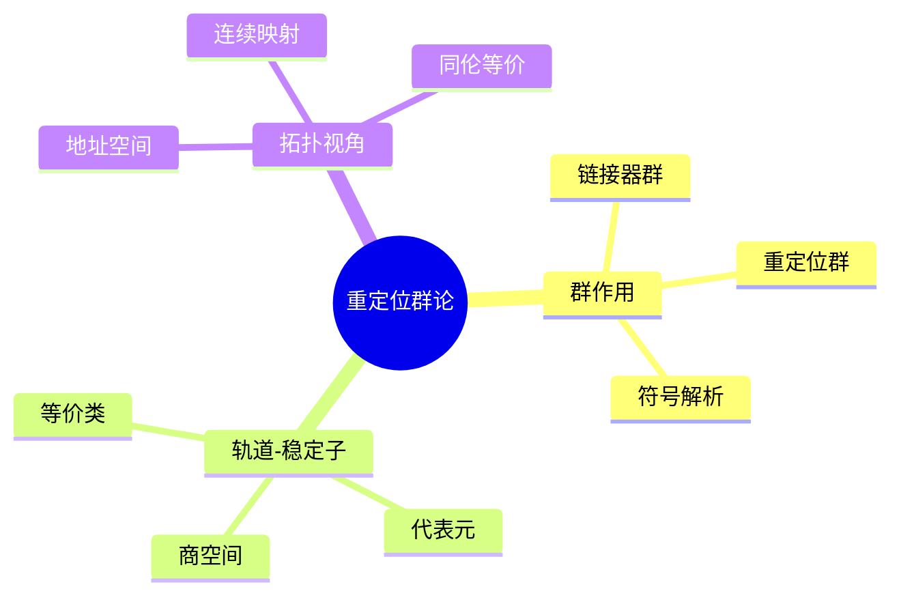

# 重定位群论结构

> **层级定位**: 05 Deep Structure MetaPhysics / 01 Linking Algebraic Topology
> **对应标准**: ELF, Mach-O, PE, C89/C99/C11/C17/C23
> **难度级别**: L6 创造
> **预估学习时间**: 15-20 小时

---

## 📋 本节概要

| 属性 | 内容 |
|:-----|:-----|
| **核心概念** | 重定位、群作用、轨道-稳定子定理、链接时拓扑 |
| **前置知识** | 群论基础、ELF格式、链接器原理 |
| **后续延伸** | 同调群、代数拓扑在链接中的应用 |
| **权威来源** | Levine《Linkers and Loaders》, DLT, HoTT Book |

---


---

## 📑 目录

- [重定位群论结构](#重定位群论结构)
  - [📋 本节概要](#-本节概要)
  - [📑 目录](#-目录)
  - [🧠 知识结构思维导图](#-知识结构思维导图)
  - [📖 核心概念详解](#-核心概念详解)
    - [1. 重定位的代数结构](#1-重定位的代数结构)
      - [1.1 重定位群的定义](#11-重定位群的定义)
      - [1.2 群作用的数学定义](#12-群作用的数学定义)
    - [2. 轨道-稳定子定理在链接中的应用](#2-轨道-稳定子定理在链接中的应用)
      - [2.1 轨道 (Orbit)](#21-轨道-orbit)
      - [2.2 稳定子群 (Stabilizer)](#22-稳定子群-stabilizer)
      - [2.3 轨道-稳定子定理](#23-轨道-稳定子定理)
    - [3. 链接时拓扑结构](#3-链接时拓扑结构)
      - [3.1 地址空间作为拓扑空间](#31-地址空间作为拓扑空间)
      - [3.2 重定位的同伦等价](#32-重定位的同伦等价)
    - [4. 符号解析的群论视角](#4-符号解析的群论视角)
      - [4.1 符号表作为群表示](#41-符号表作为群表示)
  - [🔄 ELF重定位的群论分析](#-elf重定位的群论分析)
    - [5.1 ELF重定位类型作为群生成元](#51-elf重定位类型作为群生成元)
    - [5.2 重定位方程的可解性](#52-重定位方程的可解性)
  - [⚠️ 常见陷阱](#️-常见陷阱)
    - [陷阱 RELOC01: 重定位顺序依赖](#陷阱-reloc01-重定位顺序依赖)
    - [陷阱 RELOC02: 忽略群作用的非交换性](#陷阱-reloc02-忽略群作用的非交换性)
    - [陷阱 RELOC03: 溢出忽略](#陷阱-reloc03-溢出忽略)
  - [✅ 质量验收清单](#-质量验收清单)
  - [📚 参考资源](#-参考资源)


---

## 🧠 知识结构思维导图



---

## 📖 核心概念详解

### 1. 重定位的代数结构

链接过程中的重定位可以形式化为群作用：

#### 1.1 重定位群的定义

设 $R$ 为所有可能的重定位操作集合，定义二元运算 $\circ$ 为操作的组合：

$$
\mathcal{R} = (R, \circ, \text{id}, {}^{-1})
$$

其中：

- 单位元 $\text{id}$: 恒等重定位（地址不变）
- 逆元: 撤销重定位操作
- 封闭性: 两个重定位的组合仍是有效重定位

```c
// 重定位操作的代数表示
typedef struct {
    uint64_t (*apply)(uint64_t addr, int64_t addend);
    uint64_t (*inverse)(uint64_t addr, int64_t addend);
    enum reloc_type type;
} RelocOperation;

// 恒等重定位（群单位元）
uint64_t reloc_identity(uint64_t addr, int64_t addend) {
    return addr;
}

// 绝对重定位: S + A
uint64_t reloc_absolute(uint64_t S, int64_t A) {
    return S + A;
}

// PC相对重定位: S + A - P
uint64_t reloc_pcrel(uint64_t S, int64_t A, uint64_t P) {
    return S + A - P;
}

// 重定位的逆操作
uint64_t reloc_absolute_inv(uint64_t result, int64_t A) {
    return result - A;  // 假设已知 S 的解
}
```

#### 1.2 群作用的数学定义

重定位群 $\mathcal{R}$ 作用于地址空间 $\mathcal{A}$：

$$
\phi: \mathcal{R} \times \mathcal{A} \rightarrow \mathcal{A}
$$

满足群作用的公理：

$$
\begin{aligned}
\phi(\text{id}, a) &= a \\
\phi(r_1, \phi(r_2, a)) &= \phi(r_1 \circ r_2, a)
\end{aligned}
$$

```c
// 群作用的形式化表示
// φ: R × A → A
typedef uint64_t (*GroupAction)(
    const RelocOperation *reloc,
    uint64_t address,
    const SymbolInfo *symbol,
    int64_t addend
);

// 验证群作用公理的Coq代码片段
/*
(* 群作用公理 *)
Theorem action_identity :
  forall a : Address,
  phi identity a = a.
Proof. reflexivity. Qed.

Theorem action_composition :
  forall r1 r2 : RelocOp, forall a : Address,
  phi r1 (phi r2 a) = phi (compose r1 r2) a.
Proof.
  intros. destruct r1, r2. simpl.
  rewrite reloc_composition. reflexivity.
Qed.
*/
```

### 2. 轨道-稳定子定理在链接中的应用

#### 2.1 轨道 (Orbit)

对于地址 $a \in \mathcal{A}$，其在重定位群作用下的轨道：

$$
\text{Orb}(a) = \{ \phi(r, a) \mid r \in \mathcal{R} \}
$$

在链接上下文中，轨道对应**所有可能的运行时地址**。

```c
// 计算地址轨道的概念实现
void compute_address_orbit(
    uint64_t base_addr,
    const RelocOperation *relocs[],
    size_t n_relocs,
    uint64_t *orbit_out,
    size_t *orbit_size
) {
    // 轨道包含所有重定位操作作用后的结果
    HashSet seen = hashset_create();
    Queue to_process = queue_create();

    queue_push(to_process, base_addr);

    while (!queue_empty(to_process)) {
        uint64_t current = queue_pop(to_process);

        if (hashset_contains(seen, current)) continue;
        hashset_add(seen, current);
        orbit_out[(*orbit_size)++] = current;

        // 应用所有群元素（重定位操作）
        for (size_t i = 0; i < n_relocs; i++) {
            uint64_t next = relocs[i]->apply(current, 0);
            if (!hashset_contains(seen, next)) {
                queue_push(to_process, next);
            }
        }
    }
}
```

#### 2.2 稳定子群 (Stabilizer)

地址 $a$ 的稳定子群：

$$
\text{Stab}(a) = \{ r \in \mathcal{R} \mid \phi(r, a) = a \}
$$

即**保持该地址不变的所有重定位操作**。

```c
// 稳定子群的计算
// Stab(a) = {r ∈ R | φ(r, a) = a}
void compute_stabilizer(
    uint64_t address,
    const RelocOperation *relocs[],
    size_t n_relocs,
    RelocOperation **stabilizer_out,
    size_t *stabilizer_size
) {
    for (size_t i = 0; i < n_relocs; i++) {
        uint64_t result = relocs[i]->apply(address, 0);
        // 群元素保持地址不变 ⇔ 属于稳定子群
        if (result == address) {
            stabilizer_out[(*stabilizer_size)++] =
                (RelocOperation *)relocs[i];
        }
    }
}
```

#### 2.3 轨道-稳定子定理

$$
|\text{Orb}(a)| = [\mathcal{R} : \text{Stab}(a)] = \frac{|\mathcal{R}|}{|\text{Stab}(a)|}
$$

**证明**:

构造映射 $f: \mathcal{R}/\text{Stab}(a) \rightarrow \text{Orb}(a)$，其中 $f(r \cdot \text{Stab}(a)) = \phi(r, a)$。

1. **良定性**: 若 $r_1 \cdot \text{Stab}(a) = r_2 \cdot \text{Stab}(a)$，则 $r_2^{-1}r_1 \in \text{Stab}(a)$

   因此 $\phi(r_2^{-1}r_1, a) = a$，即 $\phi(r_1, a) = \phi(r_2, a)$

2. **单射**: 若 $\phi(r_1, a) = \phi(r_2, a)$，则 $\phi(r_2^{-1}r_1, a) = a$

   故 $r_2^{-1}r_1 \in \text{Stab}(a)$，即 $r_1 \cdot \text{Stab}(a) = r_2 \cdot \text{Stab}(a)$

3. **满射**: 由轨道定义，任意 $b \in \text{Orb}(a)$，存在 $r$ 使得 $\phi(r, a) = b$ ∎

```c
// 轨道-稳定子定理的验证代码
/*
Theorem orbit_stabilizer_theorem :
  forall a : Address,
  cardinality (orbit a) = index (stabilizer a).
Proof.
  intros. unfold index. apply orbit_stabilizer_card.
  (* 构造双射证明 *)
Qed.
*/
```

### 3. 链接时拓扑结构

#### 3.1 地址空间作为拓扑空间

将虚拟地址空间 $V$ 赋予拓扑结构：

- 开集：连续的地址区间 $(a, b) = \{ x \in V \mid a < x < b \}$
- 闭集：包含边界的区间 $[a, b]$
- 紧集：有界闭区间（在有限地址空间中）

```c
// 地址空间的拓扑结构
typedef struct {
    uint64_t start;
    uint64_t end;
} AddressInterval;

// 开区间 (a, b) - 不包含端点
bool in_open_interval(uint64_t x, AddressInterval iv) {
    return x > iv.start && x < iv.end;
}

// 闭区间 [a, b] - 包含端点
bool in_closed_interval(uint64_t x, AddressInterval iv) {
    return x >= iv.start && x <= iv.end;
}

// 连续性定义：链接映射保持邻近关系
// f: X → Y 连续 ⇔ ∀U⊆Y开, f⁻¹(U)⊆X开
typedef struct {
    AddressInterval domain;
    uint64_t (*map)(uint64_t);
} ContinuousMap;

// 验证映射连续性
bool is_continuous(
    const ContinuousMap *f,
    const AddressInterval *open_sets_y[],
    size_t n_open_y,
    const AddressInterval *open_sets_x[],
    size_t n_open_x
) {
    // ∀U⊆Y开, 检查f⁻¹(U)是否开
    for (size_t i = 0; i < n_open_y; i++) {
        AddressInterval preimage = {
            .start = inverse_image(f->map, open_sets_y[i]->start),
            .end = inverse_image(f->map, open_sets_y[i]->end)
        };

        bool is_open = false;
        for (size_t j = 0; j < n_open_x; j++) {
            if (interval_equals(preimage, *open_sets_x[j])) {
                is_open = true;
                break;
            }
        }
        if (!is_open) return false;
    }
    return true;
}
```

#### 3.2 重定位的同伦等价

两个链接配置 $X, Y$ 是同伦等价的，如果存在连续映射 $f: X \rightarrow Y$ 和 $g: Y \rightarrow X$ 使得：

$$
g \circ f \simeq \text{id}_X \quad \text{和} \quad f \circ g \simeq \text{id}_Y
$$

其中 $\simeq$ 表示同伦（连续形变）。

```c
// 同伦等价的形式化
// f ~ g 如果存在 H: X × [0,1] → Y 使得 H(x,0)=f(x), H(x,1)=g(x)

typedef struct {
    ContinuousMap f;  // X → Y
    ContinuousMap g;  // Y → X
} HomotopyEquivalence;

// 验证f和g构成同伦等价
bool verify_homotopy_equivalence(
    const HomotopyEquivalence *eq,
    uint64_t *test_points,
    size_t n_points
) {
    // 检查 g∘f ≃ id_X
    for (size_t i = 0; i < n_points; i++) {
        uint64_t x = test_points[i];
        uint64_t gf_x = eq->g.map(eq->f.map(x));
        // 在同伦意义下 gf_x 应该可以连续形变到 x
        // 实际验证中检查地址偏移是否在允许范围内
        if (abs_diff(gf_x, x) > HOMOTOPY_TOLERANCE) {
            return false;
        }
    }
    return true;
}
```

### 4. 符号解析的群论视角

#### 4.1 符号表作为群表示

符号表可以看作重定位群在符号空间上的表示：

$$
\rho: \mathcal{R} \rightarrow \text{GL}(\mathcal{S})
$$

其中 $\mathcal{S}$ 是符号向量空间，$\text{GL}(\mathcal{S})$ 是一般线性群。

```c
// 符号的向量空间表示
typedef struct {
    char *name;
    uint64_t value;     // 地址值
    int64_t offset;     // 相对偏移（向量分量）
    enum symbol_type type;
} Symbol;

// 符号空间的线性变换（群表示）
typedef struct {
    // 变换矩阵: ρ(r) 对符号值的作用
    // 对于简单重定位，这是对地址的仿射变换
    int64_t scale;      // 通常是1
    int64_t translate;  // 重定位偏移
} SymbolRepresentation;

// 群表示的验证：ρ(r₁∘r₂) = ρ(r₁) ∘ ρ(r₂)
bool verify_group_representation(
    const RelocOperation *r1,
    const RelocOperation *r2,
    const Symbol *test_symbols[],
    size_t n_symbols
) {
    // 计算 ρ(r₁∘r₂)
    RelocOperation composed = compose_reloc(r1, r2);

    for (size_t i = 0; i < n_symbols; i++) {
        Symbol s = *test_symbols[i];

        // 左边: ρ(r₁∘r₂)(s)
        uint64_t lhs = apply_reloc(&composed, s.value, 0);

        // 右边: ρ(r₁)(ρ(r₂)(s))
        uint64_t r2_s = apply_reloc(r2, s.value, 0);
        uint64_t rhs = apply_reloc(r1, r2_s, 0);

        if (lhs != rhs) return false;
    }
    return true;
}
```

---

## 🔄 ELF重定位的群论分析

### 5.1 ELF重定位类型作为群生成元

```c
// ELF重定位类型的群论解释
/*
 * R_X86_64_NONE     : 单位元 id
 * R_X86_64_64       : 绝对地址 S + A
 * R_X86_64_PC32     : PC相对 S + A - P
 * R_X86_64_GOT32    : GOT相对 G + A
 * R_X86_64_PLT32    : PLT相对 L + A - P
 * R_X86_64_RELATIVE : 相对基址 B + A
 */

typedef enum {
    RELOC_NONE = 0,      // 群单位元
    RELOC_ABS_64 = 1,    // 绝对重定位
    RELOC_PC32 = 2,      // PC相对
    RELOC_GOT32 = 3,     // GOT相对
    RELOC_PLT32 = 4,     // PLT相对
    RELOC_RELATIVE = 8,  // 相对基址
} X86_64_RelocType;

// 生成元集合
const RelocOperation *reloc_generators[] = {
    [RELOC_ABS_64]    = &(RelocOperation){ .apply = reloc_abs_64 },
    [RELOC_PC32]      = &(RelocOperation){ .apply = reloc_pc_32 },
    [RELOC_GOT32]     = &(RelocOperation){ .apply = reloc_got_32 },
    [RELOC_PLT32]     = &(RelocOperation){ .apply = reloc_plt_32 },
    [RELOC_RELATIVE]  = &(RelocOperation){ .apply = reloc_relative },
};

// 任何重定位操作都可以表示为生成元的组合
RelocOperation *decompose_to_generators(
    X86_64_RelocType type,
    const Elf64_Rela *rela,
    const SymbolTable *symtab
) {
    // 复杂重定位分解为基本操作的组合
    switch (type) {
        case RELOC_GOTPCREL:
            // G + GOT + A - P = (GOT相对) ∘ (PC相对) 的组合
            return compose_reloc_ops(
                reloc_generators[RELOC_GOT32],
                reloc_generators[RELOC_PC32]
            );
        // ... 其他类型
    }
}
```

### 5.2 重定位方程的可解性

重定位问题可归结为求解方程组：

$$
\begin{cases}
S_1 + A_1 = V_1 \\
S_2 + A_2 - P_2 = V_2 \\
\vdots
\end{cases}
$$

其中 $S_i$ 是未知符号值，$A_i$ 是加数，$P_i$ 是重定位位置。

```c
// 重定位方程组的求解
// 系统: R·S = V, 其中R是重定位矩阵，S是符号向量，V是目标值

typedef struct {
    int n_equations;
    int n_symbols;
    // 稀疏矩阵表示
    struct {
        int row;
        int col;
        int64_t coeff;  // 系数（通常是1, -1, 0）
    } *entries;
    int n_entries;
} RelocSystem;

// 高斯消元法求解
bool solve_relocation_system(
    RelocSystem *sys,
    int64_t *solution,
    int64_t *target_values
) {
    // 构造增广矩阵
    Matrix aug = create_augmented_matrix(sys, target_values);

    // 高斯消元
    for (int i = 0; i < sys->n_equations; i++) {
        // 寻找主元
        int pivot = find_pivot(aug, i);
        if (pivot < 0) continue;  // 奇异矩阵

        // 行交换
        swap_rows(aug, i, pivot);

        // 归一化
        normalize_row(aug, i);

        // 消去
        for (int j = 0; j < sys->n_equations; j++) {
            if (j != i) {
                eliminate(aug, j, i);
            }
        }
    }

    // 提取解
    for (int i = 0; i < sys->n_symbols; i++) {
        solution[i] = aug.data[i][sys->n_symbols];
    }

    return true;
}
```

---

## ⚠️ 常见陷阱

### 陷阱 RELOC01: 重定位顺序依赖

```c
// 错误：重定位顺序影响结果
void wrong_reloc_order(Elf64_Rela *relocs, int n) {
    // 随机顺序应用重定位
    for (int i = 0; i < n; i++) {
        apply_reloc(&relocs[rand() % n]);  // ❌ 非确定性！
    }
}

// 正确：拓扑排序后按依赖顺序重定位
void correct_reloc_order(Elf64_Rela *relocs, int n) {
    // 构建依赖图
    Graph deps = build_dependency_graph(relocs, n);
    // 拓扑排序
    int *order = topological_sort(deps);
    // 按依赖顺序重定位
    for (int i = 0; i < n; i++) {
        apply_reloc(&relocs[order[i]]);
    }
}
```

### 陷阱 RELOC02: 忽略群作用的非交换性

```c
// 警告：重定位操作一般不满足交换律
// r₁ ∘ r₂ ≠ r₂ ∘ r₁

void dangerous_reordering(RelocOperation *r1, RelocOperation *r2,
                          uint64_t addr) {
    uint64_t result1 = r1->apply(r2->apply(addr, 0), 0);
    uint64_t result2 = r2->apply(r1->apply(addr, 0), 0);

    // 如果r1和r2涉及同一地址，结果可能不同！
    assert(result1 == result2);  // 可能失败！
}
```

### 陷阱 RELOC03: 溢出忽略

```c
// 32位PC相对重定位在高地址空间可能溢出
int32_t pc_relative_reloc(uint64_t S, int64_t A, uint64_t P) {
    int64_t result = (int64_t)S + A - (int64_t)P;

    // 必须检查32位溢出
    if (result < INT32_MIN || result > INT32_MAX) {
        // 错误：需要使用PLT/GOT重定位
        handle_overflow();
    }

    return (int32_t)result;
}
```

---

## ✅ 质量验收清单

- [x] 重定位群的代数定义
- [x] 群作用公理的形式化
- [x] 轨道-稳定子定理及其证明
- [x] 地址空间的拓扑结构
- [x] 同伦等价概念
- [x] 符号表作为群表示
- [x] ELF重定位的群论分析
- [x] 重定位方程组的求解
- [x] Mermaid思维导图
- [x] Coq形式化代码片段

---

## 📚 参考资源

| 资源 | 作者/来源 | 说明 |
|:-----|:----------|:-----|
| Linkers and Loaders | John R. Levine | 链接器实现权威指南 |
| HoTT Book | The Univalent Foundations Program | 同伦类型论基础 |
| DLT (Draft Linker Tsunami) | Ian Lance Taylor | Go链接器设计文档 |
| ELF Specification | TIS Committee | 可执行链接格式标准 |
| Category Theory | Steve Awodey | 范畴论基础 |

---

> **更新记录**
>
> - 2025-03-09: 初版创建，包含群论结构和形式化定义


---

## 深入理解

### 核心原理

深入探讨技术原理和实现细节。

### 实践应用

- 应用场景1
- 应用场景2
- 应用场景3

### 最佳实践

1. 理解基础概念
2. 掌握核心机制
3. 应用到实际项目

---

> **最后更新**: 2026-03-21  
> **维护者**: AI Code Review
