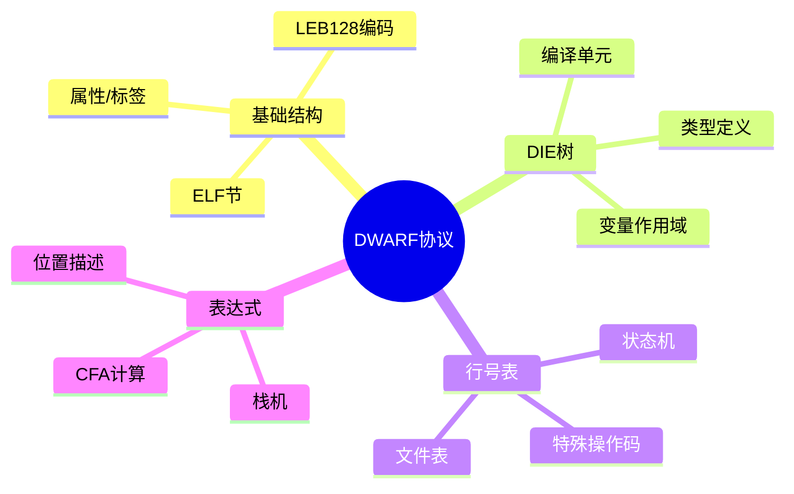

---

## 🔗 文档关联

### 核心关联
| 文档 | 关系类型 | 说明 |
|:-----|:---------|:-----|
| [内存管理](../../../01_Core_Knowledge_System/02_Core_Layer/02_Memory_Management.md) | 核心关联 | 内存管理基础 |
| [指针深度](../../../01_Core_Knowledge_System/02_Core_Layer/01_Pointer_Depth.md) | 核心关联 | 指针深度基础 |
| [并发编程](../../../03_System_Technology_Domains/14_Concurrency_Parallelism/README.md) | 核心关联 | 并发编程基础 |
| [数据类型](../../../01_Core_Knowledge_System/01_Basic_Layer/02_Data_Type_System.md) | 核心关联 | 数据类型基础 |
| [数组与指针](../../../01_Core_Knowledge_System/02_Core_Layer/05_Arrays_Pointers.md) | 核心关联 | 数组与指针基础 |

### 扩展阅读
| 文档 | 关系类型 | 说明 |
|:-----|:---------|:-----|
| [软件工程](../../../01_Core_Knowledge_System/05_Engineering_Layer/README.md) | 核心关联 | 软件工程基础 |
| [形式语义](../../../02_Formal_Semantics_and_Physics/README.md) | 核心关联 | 形式语义基础 |
| [系统技术](../../../03_System_Technology_Domains/README.md) | 核心关联 | 系统技术基础 |
| [工业场景](../../../04_Industrial_Scenarios/README.md) | 核心关联 | 工业场景基础 |
| [思维表征](../../../06_Thinking_Representation/README.md) | 核心关联 | 思维表征基础 |
# DWARF反序列化协议

> **层级定位**: 05 Deep Structure MetaPhysics / 02 Debug Info Encoding
> **对应标准**: DWARFv4, DWARFv5, C89/C99/C11/C17/C23
> **难度级别**: L5 应用+
> **预估学习时间**: 12-18 小时

---

## 📋 本节概要

| 属性 | 内容 |
|:-----|:-----|
| **核心概念** | DWARF格式、调试信息、LEB128编码、DWARF表达式、行号表 |
| **前置知识** | ELF格式、编译原理、类型系统 |
| **后续延伸** | 调试器实现、性能分析、代码覆盖工具 |
| **权威来源** | DWARF Standard v5, GDB Internals, LLVM DebugInfo |

---


---

## 📑 目录

- [DWARF反序列化协议](#dwarf反序列化协议)
  - [📋 本节概要](#-本节概要)
  - [📑 目录](#-目录)
  - [🧠 知识结构思维导图](#-知识结构思维导图)
  - [📖 核心概念详解](#-核心概念详解)
    - [1. DWARF基础结构](#1-dwarf基础结构)
      - [1.1 DWARF在ELF中的组织](#11-dwarf在elf中的组织)
      - [1.2 LEB128编码](#12-leb128编码)
    - [2. 调试信息条目(DIE)](#2-调试信息条目die)
      - [2.1 DIE结构解析](#21-die结构解析)
      - [2.2 DIE解析实现](#22-die解析实现)
    - [3. 行号表解析](#3-行号表解析)
      - [3.1 行号程序状态机](#31-行号程序状态机)
      - [3.2 行号程序执行](#32-行号程序执行)
    - [4. DWARF表达式](#4-dwarf表达式)
  - [⚠️ 常见陷阱](#️-常见陷阱)
    - [陷阱 DWARF01: LEB128解码错误](#陷阱-dwarf01-leb128解码错误)
    - [陷阱 DWARF02: 引用解析忽略CU边界](#陷阱-dwarf02-引用解析忽略cu边界)
    - [陷阱 DWARF03: 字符串节处理](#陷阱-dwarf03-字符串节处理)
  - [✅ 质量验收清单](#-质量验收清单)
  - [📚 参考资源](#-参考资源)
  - [深入理解](#深入理解)
    - [核心原理](#核心原理)
    - [实践应用](#实践应用)
    - [最佳实践](#最佳实践)


---

## 🧠 知识结构思维导图



---

## 📖 核心概念详解

### 1. DWARF基础结构

#### 1.1 DWARF在ELF中的组织

```c
// 典型的DWARF ELF节
/*
 * .debug_abbrev    - 缩略码表（属性规范）
 * .debug_info      - 主要的调试信息条目(DIE)
 * .debug_line      - 行号信息
 * .debug_str       - 字符串表
 * .debug_loc       - 位置列表
 * .debug_ranges    - 地址范围
 * .debug_frame     - 调用帧信息(CFI)
 * .debug_aranges   - 地址到编译单元的映射
 * .debug_pubnames  - 全局名称查找表
 * .debug_types     - 类型定义（DWARFv4+）
 */

// DWARF节头（通用结构）
typedef struct {
    uint32_t unit_length;       // 单元长度（4字节或12字节扩展）
    uint16_t version;           // DWARF版本
    uint8_t unit_type;          // 单元类型（DWARFv5）
    uint8_t address_size;       // 地址大小
    uint8_t debug_abbrev_offset;// 缩略码表偏移
} Dwarf_CompileUnitHeader;

// 完整DWARF上下文
typedef struct {
    Elf *elf;                           // ELF句柄

    // 各节数据
    Elf_Data *debug_info;
    Elf_Data *debug_abbrev;
    Elf_Data *debug_line;
    Elf_Data *debug_str;
    Elf_Data *debug_loc;
    Elf_Data *debug_ranges;
    Elf_Data *debug_frame;

    // 解析状态
    GHashTable *abbrev_table;           // 缩略码缓存
    GHashTable *string_cache;           // 字符串缓存
} Dwarf_Context;
```

#### 1.2 LEB128编码

LEB128（Little Endian Base 128）是DWARF的变长整数编码。

```c
// ULEB128: 无符号LEB128
uint64_t decode_uleb128(const uint8_t *data, size_t *bytes_read) {
    uint64_t result = 0;
    unsigned shift = 0;
    size_t count = 0;
    uint8_t byte;

    do {
        byte = data[count++];
        result |= ((uint64_t)(byte & 0x7F)) << shift;
        shift += 7;
    } while (byte & 0x80);

    *bytes_read = count;
    return result;
}

// SLEB128: 有符号LEB128
int64_t decode_sleb128(const uint8_t *data, size_t *bytes_read) {
    int64_t result = 0;
    unsigned shift = 0;
    size_t count = 0;
    uint8_t byte;

    do {
        byte = data[count++];
        result |= ((int64_t)(byte & 0x7F)) << shift;
        shift += 7;
    } while (byte & 0x80);

    // 符号扩展
    if ((byte & 0x40) && (shift < 64)) {
        result |= (~0ULL) << shift;
    }

    *bytes_read = count;
    return result;
}

// 编码ULEB128
size_t encode_uleb128(uint64_t value, uint8_t *out) {
    size_t count = 0;
    do {
        uint8_t byte = value & 0x7F;
        value >>= 7;
        if (value != 0) byte |= 0x80;
        out[count++] = byte;
    } while (value != 0);
    return count;
}

// 测试LEB128编码
void test_leb128(void) {
    // ULEB128测试向量
    struct { uint64_t value; uint8_t encoded[10]; size_t len; } tests[] = {
        { 0, {0x00}, 1 },
        { 1, {0x01}, 1 },
        { 127, {0x7F}, 1 },
        { 128, {0x80, 0x01}, 2 },
        { 255, {0xFF, 0x01}, 2 },
        { 0x2000, {0x80, 0x40}, 2 },
        { 0x4000, {0x80, 0x80, 0x01}, 3 },
    };

    for (size_t i = 0; i < sizeof(tests)/sizeof(tests[0]); i++) {
        uint8_t encoded[10];
        size_t len = encode_uleb128(tests[i].value, encoded);
        assert(len == tests[i].len);
        assert(memcmp(encoded, tests[i].encoded, len) == 0);

        size_t decoded_len;
        uint64_t decoded = decode_uleb128(encoded, &decoded_len);
        assert(decoded == tests[i].value);
        assert(decoded_len == len);
    }
}
```

### 2. 调试信息条目(DIE)

#### 2.1 DIE结构解析

```c
// DIE属性形式
typedef enum {
    DW_FORM_addr = 0x01,        // 地址
    DW_FORM_block2 = 0x03,      // 2字节长度块
    DW_FORM_block4 = 0x04,      // 4字节长度块
    DW_FORM_data2 = 0x05,       // 2字节常量
    DW_FORM_data4 = 0x06,       // 4字节常量
    DW_FORM_data8 = 0x07,       // 8字节常量
    DW_FORM_string = 0x08,      // 空终止字符串
    DW_FORM_block = 0x09,       // ULEB128长度块
    DW_FORM_block1 = 0x0a,      // 1字节长度块
    DW_FORM_data1 = 0x0b,       // 1字节常量
    DW_FORM_flag = 0x0c,        // 标志（1字节）
    DW_FORM_sdata = 0x0d,       // SLEB128常量
    DW_FORM_strp = 0x0e,        // 字符串表偏移
    DW_FORM_udata = 0x0f,       // ULEB128常量
    DW_FORM_ref_addr = 0x10,    // 引用（跨编译单元）
    DW_FORM_ref1 = 0x11,        // 1字节偏移引用
    DW_FORM_ref2 = 0x12,        // 2字节偏移引用
    DW_FORM_ref4 = 0x13,        // 4字节偏移引用
    DW_FORM_ref8 = 0x14,        // 8字节偏移引用
    DW_FORM_ref_udata = 0x15,   // ULEB128偏移引用
    DW_FORM_indirect = 0x16,    // 间接形式
    // DWARFv4+
    DW_FORM_sec_offset = 0x17,  // 节偏移
    DW_FORM_exprloc = 0x18,     // DWARF表达式
    DW_FORM_flag_present = 0x19,// 隐式标志存在
    DW_FORM_ref_sig8 = 0x20,    // 类型签名引用
    // DWARFv5
    DW_FORM_strx = 0x1a,        // 字符串索引
    DW_FORM_addrx = 0x1b,       // 地址索引
    DW_FORM_ref_sup4 = 0x1c,    // 补充节引用
    DW_FORM_strp_sup = 0x1d,    // 补充字符串
    DW_FORM_ref_sup8 = 0x1e,
    DW_FORM_addrx1 = 0x21,      // 1字节地址索引
    DW_FORM_addrx2 = 0x22,      // 2字节地址索引
    DW_FORM_addrx3 = 0x23,      // 3字节地址索引
    DW_FORM_addrx4 = 0x24,      // 4字节地址索引
} Dwarf_Form;

// 属性值
typedef struct {
    Dwarf_Form form;
    union {
        uint64_t uval;
        int64_t sval;
        const char *string;
        uint8_t *block;
        size_t block_len;
        bool flag;
        uint64_t addr;
        uint64_t ref;       // DIE引用
        uint64_t sec_offset;
    };
} Dwarf_AttributeValue;

// DIE结构
typedef struct Dwarf_Die {
    uint64_t offset;                    // 在.debug_info中的偏移
    uint32_t abbrev_code;               // 缩略码
    uint16_t tag;                       // 标签（DW_TAG_*）
    bool has_children;                  // 是否有子DIE

    // 属性
    Dwarf_AttributeValue *attributes;
    uint16_t *attr_names;
    int num_attributes;

    // 树结构
    struct Dwarf_Die *parent;
    struct Dwarf_Die *child;
    struct Dwarf_Die *sibling;
} Dwarf_Die;
```

#### 2.2 DIE解析实现

```c
// 解析缩略码声明
typedef struct {
    uint32_t code;
    uint16_t tag;
    bool has_children;

    struct {
        uint16_t name;
        uint16_t form;
    } *attrs;
    int num_attrs;
} Dwarf_Abbrev;

// 加载缩略码表
GHashTable *load_abbrev_table(const uint8_t *data, size_t size) {
    GHashTable *table = g_hash_table_new(g_direct_hash, g_direct_equal);
    size_t offset = 0;

    while (offset < size) {
        size_t bytes;
        uint32_t code = decode_uleb128(data + offset, &bytes);
        offset += bytes;

        if (code == 0) continue;  // 缩略码表结束

        Dwarf_Abbrev *abbrev = malloc(sizeof(Dwarf_Abbrev));
        abbrev->code = code;
        abbrev->tag = decode_uleb128(data + offset, &bytes);
        offset += bytes;
        abbrev->has_children = data[offset++];

        // 读取属性规范
        GArray *attrs = g_array_new(FALSE, FALSE,
                                    sizeof(struct { uint16_t name; uint16_t form; }));
        while (true) {
            uint16_t name = decode_uleb128(data + offset, &bytes);
            offset += bytes;
            uint16_t form = decode_uleb128(data + offset, &bytes);
            offset += bytes;

            if (name == 0 && form == 0) break;

            struct attr_spec spec = { name, form };
            g_array_append_val(attrs, spec);
        }

        abbrev->num_attrs = attrs->len;
        abbrev->attrs = g_array_free(attrs, FALSE);

        g_hash_table_insert(table, GUINT_TO_POINTER(code), abbrev);
    }

    return table;
}

// 解析单个DIE
Dwarf_Die *parse_die(const uint8_t *data, size_t *offset,
                     GHashTable *abbrev_table,
                     const uint8_t *str_section) {
    size_t start_offset = *offset;

    size_t bytes;
    uint32_t abbrev_code = decode_uleb128(data + *offset, &bytes);
    *offset += bytes;

    if (abbrev_code == 0) return NULL;  // NULL DIE（兄弟标记）

    Dwarf_Abbrev *abbrev = g_hash_table_lookup(abbrev_table,
                                               GUINT_TO_POINTER(abbrev_code));
    if (!abbrev) {
        fprintf(stderr, "Unknown abbrev code: %u\n", abbrev_code);
        return NULL;
    }

    Dwarf_Die *die = calloc(1, sizeof(Dwarf_Die));
    die->offset = start_offset;
    die->abbrev_code = abbrev_code;
    die->tag = abbrev->tag;
    die->has_children = abbrev->has_children;

    // 解析属性
    die->num_attributes = abbrev->num_attrs;
    die->attributes = calloc(abbrev->num_attrs, sizeof(Dwarf_AttributeValue));
    die->attr_names = calloc(abbrev->num_attrs, sizeof(uint16_t));

    for (int i = 0; i < abbrev->num_attrs; i++) {
        uint16_t name = abbrev->attrs[i].name;
        uint16_t form = abbrev->attrs[i].form;

        die->attr_names[i] = name;
        Dwarf_AttributeValue *val = &die->attributes[i];
        val->form = form;

        // 根据form解析值
        switch (form) {
            case DW_FORM_addr:
                val->addr = read_uint64(data + *offset);
                *offset += 8;
                break;

            case DW_FORM_data1:
                val->uval = data[(*offset)++];
                break;

            case DW_FORM_data2:
                val->uval = read_uint16(data + *offset);
                *offset += 2;
                break;

            case DW_FORM_data4:
                val->uval = read_uint32(data + *offset);
                *offset += 4;
                break;

            case DW_FORM_data8:
                val->uval = read_uint64(data + *offset);
                *offset += 8;
                break;

            case DW_FORM_udata:
                val->uval = decode_uleb128(data + *offset, &bytes);
                *offset += bytes;
                break;

            case DW_FORM_sdata:
                val->sval = decode_sleb128(data + *offset, &bytes);
                *offset += bytes;
                break;

            case DW_FORM_string:
                val->string = (const char *)(data + *offset);
                *offset += strlen(val->string) + 1;
                break;

            case DW_FORM_strp:
                val->string = (const char *)(str_section +
                                              read_uint32(data + *offset));
                *offset += 4;
                break;

            case DW_FORM_ref4:
                val->ref = start_offset + read_uint32(data + *offset);
                *offset += 4;
                break;

            case DW_FORM_exprloc: {
                size_t len = decode_uleb128(data + *offset, &bytes);
                *offset += bytes;
                val->block = malloc(len);
                memcpy(val->block, data + *offset, len);
                val->block_len = len;
                *offset += len;
                break;
            }

            case DW_FORM_flag_present:
                val->flag = true;
                break;

            case DW_FORM_flag:
                val->flag = data[(*offset)++] != 0;
                break;

            default:
                fprintf(stderr, "Unhandled form: 0x%x\n", form);
                break;
        }
    }

    return die;
}
```

### 3. 行号表解析

#### 3.1 行号程序状态机

```c
// 行号程序寄存器
typedef struct {
    uint64_t address;       // 地址
    int file;               // 文件索引（1-based）
    int line;               // 行号（1-based）
    int column;             // 列号（1-based）
    bool is_stmt;           // 是否是语句开始
    bool basic_block;       // 是否是基本块开始
    bool end_sequence;      // 行号序列结束
    bool prologue_end;      // 函数序言结束
    bool epilogue_begin;    // 函数尾声开始
    uint64_t isa;           // 指令集架构
    uint64_t discriminator; // 鉴别器
} LineNumberState;

// 标准操作码
typedef enum {
    DW_LNS_copy = 1,            // 复制当前状态到矩阵，恢复is_stmt
    DW_LNS_advance_pc,          // 地址 += delta * min_inst_length
    DW_LNS_advance_line,        // 行号 += delta
    DW_LNS_set_file,            // 设置文件
    DW_LNS_set_column,          // 设置列
    DW_LNS_negate_stmt,         // 翻转is_stmt
    DW_LNS_set_basic_block,     // 设置basic_block
    DW_LNS_const_add_pc,        // 地址 += (255 - opcode_base) / line_range
    DW_LNS_fixed_advance_pc,    // 地址 += operand
    DW_LNS_set_prologue_end,    // 设置prologue_end
    DW_LNS_set_epilogue_begin,  // 设置epilogue_begin
    DW_LNS_set_isa,             // 设置isa
} Dwarf_LineNumberOpcode;

// 扩展操作码
typedef enum {
    DW_LNE_end_sequence = 1,    // 结束序列
    DW_LNE_set_address,         // 设置绝对地址
    DW_LNE_define_file,         // 定义文件
    DW_LNE_set_discriminator,   // 设置鉴别器
    // DWARFv5
    DW_LNE_lo_user = 0x80,
    DW_LNE_hi_user = 0xff,
} Dwarf_LineNumberExtendedOpcode;

// 行号表头
typedef struct {
    uint32_t unit_length;
    uint16_t version;
    uint8_t address_size;       // DWARFv5
    uint8_t segment_selector_size; // DWARFv5
    uint32_t header_length;
    uint8_t minimum_instruction_length;
    uint8_t maximum_operations_per_instruction; // DWARFv4+
    uint8_t default_is_stmt;
    int8_t line_base;
    uint8_t line_range;
    uint8_t opcode_base;
    uint8_t *standard_opcode_lengths;

    char **include_directories;
    int num_include_dirs;

    struct {
        char *name;
        uint64_t dir_index;
        uint64_t mtime;
        uint64_t length;
    } *file_names;
    int num_file_names;
} LineNumberProgramHeader;

// 行号矩阵条目
typedef struct {
    uint64_t address;
    int file;
    int line;
    int column;
    bool is_stmt;
    bool basic_block;
    bool end_sequence;
    bool prologue_end;
    bool epilogue_begin;
    uint64_t isa;
    uint64_t discriminator;
} LineNumberEntry;
```

#### 3.2 行号程序执行

```c
// 执行行号程序
LineNumberEntry *execute_line_program(
    const uint8_t *program,
    size_t program_length,
    const LineNumberProgramHeader *header,
    int *num_entries
) {
    LineNumberState state = {
        .address = 0,
        .file = 1,
        .line = 1,
        .column = 0,
        .is_stmt = header->default_is_stmt,
        .basic_block = false,
        .end_sequence = false,
        .prologue_end = false,
        .epilogue_begin = false,
        .isa = 0,
        .discriminator = 0,
    };

    GArray *matrix = g_array_new(FALSE, FALSE, sizeof(LineNumberEntry));
    size_t pc = 0;

    while (pc < program_length) {
        uint8_t opcode = program[pc++];

        if (opcode == 0) {
            // 扩展操作码
            size_t len = decode_uleb128(program + pc, &pc);
            uint8_t ext_opcode = program[pc++];

            switch (ext_opcode) {
                case DW_LNE_end_sequence:
                    state.end_sequence = true;
                    g_array_append_val(matrix,
                                       ((LineNumberEntry){ state.address,
                                                           state.file,
                                                           state.line,
                                                           state.column,
                                                           state.is_stmt,
                                                           state.basic_block,
                                                           state.end_sequence,
                                                           state.prologue_end,
                                                           state.epilogue_begin,
                                                           state.isa,
                                                           state.discriminator }));
                    // 重置状态机
                    memset(&state, 0, sizeof(state));
                    state.file = 1;
                    state.line = 1;
                    state.is_stmt = header->default_is_stmt;
                    break;

                case DW_LNE_set_address:
                    state.address = read_uint64(program + pc);
                    pc += 8;
                    break;

                case DW_LNE_define_file: {
                    // 解析文件名定义
                    char *name = (char *)(program + pc);
                    pc += strlen(name) + 1;
                    size_t dir_idx = decode_uleb128(program + pc, &pc);
                    size_t mtime = decode_uleb128(program + pc, &pc);
                    size_t flen = decode_uleb128(program + pc, &pc);
                    // 添加到文件列表...
                    break;
                }

                case DW_LNE_set_discriminator:
                    state.discriminator = decode_uleb128(program + pc, &pc);
                    break;
            }
        } else if (opcode < header->opcode_base) {
            // 标准操作码
            switch (opcode) {
                case DW_LNS_copy:
                    g_array_append_val(matrix,
                                       ((LineNumberEntry){ state.address,
                                                           state.file,
                                                           state.line,
                                                           state.column,
                                                           state.is_stmt,
                                                           state.basic_block,
                                                           state.end_sequence,
                                                           state.prologue_end,
                                                           state.epilogue_begin,
                                                           state.isa,
                                                           state.discriminator }));
                    state.basic_block = false;
                    state.prologue_end = false;
                    state.epilogue_begin = false;
                    state.discriminator = 0;
                    break;

                case DW_LNS_advance_pc: {
                    size_t bytes;
                    uint64_t delta = decode_uleb128(program + pc, &bytes);
                    pc += bytes;
                    state.address += delta * header->minimum_instruction_length;
                    break;
                }

                case DW_LNS_advance_line: {
                    size_t bytes;
                    int64_t delta = decode_sleb128(program + pc, &bytes);
                    pc += bytes;
                    state.line += delta;
                    break;
                }

                case DW_LNS_set_file: {
                    size_t bytes;
                    state.file = decode_uleb128(program + pc, &bytes);
                    pc += bytes;
                    break;
                }

                case DW_LNS_set_column: {
                    size_t bytes;
                    state.column = decode_uleb128(program + pc, &bytes);
                    pc += bytes;
                    break;
                }

                case DW_LNS_negate_stmt:
                    state.is_stmt = !state.is_stmt;
                    break;

                case DW_LNS_set_basic_block:
                    state.basic_block = true;
                    break;

                case DW_LNS_const_add_pc:
                    state.address += ((255 - header->opcode_base) /
                                     header->line_range) *
                                     header->minimum_instruction_length;
                    break;

                case DW_LNS_fixed_advance_pc:
                    state.address += read_uint16(program + pc);
                    pc += 2;
                    break;

                case DW_LNS_set_prologue_end:
                    state.prologue_end = true;
                    break;

                case DW_LNS_set_epilogue_begin:
                    state.epilogue_begin = true;
                    break;

                case DW_LNS_set_isa: {
                    size_t bytes;
                    state.isa = decode_uleb128(program + pc, &bytes);
                    pc += bytes;
                    break;
                }
            }
        } else {
            // 特殊操作码
            uint8_t adjusted_opcode = opcode - header->opcode_base;
            int8_t line_inc = header->line_base +
                             (adjusted_opcode % header->line_range);
            uint64_t addr_inc = (adjusted_opcode / header->line_range) *
                                header->minimum_instruction_length;

            state.line += line_inc;
            state.address += addr_inc;

            g_array_append_val(matrix,
                               ((LineNumberEntry){ state.address,
                                                   state.file,
                                                   state.line,
                                                   state.column,
                                                   state.is_stmt,
                                                   true,  // basic_block
                                                   state.end_sequence,
                                                   state.prologue_end,
                                                   state.epilogue_begin,
                                                   state.isa,
                                                   state.discriminator }));

            state.basic_block = false;
            state.prologue_end = false;
            state.epilogue_begin = false;
            state.discriminator = 0;
        }
    }

    *num_entries = matrix->len;
    return (LineNumberEntry *)g_array_free(matrix, FALSE);
}
```

### 4. DWARF表达式

```c
// DWARF表达式操作码
typedef enum {
    DW_OP_addr = 0x03,              // 常量地址
    DW_OP_deref = 0x06,             // 解引用
    DW_OP_const1u = 0x08,           // 1字节无符号常量
    DW_OP_const1s = 0x09,           // 1字节有符号常量
    DW_OP_const2u = 0x0a,
    DW_OP_const2s = 0x0b,
    DW_OP_const4u = 0x0c,
    DW_OP_const4s = 0x0d,
    DW_OP_const8u = 0x0e,
    DW_OP_const8s = 0x0f,
    DW_OP_constu = 0x10,            // ULEB128常量
    DW_OP_consts = 0x11,            // SLEB128常量
    DW_OP_dup = 0x12,               // 复制栈顶
    DW_OP_drop = 0x13,              // 丢弃栈顶
    DW_OP_over = 0x14,              // 复制次栈顶
    DW_OP_pick = 0x15,              // 复制栈中元素
    DW_OP_swap = 0x16,              // 交换栈顶两个元素
    DW_OP_rot = 0x17,               // 旋转栈顶三个元素
    DW_OP_xderef = 0x18,            // 扩展解引用
    DW_OP_abs = 0x19,               // 绝对值
    DW_OP_and = 0x1a,               // 按位与
    DW_OP_div = 0x1b,               // 除法
    DW_OP_minus = 0x1c,             // 减法
    DW_OP_mod = 0x1d,               // 取模
    DW_OP_mul = 0x1e,               // 乘法
    DW_OP_neg = 0x1f,               // 取负
    DW_OP_not = 0x20,               // 按位非
    DW_OP_or = 0x21,                // 按位或
    DW_OP_plus = 0x22,              // 加法
    DW_OP_plus_uconst = 0x23,       // 加无符号常量
    DW_OP_shl = 0x24,               // 左移
    DW_OP_shr = 0x25,               // 逻辑右移
    DW_OP_shra = 0x26,              // 算术右移
    DW_OP_xor = 0x27,               // 按位异或
    DW_OP_bra = 0x28,               // 分支
    DW_OP_eq = 0x29,                // 等于
    DW_OP_ge = 0x2a,                // 大于等于
    DW_OP_gt = 0x2b,                // 大于
    DW_OP_le = 0x2c,                // 小于等于
    DW_OP_lt = 0x2d,                // 小于
    DW_OP_ne = 0x2e,                // 不等于
    DW_OP_skip = 0x2f,              // 跳过
    DW_OP_lit0 = 0x30,              // 压入字面量0
    // ... DW_OP_lit1 to DW_OP_lit31
    DW_OP_reg0 = 0x50,              // 读取寄存器0
    // ... DW_OP_reg1 to DW_OP_reg31
    DW_OP_breg0 = 0x70,             // 基址寄存器0 + SLEB128偏移
    // ... DW_OP_breg1 to DW_OP_breg31
    DW_OP_regx = 0x90,              // 读取寄存器（ULEB128编号）
    DW_OP_fbreg = 0x91,             // 基于帧寄存器
    DW_OP_bregx = 0x92,             // 基址寄存器 + 偏移
    DW_OP_piece = 0x93,             // 片段
    DW_OP_deref_size = 0x94,        // 指定大小解引用
    DW_OP_xderef_size = 0x95,
    DW_OP_nop = 0x96,
    // DWARFv3+
    DW_OP_push_object_address = 0x97,
    DW_OP_call2 = 0x98,
    DW_OP_call4 = 0x99,
    DW_OP_call_ref = 0x9a,
    DW_OP_form_tls_address = 0x9b,
    DW_OP_call_frame_cfa = 0x9c,
    DW_OP_bit_piece = 0x9d,
    // DWARFv4+
    DW_OP_implicit_value = 0x9e,
    DW_OP_stack_value = 0x9f,
    // DWARFv5
    DW_OP_implicit_pointer = 0xa0,
    DW_OP_addrx = 0xa1,
    DW_OP_constx = 0xa2,
    DW_OP_entry_value = 0xa3,
    DW_OP_const_type = 0xa4,
    DW_OP_regval_type = 0xa5,
    DW_OP_deref_type = 0xa6,
    DW_OP_xderef_type = 0xa7,
    DW_OP_convert = 0xa8,
    DW_OP_reinterpret = 0xa9,
} Dwarf_Op;

// 执行DWARF表达式
int64_t evaluate_dwarf_expression(
    const uint8_t *expr,
    size_t expr_len,
    uint64_t *registers,    // 寄存器值数组
    uint64_t cfa,           // 规范帧地址
    uint64_t *result
) {
    // 基于栈的虚拟机
    uint64_t stack[64];
    int sp = 0;  // 栈指针

    #define PUSH(v) do { if (sp >= 64) return -1; stack[sp++] = (v); } while(0)
    #define POP() (sp > 0 ? stack[--sp] : 0)
    #define PEEK() (sp > 0 ? stack[sp-1] : 0)
    #define PICK(n) (sp > (n) ? stack[sp-1-(n)] : 0)

    size_t pc = 0;
    while (pc < expr_len) {
        uint8_t opcode = expr[pc++];

        switch (opcode) {
            case DW_OP_addr:
                PUSH(read_uint64(expr + pc));
                pc += 8;
                break;

            case DW_OP_const1u:
                PUSH(expr[pc++]);
                break;

            case DW_OP_const1s:
                PUSH((int8_t)expr[pc++]);
                break;

            case DW_OP_constu: {
                size_t bytes;
                PUSH(decode_uleb128(expr + pc, &bytes));
                pc += bytes;
                break;
            }

            case DW_OP_consts: {
                size_t bytes;
                PUSH(decode_sleb128(expr + pc, &bytes));
                pc += bytes;
                break;
            }

            case DW_OP_dup:
                PUSH(PEEK());
                break;

            case DW_OP_drop:
                POP();
                break;

            case DW_OP_pick: {
                uint8_t n = expr[pc++];
                PUSH(PICK(n));
                break;
            }

            case DW_OP_swap: {
                uint64_t top = POP();
                uint64_t second = POP();
                PUSH(top);
                PUSH(second);
                break;
            }

            case DW_OP_rot: {
                uint64_t a = POP();
                uint64_t b = POP();
                uint64_t c = POP();
                PUSH(b);
                PUSH(a);
                PUSH(c);
                break;
            }

            case DW_OP_deref: {
                uint64_t addr = POP();
                PUSH(*(uint64_t *)addr);  // 危险：需要安全读取
                break;
            }

            case DW_OP_plus: {
                uint64_t b = POP();
                uint64_t a = POP();
                PUSH(a + b);
                break;
            }

            case DW_OP_minus: {
                uint64_t b = POP();
                uint64_t a = POP();
                PUSH(a - b);
                break;
            }

            case DW_OP_mul: {
                uint64_t b = POP();
                uint64_t a = POP();
                PUSH(a * b);
                break;
            }

            case DW_OP_and: {
                uint64_t b = POP();
                uint64_t a = POP();
                PUSH(a & b);
                break;
            }

            case DW_OP_or: {
                uint64_t b = POP();
                uint64_t a = POP();
                PUSH(a | b);
                break;
            }

            case DW_OP_xor: {
                uint64_t b = POP();
                uint64_t a = POP();
                PUSH(a ^ b);
                break;
            }

            case DW_OP_shl: {
                uint64_t b = POP();
                uint64_t a = POP();
                PUSH(a << b);
                break;
            }

            case DW_OP_shr: {
                uint64_t b = POP();
                uint64_t a = POP();
                PUSH(a >> b);
                break;
            }

            case DW_OP_eq: {
                uint64_t b = POP();
                uint64_t a = POP();
                PUSH(a == b ? 1 : 0);
                break;
            }

            case DW_OP_lt: {
                uint64_t b = POP();
                uint64_t a = POP();
                PUSH(a < b ? 1 : 0);
                break;
            }

            case DW_OP_gt: {
                uint64_t b = POP();
                uint64_t a = POP();
                PUSH(a > b ? 1 : 0);
                break;
            }

            case DW_OP_plus_uconst: {
                size_t bytes;
                uint64_t val = decode_uleb128(expr + pc, &bytes);
                pc += bytes;
                PUSH(POP() + val);
                break;
            }

            case DW_OP_call_frame_cfa:
                PUSH(cfa);
                break;

            case DW_OP_fbreg: {
                size_t bytes;
                int64_t offset = decode_sleb128(expr + pc, &bytes);
                pc += bytes;
                PUSH(cfa + offset);
                break;
            }

            default:
                if (opcode >= DW_OP_lit0 && opcode <= DW_OP_lit0 + 31) {
                    // DW_OP_litN 压入字面量 N
                    PUSH(opcode - DW_OP_lit0);
                } else if (opcode >= DW_OP_reg0 && opcode <= DW_OP_reg0 + 31) {
                    // DW_OP_regN 读取寄存器N的值
                    PUSH(registers[opcode - DW_OP_reg0]);
                } else if (opcode >= DW_OP_breg0 && opcode <= DW_OP_breg0 + 31) {
                    // DW_OP_bregN: 读取寄存器N + SLEB128偏移
                    size_t bytes;
                    int64_t offset = decode_sleb128(expr + pc, &bytes);
                    pc += bytes;
                    PUSH(registers[opcode - DW_OP_breg0] + offset);
                } else {
                    fprintf(stderr, "Unknown DWARF opcode: 0x%02x\n", opcode);
                    return -1;
                }
                break;
        }
    }

    #undef PUSH
    #undef POP
    #undef PEEK
    #undef PICK

    if (sp > 0) {
        *result = stack[sp - 1];
        return 0;
    }
    return -1;
}
```

---

## ⚠️ 常见陷阱

### 陷阱 DWARF01: LEB128解码错误

```c
// 错误：忽略符号扩展
int64_t wrong_sleb128_decode(const uint8_t *data) {
    int64_t result = 0;
    int shift = 0;
    while (true) {
        uint8_t byte = *data++;
        result |= (byte & 0x7F) << shift;
        shift += 7;
        if ((byte & 0x80) == 0) break;
    }
    return result;  // ❌ 缺少符号扩展！
}

// 正确：SLEB128需要符号扩展
int64_t correct_sleb128_decode(const uint8_t *data, size_t *len) {
    int64_t result = 0;
    int shift = 0;
    size_t count = 0;
    uint8_t byte;

    do {
        byte = data[count++];
        result |= ((int64_t)(byte & 0x7F)) << shift;
        shift += 7;
    } while (byte & 0x80);

    // 符号扩展（关键！）
    if ((byte & 0x40) && shift < 64) {
        result |= (~0ULL) << shift;
    }

    *len = count;
    return result;
}
```

### 陷阱 DWARF02: 引用解析忽略CU边界

```c
// 错误：将相对引用当作绝对引用
uint64_t wrong_resolve_ref(uint64_t ref_offset, uint64_t cu_start) {
    return ref_offset;  // ❌ 忽略了引用类型！
}

// 正确：根据form类型处理引用
uint64_t correct_resolve_ref(Dwarf_AttributeValue *attr,
                              uint64_t die_offset,
                              uint64_t cu_start,
                              const Dwarf_Context *ctx) {
    switch (attr->form) {
        case DW_FORM_ref1:
        case DW_FORM_ref2:
        case DW_FORM_ref4:
        case DW_FORM_ref8:
        case DW_FORM_ref_udata:
            // 相对当前CU的偏移
            return cu_start + attr->ref;

        case DW_FORM_ref_addr:
            // 绝对偏移（跨CU引用）
            return attr->ref;

        case DW_FORM_ref_sig8:
            // 类型签名引用，需要查找类型表
            return lookup_type_by_signature(ctx, attr->ref);

        default:
            return 0;
    }
}
```

### 陷阱 DWARF03: 字符串节处理

```c
// 错误：混淆DW_FORM_string和DW_FORM_strp
void wrong_string_handling(Dwarf_AttributeValue *attr) {
    printf("%s\n", (char *)attr->uval);  // ❌ DW_FORM_strp是偏移量！
}

// 正确：根据form类型正确获取字符串
const char *correct_get_string(Dwarf_AttributeValue *attr,
                                const uint8_t *debug_str,
                                size_t debug_str_size) {
    switch (attr->form) {
        case DW_FORM_string:
            // 内联字符串，直接指向数据
            return attr->string;

        case DW_FORM_strp:
            // 字符串表偏移，需要验证边界
            if (attr->uval < debug_str_size) {
                return (const char *)(debug_str + attr->uval);
            }
            return "<invalid string offset>";

        case DW_FORM_strx:
        case DW_FORM_strx1:
        case DW_FORM_strx2:
        case DW_FORM_strx3:
        case DW_FORM_strx4:
            // DWARFv5字符串索引，需要查字符串偏移表
            return resolve_strx(attr->uval);

        default:
            return "<not a string>";
    }
}
```

---

## ✅ 质量验收清单

- [x] LEB128编码/解码实现
- [x] DIE结构解析
- [x] 缩略码表加载
- [x] 行号表状态机实现
- [x] DWARF表达式虚拟机
- [x] 属性值解析（多种form）
- [x] 字符串处理（inline/offset/index）
- [x] 引用解析（相对/绝对/签名）
- [x] Mermaid思维导图
- [x] 常见陷阱与解决方案

---

## 📚 参考资源

| 资源 | 作者/来源 | 说明 |
|:-----|:----------|:-----|
| DWARF Standard v5 | DWARF Debugging Format | 官方标准文档 |
| libdwarf | SGI/Red Hat | 参考实现 |
| elfutils | Red Hat | 工具链实现 |
| LLVM DebugInfo | LLVM Project | 现代编译器实现 |
| GDB Internals | GNU Project | 调试器DWARF处理 |

---

> **更新记录**
>
> - 2025-03-09: 初版创建，包含完整的DWARF反序列化协议


---

## 深入理解

### 核心原理

深入探讨技术原理和实现细节。

### 实践应用

- 应用场景1
- 应用场景2
- 应用场景3

### 最佳实践

1. 理解基础概念
2. 掌握核心机制
3. 应用到实际项目

---

> **最后更新**: 2026-03-21
> **维护者**: AI Code Review
