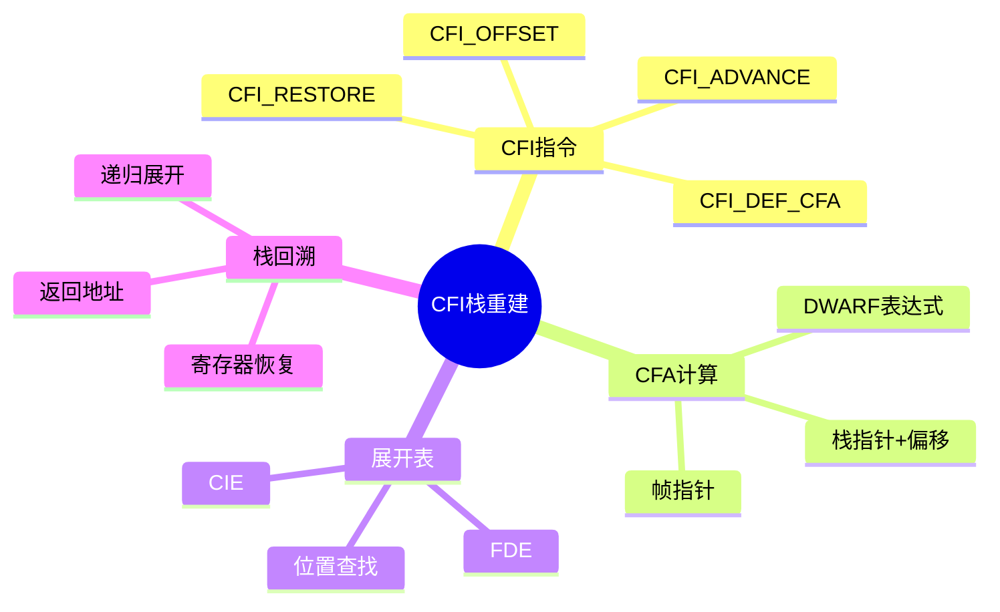

# CFI栈重建与调用帧分析

> **层级定位**: 05 Deep Structure MetaPhysics / 02 Debug Info Encoding
> **对应标准**: DWARF CFI, System V AMD64 ABI, C89/C99/C11/C17/C23
> **难度级别**: L5 应用+
> **预估学习时间**: 15-20 小时

---

## 📋 本节概要

| 属性 | 内容 |
|:-----|:-----|
| **核心概念** | CFI指令、CFA计算、寄存器规则、展开表、栈回溯 |
| **前置知识** | DWARF格式、x86-64调用约定、汇编基础 |
| **后续延伸** | 异常处理、信号处理、性能分析器实现 |
| **权威来源** | DWARF Standard v5, System V AMD64 ABI, libunwind |

---


---

## 📑 目录

- [CFI栈重建与调用帧分析](#cfi栈重建与调用帧分析)
  - [📋 本节概要](#-本节概要)
  - [📑 目录](#-目录)
  - [🧠 知识结构思维导图](#-知识结构思维导图)
  - [📖 核心概念详解](#-核心概念详解)
    - [1. CFI基础结构](#1-cfi基础结构)
      - [1.1 CIE与FDE](#11-cie与fde)
      - [1.2 CFI指令集](#12-cfi指令集)
    - [2. CFI解析与执行](#2-cfi解析与执行)
      - [2.1 CFI程序执行](#21-cfi程序执行)
      - [2.2 构建完整展开表](#22-构建完整展开表)
    - [3. 栈回溯实现](#3-栈回溯实现)
      - [3.1 CFA计算](#31-cfa计算)
      - [3.2 寄存器恢复](#32-寄存器恢复)
      - [3.3 完整栈回溯](#33-完整栈回溯)
    - [4. 实际CFI示例分析](#4-实际cfi示例分析)
  - [⚠️ 常见陷阱](#️-常见陷阱)
    - [陷阱 CFI01: CFA计算顺序错误](#陷阱-cfi01-cfa计算顺序错误)
    - [陷阱 CFI02: 忽略对齐因子](#陷阱-cfi02-忽略对齐因子)
    - [陷阱 CFI03: 信号帧特殊处理](#陷阱-cfi03-信号帧特殊处理)
  - [✅ 质量验收清单](#-质量验收清单)
  - [📚 参考资源](#-参考资源)


---

## 🧠 知识结构思维导图



---

## 📖 核心概念详解

### 1. CFI基础结构

#### 1.1 CIE与FDE

```c
// Common Information Entry (CIE)
// 包含共享的展开信息
typedef struct {
    uint64_t offset;                // 在.debug_frame中的偏移
    uint64_t length;
    uint64_t CIE_id;                // CIE ID（通常是0或-1）
    uint8_t version;
    char *augmentation;             // 扩展字符串
    uint64_t code_alignment_factor; // 代码对齐因子
    int64_t data_alignment_factor;  // 数据对齐因子
    uint64_t return_address_register; // 返回地址寄存器编号

    // 初始指令（对所有FDE共享）
    uint8_t *initial_instructions;
    size_t initial_instructions_length;

    // 解析后的寄存器规则
    RegisterRule initial_rules[REG_COUNT];
} CIE;

// Frame Description Entry (FDE)
// 描述特定函数的展开信息
typedef struct {
    uint64_t offset;                // 在.debug_frame中的偏移
    uint64_t length;
    uint64_t CIE_pointer;           // 指向关联CIE的偏移
    uint64_t initial_location;      // 函数起始地址
    uint64_t address_range;         // 函数地址范围

    // 程序指令（指令偏移→CFI指令）
    uint8_t *instructions;
    size_t instructions_length;

    // 指向关联的CIE
    CIE *cie;
} FDE;

// 寄存器规则类型
typedef enum {
    RULE_UNDEFINED,     // 未定义（调用者不关心）
    RULE_SAME_VALUE,    // 与调用时相同
    RULE_OFFSET,        // CFA + offset
    RULE_VAL_OFFSET,    // CFA + offset（值本身，非地址）
    RULE_REGISTER,      // 从其他寄存器复制
    RULE_EXPRESSION,    // DWARF表达式计算地址
    RULE_VAL_EXPRESSION,// DWARF表达式计算值
} RuleType;

// 寄存器规则
typedef struct {
    RuleType type;
    union {
        int64_t offset;             // 对于OFFSET/VAL_OFFSET
        uint64_t reg_num;           // 对于REGISTER
        struct {
            uint8_t *expr;
            size_t len;
        } expression;               // 对于EXPRESSION
    };
} RegisterRule;

// CFA（Canonical Frame Address）定义
typedef struct {
    enum { CFA_REGISTER, CFA_EXPRESSION } type;
    union {
        struct {
            uint64_t reg_num;       // 基址寄存器
            int64_t offset;         // 偏移
        } reg;
        struct {
            uint8_t *expr;
            size_t len;
        } expr;
    };
} CFADefinition;

// 完整展开上下文
typedef struct {
    uint64_t pc;                    // 当前程序计数器
    uint64_t cfa;                   // 规范帧地址
    RegisterRule rules[REG_COUNT];  // 各寄存器规则
    uint64_t registers[REG_COUNT];  // 寄存器值（执行时填充）
} UnwindContext;
```

#### 1.2 CFI指令集

```c
// DWARF CFI指令操作码
typedef enum {
    // 高2位=操作码，低6位=操作数（对于部分指令）

    // 0x40-0x4F: DW_CFA_advance_loc (delta = opcode & 0x3F)
    CFA_advance_loc = 0x40,         // 位置 += delta * code_align

    // 0x50-0x5F: DW_CFA_offset (reg = opcode & 0x0F)
    CFA_offset = 0x50,              // 规则[reg] = OFFSET, factored_offset

    // 0x60-0x6F: DW_CFA_restore (reg = opcode & 0x0F)
    CFA_restore = 0x60,             // 规则[reg] = CIE初始规则

    // 扩展操作码（0x00-0x0F）
    CFA_nop = 0x00,
    CFA_set_loc = 0x01,             // 设置绝对位置
    CFA_advance_loc1 = 0x02,        // 1字节delta
    CFA_advance_loc2 = 0x03,        // 2字节delta
    CFA_advance_loc4 = 0x04,        // 4字节delta
    CFA_offset_extended = 0x05,     // ULEB128寄存器, ULEB128偏移
    CFA_restore_extended = 0x06,    // ULEB128寄存器
    CFA_undefined = 0x07,           // ULEB128寄存器 → 规则=UNDEFINED
    CFA_same_value = 0x08,          // ULEB128寄存器 → 规则=SAME_VALUE
    CFA_register = 0x09,            // ULEB128 reg1, ULEB128 reg2
    CFA_remember_state = 0x0A,      // 压入状态栈
    CFA_restore_state = 0x0B,       // 弹出状态栈
    CFA_def_cfa = 0x0C,             // ULEB128寄存器, ULEB128偏移
    CFA_def_cfa_register = 0x0D,    // ULEB128寄存器
    CFA_def_cfa_offset = 0x0E,      // ULEB128偏移
    CFA_def_cfa_expression = 0x0F,  // BLOCK (DWARF表达式)

    CFA_expression = 0x10,          // ULEB128寄存器, BLOCK
    CFA_offset_extended_sf = 0x11,  // SLEB128偏移（有符号）
    CFA_def_cfa_sf = 0x12,          // ULEB128寄存器, SLEB128偏移
    CFA_def_cfa_offset_sf = 0x13,   // SLEB128偏移
    CFA_val_offset = 0x14,
    CFA_val_offset_sf = 0x15,
    CFA_val_expression = 0x16,      // ULEB128寄存器, BLOCK
    CFA_GNU_args_size = 0x2E,       // GNU扩展
    CFA_GNU_negative_offset_extended = 0x2F,
} CFI_Opcode;
```

### 2. CFI解析与执行

#### 2.1 CFI程序执行

```c
// 执行CFI程序，构建展开表
typedef struct {
    uint64_t pc;
    CFADefinition cfa;
    RegisterRule rules[REG_COUNT];
} UnwindRow;

// 执行CFI指令，更新展开上下文
int execute_cfi_instruction(
    uint8_t opcode,
    const uint8_t **operands,
    const CIE *cie,
    UnwindContext *ctx,
    GArray *unwind_table
) {
    switch (opcode) {
        case CFA_nop:
            // 无操作
            break;

        case CFA_advance_loc: {
            // 短格式: 操作数在opcode中
            uint8_t delta = opcode & 0x3F;
            ctx->pc += delta * cie->code_alignment_factor;
            break;
        }

        case CFA_advance_loc1: {
            uint8_t delta = *(*operands)++;
            ctx->pc += delta * cie->code_alignment_factor;
            break;
        }

        case CFA_advance_loc2: {
            uint16_t delta = read_uint16(*operands);
            *operands += 2;
            ctx->pc += delta * cie->code_alignment_factor;
            break;
        }

        case CFA_advance_loc4: {
            uint32_t delta = read_uint32(*operands);
            *operands += 4;
            ctx->pc += delta * cie->code_alignment_factor;
            break;
        }

        case CFA_set_loc: {
            uint64_t addr = read_uint64(*operands);
            *operands += 8;
            ctx->pc = addr;
            break;
        }

        case CFA_offset:
        case CFA_offset_extended: {
            size_t bytes;
            uint64_t reg = decode_uleb128(*operands, &bytes);
            *operands += bytes;
            uint64_t offset = decode_uleb128(*operands, &bytes);
            *operands += bytes;

            ctx->rules[reg].type = RULE_OFFSET;
            ctx->rules[reg].offset = offset * cie->data_alignment_factor;
            break;
        }

        case CFA_offset_extended_sf: {
            size_t bytes;
            uint64_t reg = decode_uleb128(*operands, &bytes);
            *operands += bytes;
            int64_t offset = decode_sleb128(*operands, &bytes);
            *operands += bytes;

            ctx->rules[reg].type = RULE_OFFSET;
            ctx->rules[reg].offset = offset * cie->data_alignment_factor;
            break;
        }

        case CFA_restore:
        case CFA_restore_extended: {
            size_t bytes;
            uint64_t reg = decode_uleb128(*operands, &bytes);
            *operands += bytes;

            // 恢复到CIE初始规则
            ctx->rules[reg] = cie->initial_rules[reg];
            break;
        }

        case CFA_undefined: {
            size_t bytes;
            uint64_t reg = decode_uleb128(*operands, &bytes);
            *operands += bytes;

            ctx->rules[reg].type = RULE_UNDEFINED;
            break;
        }

        case CFA_same_value: {
            size_t bytes;
            uint64_t reg = decode_uleb128(*operands, &bytes);
            *operands += bytes;

            ctx->rules[reg].type = RULE_SAME_VALUE;
            break;
        }

        case CFA_register: {
            size_t bytes;
            uint64_t reg1 = decode_uleb128(*operands, &bytes);
            *operands += bytes;
            uint64_t reg2 = decode_uleb128(*operands, &bytes);
            *operands += bytes;

            ctx->rules[reg1].type = RULE_REGISTER;
            ctx->rules[reg1].reg_num = reg2;
            break;
        }

        case CFA_def_cfa: {
            size_t bytes;
            uint64_t reg = decode_uleb128(*operands, &bytes);
            *operands += bytes;
            uint64_t offset = decode_uleb128(*operands, &bytes);
            *operands += bytes;

            ctx->cfa.type = CFA_REGISTER;
            ctx->cfa.reg.reg_num = reg;
            ctx->cfa.reg.offset = offset;
            break;
        }

        case CFA_def_cfa_sf: {
            size_t bytes;
            uint64_t reg = decode_uleb128(*operands, &bytes);
            *operands += bytes;
            int64_t offset = decode_sleb128(*operands, &bytes);
            *operands += bytes;

            ctx->cfa.type = CFA_REGISTER;
            ctx->cfa.reg.reg_num = reg;
            ctx->cfa.reg.offset = offset;
            break;
        }

        case CFA_def_cfa_register: {
            size_t bytes;
            uint64_t reg = decode_uleb128(*operands, &bytes);
            *operands += bytes;

            ctx->cfa.reg.reg_num = reg;
            break;
        }

        case CFA_def_cfa_offset: {
            size_t bytes;
            uint64_t offset = decode_uleb128(*operands, &bytes);
            *operands += bytes;

            ctx->cfa.reg.offset = offset;
            break;
        }

        case CFA_def_cfa_offset_sf: {
            size_t bytes;
            int64_t offset = decode_sleb128(*operands, &bytes);
            *operands += bytes;

            ctx->cfa.reg.offset = offset;
            break;
        }

        case CFA_def_cfa_expression: {
            size_t bytes;
            uint64_t len = decode_uleb128(*operands, &bytes);
            *operands += bytes;

            ctx->cfa.type = CFA_EXPRESSION;
            ctx->cfa.expr.expr = malloc(len);
            memcpy(ctx->cfa.expr.expr, *operands, len);
            ctx->cfa.expr.len = len;
            *operands += len;
            break;
        }

        case CFA_expression: {
            size_t bytes;
            uint64_t reg = decode_uleb128(*operands, &bytes);
            *operands += bytes;
            uint64_t len = decode_uleb128(*operands, &bytes);
            *operands += bytes;

            ctx->rules[reg].type = RULE_EXPRESSION;
            ctx->rules[reg].expression.expr = malloc(len);
            memcpy(ctx->rules[reg].expression.expr, *operands, len);
            ctx->rules[reg].expression.len = len;
            *operands += len;
            break;
        }

        case CFA_val_expression: {
            size_t bytes;
            uint64_t reg = decode_uleb128(*operands, &bytes);
            *operands += bytes;
            uint64_t len = decode_uleb128(*operands, &bytes);
            *operands += bytes;

            ctx->rules[reg].type = RULE_VAL_EXPRESSION;
            ctx->rules[reg].expression.expr = malloc(len);
            memcpy(ctx->rules[reg].expression.expr, *operands, len);
            ctx->rules[reg].expression.len = len;
            *operands += len;
            break;
        }

        case CFA_remember_state:
            // 压入状态栈（简化实现）
            break;

        case CFA_restore_state:
            // 弹出状态栈（简化实现）
            break;

        default:
            if ((opcode & 0xC0) == CFA_advance_loc) {
                // 短格式advance_loc
                uint8_t delta = opcode & 0x3F;
                ctx->pc += delta * cie->code_alignment_factor;
            } else if ((opcode & 0xF0) == CFA_offset) {
                // 短格式offset
                uint64_t reg = opcode & 0x0F;
                size_t bytes;
                uint64_t offset = decode_uleb128(*operands, &bytes);
                *operands += bytes;

                ctx->rules[reg].type = RULE_OFFSET;
                ctx->rules[reg].offset = offset * cie->data_alignment_factor;
            } else if ((opcode & 0xF0) == CFA_restore) {
                // 短格式restore
                uint64_t reg = opcode & 0x0F;
                ctx->rules[reg] = cie->initial_rules[reg];
            } else {
                fprintf(stderr, "Unknown CFI opcode: 0x%02x\n", opcode);
                return -1;
            }
            break;
    }

    return 0;
}
```

#### 2.2 构建完整展开表

```c
// 从FDE构建完整展开表
GArray *build_unwind_table(const FDE *fde) {
    GArray *table = g_array_new(FALSE, FALSE, sizeof(UnwindRow));

    // 初始状态来自CIE
    UnwindContext ctx = {
        .pc = fde->initial_location,
        .cfa = fde->cie->initial_cfa,
    };
    memcpy(ctx.rules, fde->cie->initial_rules, sizeof(ctx.rules));

    // 记录初始行
    UnwindRow initial_row = {
        .pc = ctx.pc,
        .cfa = ctx.cfa,
    };
    memcpy(initial_row.rules, ctx.rules, sizeof(initial_row.rules));
    g_array_append_val(table, initial_row);

    // 执行CIE初始指令
    const uint8_t *cie_p = fde->cie->initial_instructions;
    const uint8_t *cie_end = cie_p + fde->cie->initial_instructions_length;

    while (cie_p < cie_end) {
        uint8_t opcode = *cie_p++;
        execute_cfi_instruction(opcode, &cie_p, fde->cie, &ctx, table);

        // 记录状态变更
        UnwindRow row = {
            .pc = ctx.pc,
            .cfa = ctx.cfa,
        };
        memcpy(row.rules, ctx.rules, sizeof(row.rules));
        g_array_append_val(table, row);
    }

    // 执行FDE指令
    const uint8_t *fde_p = fde->instructions;
    const uint8_t *fde_end = fde_p + fde->instructions_length;

    while (fde_p < fde_end) {
        uint8_t opcode = *fde_p++;
        execute_cfi_instruction(opcode, &fde_p, fde->cie, &ctx, table);

        // 记录状态变更
        UnwindRow row = {
            .pc = ctx.pc,
            .cfa = ctx.cfa,
        };
        memcpy(row.rules, ctx.rules, sizeof(row.rules));
        g_array_append_val(table, row);
    }

    return table;
}
```

### 3. 栈回溯实现

#### 3.1 CFA计算

```c
// 计算CFA（Canonical Frame Address）
int compute_cfa(const CFADefinition *cfa_def,
                const UnwindContext *ctx,
                uint64_t *cfa_out) {
    switch (cfa_def->type) {
        case CFA_REGISTER: {
            uint64_t reg_val = ctx->registers[cfa_def->reg.reg_num];
            *cfa_out = reg_val + cfa_def->reg.offset;
            return 0;
        }

        case CFA_EXPRESSION: {
            // 执行DWARF表达式计算CFA
            uint64_t result;
            int ret = evaluate_dwarf_expression(
                cfa_def->expr.expr,
                cfa_def->expr.len,
                ctx->registers,
                0,  // CFA未定义（正在计算）
                &result
            );
            if (ret == 0) {
                *cfa_out = result;
            }
            return ret;
        }

        default:
            return -1;
    }
}
```

#### 3.2 寄存器恢复

```c
// 根据规则恢复单个寄存器值
int restore_register(const RegisterRule *rule,
                     uint64_t cfa,
                     const UnwindContext *ctx,
                     uint64_t *value_out) {
    switch (rule->type) {
        case RULE_UNDEFINED:
            // 值未定义
            return -1;

        case RULE_SAME_VALUE:
            // 值与调用时相同（已在ctx中）
            *value_out = ctx->registers[/*当前寄存器*/];
            return 0;

        case RULE_OFFSET:
            // 值保存在 CFA + offset
            *value_out = *(uint64_t *)(cfa + rule->offset);
            return 0;

        case RULE_VAL_OFFSET:
            // 值是 CFA + offset
            *value_out = cfa + rule->offset;
            return 0;

        case RULE_REGISTER:
            // 从另一个寄存器获取
            *value_out = ctx->registers[rule->reg_num];
            return 0;

        case RULE_EXPRESSION: {
            // 执行DWARF表达式得到地址，然后解引用
            uint64_t addr;
            int ret = evaluate_dwarf_expression(
                rule->expression.expr,
                rule->expression.len,
                ctx->registers,
                cfa,
                &addr
            );
            if (ret == 0) {
                *value_out = *(uint64_t *)addr;
            }
            return ret;
        }

        case RULE_VAL_EXPRESSION: {
            // 执行DWARF表达式直接得到值
            return evaluate_dwarf_expression(
                rule->expression.expr,
                rule->expression.len,
                ctx->registers,
                cfa,
                value_out
            );
        }

        default:
            return -1;
    }
}
```

#### 3.3 完整栈回溯

```c
// 栈帧表示
typedef struct {
    uint64_t pc;                    // 程序计数器
    uint64_t sp;                    // 栈指针
    uint64_t fp;                    // 帧指针（如果有）
    uint64_t cfa;                   // 规范帧地址
    uint64_t regs[REG_COUNT];       // 寄存器快照
} StackFrame;

// 执行单步栈展开
int unwind_frame(const StackFrame *current,
                 const GArray *fde_table,
                 StackFrame *next) {
    // 1. 找到当前PC对应的FDE
    FDE *fde = find_fde_for_pc(fde_table, current->pc);
    if (!fde) {
        fprintf(stderr, "No FDE found for PC 0x%lx\n", current->pc);
        return -1;
    }

    // 2. 构建或查找展开表
    GArray *unwind_table = build_unwind_table(fde);

    // 3. 找到当前PC对应的行
    UnwindRow *row = find_unwind_row(unwind_table, current->pc);
    if (!row) {
        fprintf(stderr, "No unwind row for PC 0x%lx\n", current->pc);
        return -1;
    }

    // 4. 计算CFA
    uint64_t cfa;
    if (compute_cfa(&row->cfa,
                    &(UnwindContext){ .registers = current->regs },
                    &cfa) != 0) {
        return -1;
    }

    // 5. 恢复所有寄存器
    memcpy(next->regs, current->regs, sizeof(next->regs));

    for (int i = 0; i < REG_COUNT; i++) {
        if (row->rules[i].type != RULE_UNDEFINED) {
            uint64_t val;
            if (restore_register(&row->rules[i], cfa,
                                 &(UnwindContext){ .registers = current->regs },
                                 &val) == 0) {
                next->regs[i] = val;
            }
        }
    }

    // 6. 设置下一帧的PC为返回地址
    // 返回地址通常在CFA - 8（x86-64）
    next->pc = next->regs[fde->cie->return_address_register];

    // 7. 更新SP为CFA
    next->sp = cfa;
    next->cfa = cfa;

    return 0;
}

// 完整栈回溯
int backtrace_stack(uint64_t *current_regs,
                    const GArray *fde_table,
                    StackFrame *frames,
                    int max_frames,
                    int *frame_count) {
    StackFrame current = {0};
    memcpy(current.regs, current_regs, sizeof(current.regs));
    current.pc = current_regs[RIP];  // x86-64指令指针
    current.sp = current_regs[RSP];  // x86-64栈指针
    current.fp = current_regs[RBP];  // x86-64帧指针

    *frame_count = 0;
    frames[(*frame_count)++] = current;

    while (*frame_count < max_frames) {
        StackFrame next = {0};

        if (unwind_frame(&current, fde_table, &next) != 0) {
            break;
        }

        // 检查是否到达栈底
        if (next.pc == 0) {
            break;
        }

        frames[(*frame_count)++] = next;
        current = next;
    }

    return 0;
}
```

### 4. 实际CFI示例分析

```c
// 示例函数及其CFI（简化版）
/*
void example_func(int x, int y) {
    int local = x + y;
    callee(local);
}

汇编（x86-64 System V ABI）:
    pushq   %rbp            # CFI: 保存旧帧指针
    .cfi_def_cfa_offset 16   # CFA = RSP + 16
    .cfi_offset 6, -16       # RBP保存在CFA-16

    movq    %rsp, %rbp      # 设置新帧指针
    .cfi_def_cfa_register 6  # CFA = RBP + 16

    subq    $16, %rsp       # 分配栈空间
    ...

    leave                   # 恢复RSP和RBP
    .cfi_def_cfa 7, 8        # CFA = RSP + 8
    ret
    .cfi_endproc
*/

// 对应的CFI字节码解析示例
void analyze_example_cfi(void) {
    // CIE（共享）
    uint8_t cie_bytes[] = {
        // CIE头
        0x14, 0x00, 0x00, 0x00,     // 长度 = 20
        0xFF, 0xFF, 0xFF, 0xFF,     // CIE ID = -1
        0x01,                       // 版本 = 1
        'z', 'R', 0,                // 扩展字符串
        0x01,                       // code_align = 1
        0x78,                       // data_align = -8 (SLEB128)
        0x10,                       // return_addr_reg = 16 (RIP)
        0x01, 0x1B,                 // 扩展：长度=1, FDE编码=DW_EH_PE_pcrel|DW_EH_PE_sdata4
        // 初始指令
        0x0C, 0x07, 0x08,           // def_cfa rsp, 8
        0x80 | 0x10, 0x00,          // offset rip, 0 (SAME_VAL)
        0x00                        // nop
    };

    // FDE
    uint8_t fde_bytes[] = {
        // FDE头
        0x24, 0x00, 0x00, 0x00,     // 长度 = 36
        0x1C, 0x00, 0x00, 0x00,     // CIE指针（相对偏移）
        // 位置信息
        0x00, 0x10, 0x00, 0x00,     // 函数起始（PC相对）
        0x00, 0x00, 0x00, 0x00,     // 函数长度
        // 指令
        0x41,                       // advance_loc 1（push rbp后）
        0x0E, 0x10,                 // def_cfa_offset 16
        0x86, 0x02,                 // offset rbp, -16
        0x41,                       // advance_loc 1（mov rbp,rsp后）
        0x0D, 0x06,                 // def_cfa_register rbp
        // ... 更多指令
        0x00                        // nop
    };

    // 解析验证
    printf("示例CFI分析:\n");
    printf("1. 函数入口: CFA = RSP + 8, RIP在CFA-8\n");
    printf("2. push %rbp后: CFA = RSP + 16, RBP保存在CFA-16\n");
    printf("3. mov %rbp,%rsp后: CFA = RBP + 16\n");
    printf("4. 函数退出: 恢复初始CFA定义\n");
}
```

---

## ⚠️ 常见陷阱

### 陷阱 CFI01: CFA计算顺序错误

```c
// 错误：在恢复寄存器前修改CFA相关寄存器
void wrong_unwind_order(UnwindContext *ctx) {
    // 如果CFA基于RSP定义，但先恢复了RSP...
    restore_register(&ctx->rules[RSP], ctx->cfa, ctx, &ctx->registers[RSP]);
    // 现在CFA计算会出错！
    compute_cfa(&ctx->cfa, ctx, &ctx->cfa);
}

// 正确：先计算CFA，再恢复寄存器
void correct_unwind_order(UnwindContext *ctx) {
    uint64_t saved_cfa;
    compute_cfa(&ctx->cfa, ctx, &saved_cfa);

    // 使用保存的CFA恢复所有寄存器
    for (int i = 0; i < REG_COUNT; i++) {
        restore_register(&ctx->rules[i], saved_cfa, ctx, &ctx->registers[i]);
    }
}
```

### 陷阱 CFI02: 忽略对齐因子

```c
// 错误：忽略code_alignment_factor
void wrong_advance_loc(const uint8_t *instr, CIE *cie) {
    uint8_t delta = *instr;
    ctx.pc += delta;  // ❌ 需要乘以code_align！
}

// 正确：应用对齐因子
void correct_advance_loc(const uint8_t *instr, CIE *cie) {
    uint8_t delta = *instr;
    ctx.pc += delta * cie->code_alignment_factor;
}

// 类似地，data_alignment_factor也需要用于offset
void correct_offset(uint64_t encoded_offset, CIE *cie) {
    int64_t actual_offset = encoded_offset * cie->data_alignment_factor;
    // data_align通常是负数（向低地址增长）
}
```

### 陷阱 CFI03: 信号帧特殊处理

```c
// 信号处理程序栈帧需要特殊处理
bool is_signal_frame(FDE *fde) {
    // 检查CIE扩展（GNU特殊扩展）
    return strstr(fde->cie->augmentation, "S") != NULL;
}

int unwind_signal_frame(const StackFrame *current, StackFrame *next) {
    if (is_signal_frame(current_fde)) {
        // 信号帧保存了完整的sigcontext
        // 需要从ucontext中恢复所有寄存器
        struct ucontext *uc = (struct ucontext *)current->cfa;
        next->regs[RIP] = uc->uc_mcontext.gregs[REG_RIP];
        next->regs[RSP] = uc->uc_mcontext.gregs[REG_RSP];
        // ... 恢复其他寄存器
        return 0;
    }
    return unwind_normal_frame(current, next);
}
```

---

## ✅ 质量验收清单

- [x] CIE/FDE结构解析
- [x] CFI指令集完整实现
- [x] CFA计算方法（寄存器/表达式）
- [x] 寄存器规则处理（7种类型）
- [x] 展开表构建
- [x] 栈回溯实现
- [x] 对齐因子正确处理
- [x] 信号帧特殊处理
- [x] Mermaid思维导图
- [x] 常见陷阱与解决方案

---

## 📚 参考资源

| 资源 | 作者/来源 | 说明 |
|:-----|:----------|:-----|
| DWARF Standard v5 | DWARF Debugging Format | CFI章节 |
| System V AMD64 ABI | x86-64 ABI委员会 | 调用约定 |
| libunwind | HP/NG | 参考实现 |
| libgcc unwind | GCC | GCC运行时实现 |
| LLVM libunwind | LLVM Project | 现代实现 |

---

> **更新记录**
>
> - 2025-03-09: 初版创建，包含完整的CFI栈重建实现
