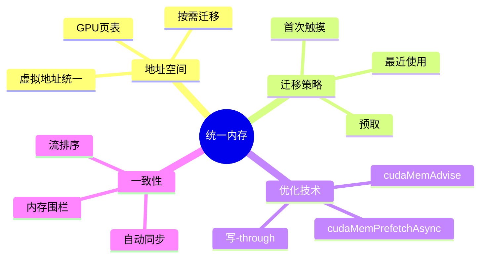

# CUDA统一内存架构

> **层级定位**: 05 Deep Structure MetaPhysics / 03 Heterogeneous Memory
> **对应标准**: CUDA 12.x, C++17, C11
> **难度级别**: L5 应用+
> **预估学习时间**: 15-20 小时

---

## 📋 本节概要

| 属性 | 内容 |
|:-----|:-----|
| **核心概念** | 统一虚拟地址、页面迁移、预取策略、内存建议、 oversubscription |
| **前置知识** | CUDA编程基础、虚拟内存、NUMA架构 |
| **后续延伸** | CUDA流、多GPU编程、NVLink |
| **权威来源** | CUDA C Programming Guide, NVIDIA CUDA Best Practices |

---


---

## 📑 目录

- [CUDA统一内存架构](#cuda统一内存架构)
  - [📋 本节概要](#-本节概要)
  - [📑 目录](#-目录)
  - [🧠 知识结构思维导图](#-知识结构思维导图)
  - [📖 核心概念详解](#-核心概念详解)
    - [1. 统一内存架构基础](#1-统一内存架构基础)
      - [1.1 统一虚拟地址空间](#11-统一虚拟地址空间)
      - [1.2 页面迁移机制](#12-页面迁移机制)
    - [2. 显式内存管理](#2-显式内存管理)
      - [2.1 预取优化](#21-预取优化)
      - [2.2 内存建议](#22-内存建议)
    - [3. 一致性模型](#3-一致性模型)
      - [3.1 自动一致性](#31-自动一致性)
      - [3.2 并发管理访问](#32-并发管理访问)
    - [4. 性能优化策略](#4-性能优化策略)
      - [4.1 数据局部性优化](#41-数据局部性优化)
      - [4.2 Oversubscription（超额订阅）](#42-oversubscription超额订阅)
  - [⚠️ 常见陷阱](#️-常见陷阱)
    - [陷阱 CUDA01: 频繁的页错误](#陷阱-cuda01-频繁的页错误)
    - [陷阱 CUDA02: CPU访问统一内存的时机](#陷阱-cuda02-cpu访问统一内存的时机)
    - [陷阱 CUDA03: 忽略设备属性](#陷阱-cuda03-忽略设备属性)
  - [✅ 质量验收清单](#-质量验收清单)
  - [📚 参考资源](#-参考资源)


---

## 🧠 知识结构思维导图



---

## 📖 核心概念详解

### 1. 统一内存架构基础

#### 1.1 统一虚拟地址空间

```c
// 统一内存的核心：单个指针访问CPU和GPU内存
// 无需显式的cudaMemcpy

#include <cuda_runtime.h>
#include <stdio.h>

// 传统CUDA（分离内存）
void traditional_approach(void) {
    int *h_data, *d_data;
    size_t size = 1024 * sizeof(int);

    // 主机分配
    h_data = (int *)malloc(size);

    // 设备分配
    cudaMalloc(&d_data, size);

    // 显式传输
    cudaMemcpy(d_data, h_data, size, cudaMemcpyHostToDevice);

    // 内核执行...

    // 复制回主机
    cudaMemcpy(h_data, d_data, size, cudaMemcpyDeviceToHost);

    free(h_data);
    cudaFree(d_data);
}

// 统一内存方法
void unified_memory_approach(void) {
    int *data;
    size_t size = 1024 * sizeof(int);

    // 统一内存分配
    cudaMallocManaged(&data, size);

    // 直接在主机初始化
    for (int i = 0; i < 1024; i++) {
        data[i] = i;
    }

    // 内核直接使用（自动迁移）
    kernel<<<grid, block>>>(data);
    cudaDeviceSynchronize();

    // 直接在主机访问结果
    for (int i = 0; i < 1024; i++) {
        printf("%d ", data[i]);
    }

    cudaFree(data);
}
```

#### 1.2 页面迁移机制

```c
// 统一内存的页面迁移是按需进行的
// 由GPU页错误触发

/*
 * 页面迁移流程：
 * 1. GPU首次访问某页面 → GPU页错误
 * 2. 页面从CPU内存迁移到GPU内存
 * 3. 建立GPU页表映射
 * 4. 后续访问直接命中
 *
 * 反之亦然（GPU到CPU）
 */

// 页面迁移粒度：通常4KB或64KB（取决于架构）
#define PAGE_SIZE_4KB  (4 * 1024)
#define PAGE_SIZE_64KB (64 * 1024)

// 查看页面迁移统计
void check_migration_stats(void) {
    cudaDeviceProp prop;
    cudaGetDeviceProperties(&prop, 0);

    printf("设备: %s\n", prop.name);
    printf("统一内存支持: %s\n",
           prop.managedMemory ? "是" : "否");
    printf("并发管理访问: %s\n",
           prop.concurrentManagedAccess ? "是" : "否");

    // 在Linux上可以通过nvidia-smi查看迁移统计
    // nvidia-smi nvlink -e
    // nvidia-smi pmon -s u  # 显示统一内存迁移
}

// 理解访问模式对迁移的影响
__global__ void stride_kernel(float *data, int stride) {
    int idx = blockIdx.x * blockDim.x + threadIdx.x;
    int strided_idx = idx * stride;

    // 如果stride大，每次访问不同页面
    // 会导致大量页面迁移
    data[strided_idx] = data[strided_idx] * 2.0f;
}

// 优化版本：合并访问
__global__ void coalesced_kernel(float *data) {
    int idx = blockIdx.x * blockDim.x + threadIdx.x;
    // 线程连续访问，同一warp访问同一/相邻页面
    data[idx] = data[idx] * 2.0f;
}
```

### 2. 显式内存管理

#### 2.1 预取优化

```c
// cudaMemPrefetchAsync: 异步预取到指定设备
// 减少按需迁移的开销

void prefetch_example(void) {
    const int N = 1 << 20;  // 1M元素
    float *data;

    cudaMallocManaged(&data, N * sizeof(float));

    // 初始化数据（在CPU上）
    for (int i = 0; i < N; i++) {
        data[i] = (float)i;
    }

    // 预取到GPU（异步）
    // 参数: 指针, 大小, 目标设备, 流
    cudaMemPrefetchAsync(data, N * sizeof(float), 0, 0);

    // 可以同时做其他CPU工作...

    // 确保预取完成
    cudaStreamSynchronize(0);

    // 现在内核执行时不会触发页错误
    kernel<<<N/256, 256>>>(data);
    cudaDeviceSynchronize();

    // 预取回CPU（可选）
    cudaMemPrefetchAsync(data, N * sizeof(float), cudaCpuDeviceId, 0);
    cudaStreamSynchronize(0);

    // 现在可以在CPU上高效访问
    float sum = 0;
    for (int i = 0; i < N; i++) {
        sum += data[i];
    }

    cudaFree(data);
}

// 多GPU预取
void multi_gpu_prefetch(int num_gpus) {
    int N = 1 << 24;
    float *data;

    cudaMallocManaged(&data, N * sizeof(float));

    // 数据分区预取到不同GPU
    int chunk_size = N / num_gpus;

    for (int i = 0; i < num_gpus; i++) {
        cudaSetDevice(i);
        float *chunk = data + i * chunk_size;
        cudaMemPrefetchAsync(chunk, chunk_size * sizeof(float), i, 0);
    }

    // 并行执行内核
    for (int i = 0; i < num_gpus; i++) {
        cudaSetDevice(i);
        float *chunk = data + i * chunk_size;
        kernel<<<chunk_size/256, 256>>>(chunk);
    }

    // 同步所有设备
    for (int i = 0; i < num_gpus; i++) {
        cudaSetDevice(i);
        cudaDeviceSynchronize();
    }

    cudaFree(data);
}
```

#### 2.2 内存建议

```c
// cudaMemAdvise: 给运行时系统提供内存使用提示

void mem_advise_example(void) {
    const int N = 1 << 20;
    float *data;

    cudaMallocManaged(&data, N * sizeof(float));

    // 内存建议类型

    // 1. cudaMemAdviseSetReadMostly
    // 数据主要被读取，很少写入
    // 允许多个GPU同时缓存只读副本
    cudaMemAdvise(data, N * sizeof(float),
                  cudaMemAdviseSetReadMostly, 0);

    // 多GPU只读访问场景
    for (int i = 0; i < num_gpus; i++) {
        cudaSetDevice(i);
        read_only_kernel<<<blocks, threads>>>(data);
    }

    // 清除只读建议
    cudaMemAdvise(data, N * sizeof(float),
                  cudaMemAdviseUnsetReadMostly, 0);

    // 2. cudaMemAdviseSetPreferredLocation
    // 设置数据的首选位置
    cudaMemAdvise(data, N * sizeof(float),
                  cudaMemAdviseSetPreferredLocation, 0);  // GPU 0

    // 或设置在CPU
    // cudaMemAdvise(data, size, cudaMemAdviseSetPreferredLocation,
    //               cudaCpuDeviceId);

    // 3. cudaMemAdviseSetAccessedBy
    // 预建立GPU页表映射，避免首次访问时的页错误
    cudaMemAdvise(data, N * sizeof(float),
                  cudaMemAdviseSetAccessedBy, 0);  // GPU 0

    // 多GPU场景：为所有GPU建立映射
    for (int i = 0; i < num_gpus; i++) {
        cudaMemAdvise(data, N * sizeof(float),
                      cudaMemAdviseSetAccessedBy, i);
    }
}

// 优化案例分析：图像处理流水线
void image_processing_pipeline(void) {
    int width = 1920, height = 1080;
    size_t image_size = width * height * 3 * sizeof(uint8_t);

    uint8_t *input, *output, *intermediate;
    cudaMallocManaged(&input, image_size);
    cudaMallocManaged(&output, image_size);
    cudaMallocManaged(&intermediate, image_size);

    // 读取输入图像（CPU）
    load_image(input);

    // 建议：输入数据主要在GPU读取，输出在GPU写入
    cudaMemAdvise(input, image_size, cudaMemAdviseSetReadMostly, 0);
    cudaMemAdvise(input, image_size, cudaMemAdviseSetPreferredLocation, 0);

    // 预取到GPU
    cudaMemPrefetchAsync(input, image_size, 0, 0);

    // 阶段1: 去噪
    denoise_kernel<<<grid, block>>>(input, intermediate, width, height);

    // 阶段2: 锐化
    sharpen_kernel<<<grid, block>>>(intermediate, output, width, height);

    // 建议：输出数据回到CPU
    cudaMemPrefetchAsync(output, image_size, cudaCpuDeviceId, 0);
    cudaStreamSynchronize(0);

    // 保存结果
    save_image(output);

    cudaFree(input);
    cudaFree(output);
    cudaFree(intermediate);
}
```

### 3. 一致性模型

#### 3.1 自动一致性

```c
// 统一内存提供自动一致性
// 通过设备同步点保证

void consistency_example(void) {
    int N = 1024;
    float *data;
    cudaMallocManaged(&data, N * sizeof(float));

    // CPU写入
    for (int i = 0; i < N; i++) {
        data[i] = 1.0f;
    }

    // 内核读取和修改
    increment_kernel<<<N/256, 256>>>(data);

    // 同步点：确保GPU修改可见
    cudaDeviceSynchronize();

    // CPU读取结果（自动一致）
    for (int i = 0; i < N; i++) {
        assert(data[i] == 2.0f);
    }

    cudaFree(data);
}

// 流排序一致性
void stream_consistency(void) {
    cudaStream_t stream1, stream2;
    cudaStreamCreate(&stream1);
    cudaStreamCreate(&stream2);

    float *data;
    cudaMallocManaged(&data, 1024 * sizeof(float));

    // 流1写入
    write_kernel<<<blocks, threads, 0, stream1>>>(data);

    // 流2读取（流排序保证可见性）
    read_kernel<<<blocks, threads, 0, stream2>>>(data);

    // 但跨流需要显式同步
    cudaStreamSynchronize(stream1);
    // 现在stream2的读操作能看到stream1的写操作

    cudaStreamDestroy(stream1);
    cudaStreamDestroy(stream2);
    cudaFree(data);
}
```

#### 3.2 并发管理访问

```c
// Pascal及更新架构支持GPU和CPU并发访问统一内存

void concurrent_access_example(void) {
    cudaDeviceProp prop;
    cudaGetDeviceProperties(&prop, 0);

    if (!prop.concurrentManagedAccess) {
        printf("设备不支持并发管理访问\n");
        return;
    }

    const int N = 1 << 20;
    float *data;
    cudaMallocManaged(&data, N * sizeof(float));

    // 允许GPU和CPU同时访问
    // 注意：需要程序员保证没有数据竞争

    // 将数据分区
    int gpu_portion = N * 0.8;  // 80%给GPU
    int cpu_portion = N - gpu_portion;  // 20%给CPU

    // 预取GPU部分
    cudaMemPrefetchAsync(data, gpu_portion * sizeof(float), 0, 0);

    // GPU处理其部分
    gpu_kernel<<<gpu_portion/256, 256>>>(data, gpu_portion);

    // CPU同时处理其部分（需要同步机制）
    // CPU部分无需预取，保持在CPU内存
    cpu_process(data + gpu_portion, cpu_portion);

    cudaDeviceSynchronize();

    cudaFree(data);
}

// 使用内存围栏的细粒度同步
void fine_grained_sync(void) {
    volatile int *flag;
    cudaMallocManaged(&flag, sizeof(int));
    *flag = 0;

    // 内核设置标志
    __global__ void signal_kernel(volatile int *flag) {
        // 完成工作...
        __threadfence_system();  // 系统范围内存围栏
        *flag = 1;
    }

    signal_kernel<<<1, 1>>>(flag);

    // CPU自旋等待（谨慎使用）
    while (*flag == 0) {
        // 忙等待
    }

    cudaDeviceSynchronize();
    cudaFree((void*)flag);
}
```

### 4. 性能优化策略

#### 4.1 数据局部性优化

```c
// 结构体数组 vs 数组结构体
// 对统一内存访问模式有重要影响

// 较差：结构体数组（AoS）
// 如果只需要访问部分字段，会迁移不必要的数据
typedef struct {
    float x, y, z;      // 位置
    float vx, vy, vz;   // 速度
    float mass;         // 质量
    int id;             // ID
} Particle_AoS;

// 较好：数组结构体（SoA）
// 可以独立访问不同属性，减少不必要迁移
typedef struct {
    float *x, *y, *z;
    float *vx, *vy, *vz;
    float *mass;
    int *id;
} Particle_SoA;

// 使用SoA的N体模拟
void nbody_simulation_soa(int N, int steps) {
    Particle_SoA particles;

    // 分配统一内存
    cudaMallocManaged(&particles.x, N * sizeof(float));
    cudaMallocManaged(&particles.y, N * sizeof(float));
    cudaMallocManaged(&particles.z, N * sizeof(float));
    cudaMallocManaged(&particles.vx, N * sizeof(float));
    cudaMallocManaged(&particles.vy, N * sizeof(float));
    cudaMallocManaged(&particles.vz, N * sizeof(float));

    // 初始化...

    // 只预取位置数据用于力计算
    cudaMemPrefetchAsync(particles.x, N * sizeof(float), 0, 0);
    cudaMemPrefetchAsync(particles.y, N * sizeof(float), 0, 0);
    cudaMemPrefetchAsync(particles.z, N * sizeof(float), 0, 0);

    for (int s = 0; s < steps; s++) {
        // 计算力（只需要位置）
        compute_forces_soa<<<blocks, threads>>>(
            particles.x, particles.y, particles.z,
            // 其他参数...
        );

        // 更新速度（需要速度和力）
        update_velocity_soa<<<blocks, threads>>>(
            particles.vx, particles.vy, particles.vz,
            // 力数据...
        );

        // 更新位置
        update_position_soa<<<blocks, threads>>>(
            particles.x, particles.y, particles.z,
            particles.vx, particles.vy, particles.vz
        );
    }

    // 清理...
}
```

#### 4.2 Oversubscription（超额订阅）

```c
// 统一内存允许分配超过GPU物理内存的数据
// 系统会自动在CPU和GPU之间换页

void oversubscription_example(void) {
    size_t gpu_memory;
    cudaMemGetInfo(NULL, &gpu_memory);

    // 分配2倍GPU内存
    size_t alloc_size = gpu_memory * 2;
    float *large_data;
    cudaMallocManaged(&large_data, alloc_size);

    printf("GPU内存: %zu MB\n", gpu_memory / (1024*1024));
    printf("分配: %zu MB\n", alloc_size / (1024*1024));

    // 初始化所有数据（在CPU上）
    for (size_t i = 0; i < alloc_size / sizeof(float); i++) {
        large_data[i] = (float)i;
    }

    // 分批处理
    size_t batch_size = gpu_memory / 2;
    int num_batches = (alloc_size + batch_size - 1) / batch_size;

    for (int b = 0; b < num_batches; b++) {
        float *batch = (float *)((char *)large_data + b * batch_size);
        size_t current_batch = (b == num_batches - 1) ?
            (alloc_size - b * batch_size) : batch_size;

        // 预取当前批次
        cudaMemPrefetchAsync(batch, current_batch, 0, 0);

        // 处理
        kernel<<<current_batch / 256 / sizeof(float), 256>>>(
            batch, current_batch / sizeof(float));

        // 写回（可选）
        cudaMemPrefetchAsync(batch, current_batch, cudaCpuDeviceId, 0);
    }

    cudaDeviceSynchronize();
    cudaFree(large_data);
}
```

---

## ⚠️ 常见陷阱

### 陷阱 CUDA01: 频繁的页错误

```c
// 错误：随机访问模式导致大量页错误
__global__ void random_access_kernel(float *data, int *indices, int N) {
    int idx = blockIdx.x * blockDim.x + threadIdx.x;
    if (idx < N) {
        // 随机索引访问，每次可能触发不同页面
        int target = indices[idx];
        data[target] = data[target] * 2.0f;
    }
}

// 优化1：预取索引指示的所有页面（可能不实际）
// 优化2：重构算法使用连续访问
// 优化3：使用显式内存复制而非统一内存
```

### 陷阱 CUDA02: CPU访问统一内存的时机

```c
// 错误：在GPU内核执行期间访问统一内存
void dangerous_pattern(void) {
    float *data;
    cudaMallocManaged(&data, size);

    kernel<<<grid, block>>>(data);

    // ❌ 危险：内核仍在执行，CPU访问可能竞争
    float sum = 0;
    for (int i = 0; i < N; i++) {
        sum += data[i];
    }

    cudaDeviceSynchronize();
}

// 正确：同步后再访问
void safe_pattern(void) {
    float *data;
    cudaMallocManaged(&data, size);

    kernel<<<grid, block>>>(data);
    cudaDeviceSynchronize();  // ✅ 确保GPU完成

    float sum = 0;
    for (int i = 0; i < N; i++) {
        sum += data[i];
    }
}
```

### 陷阱 CUDA03: 忽略设备属性

```c
// 错误：假设所有设备都支持统一内存
void wrong_assumption(void) {
    float *data;
    cudaMallocManaged(&data, size);  // 在旧设备上可能失败
}

// 正确：检查设备能力
void check_capability(void) {
    cudaDeviceProp prop;
    cudaGetDeviceProperties(&prop, 0);

    if (!prop.managedMemory) {
        // 回退到传统cudaMalloc/cudaMemcpy
        traditional_approach();
        return;
    }

    // 使用统一内存
    unified_approach();
}
```

---

## ✅ 质量验收清单

- [x] 统一内存分配与释放
- [x] 页面迁移机制理解
- [x] cudaMemPrefetchAsync使用
- [x] cudaMemAdvise优化
- [x] 一致性模型理解
- [x] 并发管理访问
- [x] SoA数据布局优化
- [x] Oversubscription处理
- [x] Mermaid思维导图
- [x] 常见陷阱与解决方案

---

## 📚 参考资源

| 资源 | 作者/来源 | 说明 |
|:-----|:----------|:-----|
| CUDA C Programming Guide | NVIDIA | 统一内存章节 |
| CUDA Best Practices Guide | NVIDIA | 性能优化建议 |
| Managed Memory | CUDA Docs | 统一内存详细文档 |
| Multi-GPU Programming | NVIDIA | 多GPU统一内存 |

---

> **更新记录**
>
> - 2025-03-09: 初版创建，包含CUDA统一内存完整指南


---

## 深入理解

### 核心原理

深入探讨技术原理和实现细节。

### 实践应用

- 应用场景1
- 应用场景2
- 应用场景3

### 最佳实践

1. 理解基础概念
2. 掌握核心机制
3. 应用到实际项目

---

> **最后更新**: 2026-03-21  
> **维护者**: AI Code Review
