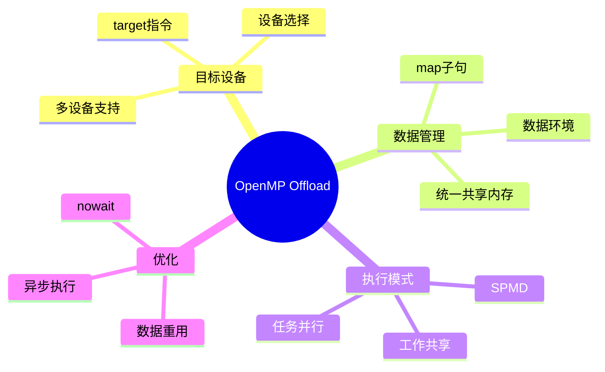

---

## 🔗 文档关联

### 核心关联
| 文档 | 关系类型 | 说明 |
|:-----|:---------|:-----|
| [内存管理](../../../01_Core_Knowledge_System/02_Core_Layer/02_Memory_Management.md) | 核心关联 | 内存管理基础 |
| [指针深度](../../../01_Core_Knowledge_System/02_Core_Layer/01_Pointer_Depth.md) | 核心关联 | 指针深度基础 |
| [并发编程](../../../03_System_Technology_Domains/14_Concurrency_Parallelism/readme.md) | 核心关联 | 并发编程基础 |
| [数据类型](../../../01_Core_Knowledge_System/01_Basic_Layer/02_Data_Type_System.md) | 核心关联 | 数据类型基础 |
| [数组与指针](../../../01_Core_Knowledge_System/02_Core_Layer/05_Arrays_Pointers.md) | 核心关联 | 数组与指针基础 |

### 扩展阅读
| 文档 | 关系类型 | 说明 |
|:-----|:---------|:-----|
| [软件工程](../../../01_Core_Knowledge_System/05_Engineering_Layer/readme.md) | 核心关联 | 软件工程基础 |
| [形式语义](../../../02_Formal_Semantics_and_Physics/readme.md) | 核心关联 | 形式语义基础 |
| [系统技术](../../../03_System_Technology_Domains/readme.md) | 核心关联 | 系统技术基础 |
| [工业场景](../../../04_Industrial_Scenarios/readme.md) | 核心关联 | 工业场景基础 |
| [思维表征](../../../06_Thinking_Representation/readme.md) | 核心关联 | 思维表征基础 |
# OpenMP Offload编程模型

> **层级定位**: 05 Deep Structure MetaPhysics / 03 Heterogeneous Memory
> **对应标准**: OpenMP 5.0/5.1/5.2, C11/C++17
> **难度级别**: L5 应用+
> **预估学习时间**: 15-20 小时

---

## 📋 本节概要

| 属性 | 内容 |
|:-----|:-----|
| **核心概念** | target指令、数据映射、设备环境、统一共享内存 |
| **前置知识** | OpenMP基础、GPU架构、异构编程 |
| **后续延伸** | OpenMP 6.0动态分配、多设备编程 |
| **权威来源** | OpenMP 5.2 Specification, LLVM OpenMP |

---


---

## 📑 目录

- [OpenMP Offload编程模型](#openmp-offload编程模型)
  - [📋 本节概要](#-本节概要)
  - [📑 目录](#-目录)
  - [🧠 知识结构思维导图](#-知识结构思维导图)
  - [📖 核心概念详解](#-核心概念详解)
    - [1. OpenMP Offload基础](#1-openmp-offload基础)
      - [1.1 基本target指令](#11-基本target指令)
      - [1.2 数据映射基础](#12-数据映射基础)
    - [2. 高级数据管理](#2-高级数据管理)
      - [2.1 target data区域](#21-target-data区域)
      - [2.2 统一共享内存（USM）](#22-统一共享内存usm)
    - [3. 执行模型](#3-执行模型)
      - [3.1 SPMD执行模式](#31-spmd执行模式)
      - [3.2 任务并行](#32-任务并行)
    - [4. 优化技术](#4-优化技术)
      - [4.1 数据重用优化](#41-数据重用优化)
      - [4.2 多设备编程](#42-多设备编程)
  - [⚠️ 常见陷阱](#️-常见陷阱)
    - [陷阱 OMP01: 忘记数据映射](#陷阱-omp01-忘记数据映射)
    - [陷阱 OMP02: 数据映射范围错误](#陷阱-omp02-数据映射范围错误)
    - [陷阱 OMP03: 异步执行的数据竞争](#陷阱-omp03-异步执行的数据竞争)
  - [✅ 质量验收清单](#-质量验收清单)
  - [📚 参考资源](#-参考资源)
  - [深入理解](#深入理解)
    - [核心原理](#核心原理)
    - [实践应用](#实践应用)
    - [最佳实践](#最佳实践)


---

## 🧠 知识结构思维导图



---

## 📖 核心概念详解

### 1. OpenMP Offload基础

#### 1.1 基本target指令

```c
// OpenMP Offload基础语法
// 使用target指令将代码卸载到加速器

#include <omp.h>
#include <stdio.h>

// 简单向量加法
void vector_add_offload(float *a, float *b, float *c, int N) {
    // #pragma omp target: 将区域卸载到设备
    // 默认设备通常是GPU
    #pragma omp target
    {
        // 在设备上串行执行
        for (int i = 0; i < N; i++) {
            c[i] = a[i] + b[i];
        }
    }
}

// 带并行化的向量加法
void vector_add_parallel(float *a, float *b, float *c, int N) {
    #pragma omp target parallel for
    for (int i = 0; i < N; i++) {
        c[i] = a[i] + b[i];
    }
}

// 选择特定设备
void vector_add_device_select(float *a, float *b, float *c, int N, int device) {
    // device子句选择目标设备
    #pragma omp target device(device) parallel for
    for (int i = 0; i < N; i++) {
        c[i] = a[i] + b[i];
    }
}

// 检查设备可用性
void check_offload_support(void) {
    // 获取设备数量
    int num_devices = omp_get_num_devices();
    printf("可用设备数: %d\n", num_devices);

    // 获取默认设备
    int default_device = omp_get_default_device();
    printf("默认设备: %d\n", default_device);

    // 获取主机作为设备编号
    int host_device = omp_get_initial_device();
    printf("主机设备编号: %d\n", host_device);

    // 检查设备是否可用
    if (num_devices > 0) {
        // 测试能否在设备上分配内存
        void *test = omp_target_alloc(1024, 0);
        if (test) {
            printf("设备0可用\n");
            omp_target_free(test, 0);
        }
    }
}
```

#### 1.2 数据映射基础

```c
// OpenMP Offload的数据映射
// map子句控制主机和设备间的数据传输

// 隐式数据映射（根据使用模式推断）
void implicit_mapping(float *a, float *b, float *c, int N) {
    // a,b,c在target区域使用，自动映射到设备
    // 默认行为：
    // - 标量和数组：tofrom（进入时复制到设备，退出时复制回）
    // - 指针：仅指针值，不指向的数据
    #pragma omp target parallel for
    for (int i = 0; i < N; i++) {
        c[i] = a[i] + b[i];
    }
}

// 显式数据映射
void explicit_mapping(float *a, float *b, float *c, int N) {
    // map子句显式指定数据传输行为
    #pragma omp target parallel for \
        map(to: a[0:N], b[0:N]) \
        map(from: c[0:N])
    for (int i = 0; i < N; i++) {
        c[i] = a[i] + b[i];
    }
}

// 数据映射类型
void mapping_types(void) {
    float data[1000];
    float result[1000];

    // to: 只复制到设备（设备只读）
    #pragma omp target map(to: data[0:1000])
    {
        // 读取data，修改不会传回主机
    }

    // from: 只从设备复制回（设备只写）
    #pragma omp target map(from: result[0:1000])
    {
        // 写入result，初始值未定义
    }

    // tofrom: 双向复制（默认）
    #pragma omp target map(tofrom: data[0:1000])
    {
        // 读取并修改data，修改会传回
    }

    // alloc: 在设备上分配，不初始化
    #pragma omp target map(alloc: result[0:1000])
    {
        // result在设备上未初始化
        // 所有元素必须先写入再读取
    }
}

// 结构体映射
struct Particle {
    float x, y, z;
    float vx, vy, vz;
    float mass;
};

void struct_mapping(struct Particle *particles, int N) {
    // 结构体数组映射
    #pragma omp target parallel for \
        map(tofrom: particles[0:N])
    for (int i = 0; i < N; i++) {
        particles[i].x += particles[i].vx;
        particles[i].y += particles[i].vy;
        particles[i].z += particles[i].vz;
    }
}
```

### 2. 高级数据管理

#### 2.1 target data区域

```c
// target data: 创建持续的数据环境
// 多个target区域可以共享数据

void target_data_example(float *a, float *b, float *c,
                         float *d, int N) {
    // 创建设备数据环境
    #pragma omp target data map(to: a[0:N], b[0:N]) \
                            map(alloc: c[0:N], d[0:N])
    {
        // 第一个内核
        #pragma omp target parallel for nowait
        for (int i = 0; i < N; i++) {
            c[i] = a[i] + b[i];
        }

        // 第二个内核（c已在设备上，无需再次传输）
        #pragma omp target parallel for
        for (int i = 0; i < N; i++) {
            d[i] = c[i] * 2.0f;
        }

        // 退出target data时，c和d是alloc映射，不复制回
    }
}

// 使用update子句显式同步数据
void update_clause_example(float *data, int N) {
    #pragma omp target data map(alloc: data[0:N])
    {
        // 设备初始化
        #pragma omp target parallel for
        for (int i = 0; i < N; i++) {
            data[i] = i * 1.0f;
        }

        // 将设备数据更新回主机
        #pragma omp target update from(data[0:N/2])

        // 主机可以访问前半部分
        printf("Host: data[0] = %f\n", data[0]);

        // 修改主机数据
        for (int i = 0; i < N/2; i++) {
            data[i] *= 2;
        }

        // 将主机数据更新到设备
        #pragma omp target update to(data[0:N/2])

        // 继续设备执行...
        #pragma omp target parallel for
        for (int i = 0; i < N; i++) {
            data[i] += 1.0f;
        }

        // 最终复制回主机
        #pragma omp target update from(data[0:N])
    }
}

// enter data 和 exit data 分离
void enter_exit_data(float *persistent_data, int size) {
    // 进入数据环境（在函数入口处）
    #pragma omp target enter data map(alloc: persistent_data[0:size])

    // 多次内核执行，数据保持在设备上
    for (int iter = 0; iter < 100; iter++) {
        #pragma omp target parallel for
        for (int i = 0; i < size; i++) {
            persistent_data[i] = compute(persistent_data[i]);
        }
    }

    // 退出数据环境（在函数出口处）
    #pragma omp target exit data map(from: persistent_data[0:size])
}
```

#### 2.2 统一共享内存（USM）

```c
// OpenMP 5.0+ 支持统一共享内存
// 类似CUDA统一内存，自动页面迁移

// 需要编译器支持：-fopenmp-targets=... -fopenmp-usm

void unified_shared_memory(void) {
    const int N = 1 << 20;

    // 使用标准malloc分配
    // 在USM模式下，内存自动对设备可访问
    float *data = (float *)malloc(N * sizeof(float));

    // 初始化
    for (int i = 0; i < N; i++) {
        data[i] = i * 0.5f;
    }

    // 无需显式map，直接访问
    #pragma omp target parallel for
    for (int i = 0; i < N; i++) {
        data[i] = data[i] * data[i];
    }

    // 主机访问结果（自动同步）
    float sum = 0;
    for (int i = 0; i < N; i++) {
        sum += data[i];
    }

    free(data);
}

// 显式USM内存分配
void explicit_usm_allocation(void) {
    const int N = 1024;
    int device = omp_get_default_device();

    // 分配统一共享内存
    float *shared_mem = (float *)omp_target_alloc_host(N * sizeof(float), device);

    // 或使用设备分配
    float *device_mem = (float *)omp_target_alloc_device(N * sizeof(float), device);

    // 或使用共享分配（自动迁移）
    float *managed_mem = (float *)omp_target_alloc_shared(N * sizeof(float), device);

    // 初始化并使用...

    // 释放
    omp_target_free(shared_mem, device);
    omp_target_free(device_mem, device);
    omp_target_free(managed_mem, device);
}

// USM与显式map的混合使用
void mixed_usm_explicit(void) {
    int N = 1024;

    // USM内存
    float *usm_data = (float *)omp_target_alloc_shared(N * sizeof(float),
                                                        omp_get_default_device());

    // 普通主机内存
    float *host_data = (float *)malloc(N * sizeof(float));

    // 初始化USM数据
    for (int i = 0; i < N; i++) {
        usm_data[i] = i;
    }

    // 混合使用：USM自动迁移，host_data显式映射
    #pragma omp target parallel for map(to: host_data[0:N])
    for (int i = 0; i < N; i++) {
        usm_data[i] = usm_data[i] + host_data[i];
    }

    omp_target_free(usm_data, omp_get_default_device());
    free(host_data);
}
```

### 3. 执行模型

#### 3.1 SPMD执行模式

```c
// Single Program Multiple Data (SPMD) 模式
// 每个设备线程执行相同代码，处理不同数据

void spmd_example(float *data, int N) {
    #pragma omp target parallel for
    for (int i = 0; i < N; i++) {
        // 每个线程处理一个元素
        // omp_get_thread_num() 获取线程ID
        // omp_get_num_threads() 获取总线程数
        data[i] = process(data[i], omp_get_thread_num());
    }
}

// 使用teams分发到多个线程组
void teams_example(float *data, int N) {
    // teams: 创建多个线程组（类似CUDA blocks）
    // distribute: 在组间分发迭代
    // parallel for: 组内并行
    #pragma omp target teams distribute parallel for
    for (int i = 0; i < N; i++) {
        int team_id = omp_get_team_num();
        int thread_id = omp_get_thread_num();
        data[i] = team_id * 1000 + thread_id;
    }
}

// 细粒度控制teams和threads
void fine_grained_control(float *data, int N) {
    #pragma omp target teams num_teams(128) thread_limit(256) \
        map(tofrom: data[0:N])
    {
        // 在team内共享的变量
        __attribute__((aligned(64))) float shared_mem[256];

        #pragma omp distribute parallel for
        for (int i = 0; i < N; i++) {
            int tid = omp_get_thread_num();

            // 加载到共享内存
            shared_mem[tid] = data[i];

            // 同步（如果支持）
            #pragma omp barrier

            // 处理...

            data[i] = shared_mem[tid];
        }
    }
}
```

#### 3.2 任务并行

```c
// OpenMP Offload中的任务并行

void task_parallel_offload(float *data, int N) {
    #pragma omp target map(tofrom: data[0:N])
    {
        // 创建任务在设备上异步执行
        #pragma omp task
        {
            for (int i = 0; i < N/2; i++) {
                data[i] = compute_a(data[i]);
            }
        }

        #pragma omp task
        {
            for (int i = N/2; i < N; i++) {
                data[i] = compute_b(data[i]);
            }
        }

        // 等待所有任务完成
        #pragma omp taskwait
    }
}

// 异步目标区域
void async_target(float *a, float *b, float *c, int N) {
    // nowait: 异步执行，不等待完成
    #pragma omp target nowait map(to: a[0:N], b[0:N]) map(from: c[0:N])
    {
        #pragma omp parallel for
        for (int i = 0; i < N; i++) {
            c[i] = a[i] + b[i];
        }
    }

    // 主机可以在这里做其他工作...
    do_cpu_work();

    // 显式等待目标区域完成
    #pragma omp taskwait
    // 或使用 barrier
    // #pragma omp barrier
}

// 多个异步目标区域
void multiple_async_targets(float *data, int num_sections) {
    int section_size = N / num_sections;

    for (int s = 0; s < num_sections; s++) {
        float *section = data + s * section_size;

        #pragma omp target nowait \
            map(tofrom: section[0:section_size])
        {
            #pragma omp parallel for
            for (int i = 0; i < section_size; i++) {
                section[i] = process(section[i]);
            }
        }
    }

    // 等待所有section完成
    #pragma omp taskwait
}
```

### 4. 优化技术

#### 4.1 数据重用优化

```c
// 优化数据映射，减少传输

void optimized_data_reuse(float *input, float *output,
                          int N, int iterations) {
    // 创建持久数据环境
    #pragma omp target data map(to: input[0:N]) map(alloc: output[0:N])
    {
        float *temp1 = (float *)omp_target_alloc(N * sizeof(float),
                                                  omp_get_default_device());
        float *temp2 = (float *)omp_target_alloc(N * sizeof(float),
                                                  omp_get_default_device());

        // 多次迭代，数据保持在设备上
        for (int iter = 0; iter < iterations; iter++) {
            // 交替使用temp1和temp2
            float *src = (iter % 2 == 0) ? input : temp2;
            float *dst = (iter % 2 == 0) ? temp1 : temp2;

            #pragma omp target parallel for
            for (int i = 0; i < N; i++) {
                dst[i] = compute(src[i]);
            }
        }

        // 最后一次迭代结果复制到output
        float *final_src = (iterations % 2 == 0) ? input : temp2;
        #pragma omp target parallel for
        for (int i = 0; i < N; i++) {
            output[i] = final_src[i];
        }

        omp_target_free(temp1, omp_get_default_device());
        omp_target_free(temp2, omp_get_default_device());
    }
}

// 使用declare target声明设备函数和变量
#pragma omp declare target

// 设备上可用的全局变量
float device_constant_table[256];

// 设备函数
float device_function(float x) {
    return x * x + 1.0f;
}

#pragma omp end declare target

void use_declare_target(float *data, int N) {
    // 初始化设备常量表
    #pragma omp target
    {
        for (int i = 0; i < 256; i++) {
            device_constant_table[i] = i * 0.1f;
        }
    }

    // 内核使用设备函数和常量
    #pragma omp target parallel for
    for (int i = 0; i < N; i++) {
        int idx = (int)(data[i]) % 256;
        data[i] = device_function(data[i]) + device_constant_table[idx];
    }
}
```

#### 4.2 多设备编程

```c
// OpenMP 5.0+ 多设备支持

void multi_device_distribute(float *data, int N, int num_devices) {
    int chunk_size = (N + num_devices - 1) / num_devices;

    // 为每个设备创建任务
    for (int d = 0; d < num_devices; d++) {
        int start = d * chunk_size;
        int end = (d + 1) * chunk_size;
        if (end > N) end = N;
        int actual_chunk = end - start;

        #pragma omp task
        {
            // 设置目标设备
            omp_set_default_device(d);

            float *chunk = data + start;

            #pragma omp target map(tofrom: chunk[0:actual_chunk])
            {
                #pragma omp parallel for
                for (int i = 0; i < actual_chunk; i++) {
                    chunk[i] = process(chunk[i]);
                }
            }
        }
    }

    // 等待所有设备完成
    #pragma omp taskwait
}

// 设备间的数据传递
void device_to_device_transfer(float *data, int N, int src_dev, int dst_dev) {
    // 在源设备上分配和计算
    float *src_ptr = (float *)omp_target_alloc_device(N * sizeof(float), src_dev);

    #pragma omp target device(src_dev)
    {
        #pragma omp parallel for
        for (int i = 0; i < N; i++) {
            src_ptr[i] = compute_source(i);
        }
    }

    // 设备间直接复制（如果支持）
    float *dst_ptr = (float *)omp_target_alloc_device(N * sizeof(float), dst_dev);

    // 使用memmove进行设备间传输
    omp_target_memcpy(dst_ptr, src_ptr, N * sizeof(float),
                      0, 0,  // dst和src偏移
                      dst_dev, src_dev);

    // 在目标设备上继续处理
    #pragma omp target device(dst_dev)
    {
        #pragma omp parallel for
        for (int i = 0; i < N; i++) {
            dst_ptr[i] = process_destination(dst_ptr[i]);
        }
    }

    // 复制回主机
    float *host_result = (float *)malloc(N * sizeof(float));
    omp_target_memcpy(host_result, dst_ptr, N * sizeof(float),
                      0, 0,
                      omp_get_initial_device(), dst_dev);

    // 清理
    omp_target_free(src_ptr, src_dev);
    omp_target_free(dst_ptr, dst_dev);
    free(host_result);
}
```

---

## ⚠️ 常见陷阱

### 陷阱 OMP01: 忘记数据映射

```c
// 错误：指针数据未映射
void wrong_pointer_mapping(void) {
    float *data = (float *)malloc(N * sizeof(float));
    // 初始化...

    #pragma omp target parallel for  // ❌ data指向的内存未映射！
    for (int i = 0; i < N; i++) {
        data[i] = data[i] * 2;  // 可能段错误
    }
}

// 正确：显式映射数据
void correct_pointer_mapping(void) {
    float *data = (float *)malloc(N * sizeof(float));
    // 初始化...

    #pragma omp target parallel for map(tofrom: data[0:N])
    for (int i = 0; i < N; i++) {
        data[i] = data[i] * 2;
    }
}

// 或使用统一共享内存
void usm_solution(void) {
    float *data = (float *)omp_target_alloc_shared(N * sizeof(float),
                                                    omp_get_default_device());
    // 无需map
    #pragma omp target parallel for
    for (int i = 0; i < N; i++) {
        data[i] = data[i] * 2;
    }
}
```

### 陷阱 OMP02: 数据映射范围错误

```c
// 错误：数组切片范围不正确
void wrong_slice(void) {
    float arr[100][100];

    // ❌ arr[0:50] 只映射前50个float，不是50行
    #pragma omp target map(tofrom: arr[0:50])
    {
        arr[10][20] = 1.0f;  // 越界访问！
    }
}

// 正确：计算总元素数
void correct_slice(void) {
    float arr[100][100];

    // 映射50行：50 * 100 = 5000个元素
    #pragma omp target map(tofrom: arr[0:5000])
    {
        arr[10][20] = 1.0f;  // 正确
    }
}

// 或使用C99 VLA语法（如果编译器支持）
void vla_slice(void) {
    int n = 100, m = 100;
    float arr[n][m];

    #pragma omp target map(tofrom: arr[0:50][0:m])
    {
        arr[10][20] = 1.0f;
    }
}
```

### 陷阱 OMP03: 异步执行的数据竞争

```c
// 错误：异步target和主机访问数据竞争
void async_race_condition(void) {
    float data[1000];

    #pragma omp target nowait map(tofrom: data[0:1000])
    {
        // 修改data...
        for (int i = 0; i < 1000; i++) {
            data[i] = compute(i);
        }
    }

    // ❌ 危险：target可能还在执行
    float sum = 0;
    for (int i = 0; i < 1000; i++) {
        sum += data[i];
    }
}

// 正确：等待target完成
void correct_async(void) {
    float data[1000];

    #pragma omp target nowait map(tofrom: data[0:1000])
    {
        for (int i = 0; i < 1000; i++) {
            data[i] = compute(i);
        }
    }

    // 显式等待
    #pragma omp taskwait

    // 现在安全访问
    float sum = 0;
    for (int i = 0; i < 1000; i++) {
        sum += data[i];
    }
}
```

---

## ✅ 质量验收清单

- [x] target指令基本用法
- [x] 数据映射（to/from/tofrom/alloc）
- [x] target data环境
- [x] enter/exit data子句
- [x] update子句
- [x] 统一共享内存（USM）
- [x] SPMD执行模型
- [x] teams和distribute
- [x] 异步执行（nowait）
- [x] 多设备编程
- [x] Mermaid思维导图
- [x] 常见陷阱与解决方案

---

## 📚 参考资源

| 资源 | 作者/来源 | 说明 |
|:-----|:----------|:-----|
| OpenMP 5.2 Specification | OpenMP ARB | 官方标准 |
| LLVM OpenMP | LLVM Project | 开源实现 |
| GCC OpenMP | GNU | GCC实现 |
| OpenMP Offload Examples | OLCF | 生产环境示例 |

---

> **更新记录**
>
> - 2025-03-09: 初版创建，包含OpenMP Offload完整指南


---

## 深入理解

### 核心原理

深入探讨技术原理和实现细节。

### 实践应用

- 应用场景1
- 应用场景2
- 应用场景3

### 最佳实践

1. 理解基础概念
2. 掌握核心机制
3. 应用到实际项目

---

> **最后更新**: 2026-03-21
> **维护者**: AI Code Review
