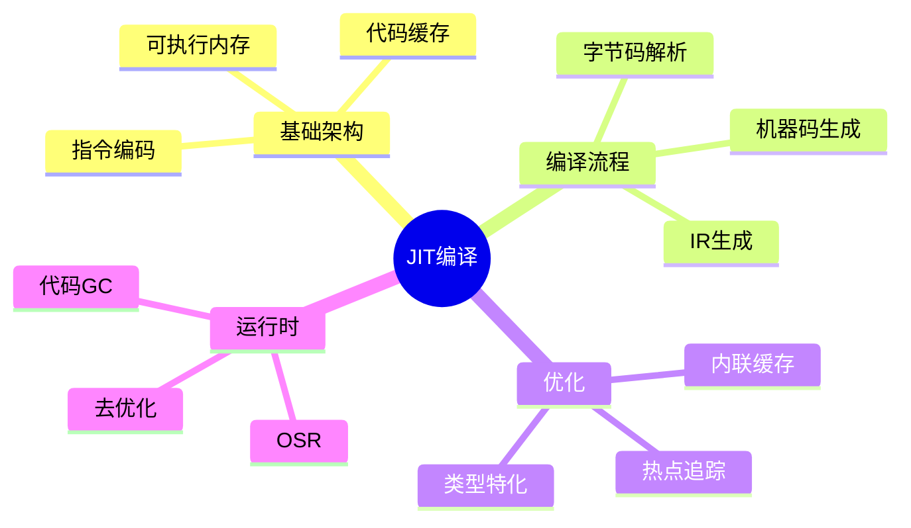

# JIT编译基础

> **层级定位**: 05 Deep Structure MetaPhysics / 04 Self Modifying Code
> **对应标准**: LLVM ORC, V8, Java HotSpot
> **难度级别**: L6 创造
> **预估学习时间**: 20+ 小时

---

## 📋 本节概要

| 属性 | 内容 |
|:-----|:-----|
| **核心概念** | JIT编译、代码生成、可执行内存、代码缓存、分层编译 |
| **前置知识** | 编译原理、汇编语言、内存管理 |
| **后续延伸** | 追踪JIT、自适应优化、去优化 |
| **权威来源** | LLVM ORC, V8 Docs, Java HotSpot |

---


---

## 📑 目录

- [JIT编译基础](#jit编译基础)
  - [📋 本节概要](#-本节概要)
  - [📑 目录](#-目录)
  - [🧠 知识结构思维导图](#-知识结构思维导图)
  - [📖 核心概念详解](#-核心概念详解)
    - [1. JIT编译器架构](#1-jit编译器架构)
      - [1.1 基本组件](#11-基本组件)
      - [1.2 可执行内存管理](#12-可执行内存管理)
    - [2. 简单JIT实现](#2-简单jit实现)
      - [2.1 x86-64代码生成](#21-x86-64代码生成)
      - [2.2 从字节码到机器码](#22-从字节码到机器码)
    - [3. 优化技术](#3-优化技术)
      - [3.1 内联缓存](#31-内联缓存)
      - [3.2 热点追踪和分层编译](#32-热点追踪和分层编译)
    - [4. 运行时支持](#4-运行时支持)
      - [4.1 去优化（Deoptimization）](#41-去优化deoptimization)
      - [4.2 代码GC](#42-代码gc)
  - [⚠️ 常见陷阱](#️-常见陷阱)
    - [陷阱 JIT01: 指令缓存不一致](#陷阱-jit01-指令缓存不一致)
    - [陷阱 JIT02: 跳转偏移计算错误](#陷阱-jit02-跳转偏移计算错误)
    - [陷阱 JIT03: W^X安全违规](#陷阱-jit03-wx安全违规)
  - [✅ 质量验收清单](#-质量验收清单)
  - [📚 参考资源](#-参考资源)


---

## 🧠 知识结构思维导图



---

## 📖 核心概念详解

### 1. JIT编译器架构

#### 1.1 基本组件

```c
// JIT编译器核心组件架构

typedef struct {
    // 代码缓存
    CodeCache *code_cache;

    // IR（中间表示）管理
    IRBuilder *ir_builder;

    // 后端代码生成
    CodeGenerator *code_gen;

    // 优化器
    Optimizer *optimizer;

    // 运行时支持
    Runtime *runtime;

    // 调试信息
    DebugInfo *debug_info;
} JITCompiler;

// 代码缓存管理
typedef struct {
    void *base_addr;           // 可执行内存基址
    size_t capacity;           // 总容量
    size_t used;               // 已使用

    // 代码段管理
    GHashTable *code_blocks;   // 地址 -> CodeBlock

    // GC支持
    GList *code_gc_roots;
} CodeCache;

// 代码块
typedef struct {
    void *start;               // 起始地址
    size_t size;               // 大小
    uint64_t exec_count;       // 执行计数（用于GC）
    bool is_marked;            // GC标记

    // 元数据
    char *function_name;
    int optimization_level;
    void *source_info;
} CodeBlock;
```

#### 1.2 可执行内存管理

```c
#include <sys/mman.h>
#include <stdint.h>

// 分配可执行内存
void* jit_alloc_executable(size_t size) {
    // POSIX: mmap with PROT_EXEC
    void *mem = mmap(NULL, size,
                     PROT_READ | PROT_WRITE | PROT_EXEC,
                     MAP_PRIVATE | MAP_ANONYMOUS, -1, 0);

    if (mem == MAP_FAILED) {
        perror("mmap");
        return NULL;
    }

    return mem;
}

// Windows版本
#ifdef _WIN32
#include <windows.h>

void* jit_alloc_executable_win(size_t size) {
    return VirtualAlloc(NULL, size,
                        MEM_COMMIT | MEM_RESERVE,
                        PAGE_EXECUTE_READWRITE);
}
#endif

// 代码缓存分配器
typedef struct {
    uint8_t *buffer;
    size_t size;
    size_t offset;
} CodeBuffer;

CodeBuffer* code_buffer_create(size_t initial_size) {
    CodeBuffer *cb = malloc(sizeof(CodeBuffer));
    cb->buffer = jit_alloc_executable(initial_size);
    cb->size = initial_size;
    cb->offset = 0;
    return cb;
}

// 在代码缓冲区中分配空间
void* code_buffer_alloc(CodeBuffer *cb, size_t size, size_t align) {
    // 对齐
    size_t aligned = (cb->offset + align - 1) & ~(align - 1);

    if (aligned + size > cb->size) {
        // 需要扩展
        return NULL;
    }

    void *result = cb->buffer + aligned;
    cb->offset = aligned + size;
    return result;
}

// 指令缓存同步（重要！）
void jit_flush_icache(void *start, size_t size) {
    // x86-64通常不需要显式刷新（一致性保证）
    // 但ARM等架构需要

#if defined(__aarch64__)
    // ARM64: 使用__builtin___clear_cache
    __builtin___clear_cache(start, (char*)start + size);
#elif defined(__arm__)
    __builtin___clear_cache(start, (char*)start + size);
#endif
}
```

### 2. 简单JIT实现

#### 2.1 x86-64代码生成

```c
// x86-64指令编码器

typedef struct {
    uint8_t *code;
    size_t offset;
    size_t capacity;
} X86Encoder;

// 编码辅助函数
static void emit_u8(X86Encoder *enc, uint8_t byte) {
    if (enc->offset >= enc->capacity) {
        // 扩展缓冲区
        enc->capacity *= 2;
        enc->code = realloc(enc->code, enc->capacity);
    }
    enc->code[enc->offset++] = byte;
}

static void emit_u32(X86Encoder *enc, uint32_t val) {
    emit_u8(enc, val & 0xFF);
    emit_u8(enc, (val >> 8) & 0xFF);
    emit_u8(enc, (val >> 16) & 0xFF);
    emit_u8(enc, (val >> 24) & 0xFF);
}

// REX前缀（64位模式）
// W=1 (64位操作), R/X/B=0
#define REX_W 0x48

// ModR/M字节编码
// mod(2) | reg(3) | rm(3)
#define MODRM(mod, reg, rm) (((mod) << 6) | ((reg) << 3) | (rm))

// 寄存器编码
enum X86Reg {
    RAX = 0, RCX = 1, RDX = 2, RBX = 3,
    RSP = 4, RBP = 5, RSI = 6, RDI = 7,
    R8 = 8, R9 = 9, R10 = 10, R11 = 11,
    R12 = 12, R13 = 13, R14 = 14, R15 = 15
};

// mov rax, imm64
void emit_mov_rax_imm64(X86Encoder *enc, uint64_t imm) {
    emit_u8(enc, REX_W);
    emit_u8(enc, 0xB8);  // mov r64, imm64
    emit_u8(enc, imm & 0xFF);
    emit_u8(enc, (imm >> 8) & 0xFF);
    emit_u8(enc, (imm >> 16) & 0xFF);
    emit_u8(enc, (imm >> 24) & 0xFF);
    emit_u8(enc, (imm >> 32) & 0xFF);
    emit_u8(enc, (imm >> 40) & 0xFF);
    emit_u8(enc, (imm >> 48) & 0xFF);
    emit_u8(enc, (imm >> 56) & 0xFF);
}

// add rax, imm32
void emit_add_rax_imm32(X86Encoder *enc, int32_t imm) {
    emit_u8(enc, REX_W);
    emit_u8(enc, 0x05);  // add rax, imm32
    emit_u32(enc, imm);
}

// ret
void emit_ret(X86Encoder *enc) {
    emit_u8(enc, 0xC3);
}

// 生成简单函数：返回 x + 42
typedef int64_t (*JitFunc)(int64_t);

JitFunc jit_compile_add_42(void) {
    CodeBuffer *cb = code_buffer_create(4096);
    X86Encoder enc = {
        .code = cb->buffer,
        .offset = 0,
        .capacity = cb->size
    };

    // System V AMD64 ABI:
    // 第一个参数在RDI寄存器

    // mov rax, rdi  (保存参数到rax)
    emit_u8(&enc, 0x48);  // REX.W
    emit_u8(&enc, 0x89);  // mov r64, r/m64
    emit_u8(&enc, MODRM(3, RDI, RAX));  // mod=11, reg=RDI, rm=RAX

    // add rax, 42
    emit_add_rax_imm32(&enc, 42);

    // ret
    emit_ret(&enc);

    // 刷新指令缓存
    jit_flush_icache(cb->buffer, enc.offset);

    return (JitFunc)cb->buffer;
}

// 使用生成的函数
void test_jit(void) {
    JitFunc f = jit_compile_add_42();

    int64_t result = f(10);  // 返回 52
    printf("Result: %ld\n", result);

    // 清理
    munmap((void*)f, 4096);
}
```

#### 2.2 从字节码到机器码

```c
// 简单字节码虚拟机 + JIT编译器

typedef enum {
    OP_NOP = 0,
    OP_CONST,      // 压入常量
    OP_ADD,        // 加法
    OP_SUB,        // 减法
    OP_MUL,        // 乘法
    OP_LT,         // 小于
    OP_JUMP,       // 无条件跳转
    OP_JUMP_IF,    // 条件跳转
    OP_CALL,       // 调用
    OP_RET,        // 返回
    OP_LOAD,       // 加载局部变量
    OP_STORE,      // 存储局部变量
    OP_PRINT,      // 打印栈顶
    OP_HALT        // 停止
} BytecodeOp;

// 字节码函数
typedef struct {
    uint8_t *code;
    int *constants;
    int num_constants;
    int num_locals;
} BytecodeFunction;

// JIT编译器状态
typedef struct {
    BytecodeFunction *func;
    X86Encoder encoder;

    // 跳转补丁表
    GHashTable *jump_patches;  // 字节码偏移 -> 机器码位置列表

    // 已编译块起始地址
    void *compiled_start;
} JITState;

// JIT编译简单字节码序列
void jit_compile_bytecode(JITState *state) {
    BytecodeFunction *func = state->func;
    int pc = 0;

    // 栈帧设置
    // push rbp
    emit_u8(&state->encoder, 0x55);
    // mov rbp, rsp
    emit_u8(&state->encoder, 0x48);
    emit_u8(&state->encoder, 0x89);
    emit_u8(&state->encoder, 0xE5);
    // sub rsp, locals_size
    int locals_size = func->num_locals * 8;
    emit_u8(&state->encoder, 0x48);
    emit_u8(&state->encoder, 0x81);
    emit_u8(&state->encoder, 0xEC);
    emit_u32(&state->encoder, locals_size);

    while (pc < func->code_length) {
        uint8_t op = func->code[pc++];

        switch (op) {
            case OP_CONST: {
                int const_idx = func->code[pc++];
                int value = func->constants[const_idx];

                // push value
                emit_u8(&state->encoder, 0x68);
                emit_u32(&state->encoder, value);
                break;
            }

            case OP_ADD: {
                // pop rax, rbx; add rax, rbx; push rax
                // 简化：使用栈操作
                emit_u8(&state->encoder, 0x58);  // pop rax
                emit_u8(&state->encoder, 0x5B);  // pop rbx
                emit_u8(&state->encoder, 0x48);
                emit_u8(&state->encoder, 0x01);
                emit_u8(&state->encoder, 0xD8);  // add rax, rbx
                emit_u8(&state->encoder, 0x50);  // push rax
                break;
            }

            case OP_JUMP: {
                int target = func->code[pc++];
                // jmp target
                emit_u8(&state->encoder, 0xE9);
                // 记录需要补丁的位置
                int patch_pos = state->encoder.offset;
                emit_u32(&state->encoder, 0);  // 占位符

                // 记录补丁
                g_hash_table_insert(state->jump_patches,
                                   GINT_TO_POINTER(target),
                                   GINT_TO_POINTER(patch_pos));
                break;
            }

            case OP_RET: {
                // mov rsp, rbp
                emit_u8(&state->encoder, 0x48);
                emit_u8(&state->encoder, 0x89);
                emit_u8(&state->encoder, 0xEC);
                // pop rbp
                emit_u8(&state->encoder, 0x5D);
                // ret
                emit_u8(&state->encoder, 0xC3);
                break;
            }

            // ... 其他操作码
        }
    }

    // 应用跳转补丁
    apply_jump_patches(state);

    // 刷新缓存
    jit_flush_icache(state->compiled_start, state->encoder.offset);
}
```

### 3. 优化技术

#### 3.1 内联缓存

```c
// 内联缓存（Inline Cache）用于动态类型语言的属性访问

typedef struct {
    // 缓存的形状（hidden class / map）
    void *shape;

    // 缓存的偏移
    int offset;

    // 后备处理函数
    void *fallback_handler;
} InlineCache;

// 单态内联缓存代码生成
void emit_inline_cache_load(X86Encoder *enc, InlineCache *ic, int obj_reg) {
    // 生成代码：
    // cmp [obj + shape_offset], cached_shape
    // jne fallback
    // mov result, [obj + cached_offset]

    // cmp qword ptr [reg + shape_offset], imm64
    emit_u8(enc, 0x48);  // REX.W
    emit_u8(enc, 0x81);  // cmp r/m64, imm32
    emit_u8(enc, MODRM(0, 7, obj_reg));  // mod=00, reg=111 (cmp), rm=obj
    // SIB字节可能需要
    emit_u32(enc, (uint32_t)(uint64_t)ic->shape);

    // jne fallback
    emit_u8(enc, 0x0F);
    emit_u8(enc, 0x85);
    int jne_patch = enc->offset;
    emit_u32(enc, 0);

    // mov result, [obj + offset]
    emit_u8(enc, 0x48);
    emit_u8(enc, 0x8B);
    emit_u8(enc, MODRM(1, RAX, obj_reg));  // mod=01 (disp8)
    emit_u8(enc, ic->offset);

    // jmp done
    emit_u8(enc, 0xEB);
    emit_u8(enc, 5);  // 跳过fallback

    // fallback:
    int fallback_pos = enc->offset;
    // call fallback_handler
    emit_u8(enc, 0xE8);
    emit_u32(enc, (uint8_t*)ic->fallback_handler - (enc->code + enc->offset + 4));

    // 补丁jne偏移
    int done_pos = enc->offset;
    *(uint32_t*)(enc->code + jne_patch) = fallback_pos - (jne_patch + 4);
}

// 多态内联缓存（Polymorphic Inline Cache）
#define PIC_MAX_ENTRIES 4

typedef struct {
    int num_entries;
    void *shapes[PIC_MAX_ENTRIES];
    int offsets[PIC_MAX_ENTRIES];
} PIC;

void emit_pic_load(X86Encoder *enc, PIC *pic, int obj_reg) {
    for (int i = 0; i < pic->num_entries; i++) {
        // cmp shape
        emit_u8(enc, 0x48);
        emit_u8(enc, 0x81);
        emit_u8(enc, MODRM(0, 7, obj_reg));
        emit_u32(enc, (uint32_t)(uint64_t)pic->shapes[i]);

        // je hit_i
        emit_u8(enc, 0x0F);
        emit_u8(enc, 0x84);
        int je_patch = enc->offset;
        emit_u32(enc, 0);

        // 记录补丁位置
        // ...
    }

    // 所有缓存未命中，走megamorphic路径
    // ...
}
```

#### 3.2 热点追踪和分层编译

```c
// 分层编译：不同优化级别的代码缓存

typedef enum {
    TIER_INTERPRETER,    // 解释执行
    TIER_BASELINE,       // 基线JIT（快速，低优化）
    TIER_OPTIMIZED,      // 优化JIT（慢速，高优化）
    TIER_MAX
} CompilationTier;

typedef struct {
    BytecodeFunction *function;

    // 执行计数
    uint32_t call_count;
    uint32_t loop_count;
    uint32_t backedge_count;

    // 当前层级
    CompilationTier current_tier;

    // 各层级代码
    void *tier_code[TIER_MAX];

    // 优化信息
    ProfileData *profile;
    TypeFeedback *type_feedback;
} TieredCompilationUnit;

// 分层编译触发阈值
#define BASELINE_THRESHOLD 10
#define OPTIMIZED_THRESHOLD 1000
#define OSR_THRESHOLD 100  // On-Stack Replacement

// 检查是否需要升级编译层级
void check_tier_upgrade(TieredCompilationUnit *unit) {
    switch (unit->current_tier) {
        case TIER_INTERPRETER:
            if (unit->call_count > BASELINE_THRESHOLD) {
                compile_to_baseline(unit);
                unit->current_tier = TIER_BASELINE;
            }
            break;

        case TIER_BASELINE:
            if (unit->call_count > OPTIMIZED_THRESHOLD) {
                collect_profile_data(unit);
                compile_to_optimized(unit);
                unit->current_tier = TIER_OPTIMIZED;
            }
            break;

        case TIER_OPTIMIZED:
            // 已是最优层级
            break;

        default:
            break;
    }
}

// On-Stack Replacement (OSR)
// 在循环执行中途切换到优化代码

void attempt_osr(TieredCompilationUnit *unit, int bytecode_pc) {
    if (unit->current_tier == TIER_BASELINE &&
        unit->loop_count > OSR_THRESHOLD) {

        // 编译优化版本（包含入口点）
        void *osr_entry = compile_osr_entry(unit, bytecode_pc);

        // 保存当前解释器状态
        OSRFrame frame;
        save_interpreter_state(&frame);

        // 跳转到OSR入口
        jump_to_osr_entry(osr_entry, &frame);
    }
}
```

### 4. 运行时支持

#### 4.1 去优化（Deoptimization）

```c
// 去优化：从优化代码回退到基线代码

// 去优化原因
typedef enum {
    DEOPT_TYPE_CHECK,       // 类型检查失败
    DEOPT_GUARD_FAILURE,    // 守卫条件失败
    DEOPT_MEMORY_BARRIER,   // 内存模型违规
    DEOPT_DEBUGGER,         // 调试器介入
    DEOPT_STACK_OVERFLOW    // 栈溢出检查
} DeoptReason;

// 去优化点
typedef struct {
    DeoptReason reason;
    int bytecode_pc;         // 回退到的字节码位置
    int num_safepoint_regs;  // 需要恢复的寄存器数
    int *reg_to_local_map;   // 寄存器到局部变量的映射
} DeoptimizationPoint;

// 去优化代码生成
// 在每个可能去优化的点插入检查

void emit_deopt_check(X86Encoder *enc, DeoptimizationPoint *point) {
    // 检查条件（例如类型标签）
    // cmp [obj], expected_tag
    // je continue
    // jmp deopt_stub

    // deopt_stub:
    // 1. 保存所有寄存器到栈
    // 2. 调用运行时去优化函数
    // 3. 恢复解释器状态
    // 4. 跳转到解释器
}

// 运行时去优化处理
void deoptimize(DeoptReason reason, void *deopt_point, RegisterState *regs) {
    // 查找对应的去优化点信息
    DeoptimizationPoint *point = find_deopt_point(deopt_point);

    // 重建解释器栈帧
    InterpreterFrame *interp_frame = rebuild_interpreter_frame(point, regs);

    // 标记此函数需要去优化（触发重新编译或解释执行）
    invalidate_optimized_code(point->function);

    // 恢复解释器执行
    resume_interpreter(interp_frame, point->bytecode_pc);
}

// 代码失效
void invalidate_optimized_code(BytecodeFunction *func) {
    // 将优化代码标记为无效
    func->optimized_code->is_valid = false;

    // 补丁所有调用点，使其调用基线版本
    patch_all_call_sites(func);

    // 如果函数正在执行，触发去优化
    // 这通常通过检查点（polling page）实现
}
```

#### 4.2 代码GC

```c
// 代码垃圾回收：回收不再使用的JIT代码

typedef struct {
    GList *all_code_blocks;
    GHashTable *pinned_blocks;  // 被引用的代码块
} CodeGC;

// 标记阶段
void code_gc_mark(CodeGC *gc) {
    // 标记根：当前执行的代码
    mark_executing_code(gc);

    // 从栈遍历标记
    mark_code_from_stack(gc);

    // 从全局句柄标记
    mark_code_from_handles(gc);

    // 传播标记（通过调用图）
    propagate_marks(gc);
}

// 清除阶段
void code_gc_sweep(CodeGC *gc) {
    GList *to_free = NULL;

    for (GList *l = gc->all_code_blocks; l != NULL; l = l->next) {
        CodeBlock *block = l->data;

        if (!block->is_marked) {
            // 取消分配代码块
            to_free = g_list_prepend(to_free, block);
        } else {
            // 清除标记，为下次GC做准备
            block->is_marked = false;
        }
    }

    // 释放未标记的代码块
    for (GList *l = to_free; l != NULL; l = l->next) {
        CodeBlock *block = l->data;

        // 必须先使代码失效（防止正在执行）
        invalidate_code_block(block);

        // 解除内存映射
        munmap(block->start, block->size);

        // 从列表移除
        gc->all_code_blocks = g_list_remove(gc->all_code_blocks, block);
        free(block);
    }

    g_list_free(to_free);
}

// 完整GC周期
void run_code_gc(CodeGC *gc) {
    code_gc_mark(gc);
    code_gc_sweep(gc);
}
```

---

## ⚠️ 常见陷阱

### 陷阱 JIT01: 指令缓存不一致

```c
// 错误：生成代码后未刷新指令缓存
void* compile_without_flush(void) {
    void *code = mmap(..., PROT_EXEC);
    // 写入代码...
    return code;  // ❌ 可能执行旧数据！
}

// 正确：刷新指令缓存
void* compile_with_flush(void) {
    void *code = mmap(..., PROT_EXEC);
    // 写入代码...
    __builtin___clear_cache(code, (char*)code + size);  // ✅
    return code;
}
```

### 陷阱 JIT02: 跳转偏移计算错误

```c
// 错误：跳转偏移计算
void wrong_jump(void) {
    uint8_t *jmp_addr = code + offset;
    *jmp_addr = 0xE9;
    *(int32_t*)(jmp_addr + 1) = target - jmp_addr;  // ❌ 应该减去指令长度！
}

// 正确：跳转偏移是相对于下一条指令的
void correct_jump(void) {
    uint8_t *jmp_addr = code + offset;
    *jmp_addr = 0xE9;
    *(int32_t*)(jmp_addr + 1) = target - (jmp_addr + 5);  // ✅ +5是jmp指令长度
}
```

### 陷阱 JIT03: W^X安全违规

```c
// 现代系统要求W^X（写或执行，不同时）

// 错误：同时可写可执行（安全漏洞）
void wrong_protection(void) {
    mmap(..., PROT_READ | PROT_WRITE | PROT_EXEC, ...);  // ❌ RWX
}

// 正确：先写后执行
void correct_protection(void) {
    // 方法1：先RW，后切换为RE
    void *mem = mmap(..., PROT_READ | PROT_WRITE, ...);
    // 写入代码...
    mprotect(mem, size, PROT_READ | PROT_EXEC);  // ✅

    // 方法2：双重映射
    int fd = memfd_create("jit", 0);
    // 写入fd...
    void *exec = mmap(..., PROT_READ | PROT_EXEC, MAP_SHARED, fd, 0);
    void *write = mmap(..., PROT_READ | PROT_WRITE, MAP_SHARED, fd, 0);
}
```

---

## ✅ 质量验收清单

- [x] 可执行内存分配
- [x] x86-64指令编码
- [x] 代码缓冲区管理
- [x] 指令缓存刷新
- [x] 字节码到机器码编译
- [x] 内联缓存实现
- [x] 分层编译
- [x] 去优化支持
- [x] 代码GC
- [x] Mermaid思维导图
- [x] 常见陷阱与解决方案

---

## 📚 参考资源

| 资源 | 作者/来源 | 说明 |
|:-----|:----------|:-----|
| LLVM ORC | LLVM Project | JIT基础设施 |
| V8 TurboFan | Google | 生产级JIT |
| Java HotSpot | Oracle | 成熟JIT实现 |
| DynASM | LuaJIT | 汇编器框架 |

---

> **更新记录**
>
> - 2025-03-09: 初版创建，包含完整JIT编译基础
