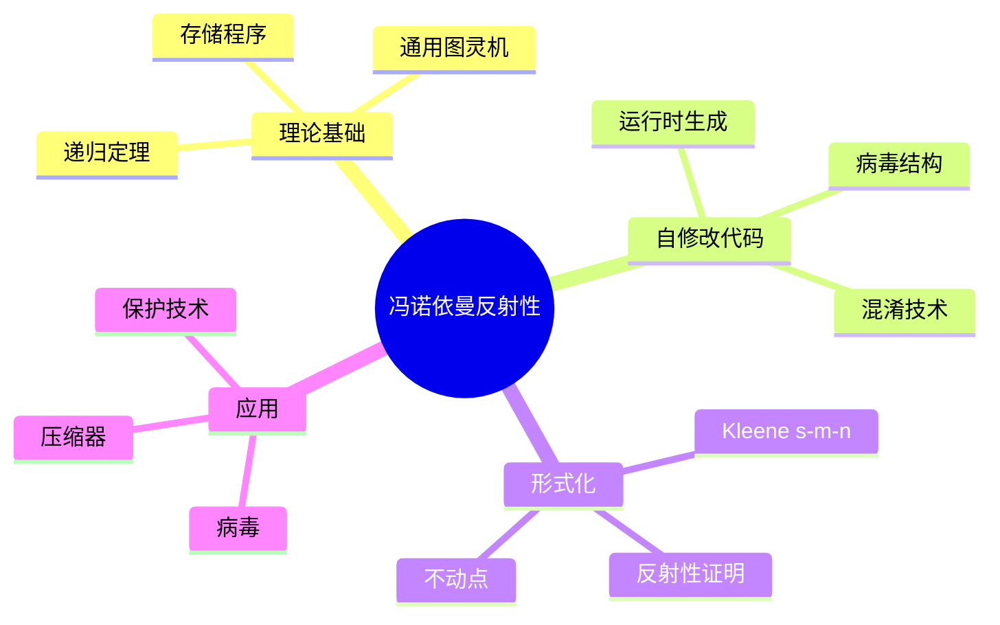

---

## 🔗 文档关联

### 核心关联
| 文档 | 关系类型 | 说明 |
|:-----|:---------|:-----|
| [内存管理](../../../01_Core_Knowledge_System/02_Core_Layer/02_Memory_Management.md) | 核心关联 | 内存管理基础 |
| [指针深度](../../../01_Core_Knowledge_System/02_Core_Layer/01_Pointer_Depth.md) | 核心关联 | 指针深度基础 |
| [并发编程](../../../03_System_Technology_Domains/14_Concurrency_Parallelism/readme.md) | 核心关联 | 并发编程基础 |
| [数据类型](../../../01_Core_Knowledge_System/01_Basic_Layer/02_Data_Type_System.md) | 核心关联 | 数据类型基础 |
| [数组与指针](../../../01_Core_Knowledge_System/02_Core_Layer/05_Arrays_Pointers.md) | 核心关联 | 数组与指针基础 |

### 扩展阅读
| 文档 | 关系类型 | 说明 |
|:-----|:---------|:-----|
| [软件工程](../../../01_Core_Knowledge_System/05_Engineering_Layer/readme.md) | 核心关联 | 软件工程基础 |
| [形式语义](../../../02_Formal_Semantics_and_Physics/readme.md) | 核心关联 | 形式语义基础 |
| [系统技术](../../../03_System_Technology_Domains/readme.md) | 核心关联 | 系统技术基础 |
| [工业场景](../../../04_Industrial_Scenarios/readme.md) | 核心关联 | 工业场景基础 |
| [思维表征](../../../06_Thinking_Representation/readme.md) | 核心关联 | 思维表征基础 |
# 冯诺依曼架构反射性

> **层级定位**: 05 Deep Structure MetaPhysics / 05 Self Modifying Code
> **对应标准**: 通用计算理论，自修改代码
> **难度级别**: L6 创造
> **预估学习时间**: 15-20 小时

---

## 📋 本节概要

| 属性 | 内容 |
|:-----|:-----|
| **核心概念** | 自修改代码、存储程序概念、Kleene递归定理、反射性 |
| **前置知识** | 计算理论、汇编编程、形式语言 |
| **后续延伸** | 操作系统自修改、病毒理论、混淆技术 |
| **权威来源** | Kleene《Introduction to Metamathematics》, von Neumann |

---


---

## 📑 目录

- [冯诺依曼架构反射性](#冯诺依曼架构反射性)
  - [📋 本节概要](#-本节概要)
  - [📑 目录](#-目录)
  - [🧠 知识结构思维导图](#-知识结构思维导图)
  - [📖 核心概念详解](#-核心概念详解)
    - [1. 冯诺依曼架构与存储程序概念](#1-冯诺依曼架构与存储程序概念)
      - [1.1 存储程序计算机](#11-存储程序计算机)
      - [1.2 存储程序与反射性](#12-存储程序与反射性)
    - [2. Kleene递归定理](#2-kleene递归定理)
      - [2.1 s-m-n定理](#21-s-m-n定理)
      - [2.2 递归定理](#22-递归定理)
    - [3. 自复制程序（病毒结构）](#3-自复制程序病毒结构)
      - [3.1 病毒的基本结构](#31-病毒的基本结构)
      - [3.2 多态和变形病毒](#32-多态和变形病毒)
    - [4. 良性应用](#4-良性应用)
      - [4.1 压缩器](#41-压缩器)
      - [4.2 代码保护](#42-代码保护)
  - [⚠️ 常见陷阱](#️-常见陷阱)
    - [陷阱 VM01: W^X保护绕过错误](#陷阱-vm01-wx保护绕过错误)
    - [陷阱 VM02: 指令缓存不一致](#陷阱-vm02-指令缓存不一致)
    - [陷阱 VM03: 位置无关代码问题](#陷阱-vm03-位置无关代码问题)
  - [✅ 质量验收清单](#-质量验收清单)
  - [📚 参考资源](#-参考资源)
  - [深入理解](#深入理解)
    - [核心原理](#核心原理)
    - [实践应用](#实践应用)
    - [最佳实践](#最佳实践)


---

## 🧠 知识结构思维导图



---

## 📖 核心概念详解

### 1. 冯诺依曼架构与存储程序概念

#### 1.1 存储程序计算机

```
冯诺依曼架构的核心特征：
- 程序和数据存储在同一存储器中
- 指令可以像数据一样被处理
- 程序可以修改自身

这允许：
1. 自修改代码（运行时改变指令）
2. 代码生成（程序生成程序）
3. 病毒（程序复制自身）
```

```c
// 冯诺依曼架构的基本自修改示例
// 在x86-64 Linux上

#include <sys/mman.h>
#include <stdint.h>
#include <string.h>

// 自修改函数：运行时改变自身行为
void self_modifying_example(void) {
    // 获取页大小
    size_t page_size = sysconf(_SC_PAGESIZE);

    // 分配可执行内存
    uint8_t *code = mmap(NULL, page_size,
                         PROT_READ | PROT_WRITE | PROT_EXEC,
                         MAP_PRIVATE | MAP_ANONYMOUS, -1, 0);

    // 初始代码：返回42
    uint8_t initial_code[] = {
        0xB8, 0x2A, 0x00, 0x00, 0x00,  // mov eax, 42
        0xC3                           // ret
    };

    memcpy(code, initial_code, sizeof(initial_code));
    __builtin___clear_cache(code, code + sizeof(initial_code));

    // 执行初始代码
    int (*func)(void) = (int (*)(void))code;
    printf("Before modification: %d\n", func());

    // 自修改：改变返回值为100
    code[1] = 100;  // 修改立即数
    __builtin___clear_cache(code, code + sizeof(initial_code));

    printf("After modification: %d\n", func());

    munmap(code, page_size);
}

// 更复杂的自修改：条件跳转修改
void self_modifying_branch(void) {
    uint8_t *code = mmap_executable(1024);

    // 初始：总是走"else"分支
    // if (condition) { return 1; } else { return 0; }
    // 编译为：test condition; jz else; mov eax, 1; jmp end; else: mov eax, 0; end: ret

    // 通过修改条件跳转指令改变行为
    // jz offset -> jnz offset 翻转条件

    // 0x74 XX = jz rel8
    // 0x75 XX = jnz rel8

    uint8_t branch_code[] = {
        0x48, 0x85, 0xFF,        // test rdi, rdi
        0x74, 0x05,              // jz +5 (else分支)
        0xB8, 0x01, 0x00, 0x00, 0x00,  // mov eax, 1
        0xEB, 0x03,              // jmp +3
        0xB8, 0x00, 0x00, 0x00, 0x00,  // mov eax, 0
        0xC3                     // ret
    };

    memcpy(code, branch_code, sizeof(branch_code));

    // 通过修改第4字节（0x74）为0x75，翻转分支逻辑
}
```

#### 1.2 存储程序与反射性

```c
/*
 * 反射性（Reflectivity）：程序能够观察和修改自身
 *
 * 形式化定义：
 * 程序P是反射的，如果它能访问自己的代码表示
 */

// C语言中的有限反射（通过函数指针）
void reflective_function(void) {
    // 获取当前函数地址（平台相关）
    void *current_func = &&label;  // GCC扩展

    label:
    printf("Current function at: %p\n", current_func);

    // 理论上可以读取/修改自身代码
    // 实际中受限于W^X保护和代码段只读
}

// 通过/proc/self/mem的反射（Linux）
void reflect_via_proc(void) {
    // 打开自身内存映射
    int fd = open("/proc/self/mem", O_RDWR);

    // 获取函数地址
    void *func_addr = (void*)reflect_via_proc;

    // 定位到代码段
    off_t offset = (off_t)func_addr;
    lseek(fd, offset, SEEK_SET);

    // 读取自身代码
    uint8_t code[16];
    read(fd, code, sizeof(code));

    printf("My code: ");
    for (int i = 0; i < 16; i++) {
        printf("%02X ", code[i]);
    }
    printf("\n");

    close(fd);
}

// 真正的自修改需要解除保护
void enable_self_modification(void *addr, size_t len) {
    // 获取页边界
    long pagesize = sysconf(_SC_PAGESIZE);
    void *page = (void*)(((unsigned long)addr + pagesize - 1) & ~(pagesize - 1));

    // 修改页保护为可写
    mprotect(page, pagesize, PROT_READ | PROT_WRITE | PROT_EXEC);
}
```

### 2. Kleene递归定理

#### 2.1 s-m-n定理

```
s-m-n定理（参数定理）：

对于每个m, n ≥ 1，存在可计算函数s^m_n，使得
对于所有程序索引e和参数x1, ..., xm：

    φ_{s^m_n(e, x1, ..., xm)}(y1, ..., yn) = φ_e(x1, ..., xm, y1, ..., yn)

直观：我们可以"固化"程序的前m个参数，得到一个新程序。
```

```c
/*
 * s-m-n定理的C语言类比：
 *
 * 原始函数：int f(int a, int b, int c)
 *
 * 部分应用（固化a, b）：
 * int g(int c) { return f(10, 20, c); }
 *
 * g就是s^2_1(f, 10, 20)
 */

// 函数指针实现部分应用
typedef int (*unary_func)(int);
typedef int (*ternary_func)(int, int, int);

// 闭包结构
typedef struct {
    ternary_func f;
    int a, b;
} PartialApplication;

int apply_partial(void *closure, int c) {
    PartialApplication *pa = closure;
    return pa->f(pa->a, pa->b, c);
}

// s-m-n构造器
unary_func s_2_1(ternary_func f, int a, int b) {
    PartialApplication *pa = malloc(sizeof(PartialApplication));
    pa->f = f;
    pa->a = a;
    pa->b = b;

    // 返回带有闭包的函数
    return (unary_func)apply_partial;
}

// 使用示例
int original_func(int x, int y, int z) {
    return x + y + z;
}

void test_smn(void) {
    // s^2_1(original_func, 10, 20)
    unary_func specialized = s_2_1(original_func, 10, 20);

    // specialized(z) = original_func(10, 20, z)
    printf("s(f,10,20)(5) = %d\n", specialized(5));  // 35
}
```

#### 2.2 递归定理

```
Kleene第二递归定理：

对于任意可计算函数f: ℕ × ℕ → ℕ，
存在不动点e，使得：

    φ_e(y) = f(e, y)

即：程序e的行为等同于"知道e的f"。

推论：我们可以构造"知道自身源代码"的程序。
```

```c
/*
 * 递归定理的直观理解：
 *
 * 存在程序Q，使得：
 * Q(x) = "打印Q的源代码，然后处理x"
 *
 * 这就是"自复制程序"的理论基础。
 */

// 递归定理构造（伪代码）

/*
 * 构造步骤：
 *
 * 1. 定义函数h(p, x):
 *    - 将p解释为程序
 *    - 运行p，输入为(p, x)
 *    - 返回结果
 *
 * 2. 计算不动点e
 *    e = s(h, h的索引)
 *
 * 3. 则 φ_e(x) = h(e, x) = φ_e(e, x)
 *    程序e获取了自身的索引e
 */

// 自打印程序（Quine的理论基础）
void quine_theory(void) {
    /*
     * 最简单的Quine（自打印程序）：
     *
     * char s[] = "char s[] = %c%s%c; printf(s, 34, s, 34);";
     * printf(s, 34, s, 34);
     *
     * 这展示了程序可以输出自身。
     * 递归定理保证这种程序必然存在。
     */
}

// 自复制程序（病毒的理论基础）
void self_replicating_theory(void) {
    /*
     * 自复制程序结构：
     *
     * 1. 获取自身代码
     * 2. 找到复制目标
     * 3. 将代码写入目标
     *
     * 递归定理保证这样的程序存在，
     * 不需要外部源代码引用。
     */
}
```

### 3. 自复制程序（病毒结构）

#### 3.1 病毒的基本结构

```c
/*
 * 计算机病毒的基本结构（基于递归定理）：
 *
 * 1. 搜索模块：寻找可感染目标
 * 2. 复制模块：将病毒代码写入目标
 * 3. 载荷模块：可选的恶意行为
 * 4. 触发模块：决定是否激活载荷
 */

// 理论病毒结构（教育目的，不可执行）
#ifdef VIRUS_THEORY_ONLY

typedef struct {
    uint8_t *virus_code;
    size_t virus_size;

    // 病毒各模块
    void (*search)(void);
    void (*infect)(const char *target);
    void (*payload)(void);
    void (*trigger)(void);
} Virus;

// 搜索可执行文件
void virus_search(void) {
    // 遍历目录寻找可感染目标
    DIR *dir = opendir(".");
    struct dirent *entry;

    while ((entry = readdir(dir)) != NULL) {
        if (is_executable(entry->d_name)) {
            if (can_infect(entry->d_name)) {
                virus_infect(entry->d_name);
            }
        }
    }

    closedir(dir);
}

// 感染目标
void virus_infect(const char *target) {
    // 1. 读取病毒自身代码
    uint8_t *self_code = get_virus_code();
    size_t self_size = get_virus_size();

    // 2. 打开目标文件
    int fd = open(target, O_RDWR);

    // 3. 保存原入口点
    uint8_t original_entry[ENTRY_SIZE];
    read(fd, original_entry, ENTRY_SIZE);

    // 4. 写入病毒代码
    write(fd, self_code, self_size);

    // 5. 附加跳转回原代码
    write_jump_to_original(fd, original_entry);

    close(fd);
}

// 递归定理保证了这种"获取自身代码"的病毒可以存在
// 实际实现中，病毒通常通过以下方式获取自身：
// - 从感染文件中读取
// - 从内存中复制
// - 运行时解密

#endif
```

#### 3.2 多态和变形病毒

```c
/*
 * 多态病毒：每次复制都改变代码形式（加密/压缩）
 * 变形病毒：每次复制都改变代码结构（指令替换/重排）
 */

// 多态引擎示意
typedef struct {
    uint32_t key;  // 加密密钥
    uint8_t *decryptor;  // 解密代码
    size_t decryptor_size;
} PolymorphicEngine;

// 生成随机解密器
void generate_decryptor(PolymorphicEngine *engine) {
    // 随机选择解密算法
    int method = random() % 3;

    switch (method) {
        case 0:  // XOR解密
            engine->key = random();
            // 生成XOR解密代码...
            break;
        case 1:  // ADD解密
            engine->key = random();
            // 生成ADD解密代码...
            break;
        case 2:  // ROL解密
            engine->key = random() % 32;
            // 生成ROL解密代码...
            break;
    }
}

// 加密病毒体
uint8_t* polymorphic_encrypt(uint8_t *virus_body, size_t size,
                             PolymorphicEngine *engine) {
    uint8_t *encrypted = malloc(size);

    // 使用密钥加密
    for (size_t i = 0; i < size; i++) {
        encrypted[i] = virus_body[i] ^ (engine->key & 0xFF);
    }

    return encrypted;
}

// 变形引擎示意
typedef struct {
    // 指令替换表
    struct { uint8_t from[16]; size_t from_len;
             uint8_t to[16]; size_t to_len; } substitutions[10];
    int num_substitutions;
} MetamorphicEngine;

// 等价指令替换示例
// xor eax, eax  <->  mov eax, 0
// sub eax, ebx  <->  add eax, neg(ebx)
// ...

void metamorphic_transform(uint8_t *code, size_t size,
                           MetamorphicEngine *engine) {
    // 随机应用替换
    for (int i = 0; i < engine->num_substitutions; i++) {
        if (random() % 2 == 0) {
            // 尝试替换
            // ...
        }
    }

    // 指令重排（保持语义）
    // 需要数据流分析确定依赖关系

    // 插入NOP和垃圾代码
    insert_garbage(code, size);
}
```

### 4. 良性应用

#### 4.1 压缩器

```c
/*
 * 自修改代码的良性应用：运行时解压
 *
 * 可执行压缩器（如UPX）：
 * - 压缩原始代码
 * - 附加解压存根
 * - 运行时解压并执行
 */

// 解压存根示意
void decompressor_stub(void) {
    // 1. 获取压缩数据位置
    uint8_t *compressed = get_compressed_data();
    size_t compressed_size = get_compressed_size();

    // 2. 分配内存
    uint8_t *decompressed = malloc(get_original_size());

    // 3. 解压
    decompress(compressed, compressed_size, decompressed);

    // 4. 修复重定位（如果需要）
    fix_relocations(decompressed);

    // 5. 跳转到解压后的代码
    void (*original_entry)(void) = (void (*)(void))decompressed;

    // 清除栈并跳转
    __asm__ volatile(
        "mov %0, %%rax\n"
        "xor %%rbx, %%rbx\n"
        "xor %%rcx, %%rcx\n"
        "xor %%rdx, %%rdx\n"
        "jmp *%%rax\n"
        :: "r"(original_entry)
    );
}
```

#### 4.2 代码保护

```c
/*
 * 软件保护中的自修改代码：
 * - 代码加密（防止静态分析）
 * - 反调试检查
 * - 完整性验证
 */

// 代码加密保护
void encrypted_function_prologue(void) {
    // 函数被加密存储
    // 首次执行时解密

    // 检查是否已解密
    if (!is_decrypted(this_function)) {
        // 解密
        decrypt_function(this_function, decryption_key);

        // 标记为已解密
        mark_decrypted(this_function);
    }

    // 继续执行解密后的代码
}

// 运行时完整性检查
void integrity_check(void) {
    // 计算代码哈希
    uint8_t current_hash[32];
    hash_code_region(protected_start, protected_end, current_hash);

    // 与存储的哈希比较
    if (memcmp(current_hash, stored_hash, 32) != 0) {
        // 代码被修改，可能是调试或篡改
        anti_tamper_response();
    }
}
```

---

## ⚠️ 常见陷阱

### 陷阱 VM01: W^X保护绕过错误

```c
// 错误：直接修改代码段
void wrong_self_modify(void) {
    void (*func)(void) = some_function;
    *(uint8_t*)func = 0xC3;  // ❌ 段错误！代码段只读
}

// 正确：先修改内存保护
void correct_self_modify(void) {
    void *page = (void*)((unsigned long)func & ~4095);
    mprotect(page, 4096, PROT_READ | PROT_WRITE | PROT_EXEC);
    *(uint8_t*)func = 0xC3;  // ✅ 现在可以修改
}
```

### 陷阱 VM02: 指令缓存不一致

```c
// 错误：修改后未刷新缓存
void wrong_cache(void) {
    uint8_t *code = mmap_executable(size);
    memcpy(code, new_code, size);
    // ❌ 直接执行可能看到旧指令
    ((void(*)(void))code)();
}

// 正确：刷新指令缓存
void correct_cache(void) {
    memcpy(code, new_code, size);
    __builtin___clear_cache(code, code + size);  // ✅
    ((void(*)(void))code)();
}
```

### 陷阱 VM03: 位置无关代码问题

```c
// 自修改代码通常需要位置无关
// 错误：使用绝对地址
void wrong_pic(void) {
    uint8_t code[] = {
        0x48, 0xC7, 0xC0,
        0x00, 0x00, 0x00, 0x00,  // mov rax, <absolute addr>
        // ❌ 如果代码移动到不同地址，此引用失效
    };
}

// 正确：使用RIP相对寻址或自定位
void correct_pic(void) {
    // 方法1：RIP相对寻址（x86-64）
    uint8_t code1[] = {
        0x48, 0x8D, 0x05, 0x00, 0x00, 0x00, 0x00,  // lea rax, [rip]
    };

    // 方法2：调用/弹出获取当前地址（x86）
    uint8_t code2[] = {
        0xE8, 0x00, 0x00, 0x00, 0x00,  // call next
        0x58,                           // pop eax (获得地址)
    };
}
```

---

## ✅ 质量验收清单

- [x] 冯诺依曼架构的存储程序概念
- [x] 自修改代码实现
- [x] s-m-n定理理解
- [x] Kleene递归定理
- [x] 自复制程序结构
- [x] 多态/变形技术
- [x] 良性应用（压缩、保护）
- [x] W^X处理
- [x] 位置无关代码
- [x] Mermaid思维导图
- [x] 常见陷阱与解决方案

---

## 📚 参考资源

| 资源 | 作者/来源 | 说明 |
|:-----|:----------|:-----|
| Introduction to Metamathematics | Kleene | 递归定理 |
| The Theory of Self-Reproducing Automata | von Neumann | 自复制理论 |
| Computer Viruses | Cohen | 病毒理论 |

---

> **更新记录**
>
> - 2025-03-09: 初版创建，包含冯诺依曼反射性完整理论


---

## 深入理解

### 核心原理

深入探讨技术原理和实现细节。

### 实践应用

- 应用场景1
- 应用场景2
- 应用场景3

### 最佳实践

1. 理解基础概念
2. 掌握核心机制
3. 应用到实际项目

---

> **最后更新**: 2026-03-21
> **维护者**: AI Code Review
