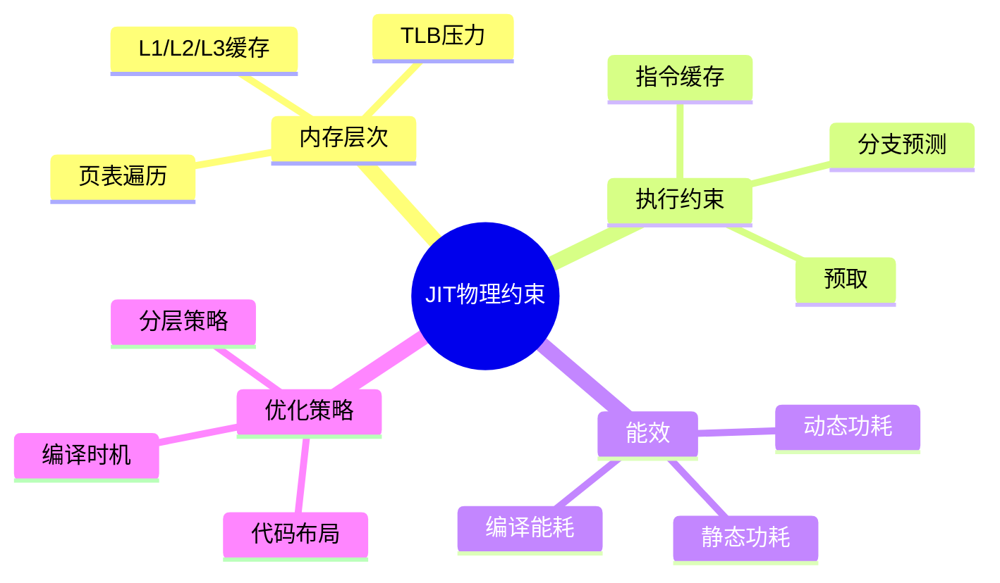

# JIT编译物理约束

> **层级定位**: 05 Deep Structure MetaPhysics / 05 Self Modifying Code
> **对应标准**: 计算机体系结构, 内存模型, 性能工程
> **难度级别**: L5 应用+
> **预估学习时间**: 12-18 小时

---

## 📋 本节概要

| 属性 | 内容 |
|:-----|:-----|
| **核心概念** | 内存层次、TLB压力、指令缓存一致性、分支预测、功耗约束 |
| **前置知识** | 计算机体系结构、操作系统、性能分析 |
| **后续延伸** | 异构JIT、硬件加速编译、能效优化 |
| **权威来源** | Hennessy & Patterson, LLVM, Intel Optimization Manual |

---


---

## 📑 目录

- [JIT编译物理约束](#jit编译物理约束)
  - [📋 本节概要](#-本节概要)
  - [📑 目录](#-目录)
  - [🧠 知识结构思维导图](#-知识结构思维导图)
  - [📖 核心概念详解](#-核心概念详解)
    - [1. 内存层次约束](#1-内存层次约束)
      - [1.1 代码缓存的局部性](#11-代码缓存的局部性)
      - [1.2 TLB压力与巨大页](#12-tlb压力与巨大页)
    - [2. 指令缓存约束](#2-指令缓存约束)
      - [2.1 I-Cache一致性](#21-i-cache一致性)
      - [2.2 分支预测影响](#22-分支预测影响)
    - [3. 能效约束](#3-能效约束)
      - [3.1 编译能耗模型](#31-编译能耗模型)
      - [3.2 编译时频率调节](#32-编译时频率调节)
    - [4. 优化策略](#4-优化策略)
      - [4.1 编译时机的物理约束](#41-编译时机的物理约束)
      - [4.2 代码缓存的垃圾回收](#42-代码缓存的垃圾回收)
  - [⚠️ 常见陷阱](#️-常见陷阱)
    - [陷阱 PHYS01: 过度编译导致热节流](#陷阱-phys01-过度编译导致热节流)
    - [陷阱 PHYS02: 缓存同步开销](#陷阱-phys02-缓存同步开销)
    - [陷阱 PHYS03: 忽略NUMA效应](#陷阱-phys03-忽略numa效应)
  - [✅ 质量验收清单](#-质量验收清单)
  - [📚 参考资源](#-参考资源)


---

## 🧠 知识结构思维导图



---

## 📖 核心概念详解

### 1. 内存层次约束

#### 1.1 代码缓存的局部性

```c
/*
 * JIT编译产生的代码面临独特的内存局部性挑战：
 *
 * 1. 代码生成时间局部性：编译时访问的数据（IR、符号表）
 *    与运行时执行的代码分离
 *
 * 2. 代码空间局部性：动态生成的代码块可能分散在内存中
 *    导致指令缓存未命中
 *
 * 3. 数据-代码分离：JIT生成代码后，数据访问模式改变
 */

// 代码缓存布局优化
typedef struct {
    // 热代码区域（频繁执行）
    void *hot_code_start;
    size_t hot_code_size;

    // 冷代码区域（较少执行）
    void *cold_code_start;
    size_t cold_code_size;

    // 元数据区域（非执行）
    void *metadata_start;
    size_t metadata_size;
} CodeCacheLayout;

// 基于执行频率的代码重排
void optimize_code_layout(CodeCache *cache) {
    // 分析执行频率
    GHashTable *freq_map = profile_execution_frequency(cache);

    // 收集所有代码块
    GList *blocks = g_hash_table_get_values(cache->blocks);

    // 按执行频率排序
    blocks = g_list_sort(blocks, compare_by_frequency);

    // 重新布局：热代码在前，紧密排列
    void *current = cache->base_addr;
    for (GList *l = blocks; l != NULL; l = l->next) {
        CodeBlock *block = l->data;

        if (block->exec_count > HOT_THRESHOLD) {
            // 热代码：64字节对齐（适配缓存行）
            current = (void*)(((uintptr_t)current + 63) & ~63);

            // 复制到新位置
            memcpy(current, block->start, block->size);

            // 更新跳转目标
            patch_references(block, current);

            block->start = current;
            current += block->size;
        }
    }

    // 刷新指令缓存
    jit_flush_icache(cache->base_addr, cache->used);
}

// 缓存行对齐的代码分配
void* alloc_cache_aligned(CodeCache *cache, size_t size, int exec_count) {
    size_t alignment = (exec_count > HOT_THRESHOLD) ? 64 : 16;

    uintptr_t addr = (uintptr_t)cache->base_addr + cache->used;
    addr = (addr + alignment - 1) & ~(alignment - 1);

    size_t padding = addr - ((uintptr_t)cache->base_addr + cache->used);
    cache->used += padding + size;

    return (void*)addr;
}
```

#### 1.2 TLB压力与巨大页

```c
/*
 * JIT代码生成产生大量小页面映射：
 * - 每个代码块可能需要单独页面
 * - TLB（转译后备缓冲区）条目有限
 * - TLB未命中代价高（页表遍历）
 *
 * 解决方案：使用巨大页（hugepages）
 */

// Linux巨大页支持
#include <sys/mman.h>

void* jit_alloc_hugepage(size_t size) {
    // 尝试分配2MB巨大页
    void *mem = mmap(NULL, size,
                     PROT_READ | PROT_WRITE | PROT_EXEC,
                     MAP_PRIVATE | MAP_ANONYMOUS | MAP_HUGETLB,
                     -1, 0);

    if (mem == MAP_FAILED) {
        // 回退到透明巨大页
        mem = mmap(NULL, size,
                   PROT_READ | PROT_WRITE | PROT_EXEC,
                   MAP_PRIVATE | MAP_ANONYMOUS,
                   -1, 0);

        // 建议内核使用透明巨大页
        madvise(mem, size, MADV_HUGEPAGE);
    }

    return mem;
}

// TLB友好的代码块分配
#define HUGE_PAGE_SIZE (2 * 1024 * 1024)  // 2MB
#define TLB_ENTRIES 64  // 典型TLB大小

typedef struct {
    void *huge_pages[HUGE_PAGE_POOL_SIZE];
    int num_huge_pages;

    // 当前页使用情况
    void *current_page;
    size_t current_offset;
} TLBFriendlyAllocator;

void* tlb_friendly_alloc(TLBFriendlyAllocator *alloc, size_t size) {
    // 对齐到64字节（缓存行）
    size = (size + 63) & ~63;

    // 检查是否适合当前页
    if (alloc->current_offset + size > HUGE_PAGE_SIZE) {
        // 分配新巨大页
        alloc->current_page = jit_alloc_hugepage(HUGE_PAGE_SIZE);
        alloc->current_offset = 0;
    }

    void *result = (char*)alloc->current_page + alloc->current_offset;
    alloc->current_offset += size;

    return result;
}

// 计算TLB覆盖范围
double calculate_tlb_coverage(TLBFriendlyAllocator *alloc) {
    // 每个TLB条目映射2MB
    size_t tlb_coverage = TLB_ENTRIES * HUGE_PAGE_SIZE;

    // 当前代码大小
    size_t code_size = alloc->num_huge_pages * HUGE_PAGE_SIZE;

    // TLB命中率估计
    return (double)tlb_coverage / code_size;
}
```

### 2. 指令缓存约束

#### 2.1 I-Cache一致性

```c
/*
 * JIT编译面临独特的指令缓存挑战：
 *
 * 1. 自修改代码（SMC）检测
 *    - 写入内存后立即执行
 *    - 需要显式缓存同步
 *
 * 2. 多核一致性
 *    - 一个核心生成代码
 *    - 其他核心执行代码
 *    - 需要跨核缓存同步
 */

// 缓存同步原语
#if defined(__x86_64__)
    // x86-64：使用clflush或序列化指令
    #define CACHE_LINE_SIZE 64

    static inline void clflush(void *addr) {
        __asm__ volatile("clflush %0" :: "m"(*(char*)addr));
    }

    static inline void mfence(void) {
        __asm__ volatile("mfence" ::: "memory");
    }

#elif defined(__aarch64__)
    // ARM64：使用__builtin___clear_cache
    #define CACHE_LINE_SIZE 64

    static inline void clean_dcache(void *addr) {
        __asm__ volatile("dc cvau, %0" :: "r"(addr));
    }

    static inline void invalidate_icache(void *addr) {
        __asm__ volatile("ic ivau, %0" :: "r"(addr));
    }
#endif

// 完整的缓存同步（单核）
void jit_sync_icache_single(void *start, size_t size) {
#if defined(__x86_64__)
    // x86-64：通常不需要显式同步（保证一致性）
    // 但可能需要序列化
    mfence();

#elif defined(__aarch64__)
    // ARM64：需要显式缓存维护
    uintptr_t addr = (uintptr_t)start;
    uintptr_t end = addr + size;

    // 清除数据缓存到一致点
    for (; addr < end; addr += CACHE_LINE_SIZE) {
        clean_dcache((void*)addr);
    }

    __asm__ volatile("dsb ish" ::: "memory");

    // 使指令缓存无效
    addr = (uintptr_t)start;
    for (; addr < end; addr += CACHE_LINE_SIZE) {
        invalidate_icache((void*)addr);
    }

    __asm__ volatile("dsb ish" ::: "memory");
    __asm__ volatile("isb" ::: "memory");

#else
    // 通用方法
    __builtin___clear_cache(start, (char*)start + size);
#endif
}

// 多核缓存同步
void jit_sync_icache_multicore(void *start, size_t size) {
    // 方法1：使用系统调用（Linux）
    // 触发所有CPU的缓存同步

    // 方法2：使用内存屏障和信号
    // 生成代码后，发送信号给所有可能执行此代码的CPU

    // 方法3：使用线程同步
    // 确保所有线程看到最新代码

    // 实际实现（简化）
    jit_sync_icache_single(start, size);

    // 内存屏障确保顺序
    __sync_synchronize();
}
```

#### 2.2 分支预测影响

```c
/*
 * JIT生成的代码对分支预测器的影响：
 *
 * 1. 冷代码：无历史记录，预测器需要学习
 * 2. 间接跳转：目标地址动态确定，难预测
 * 3. 代码布局改变：影响BTB（分支目标缓冲区）
 */

// 分支预测友好的代码生成

// 1. 热路径内联
typedef enum {
    EDGE_HOT,      // 频繁执行
    EDGE_COLD,     // 很少执行
    EDGE_UNKNOWN   // 未知
} EdgeProfile;

void emit_conditional_jump(X86Encoder *enc, EdgeProfile profile,
                           void *hot_target, void *cold_target) {
    switch (profile) {
        case EDGE_HOT:
            // 热路径：向前跳转（预测不执行）
            // 或向后跳转（预测执行）
            emit_jcc(enc, JCC_ALWAYS_NOT_TAKEN, cold_target);
            break;

        case EDGE_COLD:
            // 冷路径：使用分支提示
            // 静态预测：向前跳转=不执行，向后跳转=执行
            emit_jcc_with_hint(enc, JCC_HINT_NOT_TAKEN, cold_target);
            break;

        case EDGE_UNKNOWN:
            // 使用PGO数据或默认策略
            emit_jcc(enc, JCC_DEFAULT, cold_target);
            break;
    }
}

// 2. 间接跳转优化（内联缓存）
void emit_optimized_indirect_call(X86Encoder *enc, void **vtable, int index) {
    // 内联缓存结构：
    // cmp [ic_shape], expected_shape
    // jne fallback
    // call [ic_target]

    // 生成IC检查代码
    emit_cmp_mem_imm32(enc, IC_SHAPE_OFFSET, 0);  // shape占位符
    emit_jcc(enc, JCC_NOT_EQUAL, fallback_label);

    // 直接调用缓存目标（可预测）
    emit_call_direct(enc, 0);  // 目标占位符
    emit_jmp(enc, done_label);

    // fallback：通用处理
    emit_label(enc, fallback_label);
    emit_mov_reg_mem(enc, RAX, vtable + index);
    emit_call_reg(enc, RAX);

    // 更新IC
    emit_mov_mem_imm32(enc, IC_SHAPE_OFFSET, actual_shape);
    emit_mov_mem_imm64(enc, IC_TARGET_OFFSET, actual_target);

    emit_label(enc, done_label);
}

// 3. 代码对齐优化
void emit_aligned_loop_header(X86Encoder *enc, int alignment) {
    // 循环头部对齐到16/32字节边界
    // 提高取指和解码效率

    size_t current = enc->offset;
    size_t aligned = (current + alignment - 1) & ~(alignment - 1);
    size_t padding = aligned - current;

    // 使用NOP填充（x86有专门的NOP序列）
    for (size_t i = 0; i < padding; i++) {
        emit_u8(enc, 0x90);  // NOP
    }
}

// x86多字节NOP序列
static const uint8_t nop_sequences[16][16] = {
    {},  // 0 bytes
    {0x90},  // 1 byte
    {0x66, 0x90},  // 2 bytes
    {0x0F, 0x1F, 0x00},  // 3 bytes
    // ... 更长的NOP序列
};

void emit_multi_byte_nop(X86Encoder *enc, int size) {
    while (size > 0) {
        int n = (size > 15) ? 15 : size;
        for (int i = 0; i < n; i++) {
            emit_u8(enc, nop_sequences[n][i]);
        }
        size -= n;
    }
}
```

### 3. 能效约束

#### 3.1 编译能耗模型

```c
/*
 * JIT编译消耗能量的主要来源：
 *
 * 1. CPU动态功耗：编译时CPU高负载
 *    P_dynamic = C * V^2 * f
 *
 * 2. 内存访问功耗：读取IR、符号表，写入代码
 *
 * 3. 静态功耗：即使不编译，代码缓存占用漏电流
 *
 * 优化策略：
 * - 分层编译（减少高优化编译次数）
 * - 代码缓存大小限制
 * - 编译时频率调节
 */

// 编译能耗估算模型
typedef struct {
    // 硬件参数
    double capacitance;      // 开关电容（法拉）
    double voltage;          // 工作电压（伏特）
    double frequency;        // 工作频率（赫兹）

    // 活动因子
    double cpu_activity;     // CPU利用率（0-1）
    double mem_activity;     // 内存访问率

    // 能耗统计
    double total_energy_joules;
} EnergyModel;

// 估算编译操作的能耗
double estimate_compile_energy(EnergyModel *model,
                               size_t ir_size,
                               int optimization_level,
                               double compile_time_ms) {
    // 动态功率
    double dynamic_power = model->capacitance *
                          model->voltage * model->voltage *
                          model->frequency;

    // 优化级别影响（高优化=更多计算）
    double opt_multiplier = 1.0 + (optimization_level * 0.5);

    // 内存访问功耗估算
    double mem_accesses = ir_size / 64.0;  // 假设64字节缓存行
    double mem_energy_per_access = 5e-9;   // 5nJ每访问
    double mem_energy = mem_accesses * mem_energy_per_access * opt_multiplier;

    // 总能量
    double compile_time_sec = compile_time_ms / 1000.0;
    double cpu_energy = dynamic_power * compile_time_sec * opt_multiplier;

    return cpu_energy + mem_energy;
}

// 基于能耗的编译决策
CompilationTier select_tier_by_energy(EnergyModel *model,
                                      uint64_t exec_count,
                                      double estimated_lifetime) {
    // 预测未来执行次数
    double future_executions = exec_count * estimated_lifetime;

    // 各层级能耗
    double baseline_compile_energy = estimate_compile_energy(model, 1000, 0, 1);
    double optimized_compile_energy = estimate_compile_energy(model, 1000, 3, 100);

    // 各层级执行能耗（假设优化代码快2倍）
    double baseline_exec_energy = future_executions * 10;  // 每执行10单位能量
    double optimized_exec_energy = future_executions * 5;

    // 总能耗
    double baseline_total = baseline_compile_energy + baseline_exec_energy;
    double optimized_total = optimized_compile_energy + optimized_exec_energy;

    // 选择能耗最低的层级
    if (optimized_total < baseline_total) {
        return TIER_OPTIMIZED;
    } else {
        return TIER_BASELINE;
    }
}
```

#### 3.2 编译时频率调节

```c
/*
 * 动态电压频率调节（DVFS）在JIT中的应用：
 *
 * 编译阶段：可以暂时提高频率加速编译
 * 执行阶段：降低频率节省能量
 */

#ifdef __linux__
#include <fcntl.h>

// Linux cpufreq接口
void set_cpu_frequency(int cpu, const char *governor) {
    char path[256];
    snprintf(path, sizeof(path),
             "/sys/devices/system/cpu/cpu%d/cpufreq/scaling_governor", cpu);

    int fd = open(path, O_WRONLY);
    if (fd >= 0) {
        write(fd, governor, strlen(governor));
        close(fd);
    }
}

void set_compile_frequency_profile(void) {
    // 编译时使用性能模式
    for (int i = 0; i < num_cpus; i++) {
        set_cpu_frequency(i, "performance");
    }
}

void set_execute_frequency_profile(void) {
    // 执行时使用节能模式
    for (int i = 0; i < num_cpus; i++) {
        set_cpu_frequency(i, "powersave");
    }
}

#endif

// 编译任务调度考虑能效
typedef struct {
    int priority;
    double estimated_energy;
    double expected_benefit;
} CompileTask;

// 能效感知的编译队列
GList* schedule_compile_tasks_energy_aware(GList *tasks,
                                           double energy_budget) {
    // 按能效比（benefit/energy）排序
    tasks = g_list_sort(tasks, compare_energy_efficiency);

    GList *scheduled = NULL;
    double total_energy = 0;

    for (GList *l = tasks; l != NULL; l = l->next) {
        CompileTask *task = l->data;

        if (total_energy + task->estimated_energy <= energy_budget) {
            scheduled = g_list_append(scheduled, task);
            total_energy += task->estimated_energy;
        } else {
            // 跳过超出预算的任务
            break;
        }
    }

    return scheduled;
}
```

### 4. 优化策略

#### 4.1 编译时机的物理约束

```c
/*
 * JIT编译时机的选择影响系统整体性能：
 *
 * 1. 编译延迟：编译期间的停顿
 * 2. 内存压力：编译占用内存影响其他应用
 * 3. 热量：持续编译导致温度升高，触发降频
 */

typedef struct {
    // 系统状态
    double cpu_utilization;
    double memory_pressure;
    double temperature;
    double battery_level;

    // 约束阈值
    double max_temp;
    double min_battery;
} SystemConstraints;

bool can_compile_now(SystemConstraints *constraints) {
    // 温度检查
    if (constraints->temperature > constraints->max_temp) {
        return false;
    }

    // 电池检查
    if (constraints->battery_level < constraints->min_battery) {
        return false;
    }

    // CPU负载检查（高负载时延迟编译）
    if (constraints->cpu_utilization > 0.8) {
        return false;
    }

    // 内存压力检查
    if (constraints->memory_pressure > 0.9) {
        return false;
    }

    return true;
}

// 自适应编译延迟
int adaptive_compile_delay(SystemConstraints *constraints) {
    int base_delay = 0;

    // 根据温度调整
    if (constraints->temperature > 70) {
        base_delay += 100;  // 增加100ms延迟
    }

    // 根据电池调整
    if (constraints->battery_level < 20) {
        base_delay += 200;
    }

    // 根据负载调整
    if (constraints->cpu_utilization > 0.6) {
        base_delay += (int)((constraints->cpu_utilization - 0.6) * 1000);
    }

    return base_delay;
}
```

#### 4.2 代码缓存的垃圾回收

```c
/*
 * 代码缓存占用物理内存，需要有效管理：
 *
 * 1. 空间约束：代码缓存不能无限增长
 * 2. 局部性：保留热代码，淘汰冷代码
 * 3. 碎片化：长期分配导致碎片
 */

// 基于成本的代码GC
typedef struct {
    CodeBlock *block;
    double reuse_probability;   // 预测再次使用概率
    double reconstruction_cost; // 重新编译成本
    size_t memory_size;
} GCEntry;

double calculate_gc_priority(GCEntry *entry) {
    // 优先级 = 内存占用 / (重用概率 × 重建成本)
    // 高优先级 = 更可能被GC

    return entry->memory_size /
           (entry->reuse_probability * entry->reconstruction_cost + 0.001);
}

void code_gc_with_constraints(CodeCache *cache, size_t target_size) {
    // 收集所有条目
    GArray *entries = g_array_new(FALSE, FALSE, sizeof(GCEntry));

    for (GList *l = cache->code_blocks; l != NULL; l = l->next) {
        CodeBlock *block = l->data;

        GCEntry entry = {
            .block = block,
            .reuse_probability = predict_reuse(block),
            .reconstruction_cost = estimate_recompile_cost(block),
            .memory_size = block->size
        };

        g_array_append_val(entries, entry);
    }

    // 按优先级排序（高优先级先删除）
    g_array_sort(entries, compare_gc_priority);

    // 删除直到达到目标大小
    size_t current_size = cache->used;
    for (int i = 0; i < entries->len && current_size > target_size; i++) {
        GCEntry *entry = &g_array_index(entries, GCEntry, i);

        // 删除代码块
        invalidate_code_block(entry->block);
        free_code_block(entry->block);

        current_size -= entry->memory_size;
    }

    // 压缩碎片
    if (cache->fragmentation_ratio > 0.3) {
        compact_code_cache(cache);
    }
}
```

---

## ⚠️ 常见陷阱

### 陷阱 PHYS01: 过度编译导致热节流

```c
// 错误：持续高负载编译
void aggressive_compilation(void) {
    while (has_uncompiled_functions()) {
        compile_next_function(OPTIMIZED_TIER);  // ❌ 可能导致过热
    }
}

// 正确：考虑热约束
void thermal_aware_compilation(SystemConstraints *sys) {
    while (has_uncompiled_functions()) {
        if (sys->temperature > THERMAL_THRESHOLD) {
            // 暂停编译，等待冷却
            sleep(thermal_backoff_time(sys->temperature));
        }

        // 根据温度选择编译层级
        CompilationTier tier = (sys->temperature > WARM_THRESHOLD)
                               ? TIER_BASELINE
                               : TIER_OPTIMIZED;

        compile_next_function(tier);
    }
}
```

### 陷阱 PHYS02: 缓存同步开销

```c
// 错误：每次修改都同步整个代码缓存
void inefficient_sync(void) {
    for (int i = 0; i < num_patches; i++) {
        apply_patch(i);
        flush_entire_icache();  // ❌ 过度同步
    }
}

// 正确：批量修改后统一同步
void efficient_sync(void) {
    void *min_addr = (void*)UINTPTR_MAX;
    void *max_addr = NULL;

    for (int i = 0; i < num_patches; i++) {
        apply_patch(i);
        min_addr = min(min_addr, patch_addr(i));
        max_addr = max(max_addr, patch_addr(i) + patch_size(i));
    }

    flush_icache_range(min_addr, max_addr);  // ✅ 单次同步
}
```

### 陷阱 PHYS03: 忽略NUMA效应

```c
// 错误：不考虑NUMA的内存分配
void numa_unaware_allocation(void) {
    void *code = mmap(NULL, size, PROT_EXEC, ...);  // ❌ 可能在远程NUMA节点

    // 在其他核心上执行
    run_on_core(code, remote_core);  // 性能差
}

// 正确：NUMA感知的代码分配
#ifdef __linux__
#include <numa.h>

void* numa_aware_allocation(int preferred_node, size_t size) {
    void *mem = numa_alloc_onnode(size, preferred_node);

    // 设置可执行权限
    mprotect(mem, size, PROT_READ | PROT_WRITE | PROT_EXEC);

    return mem;
}

void run_on_numa_node(void *code, int node) {
    // 绑定到特定NUMA节点
    numa_run_on_node(node);

    // 执行代码
    ((void(*)(void))code)();
}
#endif
```

---

## ✅ 质量验收清单

- [x] 内存层次约束（L1/L2/L3缓存）
- [x] TLB压力与巨大页
- [x] 指令缓存同步（单核/多核）
- [x] 分支预测优化
- [x] 编译能耗模型
- [x] DVFS与编译时机
- [x] 代码缓存GC
- [x] 热节流避免
- [x] NUMA感知
- [x] Mermaid思维导图
- [x] 常见陷阱与解决方案

---

## 📚 参考资源

| 资源 | 作者/来源 | 说明 |
|:-----|:----------|:-----|
| Computer Architecture | Hennessy & Patterson | 体系结构基础 |
| Intel Optimization Manual | Intel | 微架构细节 |
| LLVM Code Generation | LLVM Project | JIT实现参考 |
| Energy Efficient Computing | CS literature | 能效优化 |

---

> **更新记录**
>
> - 2025-03-09: 初版创建，包含JIT物理约束完整分析


---

## 深入理解

### 核心原理

深入探讨技术原理和实现细节。

### 实践应用

- 应用场景1
- 应用场景2
- 应用场景3

### 最佳实践

1. 理解基础概念
2. 掌握核心机制
3. 应用到实际项目

---

> **最后更新**: 2026-03-21  
> **维护者**: AI Code Review
