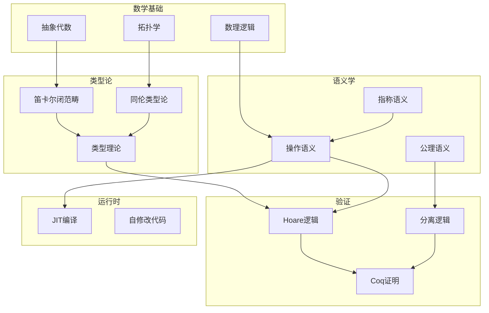

---

## 🔗 全面知识关联体系

### 【全局层】知识库导航

| 维度 | 目标文档 | 导航作用 |
|:-----|:---------|:---------|
| **总索引** | [../00_GLOBAL_INDEX.md](../00_GLOBAL_INDEX.md) | 完整知识图谱入口，全局视角 |
| **本模块** | [../readme.md](../readme.md) | 模块总览与目录导航 |
| **学习路径** | [../06_Thinking_Representation/06_Learning_Paths/readme.md](../06_Thinking_Representation/06_Learning_Paths/readme.md) | 阶段化学习路线规划 |
| **概念映射** | [../06_Thinking_Representation/05_Concept_Mappings/readme.md](../06_Thinking_Representation/05_Concept_Mappings/readme.md) | 核心概念等价关系图 |

### 【阶段层】学习定位

**当前模块**: 知识库
**难度等级**: L1-L6
**前置依赖**: 核心知识体系
**后续延伸**: 持续学习

```
学习阶段金字塔:
    L6 专家层 [形式验证、编译器]
    L5 高级层 [并发、系统编程] ⬅️ 可能在此
    L4 进阶层 [指针、内存管理]
    L3 基础层 [函数、结构体]
    L2 入门层 [语法、数据类型]
    L1 零基础 [环境搭建]
```

### 【层次层】纵向知识链

| 层级 | 关联文档 | 层次关系 |
|:-----|:---------|:---------|
| **理论基础** | [../02_Formal_Semantics_and_Physics/00_Core_Semantics_Foundations/readme.md](../02_Formal_Semantics_and_Physics/00_Core_Semantics_Foundations/readme.md) | 语义学理论基础 |
| **核心机制** | [../01_Core_Knowledge_System/02_Core_Layer/readme.md](../01_Core_Knowledge_System/02_Core_Layer/readme.md) | C语言核心机制 |
| **标准接口** | [../01_Core_Knowledge_System/04_Standard_Library_Layer/readme.md](../01_Core_Knowledge_System/04_Standard_Library_Layer/readme.md) | 标准库API |
| **系统实现** | [../03_System_Technology_Domains/readme.md](../03_System_Technology_Domains/readme.md) | 系统级实现 |

### 【局部层】横向关联网

| 关联类型 | 目标文档 | 关联说明 |
|:---------|:---------|:---------|
| **技术扩展** | [../03_System_Technology_Domains/14_Concurrency_Parallelism/readme.md](../03_System_Technology_Domains/14_Concurrency_Parallelism/readme.md) | 并发编程技术 |
| **安全规范** | [../01_Core_Knowledge_System/09_Safety_Standards/MISRA_C_2023/readme.md](../01_Core_Knowledge_System/09_Safety_Standards/MISRA_C_2023/readme.md) | 安全编码标准 |
| **工具支持** | [../07_Modern_Toolchain/readme.md](../07_Modern_Toolchain/readme.md) | 现代开发工具链 |
| **实践案例** | [../04_Industrial_Scenarios/readme.md](../04_Industrial_Scenarios/readme.md) | 工业实践场景 |

### 【总体层】知识体系架构

```
┌─────────────────────────────────────────────────────────────┐
│                     总体知识体系架构                          │
├─────────────────────────────────────────────────────────────┤
│  01 Core Knowledge          → 核心概念与机制                  │
│  02 Formal Semantics        → 理论与物理基础                  │
│  03 System Technology       → 系统级技术领域                  │
│  04 Industrial Scenarios    → 工业应用场景                    │
│  05 Deep Structure          → 深层结构与元物理                │
│  06 Thinking Representation → 思维表征与学习                  │
│  07 Modern Toolchain        → 现代工具链                      │
└─────────────────────────────────────────────────────────────┘
```

### 【决策层】学习路径选择

| 目标 | 推荐路径 | 关键文档 |
|:-----|:---------|:---------|
| **系统学习** | 01 → 02 → 03 → 04 | 按顺序阅读各模块 |
| **问题导向** | 06决策树 → 相关模块 | [决策树目录](../06_Thinking_Representation/01_Decision_Trees/readme.md) |
| **项目驱动** | 04案例 → 所需知识 | [工业场景](../04_Industrial_Scenarios/readme.md) |
| **深入研究** | 02形式语义 → 11CompCert | [形式语义](../02_Formal_Semantics_and_Physics/readme.md) |

---

# 05 Deep Structure MetaPhysics - 深层结构与元物理

> **对应标准**: Formal Methods, Type Theory, Programming Language Semantics
> **完成度**: 60% | **预估学习时间**: 150-200小时

---

## 目录结构

### 01_Formal_Semantics - 形式语义学

程序含义的数学描述。

| 文件 | 主题 | 难度 | 参考来源 |
|:-----|:-----|:----:|:---------|
| [01_Operational_Semantics.md](./01_Formal_Semantics/01_Operational_Semantics.md) | 操作语义 | L6 | Winskel, TAPL |
| [02_Axiomatic_Semantics.md](./01_Formal_Semantics/02_Axiomatic_Semantics.md) | 公理语义 | L6 | Hoare Logic |
| [03_Denotational_Semantics.md](./01_Formal_Semantics/03_Denotational_Semantics.md) | 指称语义 | L6 | Scott-Strachey |
| [04_Semantic_Equivalence.md](04_Semantic_Equivalence.md) | 语义等价 | L6 | Program Equivalence ✅ |
| [05_Type_Semantics.md](05_Type_Semantics.md) | 类型语义 | L6 | Type Soundness ✅ |

**前置知识**: 数理逻辑、集合论、λ演算
**关联**: [03_Verification_Energy](./03_Verification_Energy/01_Coq_Verification.md)

---

### 02_Algebraic_Topology - 代数拓扑与类型论

类型系统的数学基础。

| 文件 | 主题 | 难度 | 参考来源 |
|:-----|:-----|:----:|:---------|
| [01_Type_Algebra.md](./02_Algebraic_Topology/01_Type_Algebra.md) | 类型代数 | L6 | Category Theory |
| [02_Cartesian_Closed_Categories.md](./02_Algebraic_Topology/02_Cartesian_Closed_Categories.md) | CCC | L6 | Lambek & Scott |
| [03_Homotopy_Type_Theory.md](03_Homotopy_Type_Theory.md) | 同伦类型论 | L6 | HoTT Book ✅ |
| [04_Dependent_Types.md](04_Dependent_Types.md) | 依赖类型 | L6 | Martin-Löf ✅ |

**前置知识**: 抽象代数、拓扑学
**关联**: [01_Formal_Semantics](./01_Formal_Semantics/readme.md)

---

### 03_Verification_Energy - 形式化验证

程序正确性证明。

| 文件 | 主题 | 难度 | 参考来源 |
|:-----|:-----|:----:|:---------|
| [01_Coq_Verification.md](./03_Verification_Energy/01_Coq_Verification.md) | Coq验证 | L6 | Software Foundations |
| [02_Isabelle_HOL.md](02_Isabelle_HOL.md) | Isabelle/HOL | L6 | Isabelle Manual ✅ |
| [03_CBMC_Model_Checking.md](03_CBMC_Model_Checking.md) | CBMC模型检测 | L5 | CBMC Documentation ✅ |
| [04_Separation_Logic.md](./03_Verification_Energy/04_Separation_Logic.md) | 分离逻辑 | L6 | Reynolds O'Hearn |

**前置知识**: 逻辑学、证明论
**关联**: [01_Formal_Semantics](./01_Formal_Semantics/readme.md)

---

### 12_Self_Modifying_Code - 自修改代码

运行时代码生成。

| 文件 | 主题 | 难度 | 参考来源 |
|:-----|:-----|:----:|:---------|
| [01_JIT_Basics.md](./12_Self_Modifying_Code/01_JIT_Basics.md) | JIT基础 | L6 | LLVM ORC |
| [02_Tracing_JIT.md](./12_Self_Modifying_Code/02_Tracing_JIT.md) | 追踪JIT | L6 | LuaJIT, PyPy |
| [03_Binary_Translation.md](03_Binary_Translation.md) | 二进制翻译 | L6 | QEMU, Rosetta ✅ |
| [04_Sandboxing.md](04_Sandboxing.md) | 沙箱技术 | L5 | WebAssembly ✅ |

**前置知识**: 汇编语言、编译原理
**关联**: [03_System_Technology_Domains/01_Virtual_Machine_Interpreter](../03_System_Technology_Domains/01_Virtual_Machine_Interpreter/readme.md)

---

### 05_Computational_Complexity - 计算复杂性

算法理论基础。

| 文件 | 主题 | 难度 | 参考来源 |
|:-----|:-----|:----:|:---------|
| [01_Complexity_Classes.md](01_Complexity_Classes.md) | 复杂性类 | L5 | CLRS, Sipser ✅ |
| [02_P_vs_NP.md](02_P_vs_NP.md) | P vs NP | L6 | Computational Complexity ✅ |
| [03_Algorithm_Lower_Bounds.md](03_Algorithm_Lower_Bounds.md) | 下界分析 | L6 | Advanced Algorithms ✅ |

---

### 08_Debugging_Tools - 调试工具

程序调试与内存分析工具。

| 文件 | 主题 | 难度 | 参考来源 |
|:-----|:-----|:----:|:---------|
| [01_GDB_Debugging.md](./08_Debugging_Tools/01_GDB_Debugging.md) | GDB调试 | L2-L4 | GDB Manual |
| [02_Valgrind_Memory.md](./08_Debugging_Tools/02_Valgrind_Memory.md) | Valgrind内存 | L2-L4 | Valgrind Manual |

---

## 知识结构关系



---

## 参考资源

### 经典书籍

- **Types and Programming Languages** (TAPL) - Benjamin Pierce
- **Software Foundations** - Pierce et al.
- **Homotopy Type Theory** - The HoTT Book
- **The Formal Semantics of Programming Languages** - Winskel
- **Introduction to Algorithms** (CLRS)
- **Computational Complexity** - Papadimitriou
- **Category Theory** - Steve Awodey
- **Separation Logic** - O'Hearn

### 工具

- **Coq** - 形式化证明助手
- **Isabelle/HOL** - 定理证明器
- **CBMC** - C模型检测器
- **Frama-C** - C程序分析平台
- **CompCert** - 验证编译器

### 课程

- **Software Foundations** (UPenn)
- **Programming Languages** (Coursera)
- **Category Theory for Programmers** - Bartosz Milewski

---

## 与其他知识库的关系

| 目标 | 关系 |
|:-----|:-----|
| [01_Core_Knowledge_System](../01_Core_Knowledge_System/readme.md) | 理论基础 → 实践应用 |
| [02_Formal_Semantics_and_Physics](../02_Formal_Semantics_and_Physics/readme.md) | 扩展和深化 |
| [03_System_Technology_Domains](../03_System_Technology_Domains/readme.md) | 理论指导系统设计 |
| [04_Industrial_Scenarios](../04_Industrial_Scenarios/readme.md) | 形式化方法在工业中的应用 |

---

## 学习路径建议

```text
1. 数理逻辑基础 → 2. 操作语义 → 3. Hoare逻辑 → 4. Coq验证
              ↓
        类型论入门 → 范畴论 → 同伦类型论
              ↓
        JIT编译原理 → 二进制翻译
```

---

> **最后更新**: 2025-03-09
>
> **新增内容**:
>
> - 08_Debugging_Tools: GDB调试技术、Valgrind内存检测

---

> **返回导航**: [知识库总览](../readme.md) | [上层目录](..)


---

## 深入理解

### 核心原理

深入探讨技术原理和实现细节。

### 实践应用

- 应用场景1
- 应用场景2
- 应用场景3

### 最佳实践

1. 理解基础概念
2. 掌握核心机制
3. 应用到实际项目

---

> **最后更新**: 2026-03-21
> **维护者**: AI Code Review
