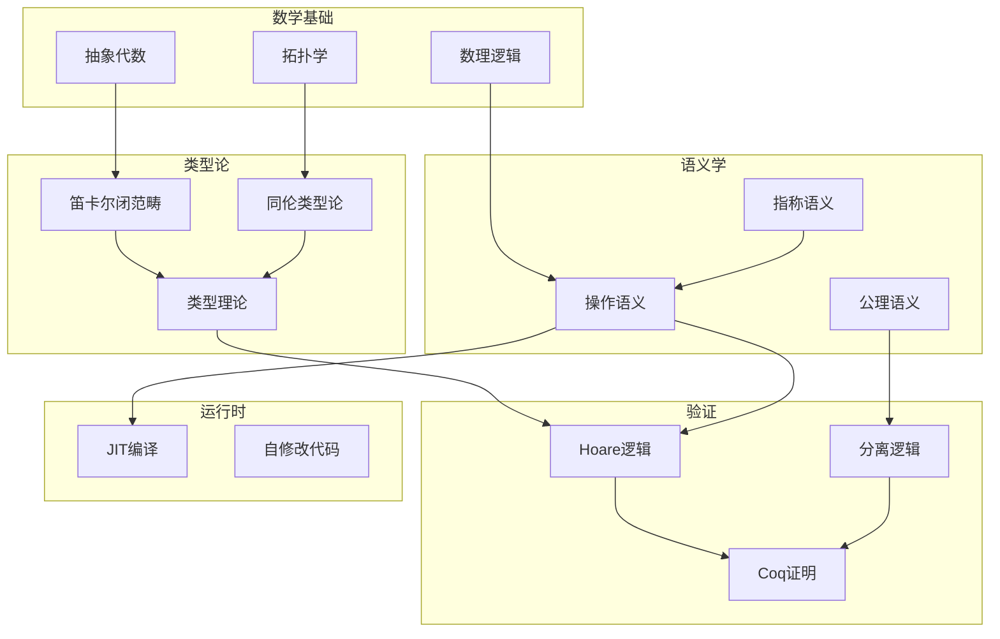

# 05 Deep Structure MetaPhysics - 深层结构与元物理

> **对应标准**: Formal Methods, Type Theory, Programming Language Semantics
> **完成度**: 60% | **预估学习时间**: 150-200小时

---

## 目录结构

### 01_Formal_Semantics - 形式语义学

程序含义的数学描述。

| 文件 | 主题 | 难度 | 参考来源 |
|:-----|:-----|:----:|:---------|
| [01_Operational_Semantics.md](./01_Formal_Semantics/01_Operational_Semantics.md) | 操作语义 | L6 | Winskel, TAPL |
| [02_Axiomatic_Semantics.md](./01_Formal_Semantics/02_Axiomatic_Semantics.md) | 公理语义 | L6 | Hoare Logic |
| [03_Denotational_Semantics.md](./01_Formal_Semantics/03_Denotational_Semantics.md) | 指称语义 | L6 | Scott-Strachey |
| ~~04_Semantic_Equivalence.md~~ | 语义等价 | L6 | Program Equivalence (计划中) |
| ~~05_Type_Semantics.md~~ | 类型语义 | L6 | Type Soundness (计划中) |

**前置知识**: 数理逻辑、集合论、λ演算
**关联**: [03_Verification_Energy](./03_Verification_Energy/01_Coq_Verification.md)

---

### 02_Algebraic_Topology - 代数拓扑与类型论

类型系统的数学基础。

| 文件 | 主题 | 难度 | 参考来源 |
|:-----|:-----|:----:|:---------|
| [01_Type_Algebra.md](./02_Algebraic_Topology/01_Type_Algebra.md) | 类型代数 | L6 | Category Theory |
| [02_Cartesian_Closed_Categories.md](./02_Algebraic_Topology/02_Cartesian_Closed_Categories.md) | CCC | L6 | Lambek & Scott |
| ~~03_Homotopy_Type_Theory.md~~ | 同伦类型论 | L6 | HoTT Book (计划中) |
| ~~04_Dependent_Types.md~~ | 依赖类型 | L6 | Martin-Löf (计划中) |

**前置知识**: 抽象代数、拓扑学
**关联**: [01_Formal_Semantics](./01_Formal_Semantics/README.md)

---

### 03_Verification_Energy - 形式化验证

程序正确性证明。

| 文件 | 主题 | 难度 | 参考来源 |
|:-----|:-----|:----:|:---------|
| [01_Coq_Verification.md](./03_Verification_Energy/01_Coq_Verification.md) | Coq验证 | L6 | Software Foundations |
| ~~02_Isabelle_HOL.md~~ | Isabelle/HOL | L6 | Isabelle Manual (计划中) |
| ~~03_CBMC_Model_Checking.md~~ | CBMC模型检测 | L5 | CBMC Documentation (计划中) |
| [04_Separation_Logic.md](./03_Verification_Energy/04_Separation_Logic.md) | 分离逻辑 | L6 | Reynolds O'Hearn |

**前置知识**: 逻辑学、证明论
**关联**: [01_Formal_Semantics](./01_Formal_Semantics/README.md)

---

### 04_Self_Modifying_Code - 自修改代码

运行时代码生成。

| 文件 | 主题 | 难度 | 参考来源 |
|:-----|:-----|:----:|:---------|
| [01_JIT_Basics.md](./04_Self_Modifying_Code/01_JIT_Basics.md) | JIT基础 | L6 | LLVM ORC |
| [02_Tracing_JIT.md](./04_Self_Modifying_Code/02_Tracing_JIT.md) | 追踪JIT | L6 | LuaJIT, PyPy |
| ~~03_Binary_Translation.md~~ | 二进制翻译 | L6 | QEMU, Rosetta (计划中) |
| ~~04_Sandboxing.md~~ | 沙箱技术 | L5 | WebAssembly (计划中) |

**前置知识**: 汇编语言、编译原理
**关联**: [03_System_Technology_Domains/01_Virtual_Machine_Interpreter](../03_System_Technology_Domains/01_Virtual_Machine_Interpreter/README.md)

---

### 05_Computational_Complexity - 计算复杂性

算法理论基础。

| 文件 | 主题 | 难度 | 参考来源 |
|:-----|:-----|:----:|:---------|
| ~~01_Complexity_Classes.md~~ | 复杂性类 | L5 | CLRS, Sipser (计划中) |
| ~~02_P_vs_NP.md~~ | P vs NP | L6 | Computational Complexity (计划中) |
| ~~03_Algorithm_Lower_Bounds.md~~ | 下界分析 | L6 | Advanced Algorithms (计划中) |

---

### 08_Debugging_Tools - 调试工具

程序调试与内存分析工具。

| 文件 | 主题 | 难度 | 参考来源 |
|:-----|:-----|:----:|:---------|
| [01_GDB_Debugging.md](./08_Debugging_Tools/01_GDB_Debugging.md) | GDB调试 | L2-L4 | GDB Manual |
| [02_Valgrind_Memory.md](./08_Debugging_Tools/02_Valgrind_Memory.md) | Valgrind内存 | L2-L4 | Valgrind Manual |

---

## 知识结构关系



---

## 参考资源

### 经典书籍

- **Types and Programming Languages** (TAPL) - Benjamin Pierce
- **Software Foundations** - Pierce et al.
- **Homotopy Type Theory** - The HoTT Book
- **The Formal Semantics of Programming Languages** - Winskel
- **Introduction to Algorithms** (CLRS)
- **Computational Complexity** - Papadimitriou
- **Category Theory** - Steve Awodey
- **Separation Logic** - O'Hearn

### 工具

- **Coq** - 形式化证明助手
- **Isabelle/HOL** - 定理证明器
- **CBMC** - C模型检测器
- **Frama-C** - C程序分析平台
- **CompCert** - 验证编译器

### 课程

- **Software Foundations** (UPenn)
- **Programming Languages** (Coursera)
- **Category Theory for Programmers** - Bartosz Milewski

---

## 与其他知识库的关系

| 目标 | 关系 |
|:-----|:-----|
| [01_Core_Knowledge_System](../01_Core_Knowledge_System/README.md) | 理论基础 → 实践应用 |
| [02_Formal_Semantics_and_Physics](../02_Formal_Semantics_and_Physics/README.md) | 扩展和深化 |
| [03_System_Technology_Domains](../03_System_Technology_Domains/README.md) | 理论指导系统设计 |
| [04_Industrial_Scenarios](../04_Industrial_Scenarios/README.md) | 形式化方法在工业中的应用 |

---

## 学习路径建议

```
1. 数理逻辑基础 → 2. 操作语义 → 3. Hoare逻辑 → 4. Coq验证
              ↓
        类型论入门 → 范畴论 → 同伦类型论
              ↓
        JIT编译原理 → 二进制翻译
```

---

> **最后更新**: 2025-03-09
>
> **新增内容**:
>
> - 08_Debugging_Tools: GDB调试技术、Valgrind内存检测
