# 并发模型决策树

## 概述

本决策树帮助开发者在C语言中选择合适的并发模型和同步机制，确保多线程程序的正确性和性能。

## 并发模型决策树

```mermaid
flowchart TD
    %% 根节点
    ROOT[需要并发处理]:::root

    %% ============ 第一层：线程 vs 进程决策 ============
    ROOT --> CONCURRENCY_MODEL{选择并发模型}:::decision

    CONCURRENCY_MODEL -->|共享大量数据| THREAD_MODEL[线程模型<br/>pthread]:::category
    CONCURRENCY_MODEL -->|独立任务| PROCESS_MODEL[进程模型<br/>fork/exec]:::category
    CONCURRENCY_MODEL -->|混合模式| HYBRID_MODEL[混合模型<br/>进程池+线程池]:::category

    %% 线程模型分支
    THREAD_MODEL --> THREAD_REASON{为什么<br/>选线程?}:::decision
    THREAD_REASON -->|共享地址空间| SHARE_MEM[共享内存<br/>访问简单快速]:::success
    THREAD_REASON -->|轻量级| LIGHT_WEIGHT[创建销毁快<br/>上下文切换快]:::success
    THREAD_REASON -->|通信简单| COMM_SIMPLE[直接访问<br/>全局变量]:::result

    THREAD_MODEL --> THREAD_RISK{风险评估}:::decision
    THREAD_RISK -->|数据竞争| RACE_CONDITION[<span style='color:red'>⚠️ 需要同步</span><br/>保护共享数据]:::warning
    THREAD_RISK -->|死锁风险| DEADLOCK_WARN[<span style='color:orange'>⚠️ 锁顺序</span><br/>需要设计避免]:::warning
    THREAD_RISK -->|调试困难| DEBUG_HARD[<span style='color:orange'>⚠️ Heisenbug</span><br/>难以复现]:::warning

    %% 进程模型分支
    PROCESS_MODEL --> PROCESS_REASON{为什么<br/>选进程?}:::decision
    PROCESS_REASON -->|安全性隔离| SECURE_ISOLATE[进程隔离<br/>崩溃不影响主进程]:::success
    PROCESS_REASON -->|多核利用| MULTI_CORE[充分利用<br/>多核CPU]:::success
    PROCESS_REASON -->|第三方库| THIRD_PARTY[隔离不稳定<br/>或有bug的库]:::success

    PROCESS_MODEL --> IPC_METHOD{IPC机制?}:::decision
    IPC_METHOD -->|共享内存| IPC_SHM[shm_open<br/>最高效]:::result
    IPC_METHOD -->|消息队列| IPC_MQ[mqueue<br/>异步解耦]:::result
    IPC_METHOD -->|管道/套接字| IPC_PIPE[pipe/socket<br/>简单易用]:::result
    IPC_METHOD -->|文件| IPC_FILE[文件共享<br/>持久化]:::result

    %% 混合模型
    HYBRID_MODEL --> HYBRID_ARCH{架构设计}:::decision
    HYBRID_ARCH -->|Nginx模式| NGINX_MODEL[master+workers<br/>每个worker多线程]:::result
    HYBRID_ARCH -->|Chrome模式| CHROME_MODEL[每标签页进程<br/>进程内多线程]:::result
    HYBRID_ARCH -->|数据库模式| DB_MODEL[连接=线程<br/>隔离=事务/锁]:::result

    %% ============ 同步机制选择 ============
    THREAD_MODEL --> SYNC_SELECT{选择同步机制}:::decision

    SYNC_SELECT -->|互斥访问| MUTEX_SELECT[互斥锁]:::category
    SYNC_SELECT -->|读多写少| RWLOCK_SELECT[读写锁]:::category
    SYNC_SELECT -->|短暂等待| SPIN_SELECT[自旋锁]:::category
    SYNC_SELECT -->|条件等待| COND_SELECT[条件变量]:::category

    %% 互斥锁分支
    MUTEX_SELECT --> MUTEX_TYPE{互斥锁类型}:::decision
    MUTEX_TYPE -->|普通| MUTEX_NORMAL[默认类型<br/>同线程重复加锁死锁]:::result
    MUTEX_TYPE -->|递归| MUTEX_RECURSIVE[可重入<br/>记录所有者]:::result
    MUTEX_TYPE -->|自适应| MUTEX_ADAPTIVE[短暂自旋<br/>后阻塞]:::result

    MUTEX_SELECT --> MUTEX_SCOPE{锁粒度}:::decision
    MUTEX_SCOPE -->|粗粒度| COARSE_LOCK[大锁<br/>简单但并发低]:::warning
    MUTEX_SCOPE -->|细粒度| FINE_LOCK[多小锁<br/>复杂但并发高]:::result
    MUTEX_SCOPE -->|层次锁| HIERARCHY_LOCK[按顺序加锁<br/>避免死锁]:::success

    %% 读写锁分支
    RWLOCK_SELECT --> RW_PATTERN{访问模式}:::decision
    RW_PATTERN -->|读多写少| RW_SUITABLE[✅ 适合读写锁<br/>读者并行]:::success
    RW_PATTERN -->|读写均衡| RW_NOT_SUIT[<span style='color:orange'>⚠️ 可能不如互斥锁</span><br/>开销更大]:::warning
    RW_PATTERN -->|写多读少| RW_BAD[<span style='color:red'>❌ 不适合</span><br/>退化为串行]:::warning

    RWLOCK_SELECT --> RW_IMPL{实现选择}:::decision
    RW_IMPL -->|读优先| RW_READ_PRIO[读者优先<br/>可能饿死写者]:::warning
    RW_IMPL -->|写优先| RW_WRITE_PRIO[写者优先<br/>推荐实现]:::result
    RW_IMPL -->|公平| RW_FAIR[公平队列<br/>按请求顺序]:::result

    %% 自旋锁分支
    SPIN_SELECT --> SPIN_CRITERIA{自旋条件检查}:::decision
    SPIN_CRITERIA -->|临界区短| SPIN_SHORT[< 1-2个<br/>缓存行操作]:::result
    SPIN_CRITERIA -->|多核系统| SPIN_SMP[仅多核适用<br/>单核浪费CPU]:::decision
    SPIN_CRITERIA -->|无调度| SPIN_NO_SCHED[持有锁期间<br/>不调度/睡眠]:::decision

    SPIN_SMP -->|单核| SPIN_SINGLE[<span style='color:red'>❌ 禁用自旋</span><br/>纯浪费CPU]:::warning
    SPIN_SMP -->|多核| SPIN_MULTI[可短暂自旋]:::result

    SPIN_SELECT --> SPIN_BACKOFF{退避策略}:::decision
    SPIN_BACKOFF -->|指数退避| EXP_BACKOFF[延迟逐渐增加<br/>减少总线竞争]:::result
    SPIN_BACKOFF -->|PAUSE指令| CPU_PAUSE[x86 PAUSE<br/>优化超线程]:::result
    SPIN_BACKOFF -->|自适应| ADAPTIVE_SPIN[动态调整<br/>自旋次数]:::result

    %% 条件变量分支
    COND_SELECT --> COND_USAGE{使用场景}:::decision
    COND_USAGE -->|等待条件| COND_WAIT[wait+mutex<br/>原子释放等待]:::result
    COND_USAGE -->|批量通知| COND_BROADCAST[broadcast<br/>唤醒所有等待者]:::result
    COND_USAGE -->|生产者-消费者| COND_PC[两个条件变量<br/>not_full/not_empty]:::result

    COND_SELECT --> COND_TRAP{避免陷阱}:::decision
    COND_TRAP -->|虚假唤醒| SPURIOUS[while循环<br/>检查条件]:::result
    COND_TRAP -->|唤醒丢失| LOST_WAKE[先加锁再<br/>改变条件]:::result
    COND_TRAP -->|信号分离| COND_SIGNAL[<span style='color:orange'>⚠️ signal vs broadcast</span><br/>考虑多个消费者]:::warning

    %% ============ 原子操作适用性 ============
    SYNC_SELECT --> ATOMIC_SELECT{使用原子操作?}:::decision

    ATOMIC_SELECT -->|简单计数| ATOMIC_COUNTER[原子计数器<br/>++/--操作]:::success
    ATOMIC_SELECT -->|标志位| ATOMIC_FLAG[atomic_flag<br/>测试并设置]:::success
    ATOMIC_SELECT -->|CAS循环| ATOMIC_CAS[比较交换<br/>实现无锁算法]:::result
    ATOMIC_SELECT -->|指针操作| ATOMIC_PTR[原子指针<br/>RCU/无锁队列]:::result

    ATOMIC_SELECT --> ATOMIC_SUITABLE{是否适合<br/>原子操作?}:::decision
    ATOMIC_SUITABLE -->|单个变量| ATOMIC_SINGLE[✅ 适合<br/>使用stdatomic.h]:::success
    ATOMIC_SUITABLE -->|多个变量| ATOMIC_MULTI[<span style='color:orange'>⚠️ 需要锁</span><br/>原子不保证顺序]:::warning
    ATOMIC_SUITABLE -->|复杂逻辑| ATOMIC_COMPLEX[<span style='color:red'>❌ 不适合</span><br/>使用互斥锁]:::warning

    ATOMIC_CAS --> CAS_RETRY{CAS重试<br/>策略?}:::decision
    CAS_RETRY -->|立即重试| CAS_SPIN[忙等待<br/>适合低竞争]:::result
    CAS_RETRY -->|指数退避| CAS_BACKOFF[减少竞争<br/>提高吞吐]:::result
    CAS_RETRY -->|帮助机制| CAS_HELP[协助完成<br/>无锁队列常用]:::result

    %% ============ 内存序选择 ============
    ATOMIC_SELECT --> MEMORY_ORDER{选择内存序}:::decision

    MEMORY_ORDER -->|seq_cst| SEQ_CST[顺序一致性<br/>最强保证]:::success
    MEMORY_ORDER -->|acquire-release| ACQ_REL[获取-释放<br/>同步点配对]:::result
    MEMORY_ORDER -->|relaxed| RELAXED[宽松序<br/>仅原子性]:::result
    MEMORY_ORDER -->|consume| CONSUME[消费序<br/>依赖链传递]:::result

    SEQ_CST --> SEQ_COST{性能<br/>敏感?}:::decision
    SEQ_COST -->|否| SEQ_OK[使用memory_order_seq_cst<br/>简单正确]:::success
    SEQ_COST -->|是| SEQ_OPTIMIZE[考虑弱内存序<br/>优化性能]:::result

    ACQ_REL --> AR_PATTERN{同步模式?}:::decision
    AR_PATTERN -->|生产者-消费者| AR_PC[生产者release<br/>消费者acquire]:::result
    AR_PATTERN -->|标志位同步| AR_FLAG[store-release<br/>load-acquire]:::result
    AR_PATTERN -->|Dekker算法| AR_DEKKER[需要seq_cst<br/>或内存屏障]:::warning

    RELAXED --> RELAXED_SAFE{仅保证<br/>原子性?}:::decision
    RELAXED_SAFE -->|是| RELAXED_OK[计数器/统计<br/>无同步需求]:::success
    RELAXED_SAFE -->|否| RELAXED_DANGER[<span style='color:red'>🚨 数据竞争!</span><br/>需要更强内存序]:::warning

    %% ============ 线程池设计 ============
    THREAD_MODEL --> POOL_DESIGN{线程池设计}:::decision

    POOL_DESIGN -->|固定大小| FIXED_POOL[线程数=CPU核心<br/>无动态创建]:::result
    POOL_DESIGN -->|动态伸缩| DYNAMIC_POOL[根据负载<br/>调整线程数]:::result
    POOL_DESIGN -->|work stealing| STEALING_POOL[每个线程队列<br/>空闲时窃取任务]:::result

    FIXED_POOL --> POOL_SIZE{确定<br/>线程数}:::decision
    POOL_SIZE -->|CPU密集型| CPU_BOUND[线程数=核心数<br/>避免上下文切换]:::success
    POOL_SIZE -->|IO密集型| IO_BOUND[线程数>核心数<br/>2×或更多]:::success
    POOL_SIZE -->|混合型| MIXED_POOL[分离IO和CPU<br/>任务队列]:::result

    %% ============ 死锁预防 ============
    MUTEX_SCOPE --> DEADLOCK_PREVENT{死锁预防}:::decision

    DEADLOCK_PREVENT -->|锁排序| LOCK_ORDER[全局锁层次<br/>按序加锁]:::success
    DEADLOCK_PREVENT -->|超时| LOCK_TIMEOUT[try_lock超时<br/>回退重试]:::result
    DEADLOCK_PREVENT -->|无锁算法| LOCK_FREE[原子操作<br/>消除锁]:::success
    DEADLOCK_PREVENT -->|死锁检测| DEADLOCK_DETECT[运行时检测<br/>图算法]:::result

    LOCK_ORDER --> ORDER_VERIFY{验证<br/>实现}:::decision
    ORDER_VERIFY -->|调试| ORDER_DEBUG[断言检查<br/>锁顺序违规]:::result
    ORDER_VERIFY -->|静态分析| ORDER_STATIC[工具检查<br/>lockdep等]:::result

    %% ============ 最终验证 ============
    HIERARCHY_LOCK --> FINAL_VERIFY[并发模型验证]:::decision
    RW_WRITE_PRIO --> FINAL_VERIFY
    ADAPTIVE_SPIN --> FINAL_VERIFY
    COND_PC --> FINAL_VERIFY
    SEQ_OK --> FINAL_VERIFY
    CPU_BOUND --> FINAL_VERIFY
    LOCK_ORDER --> FINAL_VERIFY

    FINAL_VERIFY --> RACE_CHECK{数据竞争<br/>检查?}:::decision
    RACE_CHECK -->|工具| RACE_TOOL[ThreadSanitizer<br/>Helgrind]:::success
    RACE_CHECK -->|代码审查| RACE_REVIEW[检查所有<br/>共享数据访问]:::result

    RACE_TOOL --> PERF_TEST{性能<br/>测试?}:::decision
    PERF_TEST -->|基准| PERF_BENCH[测量吞吐量<br/>延迟分布]:::result
    PERF_TEST -->|压力| PERF_STRESS[高并发负载<br/>检测竞争]:::result

    PERF_BENCH --> CONCURRENT_READY[✅ 并发模型就绪]:::success
    PERF_STRESS --> CONCURRENT_READY
    RACE_REVIEW --> CONCURRENT_READY

    %% 样式定义
    classDef root fill:#2c3e50,stroke:#1a252f,stroke-width:3px,color:#fff
    classDef decision fill:#3498db,stroke:#2980b9,stroke-width:2px,color:#fff
    classDef category fill:#9b59b6,stroke:#8e44ad,stroke-width:2px,color:#fff
    classDef result fill:#27ae60,stroke:#1e8449,stroke-width:2px,color:#fff
    classDef warning fill:#f39c12,stroke:#d68910,stroke-width:2px,color:#fff
    classDef success fill:#1abc9c,stroke:#16a085,stroke-width:2px,color:#fff
```



## 并发模型选择指南

### 线程 vs 进程 vs 混合

| 维度 | 线程 | 进程 | 混合模型 |
|------|------|------|---------|
| 内存共享 | 天然共享 | 需要IPC | 进程内共享 |
| 创建开销 | 低 (~μs) | 高 (~ms) | 中等 |
| 隔离性 | 低（共享地址空间） | 高（独立地址空间） | 中等 |
| 调试难度 | 难 | 较易 | 中等 |
| 适用场景 | 高并发服务器 | 沙箱/安全隔离 | 复杂应用 |

### 同步机制快速选择

```
                    ┌─────────────────────────────────────┐
                    │        需要同步保护的数据?           │
                    └─────────────────┬───────────────────┘
                                      │
           ┌──────────────────────────┼──────────────────────────┐
           │                          │                          │
     简单计数/标志                  读写频繁                      复杂操作
           │                          │                          │
           ▼                          ▼                          ▼
    ┌─────────────┐           ┌─────────────┐           ┌─────────────┐
    │ 原子操作     │           │ 读写锁      │           │ 互斥锁      │
    │ atomic_xxx  │           │ pthread_rwlock│          │ pthread_mutex│
    └─────────────┘           └─────────────┘           └─────────────┘
           │                          │                          │
           │                    读多写少?                      粒度?
           │                    /        \                  /        \
           │                   是         否            粗粒度      细粒度
           │                   │          │               │           │
           │                   ▼          ▼               ▼           ▼
           │            ┌──────────┐  ┌──────────┐  ┌──────────┐ ┌──────────┐
           │            │ RW锁     │  │ 互斥锁   │  │ 大锁简单 │ │ 多锁高效 │
           │            │ 读并行   │  │ 简单可靠 │  │ 易死锁   │ │ 需排序   │
           │            └──────────┘  └──────────┘  └──────────┘ └──────────┘
           │
           └───────────────────────────────────────────────────────────────▶
```

### 内存序选择速查表

| 内存序 | 保证 | 使用场景 | 性能 |
|-------|------|---------|------|
| `seq_cst` | 全序 | 默认，最安全 | 最慢 |
| `acquire` | 读同步 | 消费者端 | 快 |
| `release` | 写同步 | 生产者端 | 快 |
| `acq_rel` | 读写同步 | 读-修改-写 | 快 |
| `relaxed` | 仅原子性 | 计数器 | 最快 |
| `consume` | 数据依赖 | 读大多核链 | 最快* |

*注意：consume序在大多数编译器上实现为acquire

## 代码示例

### 条件变量正确使用

```c
// ✅ 正确：防止虚假唤醒
pthread_mutex_lock(&mutex);
while (!condition) {  // 使用while而非if
    pthread_cond_wait(&cond, &mutex);
}
// 使用共享数据
pthread_mutex_unlock(&mutex);

// ✅ 正确：避免唤醒丢失
pthread_mutex_lock(&mutex);
condition = true;  // 先修改条件
pthread_cond_signal(&cond);  // 再发送信号
pthread_mutex_unlock(&mutex);
```

### 原子操作示例

```c
#include <stdatomic.h>

// 简单计数器
_Atomic int counter = 0;
atomic_fetch_add(&counter, 1, memory_order_relaxed);

// 标志位同步
_Atomic int flag = 0;
// 线程A（生产者）
atomic_store_explicit(&data, new_value, memory_order_release);
atomic_store_explicit(&flag, 1, memory_order_release);
// 线程B（消费者）
while (atomic_load_explicit(&flag, memory_order_acquire) == 0);
value = atomic_load_explicit(&data, memory_order_acquire);
```

---

*本决策树基于C11 threads.h和POSIX threads标准*
