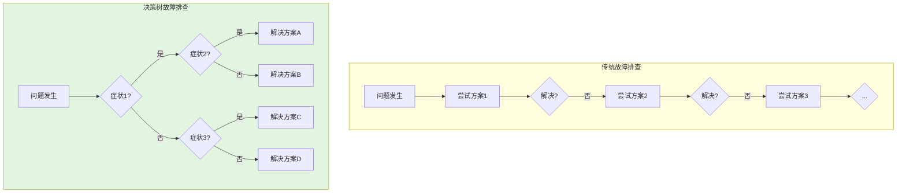
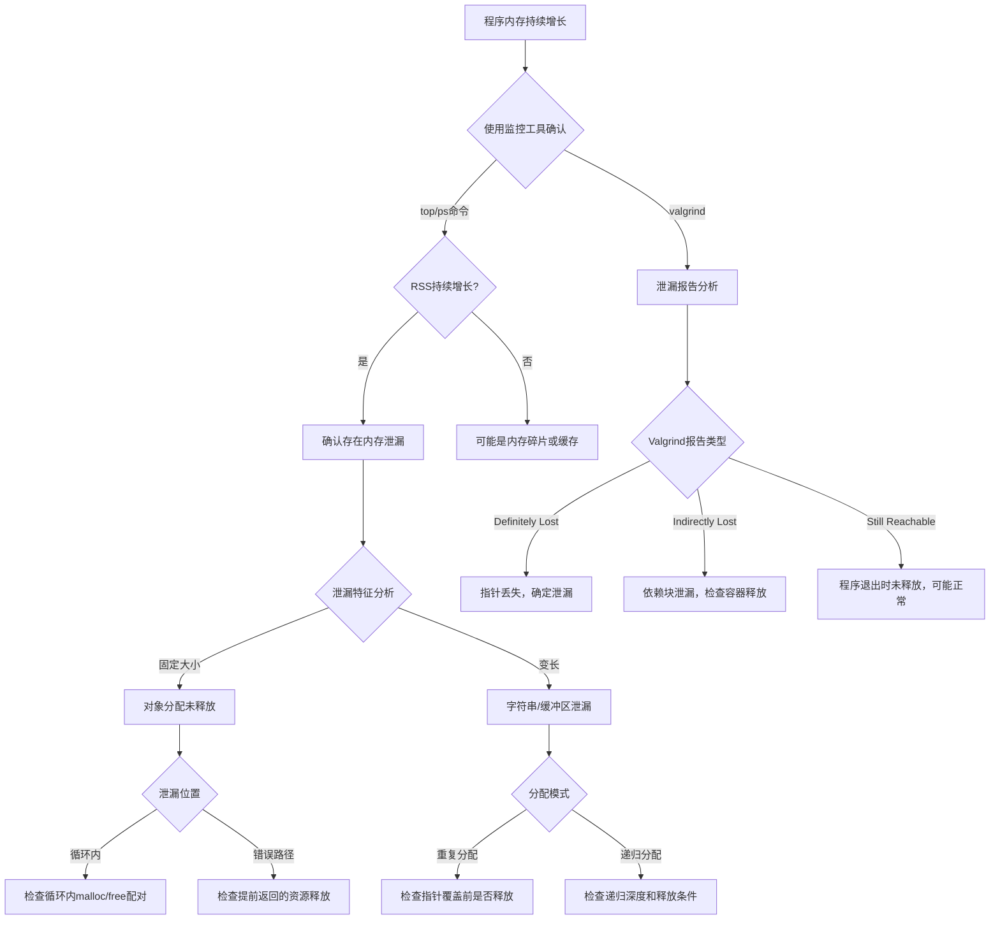
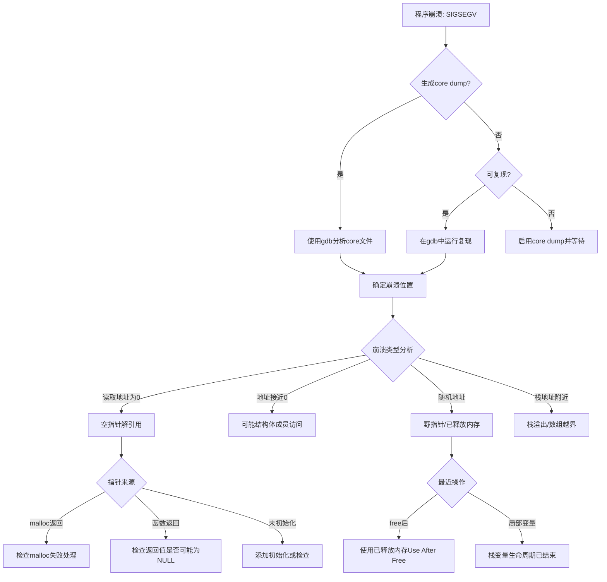
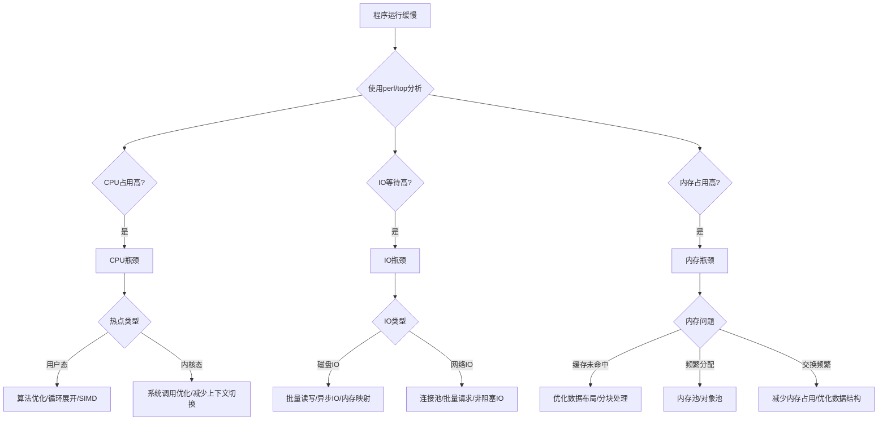
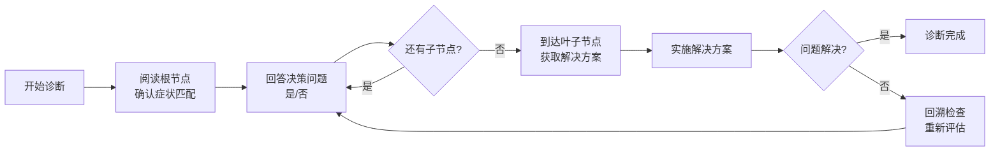
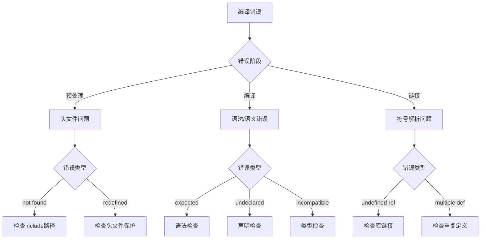
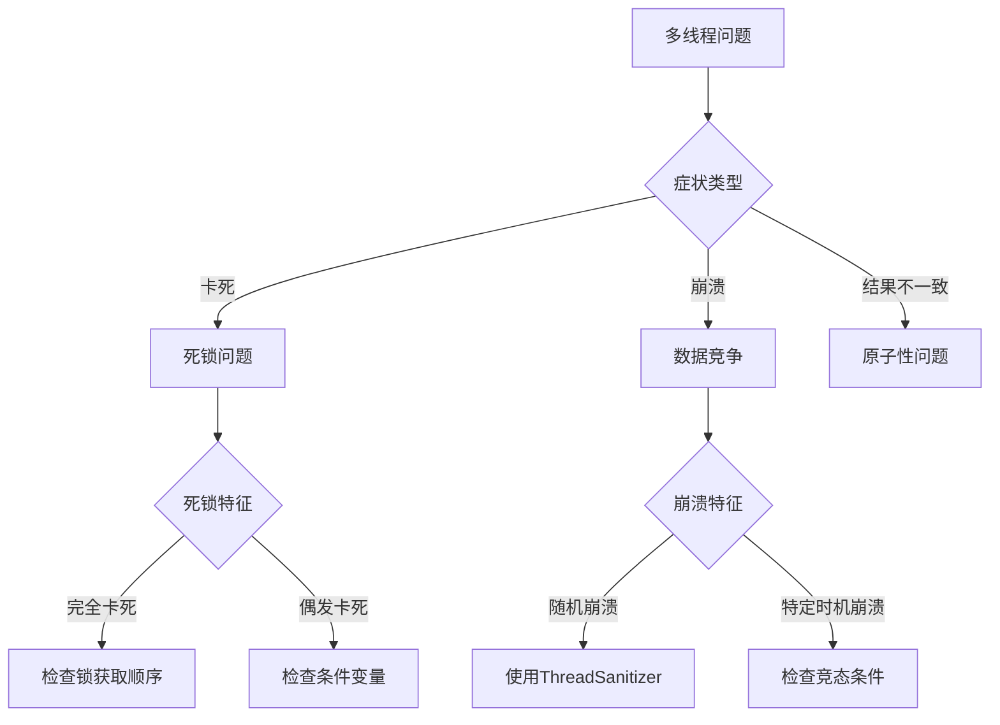
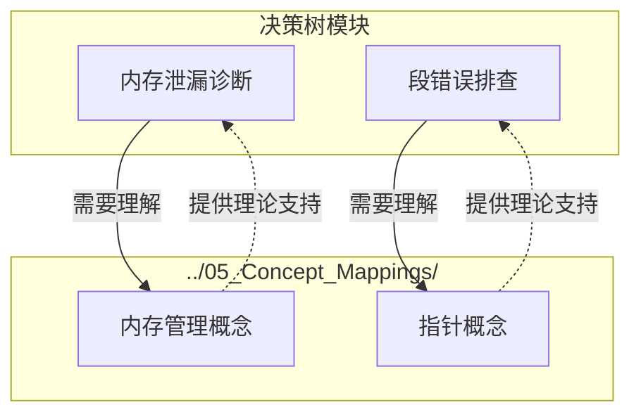
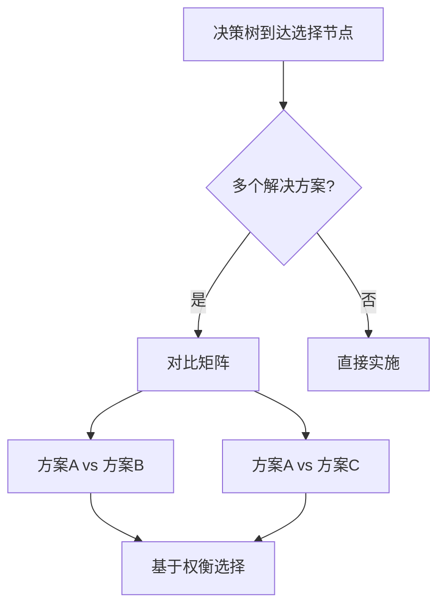
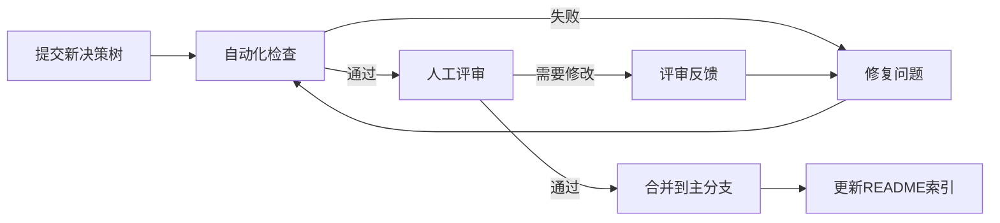

# 决策树 - 问题诊断与故障排查

本目录包含一系列结构化决策树文档，用于系统化诊断和解决C语言开发中的常见问题。
通过逻辑分支结构，帮助开发者快速定位问题根源并找到解决方案。

---

## 目录

- [决策树 - 问题诊断与故障排查](#决策树---问题诊断与故障排查)
  - [目录](#目录)
  - [1. 决策树方法概述](#1-决策树方法概述)
    - [1.1 什么是决策树方法](#11-什么是决策树方法)
    - [1.2 决策树的基本结构](#12-决策树的基本结构)
    - [1.3 在C语言开发中的应用场景](#13-在c语言开发中的应用场景)
      - [场景1：内存相关问题](#场景1内存相关问题)
      - [场景2：性能相关问题](#场景2性能相关问题)
      - [场景3：编译与链接问题](#场景3编译与链接问题)
      - [场景4：并发问题](#场景4并发问题)
    - [1.4 与故障排查的关系](#14-与故障排查的关系)
  - [2. 现有决策树详细介绍](#2-现有决策树详细介绍)
    - [2.1 内存泄漏诊断决策树](#21-内存泄漏诊断决策树)
      - [决策树结构（Mermaid图表）](#决策树结构mermaid图表)
      - [详细节点解释](#详细节点解释)
      - [实际案例流程](#实际案例流程)
    - [2.2 段错误排查决策树](#22-段错误排查决策树)
      - [决策树结构（Mermaid图表）](#决策树结构mermaid图表-1)
      - [详细节点解释](#详细节点解释-1)
      - [实际案例流程](#实际案例流程-1)
    - [2.3 性能瓶颈分析决策树](#23-性能瓶颈分析决策树)
      - [决策树结构（Mermaid图表）](#决策树结构mermaid图表-2)
      - [详细节点解释](#详细节点解释-2)
      - [实际案例流程](#实际案例流程-2)
  - [3. 如何使用决策树](#3-如何使用决策树)
    - [3.1 识别问题症状的步骤](#31-识别问题症状的步骤)
      - [步骤1：收集现象](#步骤1收集现象)
      - [步骤2：分类症状](#步骤2分类症状)
    - [3.2 如何跟随分支进行诊断](#32-如何跟随分支进行诊断)
      - [示例：跟随内存泄漏决策树](#示例跟随内存泄漏决策树)
    - [3.3 记录和跟踪诊断过程](#33-记录和跟踪诊断过程)
      - [实际诊断记录示例](#实际诊断记录示例)
    - [验证结果](#验证结果)
    - [预防措施](#预防措施)
    - [经验教训](#经验教训)
      - [计划内容](#计划内容)
    - [4.2 并发问题调试决策树（设计大纲）](#42-并发问题调试决策树设计大纲)
      - [目标](#目标)
      - [决策树结构预览](#决策树结构预览)
      - [计划内容](#计划内容-1)
    - [4.3 其他计划中的决策树](#43-其他计划中的决策树)
  - [5. 与其他模块的关系](#5-与其他模块的关系)
    - [5.1 如何结合概念映射使用](#51-如何结合概念映射使用)
    - [5.2 如何结合案例研究使用](#52-如何结合案例研究使用)
    - [5.3 如何结合对比矩阵使用](#53-如何结合对比矩阵使用)
  - [6. 贡献指南](#6-贡献指南)
    - [6.1 如何添加新的决策树](#61-如何添加新的决策树)
      - [步骤1：确定需求](#步骤1确定需求)
      - [步骤2：设计决策树结构](#步骤2设计决策树结构)
      - [步骤3：创建文件](#步骤3创建文件)
      - [步骤4：审核与合并](#步骤4审核与合并)
    - [6.2 决策树编写规范](#62-决策树编写规范)
      - [结构规范](#结构规范)
      - [格式规范](#格式规范)
      - [内容规范](#内容规范)
    - [6.3 质量检查清单](#63-质量检查清单)
      - [提交前自检](#提交前自检)
      - [评审流程](#评审流程)
  - [快速索引](#快速索引)
  - [文件清单](#文件清单)

---

## 1. 决策树方法概述

### 1.1 什么是决策树方法

决策树（Decision Tree）是一种系统化的故障排查方法论，通过一系列是非判断（Yes/No）将复杂问题逐步分解为更小、更易管理的子问题，最终定位到根本原因并提供解决方案。

在C语言开发中，决策树方法的核心优势包括：

| 特性 | 说明 |
|------|------|
| **结构化** | 将无序的调试尝试转化为有序的决策路径 |
| **可复现** | 相同的症状总是遵循相同的诊断路径 |
| **知识沉淀** | 将个人经验转化为团队共享的诊断流程 |
| **学习工具** | 帮助新手理解问题排查的系统化思维 |

### 1.2 决策树的基本结构

```
                    ┌─────────────────┐
                    │   根节点        │  ← 问题症状/入口
                    │  (起始症状)     │
                    └────────┬────────┘
                             │
              ┌──────────────┼──────────────┐
              │ YES          │              │ NO
              ▼              │              ▼
       ┌─────────────┐       │       ┌─────────────┐
       │  决策节点A   │       │       │  决策节点B  │  ← 判断条件
       │ (条件判断)  │       │       │ (条件判断)  │
       └──────┬──────┘       │       └──────┬──────┘
              │              │              │
              ▼              ▼              ▼
       ┌─────────────────────────────────────────┐
       │              叶子节点                   │  ← 解决方案
       │         (具体修复建议)                  │
       └─────────────────────────────────────────┘
```

### 1.3 在C语言开发中的应用场景

决策树方法特别适用于以下C语言开发场景：

#### 场景1：内存相关问题

- 程序运行时间越长，内存占用越大
- 出现`SIGSEGV`信号导致程序崩溃
- `malloc`/`free`相关的段错误

#### 场景2：性能相关问题

- 程序响应时间突然增加
- CPU占用率持续100%
- 频繁发生缓存未命中

#### 场景3：编译与链接问题

- 编译器报错难以理解
- 链接时出现`undefined reference`
- 头文件循环依赖

#### 场景4：并发问题

- 多线程环境下随机崩溃
- 死锁导致程序卡死
- 数据竞争产生不一致结果

### 1.4 与故障排查的关系

决策树方法与故障排查（Troubleshooting）的关系可以概括为：



**关键区别**：

- 传统排查依赖个人经验和试错
- 决策树排查基于系统化分类和逻辑判断
- 决策树能够确保不遗漏重要的诊断步骤

---

## 2. 现有决策树详细介绍

### 2.1 内存泄漏诊断决策树

内存泄漏是C语言中最常见的问题之一。以下是完整的决策树结构：

#### 决策树结构（Mermaid图表）



#### 详细节点解释

**根节点：程序内存持续增长**

- **症状识别**：通过`top`、`htop`或`/proc/[pid]/status`观察RSS字段
- **确认标准**：连续多次请求相同操作，RSS单调递增不回落

**决策节点1：RSS持续增长？**

- **YES路径**：进入详细诊断流程
- **NO路径**：可能是内存碎片（考虑内存池）或正常缓存行为

**决策节点2：泄漏大小固定？**

- **固定大小**：通常是结构体/对象分配后未释放
- **变长**：通常是字符串操作、缓冲区分配不当

**决策节点3：泄漏位置**

- **循环内**：检查每次迭代是否配对释放
- **错误路径**：最容易遗漏，检查所有`return`语句前的资源释放

#### 实际案例流程

```
实际案例：Web服务器内存持续增长

Step 1: 使用valgrind确认
    $ valgrind --leak-check=full ./webserver
    ==12345== 1,024 bytes in 4 blocks are definitely lost

Step 2: 分析泄漏特征
    - 每次请求泄漏约256字节
    - 固定大小 → 可能是连接结构体未释放

Step 3: 定位代码区域
    - 查看堆栈跟踪指向 connection_handler.c:45
    - 发现错误路径未释放 conn 结构体

Step 4: 修复并验证
    - 添加 goto cleanup 模式
    - 重新运行valgrind确认无泄漏
```

### 2.2 段错误排查决策树

段错误（SIGSEGV）是最常见的崩溃类型，以下是系统化排查流程：

#### 决策树结构（Mermaid图表）



#### 详细节点解释

**根节点：程序崩溃显示SIGSEGV**

- **症状识别**：终端显示`Segmentation fault (core dumped)`
- **立即行动**：启用core dump收集（`ulimit -c unlimited`）

**决策节点1：生成core dump？**

- **是**：直接分析core文件，获得崩溃时的完整状态
- **否**：需要配置系统或复现问题

**决策节点2：崩溃类型分析**

- **读取地址为0**：典型的空指针解引用
- **地址接近0**（0x10, 0x20等）：可能是结构体成员访问，基址为NULL
- **随机地址**：野指针或使用已释放内存
- **栈地址附近**：栈缓冲区溢出或递归过深

**决策节点3：最近操作（针对野指针）**

- **free后**：Use After Free，检查释放后是否置NULL
- **局部变量**：返回了栈变量的地址

#### 实际案例流程

```
实际案例：数据处理程序随机崩溃

Step 1: 启用core dump
    $ ulimit -c unlimited
    $ ./dataprocess
    Segmentation fault (core dumped)

Step 2: 使用gdb分析
    $ gdb ./dataprocess core
    (gdb) bt
    #0 0x0000555555554a2b in process_node (node=0x7ffff7a00000) at main.c:234
    #1 0x0000555555554b10 in main (argc=1, argv=0x7fffffffdf88) at main.c:300

Step 3: 分析崩溃位置
    (gdb) print node
    $1 = (Node *) 0x7ffff7a00000
    (gdb) x/4x node
    0x7ffff7a00000: Cannot access memory at address 0x7ffff7a00000
    → 地址有效但不可访问，怀疑是已释放内存

Step 4: 使用AddressSanitizer验证
    $ gcc -fsanitize=address -g -o dataprocess dataprocess.c
    $ ./dataprocess
    ERROR: AddressSanitizer: heap-use-after-free
    → 确认是Use After Free问题

Step 5: 修复
    - 在free后将指针置为NULL
    - 在使用前添加NULL检查
```

### 2.3 性能瓶颈分析决策树

性能优化需要首先确定瓶颈类型，以下是分析决策树：

#### 决策树结构（Mermaid图表）



#### 详细节点解释

**根节点：程序运行缓慢**

- **症状识别**：响应时间超出预期、吞吐量低于需求
- **首要原则**：先测量，再优化（不要猜测瓶颈）

**决策节点1：CPU/IO/内存瓶颈判断**

- **CPU占用高**：算法复杂度过高或计算密集型操作
- **IO等待高**：磁盘或网络成为瓶颈
- **内存占用高**：可能导致频繁的垃圾回收或交换

**决策节点2：热点类型（CPU瓶颈）**

- **用户态**：优化算法、循环展开、SIMD向量化
- **内核态**：减少系统调用、使用批量操作

**决策节点3：IO类型**

- **磁盘IO**：使用缓冲、异步IO、内存映射文件
- **网络IO**：连接复用、批量请求、非阻塞模型

**决策节点4：内存问题**

- **缓存未命中**：优化数据访问模式，提高空间局部性
- **频繁分配**：使用内存池减少分配开销
- **交换频繁**：减小内存占用或增加物理内存

#### 实际案例流程

```
实际案例：图像处理程序处理大图像时缓慢

Step 1: 使用perf确定瓶颈类型
    $ perf stat ./imageprocess large.jpg
    CPU utilization: 95%
    Cache-misses: 25% (高!)
    → CPU瓶颈，且缓存未命中严重

Step 2: 生成火焰图定位热点
    $ perf record -g ./imageprocess large.jpg
    $ perf script | stackcollapse-perf.pl | flamegraph.pl > flame.svg
    → 热点在 matrix_multiply 函数

Step 3: 分析内存访问模式
    原始代码：
    for (i = 0; i < n; i++)
        for (j = 0; j < n; j++)
            for (k = 0; k < n; k++)
                C[i][j] += A[i][k] * B[k][j];  // B的访问跨行

    → B矩阵按列访问，缓存不友好

Step 4: 优化
    1. 转置B矩阵后按行访问
    2. 使用分块算法(Cache Blocking)
    3. 使用AVX2 SIMD指令

Step 5: 验证效果
    优化前: 12.5秒
    转置后: 4.2秒 (3x)
    分块后: 2.1秒 (6x)
    SIMD后: 0.8秒 (15x)
```

---

## 3. 如何使用决策树

### 3.1 识别问题症状的步骤

使用决策树的第一步是准确识别问题症状：

#### 步骤1：收集现象

```bash
# 系统级观察
$ top -p $(pgrep your_program)    # 观察CPU和内存
$ iostat -x 1                     # 观察磁盘IO
$ vmstat 1                        # 观察系统整体状态

# 程序级观察
$ strace -p $(pgrep your_program) # 跟踪系统调用
$ lsof -p $(pgrep your_program)   # 查看打开的文件

# C程序专用
$ cat /proc/[pid]/status          # 查看进程状态
$ cat /proc/[pid]/maps            # 查看内存映射
```

#### 步骤2：分类症状

| 症状类别 | 具体表现 | 推荐决策树 |
|----------|----------|------------|
| 内存相关 | RSS持续增长、OOM被kill | [内存泄漏诊断](./01_Memory_Leak_Diagnosis.md) |
| 崩溃相关 | SIGSEGV、SIGABRT、core dump | [段错误排查](./02_Segfault_Troubleshooting.md) |
| 性能相关 | CPU100%、响应慢、吞吐量低 | [性能瓶颈分析](./03_Performance_Bottleneck.md) |
| 编译相关 | 编译错误、链接错误 | 编译错误处理（计划中） |
| 并发相关 | 死锁、数据竞争、随机崩溃 | 并发问题调试（计划中） |

### 3.2 如何跟随分支进行诊断

跟随决策树进行诊断的标准流程：



#### 示例：跟随内存泄漏决策树

```
┌─────────────────────────────────────────────────────────────────┐
│  诊断日志 - 内存泄漏问题                                          │
├─────────────────────────────────────────────────────────────────┤
│                                                                 │
│  [根节点] 程序内存持续增长?                                       │
│  → 观察: top命令显示RSS从10MB增长到500MB（运行1小时）             │
│  → 结论: 是，进入决策树                                           │
│                                                                 │
│  [节点1] 使用valgrind确认泄漏存在?                               │
│  → 运行: valgrind --leak-check=full ./program                    │
│  → 结果: "definitely lost: 10,000 bytes in 50 blocks"            │
│  → 结论: 是，确认存在泄漏                                         │
│                                                                 │
│  [节点2] 泄漏大小固定?                                           │
│  → 分析: 每次操作泄漏约200字节（10000/50）                        │
│  → 结论: 是，固定大小                                             │
│                                                                 │
│  [节点3] 泄漏发生在循环内?                                        │
│  → 代码审查: 发现process_data()函数内有循环                       │
│  → 结论: 是                                                       │
│                                                                 │
│  [叶子节点] 检查循环内malloc/free配对                             │
│  → 发现: 循环内malloc临时缓冲区，但只有循环外一次free              │
│  → 修复: 将malloc移到循环外，或使用每次迭代释放                   │
│                                                                 │
│  [验证] 重新运行valgrind                                          │
│  → 结果: "All heap blocks were freed -- no leaks are possible"   │
│  → 状态: ✅ 修复成功                                              │
│                                                                 │
└─────────────────────────────────────────────────────────────────┘
```

### 3.3 记录和跟踪诊断过程

建议使用以下模板记录诊断过程：

```markdown
## 诊断记录模板

### 基本信息
- **问题描述**:
- **发生时间**:
- **影响范围**:
- **使用决策树**:

### 诊断路径
| 步骤 | 决策节点 | 选择 | 观察/结果 |
|------|----------|------|-----------|
| 1 | 根节点 | - | |
| 2 | | | |
| 3 | | | |

### 最终解决方案

### 验证结果

### 预防措施

### 经验教训
```

#### 实际诊断记录示例

```markdown
## 诊断记录示例

### 基本信息
- **问题描述**: 生产环境服务运行数小时后崩溃
- **发生时间**: 2024-01-15 03:30
- **影响范围**: 单个节点，影响约1000用户
- **使用决策树**: 段错误排查决策树

### 诊断路径
| 步骤 | 决策节点 | 选择 | 观察/结果 |
|------|----------|------|-----------|
| 1 | 程序崩溃SIGSEGV | - | 日志显示Segmentation fault |
| 2 | 生成core dump? | 否 | 未启用，先复现问题 |
| 3 | 可复现? | 是 | 压测10分钟后复现 |
| 4 | 在gdb中运行 | - | 捕获到崩溃点 |
| 5 | 崩溃类型 | 空指针 | 读取地址0x0 |
| 6 | 指针来源 | 函数返回 | malloc返回NULL未检查 |

### 最终解决方案
在高负载下malloc可能失败，添加NULL检查：
```c
void* buffer = malloc(size);
if (buffer == NULL) {
    log_error("内存分配失败");
    return ERROR_NOMEM;
}
```

### 验证结果

- 压测2小时无崩溃
- valgrind报告无内存错误

### 预防措施

- 代码审查：所有malloc调用必须检查返回值
- CI集成：使用静态分析工具检查潜在问题

### 经验教训

不要假设malloc一定成功，特别是在高负载环境下。

```

---

## 4. 决策树的扩展计划

### 4.1 编译错误处理决策树（设计大纲）

#### 目标
帮助开发者快速定位和解决GCC/Clang编译错误。

#### 决策树结构预览



#### 计划内容

1. **预处理阶段错误**
   - 头文件找不到 (`#include <xxx.h>` not found)
   - 宏重定义警告/错误
   - 条件编译问题

2. **编译阶段错误**
   - 语法错误（缺少分号、括号不匹配）
   - 类型错误（不兼容的类型转换）
   - 未声明标识符

3. **链接阶段错误**
   - 未定义引用 (undefined reference)
   - 多重定义 (multiple definition)
   - 库版本不兼容

### 4.2 并发问题调试决策树（设计大纲）

#### 目标

系统化诊断多线程程序中的死锁、数据竞争等问题。

#### 决策树结构预览



#### 计划内容

1. **死锁诊断**
   - 识别死锁特征（程序完全卡死）
   - 使用`pstack`/`gdb thread`分析锁状态
   - 检查锁获取顺序（循环等待）

2. **数据竞争诊断**
   - 使用ThreadSanitizer检测
   - 识别无保护共享变量
   - 锁粒度分析

3. **原子性问题**
   - 读写撕裂 (Tear)
   - 指令重排序问题
   - 内存序选择

### 4.3 其他计划中的决策树

| 决策树名称 | 优先级 | 目标问题 |
|------------|--------|----------|
| **构建系统问题** | 高 | Makefile/cmake配置错误 |
| **跨平台兼容性** | 中 | 不同OS/编译器下的行为差异 |
| **嵌入式C问题** | 中 | 资源受限环境下的调试 |
| **浮点数精度** | 低 | 浮点数比较、精度丢失问题 |
| **网络编程** | 低 | Socket错误、协议问题 |

---

## 5. 与其他模块的关系

### 5.1 如何结合概念映射使用



**使用场景**：

- 当决策树提到"虚拟内存"、"页表"等概念时，参考概念映射获取深入理解
- 概念映射帮助理解决策树中某些判断条件的底层原理

**示例**：

```
决策树指出: "检查是否有内存碎片问题"
    ↓
概念映射解释: 什么是内存碎片？如何产生？如何检测？
    ↓
深入理解后返回决策树继续诊断
```

### 5.2 如何结合案例研究使用


**使用场景**：

- 决策树帮助快速定位问题类型
- 案例研究提供完整的解决过程和代码示例
- 两者结合提供从诊断到解决的完整路径

**示例**：

```
决策树诊断结果: 链表内存泄漏
    ↓
参考案例研究: 大型系统中的链表管理优化
    - 详细的链表遍历释放代码
    - 避免泄漏的设计模式
    ↓
应用到实际问题
```

### 5.3 如何结合对比矩阵使用



**使用场景**：

- 决策树的叶子节点可能提供多个可行方案
- 对比矩阵帮助在不同方案间做选择
- 根据具体约束（性能、复杂度、维护性）选择最优解

**示例**：

```
决策树解决方案: 防止段错误
    ├── 方案1: 添加NULL检查
    ├── 方案2: 使用断言
    └── 方案3: 使用智能指针库

    ↓ 对比矩阵分析

┌──────────┬─────────┬─────────┬─────────┐
│ 维度     │ NULL检查│ 断言    │ 智能指针│
├──────────┼─────────┼─────────┼─────────┤
│ 运行时开销│ 低      │ 低      │ 中      │
│ 调试便利性│ 中      │ 高      │ 高      │
│ 代码侵入性│ 中      │ 低      │ 低      │
│ 维护成本  │ 中      │ 低      │ 低      │
└──────────┴─────────┴─────────┴─────────┘
    ↓
根据项目需求选择最合适的方案
```

---

## 6. 贡献指南

### 6.1 如何添加新的决策树

#### 步骤1：确定需求

- 该问题是否经常发生？
- 现有决策树是否无法覆盖？
- 是否有足够的案例支持？

#### 步骤2：设计决策树结构

使用以下模板设计决策树：

```markdown
## [问题名称]决策树

### 根节点
- 问题症状:
- 确认方法:

### 决策节点1
- 判断条件:
- YES分支:
- NO分支:

### 决策节点2
...

### 叶子节点（解决方案）
- 方案1:
- 方案2:
```

#### 步骤3：创建文件

- 文件名格式: `XX_Problem_Name.md`
- 放置在 `01_Decision_Trees/` 目录
- 更新本README.md的文件清单

#### 步骤4：审核与合并

- 确保经过实际案例验证
- 提交PR包含决策树文件和示例代码

### 6.2 决策树编写规范

#### 结构规范

```
每个决策树文件必须包含:
1. 标题和简介
2. 目录
3. 问题描述
4. 决策树图表 (Mermaid或文本)
5. 每个节点的详细解释
6. 实际案例
7. 相关工具/命令
8. 总结和参考
```

#### 格式规范

| 元素 | 格式要求 |
|------|----------|
| 决策节点 | 使用清晰的问句形式 |
| 分支标签 | YES/NO 或具体条件 |
| 叶子节点 | 提供可操作的解决方案 |
| 代码示例 | 包含编译和运行说明 |
| 命令行 | 包含完整的命令和参数 |

#### 内容规范

**必须包含的内容**：

- ✅ 根节点的明确症状描述
- ✅ 每个决策节点的判断标准
- ✅ 叶子节点的具体修复步骤
- ✅ 至少一个完整案例
- ✅ 验证修复的方法

**避免的内容**：

- ❌ 模糊的描述（"检查代码"）
- ❌ 过于理论化的解释
- ❌ 没有验证的解决方案
- ❌ 与现有决策树重复的内容

### 6.3 质量检查清单

#### 提交前自检

```markdown
## 决策树质量检查清单

### 结构完整性
- [ ] 包含清晰的标题和简介
- [ ] 有目录便于导航
- [ ] 决策树图表正确渲染
- [ ] 每个节点都有详细解释

### 内容准确性
- [ ] 所有命令经过实际测试
- [ ] 代码示例可以编译运行
- [ ] 案例来自真实场景或经过验证
- [ ] 解决方案确实能够解决问题

### 可用性
- [ ] 症状描述易于识别
- [ ] 判断条件清晰无歧义
- [ ] 解决方案具体可操作
- [ ] 包含验证修复的方法

### 文档规范
- [ ] 使用Markdown格式
- [ ] 代码块标注语言
- [ ] 链接正确可点击
- [ ] 无拼写和语法错误

### 与其他模块的关联
- [ ] 参考了相关概念映射
- [ ] 链接了相关案例研究
- [ ] 使用了相关的对比矩阵
```

#### 评审流程



---

## 快速索引

| 问题现象 | 推荐决策树 |
|----------|-----------|
| 程序内存不断增长 | [内存泄漏诊断](./01_Memory_Leak_Diagnosis.md) |
| 程序突然崩溃/段错误 | [段错误排查](./02_Segfault_Troubleshooting.md) |
| 程序运行缓慢 | [性能瓶颈分析](./03_Performance_Bottleneck.md) |
| 编译不通过 | ~~编译错误处理~~ (计划中) |
| 多线程异常/死锁 | ~~并发问题调试~~ (计划中) |

---

## 文件清单

| 文件名 | 主题 | 适用场景 | 状态 |
|--------|------|----------|------|
| [01_Memory_Leak_Diagnosis.md](./01_Memory_Leak_Diagnosis.md) | 内存泄漏诊断 | 程序内存持续增长、OOM异常、valgrind报告问题 | ✅ 可用 |
| [02_Segfault_Troubleshooting.md](./02_Segfault_Troubleshooting.md) | 段错误排查 | 程序崩溃、SIGSEGV信号、空指针访问、数组越界 | ✅ 可用 |
| [03_Performance_Bottleneck.md](./03_Performance_Bottleneck.md) | 性能瓶颈分析 | CPU占用高、响应延迟、吞吐量不足、资源竞争 | ✅ 可用 |
| 04_Compilation_Error.md | 编译错误处理 | GCC/Clang编译报错、链接错误 | 📝 计划中 |
| 05_Concurrency_Debug.md | 并发问题调试 | 死锁、数据竞争、线程安全问题 | 📝 计划中 |

---

**← [返回上级目录](../README.md)**
**← [返回知识库根目录](../../README.md)**
