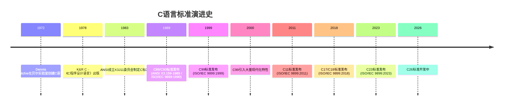
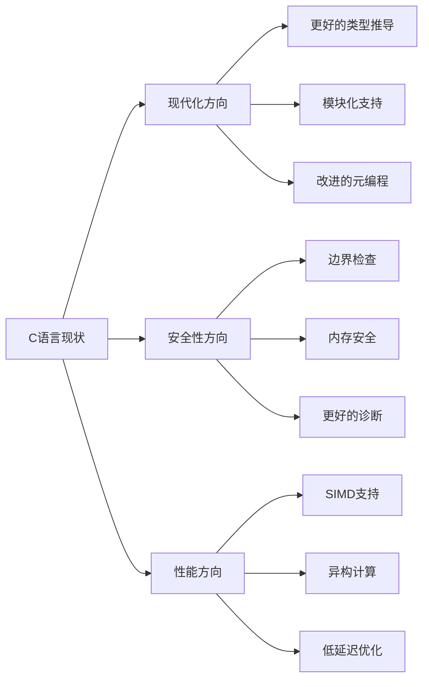

# C语言标准演进多维矩阵对比

> **思维表征方式**: 多维矩阵对比
> **对比维度**: C89/C99/C11/C17/C23

---

## C语言标准演进时间线图



---


---

## 📑 目录

- [C语言标准演进多维矩阵对比](#c语言标准演进多维矩阵对比)
  - [C语言标准演进时间线图](#c语言标准演进时间线图)
  - [📑 目录](#-目录)
  - [1. 核心特性支持矩阵](#1-核心特性支持矩阵)
  - [2. 标准库头文件矩阵](#2-标准库头文件矩阵)
  - [3. 编译器支持矩阵](#3-编译器支持矩阵)
  - [4. 数据模型矩阵](#4-数据模型矩阵)
  - [5. 整数类型宽度矩阵](#5-整数类型宽度矩阵)
  - [6. 浮点类型矩阵](#6-浮点类型矩阵)
  - [7. 内存序矩阵 (C11 \_Atomic)](#7-内存序矩阵-c11-_atomic)
  - [8. 编译优化级别矩阵](#8-编译优化级别矩阵)
  - [9. 标准符合性检测矩阵](#9-标准符合性检测矩阵)
  - [10. 学习难度与重要性矩阵](#10-学习难度与重要性矩阵)
  - [11. 应用场景矩阵](#11-应用场景矩阵)
  - [第一部分：C语言标准演进历史](#第一部分c语言标准演进历史)
  - [1.1 从C89到C23的发展脉络](#11-从c89到c23的发展脉络)
    - [史前时代：K\&R C (1978-1989)](#史前时代kr-c-1978-1989)
    - [标准化元年：C89/C90 (1989-1990)](#标准化元年c89c90-1989-1990)
    - [现代化飞跃：C99 (1999)](#现代化飞跃c99-1999)
    - [并发时代：C11 (2011)](#并发时代c11-2011)
    - [缺陷修复：C17/C18 (2018)](#缺陷修复c17c18-2018)
    - [现代C：C23 (2023)](#现代cc23-2023)
    - [展望未来：C26 (2026)](#展望未来c26-2026)
  - [第二部分：各标准核心特性详解](#第二部分各标准核心特性详解)
  - [2.1 C89/C90：ANSI C的基础](#21-c89c90ansi-c的基础)
    - [主要贡献](#主要贡献)
    - [C89的局限性](#c89的局限性)
  - [2.2 C99：重大现代化更新](#22-c99重大现代化更新)
    - [核心特性详解](#核心特性详解)
  - [2.3 C11：并发时代的新特性](#23-c11并发时代的新特性)
    - [核心特性详解](#核心特性详解-1)
  - [2.4 C17/C18：缺陷修复版](#24-c17c18缺陷修复版)
  - [2.5 C23：现代C语言](#25-c23现代c语言)
    - [核心特性详解](#核心特性详解-2)
- [第三部分：重要特性深度分析](#第三部分重要特性深度分析)
  - [3.1 变长数组VLA的兴衰](#31-变长数组vla的兴衰)
    - [VLA的设计初衷](#vla的设计初衷)
    - [VLA的优势](#vla的优势)
    - [VLA的问题与限制](#vla的问题与限制)
    - [VLA的衰落](#vla的衰落)
    - [VLA的替代方案](#vla的替代方案)
  - [3.2 \_Complex复数类型的应用](#32-_complex复数类型的应用)
    - [基本用法](#基本用法)
    - [实际应用：信号处理](#实际应用信号处理)
    - [复数类型精度](#复数类型精度)
    - [与tgmath.h结合](#与tgmathh结合)
  - [3.3 \_Generic泛型选择的实现原理](#33-_generic泛型选择的实现原理)
    - [基本语法](#基本语法)
    - [简单示例](#简单示例)
    - [实现类型泛型函数](#实现类型泛型函数)
    - [实现泛型容器](#实现泛型容器)
    - [\_Generic与指针类型](#_generic与指针类型)
    - [限制与注意事项](#限制与注意事项)
  - [3.4 \_Atomic内存模型详解](#34-_atomic内存模型详解)
    - [原子类型基础](#原子类型基础)
    - [内存序详解](#内存序详解)
    - [自旋锁实现](#自旋锁实现)
    - [无锁数据结构：无锁队列节点](#无锁数据结构无锁队列节点)
    - [顺序一致性](#顺序一致性)
  - [3.5 线程库设计哲学](#35-线程库设计哲学)
    - [核心设计理念](#核心设计理念)
    - [条件变量](#条件变量)
    - [线程局部存储](#线程局部存储)
    - [与pthread的对比](#与pthread的对比)
  - [第四部分：编译器支持现状](#第四部分编译器支持现状)
  - [4.1 GCC支持情况](#41-gcc支持情况)
    - [GCC编译选项](#gcc编译选项)
  - [4.2 Clang支持情况](#42-clang支持情况)
    - [Clang编译选项](#clang编译选项)
  - [4.3 MSVC支持情况](#43-msvc支持情况)
    - [MSVC编译选项](#msvc编译选项)
    - [MSVC兼容性处理](#msvc兼容性处理)
  - [4.4 嵌入式编译器](#44-嵌入式编译器)
- [第五部分：如何选择C标准](#第五部分如何选择c标准)
  - [5.1 项目选型决策树](#51-项目选型决策树)
  - [5.2 各标准适用场景](#52-各标准适用场景)
    - [C89：极致兼容性](#c89极致兼容性)
    - [C99：实用与现代的平衡](#c99实用与现代的平衡)
    - [C11：并发与系统编程](#c11并发与系统编程)
    - [C23：现代应用开发](#c23现代应用开发)
- [第六部分：迁移指南](#第六部分迁移指南)
  - [6.1 迁移检查清单](#61-迁移检查清单)
    - [C89 → C99 迁移](#c89--c99-迁移)
    - [C99 → C11 迁移](#c99--c11-迁移)
    - [C11 → C17 迁移](#c11--c17-迁移)
    - [C17 → C23 迁移](#c17--c23-迁移)
  - [6.2 渐进式迁移策略](#62-渐进式迁移策略)
    - [阶段1：编译器选项切换](#阶段1编译器选项切换)
    - [阶段2：兼容性宏层](#阶段2兼容性宏层)
    - [阶段3：代码现代化](#阶段3代码现代化)
- [第七部分：废弃特性列表](#第七部分废弃特性列表)
  - [7.1 已废弃特性](#71-已废弃特性)
  - [7.2 gets()函数的危险与替代](#72-gets函数的危险与替代)
  - [7.3 隐式函数声明的问题](#73-隐式函数声明的问题)
- [第八部分：未来展望](#第八部分未来展望)
  - [8.1 C26可能引入的特性](#81-c26可能引入的特性)
    - [改进的模块化支持](#改进的模块化支持)
    - [更强大的constexpr](#更强大的constexpr)
    - [改进的安全性](#改进的安全性)
  - [8.2 C语言的发展趋势](#82-c语言的发展趋势)
- [第九部分：兼容性处理](#第九部分兼容性处理)
  - [9.1 多标准兼容的宏定义技巧](#91-多标准兼容的宏定义技巧)
    - [特性检测宏](#特性检测宏)
    - [条件编译封装](#条件编译封装)
    - [实际使用示例](#实际使用示例)
- [第十部分：实际案例分析](#第十部分实际案例分析)
  - [10.1 同一功能在不同标准下的实现对比](#101-同一功能在不同标准下的实现对比)
    - [案例1：矩阵乘法](#案例1矩阵乘法)
    - [案例2：字符串分割](#案例2字符串分割)
    - [案例3：链表实现对比](#案例3链表实现对比)
  - [总结](#总结)
  - [深入理解](#深入理解)
    - [核心原理](#核心原理)
    - [实践应用](#实践应用)
    - [最佳实践](#最佳实践)


---

## 1. 核心特性支持矩阵

| 特性类别 | 具体特性 | C89 | C99 | C11 | C17 | C23 |
|:---------|:---------|:---:|:---:|:---:|:---:|:---:|
| **语法** | // 行注释 | ❌ | ✅ | ✅ | ✅ | ✅ |
| | 变量随处声明 | ❌ | ✅ | ✅ | ✅ | ✅ |
| | for循环内声明 | ❌ | ✅ | ✅ | ✅ | ✅ |
| | 复合字面量 | ❌ | ✅ | ✅ | ✅ | ✅ |
| | 指定初始化器 | ❌ | ✅ | ✅ | ✅ | ✅ |
| | 匿名结构体/联合体 | ❌ | ❌ | ✅ | ✅ | ✅ |
| | [[属性]]语法 | ❌ | ❌ | ❌ | ❌ | ✅ |
| **数据类型** | long long | ❌ | ✅ | ✅ | ✅ | ✅ |
| | _Bool/bool | ❌ | ✅ | ✅ | ✅ | ✅ |
| | 复数类型 (_Complex) | ❌ | ✅ | ✅ | ✅ | ✅ |
| | 变长数组VLA | ❌ | ✅ | ⚠️ | ⚠️ | ❌ |
| | 柔性数组成员FAM | ❌ | ✅ | ✅ | ✅ | ✅ |
| | char16_t/char32_t | ❌ | ❌ | ✅ | ✅ | ✅ |
| | nullptr | ❌ | ❌ | ❌ | ❌ | ✅ |
| | typeof | ❌ | ❌ | ❌ | ❌ | ✅ |
| | auto类型推导 | ❌ | ❌ | ❌ | ❌ | ✅ |
| **类型限定** | const/volatile | ✅ | ✅ | ✅ | ✅ | ✅ |
| | restrict | ❌ | ✅ | ✅ | ✅ | ✅ |
| | _Atomic | ❌ | ❌ | ✅ | ✅ | ✅ |
| | _Alignas/_Alignof | ❌ | ❌ | ✅ | ✅ | ✅ |
| **函数** | inline | ❌ | ✅ | ✅ | ✅ | ✅ |
| | 可变参数宏 | ❌ | ✅ | ✅ | ✅ | ✅ |
| | _Noreturn | ❌ | ❌ | ✅ | ✅ | ✅ |
| | _Generic泛型选择 | ❌ | ❌ | ✅ | ✅ | ✅ |
| **内存** | _Static_assert | ❌ | ❌ | ✅ | ✅ | ✅ |
| | _Thread_local | ❌ | ❌ | ✅ | ✅ | ✅ |
| | 对齐内存分配 | ❌ | ❌ | ✅ | ✅ | ✅ |
| **并发** | 多线程<threads.h> | ❌ | ❌ | ✅ | ✅ | ✅ |
| | 原子操作<stdatomic.h> | ❌ | ❌ | ✅ | ✅ | ✅ |
| **预处理器** | _Pragma操作符 | ❌ | ✅ | ✅ | ✅ | ✅ |
| | __func__预定义宏 | ❌ | ✅ | ✅ | ✅ | ✅ |
| | #elifdef/#elifndef | ❌ | ❌ | ❌ | ❌ | ✅ |
| | #warning/#embed | ❌ | ❌ | ❌ | ❌ | ✅ |

---

## 2. 标准库头文件矩阵

| 头文件 | 说明 | C89 | C99 | C11 | C17 | C23 |
|:-------|:-----|:---:|:---:|:---:|:---:|:---:|
| <assert.h> | 断言 | ✅ | ✅ | ✅ | ✅ | ✅ |
| <complex.h> | 复数运算 | ❌ | ✅ | ✅ | ✅ | ✅ |
| <ctype.h> | 字符处理 | ✅ | ✅ | ✅ | ✅ | ✅ |
| <errno.h> | 错误号 | ✅ | ✅ | ✅ | ✅ | ✅ |
| <fenv.h> | 浮点环境 | ❌ | ✅ | ✅ | ✅ | ✅ |
| <float.h> | 浮点限制 | ✅ | ✅ | ✅ | ✅ | ✅ |
| <inttypes.h> | 整数类型格式 | ❌ | ✅ | ✅ | ✅ | ✅ |
| <iso646.h> | 替代运算符拼写 | ❌ | ✅ | ✅ | ✅ | ✅ |
| <limits.h> | 实现限制 | ✅ | ✅ | ✅ | ✅ | ✅ |
| <locale.h> | 本地化 | ✅ | ✅ | ✅ | ✅ | ✅ |
| <math.h> | 数学函数 | ✅ | ✅ | ✅ | ✅ | ✅ |
| <setjmp.h> | 非局部跳转 | ✅ | ✅ | ✅ | ✅ | ✅ |
| <signal.h> | 信号处理 | ✅ | ✅ | ✅ | ✅ | ✅ |
| <stdalign.h> | 对齐控制 | ❌ | ❌ | ✅ | ✅ | ✅ |
| <stdarg.h> | 可变参数 | ✅ | ✅ | ✅ | ✅ | ✅ |
| <stdatomic.h> | 原子操作 | ❌ | ❌ | ✅ | ✅ | ✅ |
| <stdbool.h> | 布尔类型 | ❌ | ✅ | ✅ | ✅ | ✅ |
| <stddef.h> | 通用定义 | ✅ | ✅ | ✅ | ✅ | ✅ |
| <stdint.h> | 定宽整数 | ❌ | ✅ | ✅ | ✅ | ✅ |
| <stdio.h> | 标准IO | ✅ | ✅ | ✅ | ✅ | ✅ |
| <stdlib.h> | 标准库 | ✅ | ✅ | ✅ | ✅ | ✅ |
| <stdnoreturn.h> | noreturn宏 | ❌ | ❌ | ✅ | ✅ | ✅ |
| <string.h> | 字符串处理 | ✅ | ✅ | ✅ | ✅ | ✅ |
| <tgmath.h> | 泛型数学 | ❌ | ✅ | ✅ | ✅ | ✅ |
| <threads.h> | 多线程 | ❌ | ❌ | ✅ | ✅ | ✅ |
| <time.h> | 日期时间 | ✅ | ✅ | ✅ | ✅ | ✅ |
| <uchar.h> | Unicode字符 | ❌ | ❌ | ✅ | ✅ | ✅ |
| <wchar.h> | 宽字符 | ❌ | ✅ | ✅ | ✅ | ✅ |
| <wctype.h> | 宽字符分类 | ❌ | ✅ | ✅ | ✅ | ✅ |

---

## 3. 编译器支持矩阵

| 特性 | GCC | Clang | MSVC | Intel C++ |
|:-----|:---:|:-----:|:----:|:---------:|
| C89支持 | ✅ | ✅ | ✅ | ✅ |
| C99支持 | ✅(4.5+) | ✅ | 部分 | ✅ |
| C11支持 | ✅(4.9+) | ✅ | 部分 | ✅ |
| C17支持 | ✅(8+) | ✅(7+) | 部分 | ✅ |
| C23支持 | 部分 | 部分 | 部分 | 部分 |
| **attribute** | ✅ | ✅ | ❌ | ✅ |
| __declspec | ❌ | ❌ | ✅ | ❌ |
| _Generic | ✅ | ✅ | ❌ | ✅ |
| _Atomic | ✅ | ✅ | 部分 | ✅ |

---

## 4. 数据模型矩阵

| 模型 | short | int | long | long long | pointer | 平台 |
|:-----|:-----:|:---:|:----:|:---------:|:-------:|:-----|
| ILP32 | 16 | 32 | 32 | 64 | 32 | 32位Unix/Linux |
| LP64 | 16 | 32 | 64 | 64 | 64 | 64位Unix/Linux |
| LLP64 | 16 | 32 | 32 | 64 | 64 | 64位Windows |
| ILP64 | 16 | 64 | 64 | 64 | 64 | 早期64位Unix |
| SILP64 | 64 | 64 | 64 | 64 | 64 | UNICOS |

---

## 5. 整数类型宽度矩阵

| 类型 | C89 | C99+ | 典型宽度(32位) | 典型宽度(64位) |
|:-----|:---:|:----:|:--------------:|:--------------:|
| char | ✅ | ✅ | 8 | 8 |
| short | ✅ | ✅ | 16 | 16 |
| int | ✅ | ✅ | 32 | 32 |
| long | ✅ | ✅ | 32 | 64 |
| long long | ❌ | ✅ | 64 | 64 |
| int8_t | ❌ | ✅ | 8 | 8 |
| int16_t | ❌ | ✅ | 16 | 16 |
| int32_t | ❌ | ✅ | 32 | 32 |
| int64_t | ❌ | ✅ | 64 | 64 |
| intptr_t | ❌ | ✅ | 32 | 64 |
| size_t | ✅ | ✅ | 32 | 64 |

---

## 6. 浮点类型矩阵

| 类型 | C89 | C99+ | IEEE 754格式 | 精度(位) | 指数位 | 尾数位 |
|:-----|:---:|:----:|:------------:|:--------:|:------:|:------:|
| float | ✅ | ✅ | binary32 | 24 | 8 | 23 |
| double | ✅ | ✅ | binary64 | 53 | 11 | 52 |
| long double | ✅ | ✅ | 平台相关 | 64-113 | 15-15 | 63-112 |
| _Decimal32 | ❌ | ❌ | decimal32 | 7 | - | - |
| _Decimal64 | ❌ | ❌ | decimal64 | 16 | - | - |
| _Decimal128 | ❌ | ❌ | decimal128 | 34 | - | - |
| _Complex float | ❌ | ✅ | - | - | - | - |
| _Complex double | ❌ | ✅ | - | - | - | - |

---

## 7. 内存序矩阵 (C11 _Atomic)

| 内存序 | 同步强度 | 用途 | 性能 |
|:-------|:---------|:-----|:----:|
| memory_order_relaxed | 无 | 仅原子性，无顺序 | 最高 |
| memory_order_consume | 数据依赖 | 读操作，依赖传播 | 高 |
| memory_order_acquire | 获取 | 读操作，同步释放 | 高 |
| memory_order_release | 释放 | 写操作，同步获取 | 高 |
| memory_order_acq_rel | 获取-释放 | 读-修改-写 | 中 |
| memory_order_seq_cst | 顺序一致 | 最强同步 | 最低 |

---

## 8. 编译优化级别矩阵

| 级别 | GCC/Clang | 说明 | 调试 | 性能 |
|:-----|:---------|:-----|:----:|:----:|
| -O0 | ✅ | 无优化，便于调试 | 最佳 | 最低 |
| -O1 | ✅ | 基本优化 | 良好 | 低 |
| -O2 | ✅ | 标准优化 | 一般 | 中 |
| -O3 | ✅ | 激进优化 | 差 | 高 |
| -Os | ✅ | 优化大小 | 一般 | 中 |
| -Ofast | ✅ | 快速数学，可能违反标准 | 差 | 最高 |
| -Og | ✅ | 调试友好优化 | 最佳 | 低 |

---

## 9. 标准符合性检测矩阵

| 宏定义 | C89 | C99 | C11 | C17 | C23 |
|:-------|:---:|:---:|:---:|:---:|:---:|
| **STDC** | 1 | 1 | 1 | 1 | 1 |
| **STDC_VERSION** | 未定义 | 199901L | 201112L | 201710L | 202311L |
| **STDC_HOSTED** | 实现定义 | 实现定义 | 实现定义 | 实现定义 | 实现定义 |
| **STDC_NO_ATOMICS** | - | - | 可选 | 可选 | 可选 |
| **STDC_NO_THREADS** | - | - | 可选 | 可选 | 可选 |
| **STDC_NO_VLA** | - | - | 可选 | 可选 | 必须定义 |

---

## 10. 学习难度与重要性矩阵

| 主题 | 入门难度 | 精通难度 | 重要性 | 使用频率 |
|:-----|:--------:|:--------:|:------:|:--------:|
| 基础语法 | ⭐ | ⭐⭐ | ⭐⭐⭐⭐⭐ | ⭐⭐⭐⭐⭐ |
| 指针 | ⭐⭐⭐ | ⭐⭐⭐⭐⭐ | ⭐⭐⭐⭐⭐ | ⭐⭐⭐⭐⭐ |
| 内存管理 | ⭐⭐⭐ | ⭐⭐⭐⭐⭐ | ⭐⭐⭐⭐⭐ | ⭐⭐⭐⭐⭐ |
| 预处理器 | ⭐⭐ | ⭐⭐⭐⭐ | ⭐⭐⭐⭐ | ⭐⭐⭐⭐ |
| 标准库 | ⭐⭐ | ⭐⭐⭐ | ⭐⭐⭐⭐ | ⭐⭐⭐⭐⭐ |
| 并发编程 | ⭐⭐⭐⭐ | ⭐⭐⭐⭐⭐ | ⭐⭐⭐⭐ | ⭐⭐⭐ |
| 编译链接 | ⭐⭐⭐ | ⭐⭐⭐⭐⭐ | ⭐⭐⭐⭐ | ⭐⭐⭐ |
| 性能优化 | ⭐⭐⭐⭐ | ⭐⭐⭐⭐⭐ | ⭐⭐⭐⭐ | ⭐⭐⭐ |
| 形式语义 | ⭐⭐⭐⭐⭐ | ⭐⭐⭐⭐⭐ | ⭐⭐⭐ | ⭐⭐ |
| 底层系统 | ⭐⭐⭐⭐ | ⭐⭐⭐⭐⭐ | ⭐⭐⭐⭐ | ⭐⭐⭐ |

---

## 11. 应用场景矩阵

| 应用场景 | 推荐标准 | 关键特性 | 典型平台 |
|:---------|:---------|:---------|:---------|
| 嵌入式MCU | C89/C99 | 确定性、小体积 | ARM Cortex-M |
| 操作系统内核 | C11 | 原子操作、线程 | x86-64, ARM64 |
| 高性能计算 | C99/C11 | SIMD、restrict | x86-64 + AVX |
| 实时系统 | C99 | VLA(可选)、确定性 | PowerPC, ARM |
| 安全关键 | C11 + MISRA | 静态断言、原子 | 各种 |
| 现代应用 | C17/C23 | 新特性、安全函数 | x86-64, ARM64 |
| 遗留系统 | C89 | 兼容性 | 各种 |

---

## 第一部分：C语言标准演进历史

## 1.1 从C89到C23的发展脉络

C语言的演变历程是现代编程语言发展史上的一个重要篇章。从最初的B语言分支到如今的标准化语言，C语言经历了多次重大修订，每一次都反映了当时计算环境的变迁和程序员需求的变化。

### 史前时代：K&R C (1978-1989)

在标准化之前，C语言由Dennis Ritchie和Brian Kernighan在1978年出版的《The C Programming Language》一书中定义。这被称为K&R C或"经典C"。这一时期的C语言特点是：

- 函数声明只需返回类型，参数类型在函数定义中单独声明
- 没有函数原型，编译器不检查参数类型
- `int`是默认返回类型
- 所有局部变量必须在函数开头声明

```c
/* K&R风格函数声明 */
main(argc, argv)
int argc;
char *argv[];
{
    int i;
    /* 代码 */
}
```

### 标准化元年：C89/C90 (1989-1990)

1983年，美国国家标准协会(ANSI)成立了X3J11委员会，负责为C语言制定标准。经过近6年的努力，ANSI C标准于1989年完成，称为X3.159-1989，通常称为**C89**。随后，国际标准化组织(ISO)于1990年采纳此标准，编号为ISO/IEC 9899:1990，称为**C90**。

C89/C90是C语言的第一个官方标准，它定义了：

- 函数原型（解决参数类型检查问题）
- `const`、`volatile`和`signed`关键字
- 标准库函数原型
- 三字符序列(trigraph sequences)
- 环境限制

### 现代化飞跃：C99 (1999)

1999年12月，ISO发布了C语言的第二个标准——ISO/IEC 9899:1999，即**C99**。这是C语言历史上最重要的更新之一，引入了大量新特性：

- 行注释 `//`
- 可变长度数组(VLA)
- 指定初始化器
- 复合字面量
- 新的数据类型：`long long`、`_Bool`、`_Complex`、`_Imaginary`
- 内联函数
- 混合声明和代码
- `restrict`限定符
- 变长宏

C99旨在使C语言更现代化，借鉴了C++的一些特性，同时保持与C89的兼容性。

### 并发时代：C11 (2011)

2011年12月，**C11**（ISO/IEC 9899:2011）发布，这是为并发和多核时代设计的标准：

- 多线程支持（`<threads.h>`）
- 原子操作和内存模型（`<stdatomic.h>`）
- 泛型选择（`_Generic`）
- Unicode支持（`char16_t`、`char32_t`）
- 匿名结构体和联合体
- `_Alignas`、`_Alignof`、`_Static_assert`、`_Noreturn`、`_Thread_local`
- 边界检查接口(Annex K，可选)

C11最大的贡献是引入了正式的内存模型，使C语言能够进行可移植的多线程编程。

### 缺陷修复：C17/C18 (2018)

**C17**（ISO/IEC 9899:2018），也称为**C18**，是一个小修订版本。它没有引入新特性，主要修复了C11中的缺陷和歧义。C17被设计为C11的"错误修正版"，旨在提高标准文档的清晰度和一致性。

### 现代C：C23 (2023)

**C23**（ISO/IEC 9899:2023）是C语言的最新标准，于2023年发布。它代表了C语言向现代化的又一次重大迈进：

- `nullptr`关键字（类型为`nullptr_t`）
- `auto`类型推导
- `typeof`和`typeof_unqual`操作符
- `constexpr`限定符
- 属性语法 `[[attribute]]`
- `#elifdef`和`#elifndef`预处理指令
- `#embed`二进制资源嵌入
- `#warning`指令
- 更严格的隐式函数声明禁止
- 移除隐式`int`
- 移除K&R函数定义风格
- 改进的Unicode支持

### 展望未来：C26 (2026)

C26标准正在积极开发中，预计将于2026年发布。正在讨论的潜在特性包括：

- 更强大的宏系统
- 改进的模块化支持
- 更完善的内存安全特性
- 对现代硬件架构的更好支持

---

## 第二部分：各标准核心特性详解

## 2.1 C89/C90：ANSI C的基础

C89是C语言的第一个官方标准，它确立了C语言的核心语法和语义，至今仍是许多嵌入式系统和遗留代码的基础。

### 主要贡献

**1. 函数原型**

函数原型是C89最重要的创新之一。在K&R C中，编译器不检查函数调用时的参数类型，这导致了许多难以发现的错误。C89引入了函数原型，要求函数在调用前声明其参数类型：

```c
/* C89函数原型 */
int add(int a, int b);  /* 声明时指定参数类型 */

int main(void) {
    int result = add(5, 3);  /* 编译器会检查参数类型 */
    return 0;
}

int add(int a, int b) {  /* 定义时使用相同原型 */
    return a + b;
}
```

**2. const和volatile**

`const`和`volatile`关键字增加了对数据访问控制的支持：

```c
const int max_size = 100;  /* 常量，不可修改 */
volatile int timer;        /* 可能被外部改变，不要优化 */
```

**3. 标准库**

C89标准化了大量库函数，包括：

- `<stdio.h>`：标准I/O
- `<stdlib.h>`：通用工具
- `<string.h>`：字符串处理
- `<math.h>`：数学函数

**4. 环境限制**

C89定义了各种实现必须支持的最小限制，如标识符最大长度（31个字符外部，63个字符内部）、数组最小维度等。

### C89的局限性

- 所有变量必须在块开头声明
- 不支持行注释
- 整数类型宽度不确定
- 没有布尔类型
- 没有复数支持

## 2.2 C99：重大现代化更新

C99是C语言历史上最重要的更新，它引入了大量现代化特性，使C语言能够更好地适应90年代末的计算环境。

### 核心特性详解

**1. 混合声明和代码**

C99允许变量在需要时声明，不必在块开头：

```c
#include <stdio.h>

int main(void) {
    printf("Enter a number: ");
    int n;  /* C99：变量可以在代码中间声明 */
    scanf("%d", &n);

    int squares[n];  /* VLA示例 */
    for (int i = 0; i < n; i++) {  /* for循环内声明 */
        squares[i] = i * i;
    }

    return 0;
}
```

**2. 行注释**

C99从C++引入了`//`行注释：

```c
int x = 5;  // 这是行注释，C99新增
/* 这是块注释，C89已有 */
```

**3. 变长数组(VLA)**

VLA允许数组大小在运行时确定：

```c
void process_matrix(int rows, int cols) {
    double matrix[rows][cols];  /* VLA：运行时确定大小 */

    for (int i = 0; i < rows; i++) {
        for (int j = 0; j < cols; j++) {
            matrix[i][j] = i * j;
        }
    }
}
```

**4. 指定初始化器**

可以按名称初始化结构体成员或数组特定元素：

```c
typedef struct {
    int x;
    int y;
    int z;
} Point;

Point p = { .y = 10, .x = 5 };  /* 指定初始化，z默认为0 */

int arr[10] = { [3] = 100, [7] = 200 };  /* 数组指定初始化 */
```

**5. 复合字面量**

允许在代码中直接创建匿名复合类型的值：

```c
typedef struct {
    int x;
    int y;
} Point;

void print_point(Point p) {
    printf("(%d, %d)\n", p.x, p.y);
}

int main(void) {
    print_point((Point){ .x = 10, .y = 20 });  /* 复合字面量 */
    return 0;
}
```

**6. 内联函数**

`inline`关键字建议编译器将函数内联展开：

```c
inline int max(int a, int b) {
    return (a > b) ? a : b;
}
```

**7. 新数据类型**

```c
#include <stdbool.h>
#include <complex.h>
#include <stdint.h>

bool flag = true;  /* _Bool的别名 */

double complex z = 1.0 + 2.0*I;  /* 复数类型 */

int64_t big_number = 9223372036854775807LL;  /* 定宽整数 */
uint32_t exact_32bit = 0xDEADBEEF;
```

**8. 变长宏**

```c
#include <stdio.h>

#define DEBUG(fmt, ...) printf("[DEBUG] " fmt "\n", ##__VA_ARGS__)

int main(void) {
    DEBUG("Value: %d", 42);
    DEBUG("No args");  /* ## 允许零参数 */
    return 0;
}
```

## 2.3 C11：并发时代的新特性

C11是专为多核和多线程时代设计的标准，引入了正式的内存模型和线程支持。

### 核心特性详解

**1. 多线程支持（`<threads.h>`）**

```c
#include <stdio.h>
#include <threads.h>

int thread_func(void* arg) {
    int num = *(int*)arg;
    printf("Thread %d running\n", num);
    return num * 2;
}

int main(void) {
    thrd_t thread;
    int arg = 42;

    thrd_create(&thread, thread_func, &arg);

    int result;
    thrd_join(thread, &result);
    printf("Thread returned: %d\n", result);

    return 0;
}
```

**2. 原子操作（`<stdatomic.h>`）**

```c
#include <stdio.h>
#include <stdatomic.h>
#include <threads.h>

atomic_int counter = 0;

int increment(void* arg) {
    for (int i = 0; i < 1000000; i++) {
        atomic_fetch_add(&counter, 1);  /* 原子递增 */
    }
    return 0;
}

int main(void) {
    thrd_t t1, t2;
    thrd_create(&t1, increment, NULL);
    thrd_create(&t2, increment, NULL);

    thrd_join(t1, NULL);
    thrd_join(t2, NULL);

    printf("Counter: %d\n", counter);  /* 保证输出 2000000 */
    return 0;
}
```

**3. 泛型选择（`_Generic`）**

```c
#include <stdio.h>
#include <math.h>

#define ABS(x) _Generic((x), \
    int: abs, \
    long: labs, \
    double: fabs, \
    long double: fabsl \
)(x)

int main(void) {
    printf("%d\n", ABS(-5));        /* 使用 abs */
    printf("%f\n", ABS(-3.14));    /* 使用 fabs */
    return 0;
}
```

**4. Unicode支持**

```c
#include <uchar.h>
#include <stdio.h>

int main(void) {
    char16_t utf16 = u'中';   /* UTF-16字符 */
    char32_t utf32 = U'𠀀';   /* UTF-32字符 */

    char utf8[] = u8"Hello 世界";  /* UTF-8字符串 */

    printf("UTF-8: %s\n", utf8);
    return 0;
}
```

**5. 匿名结构体和联合体**

```c
typedef struct {
    int type;
    union {
        struct {  /* 匿名结构体 */
            int x;
            int y;
        };
        struct {
            int width;
            int height;
        };
        int data[2];
    };
} Point;

int main(void) {
    Point p = { .type = 0, .x = 10, .y = 20 };
    printf("x=%d, y=%d\n", p.x, p.y);  /* 直接访问匿名成员 */
    return 0;
}
```

**6. 静态断言**

```c
#include <assert.h>

_Static_assert(sizeof(int) >= 4, "int must be at least 32 bits");
_Static_assert(sizeof(void*) == 8, "64-bit platform required");

int main(void) {
    return 0;
}
```

## 2.4 C17/C18：缺陷修复版

C17是一个纯修复版本，没有新增语言特性。它修复了C11中的各种缺陷和不一致之处：

- 修复了`__STDC_VERSION__`的值定义
- 澄清了`static_assert`的语义
- 修正了标准库中的多个问题
- 改进了边界检查接口的规范

由于C17没有新特性，代码示例与C11基本相同，主要差异在于标准文档的准确性和实现的一致性。

## 2.5 C23：现代C语言

C23代表了C语言现代化的最新成果，引入了许多期待已久的特性。

### 核心特性详解

**1. nullptr关键字**

```c
#include <stdio.h>
#include <stddef.h>

int main(void) {
    int* p = nullptr;  /* C23: 类型安全的空指针 */

    if (p == nullptr) {
        printf("Pointer is null (type: nullptr_t)\n");
    }

    /* 与旧代码兼容 */
    void* vp = nullptr;  /* 可以隐式转换为任何指针类型 */

    return 0;
}
```

**2. auto类型推导**

```c
#include <stdio.h>

int main(void) {
    auto x = 42;        /* int */
    auto y = 3.14;      /* double */
    auto z = "hello";   /* const char* */

    /* 配合typeof使用 */
    auto arr[] = {1, 2, 3, 4, 5};  /* int[5] */

    printf("x = %d (int)\n", x);
    printf("y = %f (double)\n", y);

    return 0;
}
```

**3. typeof操作符**

```c
#include <stdio.h>

#define max(a, b) ({ \
    typeof(a) _a = (a); \
    typeof(b) _b = (b); \
    _a > _b ? _a : _b; \
})

int main(void) {
    int i = 5, j = 10;
    double x = 3.14, y = 2.71;

    printf("max(int): %d\n", max(i, j));
    printf("max(double): %f\n", max(x, y));

    typeof(int) n = 100;  /* 等同于 int n = 100 */
    printf("n = %d\n", n);

    return 0;
}
```

**4. constexpr限定符**

```c
constexpr int buffer_size = 1024;  /* 编译时常量 */
constexpr int factorial(int n) {   /* 编译期计算函数 */
    return n <= 1 ? 1 : n * factorial(n - 1);
}

int main(void) {
    int buffer[buffer_size];  /* VLA替代方案 */

    constexpr int f5 = factorial(5);  /* 120, 编译期计算 */

    return 0;
}
```

**5. 属性语法**

```c
#include <stdio.h>

[[nodiscard]] int important_function(void) {
    return 42;
}

[[noreturn]] void fatal_error(const char* msg) {
    printf("Fatal: %s\n", msg);
    __builtin_trap();  /* 或 exit() */
}

[[deprecated("Use new_function instead")]] void old_function(void) {
    /* ... */
}

[[maybe_unused]] int unused_var = 100;

int main(void) {
    important_function();  /* 编译器警告：忽略返回值 */
    return 0;
}
```

**6. #embed指令**

```c
/* 将二进制文件嵌入代码 */
static const unsigned char logo[] = {
#embed "logo.png"
};

/* 等同于手动将文件内容作为字节数组嵌入 */
```

---

# 第三部分：重要特性深度分析

## 3.1 变长数组VLA的兴衰

变长数组（Variable Length Arrays，VLA）是C99引入的最具争议的特性之一。它允许数组的大小在运行时确定，而不是编译时。

### VLA的设计初衷

VLA旨在简化动态数组的使用，提供一种语法上更简洁的替代方案，而无需显式的内存分配：

```c
/* C89：需要malloc/free */
void process_c89(int n) {
    int* arr = malloc(n * sizeof(int));
    if (arr == NULL) {
        /* 错误处理 */
        return;
    }
    /* 使用arr... */
    free(arr);
}

/* C99：使用VLA */
void process_c99(int n) {
    int arr[n];  /* VLA：自动分配 */
    /* 使用arr... */
    /* 自动释放，无需free */
}
```

### VLA的优势

1. **语法简洁**：无需显式内存管理
2. **自动内存管理**：函数返回时自动释放
3. **更好的局部性**：数据通常在栈上，访问更快
4. **多维数组支持**：可以创建真正的多维VLA

```c
/* 真正的多维VLA */
void matrix_multiply(int n, int m, int p,
                     double a[n][m],
                     double b[m][p],
                     double result[n][p]) {
    for (int i = 0; i < n; i++) {
        for (int j = 0; j < p; j++) {
            result[i][j] = 0;
            for (int k = 0; k < m; k++) {
                result[i][j] += a[i][k] * b[k][j];
            }
        }
    }
}
```

### VLA的问题与限制

**1. 栈溢出风险**

```c
void dangerous_function(int n) {
    int big_array[n];  /* 如果n很大，可能导致栈溢出 */
    /* ... */
}
```

**2. 实现复杂性**

VLA需要在栈帧中动态分配，这增加了编译器的复杂性，特别是在涉及`setjmp/longjmp`或异常处理时。

**3. 性能问题**

VLA访问通常比普通数组慢，因为需要间接寻址。

**4. 嵌入式系统限制**

许多嵌入式系统有严格的栈大小限制，VLA的使用可能导致不可预测的行为。

### VLA的衰落

由于上述问题，VLA在C11中被改为可选特性，编译器可以通过定义`__STDC_NO_VLA__`来表明不支持VLA。在C23中，VLA被正式标记为废弃特性。

### VLA的替代方案

```c
/* 方案1：使用alloca()（GNU扩展） */
void use_alloca(int n) {
    int* arr = alloca(n * sizeof(int));
    /* ... */
}

/* 方案2：使用柔性数组成员 */
typedef struct {
    size_t len;
    int data[];  /* FAM */
} FlexArray;

/* 方案3：使用malloc（推荐） */
void use_malloc(int n) {
    int* arr = malloc(n * sizeof(int));
    if (arr) {
        /* ... */
        free(arr);
    }
}

/* 方案4：C23 constexpr + 固定最大尺寸 */
constexpr int MAX_SIZE = 10000;
void use_fixed_max(int n) {
    if (n > MAX_SIZE) {
        /* 错误处理 */
        return;
    }
    int arr[MAX_SIZE];  /* 固定大小，只使用前n个元素 */
    /* ... */
}
```

## 3.2 _Complex复数类型的应用

C99引入了复数类型支持，使C语言能够直接处理复数运算，而无需手动管理实部和虚部。

### 基本用法

```c
#include <complex.h>
#include <stdio.h>
#include <math.h>

int main(void) {
    /* 定义复数 */
    double complex z1 = 1.0 + 2.0*I;
    double complex z2 = 3.0 - 4.0*I;

    /* 基本运算 */
    double complex sum = z1 + z2;       /* 4.0 - 2.0i */
    double complex diff = z1 - z2;      /* -2.0 + 6.0i */
    double complex prod = z1 * z2;      /* 11.0 + 2.0i */
    double complex quot = z1 / z2;      /* -0.2 + 0.4i */

    /* 复数函数 */
    double magnitude = cabs(z1);        /* |z1| = sqrt(5) ≈ 2.236 */
    double phase = carg(z1);            /* 相位角 ≈ 1.107 rad */
    double complex conj_z1 = conj(z1);  /* 共轭：1.0 - 2.0i */

    /* 极坐标表示 */
    double r = 2.0;
    double theta = M_PI / 4;
    double complex z3 = r * (cos(theta) + I*sin(theta));
    double complex z4 = r * cexp(I*theta);  /* 使用欧拉公式 */

    printf("z1 = %.2f %+.2fi\n", creal(z1), cimag(z1));
    printf("|z1| = %.2f\n", magnitude);
    printf("arg(z1) = %.2f rad\n", phase);

    return 0;
}
```

### 实际应用：信号处理

```c
#include <complex.h>
#include <stdio.h>
#include <math.h>

#define N 8

/* 离散傅里叶变换(DFT) */
void dft(const double complex* in, double complex* out, int n) {
    for (int k = 0; k < n; k++) {
        out[k] = 0;
        for (int j = 0; j < n; j++) {
            double angle = -2.0 * M_PI * k * j / n;
            out[k] += in[j] * cexp(I * angle);
        }
    }
}

/* 逆离散傅里叶变换 */
void idft(const double complex* in, double complex* out, int n) {
    for (int j = 0; j < n; j++) {
        out[j] = 0;
        for (int k = 0; k < n; k++) {
            double angle = 2.0 * M_PI * k * j / n;
            out[j] += in[k] * cexp(I * angle);
        }
        out[j] /= n;
    }
}

int main(void) {
    double complex signal[N] = {1, 1, 1, 1, 0, 0, 0, 0};
    double complex spectrum[N];
    double complex reconstructed[N];

    printf("Original signal:\n");
    for (int i = 0; i < N; i++) {
        printf("  x[%d] = %.2f\n", i, creal(signal[i]));
    }

    dft(signal, spectrum, N);

    printf("\nFrequency spectrum:\n");
    for (int i = 0; i < N; i++) {
        printf("  X[%d] = %.2f %+.2fi (|X|=%.2f)\n",
               i, creal(spectrum[i]), cimag(spectrum[i]), cabs(spectrum[i]));
    }

    idft(spectrum, reconstructed, N);

    printf("\nReconstructed signal:\n");
    for (int i = 0; i < N; i++) {
        printf("  x[%d] = %.2f\n", i, creal(reconstructed[i]));
    }

    return 0;
}
```

### 复数类型精度

```c
#include <complex.h>

int main(void) {
    float complex fc = 1.0f + 2.0f*I;           /* 单精度复数 */
    double complex dc = 1.0 + 2.0*I;            /* 双精度复数（默认） */
    long double complex ldc = 1.0L + 2.0L*I;    /* 扩展精度复数 */

    /* sizeof检查 */
    printf("sizeof(float complex) = %zu\n", sizeof(float complex));       /* 8 */
    printf("sizeof(double complex) = %zu\n", sizeof(double complex));     /* 16 */
    printf("sizeof(long double complex) = %zu\n", sizeof(long double complex)); /* 32 */

    return 0;
}
```

### 与tgmath.h结合

```c
#include <tgmath.h>  /* 类型泛型数学 */
#include <complex.h>
#include <stdio.h>

int main(void) {
    double complex z = 1.0 + 2.0*I;

    /* sin会根据参数类型自动选择csin */
    double complex sin_z = sin(z);

    printf("sin(%.2f %+.2fi) = %.2f %+.2fi\n",
           creal(z), cimag(z), creal(sin_z), cimag(sin_z));

    return 0;
}
```

## 3.3 _Generic泛型选择的实现原理

C11引入的`_Generic`关键字是C语言的第一个类型泛型机制，它允许根据表达式的类型在编译时选择不同的代码路径。

### 基本语法

```c
_Generic(expression,
    type1: expression1,
    type2: expression2,
    ...
    default: default_expression
)
```

### 简单示例

```c
#include <stdio.h>

#define type_name(x) _Generic((x), \
    int: "int", \
    long: "long", \
    float: "float", \
    double: "double", \
    char*: "string", \
    default: "other" \
)

int main(void) {
    int i = 0;
    long l = 0;
    float f = 0;
    double d = 0;
    char* s = "hello";
    short h = 0;

    printf("type of i: %s\n", type_name(i));  /* int */
    printf("type of l: %s\n", type_name(l));  /* long */
    printf("type of f: %s\n", type_name(f));  /* float */
    printf("type of d: %s\n", type_name(d));  /* double */
    printf("type of s: %s\n", type_name(s));  /* string */
    printf("type of h: %s\n", type_name(h));  /* other */

    return 0;
}
```

### 实现类型泛型函数

```c
#include <stdio.h>
#include <math.h>

/* 为每种类型定义特定函数 */
int abs_int(int x) { return x < 0 ? -x : x; }
long abs_long(long x) { return x < 0 ? -x : x; }
double abs_double(double x) { return fabs(x); }
long double abs_longdouble(long double x) { return fabsl(x); }

/* 使用_Generic创建泛型abs宏 */
#define my_abs(x) _Generic((x), \
    int: abs_int, \
    long: abs_long, \
    double: abs_double, \
    long double: abs_longdouble \
)(x)

int main(void) {
    int i = -5;
    long l = -1000000L;
    double d = -3.14;
    long double ld = -2.718281828L;

    printf("|%d| = %d\n", i, my_abs(i));
    printf("|%ld| = %ld\n", l, my_abs(l));
    printf("|%f| = %f\n", d, my_abs(d));
    printf("|%Lf| = %Lf\n", ld, my_abs(ld));

    return 0;
}
```

### 实现泛型容器

```c
#include <stdio.h>
#include <string.h>

typedef struct {
    int x;
    int y;
} Point;

typedef struct {
    char name[32];
    int age;
} Person;

/* 为每种类型定义打印函数 */
void print_int(int x) { printf("%d", x); }
void print_double(double x) { printf("%f", x); }
void print_point(Point p) { printf("(%d, %d)", p.x, p.y); }
void print_person(Person p) { printf("%s(%d)", p.name, p.age); }
void print_string(const char* s) { printf("\"%s\"", s); }

/* 泛型打印宏 */
#define print(x) do { \
    _Generic((x), \
        int: print_int, \
        double: print_double, \
        Point: print_point, \
        Person: print_person, \
        char*: print_string, \
        const char*: print_string \
    )(x); \
} while(0)

int main(void) {
    int n = 42;
    double pi = 3.14159;
    Point p = {10, 20};
    Person person = {"Alice", 30};
    const char* msg = "Hello";

    printf("int: "); print(n); printf("\n");
    printf("double: "); print(pi); printf("\n");
    printf("Point: "); print(p); printf("\n");
    printf("Person: "); print(person); printf("\n");
    printf("string: "); print(msg); printf("\n");

    return 0;
}
```

### _Generic与指针类型

```c
#include <stdio.h>

#define is_null_ptr(p) _Generic((p), \
    void*: ((p) == NULL), \
    int*: ((p) == NULL), \
    char*: ((p) == NULL), \
    const char*: ((p) == NULL), \
    default: 0 \
)

int main(void) {
    int* ip = NULL;
    char* cp = "hello";
    void* vp = NULL;

    printf("ip is null: %d\n", is_null_ptr(ip));  /* 1 */
    printf("cp is null: %d\n", is_null_ptr(cp));  /* 0 */
    printf("vp is null: %d\n", is_null_ptr(vp));  /* 1 */

    return 0;
}
```

### 限制与注意事项

```c
#include <stdio.h>

/* _Generic在编译时求值，不涉及运行时开销 */
#define add(x, y) _Generic((x), \
    int: ((x) + (y)), \
    double: ((x) + (y)) \
)

int main(void) {
    /* 注意：_Generic只检查第一个表达式的类型 */
    /* 如果x和y类型不匹配，可能导致警告或错误 */

    int a = 5, b = 3;
    double c = 2.5, d = 1.5;

    printf("%d\n", add(a, b));    /* 8 */
    printf("%f\n", add(c, d));    /* 4.0 */

    /* 混合类型会产生警告 */
    /* printf("%f\n", add(a, c)); */  /* 警告：int vs double */

    return 0;
}
```

## 3.4 _Atomic内存模型详解

C11引入的原子操作和内存模型是C语言对并发编程的最重要支持。它定义了多线程程序中内存访问的语义，确保数据竞争的正确处理。

### 原子类型基础

```c
#include <stdatomic.h>
#include <stdio.h>

int main(void) {
    /* 声明原子变量 */
    atomic_int counter = 0;
    atomic_flag lock = ATOMIC_FLAG_INIT;  /* 最简单的原子类型 */
    _Atomic(double) atomic_double = 0.0;

    /* 基本原子操作 */
    atomic_store(&counter, 10);           /* 原子存储 */
    int val = atomic_load(&counter);      /* 原子加载 */
    int old = atomic_fetch_add(&counter, 5);  /* 原子加，返回旧值 */
    int new_val = atomic_fetch_sub(&counter, 3);  /* 原子减 */

    /* 比较并交换(CAS) */
    int expected = 12;
    bool success = atomic_compare_exchange_strong(
        &counter, &expected, 100
    );

    printf("Counter: %d\n", atomic_load(&counter));
    printf("CAS success: %d\n", success);

    return 0;
}
```

### 内存序详解

```c
#include <stdatomic.h>
#include <stdio.h>
#include <threads.h>

atomic_int data = 0;
atomic_int ready = 0;

int producer(void* arg) {
    /* 生产者：写入数据 */
    atomic_store_explicit(&data, 42, memory_order_relaxed);

    /* 释放语义：确保data的写入对获取方可见 */
    atomic_store_explicit(&ready, 1, memory_order_release);

    return 0;
}

int consumer(void* arg) {
    /* 获取语义：确保看到ready=1时，也能看到data=42 */
    while (atomic_load_explicit(&ready, memory_order_acquire) == 0) {
        /* 自旋等待 */
    }

    int value = atomic_load_explicit(&data, memory_order_relaxed);
    printf("Consumer read: %d\n", value);  /* 保证输出42 */

    return 0;
}

int main(void) {
    thrd_t prod, cons;

    thrd_create(&prod, producer, NULL);
    thrd_create(&cons, consumer, NULL);

    thrd_join(prod, NULL);
    thrd_join(cons, NULL);

    return 0;
}
```

### 自旋锁实现

```c
#include <stdatomic.h>
#include <stdbool.h>
#include <stdio.h>
#include <threads.h>

typedef atomic_flag spinlock_t;

#define SPINLOCK_INIT ATOMIC_FLAG_INIT

void spinlock_init(spinlock_t* lock) {
    atomic_flag_clear(lock);
}

void spinlock_lock(spinlock_t* lock) {
    /* 自旋直到获取锁 */
    while (atomic_flag_test_and_set_explicit(lock, memory_order_acquire)) {
        /* 可选：CPU暂停指令减少功耗 */
        #if defined(__x86_64__) || defined(__i386__)
        __asm__ volatile ("pause" ::: "memory");
        #endif
    }
}

void spinlock_unlock(spinlock_t* lock) {
    atomic_flag_clear_explicit(lock, memory_order_release);
}

bool spinlock_trylock(spinlock_t* lock) {
    return !atomic_flag_test_and_set_explicit(lock, memory_order_acquire);
}

/* 测试代码 */
spinlock_t lock = SPINLOCK_INIT;
atomic_int counter = 0;

int increment(void* arg) {
    for (int i = 0; i < 1000000; i++) {
        spinlock_lock(&lock);
        counter++;  /* 临界区 */
        spinlock_unlock(&lock);
    }
    return 0;
}

int main(void) {
    thrd_t t1, t2;

    thrd_create(&t1, increment, NULL);
    thrd_create(&t2, increment, NULL);

    thrd_join(t1, NULL);
    thrd_join(t2, NULL);

    printf("Final counter: %d (expected: 2000000)\n", counter);

    return 0;
}
```

### 无锁数据结构：无锁队列节点

```c
#include <stdatomic.h>
#include <stdbool.h>
#include <stdlib.h>
#include <stdio.h>

/* 无锁栈的简单实现 */
typedef struct Node {
    int value;
    _Atomic(struct Node*) next;
} Node;

typedef struct {
    _Atomic(Node*) head;
} LockFreeStack;

void stack_init(LockFreeStack* stack) {
    atomic_init(&stack->head, NULL);
}

void stack_push(LockFreeStack* stack, Node* node) {
    Node* old_head;
    do {
        old_head = atomic_load_explicit(&stack->head, memory_order_relaxed);
        atomic_store_explicit(&node->next, old_head, memory_order_relaxed);
        /* 使用release语义确保node的写入对其他线程可见 */
    } while (!atomic_compare_exchange_weak_explicit(
        &stack->head, &old_head, node,
        memory_order_release, memory_order_relaxed));
}

Node* stack_pop(LockFreeStack* stack) {
    Node* old_head;
    do {
        old_head = atomic_load_explicit(&stack->head, memory_order_acquire);
        if (old_head == NULL) {
            return NULL;
        }
        Node* new_head = atomic_load_explicit(&old_head->next, memory_order_relaxed);
        /* 使用acquire语义确保看到head时也能看到node的数据 */
    } while (!atomic_compare_exchange_weak_explicit(
        &stack->head, &old_head, new_head,
        memory_order_acquire, memory_order_relaxed));

    atomic_store_explicit(&old_head->next, NULL, memory_order_relaxed);
    return old_head;
}

/* 测试 */
int main(void) {
    LockFreeStack stack;
    stack_init(&stack);

    /* 压入节点 */
    for (int i = 0; i < 5; i++) {
        Node* node = malloc(sizeof(Node));
        node->value = i;
        stack_push(&stack, node);
    }

    /* 弹出节点 */
    Node* node;
    while ((node = stack_pop(&stack)) != NULL) {
        printf("Popped: %d\n", node->value);
        free(node);
    }

    return 0;
}
```

### 顺序一致性

```c
#include <stdatomic.h>
#include <stdio.h>
#include <threads.h>

/* 顺序一致性：最强的同步保证，所有线程看到一致的内存操作顺序 */
atomic_int x = 0;
atomic_int y = 0;

int thread1(void* arg) {
    atomic_store(&x, 1);  /* memory_order_seq_cst（默认） */
    int r1 = atomic_load(&y);
    printf("Thread1: r1 = %d\n", r1);
    return 0;
}

int thread2(void* arg) {
    atomic_store(&y, 1);
    int r2 = atomic_load(&x);
    printf("Thread2: r2 = %d\n", r2);
    return 0;
}

int main(void) {
    thrd_t t1, t2;

    for (int i = 0; i < 10; i++) {
        atomic_store(&x, 0);
        atomic_store(&y, 0);

        thrd_create(&t1, thread1, NULL);
        thrd_create(&t2, thread2, NULL);

        thrd_join(t1, NULL);
        thrd_join(t2, NULL);

        printf("---\n");
    }

    return 0;
}
/* 顺序一致性保证：不可能出现 r1=0 && r2=0 的结果 */
```

## 3.5 线程库设计哲学

C11的`<threads.h>`线程库借鉴了POSIX线程（pthreads）的设计，但提供了更简洁、更标准的接口。

### 核心设计理念

**1. 可移植性优先**

```c
#include <threads.h>
#include <stdio.h>

/* 相同的代码可以在Windows、Linux、macOS上编译运行 */
int thread_func(void* arg) {
    printf("Hello from thread!\n");
    return 0;
}

int main(void) {
    thrd_t thread;
    thrd_create(&thread, thread_func, NULL);
    thrd_join(thread, NULL);
    return 0;
}
```

**2. 显式资源管理**

```c
#include <threads.h>
#include <stdio.h>

mtx_t mutex;

int worker(void* arg) {
    mtx_lock(&mutex);
    printf("Thread %ld in critical section\n", (long)arg);
    mtx_unlock(&mutex);
    return 0;
}

int main(void) {
    mtx_init(&mutex, mtx_plain);

    thrd_t t1, t2;
    thrd_create(&t1, worker, (void*)1);
    thrd_create(&t2, worker, (void*)2);

    thrd_join(t1, NULL);
    thrd_join(t2, NULL);

    mtx_destroy(&mutex);  /* 显式销毁 */
    return 0;
}
```

**3. 互斥锁类型**

```c
#include <threads.h>

mtx_t plain_mutex;      /* 普通互斥锁 */
mtx_t timed_mutex;      /* 支持超时的互斥锁 */
mtx_t recursive_mutex;  /* 递归互斥锁 */

int init_mutexes(void) {
    mtx_init(&plain_mutex, mtx_plain);
    mtx_init(&timed_mutex, mtx_timed);
    mtx_init(&recursive_mutex, mtx_plain | mtx_recursive);
    return 0;
}
```

### 条件变量

```c
#include <threads.h>
#include <stdio.h>

mtx_t mutex;
cnd_t cond;
int ready = 0;

int producer(void* arg) {
    mtx_lock(&mutex);
    ready = 1;
    printf("Producer: data ready\n");
    cnd_signal(&cond);  /* 通知消费者 */
    mtx_unlock(&mutex);
    return 0;
}

int consumer(void* arg) {
    mtx_lock(&mutex);
    while (!ready) {
        printf("Consumer: waiting...\n");
        cnd_wait(&cond, &mutex);  /* 自动解锁并等待 */
    }
    printf("Consumer: got data!\n");
    mtx_unlock(&mutex);
    return 0;
}

int main(void) {
    mtx_init(&mutex, mtx_plain);
    cnd_init(&cond);

    thrd_t cons, prod;
    thrd_create(&cons, consumer, NULL);
    thrd_sleep(&(struct timespec){.tv_sec = 0, .tv_nsec = 100000000}, NULL);
    thrd_create(&prod, producer, NULL);

    thrd_join(cons, NULL);
    thrd_join(prod, NULL);

    mtx_destroy(&mutex);
    cnd_destroy(&cond);
    return 0;
}
```

### 线程局部存储

```c
#include <threads.h>
#include <stdio.h>

/* C11线程局部存储 */
_Thread_local int thread_local_counter = 0;

/* 或使用宏（C11/C17） */
#ifndef thread_local
#define thread_local _Thread_local
#endif

thread_local int thread_id = 0;

int worker(void* arg) {
    thread_id = (int)(size_t)arg;
    thread_local_counter++;

    printf("Thread %d: local_counter = %d\n", thread_id, thread_local_counter);
    return 0;
}

int main(void) {
    thrd_t t1, t2;
    thrd_create(&t1, worker, (void*)1);
    thrd_create(&t2, worker, (void*)2);

    thrd_join(t1, NULL);
    thrd_join(t2, NULL);

    return 0;
}
/* 每个线程有自己独立的 thread_local_counter 副本 */
```

### 与pthread的对比

| 特性 | C11 threads.h | POSIX pthreads |
|:-----|:--------------|:---------------|
| 可移植性 | 高（纯C标准） | 中（POSIX系统） |
| 功能丰富度 | 基本功能 | 功能丰富 |
| 错误处理 | 返回码 | 返回码 |
| 取消支持 | 是 | 是 |
| 线程优先级 | 否 | 是 |
| 屏障 | 是 | 是 |

---

## 第四部分：编译器支持现状

## 4.1 GCC支持情况

| GCC版本 | C89 | C99 | C11 | C17 | C23 |
|:--------|:---:|:---:|:---:|:---:|:---:|
| 4.0+ | ✅ | 部分 | ❌ | ❌ | ❌ |
| 4.5+ | ✅ | ✅ | ❌ | ❌ | ❌ |
| 4.9+ | ✅ | ✅ | ✅ | ❌ | ❌ |
| 8+ | ✅ | ✅ | ✅ | ✅ | 部分 |
| 13+ | ✅ | ✅ | ✅ | ✅ | 大部分 |

### GCC编译选项

```bash
# 指定C标准
gcc -std=c89 program.c      # 或 -ansi
gcc -std=c99 program.c
gcc -std=c11 program.c
gcc -std=c17 program.c      # 或 -std=c18
gcc -std=c23 program.c      # 或 -std=c2x

# 启用GNU扩展
gcc -std=gnu89 program.c
gcc -std=gnu99 program.c
gcc -std=gnu11 program.c
gcc -std=gnu17 program.c
gcc -std=gnu23 program.c

# 严格标准模式
gcc -std=c11 -pedantic -Wall -Wextra program.c
```

## 4.2 Clang支持情况

| Clang版本 | C89 | C99 | C11 | C17 | C23 |
|:----------|:---:|:---:|:---:|:---:|:---:|
| 3.0+ | ✅ | ✅ | 部分 | ❌ | ❌ |
| 3.6+ | ✅ | ✅ | ✅ | ❌ | ❌ |
| 7+ | ✅ | ✅ | ✅ | ✅ | 部分 |
| 15+ | ✅ | ✅ | ✅ | ✅ | 大部分 |

### Clang编译选项

```bash
# 与GCC类似
clang -std=c11 program.c
clang -std=c17 program.c
clang -std=c23 program.c
```

## 4.3 MSVC支持情况

MSVC对C标准的支持相对滞后，主要关注C++支持：

| MSVC版本 | C89 | C99 | C11 | C17 | C23 |
|:---------|:---:|:---:|:---:|:---:|:---:|
| 2013 | ✅ | 部分 | ❌ | ❌ | ❌ |
| 2015 | ✅ | 部分 | 部分 | ❌ | ❌ |
| 2017 | ✅ | 部分 | 部分 | ❌ | ❌ |
| 2019 | ✅ | 大部分 | 大部分 | 部分 | ❌ |
| 2022 | ✅ | 大部分 | 大部分 | 大部分 | 部分 |

### MSVC编译选项

```cmd
# MSVC默认使用其自己的C方言，不完全符合标准
cl /std:c11 program.c
cl /std:c17 program.c
cl /Za program.c    # 禁用MSVC扩展，更接近标准
```

### MSVC兼容性处理

```c
#ifdef _MSC_VER
    /* MSVC特定代码 */
    #define inline __inline
    #define restrict __restrict

    /* MSVC不支持C11线程，使用Windows API */
    #include <windows.h>
#else
    #include <threads.h>
#endif
```

## 4.4 嵌入式编译器

| 编译器 | C89 | C99 | C11 | 备注 |
|:-------|:---:|:---:|:---:|:-----|
| IAR | ✅ | ✅ | 部分 | 商业嵌入式编译器 |
| Keil ARMCC | ✅ | 部分 | ❌ | ARM官方编译器 |
| GCC ARM | ✅ | ✅ | ✅ | 开源，支持最好 |
| TI CCS | ✅ | ✅ | 部分 | Texas Instruments |
| AVR-GCC | ✅ | ✅ | 部分 | AVR微控制器 |

---

# 第五部分：如何选择C标准

## 5.1 项目选型决策树

```
开始
│
├─ 目标平台是嵌入式系统？
│  ├─ 是 → 编译器是否支持C11？
│  │     ├─ 是 → 需要原子操作/多线程？
│  │     │     ├─ 是 → 选择 C11
│  │     │     └─ 否 → 选择 C99
│  │     └─ 否 → 选择 C89
│  │
│  └─ 否 → 需要与遗留代码兼容？
│        ├─ 是 → 代码库主要是C89？
│        │     ├─ 是 → 选择 C89
│        │     └─ 否 → 选择 C99
│        │
│        └─ 否 → 是否需要最新特性（auto/typeof）？
│              ├─ 是 → 编译器是否支持C23？
│              │     ├─ 是 → 选择 C23
│              │     └─ 否 → 选择 C17
│              │
│              └─ 否 → 需要多线程/原子操作？
│                    ├─ 是 → 选择 C11
│                    └─ 否 → 选择 C17
```

## 5.2 各标准适用场景

### C89：极致兼容性

**适用场景：**

- 遗留系统维护
- 极端受限的嵌入式环境（如8位MCU）
- 需要支持非常老旧的编译器

**示例：**

```c
/* 嵌入式启动代码 - 使用C89确保最大兼容性 */
typedef unsigned int uint32_t;
typedef unsigned char uint8_t;

/* 向量表初始化 */
void reset_handler(void);
void default_handler(void);

void (* const vector_table[])(void) = {
    (void (*)(void))0x20000000,  /* 栈顶 */
    reset_handler,                /* Reset */
    default_handler,              /* NMI */
    /* ... */
};

void reset_handler(void) {
    /* 复制.data段 */
    extern uint32_t _sidata, _sdata, _edata;
    uint32_t* src = &_sidata;
    uint32_t* dst = &_sdata;

    while (dst < &_edata) {
        *dst++ = *src++;
    }

    /* 清零.bss段 */
    extern uint32_t _sbss, _ebss;
    dst = &_sbss;
    while (dst < &_ebss) {
        *dst++ = 0;
    }

    main();
    while (1);
}
```

### C99：实用与现代的平衡

**适用场景：**

- 新嵌入式项目
- 科学计算
- 跨平台应用

**示例：**

```c
/* 信号处理 - 利用C99的复数支持和VLA */
#include <complex.h>
#include <math.h>

void fft(double complex* buf, int n) {
    if (n <= 1) return;

    /* 使用VLA进行原地重排 */
    double complex even[n/2];
    double complex odd[n/2];

    for (int i = 0; i < n/2; i++) {
        even[i] = buf[2*i];
        odd[i] = buf[2*i + 1];
    }

    fft(even, n/2);
    fft(odd, n/2);

    for (int k = 0; k < n/2; k++) {
        double complex t = cexp(-2.0*I*M_PI*k/n) * odd[k];
        buf[k] = even[k] + t;
        buf[k + n/2] = even[k] - t;
    }
}
```

### C11：并发与系统编程

**适用场景：**

- 操作系统内核
- 多线程服务器
- 高性能并发应用

**示例：**

```c
/* 无锁日志系统 - 利用C11原子操作 */
#include <stdatomic.h>
#include <stdbool.h>
#include <string.h>

#define LOG_BUFFER_SIZE (1 << 20)  /* 1MB */
#define LOG_ENTRY_MAX 1024

typedef struct {
    _Atomic(size_t) head;
    _Atomic(size_t) tail;
    char buffer[LOG_BUFFER_SIZE];
} LogRingBuffer;

static LogRingBuffer g_log_buffer;

bool log_write(const char* msg, size_t len) {
    if (len > LOG_ENTRY_MAX) return false;

    size_t head = atomic_load_explicit(&g_log_buffer.head,
                                       memory_order_relaxed);
    size_t tail = atomic_load_explicit(&g_log_buffer.tail,
                                       memory_order_acquire);

    size_t available = LOG_BUFFER_SIZE - (head - tail);
    if (len + sizeof(size_t) > available) return false;

    /* 写入长度前缀 */
    memcpy(&g_log_buffer.buffer[head % LOG_BUFFER_SIZE],
           &len, sizeof(len));
    head += sizeof(len);

    /* 写入消息 */
    size_t write_pos = head % LOG_BUFFER_SIZE;
    if (write_pos + len > LOG_BUFFER_SIZE) {
        /* 处理环绕 */
        size_t first_part = LOG_BUFFER_SIZE - write_pos;
        memcpy(&g_log_buffer.buffer[write_pos], msg, first_part);
        memcpy(g_log_buffer.buffer, msg + first_part, len - first_part);
    } else {
        memcpy(&g_log_buffer.buffer[write_pos], msg, len);
    }

    atomic_store_explicit(&g_log_buffer.head, head + len,
                          memory_order_release);
    return true;
}
```

### C23：现代应用开发

**适用场景：**

- 新项目，使用最新编译器
- 需要类型推导和更安全的空指针
- 追求代码简洁性

**示例：**

```c
/* 现代C代码风格 - C23特性 */
#include <stdio.h>
#include <stdlib.h>

/* 使用constexpr定义编译时常量 */
constexpr int MAX_USERS = 1000;
constexpr int HASH_SIZE = 2048;

/* 泛型哈希函数 */
#define hash(x) _Generic((x), \
    int: hash_int, \
    char*: hash_string, \
    void*: hash_pointer \
)(x)

constexpr int hash_int(int x) {
    return x * 2654435761U >> 16;
}

int hash_string(const char* s) {
    int h = 5381;
    while (*s) {
        h = ((h << 5) + h) + *s++;
    }
    return h;
}

int hash_pointer(void* p) {
    return ((uintptr_t)p >> 3) & (HASH_SIZE - 1);
}

/* 使用auto和typeof简化代码 */
typedef struct {
    int id;
    char name[64];
    auto data;  /* 如果C23支持auto成员，否则使用void* */
} User;

[[nodiscard]] User* user_create(int id, const char* name) {
    auto user = malloc(sizeof(User));  /* User* */
    if (user == nullptr) {  /* C23 nullptr */
        return nullptr;
    }
    user->id = id;
    strncpy(user->name, name, sizeof(user->name) - 1);
    user->name[sizeof(user->name) - 1] = '\0';
    return user;
}

[[nodiscard]] int main(void) {
    auto user = user_create(1, "Alice");  /* 类型推导为User* */
    if (user == nullptr) {
        return 1;
    }

    printf("User: %s (id=%d)\n", user->name, user->id);

    free(user);
    return 0;
}
```

---

# 第六部分：迁移指南

## 6.1 迁移检查清单

### C89 → C99 迁移

- [ ] 添加`-std=c99`编译选项
- [ ] 将`/* */`注释逐步替换为`//`注释
- [ ] 将变量声明移动到使用位置附近
- [ ] 将`for (int i = 0; ...)`中的循环变量移入for语句
- [ ] 使用`stdint.h`中的定宽整数类型替代自定义类型
- [ ] 考虑使用`bool`替代自定义布尔类型
- [ ] 评估VLA的使用场景（现在建议使用malloc替代）
- [ ] 使用复合字面量简化代码
- [ ] 使用指定初始化器初始化复杂结构

### C99 → C11 迁移

- [ ] 添加`-std=c11`编译选项
- [ ] 使用`_Static_assert`验证编译期假设
- [ ] 多线程代码迁移到`<threads.h>`和`<stdatomic.h>`
- [ ] 使用`_Alignas`指定对齐要求
- [ ] Unicode字符串使用`u""`和`U""`前缀
- [ ] 使用`_Generic`创建类型泛型接口
- [ ] 检查`__STDC_NO_THREADS__`和`__STDC_NO_ATOMICS__`

### C11 → C17 迁移

- [ ] 更新`-std=c17`编译选项
- [ ] 检查`__STDC_VERSION__`现在是`201710L`
- [ ] 无需代码改动，主要是文档和实现修正

### C17 → C23 迁移

- [ ] 添加`-std=c23`编译选项
- [ ] 将`NULL`宏替换为`nullptr`关键字
- [ ] 使用`auto`进行类型推导
- [ ] 使用`typeof`简化泛型代码
- [ ] 使用属性语法`[[...]]`替代编译器特定扩展
- [ ] 使用`#embed`嵌入二进制资源
- [ ] 检查并移除隐式函数声明（C23禁止）
- [ ] 检查并移除隐式`int`声明

## 6.2 渐进式迁移策略

### 阶段1：编译器选项切换

```makefile
# Makefile 示例：渐进式迁移

# 检测编译器支持的最新标准
CC ?= gcc
CFLAGS := -Wall -Wextra -Werror

# 尝试使用最新标准，回退到C11
CSTD := $(shell $(CC) -std=c23 -E - < /dev/null > /dev/null 2>&1 && echo c23 || \
                $(CC) -std=c17 -E - < /dev/null > /dev/null 2>&1 && echo c17 || \
                $(CC) -std=c11 -E - < /dev/null > /dev/null 2>&1 && echo c11 || \
                echo c99)

CFLAGS += -std=$(CSTD) -pedantic

# 条件编译：根据标准版本启用特性
ifeq ($(CSTD),c23)
    CFLAGS += -DHAS_C23_FEATURES
else ifeq ($(CSTD),c17)
    CFLAGS += -DHAS_C17_FEATURES
else ifeq ($(CSTD),c11)
    CFLAGS += -DHAS_C11_FEATURES
endif
```

### 阶段2：兼容性宏层

```c
/* compat.h - 多标准兼容层 */
#ifndef COMPAT_H
#define COMPAT_H

#include <stddef.h>

/* 检测C标准版本 */
#ifndef __STDC_VERSION__
    #define __STDC_VERSION__ 199409L  /* C89 */
#endif

/* nullptr 兼容 */
#if __STDC_VERSION__ >= 202311L
    /* C23: 原生支持 nullptr */
    #ifndef HAS_NATIVE_NULLPTR
        #define HAS_NATIVE_NULLPTR 1
    #endif
#elif defined(__cplusplus)
    /* C++11+: 使用 nullptr */
    #define nullptr NULL
#else
    /* C89-C17: 模拟 nullptr */
    #ifndef nullptr
        #define nullptr ((void*)0)
    #endif
    typedef void* nullptr_t;
#endif

/* bool 兼容 */
#if __STDC_VERSION__ >= 199901L
    #include <stdbool.h>
#else
    typedef enum { false, true } bool;
#endif

/* static_assert 兼容 */
#if __STDC_VERSION__ >= 201112L
    #define STATIC_ASSERT(cond, msg) _Static_assert(cond, msg)
#else
    /* C99/C89: 使用编译期断言技巧 */
    #define STATIC_ASSERT_1(cond, line) \
        typedef char static_assert_failed_##line[(cond) ? 1 : -1]
    #define STATIC_ASSERT_0(cond, line) STATIC_ASSERT_1(cond, line)
    #define STATIC_ASSERT(cond, msg) STATIC_ASSERT_0(cond, __LINE__)
#endif

/* thread_local 兼容 */
#if __STDC_VERSION__ >= 201112L
    #define THREAD_LOCAL _Thread_local
#elif defined(__GNUC__)
    #define THREAD_LOCAL __thread
#elif defined(_MSC_VER)
    #define THREAD_LOCAL __declspec(thread)
#else
    #define THREAD_LOCAL
#endif

/* noreturn 兼容 */
#if __STDC_VERSION__ >= 201112L
    #include <stdnoreturn.h>
#elif defined(__GNUC__)
    #define noreturn __attribute__((noreturn))
#elif defined(_MSC_VER)
    #define noreturn __declspec(noreturn)
#else
    #define noreturn
#endif

/* alignas/alignof 兼容 */
#if __STDC_VERSION__ >= 201112L
    #include <stdalign.h>
#elif defined(__GNUC__)
    #define alignas(n) __attribute__((aligned(n)))
    #define alignof(t) __alignof__(t)
#elif defined(_MSC_VER)
    #define alignas(n) __declspec(align(n))
    #define alignof(t) __alignof(t)
#else
    #define alignas(n)
    #define alignof(t) sizeof(t)
#endif

/* restrict 兼容 */
#if __STDC_VERSION__ >= 199901L
    /* C99+ 原生支持 */
#elif defined(__GNUC__)
    #define restrict __restrict
#elif defined(_MSC_VER)
    #define restrict __restrict
#else
    #define restrict
#endif

/* inline 兼容 */
#if __STDC_VERSION__ >= 199901L
    /* C99+ 原生支持 */
#elif defined(__GNUC__)
    #define inline __inline
#elif defined(_MSC_VER)
    #define inline __inline
#else
    #define inline
#endif

#endif /* COMPAT_H */
```

### 阶段3：代码现代化

```c
/* 迁移示例：逐步现代化代码 */

/* 迁移前 (C89风格) */
int old_style_function(x, y)
int x;
int y;
{
    int i;
    int result = 0;

    for (i = 0; i < x; i++) {
        result += y;
    }

    return result;
}

/* 迁移后 (C23风格) */
[[nodiscard]]
constexpr int modern_function(int x, int y)
{
    auto result = 0;  /* 类型推导为 int */

    for (auto i = 0; i < x; i++) {  /* 循环变量在for中声明 */
        result += y;
    }

    return result;
}

/* 复杂示例：链表操作 */

/* 迁移前 */
struct Node {
    int data;
    struct Node* next;
};

struct List {
    struct Node* head;
    struct Node* tail;
    int count;
};

void list_init(struct List* list) {
    list->head = NULL;
    list->tail = NULL;
    list->count = 0;
}

/* 迁移后 */
typedef struct Node Node;
struct Node {
    int data;
    Node* next;
};

typedef struct {
    Node* head;
    Node* tail;
    size_t count;
} List;

[[nodiscard]]
List list_create(void) {
    return (List){  /* 复合字面量 + 指定初始化器 */
        .head = nullptr,
        .tail = nullptr,
        .count = 0
    };
}
```

---

# 第七部分：废弃特性列表

## 7.1 已废弃特性

| 特性 | 替代方案 | 废弃标准 | 移除标准 |
|:-----|:---------|:---------|:---------|
| `gets()` | `fgets()` | C11 | - |
| 隐式函数声明 | 显式声明 | C99警告 | C23禁止 |
| 隐式`int` | 显式类型 | C99 | C23禁止 |
| VLA | `malloc()`/固定数组 | C11可选 | C23废弃 |
| K&R函数定义 | ANSI原型 | C99 | C23禁止 |
| `gets_s()` (Annex K) | `fgets()` | - | - |

## 7.2 gets()函数的危险与替代

```c
/* 危险代码：gets() 可能导致缓冲区溢出 */
void dangerous(void) {
    char buffer[100];
    gets(buffer);  /* 永远不要使用！ */
    printf("You entered: %s\n", buffer);
}

/* 安全替代：使用 fgets() */
#include <stdio.h>
#include <string.h>

void safe_alternative(void) {
    char buffer[100];

    if (fgets(buffer, sizeof(buffer), stdin) != nullptr) {
        /* 移除可能的换行符 */
        size_t len = strlen(buffer);
        if (len > 0 && buffer[len - 1] == '\n') {
            buffer[len - 1] = '\0';
        }
        printf("You entered: %s\n", buffer);
    }
}

/* C11 Annex K（可选支持） */
#ifdef __STDC_LIB_EXT1__
#define __STDC_WANT_LIB_EXT1__ 1
#include <string.h>

void annex_k_version(void) {
    char buffer[100];
    gets_s(buffer, sizeof(buffer));  /* 比gets安全，但仍不推荐使用 */
}
#endif
```

## 7.3 隐式函数声明的问题

```c
/* C89: 隐式函数声明允许，但危险 */
int main(void) {
    /* 没有声明strlen，编译器假设返回int */
    int len = strlen("hello");  /* 在64位系统上可能截断指针！ */
    return 0;
}

/* C99+: 必须显式声明 */
#include <string.h>

int main(void) {
    size_t len = strlen("hello");  /* 正确 */
    return 0;
}

/* C23: 隐式函数声明是错误 */
```

---

# 第八部分：未来展望

## 8.1 C26可能引入的特性

根据C标准委员会的提案，C26可能包含以下特性：

### 改进的模块化支持

```c
/* 可能的C26模块语法 */
module;  /* 模块声明开始 */

export module math_utils;  /* 导出模块 */

export int add(int a, int b) {
    return a + b;
}

export template<typename T>
T max(T a, T b) {
    return a > b ? a : b;
}

/* 导入模块 */
import math_utils;

int main(void) {
    int result = add(5, 3);
    return 0;
}
```

### 更强大的constexpr

```c
/* 可能的C26 constexpr扩展 */
constexpr int* allocate_array(size_t n) {
    /* 编译期内存分配 */
    static int buffer[1000];
    return buffer;
}

constexpr int fibonacci(int n) {
    if (n <= 1) return n;
    int a = 0, b = 1;
    for (int i = 2; i <= n; i++) {
        int temp = a + b;
        a = b;
        b = temp;
    }
    return b;
}

constexpr int fib_50 = fibonacci(50);  /* 编译期计算 */
```

### 改进的安全性

```c
/* 可能的边界检查数组 */
[[bounds_check]]
void safe_function(int array[static 10]) {
    /* 编译器和运行时检查数组边界 */
    array[10] = 0;  /* 编译错误或运行时检查 */
}

/* 空指针检查 */
[[nonnull]]
void process_string([[nonnull]] const char* str) {
    /* 编译器假设str不为null */
    printf("%s\n", str);
}
```

## 8.2 C语言的发展趋势



---

# 第九部分：兼容性处理

## 9.1 多标准兼容的宏定义技巧

### 特性检测宏

```c
/* feature_detect.h */
#ifndef FEATURE_DETECT_H
#define FEATURE_DETECT_H

/* 编译器检测 */
#if defined(__GNUC__)
    #define COMPILER_GCC 1
    #define COMPILER_CLANG 0
    #define COMPILER_MSVC 0
#elif defined(__clang__)
    #define COMPILER_GCC 0
    #define COMPILER_CLANG 1
    #define COMPILER_MSVC 0
#elif defined(_MSC_VER)
    #define COMPILER_GCC 0
    #define COMPILER_CLANG 0
    #define COMPILER_MSVC 1
#else
    #define COMPILER_GCC 0
    #define COMPILER_CLANG 0
    #define COMPILER_MSVC 0
#endif

/* C标准版本检测 */
#if defined(__STDC_VERSION__)
    #if __STDC_VERSION__ >= 202311L
        #define C23 1
        #define C17 1
        #define C11 1
        #define C99 1
        #define C89 1
    #elif __STDC_VERSION__ >= 201710L
        #define C23 0
        #define C17 1
        #define C11 1
        #define C99 1
        #define C89 1
    #elif __STDC_VERSION__ >= 201112L
        #define C23 0
        #define C17 0
        #define C11 1
        #define C99 1
        #define C89 1
    #elif __STDC_VERSION__ >= 199901L
        #define C23 0
        #define C17 0
        #define C11 0
        #define C99 1
        #define C89 1
    #else
        #define C23 0
        #define C17 0
        #define C11 0
        #define C99 0
        #define C89 1
    #endif
#else
    #define C23 0
    #define C17 0
    #define C11 0
    #define C99 0
    #define C89 1
#endif

/* 特性可用性检测 */
#if C11
    #include <stdalign.h>
    #include <stdnoreturn.h>
    #define HAS_STATIC_ASSERT 1
    #define HAS_ALIGNAS 1
    #define HAS_NORETURN 1
#else
    #define HAS_STATIC_ASSERT 0
    #define HAS_ALIGNAS 0
    #define HAS_NORETURN 0
#endif

#if C23
    #define HAS_NULLPTR 1
    #define HAS_TYPEOF 1
    #define HAS_AUTO 1
    #define HAS_ATTRIBUTE_SYNTAX 1
#else
    #define HAS_NULLPTR 0
    #define HAS_TYPEOF 0
    #define HAS_AUTO 0
    #define HAS_ATTRIBUTE_SYNTAX 0
#endif

/* 可选特性检测 */
#if defined(__STDC_NO_ATOMICS__)
    #define HAS_ATOMICS 0
#else
    #define HAS_ATOMICS C11
#endif

#if defined(__STDC_NO_THREADS__)
    #define HAS_THREADS 0
#else
    #define HAS_THREADS C11
#endif

#if defined(__STDC_NO_VLA__)
    #define HAS_VLA 0
#else
    #define HAS_VLA C99
#endif

#endif /* FEATURE_DETECT_H */
```

### 条件编译封装

```c
/* portable_defs.h */
#ifndef PORTABLE_DEFS_H
#define PORTABLE_DEFS_H

#include "feature_detect.h"

/* 统一的关键字定义 */
#ifndef thread_local
    #if C11
        #define thread_local _Thread_local
    #elif COMPILER_GCC || COMPILER_CLANG
        #define thread_local __thread
    #elif COMPILER_MSVC
        #define thread_local __declspec(thread)
    #else
        #define thread_local
        #define NO_THREAD_LOCAL
    #endif
#endif

#ifndef alignas
    #if C11
        #define alignas _Alignas
    #elif COMPILER_GCC || COMPILER_CLANG
        #define alignas(x) __attribute__((aligned(x)))
    #elif COMPILER_MSVC
        #define alignas(x) __declspec(align(x))
    #else
        #define alignas(x)
        #define NO_ALIGNAS
    #endif
#endif

#ifndef alignof
    #if C11
        #define alignof _Alignof
    #elif COMPILER_GCC || COMPILER_CLANG
        #define alignof __alignof__
    #elif COMPILER_MSVC
        #define alignof __alignof
    #else
        #define alignof(x) sizeof(x)
    #endif
#endif

#ifndef noreturn
    #if C11
        #define noreturn _Noreturn
    #elif COMPILER_GCC || COMPILER_CLANG
        #define noreturn __attribute__((noreturn))
    #elif COMPILER_MSVC
        #define noreturn __declspec(noreturn)
    #else
        #define noreturn
    #endif
#endif

#ifndef static_assert
    #if C11
        #define static_assert _Static_assert
    #else
        /* 编译期断言的替代实现 */
        #define CONCAT_(a, b) a##b
        #define CONCAT(a, b) CONCAT_(a, b)
        #define static_assert(expr, msg) \
            typedef char CONCAT(static_assert_failed_, __LINE__)[(expr) ? 1 : -1]
    #endif
#endif

#ifndef nullptr
    #if C23
        /* 原生支持 */
    #elif defined(__cplusplus)
        #define nullptr NULL
    #else
        #define nullptr ((void*)0)
    #endif
#endif

/* 统一的属性语法 */
#if HAS_ATTRIBUTE_SYNTAX
    #define ATTR(x) [[x]]
#else
    #if COMPILER_GCC || COMPILER_CLANG
        #define ATTR(x) __attribute__((x))
    #elif COMPILER_MSVC
        #define ATTR(x) __declspec(x)
    #else
        #define ATTR(x)
    #endif
#endif

/* 具体属性 */
#define ATTR_NODISCARD ATTR(nodiscard)
#define ATTR_NORETURN ATTR(noreturn)
#define ATTR_MAYBE_UNUSED ATTR(maybe_unused)
#define ATTR_DEPRECATED(msg) ATTR(deprecated(msg))
#define ATTR_FALLTHROUGH ATTR(fallthrough)

#endif /* PORTABLE_DEFS_H */
```

### 实际使用示例

```c
#include "portable_defs.h"
#include <stdio.h>
#include <stdlib.h>

/* 使用条件编译处理不同标准 */
ATTR_NORETURN
void fatal_error(const char* msg) {
    fprintf(stderr, "Fatal: %s\n", msg);
    exit(1);
}

/* 线程局部存储 */
thread_local int thread_id = 0;

/* 对齐的数据结构 */
typedef struct ATTR_ALIGNED(64) {
    char data[64];
} CacheLine;

/* 编译期断言 */
static_assert(sizeof(CacheLine) == 64, "Cache line size mismatch");

/* 原子操作包装 */
#if HAS_ATOMICS
    #include <stdatomic.h>
    typedef atomic_int atomic_counter_t;
    #define atomic_init_counter(c) atomic_init(c, 0)
    #define atomic_increment(c) atomic_fetch_add(c, 1)
#else
    typedef int atomic_counter_t;
    #define atomic_init_counter(c) (*(c) = 0)
    #define atomic_increment(c) (++(*(c)))
#endif

/* 多线程包装 */
#if HAS_THREADS
    #include <threads.h>
    typedef thrd_t thread_t;
    #define thread_create(th, fn, arg) thrd_create(th, fn, arg)
    #define thread_join(th, res) thrd_join(th, res)
#else
    /* 单线程存根 */
    typedef int thread_t;
    #define thread_create(th, fn, arg) 0
    #define thread_join(th, res) 0
#endif

ATTR_NODISCARD
int main(void) {
    printf("C Standard: %s\n",
           C23 ? "C23" : C17 ? "C17" : C11 ? "C11" : C99 ? "C99" : "C89");
    printf("Has atomics: %s\n", HAS_ATOMICS ? "yes" : "no");
    printf("Has threads: %s\n", HAS_THREADS ? "yes" : "no");

    atomic_counter_t counter;
    atomic_init_counter(&counter);
    atomic_increment(&counter);

    return 0;
}
```

---

# 第十部分：实际案例分析

## 10.1 同一功能在不同标准下的实现对比

### 案例1：矩阵乘法

```c
/* ========================================
 * C89 版本：传统实现
 * ======================================== */
#ifdef USE_C89

#include <stdlib.h>
#include <string.h>

/* C89: 使用一维数组模拟二维数组 */
typedef struct {
    double* data;
    int rows;
    int cols;
} Matrix89;

Matrix89* matrix_create(int rows, int cols) {
    Matrix89* m = malloc(sizeof(Matrix89));
    if (m == NULL) return NULL;

    m->data = malloc(rows * cols * sizeof(double));
    if (m->data == NULL) {
        free(m);
        return NULL;
    }

    m->rows = rows;
    m->cols = cols;
    memset(m->data, 0, rows * cols * sizeof(double));

    return m;
}

void matrix_destroy(Matrix89* m) {
    if (m) {
        free(m->data);
        free(m);
    }
}

/* 访问元素：m[i][j] = m->data[i * cols + j] */
#define M(m, i, j) ((m)->data[(i) * (m)->cols + (j)])

int matrix_multiply(const Matrix89* a, const Matrix89* b, Matrix89* result) {
    int i, j, k;

    if (a->cols != b->rows || result->rows != a->rows || result->cols != b->cols) {
        return -1;
    }

    for (i = 0; i < a->rows; i++) {
        for (j = 0; j < b->cols; j++) {
            double sum = 0.0;
            for (k = 0; k < a->cols; k++) {
                sum += M(a, i, k) * M(b, k, j);
            }
            M(result, i, j) = sum;
        }
    }

    return 0;
}

/* ========================================
 * C99 版本：VLA支持
 * ======================================== */
#elif defined(USE_C99)

#include <stdio.h>

/* C99: 使用VLA */
void matrix_multiply_vla(int m, int n, int p,
                         const double a[m][n],
                         const double b[n][p],
                         double result[m][p]) {
    for (int i = 0; i < m; i++) {
        for (int j = 0; j < p; j++) {
            double sum = 0.0;
            for (int k = 0; k < n; k++) {
                sum += a[i][k] * b[k][j];
            }
            result[i][j] = sum;
        }
    }
}

/* ========================================
 * C11 版本：restrict优化
 * ======================================== */
#elif defined(USE_C11)

/* C11: 使用restrict指针优化 */
void matrix_multiply_restrict(int m, int n, int p,
                              const double* restrict a,
                              const double* restrict b,
                              double* restrict result) {
    for (int i = 0; i < m; i++) {
        for (int j = 0; j < p; j++) {
            double sum = 0.0;
            for (int k = 0; k < n; k++) {
                sum += a[i * n + k] * b[k * p + j];
            }
            result[i * p + j] = sum;
        }
    }
}

/* ========================================
 * C23 版本：类型推导和constexpr
 * ======================================== */
#elif defined(USE_C23)

/* C23: 使用constexpr和类型推导 */
constexpr int TILE_SIZE = 32;

void matrix_multiply_modern(auto m, auto n, auto p,
                            const auto* restrict a,
                            const auto* restrict b,
                            auto* restrict result) {
    for (auto i = 0; i < m; i++) {
        for (auto j = 0; j < p; j++) {
            auto sum = 0.0;
            for (auto k = 0; k < n; k++) {
                sum += a[i * n + k] * b[k * p + j];
            }
            result[i * p + j] = sum;
        }
    }
}

#endif
```

### 案例2：字符串分割

```c
/* ========================================
 * C89 版本
 * ======================================== */
#ifdef USE_C89

#include <stdlib.h>
#include <string.h>

/* 需要预先知道最大分割数或多次遍历 */
int string_split_c89(const char* str, char delimiter,
                     char** result, int max_splits) {
    const char* p = str;
    int count = 0;
    char* temp;

    while (*p && count < max_splits) {
        const char* end = p;
        while (*end && *end != delimiter) end++;

        int len = end - p;
        result[count] = malloc(len + 1);
        if (result[count] == NULL) {
            /* 错误处理：释放已分配的内存 */
            int i;
            for (i = 0; i < count; i++) {
                free(result[i]);
            }
            return -1;
        }

        strncpy(result[count], p, len);
        result[count][len] = '\0';
        count++;

        if (*end) p = end + 1;
        else break;
    }

    return count;
}

/* ========================================
 * C99 版本：复合字面量和VLA
 * ======================================== */
#elif defined(USE_C99)

#include <string.h>

typedef struct {
    char* str;
    int len;
} Token;

int string_split_c99(const char* str, char delimiter, Token* tokens, int max_tokens) {
    const char* p = str;
    int count = 0;

    while (*p && count < max_tokens) {
        const char* end = p;
        while (*end && *end != delimiter) end++;

        int len = end - p;
        /* 使用VLA临时存储 */
        char temp[len + 1];
        memcpy(temp, p, len);
        temp[len] = '\0';

        tokens[count] = (Token){  /* 复合字面量 */
            .str = strdup(temp),
            .len = len
        };
        count++;

        p = (*end) ? end + 1 : end;
    }

    return count;
}

/* ========================================
 * C11 版本：匿名结构体
 * ======================================== */
#elif defined(USE_C11)

typedef struct {
    union {
        struct {
            char* data;
            size_t length;
        };
        struct {
            char* str;
            size_t len;
        };
    };
} StringSlice;

/* ========================================
 * C23 版本：auto和nullptr
 * ======================================== */
#elif defined(USE_C23)

auto string_split_c23(const char* str, char delimiter, auto** result) {
    auto count = 0;
    auto capacity = 10;
    *result = malloc(capacity * sizeof(char*));

    if (*result == nullptr) return 0;

    const char* p = str;
    while (*p) {
        const char* end = p;
        while (*end && *end != delimiter) end++;

        auto len = end - p;
        (*result)[count] = malloc(len + 1);
        memcpy((*result)[count], p, len);
        (*result)[count][len] = '\0';
        count++;

        if (count >= capacity) {
            capacity *= 2;
            *result = realloc(*result, capacity * sizeof(char*));
        }

        p = (*end) ? end + 1 : end;
    }

    return count;
}

#endif
```

### 案例3：链表实现对比

```c
/* ========================================
 * C89 版本
 * ======================================== */
#ifdef USE_C89

struct ListNode {
    void* data;
    struct ListNode* next;
};

struct List {
    struct ListNode* head;
    struct ListNode* tail;
    int count;
};

void list_init(struct List* list) {
    list->head = NULL;
    list->tail = NULL;
    list->count = 0;
}

int list_append(struct List* list, void* data) {
    struct ListNode* node = malloc(sizeof(struct ListNode));
    if (node == NULL) return -1;

    node->data = data;
    node->next = NULL;

    if (list->tail == NULL) {
        list->head = node;
    } else {
        list->tail->next = node;
    }
    list->tail = node;
    list->count++;

    return 0;
}

/* ========================================
 * C99 版本
 * ======================================== */
#elif defined(USE_C99)

typedef struct ListNode {
    void* data;
    struct ListNode* next;
} ListNode;

typedef struct {
    ListNode* head;
    ListNode* tail;
    int count;
} List;

List list_new(void) {
    return (List){ NULL, NULL, 0 };  /* 复合字面量 */
}

void list_append(List* list, void* data) {
    ListNode* node = malloc(sizeof(ListNode));
    *node = (ListNode){ data, NULL };  /* 指定初始化器 */

    if (list->tail) {
        list->tail->next = node;
    } else {
        list->head = node;
    }
    list->tail = node;
    list->count++;
}

/* ========================================
 * C11 版本：泛型选择
 * ======================================== */
#elif defined(USE_C11)

#define list_new() _Generic(0, \
    default: list_new_impl \
)()

#define list_append(list, data) _Generic((data), \
    int*: list_append_int, \
    char*: list_append_string, \
    default: list_append_generic \
)(list, data)

/* ========================================
 * C23 版本
 * ======================================== */
#elif defined(USE_C23)

typedef struct {
    auto data;
    typeof(data) next;
} GenericNode;

#define list_new() (List){ .head = nullptr, .tail = nullptr, .count = 0 }

[[nodiscard]]
int list_append(List* list, auto* data) {
    auto node = malloc(sizeof(typeof(*node)));
    if (node == nullptr) return -1;

    *node = (typeof(*node)){ .data = data, .next = nullptr };

    if (list->tail) {
        list->tail->next = node;
    } else {
        list->head = node;
    }
    list->tail = node;
    list->count++;

    return 0;
}

#endif
```

---

## 总结

本文档通过多维矩阵对比的方式，全面展示了C语言从C89到C23的演进历程。每个标准的引入都反映了当时计算环境的需求变化：

- **C89**：确立基础，函数原型、const/volatile
- **C99**：现代化飞跃，VLA、复数、内联、变长宏
- **C11**：并发时代，多线程、原子操作、内存模型
- **C17**：缺陷修复，提高一致性
- **C23**：现代C语言，nullptr、auto、constexpr、属性

选择C标准时应考虑：

1. 目标平台和编译器支持
2. 项目类型（嵌入式/系统/应用）
3. 团队熟悉度
4. 与遗留代码的兼容性
5. 需要的特性（并发、泛型、类型推导等）

通过合理的兼容性宏设计，可以编写跨多个C标准版本的代码，在保证可移植性的同时利用新标准的优势。

---

**参考资源：**

- [ISO/IEC 9899:2018 - C17标准](https://www.iso.org/standard/74528.html)
- [C23 Draft Standard](https://www.open-std.org/jtc1/sc22/wg14/www/docs/n3096.pdf)
- [cppreference - C语言参考](https://en.cppreference.com/w/c)
- [GCC C语言标准支持](https://gcc.gnu.org/c99status.html)
- [Clang C语言标准支持](https://clang.llvm.org/c_status.html)


---

## 深入理解

### 核心原理

深入探讨技术原理和实现细节。

### 实践应用

- 应用场景1
- 应用场景2
- 应用场景3

### 最佳实践

1. 理解基础概念
2. 掌握核心机制
3. 应用到实际项目

---

> **最后更新**: 2026-03-21
> **维护者**: AI Code Review
