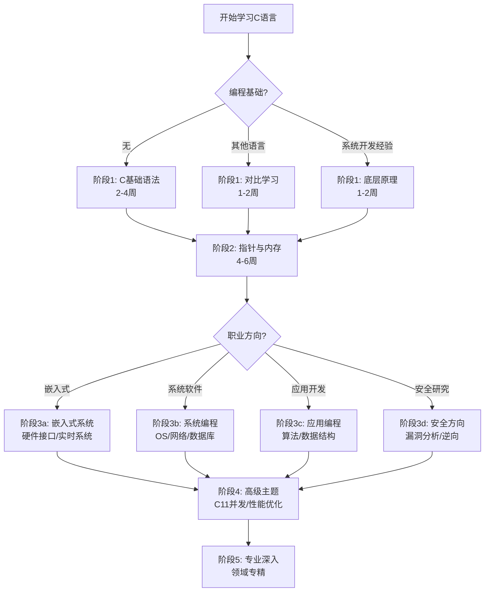

# C语言学习路径与技术选型决策树

> **思维表征方式**: 决策树图
> **用途**: 指导学习路径、技术选型、问题解决策略
> **更新**: 2025-03-09 - 基于重构后的知识体系

---

## 1. 学习路径总决策树



---

## 2. 数据类型选择决策树

```
需要存储什么类型的数据？
├── 整数
│   ├── 范围确定？
│   │   ├── 0-255 → uint8_t
│   │   ├── -128~127 → int8_t
│   │   ├── 0-65535 → uint16_t
│   │   ├── 大整数 → uint32_t/int64_t
│   │   └── 指针运算 → size_t/ptrdiff_t
│   └── 是否需要精确宽度？
│       ├── 是 → <stdint.h>定宽类型
│       └── 否 → int/long（注意平台差异）
│
├── 浮点数
│   ├── 性能优先？ → float
│   ├── 精度优先？ → double
│   ├── 金融计算？
│   │   ├── C11+ → _Decimal64
│   │   └── 通用 → 整数分单位存储
│   └── 特殊值需要？
│       ├── NaN/Inf处理
│       └── 不要直接比较相等
│
└── 布尔值
    ├── C99+ → bool (stdbool.h)
    └── C89 → int (0/1)
```

---

## 3. 内存分配策略决策树

```
需要分配内存？
├── 大小在编译时已知？
│   ├── 生命周期 = 函数 → 栈数组（最大数MB）
│   │   └── 注意：避免大数组导致栈溢出
│   └── 生命周期 = 程序 → 静态数组
│
├── 运行时确定大小？
│   ├── 是否需要零初始化？
│   │   ├── 是 → calloc
│   │   └── 否 → malloc
│   │
│   ├── 需要对齐（SIMD/DMA）？
│   │   └── C11+ → aligned_alloc
│   │
│   ├── 可能后续扩展？
│   │   └── 设计时预留空间或做好realloc准备
│   │
│   └── 释放策略？
│       ├── 同函数内释放 → 简单free
│       ├── 复杂生命周期 → 封装所有权
│       └── 频繁分配 → 考虑内存池
│
└── 字符串缓冲区？
    ├── 最大长度已知 → 栈数组 + 截断检查
    └── 长度未知 → 动态分配 + 扩容逻辑
```

---

## 4. 并发策略决策树

```
需要并发？
├── 多进程
│   ├── 独立地址空间 → fork/exec
│   └── 需要通信 → 管道/共享内存
│       └── 注意：共享内存需要同步
│
└── 多线程
    ├── 简单计数/标志 → C11原子操作
    │   └── _Atomic + memory_order
    │
    ├── 复杂共享数据 → 互斥锁
    │   ├── 多读一写 → 考虑读写锁
    │   └── 高竞争 → 考虑无锁结构
    │
    ├── 生产者-消费者 → 条件变量
    │   └── mtx + cnd 组合
    │
    └── 需要等待多个事件？
        ├── 简单 → 条件变量广播
        └── 复杂 → 考虑事件循环/选择

性能考虑：
- 线程切换开销 ~1-10μs
- 锁竞争严重时性能下降
- 伪共享：避免同缓存行修改
```

---

## 5. 调试策略决策树

```
程序出现问题？
├── 崩溃/段错误
│   ├── 使用调试器
│   │   ├── GDB: bt查看调用栈
│   │   └── LLDB: 类似功能
│   ├── 内存检查
│   │   ├── ASan: use-after-free, overflow
│   │   ├── Valgrind: 内存泄漏
│   │   └── 检查null指针解引用
│   └── 静态分析
│       └── 编译器警告 -Wall -Wextra
│
├── 逻辑错误
│   ├── 单元测试 → 隔离问题
│   ├── 断言 → 检查不变量
│   ├── 日志 → 追踪执行流程
│   └── 代码审查 → 逻辑漏洞
│
└── 性能问题
    ├── Profiler定位热点
    │   ├── perf (Linux)
    │   ├── Instruments (macOS)
    │   └── VTune (Intel)
    ├── 缓存分析
    │   ├── cache misses
    │   └── 访问模式优化
    └── 算法优化
        └── 复杂度分析
```

---

## 6. 字符串处理决策树

```
需要处理字符串？
├── 固定长度已知
│   └── 栈数组 + strncpy + 手动补\0
│
├── 动态长度
│   ├── C11+可选
│   │   └── strcpy_s等安全函数
│   ├── 通用方案
│   │   ├── 自定义safe_strcpy
│   │   └── 使用已验证的库
│   └── 关键安全
│       ├── 绝不使用gets
│       ├── scanf限制宽度%99s
│       └── 格式化字符串用户可控？
│           ├── 是 → 严重漏洞！
│           └── 否 → 固定格式
│
└── 性能敏感
    ├── 频繁小字符串 → 短字符串优化(SSO)
    ├── 大量字符串 → 字符串池
    └── 比较频繁 → 哈希缓存
```

---

## 7. 函数设计决策树

```
设计函数接口？
├── 参数传递方式
│   ├── 小对象（<=2指针大小）→ 值传递
│   ├── 大对象 → const指针传递
│   ├── 需要修改 → 指针传递
│   └── 可选参数 → 可NULL指针
│
├── 返回值设计
│   ├── 成功/失败 → 错误码/Result类型
│   ├── 返回对象
│   │   ├── 小对象 → 值返回
│   │   ├── 大对象 → 调用者分配
│   │   └── 动态分配 → 明确所有权
│   └── 多返回值 → 结构体或输出参数
│
├── 内存所有权
│   ├── 输入参数
│   │   └── 函数不释放，不长期持有
│   ├── 输出参数
│   │   └── 明确调用者负责释放
│   └── 返回值
│       └── 明确谁负责释放
│
└── 线程安全
    ├── 纯函数（无副作用）→ 天然线程安全
    ├── 共享状态 → 需要同步
    └── 线程局部存储 → _Thread_local
```

---

## 8. 错误处理决策树

```
函数可能失败？
├── 错误类型
│   ├── 编程错误（前置条件违反）
│   │   └── assert（debug模式）
│   ├── 运行时错误（资源不足）
│   │   └── 返回错误码
│   └── 外部错误（IO/网络）
│       └── 异常安全设计
│
├── 错误传播
│   ├── 立即处理
│   │   └── 能恢复就恢复
│   ├── 向上传播
│   │   ├── 链式返回（goto cleanup）
│   │   └── 宏包装（TRY/THROW模拟）
│   └── 终止程序
│       └── 不可恢复错误
│
└── 资源清理
    ├── 单一资源
    │   └── goto cleanup模式
    ├── 多资源
    │   └── 嵌套if或封装
    └── C++RAII风格
        └── 自定义guard结构
```

---

## 9. 性能优化决策树

```
需要优化性能？
├── 算法层面
│   ├── 复杂度分析 → O(n)改O(log n)
│   ├── 数据结构 → 选择合适结构
│   └── 缓存友好 → SoA vs AoS
│
├── 编译器优化
│   ├── -O2 常规优化
│   ├── -O3 激进优化（注意调试困难）
│   ├── -march=native CPU特化
│   └── PGO 反馈优化
│
├── 代码层面
│   ├── 循环优化
│   │   ├── 展开
│   │   ├── 向量化SIMD
│   │   └── 减少分支
│   ├── 内联关键函数
│   └── 避免浮点转换
│
└── 系统层面
    ├── I/O优化
    │   ├── 缓冲
    │   ├── 批量读写
    │   └── mmap大文件
    ├── 多线程并行
    └── 异步非阻塞

⚠️ 先profile再优化！
```

---

## 10. 工具选择决策树

```
需要什么工具？
├── 代码编辑
│   ├── IDE → VSCode + C/C++扩展
│   ├── Vim/Emacs → LSP配置
│   └── CLion → 商业但强大
│
├── 编译
│   ├── GCC → 通用，优化好
│   ├── Clang → 警告好，工具链好
│   └── MSVC → Windows开发
│
├── 调试
│   ├── GDB → 功能全面
│   ├── LLDB → Clang配套
│   └── IDE集成 → 图形化
│
├── 分析
│   ├── 静态 → Clang SA, CodeQL
│   ├── 内存 → ASan, Valgrind
│   └── 性能 → perf, VTune
│
└── 构建
    ├── 简单项目 → Make
    ├── 跨平台 → CMake
    ├── 现代 → Meson
    └── 大型 → Bazel
```

---

## ✅ 使用建议

1. **学习路径**：根据自身背景选择合适起点，不要跳过指针内存基础
2. **技术选型**：没有银弹，根据场景权衡
3. **调试问题**：从简单到复杂，先静态后动态
4. **性能优化**：先profile定位瓶颈，避免过早优化

---

> **更新记录**
>
> - 2025-03-09: 重构完成，新增10个决策树，覆盖学习、开发、调试全流程


---

## 深入理解

### 核心原理

深入探讨技术原理和实现细节。

### 实践应用

- 应用场景1
- 应用场景2
- 应用场景3

### 最佳实践

1. 理解基础概念
2. 掌握核心机制
3. 应用到实际项目

---

> **最后更新**: 2026-03-21  
> **维护者**: AI Code Review
