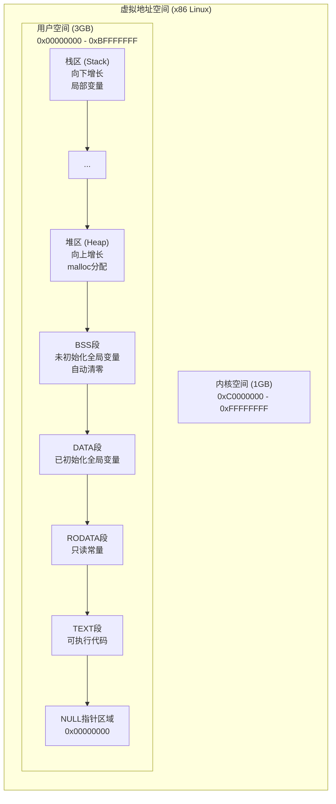

---

## 🔗 文档关联

### 核心关联
| 文档 | 关系类型 | 说明 |
|:-----|:---------|:-----|
| [内存管理](../../../01_Core_Knowledge_System/02_Core_Layer/02_Memory_Management.md) | 核心关联 | 内存管理基础 |
| [指针深度](../../../01_Core_Knowledge_System/02_Core_Layer/01_Pointer_Depth.md) | 核心关联 | 指针深度基础 |
| [并发编程](../../../03_System_Technology_Domains/14_Concurrency_Parallelism/README.md) | 核心关联 | 并发编程基础 |
| [数据类型](../../../01_Core_Knowledge_System/01_Basic_Layer/02_Data_Type_System.md) | 核心关联 | 数据类型基础 |
| [数组与指针](../../../01_Core_Knowledge_System/02_Core_Layer/05_Arrays_Pointers.md) | 核心关联 | 数组与指针基础 |

### 扩展阅读
| 文档 | 关系类型 | 说明 |
|:-----|:---------|:-----|
| [软件工程](../../../01_Core_Knowledge_System/05_Engineering_Layer/README.md) | 核心关联 | 软件工程基础 |
| [形式语义](../../../02_Formal_Semantics_and_Physics/README.md) | 核心关联 | 形式语义基础 |
| [系统技术](../../../03_System_Technology_Domains/README.md) | 核心关联 | 系统技术基础 |
| [工业场景](../../../04_Industrial_Scenarios/README.md) | 核心关联 | 工业场景基础 |
| [思维表征](../../../06_Thinking_Representation/README.md) | 核心关联 | 思维表征基础 |
# C内存模型思维导图详解


---

## 📑 目录

- [C内存模型思维导图详解](#c内存模型思维导图详解)
  - [📑 目录](#-目录)
  - [概述](#概述)
  - [1. C程序内存布局全景](#1-c程序内存布局全景)
    - [1.1 经典内存布局图](#11-经典内存布局图)
    - [1.2 各段详细说明](#12-各段详细说明)
  - [2. 存储期(Storage Duration)](#2-存储期storage-duration)
    - [2.1 四种存储期对比](#21-四种存储期对比)
    - [2.2 存储期与作用域的关系](#22-存储期与作用域的关系)
  - [3. 对齐和填充](#3-对齐和填充)
    - [3.1 对齐原理](#31-对齐原理)
    - [3.2 结构体填充示例](#32-结构体填充示例)
    - [3.3 对齐图表](#33-对齐图表)
  - [4. 虚拟内存和MMU](#4-虚拟内存和mmu)
    - [4.1 虚拟内存原理](#41-虚拟内存原理)
    - [4.2 地址转换流程](#42-地址转换流程)
  - [5. 内存布局探测代码](#5-内存布局探测代码)
    - [5.1 完整探测程序](#51-完整探测程序)
    - [5.2 内存布局可视化](#52-内存布局可视化)
  - [6. 内存管理最佳实践](#6-内存管理最佳实践)
    - [6.1 代码优化建议](#61-代码优化建议)
    - [6.2 常见问题排查](#62-常见问题排查)
  - [总结](#总结)
  - [深入理解](#深入理解)
    - [核心原理](#核心原理)
    - [实践应用](#实践应用)
    - [最佳实践](#最佳实践)


---

## 概述

本文档通过思维导图、图表和代码示例详细解析C语言的内存模型，帮助深入理解内存布局、存储期、对齐机制以及虚拟内存系统。

---

## 1. C程序内存布局全景

### 1.1 经典内存布局图

```text
┌─────────────────────────────────────────────────────────────────┐
│                      高地址 (0xFFFFFFFF)                          │
├─────────────────────────────────────────────────────────────────┤
│                                                                 │
│  ┌─────────────────────────┐                                    │
│  │      命令行参数          │  argv, argc                        │
│  │    环境变量 (envp)       │                                    │
│  └─────────────────────────┘                                    │
│                                                                 │
│  ┌─────────────────────────┐  ▲  向下增长 (地址减小)             │
│  │                         │  │                                  │
│  │         栈区            │  │  局部变量、函数参数               │
│  │       (Stack)           │  │  返回地址、寄存器保存             │
│  │                         │  │                                  │
│  ├─────────────────────────┤  │                                  │
│  │        未使用            │  │                                  │
│  ├─────────────────────────┤  │                                  │
│  │                         │  │                                  │
│  │         堆区            │  │  向上增长 (地址增加)              │
│  │       (Heap)            │  │  malloc/calloc/realloc           │
│  │                         │  │  free释放                         │
│  ├─────────────────────────┤  ▼                                  │
│  │       .bss段            │  未初始化的全局/静态变量            │
│  │    (未初始化数据)        │  自动初始化为0                     │
│  ├─────────────────────────┤                                     │
│  │       .data段           │  已初始化的全局/静态变量            │
│  │    (已初始化数据)        │  非零初始值                         │
│  ├─────────────────────────┤                                     │
│  │       .rodata段         │  常量字符串、const修饰的全局变量     │
│  │    (只读数据)            │  程序运行时不可修改                  │
│  ├─────────────────────────┤                                     │
│  │       .text段           │  机器代码、函数体                   │
│  │    (代码段)              │  通常是只读的                        │
│  └─────────────────────────┘                                     │
│                                                                 │
├─────────────────────────────────────────────────────────────────┤
│                      低地址 (0x08048000)                         │
└─────────────────────────────────────────────────────────────────┘
```

### 1.2 各段详细说明

| 段 | 内容 | 生命周期 | 初始化 | 访问权限 |
|----|------|----------|--------|----------|
| **text** | 可执行代码 | 程序运行期间 | 编译时确定 | 读+执行 |
| **rodata** | 常量数据 | 程序运行期间 | 编译时确定 | 只读 |
| **data** | 已初始化全局/静态变量 | 程序运行期间 | 程序启动时 | 读+写 |
| **bss** | 未初始化全局/静态变量 | 程序运行期间 | 零初始化 | 读+写 |
| **heap** | 动态分配内存 | malloc~free | 未初始化 | 读+写 |
| **stack** | 局部变量 | 进入~离开作用域 | 未初始化 | 读+写 |

---

## 2. 存储期(Storage Duration)

### 2.1 四种存储期对比

```text
┌─────────────────────────────────────────────────────────────────┐
│                     C语言四种存储期                             │
├─────────────────────────────────────────────────────────────────┤
│                                                                 │
│  ┌──────────────────────────────────────────────────────────┐  │
│  │ 1. 自动存储期 (Automatic)                                 │  │
│  │    ─────────────────────                                  │  │
│  │    • 关键字: 默认(局部变量), auto(C11起弃用)               │  │
│  │    • 分配: 进入块时分配，退出块时释放                      │  │
│  │    • 位置: 栈区                                           │  │
│  │    • 初始化: 不自动初始化(未定义值)                        │  │
│  │                                                           │  │
│  │    void func() {                                          │  │
│  │        int x = 10;      // 自动存储期                      │  │
│  │        auto int y = 20; // 显式auto(C11前有效)             │  │
│  │    } // x, y 在此处销毁                                    │  │
│  │                                                           │  │
│  └──────────────────────────────────────────────────────────┘  │
│                                                                 │
│  ┌──────────────────────────────────────────────────────────┐  │
│  │ 2. 静态存储期 (Static)                                    │  │
│  │    ───────────────────                                    │  │
│  │    • 关键字: static, 全局变量                             │  │
│  │    • 分配: 程序启动时分配，程序结束时释放                  │  │
│  │    • 位置: .data(已初始化) 或 .bss(未初始化)               │  │
│  │    • 初始化: 零初始化或显式初始化                          │  │
│  │    • 链接属性: 内部链接(static) 或 外部链接(全局)          │  │
│  │                                                           │  │
│  │    static int count = 0;  // 静态存储期, 内部链接         │  │
│  │    int global;            // 静态存储期, 外部链接         │  │
│  │                                                           │  │
│  └──────────────────────────────────────────────────────────┘  │
│                                                                 │
│  ┌──────────────────────────────────────────────────────────┐  │
│  │ 3. 动态存储期 (Dynamic)                                   │  │
│  │    ────────────────────                                   │  │
│  │    • 关键字: malloc, calloc, realloc, free                │  │
│  │    • 分配: 显式调用malloc时分配                            │  │
│  │    • 释放: 显式调用free或程序结束                          │  │
│  │    • 位置: 堆区                                           │  │
│  │    • 初始化: 未初始化(malloc)或零初始化(calloc)            │  │
│  │                                                           │  │
│  │    int *p = malloc(sizeof(int) * 100);  // 分配           │  │
│  │    if (p) {                                               │  │
│  │        // 使用...                                          │  │
│  │        free(p);  // 必须显式释放                           │  │
│  │    }                                                       │  │
│  │                                                           │  │
│  └──────────────────────────────────────────────────────────┘  │
│                                                                 │
│  ┌──────────────────────────────────────────────────────────┐  │
│  │ 4. 线程存储期 (Thread)                                    │  │
│  │    ───────────────────                                    │  │
│  │    • 关键字: _Thread_local (C11), thread_local (C23)      │  │
│  │    • 分配: 线程创建时分配，线程结束时释放                  │  │
│  │    • 位置: 线程局部存储区(TLS)                             │  │
│  │    • 初始化: 零初始化或显式初始化                          │  │
│  │    • 注意: 每个线程有独立实例                              │  │
│  │                                                           │  │
│  │    _Thread_local int thread_counter = 0;                  │  │
│  │    // 每个线程有自己的thread_counter副本                   │  │
│  │                                                           │  │
│  └──────────────────────────────────────────────────────────┘  │
│                                                                 │
└─────────────────────────────────────────────────────────────────┘
```

### 2.2 存储期与作用域的关系


---

## 3. 对齐和填充

### 3.1 对齐原理

```text
┌─────────────────────────────────────────────────────────────────┐
│                     内存对齐原理                                 │
├─────────────────────────────────────────────────────────────────┤
│                                                                 │
│  为什么需要对齐?                                                 │
│  ──────────────                                                  │
│  1. 硬件限制: 某些架构只能访问对齐的地址                          │
│  2. 性能优化: 未对齐访问可能需要多次内存读取                       │
│  3. 原子操作: 某些原子操作要求对齐                                │
│                                                                 │
│  对齐规则:                                                       │
│  ─────────                                                       │
│  • 基本类型的地址必须是其大小的倍数                               │
│  • char: 任意地址 (对齐值=1)                                     │
│  • short: 2字节边界 (对齐值=2)                                   │
│  • int/float: 4字节边界 (对齐值=4)                               │
│  • double/pointer: 8字节边界 (对齐值=8)                          │
│  • long double: 16字节边界 (对齐值=16)                           │
│                                                                 │
│  示例:                                                           │
│  ┌─────────┬─────────┬─────────┬─────────┬─────────┐            │
│  │  0x00   │  0x01   │  0x02   │  0x03   │  0x04   │            │
│  └────┬────┴─────────┴────┬────┴─────────┴────┬────┘            │
│       │                   │                   │                  │
│       ▼                   ▼                   ▼                  │
│     char(OK)           int(OK)              int(OK)              │
│     任意地址         4字节边界              4字节边界             │
│                                                                 │
│       ┌───────────────────┐                                     │
│       ▼                   ▼                                     │
│     int(未对齐!)  需要两次读取                                   │
│     跨越4字节边界                                               │
│                                                                 │
└─────────────────────────────────────────────────────────────────┘
```

### 3.2 结构体填充示例

```c
/* 对齐和填充示例代码 */
#include <stdio.h>
#include <stddef.h>
#include <stdalign.h>

/* 未优化的结构体 - 存在填充 */
struct Unoptimized {
    char  c;    // 1字节, 偏移0
    // 3字节填充 (int需要4字节对齐)
    int   i;    // 4字节, 偏移4
    short s;    // 2字节, 偏移8
    // 2字节填充 (结构体总大小需是最严格对齐的倍数)
};              // 总大小: 12字节

/* 优化后的结构体 - 重新排序减少填充 */
struct Optimized {
    int   i;    // 4字节, 偏移0
    short s;    // 2字节, 偏移4
    char  c;    // 1字节, 偏移6
    // 1字节填充
};              // 总大小: 8字节

/* 紧凑结构体 - 使用packed属性 */
struct __attribute__((packed)) Packed {
    char  c;    // 1字节, 偏移0
    int   i;    // 4字节, 偏移1 (未对齐!)
    short s;    // 2字节, 偏移5
};              // 总大小: 7字节

int main(void) {
    printf("=== Alignment and Padding Demo ===\n\n");

    /* 基本类型对齐 */
    printf("Basic Type Alignments:\n");
    printf("  alignof(char)      = %zu\n", alignof(char));
    printf("  alignof(short)     = %zu\n", alignof(short));
    printf("  alignof(int)       = %zu\n", alignof(int));
    printf("  alignof(long)      = %zu\n", alignof(long));
    printf("  alignof(float)     = %zu\n", alignof(float));
    printf("  alignof(double)    = %zu\n", alignof(double));
    printf("  alignof(void*)     = %zu\n", alignof(void*));

    /* 结构体大小 */
    printf("\nStruct Sizes:\n");
    printf("  sizeof(Unoptimized) = %zu\n", sizeof(struct Unoptimized));
    printf("  sizeof(Optimized)   = %zu\n", sizeof(struct Optimized));
    printf("  sizeof(Packed)      = %zu\n", sizeof(struct Packed));

    /* 字段偏移 */
    printf("\nField Offsets (Unoptimized):\n");
    printf("  offsetof(c) = %zu\n", offsetof(struct Unoptimized, c));
    printf("  offsetof(i) = %zu\n", offsetof(struct Unoptimized, i));
    printf("  offsetof(s) = %zu\n", offsetof(struct Unoptimized, s));

    printf("\nField Offsets (Optimized):\n");
    printf("  offsetof(i) = %zu\n", offsetof(struct Optimized, i));
    printf("  offsetof(s) = %zu\n", offsetof(struct Optimized, s));
    printf("  offsetof(c) = %zu\n", offsetof(struct Optimized, c));

    /* 结构体对齐 */
    printf("\nStruct Alignments:\n");
    printf("  alignof(Unoptimized) = %zu\n", alignof(struct Unoptimized));
    printf("  alignof(Optimized)   = %zu\n", alignof(struct Optimized));
    printf("  alignof(Packed)      = %zu\n", alignof(struct Packed));

    return 0;
}
```

### 3.3 对齐图表

```text
┌─────────────────────────────────────────────────────────────────┐
│                  结构体内存布局对比                              │
├─────────────────────────────────────────────────────────────────┤
│                                                                 │
│  struct Unoptimized (12字节)                                    │
│  ┌────┬────┬────┬────┬────┬────┬────┬────┬────┬────┬────┬────┐ │
│  │ c  │pad │pad │pad │  i (4字节)  │    s (2字节)   │pad │pad │ │
│  │0x00│0x01│0x02│0x03│0x04│0x05│0x06│0x07│0x08│0x09│0x0A│0x0B│ │
│  └────┴────┴────┴────┴────┴────┴────┴────┴────┴────┴────┴────┘ │
│                                                                 │
│  struct Optimized (8字节)                                       │
│  ┌────┬────┬────┬────┬────┬────┬────┬────┐                      │
│  │      i (4字节)     │  s (2字节) │ c  │pad │                   │
│  │0x00│0x01│0x02│0x03│0x04│0x05│0x06│0x07│                      │
│  └────┴────┴────┴────┴────┴────┴────┴────┘                      │
│                                                                 │
│  节省: 12 - 8 = 4字节 (33%减少)                                 │
│                                                                 │
│  struct Packed (7字节, 未对齐)                                  │
│  ┌────┬────┬────┬────┬────┬────┬────┐                           │
│  │ c  │      i (4字节)     │  s (2字节)  │                        │
│  │0x00│0x01│0x02│0x03│0x04│0x05│0x06│                           │
│  └────┴────┴────┴────┴────┴────┴────┘                           │
│                                                                 │
│  ⚠️ 注意: Packed结构体可能有性能损失                              │
│                                                                 │
└─────────────────────────────────────────────────────────────────┘
```

---

## 4. 虚拟内存和MMU

### 4.1 虚拟内存原理

```text
┌─────────────────────────────────────────────────────────────────┐
│                    虚拟内存系统架构                              │
├─────────────────────────────────────────────────────────────────┤
│                                                                 │
│                    进程视角 (虚拟地址空间)                        │
│  ┌─────────────────────────────────────────────────────────┐   │
│  │                    用户空间 (3GB)                        │   │
│  │  ┌─────────────┐ 0xC0000000                             │   │
│  │  │    栈       │ ↓ 向下增长                              │   │
│  │  ├─────────────┤                                        │   │
│  │  │    ...      │                                        │   │
│  │  ├─────────────┤                                        │   │
│  │  │    堆       │ ↑ 向上增长                              │   │
│  │  ├─────────────┤                                        │   │
│  │  │   .bss      │                                        │   │
│  │  ├─────────────┤                                        │   │
│  │  │   .data     │                                        │   │
│  │  ├─────────────┤                                        │   │
│  │  │  .rodata    │                                        │   │
│  │  ├─────────────┤                                        │   │
│  │  │   .text     │                                        │   │
│  │  └─────────────┘ 0x08048000                             │   │
│  │  ├─────────────┤                                        │   │
│  │  │   保留      │ NULL指针区域                            │   │
│  │  └─────────────┘ 0x00000000                             │   │
│  └─────────────────────────────────────────────────────────┘   │
│                              │                                  │
│                              ▼ MMU地址转换                      │
│  ┌─────────────────────────────────────────────────────────┐   │
│  │                    内核空间 (1GB)                        │   │
│  │  ┌─────────────┐ 0xFFFFFFFF                             │   │
│  │  │  内核代码   │                                        │   │
│  │  ├─────────────┤                                        │   │
│  │  │  内核数据   │                                        │   │
│  │  ├─────────────┤                                        │   │
│  │  │  物理内存   │ 直接映射                                │   │
│  │  │  映射区     │                                        │   │
│  │  │  (896MB)   │                                        │   │
│  │  └─────────────┘ 0xC0000000                             │   │
│  └─────────────────────────────────────────────────────────┘   │
│                                                                 │
└─────────────────────────────────────────────────────────────────┘
```

### 4.2 地址转换流程

```text
┌─────────────────────────────────────────────────────────────────┐
│                虚拟地址到物理地址转换                            │
├─────────────────────────────────────────────────────────────────┤
│                                                                 │
│  虚拟地址 (32位)                                                │
│  ┌────────────┬────────────┬────────────────┐                   │
│  │  页目录索引 │  页表索引   │    页内偏移     │                   │
│  │  (10位)    │   (10位)   │    (12位)       │                   │
│  └──────┬─────┴─────┬──────┴────────┬───────┘                   │
│         │           │               │                           │
│         ▼           ▼               │                           │
│  ┌──────────┐  ┌──────────┐         │                           │
│  │  CR3寄存器│  │ 页表基址  │         │                           │
│  │(页目录基址)│──▶(来自PDE) │         │                           │
│  └────┬─────┘  └────┬─────┘         │                           │
│       │             │               │                           │
│       ▼             ▼               │                           │
│  ┌─────────────────────────────┐    │                           │
│  │        页目录 (PDE)          │    │                           │
│  │  ┌─────────────────────┐    │    │                           │
│  │  │ 索引=页目录索引      │───┼────┘                           │
│  │  │ PDE = 页表物理基址   │    │                               │
│  │  │  + 标志位            │    │                               │
│  │  └─────────────────────┘    │                                │
│  └─────────────┬───────────────┘                                │
│                │                                                │
│                ▼                                                │
│  ┌─────────────────────────────┐                                │
│  │         页表 (PTE)           │                                │
│  │  ┌─────────────────────┐    │                                │
│  │  │ 索引=页表索引        │    │                                │
│  │  │ PTE = 物理页框地址   │────┼────┐                           │
│  │  │  + 标志位            │    │    │                           │
│  │  └─────────────────────┘    │    │                           │
│  └─────────────────────────────┘    │                           │
│                                     │                           │
│                                     ▼                           │
│  ┌───────────────────────────────────────────────────────┐     │
│  │                   物理地址 (32位)                       │     │
│  │  ┌────────────────────┬────────────────┐               │     │
│  │  │  物理页框号 (20位)  │   页内偏移(12位) │               │     │
│  │  │  (来自PTE)         │   (来自VA)      │               │     │
│  │  └────────────────────┴────────────────┘               │     │
│  └───────────────────────────────────────────────────────┘     │
│                                                                 │
│  快表(TLB)缓存:                                                 │
│  最近使用的虚拟页 -> 物理页 映射，避免重复页表遍历                │
│                                                                 │
└─────────────────────────────────────────────────────────────────┘
```

---

## 5. 内存布局探测代码

### 5.1 完整探测程序

```c
/* memory_layout_probe.c - C内存布局探测程序 */
/* 编译: gcc -std=c17 -o memory_layout_probe memory_layout_probe.c */

#include <stdio.h>
#include <stdlib.h>
#include <string.h>
#include <stdint.h>
#include <stdalign.h>

/* 全局变量 - 放在.data段 */
int global_initialized = 42;
const int global_const = 100;

/* 未初始化全局变量 - 放在.bss段 */
int global_uninitialized;
static int static_global;

/* 字符串常量 - 放在.rodata段 */
const char *hello = "Hello, World!";

/* 函数 - 放在.text段 */
void sample_function(void) {
    static int static_local = 0;  /* .data段 */
    static int static_local_uninit; /* .bss段 */
    int local_auto;               /* 栈 */

    (void)static_local;
    (void)static_local_uninit;
    (void)local_auto;
}

/* 打印内存区域宏 */
#define PRINT_REGION(name, addr) \
    printf("  %-20s: %p\n", name, (void *)(addr))

#define PRINT_REGION_RANGE(name, start, end) \
    printf("  %-20s: %p - %p (size: %zu bytes)\n", \
           name, (void *)(start), (void *)(end), \
           (size_t)((uintptr_t)(end) - (uintptr_t)(start)))

int main(int argc, char *argv[]) {
    (void)argc;

    /* 局部变量 - 栈 */
    int local_var = 123;
    char local_array[256];
    const int local_const = 456;

    /* 动态分配 - 堆 */
    int *heap_var = malloc(sizeof(int));
    char *heap_array = malloc(1024);

    printf("╔═══════════════════════════════════════════════════════════════╗\n");
    printf("║              C Memory Layout Probe (C17 Standard)              ║\n");
    printf("╚═══════════════════════════════════════════════════════════════╝\n\n");

    /* 命令行参数和环境变量 */
    printf("[High Address] Command Line & Environment\n");
    PRINT_REGION("argv[0]", argv[0]);
    PRINT_REGION("argv", argv);
    PRINT_REGION("environ", getenv("PATH"));
    printf("\n");

    /* 栈区 */
    printf("[Stack Segment] (grows downward)\n");
    int stack_marker1;
    int stack_marker2;
    PRINT_REGION("main local_var", &local_var);
    PRINT_REGION("main local_array", local_array);
    PRINT_REGION("main local_const", &local_const);
    PRINT_REGION("stack_marker1", &stack_marker1);
    PRINT_REGION("stack_marker2", &stack_marker2);
    printf("  Stack direction: %s\n",
           (&stack_marker1 > &stack_marker2) ? "Downward" : "Upward");
    printf("\n");

    /* 堆区 */
    printf("[Heap Segment] (grows upward)\n");
    PRINT_REGION("heap_var", heap_var);
    PRINT_REGION("heap_array", heap_array);
    printf("\n");

    /* BSS段 */
    printf("[.bss Segment] (uninitialized data)\n");
    PRINT_REGION("global_uninitialized", &global_uninitialized);
    PRINT_REGION("static_global", &static_global);
    printf("  Value check (should be 0): global_uninitialized=%d, static_global=%d\n",
           global_uninitialized, static_global);
    printf("\n");

    /* Data段 */
    printf("[.data Segment] (initialized data)\n");
    PRINT_REGION("global_initialized", &global_initialized);
    printf("  Value: %d\n", global_initialized);
    printf("\n");

    /* 只读数据段 */
    printf("[.rodata Segment] (read-only data)\n");
    PRINT_REGION("global_const", &global_const);
    PRINT_REGION("hello string", hello);
    PRINT_REGION("hello pointer", &hello);
    printf("\n");

    /* 代码段 */
    printf("[.text Segment] (code)\n");
    PRINT_REGION("main function", main);
    PRINT_REGION("sample_function", sample_function);
    PRINT_REGION("printf function", printf);
    printf("\n");

    /* 函数指针测试 */
    printf("[Function Pointer Test]\n");
    void (*func_ptr)(void) = sample_function;
    PRINT_REGION("func_ptr", func_ptr);
    printf("\n");

    /* 内存区域顺序分析 */
    printf("[Memory Layout Summary]\n");

    uintptr_t text_start = (uintptr_t)main & ~0xFFF;
    uintptr_t stack_top = (uintptr_t)&stack_marker1;
    uintptr_t heap_start = (uintptr_t)heap_var;

    printf("  Text segment base:   %p\n", (void *)text_start);
    printf("  Heap start:          %p\n", (void *)heap_start);
    printf("  Stack top:           %p\n", (void *)stack_top);
    printf("\n");

    /* 对齐信息 */
    printf("[Alignment Information]\n");
    printf("  alignof(char)      = %2zu, sizeof = %zu\n",
           alignof(char), sizeof(char));
    printf("  alignof(short)     = %2zu, sizeof = %zu\n",
           alignof(short), sizeof(short));
    printf("  alignof(int)       = %2zu, sizeof = %zu\n",
           alignof(int), sizeof(int));
    printf("  alignof(long)      = %2zu, sizeof = %zu\n",
           alignof(long), sizeof(long));
    printf("  alignof(long long) = %2zu, sizeof = %zu\n",
           alignof(long long), sizeof(long long));
    printf("  alignof(float)     = %2zu, sizeof = %zu\n",
           alignof(float), sizeof(float));
    printf("  alignof(double)    = %2zu, sizeof = %zu\n",
           alignof(double), sizeof(double));
    printf("  alignof(void*)     = %2zu, sizeof = %zu\n",
           alignof(void*), sizeof(void*));
    printf("\n");

    /* 结构体布局演示 */
    printf("[Struct Layout Demo]\n");

    struct TestStruct {
        char a;
        int b;
        short c;
        char d;
    };

    printf("  struct { char a; int b; short c; char d; }\n");
    printf("  sizeof(TestStruct)  = %zu\n", sizeof(struct TestStruct));
    printf("  alignof(TestStruct) = %zu\n", alignof(struct TestStruct));

    struct TestStruct ts;
    printf("  Offset of a: %zu\n", (size_t)((char *)&ts.a - (char *)&ts));
    printf("  Offset of b: %zu\n", (size_t)((char *)&ts.b - (char *)&ts));
    printf("  Offset of c: %zu\n", (size_t)((char *)&ts.c - (char *)&ts));
    printf("  Offset of d: %zu\n", (size_t)((char *)&ts.d - (char *)&ts));
    printf("\n");

    /* 清理 */
    free(heap_var);
    free(heap_array);

    printf("Memory layout probe completed.\n");
    return 0;
}
```

### 5.2 内存布局可视化



---

## 6. 内存管理最佳实践

### 6.1 代码优化建议

```text
┌─────────────────────────────────────────────────────────────────┐
│                     内存优化最佳实践                             │
├─────────────────────────────────────────────────────────────────┤
│                                                                 │
│  1. 结构体优化                                                   │
│     ───────────                                                  │
│     • 按成员大小降序排列，减少填充                                │
│     • 使用 #pragma pack 或 __attribute__((packed)) 需谨慎        │
│     • 考虑使用位域压缩布尔标志                                    │
│                                                                 │
│  2. 栈使用优化                                                   │
│     ───────────                                                  │
│     • 避免大数组分配在栈上                                        │
│     • 递归深度控制，防止栈溢出                                    │
│     • 使用 alloca() 需谨慎 (非标准，可能不安全)                   │
│                                                                 │
│  3. 堆使用优化                                                   │
│     ───────────                                                  │
│     • 减少malloc/free调用次数，考虑内存池                         │
│     • 检查返回值，处理分配失败                                    │
│     • 配对使用malloc/free，避免泄漏                               │
│     • 使用 valgrind 检测内存错误                                  │
│                                                                 │
│  4. 缓存友好性                                                   │
│     ───────────                                                  │
│     • 数据局部性：连续访问内存                                    │
│     • 避免伪共享：对齐到缓存行边界                                │
│     • 结构体数组(SoA) vs 数组结构体(AoS)                          │
│                                                                 │
└─────────────────────────────────────────────────────────────────┘
```

### 6.2 常见问题排查

| 问题 | 症状 | 检测工具 | 解决方案 |
|------|------|----------|----------|
| **内存泄漏** | 程序内存持续增长 | valgrind, asan | 确保malloc/free配对 |
| **缓冲区溢出** | 随机崩溃、数据损坏 | valgrind, asan | 使用安全函数，检查边界 |
| **使用已释放内存** | 崩溃、未定义行为 | valgrind | 释放后置NULL |
| **未初始化读取** | 随机行为 | valgrind, msan | 初始化所有变量 |
| **栈溢出** | 段错误、崩溃 | ulimit | 减少栈使用，增大栈限制 |

---

## 总结

本文档全面解析了C语言的内存模型：

1. **内存布局**：text、rodata、data、bss、heap、stack各段的用途和特性
2. **存储期**：自动、静态、动态、线程四种存储期的区别
3. **对齐机制**：内存对齐原理、结构体填充优化方法
4. **虚拟内存**：MMU地址转换、页表机制、TLB缓存
5. **实践代码**：完整的内存布局探测程序

理解C内存模型是编写高效、安全C代码的基础，也是调试复杂内存问题的关键。


---

## 深入理解

### 核心原理

深入探讨技术原理和实现细节。

### 实践应用

- 应用场景1
- 应用场景2
- 应用场景3

### 最佳实践

1. 理解基础概念
2. 掌握核心机制
3. 应用到实际项目

---

> **最后更新**: 2026-03-21
> **维护者**: AI Code Review
