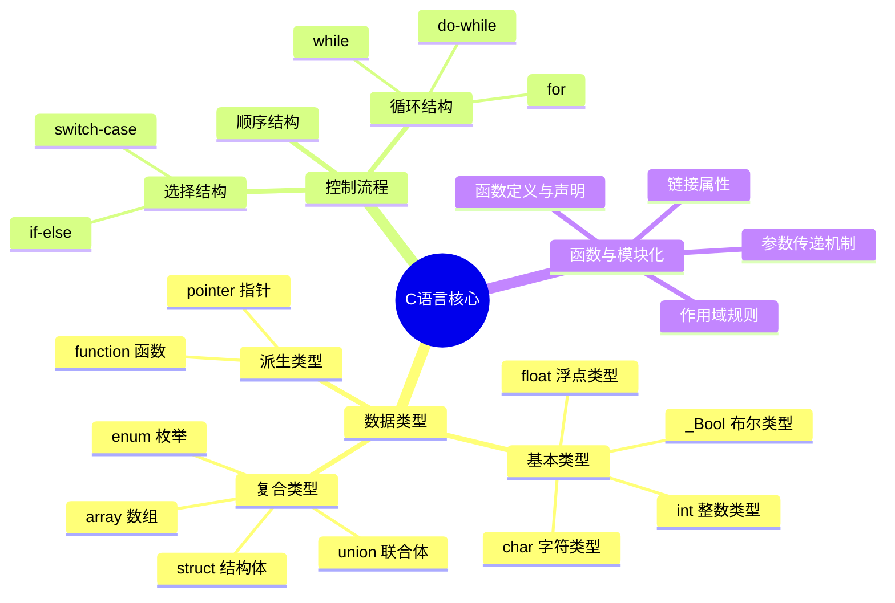
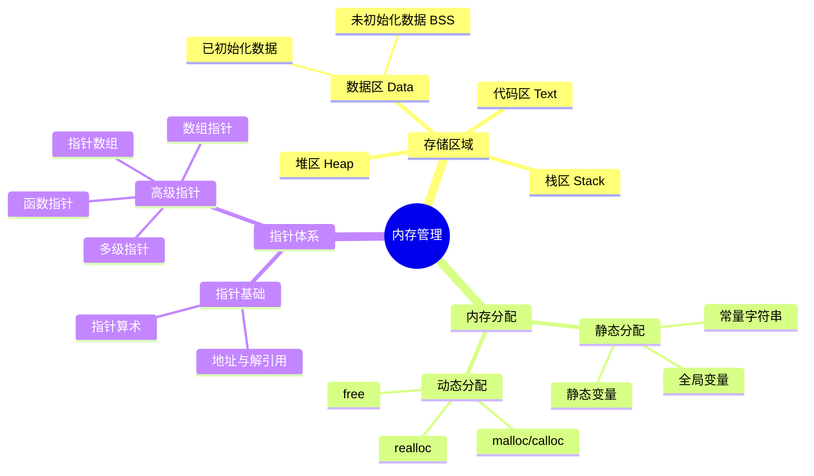
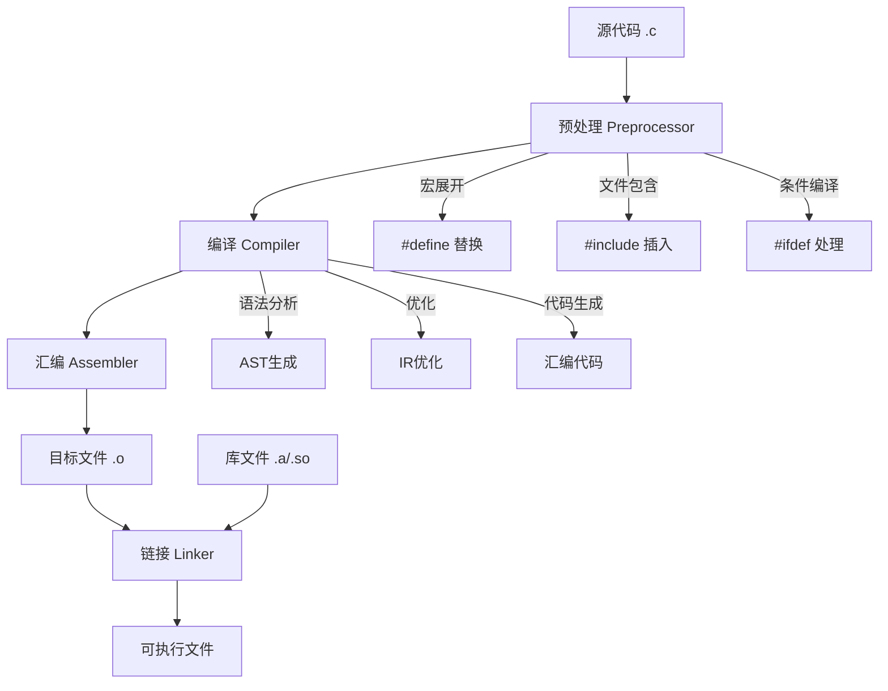
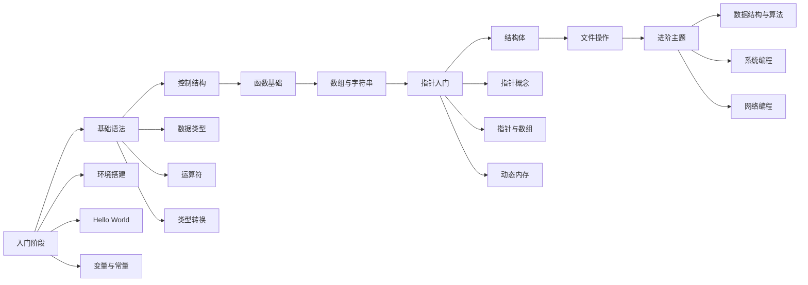
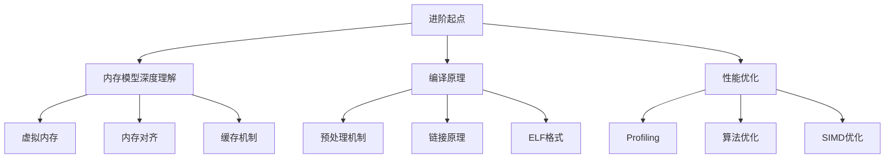

# C语言知识思维导图

> 本目录提供系统化的C语言知识思维导图、概念关系图和学习方法论，帮助学习者建立完整的C语言知识体系。

---

## 📋 目录结构

```
03_Mind_Maps/
├── README.md                    # 本文件：思维导图总览
├── 02_Memory_Model_Map.md       # 内存模型思维导图
└── [其他专题思维导图]            # 各专题详细思维导图
```

---


---

## 📑 目录

- [C语言知识思维导图](#c语言知识思维导图)
  - [📋 目录结构](#-目录结构)
  - [📑 目录](#-目录)
  - [🧠 思维导图方法论](#-思维导图方法论)
    - [为什么需要思维导图学习C语言](#为什么需要思维导图学习c语言)
    - [思维导图设计原则](#思维导图设计原则)
  - [🗺️ C语言核心知识地图](#️-c语言核心知识地图)
    - [1. 语言基础层](#1-语言基础层)
    - [2. 内存管理层](#2-内存管理层)
    - [3. 编译构建层](#3-编译构建层)
  - [📊 概念关系图谱](#-概念关系图谱)
    - [指针与内存的关系网络](#指针与内存的关系网络)
    - [类型系统层级图](#类型系统层级图)
  - [🎯 学习路径思维导图](#-学习路径思维导图)
    - [初学者学习路线](#初学者学习路线)
    - [进阶者深化路线](#进阶者深化路线)
  - [💡 学习方法论](#-学习方法论)
    - [主动学习策略](#主动学习策略)
    - [知识内化流程](#知识内化流程)
  - [📁 本目录文件说明](#-本目录文件说明)
  - [🔗 相关资源](#-相关资源)


---

## 🧠 思维导图方法论

### 为什么需要思维导图学习C语言

C语言作为底层系统编程语言，知识点之间存在复杂的依赖关系。思维导图能够帮助学习者：

1. **建立知识关联** - 理解指针与内存、函数与栈帧的内在联系
2. **把握学习路径** - 明确先学基础语法还是直接深入内存模型
3. **快速查漏补缺** - 通过可视化方式识别知识盲区
4. **构建长期记忆** - 图形化信息比纯文本更易记忆

### 思维导图设计原则

```
┌─────────────────────────────────────────────────────────┐
│                    C语言知识思维导图                      │
│                      设计原则                            │
├─────────────────────────────────────────────────────────┤
│  1. 层次清晰 - 从核心概念向外逐层展开                      │
│  2. 关联明确 - 用连线表示概念间的依赖关系                   │
│  3. 代码佐证 - 每个关键节点配套示例代码                     │
│  4. 难度分级 - 标注初级/中级/高级知识点                     │
│  5. 实用导向 - 强调实际应用场景                            │
└─────────────────────────────────────────────────────────┘
```

---

## 🗺️ C语言核心知识地图

### 1. 语言基础层



### 2. 内存管理层



### 3. 编译构建层



---

## 📊 概念关系图谱

### 指针与内存的关系网络

```
                    ┌─────────────────┐
                    │   指针变量      │
                    │   ptr (栈上)    │
                    └────────┬────────┘
                             │ 存储
                             ▼
                    ┌─────────────────┐
                    │    内存地址     │
                    │   0x7fff...     │
                    └────────┬────────┘
                             │ 指向
                             ▼
        ┌────────────────────────────────────────┐
        │              堆内存区域                 │
        │  ┌─────────────────────────────────┐  │
        │  │  动态分配的数据 (malloc)         │  │
        │  │  int* arr = malloc(100)         │  │
        │  └─────────────────────────────────┘  │
        └────────────────────────────────────────┘
                             ▲
                             │ 解引用
                    ┌────────┴────────┐
                    │   *ptr 访问     │
                    │   实际数据值     │
                    └─────────────────┘
```

### 类型系统层级图

```
┌────────────────────────────────────────────────────────────┐
│                    C语言类型系统金字塔                       │
├────────────────────────────────────────────────────────────┤
│                                                            │
│                    ┌─────────────┐                         │
│                    │   void      │  顶层抽象类型            │
│                    └──────┬──────┘                         │
│                           │                                │
│              ┌────────────┼────────────┐                   │
│              ▼            ▼            ▼                   │
│         ┌────────┐  ┌──────────┐  ┌──────────┐            │
│         │ 标量   │  │  聚合    │  │  函数    │            │
│         │类型    │  │  类型    │  │  类型    │            │
│         └───┬────┘  └────┬─────┘  └────┬─────┘            │
│             │            │             │                  │
│        ┌────┴────┐  ┌────┴────┐  ┌────┴────┐             │
│        ▼         ▼  ▼         ▼  ▼         ▼             │
│    ┌──────┐ ┌──────┐ ┌──────┐ ┌──────┐ ┌──────┐         │
│    │算术  │ │指针  │ │数组  │ │结构体│ │函数  │         │
│    │类型  │ │      │ │      │ │      │ │指针  │         │
│    └──┬───┘ └──────┘ └──────┘ └──────┘ └──────┘         │
│       │                                                  │
│   ┌───┴───┐                                              │
│   ▼       ▼                                              │
│ ┌────┐ ┌────┐                                            │
│ │整数│ │浮点│                                            │
│ └────┘ └────┘                                            │
│                                                            │
└────────────────────────────────────────────────────────────┘
```

---

## 🎯 学习路径思维导图

### 初学者学习路线



### 进阶者深化路线



---

## 💡 学习方法论

### 主动学习策略

| 学习阶段 | 思维导图应用 | 具体方法 |
|---------|-------------|---------|
| 预习阶段 | 构建框架 | 先画整体知识框架，了解全貌 |
| 学习阶段 | 填充细节 | 逐个节点深入学习，添加示例 |
| 复习阶段 | 闭合测试 | 遮盖部分节点，尝试回忆填充 |
| 应用阶段 | 场景映射 | 将知识点映射到实际项目场景 |

### 知识内化流程

```
输入 → 理解 → 结构化 → 可视化 → 实践 → 反馈 → 修正
 │      │       │        │       │      │      │
 ▼      ▼       ▼        ▼       ▼      ▼      ▼
阅读   思考    分类     绘图    编码   测试   更新
文档   原理    归纳     思维    实现   验证   导图
```

---

## 📁 本目录文件说明

| 文件名 | 内容描述 | 适用阶段 |
|-------|---------|---------|
| `02_Memory_Model_Map.md` | 详细内存模型思维导图 | 进阶 |
| `[其他文件]` | 专题思维导图 | 各阶段 |

---

## 🔗 相关资源

- [返回上级目录](../README.md)
- [应用场景树](../04_Application_Scenario_Trees/README.md) - 了解C语言应用领域
- [现代工具链](../../07_Modern_Toolchain/README.md) - 掌握现代C开发工具

---

> 💬 **提示**：思维导图是学习的辅助工具，而非目的本身。建议在学习过程中不断迭代更新自己的思维导图，形成个性化的知识体系。


---

## 深入理解

### 核心原理

深入探讨技术原理和实现细节。

### 实践应用

- 应用场景1
- 应用场景2
- 应用场景3

### 最佳实践

1. 理解基础概念
2. 掌握核心机制
3. 应用到实际项目

---

> **最后更新**: 2026-03-21  
> **维护者**: AI Code Review
