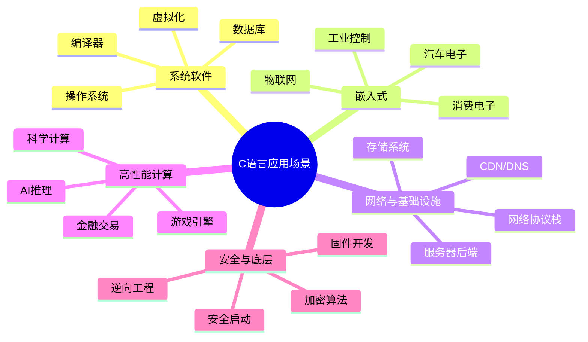

# C语言工业应用场景全景树

> **思维表征方式**: 应用领域情景树
> **用途**: 行业技术栈映射、职业发展参考、项目选型指导
> **更新**: 2025-03-09 - 基于重构后的知识体系

---

## 应用场景总览



---

## 1. 操作系统内核开发

### 技术栈映射

| 层级 | 核心C技术 | 关键挑战 |
|:-----|:----------|:---------|
| **引导加载** | 裸机编程、实模式切换 | 汇编与C混合 |
| **内存管理** | 页表、MMU、物理分配器 | 自举问题 |
| **进程调度** | 上下文切换、原子操作 | 并发正确性 |
| **文件系统** | VFS、缓存、磁盘I/O | 崩溃一致性 |
| **设备驱动** | MMIO、DMA、中断处理 | 硬件多样性 |
| **网络栈** | 协议实现、零拷贝 | 性能优化 |

### 关键知识点

- **内存模型**：理解C11内存序在内核中的映射
- **内联汇编**：与硬件直接交互
- **链接脚本**：自定义内存布局
- **启动流程**：从BIOS/UEFI到内核main

### 代表项目

- Linux Kernel
- FreeBSD
- Redox (Rust+C)
- RT-Thread

---

## 2. 嵌入式系统开发

### 汽车电子 (Automotive)

#### 技术栈

| 模块 | C技术要点 | 标准规范 |
|:-----|:----------|:---------|
| **ECU固件** | MISRA C, 确定性执行 | AUTOSAR, ISO 26262 |
| **动力总成** | 硬实时, 浮点运算 | ASIL-D |
| **ADAS** | 计算机视觉接口, 传感器融合 | ASIL-B/C |
| **车载网络** | CAN/LIN/FlexRay/Ethernet | ISO 11898 |

#### 关键约束

```text
硬实时要求: 响应时间 < 100μs
功能安全: 故障率 < 10^-9/小时
内存限制: 通常 < 1MB
温度范围: -40°C ~ +85°C (工业级) 或 +125°C (汽车级)
```

### 物联网 (IoT)

#### 技术栈

| 层级 | 技术要点 |
|:-----|:---------|
| **MCU端** | 低功耗优化、睡眠模式、看门狗 |
| **通信协议** | BLE、LoRa、Zigbee、MQTT-SN |
| **安全** | 安全启动、加密、OTA签名 |
| **电源管理** | 电池寿命优化、能量采集 |

#### 典型MCU平台

- ARM Cortex-M (M0/M3/M4/M7)
- RISC-V (GD32VF103等)
- ESP32 (Xtensa)

---

## 3. 网络与基础设施

### 高性能服务器

#### 技术栈映射

| 组件 | C核心技术 | 性能目标 |
|:-----|:----------|:---------|
| **网络I/O** | epoll/io_uring/DPDK | 百万级并发 |
| **协议解析** | 零拷贝、状态机 | 10Gbps+ |
| **内存管理** | 内存池、对象复用 | 零分配延迟 |
| **锁策略** | 无锁队列、RCU | 线性扩展 |

#### DPDK深度

```c
// 用户态网络栈关键技术
// 1. 大页内存
// 2. 轮询模式（避免中断开销）
// 3. CPU亲和性绑定
// 4. 无锁环形队列

// 性能数字参考：
// 传统内核网络: ~1-5 Mpps
// DPDK用户态: ~100+ Mpps
```

### 存储系统

#### 数据库引擎

| 模块 | C技术 | 挑战 |
|:-----|:------|:-----|
| **B+树** | 磁盘页管理、缓存 | 并发控制 |
| **LSM树** | 排序合并、压缩 | 写放大 |
| **事务** | WAL、MVCC | ACID保证 |
| **索引** | 哈希、布隆过滤器 | 内存效率 |

#### 文件系统

- ext4, XFS, Btrfs (Linux)
- ZFS (OpenZFS)
- 用户态文件系统 (FUSE)

---

## 4. 高性能计算

### 高频交易 (HFT)

#### 技术要求

```text
延迟预算：
├── 网络延迟 < 1μs (FPGA/内核旁路)
├── 系统延迟 < 5μs (DPDK/共享内存)
├── 应用延迟 < 10μs (无锁、CPU亲和)
└── 总延迟 < 50μs (端到端)

C关键技术：
├── 无锁数据结构 (SPSC/MPSC队列)
├── 内存映射 (mmap大页)
├── 避免系统调用 (vDSO)
├── CPU缓存优化 (缓存行对齐)
└── NUMA感知 (本地内存访问)
```

### 游戏引擎

#### 核心系统C实现

| 系统 | 技术要点 |
|:-----|:---------|
| **渲染** | 图形API封装 (OpenGL/Vulkan/D3D) |
| **物理** | 数值积分、碰撞检测 |
| **音频** | 低延迟音频、3D定位 |
| **脚本绑定** | C与脚本语言交互 (Lua/Python) |

#### ECS架构

```c
// Entity-Component-System
// 数据导向设计，缓存友好

typedef struct {
    float position[3];
    float velocity[3];
} Transform;

typedef struct {
    Transform *transforms;  // SoA布局
    size_t count;
} World;

void update_positions(World *world, float dt) {
    // 顺序访问，缓存友好
    for (size_t i = 0; i < world->count; i++) {
        Transform *t = &world->transforms[i];
        t->position[0] += t->velocity[0] * dt;
        t->position[1] += t->velocity[1] * dt;
        t->position[2] += t->velocity[2] * dt;
    }
}
```

---

## 5. 安全与密码学

### 加密算法实现

#### 要求

| 属性 | 说明 |
|:-----|:-----|
| **时序安全** | 避免分支依赖密钥 |
| **缓存安全** | 避免内存访问模式泄露 |
| **侧信道防护** | 功耗分析、电磁防护 |

#### 常量时间代码示例

```c
// ❌ 不安全：分支依赖密钥
int insecure_compare(const uint8_t *a, const uint8_t *b, size_t n) {
    for (size_t i = 0; i < n; i++) {
        if (a[i] != b[i]) return 0;  // 时序泄露！
    }
    return 1;
}

// ✅ 安全：常量时间
int constant_time_compare(const uint8_t *a, const uint8_t *b, size_t n) {
    uint8_t result = 0;
    for (size_t i = 0; i < n; i++) {
        result |= a[i] ^ b[i];  // 无分支
    }
    return result == 0;
}
```

### 安全启动 (Secure Boot)

#### 信任链

```text
ROM (不可变)
  → Bootloader (签名验证)
    → Kernel (签名验证)
      → 应用程序 (签名验证)

C关键技术：
├── 公钥验证 (RSA/ECC)
├── 哈希链 (SHA-256/384)
├── 防回滚 (安全版本号)
└── 硬件信任根 (TPM/HSM)
```

---

## 6. 现代新兴领域

### AI推理引擎

| 组件 | C作用 | 技术要点 |
|:-----|:------|:---------|
| **张量运算** | 底层内核 | SIMD优化、内存布局 |
| **算子融合** | 图优化 | 减少内存搬运 |
| **量化推理** | 整数运算 | 定点数、查表 |

### 区块链/加密货币

- 核心共识算法 (PoW/PoS)
- 密码学原语实现
- 虚拟机 (EVM)

### 量子计算接口

- 经典控制代码
- 量子门序列生成
- 错误校正编码

---

## 7. 选型决策表

### 按约束选择C标准

| 应用场景 | 推荐标准 | 关键理由 |
|:---------|:---------|:---------|
| 汽车ECU | C99 + MISRA | 确定性、认证友好 |
| 操作系统 | C11 | 原子操作、多线程 |
| 嵌入式MCU | C99 | 编译器支持广泛 |
| 现代应用 | C17/C23 | 新特性、安全性 |
| 遗留维护 | C89 | 兼容性 |

### 按性能要求选择技术

| 性能要求 | 技术方案 |
|:---------|:---------|
| 极低延迟 (<1μs) | 用户态轮询、FPGA卸载 |
| 高吞吐 (10Gbps+) | DPDK、零拷贝、批处理 |
| 高并发 (100万+) | io_uring、无锁结构 |
| 实时确定性 | 禁用中断、锁分析 |

---

## ✅ 职业发展路径

### 系统程序员成长路线

```text
初级 (0-2年)
├── 扎实掌握C核心语法
├── 理解指针和内存管理
├── 熟练使用调试工具
└── 能编写简单模块

中级 (2-5年)
├── 深入理解系统调用
├── 掌握并发编程
├── 性能优化能力
└── 领域专精（网络/存储/嵌入式）

高级 (5-10年)
├── 架构设计能力
├── 跨领域知识
├── 技术领导能力
└── 开源影响力

专家 (10年+)
├── 行业影响力
├── 创新技术产出
└── 战略技术决策
```

---

> **更新记录**
>
> - 2025-03-09: 重构完成，覆盖7大领域，新增现代新兴领域


---

## 深入理解

### 核心原理

深入探讨技术原理和实现细节。

### 实践应用

- 应用场景1
- 应用场景2
- 应用场景3

### 最佳实践

1. 理解基础概念
2. 掌握核心机制
3. 应用到实际项目

---

> **最后更新**: 2026-03-21  
> **维护者**: AI Code Review
