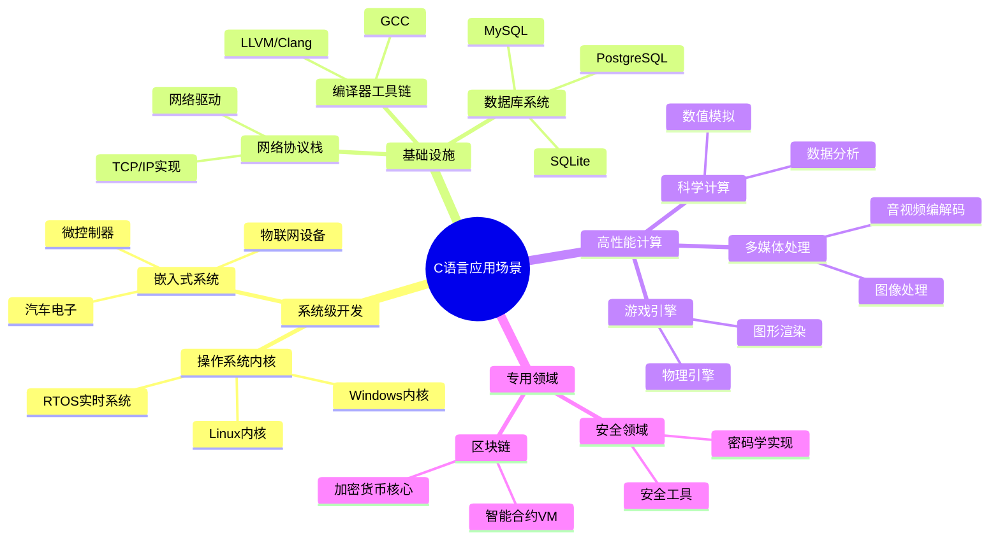
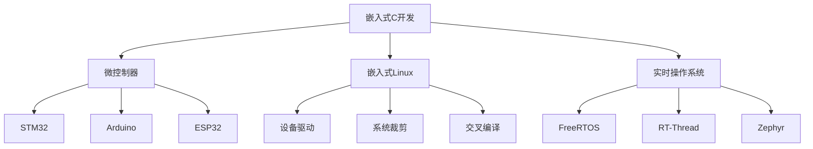
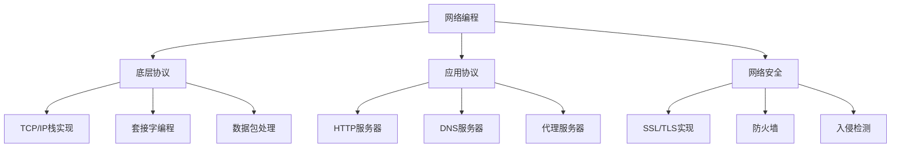
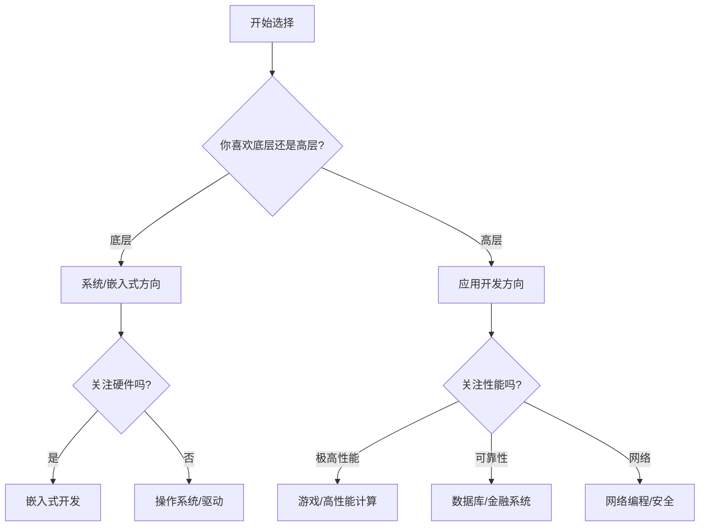

# C语言应用场景树

> 本目录系统梳理C语言在各领域的应用场景，提供技术选型决策支持和领域学习指南。

---

## 📋 目录结构

```
04_Application_Scenario_Trees/
├── README.md                          # 本文件：应用场景总览
├── 01_Industry_Application_Scenario_Tree.md  # 行业应用场景树
└── [其他场景分析文件]                   # 细分领域场景分析
```

---


---

## 📑 目录

- [C语言应用场景树](#c语言应用场景树)
  - [📋 目录结构](#-目录结构)
  - [📑 目录](#-目录)
  - [🌳 C语言应用场景全景树](#-c语言应用场景全景树)
    - [应用场景总览图](#应用场景总览图)
  - [🎯 应用场景分类详解](#-应用场景分类详解)
    - [1. 系统软件开发](#1-系统软件开发)
    - [2. 嵌入式系统开发](#2-嵌入式系统开发)
    - [3. 数据库系统](#3-数据库系统)
    - [4. 网络与通信](#4-网络与通信)
    - [5. 高性能计算与游戏](#5-高性能计算与游戏)
  - [🧭 领域选择指南](#-领域选择指南)
    - [如何选择适合自己的C语言应用领域？](#如何选择适合自己的c语言应用领域)
    - [各领域技术栈匹配](#各领域技术栈匹配)
  - [📊 场景复杂度评估矩阵](#-场景复杂度评估矩阵)
  - [🚀 入门建议](#-入门建议)
    - [初学者推荐路径](#初学者推荐路径)
  - [📁 本目录文件说明](#-本目录文件说明)
  - [🔗 相关资源](#-相关资源)
  - [深入理解](#深入理解)
    - [核心原理](#核心原理)
    - [实践应用](#实践应用)
    - [最佳实践](#最佳实践)


---

## 🌳 C语言应用场景全景树

### 应用场景总览图



---

## 🎯 应用场景分类详解

### 1. 系统软件开发

```
┌─────────────────────────────────────────────────────────────┐
│                    系统软件开发领域                          │
├─────────────────────────────────────────────────────────────┤
│                                                             │
│  ┌──────────────┐    ┌──────────────┐    ┌──────────────┐  │
│  │  操作系统    │    │   驱动程序   │    │   虚拟机     │  │
│  │              │    │              │    │              │  │
│  │ • Linux内核  │    │ • 显卡驱动   │    │ • JVM        │  │
│  │ • Windows NT │    │ • 网卡驱动   │    │ • Python VM  │  │
│  │ • FreeBSD    │    │ • 存储驱动   │    │ • Lua解释器  │  │
│  │ • 嵌入式RTOS │    │ • USB驱动    │    │              │  │
│  └──────────────┘    └──────────────┘    └──────────────┘  │
│                                                             │
│  技术特点：                                                  │
│  • 直接硬件操作，需要寄存器级控制                              │
│  • 内存管理严格，不允许内存泄漏                                │
│  • 实时性要求高，需要精确控制执行时间                          │
│  • 稳定性要求极高，崩溃影响整个系统                            │
│                                                             │
└─────────────────────────────────────────────────────────────┘
```

**典型代码示例 - 内核模块框架：**

```c
#include <linux/module.h>
#include <linux/kernel.h>
#include <linux/init.h>

// 模块加载函数
static int __init my_module_init(void) {
    printk(KERN_INFO "模块加载成功\n");
    return 0;
}

// 模块卸载函数
static void __exit my_module_exit(void) {
    printk(KERN_INFO "模块卸载成功\n");
}

module_init(my_module_init);
module_exit(my_module_exit);

MODULE_LICENSE("GPL");
MODULE_DESCRIPTION("示例内核模块");
```

---

### 2. 嵌入式系统开发



**资源受限环境下的编程要点：**

```c
// 内存优化示例
// 使用位域节省内存
struct DeviceStatus {
    unsigned int isOnline : 1;    // 1 bit
    unsigned int hasError : 1;    // 1 bit
    unsigned int priority : 3;    // 3 bits
    unsigned int reserved : 3;    // 3 bits
}; // 总共仅使用1字节

// 使用const将数据放入ROM
const uint8_t lookup_table[256] = { /* ... */ };

// 避免动态内存分配
#define POOL_SIZE 100
static Object object_pool[POOL_SIZE];
static bool pool_used[POOL_SIZE] = {false};
```

---

### 3. 数据库系统

```
┌────────────────────────────────────────────────────────────┐
│                   数据库系统应用领域                        │
├────────────────────────────────────────────────────────────┤
│                                                            │
│   存储引擎层 ────────────────────────────────────────       │
│   │                                                        │
│   ├── 缓冲区管理 (Buffer Pool)                             │
│   │   ├── 页替换算法 (LRU/LFU)                             │
│   │   └── 预读机制                                         │
│   │                                                        │
│   ├── 索引结构                                             │
│   │   ├── B+树实现                                         │
│   │   ├── 哈希索引                                         │
│   │   └── 全文索引                                         │
│   │                                                        │
│   └── 事务管理                                             │
│       ├── ACID实现                                         │
│       ├── 锁机制                                           │
│       └── 日志系统 (WAL)                                   │
│                                                            │
│   查询处理层 ────────────────────────────────────────       │
│   ├── SQL解析器                                            │
│   ├── 查询优化器                                           │
│   └── 执行引擎                                             │
│                                                            │
└────────────────────────────────────────────────────────────┘
```

---

### 4. 网络与通信



**高性能网络服务器示例：**

```c
// epoll实现的高并发服务器框架
#include <sys/epoll.h>

#define MAX_EVENTS 1024

int create_server(int port) {
    int listen_fd = socket(AF_INET, SOCK_STREAM, 0);
    // ... 设置socket选项和绑定

    int epoll_fd = epoll_create1(0);
    struct epoll_event ev, events[MAX_EVENTS];

    ev.events = EPOLLIN;
    ev.data.fd = listen_fd;
    epoll_ctl(epoll_fd, EPOLL_CTL_ADD, listen_fd, &ev);

    while (1) {
        int nfds = epoll_wait(epoll_fd, events, MAX_EVENTS, -1);
        for (int i = 0; i < nfds; i++) {
            if (events[i].data.fd == listen_fd) {
                // 接受新连接
                int conn_fd = accept(listen_fd, NULL, NULL);
                ev.events = EPOLLIN | EPOLLET;
                ev.data.fd = conn_fd;
                epoll_ctl(epoll_fd, EPOLL_CTL_ADD, conn_fd, &ev);
            } else {
                // 处理客户端数据
                handle_client(events[i].data.fd);
            }
        }
    }
}
```

---

### 5. 高性能计算与游戏

```
性能关键场景分类：

┌─────────────────────────────────────────────────────────────┐
│  游戏开发                    │  科学计算                    │
├──────────────────────────────┼──────────────────────────────┤
│  • 游戏引擎核心              │  • 数值模拟                  │
│  • 物理引擎                  │  • 有限元分析                │
│  • 渲染管线                  │  • 分子动力学                │
│  • AI寻路                    │  • 气候建模                  │
│  • 音频处理                  │  • 量子计算模拟              │
├──────────────────────────────┼──────────────────────────────┤
│  关键优化技术：              │  关键优化技术：              │
│  • 缓存友好布局              │  • SIMD向量化                │
│  • 对象池                    │  • 并行计算                  │
│  • 空间分割                  │  • GPU加速                   │
│  • 内存对齐                  │  • 算法复杂度优化            │
└──────────────────────────────┴──────────────────────────────┘
```

---

## 🧭 领域选择指南

### 如何选择适合自己的C语言应用领域？



### 各领域技术栈匹配

| 应用领域 | 核心技术栈 | 推荐学习路径 | 就业方向 |
|---------|-----------|-------------|---------|
| **嵌入式开发** | MCU架构、RTOS、通信协议 | C基础 → 单片机 → RTOS → 物联网 | 智能硬件、汽车电子 |
| **系统开发** | 内核原理、驱动开发、汇编 | C基础 → Linux系统编程 → 内核 → 驱动 | 互联网大厂、芯片公司 |
| **数据库开发** | 存储引擎、事务、索引 | C基础 → 数据结构 → 数据库原理 → 源码 | 数据库厂商、云厂商 |
| **游戏引擎** | 图形学、物理、内存管理 | C基础 → C++ → 图形学 → 引擎架构 | 游戏公司、VR/AR |
| **网络编程** | 协议栈、并发、网络安全 | C基础 → Socket → 高性能服务器 → 安全 | 网络安全、云服务 |

---

## 📊 场景复杂度评估矩阵

```
                    学习难度
              低 ◄─────────────────► 高
              ┌─────────────────────────┐
        高    │  嵌入式系统    操作系统  │
              │    (IoT)       内核    │
   市         │                         │
   场   ──────┼  网络服务器   编译器开发 ┼──────
   需         │                         │
   求    低   │  命令行工具   数据库引擎 │
              │                         │
              └─────────────────────────┘
```

---

## 🚀 入门建议

### 初学者推荐路径

1. **第一阶段** (1-2个月)：掌握C语言基础，编写命令行工具
2. **第二阶段** (2-3个月)：学习数据结构与算法，解决LeetCode问题
3. **第三阶段** (3-6个月)：选择感兴趣的方向深入
   - 对硬件感兴趣 → 嵌入式方向
   - 喜欢系统原理 → Linux系统编程
   - 追求极致性能 → 游戏/高性能计算

---

## 📁 本目录文件说明

| 文件名 | 内容描述 | 适用人群 |
|-------|---------|---------|
| `01_Industry_Application_Scenario_Tree.md` | 行业应用场景详细分析 | 技术选型人员 |

---

## 🔗 相关资源

- [返回上级目录](../readme.md)
- [思维导图](../03_Mind_Maps/readme.md) - 建立知识体系
- [现代工具链](../../07_Modern_Toolchain/readme.md) - 掌握开发工具

---

> 💡 **建议**：选择应用领域时，结合个人兴趣、市场需求和学习曲线综合考虑。C语言的强大之处在于可以深入到底层，但也需要付出相应的学习成本。


---

## 深入理解

### 核心原理

深入探讨技术原理和实现细节。

### 实践应用

- 应用场景1
- 应用场景2
- 应用场景3

### 最佳实践

1. 理解基础概念
2. 掌握核心机制
3. 应用到实际项目

---

> **最后更新**: 2026-03-21
> **维护者**: AI Code Review
