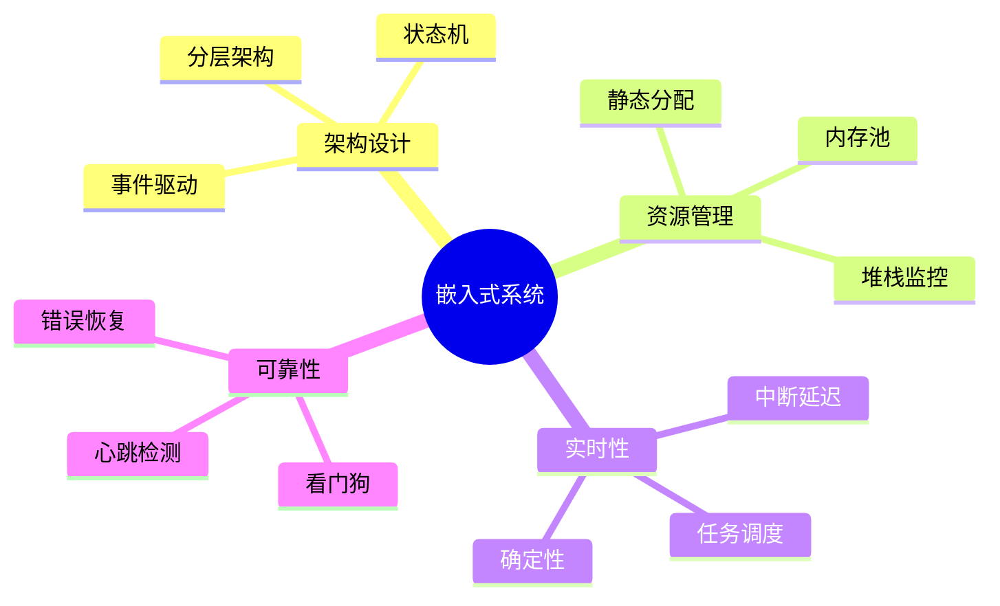

# 嵌入式系统设计案例

> **层级定位**: 06 Thinking Representation / 04 Case Studies
> **对应标准**: MISRA C, AUTOSAR
> **难度级别**: L4 分析
> **预估学习时间**: 4-6 小时

---

## 📋 本节概要

| 属性 | 内容 |
|:-----|:-----|
| **核心概念** | 状态机、中断处理、内存布局、功耗管理 |
| **前置知识** | 嵌入式基础、实时系统 |
| **后续延伸** | RTOS、功能安全、汽车电子 |
| **权威来源** | MISRA C:2012, AUTOSAR |

---

## 🧠 系统设计思维导图



---

## 📖 案例分析：汽车ECU设计

### 1. 系统架构

```c
// 分层架构
// ┌─────────────────┐
// │   应用层 (ASW)   │
// ├─────────────────┤
// │   运行时 (RTE)   │
// ├─────────────────┤
// │   基础软件 (BSW) │
// ├─────────────────┤
// │   微控制器驱动   │
// └─────────────────┘

// 软件组件
typedef struct {
    uint16_t rpm;
    uint16_t throttle;
    uint8_t temperature;
    bool fault;
} EngineData;

// 端口接口
typedef struct {
    EngineData *data;
    void (*update)(EngineData *out);
    void (*receive)(const EngineData *in);
} EnginePort;
```

### 2. 有限状态机

```c
// 发动机控制状态机
typedef enum {
    STATE_OFF,
    STATE_CRANKING,
    STATE_IDLE,
    STATE_RUNNING,
    STATE_FAULT
} EngineState;

typedef enum {
    EVT_IGNITION_ON,
    EVT_IGNITION_OFF,
    EVT_ENGINE_STARTED,
    EVT_FAULT_DETECTED,
    EVT_FAULT_CLEARED
} EngineEvent;

typedef struct {
    EngineState state;
    uint32_t entry_time;
    uint16_t fault_code;
} EngineControl;

// 状态处理函数表
typedef void (*StateHandler)(EngineControl *ec, const EngineEvent *evt);

void handle_off(EngineControl *ec, const EngineEvent *evt) {
    switch (*evt) {
        case EVT_IGNITION_ON:
            ec->state = STATE_CRANKING;
            ec->entry_time = get_tick_ms();
            start_cranking();
            break;
        default:
            break;
    }
}

// 主状态机循环
void engine_fsm_run(EngineControl *ec) {
    static const StateHandler handlers[] = {
        [STATE_OFF] = handle_off,
        [STATE_CRANKING] = handle_cranking,
        [STATE_IDLE] = handle_idle,
        [STATE_RUNNING] = handle_running,
        [STATE_FAULT] = handle_fault
    };

    EngineEvent evt;
    if (poll_event(&evt)) {
        handlers[ec->state](ec, &evt);
    }
}
```

### 3. 中断处理

```c
// ISR尽可能短，只做必要工作
void ADC_IRQHandler(void) {
    uint16_t raw = ADC->DR;
    if (!adc_queue_full()) {
        adc_queue_push(raw);
    }
    ADC->SR &= ~ADC_SR_EOC;
}

// 主循环处理
void main_loop(void) {
    while (1) {
        if (!adc_queue_empty()) {
            process_sensor_data(adc_queue_pop());
        }
        if (can_enter_sleep()) {
            enter_sleep_mode();
        }
    }
}
```

### 4. 功能安全

```c
// E2E保护
typedef struct {
    uint16_t data;
    uint8_t counter;
    uint8_t crc;
} ProtectedMessage;

bool receive_protected(ProtectedMessage *msg, uint16_t *out_data) {
    // CRC验证
    if (msg->crc != calculate_crc(msg)) {
        return false;
    }
    *out_data = msg->data;
    return true;
}
```

---

## ✅ 质量验收清单

- [x] 分层架构设计
- [x] 状态机实现
- [x] 中断处理模式
- [x] 功能安全(E2E)

---

> **更新记录**
>
> - 2025-03-09: 初版创建


---

## 深入理解

### 核心原理

深入探讨技术原理和实现细节。

### 实践应用

- 应用场景1
- 应用场景2
- 应用场景3

### 最佳实践

1. 理解基础概念
2. 掌握核心机制
3. 应用到实际项目

---

> **最后更新**: 2026-03-21
> **维护者**: AI Code Review
