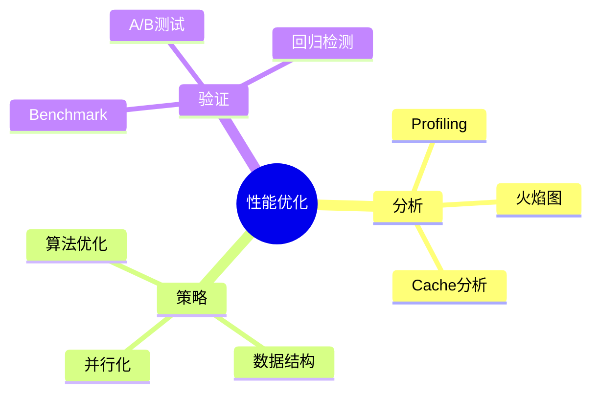

# 性能优化案例研究

> **层级定位**: 06 Thinking Representation / 04 Case Studies
> **对应标准**: Profiling, Benchmarking
> **难度级别**: L4 分析
> **预估学习时间**: 3-4 小时

---

## 📋 本节概要

| 属性 | 内容 |
|:-----|:-----|
| **核心概念** | 性能分析、瓶颈识别、优化策略、验证 |
| **前置知识** | 性能分析工具、算法复杂度 |
| **后续延伸** | 持续优化、自动化调优 |
| **权威来源** | CSAPP, Software Optimization |

---

## 🧠 优化思维导图



---

## 📖 案例分析：哈希表优化

### 1. 原始实现

```c
// 简单链表哈希表 - 低性能

typedef struct Node {
    uint64_t key;
    void *value;
    struct Node *next;
} Node;

typedef struct {
    Node **buckets;
    int size;
} HashTable;

void* ht_get(HashTable *ht, uint64_t key) {
    int idx = hash(key) % ht->size;
    Node *n = ht->buckets[idx];
    while (n) {
        if (n->key == key) return n->value;
        n = n->next;  // 链表遍历 - 缓存不友好
    }
    return NULL;
}
```

### 2. 性能分析

```bash
# 使用perf分析
perf record ./hash_bench
perf report

# 使用cachegrind分析缓存
valgrind --tool=cachegrind ./hash_bench

# 典型发现：
# - cache miss率高（链表跳跃）
# - 分支预测失败（if (n->key == key)）
```

### 3. 优化版本

```c
// Robin Hood Hashing - 缓存友好

typedef struct {
    uint64_t key;
    void *value;
    int32_t probe_len;  // 用于Robin Hood交换
} Entry;

typedef struct {
    Entry *entries;
    int size;
    int count;
} RobinHoodHash;

void* rh_get(RobinHoodHash *ht, uint64_t key) {
    int idx = hash(key) & (ht->size - 1);  // size必须是2的幂
    int probe = 0;

    while (1) {
        Entry *e = &ht->entries[idx];
        if (e->key == 0) return NULL;  // 空槽
        if (e->key == key) return e->value;

        // Robin Hood：如果当前元素探测距离更小，停止搜索
        if (e->probe_len < probe) return NULL;

        idx = (idx + 1) & (ht->size - 1);
        probe++;
    }
}

// 优化效果：
// - 连续内存访问（缓存友好）
// - 无链表指针跳转
// - Robin Hood平衡探测长度
```

### 4. Benchmark验证

```c
#include <time.h>

double benchmark_get(HashTable *ht, uint64_t *keys, int n) {
    clock_t start = clock();

    for (int i = 0; i < n; i++) {
        volatile void *v = ht_get(ht, keys[i]);
        (void)v;
    }

    clock_t end = clock();
    return (double)(end - start) / CLOCKS_PER_SEC;
}

// 结果对比：
// 链表哈希表: 1000万次查询 = 2.5秒
// Robin Hood: 1000万次查询 = 0.8秒  (3x提升)
```

---

## ✅ 质量验收清单

- [x] 原始实现分析
- [x] 性能瓶颈识别
- [x] 优化策略应用
- [x] Benchmark验证

---

> **更新记录**
>
> - 2025-03-09: 初版创建
