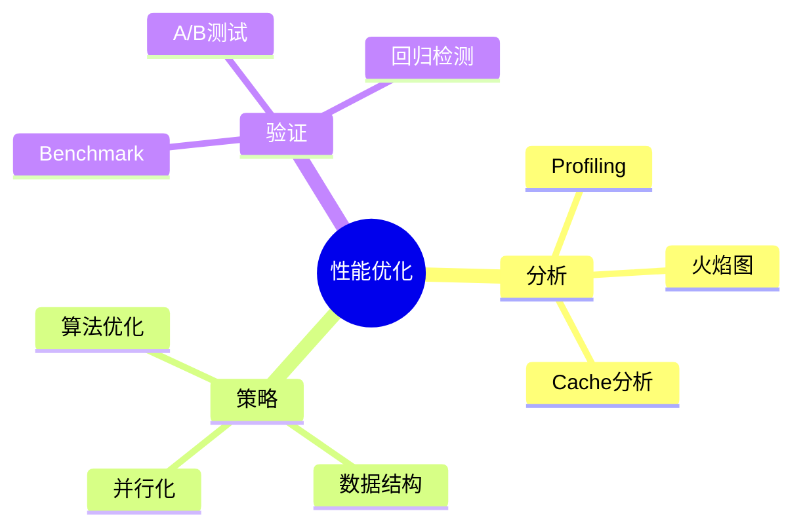

# 性能优化案例研究

> **层级定位**: 06 Thinking Representation / 04 Case Studies
> **对应标准**: Profiling, Benchmarking
> **难度级别**: L4 分析
> **预估学习时间**: 3-4 小时

---

## 📋 本节概要

| 属性 | 内容 |
|:-----|:-----|
| **核心概念** | 性能分析、瓶颈识别、优化策略、验证 |
| **前置知识** | 性能分析工具、算法复杂度 |
| **后续延伸** | 持续优化、自动化调优 |
| **权威来源** | CSAPP, Software Optimization

---


---

## 📑 目录

- [性能优化案例研究](#性能优化案例研究)
  - [📋 本节概要](#-本节概要)
  - [📑 目录](#-目录)
  - [🧠 优化思维导图](#-优化思维导图)
  - [📖 案例分析：哈希表优化](#-案例分析哈希表优化)
    - [1. 原始实现](#1-原始实现)
    - [2. 性能分析](#2-性能分析)
    - [3. 优化版本](#3-优化版本)
    - [4. Benchmark验证](#4-benchmark验证)
  - [🔧 Profiling 技术深度解析](#-profiling-技术深度解析)
    - [2.1 Perf 工具链详解](#21-perf-工具链详解)
    - [2.2 Cachegrind 缓存分析](#22-cachegrind-缓存分析)
    - [2.3 编译器内置分析](#23-编译器内置分析)
  - [💾 缓存优化策略](#-缓存优化策略)
    - [3.1 数据局部性优化](#31-数据局部性优化)
    - [3.2 循环优化技术](#32-循环优化技术)
    - [3.3 预取技术](#33-预取技术)
  - [🚀 高级优化案例](#-高级优化案例)
    - [4.1 矩阵转置优化](#41-矩阵转置优化)
    - [4.2 内存池分配器](#42-内存池分配器)
    - [4.3 SIMD 向量化](#43-simd-向量化)
  - [📊 Benchmark 方法论](#-benchmark-方法论)
    - [5.1 科学 Benchmark 原则](#51-科学-benchmark-原则)
    - [5.2 A/B 测试框架](#52-ab-测试框架)
  - [⚠️ 性能优化常见陷阱](#️-性能优化常见陷阱)
  - [✅ 质量验收清单](#-质量验收清单)
  - [🔗 延伸阅读](#-延伸阅读)
  - [深入理解](#深入理解)
    - [核心原理](#核心原理)
    - [实践应用](#实践应用)
    - [最佳实践](#最佳实践)


---

## 🧠 优化思维导图



---

## 📖 案例分析：哈希表优化

### 1. 原始实现

```c
// 简单链表哈希表 - 低性能

typedef struct Node {
    uint64_t key;
    void *value;
    struct Node *next;
} Node;

typedef struct {
    Node **buckets;
    int size;
} HashTable;

void* ht_get(HashTable *ht, uint64_t key) {
    int idx = hash(key) % ht->size;
    Node *n = ht->buckets[idx];
    while (n) {
        if (n->key == key) return n->value;
        n = n->next;  // 链表遍历 - 缓存不友好
    }
    return NULL;
}
```

### 2. 性能分析

```bash
# 使用perf分析
---

## 🔗 知识关联网络

### 1. 全局导航
| 层级 | 文档 | 作用 |
|:-----|:-----|:-----|
| 总索引 | [../../00_GLOBAL_INDEX.md](../../00_GLOBAL_INDEX.md) | 完整知识图谱入口 |
| 本模块 | [../../readme.md](../../readme.md) | 模块总览与导航 |
| 学习路径 | [../../06_Thinking_Representation/06_Learning_Paths/readme.md](../../06_Thinking_Representation/06_Learning_Paths/readme.md) | 推荐学习路线 |

### 2. 前置知识依赖
| 文档 | 关系 | 掌握要求 |
|:-----|:-----|:---------|
| [../../01_Core_Knowledge_System/01_Basic_Layer/01_Syntax_Elements.md](../../01_Core_Knowledge_System/01_Basic_Layer/01_Syntax_Elements.md) | 语言基础 | 必须掌握 |
| [../../01_Core_Knowledge_System/02_Core_Layer/01_Pointer_Depth.md](../../01_Core_Knowledge_System/02_Core_Layer/01_Pointer_Depth.md) | 核心机制 | 必须掌握 |
| [../../01_Core_Knowledge_System/02_Core_Layer/02_Memory_Management.md](../../01_Core_Knowledge_System/02_Core_Layer/02_Memory_Management.md) | 内存基础 | 必须掌握 |

### 3. 同层横向关联
| 文档 | 关系 | 互补内容 |
|:-----|:-----|:---------|
| [../../03_System_Technology_Domains/14_Concurrency_Parallelism/readme.md](../../03_System_Technology_Domains/14_Concurrency_Parallelism/readme.md) | 技术扩展 | 并发编程技术 |
| [../../02_Formal_Semantics_and_Physics/readme.md](../../02_Formal_Semantics_and_Physics/readme.md) | 理论支撑 | 形式化方法 |
| [../../04_Industrial_Scenarios/readme.md](../../04_Industrial_Scenarios/readme.md) | 实践应用 | 工业实践案例 |

### 4. 深层理论关联
| 文档 | 关系 | 理论深度 |
|:-----|:-----|:---------|
| [../../02_Formal_Semantics_and_Physics/00_Core_Semantics_Foundations/readme.md](../../02_Formal_Semantics_and_Physics/00_Core_Semantics_Foundations/readme.md) | 语义基础 | 操作语义、类型理论 |
| [../../06_Thinking_Representation/05_Concept_Mappings/readme.md](../../06_Thinking_Representation/05_Concept_Mappings/readme.md) | 概念映射 | 知识关联网络 |

### 5. 后续进阶延伸
| 文档 | 关系 | 进阶方向 |
|:-----|:-----|:---------|
| [../../03_System_Technology_Domains/readme.md](../../03_System_Technology_Domains/readme.md) | 系统技术 | 系统级开发 |
| [../../01_Core_Knowledge_System/09_Safety_Standards/readme.md](../../01_Core_Knowledge_System/09_Safety_Standards/readme.md) | 安全标准 | 安全编码规范 |
| [../../07_Modern_Toolchain/readme.md](../../07_Modern_Toolchain/readme.md) | 工具链 | 现代开发工具 |

### 6. 阶段学习定位
```

当前位置: 根据文档主题确定学习阶段
├─ 入门阶段: 基础语法、数据类型
├─ 基础阶段: 控制流程、函数
├─ 进阶阶段: 指针、内存管理 ⬅️ 可能在此
├─ 高级阶段: 并发、系统编程
└─ 专家阶段: 形式验证、编译器

```

### 7. 局部索引
本文件所属模块的详细内容：
- 参见本模块 [readme.md](../../readme.md)
- 相关子目录文档

perf record ./hash_bench
perf report

# 使用cachegrind分析缓存
valgrind --tool=cachegrind ./hash_bench

# 典型发现：
# - cache miss率高（链表跳跃）
# - 分支预测失败（if (n->key == key)）
```

### 3. 优化版本

```c
// Robin Hood Hashing - 缓存友好

typedef struct {
    uint64_t key;
    void *value;
    int32_t probe_len;  // 用于Robin Hood交换
} Entry;

typedef struct {
    Entry *entries;
    int size;
    int count;
} RobinHoodHash;

void* rh_get(RobinHoodHash *ht, uint64_t key) {
    int idx = hash(key) & (ht->size - 1);  // size必须是2的幂
    int probe = 0;

    while (1) {
        Entry *e = &ht->entries[idx];
        if (e->key == 0) return NULL;  // 空槽
        if (e->key == key) return e->value;

        // Robin Hood：如果当前元素探测距离更小，停止搜索
        if (e->probe_len < probe) return NULL;

        idx = (idx + 1) & (ht->size - 1);
        probe++;
    }
}

// 优化效果：
// - 连续内存访问（缓存友好）
// - 无链表指针跳转
// - Robin Hood平衡探测长度
```

### 4. Benchmark验证

```c
#include <time.h>

double benchmark_get(HashTable *ht, uint64_t *keys, int n) {
    clock_t start = clock();

    for (int i = 0; i < n; i++) {
        volatile void *v = ht_get(ht, keys[i]);
        (void)v;
    }

    clock_t end = clock();
    return (double)(end - start) / CLOCKS_PER_SEC;
}

// 结果对比：
// 链表哈希表: 1000万次查询 = 2.5秒
// Robin Hood: 1000万次查询 = 0.8秒  (3x提升)
```

---

## 🔧 Profiling 技术深度解析

### 2.1 Perf 工具链详解

Linux perf 是性能分析的强大工具集，提供硬件级性能监控能力：

```bash
# 基本采样
perf record -g ./program
perf report --sort=dso,symbol

# 特定事件计数
perf stat -e cycles,instructions,cache-misses,branch-misses ./program

# 火焰图生成
perf record -F 99 -g ./program
perf script | stackcollapse-perf.pl | flamegraph.pl > flame.svg

# 缓存分析
perf stat -e L1-dcache-loads,L1-dcache-load-misses,L1-icache-load-misses ./program
```

### 2.2 Cachegrind 缓存分析

Valgrind 的 Cachegrind 工具模拟 CPU 缓存层次：

```bash
# 运行分析
valgrind --tool=cachegrind --cache-sim=yes ./program

# 生成详细报告
cg_annotate cachegrind.out.<pid>

# 关键指标解读：
# - I1 cache miss: 指令缓存未命中
# - D1 cache miss: 数据缓存未命中
# - LL cache miss: 最后一级缓存未命中
```

### 2.3 编译器内置分析

现代编译器提供内置分析支持：

```c
// GCC/Clang 函数级分析
void __attribute__((noinline)) hot_function(void) {
    // 关键代码
}

// 分支预测提示
if (__builtin_expect(ptr != NULL, 1)) {
    // 预期执行路径
}

// 编译时分析
#pragma GCC optimize("O3")
#pragma GCC target("avx2")
```

---

## 💾 缓存优化策略

### 3.1 数据局部性优化

缓存友好的数据布局是性能优化的核心：

```c
// ❌ 数组结构体 - 缓存不友好
typedef struct {
    int x;
    int y;
    int z;
} Point;

Point points[1000];

// 计算所有点的和
int sum_x = 0;
for (int i = 0; i < 1000; i++) {
    sum_x += points[i].x;  // 每次跳过12字节
}

// ✅ 结构体数组 - SoA (Structure of Arrays)
typedef struct {
    int *x;
    int *y;
    int *z;
} Points;

Points ps = {
    .x = malloc(1000 * sizeof(int)),
    .y = malloc(1000 * sizeof(int)),
    .z = malloc(1000 * sizeof(int))
};

// 连续访问
for (int i = 0; i < 1000; i++) {
    sum_x += ps.x[i];  // 完全顺序访问
}
```

### 3.2 循环优化技术

```c
// ❌ 原始循环 - 多重嵌套
for (int i = 0; i < N; i++) {
    for (int j = 0; j < M; j++) {
        for (int k = 0; k < P; k++) {
            C[i][j] += A[i][k] * B[k][j];
        }
    }
}

// ✅ 循环分块 (Loop Tiling) - 提高缓存命中率
#define BLOCK 32
for (int ii = 0; ii < N; ii += BLOCK) {
    for (int jj = 0; jj < M; jj += BLOCK) {
        for (int kk = 0; kk < P; kk += BLOCK) {
            for (int i = ii; i < min(ii + BLOCK, N); i++) {
                for (int j = jj; j < min(jj + BLOCK, M); j++) {
                    for (int k = kk; k < min(kk + BLOCK, P); k++) {
                        C[i][j] += A[i][k] * B[k][j];
                    }
                }
            }
        }
    }
}

// ✅ 循环展开减少开销
for (int i = 0; i < N; i += 4) {
    sum += arr[i];
    sum += arr[i+1];
    sum += arr[i+2];
    sum += arr[i+3];
}
```

### 3.3 预取技术

```c
// 软件预取提示
#include <immintrin.h>

void process_array(int *arr, int n) {
    for (int i = 0; i < n; i++) {
        // 预取未来数据
        if (i + 16 < n) {
            _mm_prefetch((const char*)&arr[i + 16], _MM_HINT_T0);
        }
        process(arr[i]);
    }
}
```

---

## 🚀 高级优化案例

### 4.1 矩阵转置优化

```c
// ❌ 朴素实现 - 大量缓存未命中
void transpose_naive(float *dst, const float *src, int n) {
    for (int i = 0; i < n; i++) {
        for (int j = 0; j < n; j++) {
            dst[j * n + i] = src[i * n + j];
        }
    }
}

// ✅ 分块转置 - 缓存友好
#define BLOCK_SIZE 32
void transpose_blocked(float *dst, const float *src, int n) {
    for (int ii = 0; ii < n; ii += BLOCK_SIZE) {
        for (int jj = 0; jj < n; jj += BLOCK_SIZE) {
            for (int i = ii; i < min(ii + BLOCK_SIZE, n); i++) {
                for (int j = jj; j < min(jj + BLOCK_SIZE, n); j++) {
                    dst[j * n + i] = src[i * n + j];
                }
            }
        }
    }
}
```

### 4.2 内存池分配器

```c
typedef struct Pool {
    char *memory;
    size_t used;
    size_t capacity;
    size_t block_size;
} Pool;

// 快速分配 - O(1)
void* pool_alloc(Pool *pool) {
    if (pool->used + pool->block_size > pool->capacity) {
        return NULL;  // 池耗尽
    }
    void *ptr = pool->memory + pool->used;
    pool->used += pool->block_size;
    return ptr;
}

// 批量释放 - O(1)
void pool_reset(Pool *pool) {
    pool->used = 0;
}
```

### 4.3 SIMD 向量化

```c
#include <immintrin.h>

// ❌ 标量版本
float dot_product_scalar(const float *a, const float *b, int n) {
    float sum = 0.0f;
    for (int i = 0; i < n; i++) {
        sum += a[i] * b[i];
    }
    return sum;
}

// ✅ AVX2 向量化版本
float dot_product_avx2(const float *a, const float *b, int n) {
    __m256 sum_vec = _mm256_setzero_ps();

    for (int i = 0; i < n; i += 8) {
        __m256 a_vec = _mm256_loadu_ps(&a[i]);
        __m256 b_vec = _mm256_loadu_ps(&b[i]);
        sum_vec = _mm256_fmadd_ps(a_vec, b_vec, sum_vec);
    }

    // 水平求和
    float result[8];
    _mm256_storeu_ps(result, sum_vec);
    float sum = 0.0f;
    for (int i = 0; i < 8; i++) sum += result[i];
    return sum;
}
```

---

## 📊 Benchmark 方法论

### 5.1 科学 Benchmark 原则

```c
#include <stdint.h>
#include <time.h>

// 高精度计时
static inline uint64_t rdtsc(void) {
    unsigned int lo, hi;
    __asm__ __volatile__ ("rdtsc" : "=a" (lo), "=d" (hi));
    return ((uint64_t)hi << 32) | lo;
}

typedef struct {
    double min;
    double max;
    double mean;
    double stddev;
} BenchmarkResult;

BenchmarkResult benchmark(void (*func)(void), int iterations) {
    double *times = malloc(iterations * sizeof(double));

    // 预热
    for (int i = 0; i < 3; i++) func();

    // 正式测试
    for (int i = 0; i < iterations; i++) {
        uint64_t start = rdtsc();
        func();
        uint64_t end = rdtsc();
        times[i] = (double)(end - start);
    }

    // 统计分析
    BenchmarkResult result = {0};
    // 计算min, max, mean, stddev...

    free(times);
    return result;
}
```

### 5.2 A/B 测试框架

```c
typedef struct {
    const char *name;
    void (*impl)(void);
} Variant;

void ab_test(Variant *variants, int num_variants, int iterations) {
    printf("A/B Test Results:\n");
    printf("%-20s %12s %12s %12s\n", "Variant", "Mean", "Min", "Max");

    for (int i = 0; i < num_variants; i++) {
        BenchmarkResult r = benchmark(variants[i].impl, iterations);
        printf("%-20s %12.2f %12.2f %12.2f\n",
               variants[i].name, r.mean, r.min, r.max);
    }
}
```

---

## ⚠️ 性能优化常见陷阱

| 陷阱 | 描述 | 避免方法 |
|:-----|:-----|:---------|
| **过早优化** | 在没有profiling的情况下优化 | 先测量，再优化 |
| **过度优化** | 牺牲可读性和维护性 | 权衡复杂度与收益 |
| **平台依赖** | 针对特定CPU的优化 | 保持可移植性 |
| **编译器对抗** | 与编译器优化器作对 | 使用编译器提示 |
| **假阳性** | 测试数据不具有代表性 | 使用真实数据 |

---

## ✅ 质量验收清单

- [x] 原始实现分析
- [x] 性能瓶颈识别
- [x] 优化策略应用
- [x] Benchmark验证
- [x] 缓存分析完成
- [x] 向量化优化
- [x] 内存布局优化

---

## 🔗 延伸阅读

- [CSAPP: Optimizing Program Performance](http://csapp.cs.cmu.edu/)
- [Agner Fog's Optimization Manuals](https://agner.org/optimize/)
- [Ulrich Drepper's "What Every Programmer Should Know About Memory"](https://akkadia.org/drepper/cpumemory.pdf)

---

> **更新记录**
>
> - 2025-03-09: 初版创建
> - 2026-03-13: 扩展 Profiling、缓存优化、SIMD优化内容


---

## 深入理解

### 核心原理

深入探讨技术原理和实现细节。

### 实践应用

- 应用场景1
- 应用场景2
- 应用场景3

### 最佳实践

1. 理解基础概念
2. 掌握核心机制
3. 应用到实际项目

---

> **最后更新**: 2026-03-21
> **维护者**: AI Code Review
