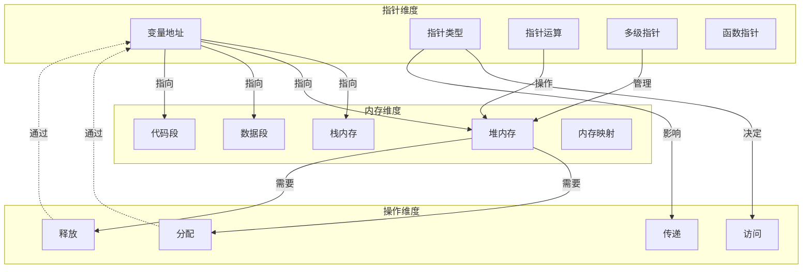

# 指针与内存管理概念映射

> **文档定位**: 核心概念间的深层联系分析
> **主题**: 指针 ↔ 内存管理 双向论证
> **表征方式**: 概念映射图、对比矩阵、演进路径

---

## 一、概念映射总图



---

## 二、指针-内存对应关系矩阵

### 2.1 指针类型 × 内存区域 适用矩阵

| 指针类型 | 栈内存 | 堆内存 | 数据段 | 代码段 | 说明 |
|:---------|:------:|:------:|:------:|:------:|:-----|
| **自动变量指针** | ✅ | ❌ | ❌ | ❌ | 指向局部变量 |
| **动态分配指针** | ❌ | ✅ | ❌ | ❌ | malloc返回 |
| **全局变量指针** | ❌ | ❌ | ✅ | ❌ | 指向静态数据 |
| **函数指针** | ❌ | ❌ | ❌ | ✅ | 指向代码 |
| **通用指针(void*)** | ✅ | ✅ | ✅ | ✅ | 需类型转换 |
| **常量指针** | ✅ | ❌ | ✅ | ❌ | 指向只读数据 |

### 2.2 内存操作 × 指针状态 合法矩阵

| 操作 | 野指针 | 空指针 | 有效指针 | 悬挂指针 |
|:-----|:------:|:------:|:--------:|:--------:|
| **解引用** | ❌ UB | ❌ UB | ✅ | ❌ UB |
| **比较** | ⚠️ | ✅ | ✅ | ⚠️ |
| **赋值** | ⚠️ | ✅ | ✅ | ⚠️ |
| **算术运算** | ❌ | ❌ | ✅ | ❌ |
| **free** | ❌ | ❌ | ✅ | ❌ UB |

---

## 三、深度论证：为什么需要指针才能理解内存管理？

### 3.1 论证链

```
┌─────────────────────────────────────────────────────────────┐
│                    论证：指针 → 内存管理                      │
├─────────────────────────────────────────────────────────────┤
│                                                              │
│  命题1: 内存管理的核心是控制内存的生命周期                    │
│                                                              │
│  命题2: C语言中内存的生命周期由指针控制                       │
│                                                              │
│  论证：                                                       │
│  ┌──────────────┐                                          │
│  │  栈内存      │ ← 编译器自动管理                           │
│  │  int x;      │ ← 指针&x可以访问，但生命周期固定           │
│  └──────────────┘                                          │
│          ↑                                                   │
│          │ 对比                                              │
│          ↓                                                   │
│  ┌──────────────┐                                          │
│  │  堆内存      │ ← 程序员手动管理                           │
│  │  malloc      │ ← 必须保存返回的指针才能后续访问/释放      │
│  └──────────────┘                                          │
│                                                              │
│  结论: 不理解指针就无法管理堆内存                             │
│                                                              │
└─────────────────────────────────────────────────────────────┘
```

### 3.2 指针语义与内存语义的等价性

```c
// 指针语义层
int *p = malloc(sizeof(int));  // 指针p获得地址
*p = 42;                        // 通过指针访问
free(p);                        // 通过指针释放

// 内存语义层（等价视角）
// 1. 在堆上分配 sizeof(int) 字节的内存块
// 2. 内存块获得初始地址，通过p引用
// 3. 在该内存位置写入值42
// 4. 释放该内存块，p成为悬挂指针
```

---

## 四、常见误区映射

### 4.1 误区 → 正确理解 映射

| 误区 | 错误理解 | 正确理解 | 关键区分 |
|:-----|:---------|:---------|:---------|
| **指针=变量** | 指针存储数据 | 指针存储地址 | 间接层 |
| **指针大小=指向大小** | sizeof(int*) == sizeof(int) | 指针大小固定 | 解引用才确定大小 |
| **数组=指针** | 数组是指针 | 数组退化为指针 | sizeof行为不同 |
| **free=删除指针** | free删除指针 | free释放内存 | 指针值不变 |
| **NULL=0** | 整数0和NULL一样 | NULL可能不是0 | 类型安全 |

### 4.2 指针-内存错误模式分类

```c
// 模式1: 未初始化指针（野指针）
int *p;
*p = 10;  // UB - 指向随机地址

// 模式2: 悬挂指针
int *p = malloc(sizeof(int));
free(p);
*p = 10;  // UB - 使用已释放内存

// 模式3: 内存泄漏
void leak() {
    int *p = malloc(sizeof(int));
    // 未free，指针p超出作用域
}

// 模式4: 重复释放
int *p = malloc(sizeof(int));
free(p);
free(p);  // UB - 双重释放

// 模式5: 越界访问
int *p = malloc(10 * sizeof(int));
p[10] = 0;  // UB - 越界写入

// 模式6: 栈返回指针
int* bad() {
    int x = 10;
    return &x;  // 返回栈变量地址 - 悬挂指针
}
```

---

## 五、指针-内存操作决策树

```
需要存储数据？
├── 生命周期已知且短？
│   ├── 是 → 栈分配
│   │         ├── 需要外部访问？
│   │         │   ├── 是 → 传递指针
│   │         │   └── 否 → 直接使用
│   │         └── 大小确定？
│   │             ├── 是 → 固定数组
│   │             └── 否 → VLA（C99）
│   └── 否 → 堆分配
│             ├── 大小确定？
│             │   ├── 是 → malloc
│   │             └── 否 → 多次malloc/realloc
│             ├── 需要释放？
│   │             │   ├── 是 → 记录指针，稍后free
│   │             │   └── 否 → 内存泄漏风险！
│             └── 所有权明确？
│                 ├── 是 → 单一指针管理
│                 └── 否 → 引用计数/智能指针模式
└── 共享数据？
    ├── 只读 → 常量指针
    └── 可写 → 需要考虑同步（多线程）
```

---

## 六、指针与内存可视化详解

### 6.1 内存布局可视化

```
┌─────────────────────────────────────────────────────────────┐
│                      进程虚拟地址空间                        │
├─────────────────────────────────────────────────────────────┤
│  高地址                                                      │
│  ┌─────────────┐  ← 命令行参数和环境变量                      │
│  │   Stack     │  ← 向下增长                                  │
│  │  (栈)       │     局部变量、函数参数                        │
│  │             │     int x = 10;                              │
│  │             │     &x → 栈地址                               │
│  ├─────────────┤                                             │
│  │             │  ← 未映射区域                                 │
│  ├─────────────┤                                             │
│  │    Heap     │  ← 向上增长                                  │
│  │  (堆)       │     动态分配内存                              │
│  │             │     malloc → 返回堆地址                        │
│  ├─────────────┤                                             │
│  │    BSS      │  ← 未初始化的全局/静态变量                     │
│  ├─────────────┤                                             │
│  │   Data      │  ← 已初始化的全局/静态变量                     │
│  ├─────────────┤                                             │
│  │   Text      │  ← 代码段                                    │
│  │  (代码段)   │     函数指针指向这里                          │
│  └─────────────┘                                             │
│  低地址                                                      │
└─────────────────────────────────────────────────────────────┘
```

### 6.2 指针类型可视化

```c
// 指针声明解析（从右向左读）
int *p;              // p 是 指向 int 的指针
int *arr[10];        // arr 是 10个元素的数组，每个元素是 指向 int 的指针
int (*arr)[10];      // arr 是 指向 包含10个int的数组 的指针
int *(*func)(int);   // func 是 指向 接受int返回指向int的指针的函数 的指针

// 可视化
// int *p
// ┌─────┐    ┌─────┐
// │  p  │───→│ int │
// └─────┘    └─────┘
//
// int **pp
// ┌─────┐    ┌─────┐    ┌─────┐
// │ pp  │───→│  *  │───→│ int │
// └─────┘    └─────┘    └─────┘
//
// int (*arr)[10]
// ┌─────┐    ┌──────────────────┐
// │ arr │───→│ [0][1][2]...[9]  │  ← 10个int的数组
// └─────┘    └──────────────────┘
```

---

## 七、与其他主题的联系

### 7.1 指针-内存 → 并发编程

```
指针共享数据 ──► 多线程访问 ──► 数据竞争
     │                              │
     │                              ▼
     │                        需要同步机制
     │                              │
     ▼                              ▼
原子指针(_Atomic) ◄──────────── 内存序控制
```

### 7.2 指针-内存 → 数据结构

```
指针 ──► 链表 ──► 树 ──► 图
 │        │       │       │
 │        ▼       ▼       ▼
 └─────► 堆内存管理 ──► 动态数据结构
```

### 7.3 指针-内存 → 系统编程

```
指针 ──► 系统调用接口 ──► 内核态/用户态切换
 │                          │
 │                          ▼
 └─────────────────────► 虚拟内存映射
```

---

## 八、指针与内存的高级模式

### 8.1 内存所有权模式

```c
// 单一所有权模式
typedef struct {
    char *data;      // 拥有该内存
    size_t len;
} String;

void string_free(String *s) {
    free(s->data);   // 释放所有权
    s->data = NULL;
}

// 借用模式（非拥有）
void print_string(const String *s) {
    // 只读访问，不获取所有权
    printf("%.*s\n", (int)s->len, s->data);
}
```

### 8.2 内存池与指针管理

```c
typedef struct Arena {
    char *base;
    size_t used;
    size_t capacity;
} Arena;

void* arena_alloc(Arena *a, size_t size) {
    void *ptr = a->base + a->used;
    a->used += size;
    return ptr;
}

// 批量释放所有分配
void arena_reset(Arena *a) {
    a->used = 0;  // O(1) 释放所有内存
}
```

### 8.3 指针别名与restrict

```c
// 优化前 - 编译器假设指针可能别名
void add(int *a, int *b, int *c, int n) {
    for (int i = 0; i < n; i++) {
        c[i] = a[i] + b[i];  // 编译器需考虑a/b/c重叠
    }
}

// 优化后 - 使用restrict消除别名
void add_restrict(int *restrict a, int *restrict b,
                  int *restrict c, int n) {
    for (int i = 0; i < n; i++) {
        c[i] = a[i] + b[i];  // 编译器可优化向量化
    }
}
```

---

## 九、跨平台指针注意事项

| 平台 | 指针大小 | 对齐要求 | 特殊说明 |
|:-----|:--------:|:--------:|:---------|
| x86-64 | 8 bytes | 8 bytes | 标准LP64模型 |
| x86 (32-bit) | 4 bytes | 4 bytes | ILP32模型 |
| Windows x64 | 8 bytes | 8 bytes | LLP64模型 (long=32bit) |
| ARM64 | 8 bytes | 8 bytes | 与x86-64相同 |
| RISC-V64 | 8 bytes | 8 bytes | 支持压缩指令 |
| WASM32 | 4 bytes | 4 bytes | 线性内存模型 |

---

## 十、指针与内存调试技巧

### 10.1 常用调试工具

```bash
# AddressSanitizer - 检测内存错误
gcc -fsanitize=address -g program.c -o program

# Valgrind - 内存泄漏检测
valgrind --leak-check=full --show-leak-kinds=all ./program

# GDB - 断点调试
gdb ./program
(gdb) break main
(gdb) run
(gdb) print ptr
(gdb) x/10x ptr  # 检查内存内容
```

### 10.2 防御性编程实践

```c
#include <assert.h>
#include <stdlib.h>

// 分配检查宏
#define SAFE_MALLOC(ptr, size) do { \
    ptr = malloc(size); \
    if (ptr == NULL) { \
        fprintf(stderr, "Memory allocation failed at %s:%d\n", \
                __FILE__, __LINE__); \
        exit(EXIT_FAILURE); \
    } \
} while(0)

// 指针安全检查
void process_buffer(const char *buffer, size_t len) {
    assert(buffer != NULL);  // 前置条件检查
    assert(len > 0);

    // 实际处理...
}
```

---

> **使用建议**: 在学习指针或内存管理时，经常返回此文档查看两者的联系，避免孤立理解。

---

> **更新记录**
>
> - 2025-03-09: 初版创建
> - 2026-03-13: 扩展可视化、内存布局、高级模式、调试技巧
