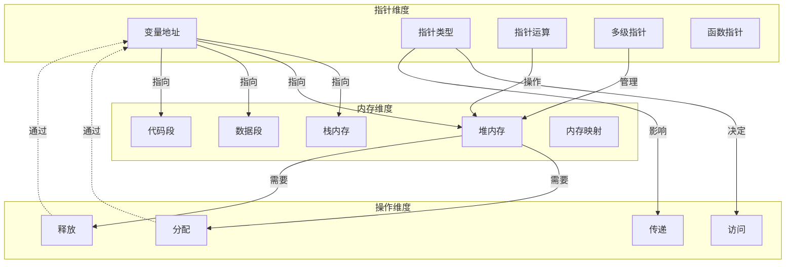

# 指针与内存管理概念映射

> **文档定位**: 核心概念间的深层联系分析
> **主题**: 指针 ↔ 内存管理 双向论证
> **表征方式**: 概念映射图、对比矩阵、演进路径

---

## 一、概念映射总图



---

## 二、指针-内存对应关系矩阵

### 2.1 指针类型 × 内存区域 适用矩阵

| 指针类型 | 栈内存 | 堆内存 | 数据段 | 代码段 | 说明 |
|:---------|:------:|:------:|:------:|:------:|:-----|
| **自动变量指针** | ✅ | ❌ | ❌ | ❌ | 指向局部变量 |
| **动态分配指针** | ❌ | ✅ | ❌ | ❌ | malloc返回 |
| **全局变量指针** | ❌ | ❌ | ✅ | ❌ | 指向静态数据 |
| **函数指针** | ❌ | ❌ | ❌ | ✅ | 指向代码 |
| **通用指针(void*)** | ✅ | ✅ | ✅ | ✅ | 需类型转换 |
| **常量指针** | ✅ | ❌ | ✅ | ❌ | 指向只读数据 |

### 2.2 内存操作 × 指针状态 合法矩阵

| 操作 | 野指针 | 空指针 | 有效指针 | 悬挂指针 |
|:-----|:------:|:------:|:--------:|:--------:|
| **解引用** | ❌ UB | ❌ UB | ✅ | ❌ UB |
| **比较** | ⚠️ | ✅ | ✅ | ⚠️ |
| **赋值** | ⚠️ | ✅ | ✅ | ⚠️ |
| **算术运算** | ❌ | ❌ | ✅ | ❌ |
| **free** | ❌ | ❌ | ✅ | ❌ UB |

---

## 三、深度论证：为什么需要指针才能理解内存管理？

### 3.1 论证链

```
┌─────────────────────────────────────────────────────────────┐
│                    论证：指针 → 内存管理                      │
├─────────────────────────────────────────────────────────────┤
│                                                              │
│  命题1: 内存管理的核心是控制内存的生命周期                    │
│                                                              │
│  命题2: C语言中内存的生命周期由指针控制                       │
│                                                              │
│  论证：                                                       │
│  ┌──────────────┐                                          │
│  │  栈内存      │ ← 编译器自动管理                           │
│  │  int x;      │ ← 指针&x可以访问，但生命周期固定           │
│  └──────────────┘                                          │
│          ↑                                                   │
│          │ 对比                                              │
│          ↓                                                   │
│  ┌──────────────┐                                          │
│  │  堆内存      │ ← 程序员手动管理                           │
│  │  malloc      │ ← 必须保存返回的指针才能后续访问/释放      │
│  └──────────────┘                                          │
│                                                              │
│  结论: 不理解指针就无法管理堆内存                             │
│                                                              │
└─────────────────────────────────────────────────────────────┘
```

---

## 四、常见误区映射

### 4.1 误区 → 正确理解 映射

| 误区 | 错误理解 | 正确理解 | 关键区分 |
|:-----|:---------|:---------|:---------|
| **指针=变量** | 指针存储数据 | 指针存储地址 | 间接层 |
| **指针大小=指向大小** | sizeof(int*) == sizeof(int) | 指针大小固定 | 解引用才确定大小 |
| **数组=指针** | 数组是指针 | 数组退化为指针 | sizeof行为不同 |
| **free=删除指针** | free删除指针 | free释放内存 | 指针值不变 |
| **NULL=0** | 整数0和NULL一样 | NULL可能不是0 | 类型安全 |

---

## 五、指针-内存操作决策树

```
需要存储数据？
├── 生命周期已知且短？
│   ├── 是 → 栈分配
│   │         ├── 需要外部访问？
│   │         │   ├── 是 → 传递指针
│   │         │   └── 否 → 直接使用
│   │         └── 大小确定？
│   │             ├── 是 → 固定数组
│   │             └── 否 → VLA（C99）
│   └── 否 → 堆分配
│             ├── 大小确定？
│             │   ├── 是 → malloc
│   │             └── 否 → 多次malloc/realloc
│             ├── 需要释放？
│   │             │   ├── 是 → 记录指针，稍后free
│   │             │   └── 否 → 内存泄漏风险！
│             └── 所有权明确？
│                 ├── 是 → 单一指针管理
│                 └── 否 → 引用计数/智能指针模式
└── 共享数据？
    ├── 只读 → 常量指针
    └── 可写 → 需要考虑同步（多线程）
```

---

## 六、与其他主题的联系

### 6.1 指针-内存 → 并发编程

```
指针共享数据 ──► 多线程访问 ──► 数据竞争
     │                              │
     │                              ▼
     │                        需要同步机制
     │                              │
     ▼                              ▼
原子指针(_Atomic) ◄──────────── 内存序控制
```

---

> **使用建议**: 在学习指针或内存管理时，经常返回此文档查看两者的联系，避免孤立理解。
