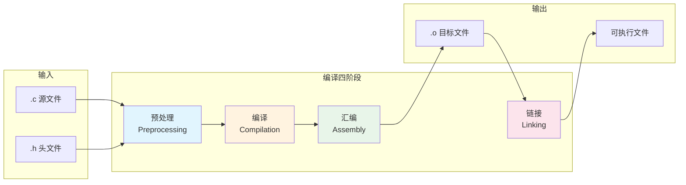
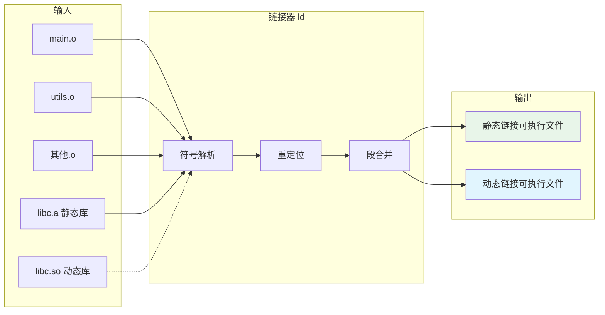
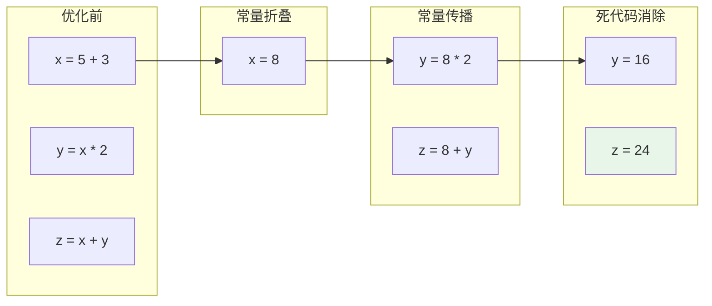

# 编译器阶段映射

> **主题**: C语言编译流程与各阶段详解
> **分类**: 思维表征 > 概念映射 > 编译器知识
> **更新时间**: 2026-03-15

---

## 1. 编译流程总览



---


---

## 📑 目录

- [编译器阶段映射](#编译器阶段映射)
  - [1. 编译流程总览](#1-编译流程总览)
  - [📑 目录](#-目录)
  - [2. 各阶段详细解析](#2-各阶段详细解析)
    - [2.1 预处理阶段 (Preprocessing)](#21-预处理阶段-preprocessing)
    - [2.2 编译阶段 (Compilation)](#22-编译阶段-compilation)
    - [2.3 汇编阶段 (Assembly)](#23-汇编阶段-assembly)
    - [2.4 链接阶段 (Linking)](#24-链接阶段-linking)
  - [3. 各阶段输入输出总结](#3-各阶段输入输出总结)
  - [4. 常见错误与阶段对应](#4-常见错误与阶段对应)
    - [错误诊断速查表](#错误诊断速查表)
  - [5. 优化阶段说明](#5-优化阶段说明)
    - [5.1 编译器优化级别](#51-编译器优化级别)
    - [5.2 优化技术示例](#52-优化技术示例)
    - [5.3 常用编译命令](#53-常用编译命令)
  - [6. 编译流程与内存布局](#6-编译流程与内存布局)
  - [深入理解](#深入理解)
    - [核心原理](#核心原理)
    - [实践应用](#实践应用)
    - [最佳实践](#最佳实践)


---

## 2. 各阶段详细解析

### 2.1 预处理阶段 (Preprocessing)

```
┌─────────────────────────────────────────────────────────────┐
│  输入: .c 源文件                                             │
│  工具: cpp (C PreProcessor) / gcc -E                        │
│  输出: .i 预处理后的C代码                                    │
├─────────────────────────────────────────────────────────────┤
│                                                             │
│  处理内容:                                                  │
│  ┌─────────────┐  ┌─────────────┐  ┌─────────────┐         │
│  │ 宏替换      │  │ 文件包含    │  │ 条件编译    │         │
│  │ #define     │  │ #include    │  │ #ifdef      │         │
│  │             │  │             │  │ #ifndef     │         │
│  │ 示例:       │  │ 示例:       │  │ #if         │         │
│  │ #define PI  │  │ #include    │  │ #else       │         │
│  │ 3.14        │  │ <stdio.h>   │  │ #endif      │         │
│  │             │  │             │  │             │         │
│  │ 替换为 3.14 │  │ 插入头文件  │  │ 选择性编译  │         │
│  │             │  │ 内容        │  │ 代码块      │         │
│  └─────────────┘  └─────────────┘  └─────────────┘         │
│                                                             │
│  其他处理:                                                  │
│  • 注释删除 /* ... */  // ...                              │
│  • 行号控制 #line                                          │
│  • 错误指令 #error                                         │
│  • 编译器指令 #pragma                                      │
│                                                             │
└─────────────────────────────────────────────────────────────┘
```

**命令示例:**

```bash
gcc -E hello.c -o hello.i      # 仅预处理，输出.i文件
gcc -E hello.c | head -50      # 查看预处理输出前50行
```

---

### 2.2 编译阶段 (Compilation)

```mermaid
graph TD
    A[预处理后的.i文件] --> B[词法分析 Lexer]
    B --> C[语法分析 Parser]
    C --> D[语义分析 Semantic]
    D --> E[中间代码生成]
    E --> F[代码优化]
    F --> G[目标代码生成]
    G --> H[.s 汇编文件]

    B --> B1[Token序列
    int, main, (, ), ...]

    C --> C1[语法树 AST
    抽象语法树]

    D --> D1[类型检查
    符号表构建]

    F --> F1[常量折叠
    死代码消除
    循环优化]

    style A fill:#e1f5fe
    style H fill:#fff3e0
```

```
┌─────────────────────────────────────────────────────────────┐
│  输入: .i 预处理文件                                         │
│  工具: cc1 (GNU C Compiler) / gcc -S                        │
│  输出: .s 汇编代码                                           │
├─────────────────────────────────────────────────────────────┤
│                                                             │
│  示例转换:                                                  │
│                                                             │
│  C代码:                          汇编输出:                  │
│  ┌─────────────────────┐        ┌─────────────────────┐    │
│  │ int add(int a,      │        │ add:                │    │
│  │         int b) {    │  ──→   │     pushl %ebp      │    │
│  │     return a + b;   │        │     movl %esp,%ebp  │    │
│  │ }                   │        │     movl 12(%ebp),%eax│  │
│  │                     │        │     addl 8(%ebp),%eax│   │
│  │                     │        │     popl %ebp       │    │
│  │                     │        │     ret             │    │
│  └─────────────────────┘        └─────────────────────┘    │
│                                                             │
└─────────────────────────────────────────────────────────────┘
```

**命令示例:**

```bash
gcc -S hello.i -o hello.s      # 编译到汇编
gcc -S hello.c -o hello.s      # 预处理后直接编译到汇编
```

---

### 2.3 汇编阶段 (Assembly)

```
┌─────────────────────────────────────────────────────────────┐
│  输入: .s 汇编文件                                           │
│  工具: as (Assembler) / gcc -c                              │
│  输出: .o 目标文件（机器码+符号表+重定位信息）               │
├─────────────────────────────────────────────────────────────┤
│                                                             │
│  目标文件结构 (.o / .obj):                                  │
│                                                             │
│  ┌─────────────────────────────────────────────────────┐   │
│  │  ELF Header (文件头信息)                            │   │
│  ├─────────────────────────────────────────────────────┤   │
│  │  Section Header Table (段表)                        │   │
│  ├─────────────────────────────────────────────────────┤   │
│  │  .text  代码段 (机器指令)                           │   │
│  │  ┌────────────┐                                     │   │
│  │  │ 机器码      │  // 可执行指令                      │   │
│  │  │ 0x55       │  // push %ebp                       │   │
│  │  │ 0x89 0xe5  │  // mov %esp,%ebp                  │   │
│  │  └────────────┘                                     │   │
│  ├─────────────────────────────────────────────────────┤   │
│  │  .data  数据段 (已初始化全局/静态变量)              │   │
│  │  .bss   未初始化数据段                              │   │
│  ├─────────────────────────────────────────────────────┤   │
│  │  .symtab 符号表 (函数名、变量名、地址)              │   │
│  │  .rel.text 重定位表 (需要链接器修正的位置)          │   │
│  └─────────────────────────────────────────────────────┘   │
│                                                             │
└─────────────────────────────────────────────────────────────┘
```

**命令示例:**

```bash
as hello.s -o hello.o          # 汇编
 gcc -c hello.c -o hello.o      # 直接编译到目标文件（含预处理+编译+汇编）
objdump -d hello.o             # 反汇编查看机器码
readelf -a hello.o             # 查看ELF完整信息
```

---

### 2.4 链接阶段 (Linking)



```
┌─────────────────────────────────────────────────────────────┐
│  输入: 多个.o目标文件 + 库文件                               │
│  工具: ld (Linker) / gcc                                    │
│  输出: 可执行文件                                            │
├─────────────────────────────────────────────────────────────┤
│                                                             │
│  链接任务:                                                  │
│                                                             │
│  ┌─────────────┐    ┌─────────────┐    ┌─────────────┐     │
│  │  符号解析   │    │  重定位     │    │  段合并     │     │
│  ├─────────────┤    ├─────────────┤    ├─────────────┤     │
│  │ • 查找符号  │    │ • 修正地址  │    │ • 合并同名  │     │
│  │   定义      │    │ • 填充引用  │    │   段        │     │
│  │ • 检查未    │    │ • 计算绝对  │    │ • 分配内存  │     │
│  │   定义符号  │    │   地址      │    │   布局      │     │
│  │ • 处理强弱  │    │             │    │             │     │
│  │   符号      │    │             │    │             │     │
│  └─────────────┘    └─────────────┘    └─────────────┘     │
│                                                             │
│  链接类型:                                                  │
│  ┌────────────────┐  ┌────────────────┐                    │
│  │   静态链接     │  │   动态链接     │                    │
│  ├────────────────┤  ├────────────────┤                    │
│  │ gcc -static    │  │ gcc (默认)     │                    │
│  │ 库代码复制到   │  │ 运行时加载库   │                    │
│  │ 可执行文件     │  │ 共享节省内存   │                    │
│  │ 独立但体积大   │  │ 依赖外部环境   │                    │
│  └────────────────┘  └────────────────┘                    │
│                                                             │
└─────────────────────────────────────────────────────────────┘
```

**命令示例:**

```bash
gcc main.o utils.o -o program          # 链接生成可执行文件
gcc -static main.o utils.o -o program  # 静态链接
ld main.o -o program -lc -dynamic-linker /lib64/ld-linux.so.2
```

---

## 3. 各阶段输入输出总结

```
┌──────────┬─────────────────┬─────────────┬──────────────────────────────┐
│   阶段   │     输入        │    输出     │           关键操作            │
├──────────┼─────────────────┼─────────────┼──────────────────────────────┤
│ 预处理   │ .c + .h         │ .i          │ 宏展开、头文件包含、注释删除   │
│          │                 │             │                              │
│ 编译     │ .i              │ .s          │ 词法/语法/语义分析、优化、     │
│          │                 │             │ 生成汇编代码                   │
│          │                 │             │                              │
│ 汇编     │ .s              │ .o/.obj     │ 汇编指令 → 机器码，           │
│          │                 │             │ 生成符号表和重定位信息         │
│          │                 │             │                              │
│ 链接     │ .o + 库文件     │ 可执行文件  │ 符号解析、重定位、段合并       │
└──────────┴─────────────────┴─────────────┴──────────────────────────────┘
```

---

## 4. 常见错误与阶段对应

```mermaid
graph TD
    ERR[编译错误] --> PRE_ERR[预处理错误]
    ERR --> COMP_ERR[编译错误]
    ERR --> ASM_ERR[汇编错误]
    ERR --> LINK_ERR[链接错误]
    ERR --> RUN_ERR[运行时错误]

    PRE_ERR --> P1[找不到头文件
    #include "xxx.h"
    No such file]
    PRE_ERR --> P2[宏定义错误
    #define MAX 100
    语法错误]

    COMP_ERR --> C1[语法错误
    missing ; before }
    类型不匹配]
    COMP_ERR --> C2[语义错误
    未声明变量
    函数未定义]
    COMP_ERR --> C3[警告
    隐式类型转换
    未使用变量]

    LINK_ERR --> L1[未定义引用
    undefined reference
    to 'foo']
    LINK_ERR --> L2[多重定义
    multiple definition
    of 'var']
    LINK_ERR --> L3[找不到库
    cannot find -lxxx]

    RUN_ERR --> R1[段错误
    Segmentation Fault]
    RUN_ERR --> R2[内存泄漏
    Memory Leak]
    RUN_ERR --> R3[库找不到
    cannot open
    shared object]

    style COMP_ERR fill:#ffcccc
    style LINK_ERR fill:#ffcccc
```

### 错误诊断速查表

| 错误类型 | 典型提示 | 发生阶段 | 解决方法 |
|---------|---------|---------|---------|
| `fatal error: xxx.h: No such file` | 找不到头文件 | 预处理 | 添加 `-I` 指定头文件路径 |
| `expected ';' before '}'` | 语法错误 | 编译 | 检查括号匹配、分号 |
| `implicit declaration of function` | 隐式函数声明 | 编译 | 包含正确的头文件或前置声明 |
| `undefined reference to 'foo'` | 未定义引用 | 链接 | 链接对应的库或实现该函数 |
| `multiple definition of 'var'` | 多重定义 | 链接 | 使用 `extern` 或移至单个文件 |
| `cannot find -lxxx` | 找不到库 | 链接 | 添加 `-L` 指定库路径 |
| `Segmentation fault` | 段错误 | 运行 | 检查空指针、数组越界 |

---

## 5. 优化阶段说明

### 5.1 编译器优化级别

```
┌─────────────────────────────────────────────────────────────┐
│                    GCC 优化选项                              │
├─────────────────────────────────────────────────────────────┤
│                                                             │
│  -O0  无优化（默认）                                        │
│       • 编译最快                                            │
│       • 便于调试                                            │
│       • 代码与源代码对应                                    │
│                                                             │
│  -O1  基本优化                                              │
│       • 死代码消除                                          │
│       • 常量传播                                            │
│       • 合理的编译时间                                      │
│                                                             │
│  -O2  更多优化（推荐用于生产）                              │
│       • 指令调度                                            │
│       • 循环优化                                            │
│       • 内联小函数                                          │
│       • 不涉及空间换时间                                    │
│                                                             │
│  -O3  激进优化                                              │
│       • 自动向量化                                          │
│       • 激进的内联                                          │
│       • 可能增加代码体积                                    │
│                                                             │
│  -Os  优化代码大小                                          │
│       • 优先减少体积                                        │
│       • 适合嵌入式                                          │
│                                                             │
│  -Og  优化调试体验                                          │
│       • 合理的优化级别                                      │
│       • 保留调试信息                                        │
│                                                             │
└─────────────────────────────────────────────────────────────┘
```

### 5.2 优化技术示例



### 5.3 常用编译命令

```bash
# 完整编译流程（一步完成）
---

## 🔗 文档关联

### 核心关联
| 文档 | 关系类型 | 说明 |
|:-----|:---------|:-----|
| [内存管理](../../../01_Core_Knowledge_System/02_Core_Layer/02_Memory_Management.md) | 核心关联 | 内存管理基础 |
| [指针深度](../../../01_Core_Knowledge_System/02_Core_Layer/01_Pointer_Depth.md) | 核心关联 | 指针深度基础 |
| [并发编程](../../../03_System_Technology_Domains/14_Concurrency_Parallelism/readme.md) | 核心关联 | 并发编程基础 |
| [数据类型](../../../01_Core_Knowledge_System/01_Basic_Layer/02_Data_Type_System.md) | 核心关联 | 数据类型基础 |
| [数组与指针](../../../01_Core_Knowledge_System/02_Core_Layer/05_Arrays_Pointers.md) | 核心关联 | 数组与指针基础 |

### 扩展阅读
| 文档 | 关系类型 | 说明 |
|:-----|:---------|:-----|
| [软件工程](../../../01_Core_Knowledge_System/05_Engineering_Layer/readme.md) | 核心关联 | 软件工程基础 |
| [形式语义](../../../02_Formal_Semantics_and_Physics/readme.md) | 核心关联 | 形式语义基础 |
| [系统技术](../../../03_System_Technology_Domains/readme.md) | 核心关联 | 系统技术基础 |
| [工业场景](../../../04_Industrial_Scenarios/readme.md) | 核心关联 | 工业场景基础 |
| [思维表征](../../../06_Thinking_Representation/readme.md) | 核心关联 | 思维表征基础 |
gcc hello.c -o hello

# 分步执行
gcc -E hello.c -o hello.i    # 预处理
gcc -S hello.i -o hello.s    # 编译
gcc -c hello.s -o hello.o    # 汇编
gcc hello.o -o hello         # 链接

# 带优化选项
gcc -O2 hello.c -o hello     # O2优化级别
gcc -O0 -g hello.c -o hello  # 无优化+调试信息

# 生成依赖关系
 gcc -MD -c hello.c            # 生成.d依赖文件

# 查看符号表
nm hello.o                   # 列出符号表
objdump -t hello.o           # 详细符号信息
```

---

## 6. 编译流程与内存布局

```
┌─────────────────────────────────────────────────────────────┐
│                    可执行文件内存布局                         │
├─────────────────────────────────────────────────────────────┤
│                                                             │
│  高地址  ┌─────────────────┐                                │
│          │    栈区 Stack    │  ← 局部变量、函数参数          │
│          │       ↓         │     向下增长                   │
│          │                 │                                │
│          │    堆区 Heap     │  ← malloc分配的内存            │
│          │       ↑         │     向上增长                   │
│          ├─────────────────┤                                │
│          │    BSS段         │  ← 未初始化全局/静态变量       │
│          │    (Block       │     初始化为0                  │
│          │     Started by  │                                │
│          │     Symbol)     │                                │
│          ├─────────────────┤                                │
│          │    数据段 Data   │  ← 已初始化全局/静态变量       │
│          ├─────────────────┤                                │
│          │    代码段 Text   │  ← 机器指令、只读              │
│          │    (只读)        │                                │
│  低地址  └─────────────────┘                                │
│                                                             │
└─────────────────────────────────────────────────────────────┘
```

---

> **状态**: ✅ 已完成


---

## 深入理解

### 核心原理

深入探讨技术原理和实现细节。

### 实践应用

- 应用场景1
- 应用场景2
- 应用场景3

### 最佳实践

1. 理解基础概念
2. 掌握核心机制
3. 应用到实际项目

---

> **最后更新**: 2026-03-21
> **维护者**: AI Code Review
