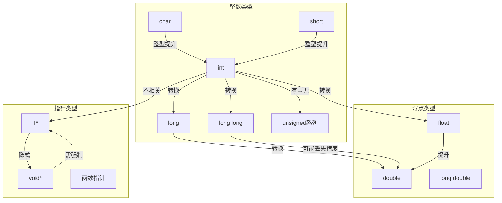

# C语言类型系统全维矩阵

> **文档定位**: 类型系统的多维对比分析
> **表征方式**: 类型矩阵、转换图、兼容性表

---

## 一、类型维度矩阵

### 1.1 基础类型 × 属性 特征矩阵

| 类型 | 大小(位) | 对齐(字节) | 有符号 | 范围 | 常用场景 |
|:-----|:--------:|:----------:|:------:|:-----|:---------|
| **char** | 8 | 1 | 可选 | -128~127 | 字符、小整数、字节 |
| **short** | 16 | 2 | 是 | -32768~32767 | 短整数 |
| **int** | 32 | 4 | 是 | ~±2×10⁹ | 通用整数 |
| **long** | 32/64 | 4/8 | 是 | 平台相关 | 系统编程 |
| **long long** | 64 | 8 | 是 | ~±9×10¹⁸ | 大整数 |
| **float** | 32 | 4 | 有符号 | ~±3.4×10³⁸ | 单精度浮点 |
| **double** | 64 | 8 | 有符号 | ~±1.8×10³⁰⁸ | 双精度浮点 |
| **_Bool** | 1 | 1 | 无 | 0/1 | 布尔逻辑 |
| **void*** | 32/64 | 4/8 | 无 | 地址 | 通用指针 |

### 1.2 类型限定符 × 语义 影响矩阵

| 限定符 | 可读性 | 可写性 | 优化提示 | 线程安全 | 主要用途 |
|:-------|:------:|:------:|:--------:|:--------:|:---------|
| **const** | ✅ | ❌ | 编译期常量 | ✅ | 常量数据 |
| **volatile** | ✅ | ✅ | 禁用优化 | 部分 | 硬件寄存器 |
| **restrict** | ✅ | ✅ | 别名消除 | ✅ | 性能关键代码 |
| **_Atomic** | ✅ | 原子 | 内存序 | ✅ | 并发共享 |

---

## 二、类型转换全景图



---

## 三、类型兼容性决策树

```text
两个类型是否兼容？
├── 相同类型？
│   └── 是 → 兼容 ✅
├── 都是算术类型？
│   ├── 都是整数？
│   │   ├── 符号相同？
│   │   │   ├── 是 → 兼容（整型提升后）✅
│   │   │   └── 否 → 实现定义 ⚠️
│   │   └── 大小不同？
│   │       ├── 大←小 → 兼容 ✅
│   │       └── 小←大 → 可能溢出 ❌
│   └── 混合整数浮点？
│       └── 整数→浮点 → 兼容 ✅
├── 都是指针？
│   ├── 都指向兼容类型？
│   │   └── 是 → 兼容 ✅
│   ├── 一个是void*？
│   │   └── 是 → 兼容（隐式转换）✅
│   └── 其他情况
│       └── 需强制转换 ⚠️
├── 都是结构体？
│   ├── 同一类型定义？
│   │   └── 是 → 兼容 ✅
│   └── 字段相同？
│       └── 否 → 不兼容 ❌
└── 其他组合
    └── 通常不兼容 ❌
```

---

## 四、标准演进 × 类型特性 支持矩阵

| 特性 | C89 | C99 | C11 | C17 | C23 |
|:-----|:---:|:---:|:---:|:---:|:---:|
| **long long** | ❌ | ✅ | ✅ | ✅ | ✅ |
| **_Bool** | ❌ | ✅ | ✅ | ✅ | ✅ |
| **复数类型** | ❌ | ✅ | ✅ | ✅ | ✅ |
| **_Complex** | ❌ | ✅ | ✅ | ✅ | ✅ |
| **_Atomic** | ❌ | ❌ | ✅ | ✅ | ✅ |
| **_BitInt** | ❌ | ❌ | ❌ | ❌ | ✅ |
| **typeof** | ❌ | ❌ | ❌ | ❌ | ✅ |
| **auto类型推导** | ❌ | ❌ | ❌ | ❌ | ✅ |

---

## 五、类型安全等级评估

```text
Level 5: 类型安全 (Type Safe)
├── 使用定宽整数 (stdint.h)
├── 显式转换所有类型转换
├── 避免void*隐式转换
└── 启用所有编译器警告

Level 4: 基本安全
├── 使用size_t进行索引
├── 避免混合有符号/无符号
└── 检查整数溢出

Level 3: 常规C代码
├── 使用标准类型
├── 依赖整型提升
└── 偶尔强制转换

Level 2: 不安全实践
├── 大量void*使用
├── 隐式指针转换
└── 忽略警告

Level 1: 危险代码
├── 指针类型双关
├── 未定义类型转换
└── 依赖实现定义行为
```

---

## 六、语言类型系统对比矩阵

### 6.1 C vs C++ vs Rust vs Zig 类型系统对比

| 特性 | C | C++ | Rust | Zig |
|:-----|:--|:----|:-----|:----|
| **类型推导** | ❌ (C23 auto) | ✅ (auto) | ✅ (let) | ✅ (var/const) |
| **泛型支持** | ❌ (宏模拟) | ✅ (模板) | ✅ (泛型) | ✅ (comptime) |
| **类型安全** | 低 | 中 | 高 | 高 |
| **空值处理** | NULL指针 | nullptr | Option<T> | ?T (可选类型) |
| **错误处理** | 返回码 | 异常/返回码 | Result<T,E> | !T (错误联合) |
| **内存安全** | 手动 | RAII/手动 | 所有权系统 | 显式分配 |
| **编译时计算** | 有限 | 模板元编程 | const fn | comptime |
| **类型别名** | typedef | using/typedef | type | using |

### 6.2 整数类型跨语言对比

| 类型 | C (stdint) | C++ | Rust | Zig | 说明 |
|:-----|:-----------|:----|:-----|:----|:-----|
| 8位有符号 | int8_t | int8_t | i8 | i8 | 固定大小 |
| 8位无符号 | uint8_t | uint8_t | u8 | u8 | 字节类型 |
| 16位有符号 | int16_t | int16_t | i16 | i16 | 短整数 |
| 16位无符号 | uint16_t | uint16_t | u16 | u16 | Unicode码点 |
| 32位有符号 | int32_t | int32_t | i32 | i32 | 通用整数 |
| 32位无符号 | uint32_t | uint32_t | u32 | u32 | 大正数 |
| 64位有符号 | int64_t | int64_t | i64 | i64 | 大整数 |
| 64位无符号 | uint64_t | uint64_t | u64 | u64 | 地址/大小 |
| 指针大小 | intptr_t | intptr_t | isize | isize | 有符号指针 |
| 无符号指针 | uintptr_t | uintptr_t | usize | usize | 地址/索引 |

### 6.3 浮点类型对比

| 特性 | C | C++ | Rust | Zig |
|:-----|:--|:----|:-----|:----|
| 单精度 | float | float | f32 | f32 |
| 双精度 | double | double | f64 | f64 |
| 扩展精度 | long double | long double | f128 (不稳定) | f128 |
| 标准符合 | IEEE 754 | IEEE 754 | IEEE 754 | IEEE 754 |
| NaN处理 | 宏 | std::numeric_limits | 内置方法 | std.math |
| 无穷大 | 宏 | 常量 | 内置常量 | std.math |

---

## 七、类型系统高级主题

### 7.1 类型双关 (Type Punning)

```c
// ❌ 违反严格别名规则
float x = 1.0f;
int i = *(int*)&x;  // UB!

// ✅ 使用联合体 (C99合法)
union FloatInt {
    float f;
    int i;
};
union FloatInt fi = { .f = 1.0f };
int i = fi.i;  // OK

// ✅ 使用memcpy (最安全)
float x = 1.0f;
int i;
memcpy(&i, &x, sizeof(i));
```

### 7.2 对齐与填充

```c
#include <stdalign.h>

// 默认对齐
struct Default {
    char c;   // 1 byte + 3 padding
    int i;    // 4 bytes
    short s;  // 2 bytes + 2 padding
};  // 总计 12 bytes

// 手动对齐
struct Aligned {
    alignas(64) char buffer[64];  // 64字节对齐（缓存行）
};

// 紧凑排列
struct Packed {
    char c;
    int i;
    short s;
} __attribute__((packed));  // 总计 7 bytes
```

### 7.3 复数类型 (C99)

```c
#include <complex.h>

double complex z = 1.0 + 2.0*I;
double real_part = creal(z);
double imag_part = cimag(z);
double magnitude = cabs(z);
double complex conj_z = conj(z);
```

### 7.4 类型泛化编程

```c
// 使用_Generic实现类型泛化
#define max(a, b) _Generic((a), \
    int: max_int, \
    double: max_double, \
    default: max_generic \
)(a, b)

int max_int(int a, int b) { return a > b ? a : b; }
double max_double(double a, double b) { return a > b ? a : b; }

// 使用
int i = max(1, 2);        // 调用 max_int
double d = max(1.0, 2.0); // 调用 max_double
```

---

## 八、平台ABI类型差异

| 平台 | int | long | 指针 | long long | 说明 |
|:-----|:---:|:----:|:----:|:---------:|:-----|
| x86-64 Linux | 32 | 64 | 64 | 64 | LP64 |
| x86-64 Windows | 32 | 32 | 64 | 64 | LLP64 |
| ARM64 | 32 | 64 | 64 | 64 | LP64 |
| RISC-V64 | 32 | 64 | 64 | 64 | LP64 |
| x86 32-bit | 32 | 32 | 32 | 64 | ILP32 |
| wasm32 | 32 | 32 | 32 | 64 | ILP32 |

---

## 九、类型转换规则详解

### 9.1 整型提升规则

```c
// 整型提升顺序
char → int
short → int
// 如果int能表示原类型所有值，则提升为int
// 否则提升为unsigned int

void example() {
    char c = 'A';
    // c 在使用时提升为 int
    int x = c + 1;  // c 先提升为 int

    // 混合类型运算
    short s = 10;
    long l = s + 1;  // s → int → long
}
```

### 9.2 隐式转换的陷阱

```c
// 有符号/无符号混合运算
unsigned int u = 10;
int s = -1;
if (s < u) {  // s 被转换为 unsigned int
    // 永远不会执行！因为 -1 变成 UINT_MAX
}

// 浮点精度丢失
float f = 16777216.0f;  // 2^24
f = f + 1;  // f 不变！精度不足以表示
```

---

> **使用建议**: 在设计数据结构或选择类型时，参考此矩阵进行决策。

---

> **更新记录**
>
> - 2025-03-09: 初版创建
> - 2026-03-13: 扩展语言对比、类型双关、对齐主题、泛化编程

## 十、类型安全最佳实践

### 10.1 使用定宽整数类型

```c
#include <stdint.h>
#include <stddef.h>

// ✅ 推荐：使用定宽整数
uint32_t count;      // 计数器
int64_t timestamp;   // 时间戳
uintptr_t addr;      // 地址
size_t buffer_size;  // 缓冲区大小

// ❌ 避免：依赖平台相关类型
unsigned int count;  // 大小不确定
long timestamp;      // 可能32或64位
```

### 10.2 显式转换与溢出检查

```c
#include <stdint.h>
#include <limits.h>

// ✅ 安全的类型转换
uint32_t safe_downcast(uint64_t value) {
    if (value > UINT32_MAX) {
        // 处理溢出
        return UINT32_MAX;
    }
    return (uint32_t)value;  // 显式转换
}

// ✅ 有符号/无符号混合时显式处理
int process_count(size_t count) {
    if (count > INT_MAX) {
        return -1;  // 错误处理
    }
    return (int)count;
}
```

### 10.3 布尔类型使用

```c
#include <stdbool.h>

// ✅ C99 _Bool / bool
bool is_valid = true;
bool result = check_condition();

// ❌ 避免：将整数当作布尔
int flag = 1;  // 不明确意图
if (flag) { }  // 可读性差

// ✅ 推荐：显式比较
if (flag != 0) { }
if (ptr != NULL) { }  // 而非 if (ptr)
```

---

## 十一、常见类型错误与防范

| 错误类型 | 示例 | 后果 | 防范措施 |
|:---------|:-----|:-----|:---------|
| **隐式截断** | `int x = 100000; short s = x;` | 数据丢失 | 显式检查范围 |
| **符号扩展** | `char c = -1; int i = c;` | 意外大数 | 使用unsigned char |
| **精度丢失** | `float f = 1e20; f = f + 1;` | 加法无效 | 使用double |
| **未定义转换** | `float* → int*` | 严格别名违反 | 使用union或memcpy |
| **对齐错误** | 强制转换未对齐指针 | 崩溃/性能损失 | 使用alignof/aligned_alloc |

---

> **使用建议**: 在设计数据结构或选择类型时，参考此矩阵进行决策。

---

> **更新记录**
>
> - 2025-03-09: 初版创建
> - 2026-03-13: 扩展语言对比、类型双关、对齐主题、泛化编程、最佳实践
