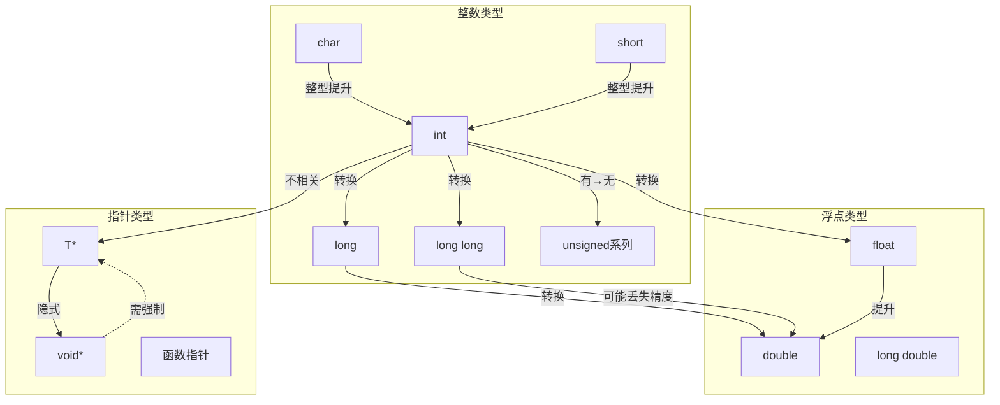

# C语言类型系统全维矩阵

> **文档定位**: 类型系统的多维对比分析
> **表征方式**: 类型矩阵、转换图、兼容性表

---

## 一、类型维度矩阵

### 1.1 基础类型 × 属性 特征矩阵

| 类型 | 大小(位) | 对齐(字节) | 有符号 | 范围 | 常用场景 |
|:-----|:--------:|:----------:|:------:|:-----|:---------|
| **char** | 8 | 1 | 可选 | -128~127 | 字符、小整数、字节 |
| **short** | 16 | 2 | 是 | -32768~32767 | 短整数 |
| **int** | 32 | 4 | 是 | ~±2×10⁹ | 通用整数 |
| **long** | 32/64 | 4/8 | 是 | 平台相关 | 系统编程 |
| **long long** | 64 | 8 | 是 | ~±9×10¹⁸ | 大整数 |
| **float** | 32 | 4 | 有符号 | ~±3.4×10³⁸ | 单精度浮点 |
| **double** | 64 | 8 | 有符号 | ~±1.8×10³⁰⁸ | 双精度浮点 |
| **_Bool** | 1 | 1 | 无 | 0/1 | 布尔逻辑 |
| **void*** | 32/64 | 4/8 | 无 | 地址 | 通用指针 |

### 1.2 类型限定符 × 语义 影响矩阵

| 限定符 | 可读性 | 可写性 | 优化提示 | 线程安全 | 主要用途 |
|:-------|:------:|:------:|:--------:|:--------:|:---------|
| **const** | ✅ | ❌ | 编译期常量 | ✅ | 常量数据 |
| **volatile** | ✅ | ✅ | 禁用优化 | 部分 | 硬件寄存器 |
| **restrict** | ✅ | ✅ | 别名消除 | ✅ | 性能关键代码 |
| **_Atomic** | ✅ | 原子 | 内存序 | ✅ | 并发共享 |

---

## 二、类型转换全景图



---

## 三、类型兼容性决策树

```
两个类型是否兼容？
├── 相同类型？
│   └── 是 → 兼容 ✅
├── 都是算术类型？
│   ├── 都是整数？
│   │   ├── 符号相同？
│   │   │   ├── 是 → 兼容（整型提升后）✅
│   │   │   └── 否 → 实现定义 ⚠️
│   │   └── 大小不同？
│   │       ├── 大←小 → 兼容 ✅
│   │       └── 小←大 → 可能溢出 ❌
│   └── 混合整数浮点？
│       └── 整数→浮点 → 兼容 ✅
├── 都是指针？
│   ├── 都指向兼容类型？
│   │   └── 是 → 兼容 ✅
│   ├── 一个是void*？
│   │   └── 是 → 兼容（隐式转换）✅
│   └── 其他情况
│       └── 需强制转换 ⚠️
├── 都是结构体？
│   ├── 同一类型定义？
│   │   └── 是 → 兼容 ✅
│   └── 字段相同？
│       └── 否 → 不兼容 ❌
└── 其他组合
    └── 通常不兼容 ❌
```

---

## 四、标准演进 × 类型特性 支持矩阵

| 特性 | C89 | C99 | C11 | C17 | C23 |
|:-----|:---:|:---:|:---:|:---:|:---:|
| **long long** | ❌ | ✅ | ✅ | ✅ | ✅ |
| **_Bool** | ❌ | ✅ | ✅ | ✅ | ✅ |
| **复数类型** | ❌ | ✅ | ✅ | ✅ | ✅ |
| **_Complex** | ❌ | ✅ | ✅ | ✅ | ✅ |
| **_Atomic** | ❌ | ❌ | ✅ | ✅ | ✅ |
| **_BitInt** | ❌ | ❌ | ❌ | ❌ | ✅ |
| **typeof** | ❌ | ❌ | ❌ | ❌ | ✅ |
| **auto类型推导** | ❌ | ❌ | ❌ | ❌ | ✅ |

---

## 五、类型安全等级评估

```
Level 5: 类型安全 (Type Safe)
├── 使用定宽整数 (stdint.h)
├── 显式转换所有类型转换
├── 避免void*隐式转换
└── 启用所有编译器警告

Level 4: 基本安全
├── 使用size_t进行索引
├── 避免混合有符号/无符号
└── 检查整数溢出

Level 3: 常规C代码
├── 使用标准类型
├── 依赖整型提升
└── 偶尔强制转换

Level 2: 不安全实践
├── 大量void*使用
├── 隐式指针转换
└── 忽略警告

Level 1: 危险代码
├── 指针类型双关
├── 未定义类型转换
└── 依赖实现定义行为
```

---

> **使用建议**: 在设计数据结构或选择类型时，参考此矩阵进行决策。
