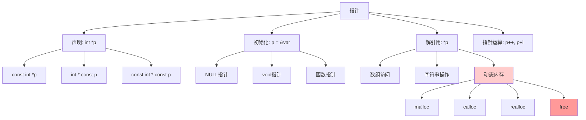
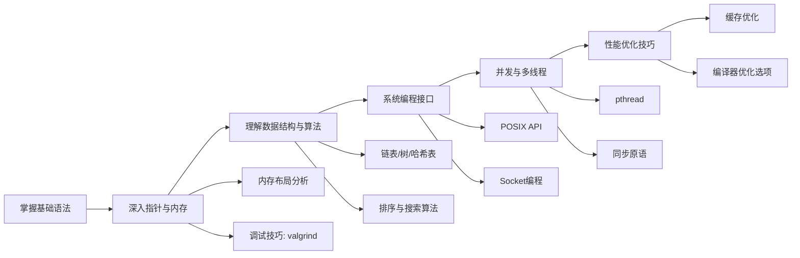
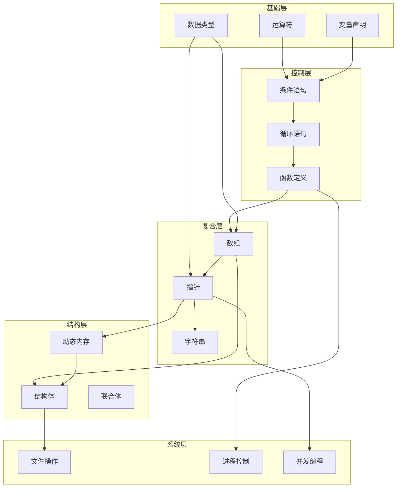

# C语言知识图谱

> **主题**: C语言核心知识体系与学习路径
> **分类**: 思维表征 > 概念映射 > 编程语言知识图谱
> **更新时间**: 2026-03-15

---

## 1. 知识领域全景

```mermaid
graph TD
    C[C语言核心] --> BASIC[基础语法]
    C --> TYPE[类型系统]
    C --> CONTROL[控制流]
    C --> MEM[内存管理]
    C --> ADV[高级特性]
    C --> SYS[系统编程]
    C --> CONC[并发编程]
    C --> LIB[标准库]

    BASIC --> VAR[变量与常量]
    BASIC --> OP[运算符]
    BASIC --> FUNC[函数基础]

    TYPE --> PRIM[基本类型]
    TYPE --> DERIV[派生类型]
    TYPE --> QUAL[类型限定符]

    CONTROL --> COND[条件语句]
    CONTROL --> LOOP[循环语句]
    CONTROL --> JUMP[跳转语句]

    MEM --> STACK[栈内存]
    MEM --> HEAP[堆内存]
    MEM --> PTR[指针]

    ADV --> STRUCT[结构体]
    ADV --> UNION[联合体]
    ADV --> ENUM[枚举]
    ADV --> MACRO[宏与预处理]

    SYS --> FILE[文件IO]
    SYS --> PROC[进程管理]
    SYS --> IPC[进程间通信]

    CONC --> THREAD[线程]
    CONC --> SYNC[同步机制]
    CONC --> ATOMIC[原子操作]

    LIB --> STDIO[stdio.h]
    LIB --> STDLIB[stdlib.h]
    LIB --> STRING[string.h]
    LIB --> MATH[math.h]
```



---

## 2. 知识点节点与连接关系

### 2.1 基础语法层

```
┌─────────────────────────────────────────────────────────┐
│                      基础语法                           │
├─────────────────────────────────────────────────────────┤
│  变量声明 ──→ 数据类型 ──→ 类型转换 ──→ 表达式求值      │
│      ↓            ↓            ↓            ↓           │
│  作用域规则    存储类别    隐式/显式    运算符优先级      │
│  (auto/static/extern/register)                          │
└─────────────────────────────────────────────────────────┘
```

### 2.2 类型系统网络

```mermaid
graph LR
    A[void] --> B[基本类型]
    B --> C1[char]
    B --> C2[int]
    B --> C3[float]
    B --> C4[double]

    C2 --> D1[short]
    C2 --> D2[long]
    C2 --> D3[long long]
    C2 --> D4[unsigned]

    E[派生类型] --> F1[指针 *]
    E --> F2[数组 []]
    E --> F3[函数 ()]
    E --> F4[结构体 struct]

    F1 --> G1[指针数组]
    F1 --> G2[函数指针]
    F1 --> G3[指针的指针]

    F2 --> H1[多维数组]
    F2 --> H2[数组指针]

    F4 --> I1[结构体数组]
    F4 --> I2[结构体指针]
    F4 --> I3[嵌套结构体]
    F4 --> I4[自引用结构体]
```

### 2.3 指针与内存关系



---

## 3. 学习路径推荐

### 路径一：初学者路线

```
第1周 ─────────────────────────────────────────────────────
│ 变量与数据类型 ──→ 运算符 ──→ 输入输出 ──→ 简单程序      │
└──────────────────────────────────────────────────────────┘

第2-3周 ───────────────────────────────────────────────────
│ 条件语句 ──→ 循环语句 ──→ 数组 ──→ 字符串基础            │
│     (if/switch)   (for/while)                            │
└──────────────────────────────────────────────────────────┘

第4-5周 ───────────────────────────────────────────────────
│ 函数 ──→ 作用域 ──→ 递归 ──→ 简单算法实现                │
└──────────────────────────────────────────────────────────┘

第6-8周 ───────────────────────────────────────────────────
│ 指针基础 ──→ 指针与数组 ──→ 指针与函数 ──→ 动态内存      │
└──────────────────────────────────────────────────────────┘

第9-12周 ──────────────────────────────────────────────────
│ 结构体 ──→ 文件IO ──→ 预处理 ──→ 小型项目实战            │
└──────────────────────────────────────────────────────────┘
```

### 路径二：进阶提升路线



---

## 4. 依赖关系图

### 4.1 核心依赖关系



### 4.2 前置知识要求

| 知识模块 | 前置知识 | 难度等级 |
|---------|---------|---------|
| 函数指针 | 函数、指针基础 | ⭐⭐⭐ |
| 动态内存 | 指针、结构体 | ⭐⭐⭐⭐ |
| 链表实现 | 指针、结构体、动态内存 | ⭐⭐⭐⭐ |
| 文件IO | 指针、结构体 | ⭐⭐⭐ |
| 多线程编程 | 函数、指针、进程概念 | ⭐⭐⭐⭐⭐ |
| 位运算 | 整数类型、运算符 | ⭐⭐⭐ |

---

## 5. 常见知识盲区

```
┌────────────────────────────────────────────────────────────┐
│  盲区1: 指针与数组的区别                                    │
│  ─────────────────────                                      │
│  int arr[5]  ≠  int *ptr                                    │
│  sizeof(arr) = 20    sizeof(ptr) = 4/8                      │
│  arr 不可赋值, ptr 可重新指向                               │
├────────────────────────────────────────────────────────────┤
│  盲区2: 栈内存 vs 堆内存                                    │
│  ─────────────────────                                      │
│  局部变量 ──→ 栈 (自动管理)                                 │
│  malloc分配 ──→ 堆 (手动管理)                               │
│  栈: 小、快、自动释放                                       │
│  堆: 大、慢、需free                                         │
├────────────────────────────────────────────────────────────┤
│  盲区3: 声明与定义的区别                                    │
│  ─────────────────────                                      │
│  extern int x;    // 声明                                   │
│  int x = 10;      // 定义                                   │
│  void foo();      // 函数声明                               │
│  void foo(){}     // 函数定义                               │
├────────────────────────────────────────────────────────────┤
│  盲区4: 值传递 vs 地址传递                                  │
│  ─────────────────────                                      │
│  void f(int x)    // 值传递, 修改不影响实参                 │
│  void f(int *x)   // 地址传递, 修改影响实参                 │
└────────────────────────────────────────────────────────────┘
```

---

## 6. 知识验证清单

### 基础掌握检查

- [ ] 能解释 `const int *p` 与 `int * const p` 的区别
- [ ] 能画出程序内存布局图（代码段、数据段、堆、栈）
- [ ] 能手动实现链表的基本操作（增删改查）
- [ ] 能解释预处理、编译、汇编、链接各阶段的作用
- [ ] 能使用gdb/valgrind调试内存问题

### 进阶能力检查

- [ ] 能编写递归算法并分析其复杂度
- [ ] 能实现常见的数据结构（栈、队列、二叉树）
- [ ] 能使用POSIX API进行文件和进程操作
- [ ] 能编写线程安全的代码
- [ ] 能进行基本的性能分析和优化

---

> **状态**: ✅ 已完成
