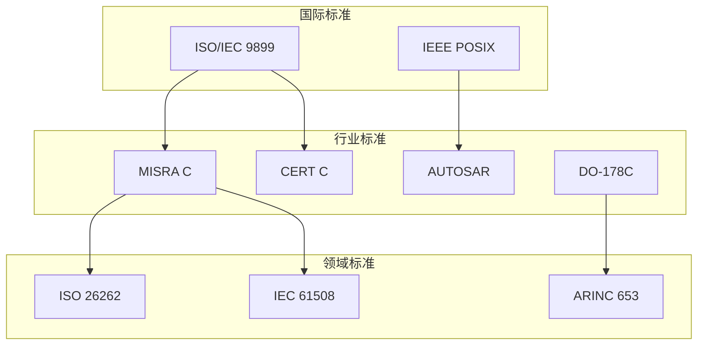

# 国际标准映射关系

> **层级定位**: 06 Thinking Representation / 05 Concept Mappings
> **用途**: 标准与知识主题的关联索引

---

## 国际标准索引

### ISO/IEC标准

| 标准 | 全称 | 适用主题 | 相关文件 |
|:-----|:-----|:---------|:---------|
| ISO/IEC 9899:2018 | C17 Programming Language | 所有C语言核心 | 01_Core_Knowledge_System |
| ISO/IEC 9899:2011 | C11 Programming Language | C11新特性 | 07_Modern_C |
| ISO/IEC TR 24731 | Bounds-Checking Interfaces | 安全编程 | 12_Safety_Extensions |
| ISO/IEC 10646 | Universal Coded Character Set | Unicode | 10_Unicode_Support |

### IEEE标准

| 标准 | 全称 | 适用主题 | 相关文件 |
|:-----|:-----|:---------|:---------|
| IEEE Std 1003.1 | POSIX.1 | 系统编程 | 09_POSIX_API, 06_Advanced_Layer |
| IEEE 754 | Floating-Point Arithmetic | 浮点运算 | 01_Data_Types |
| IEEE 802.11 | Wi-Fi | 网络 | 05_Wireless_Protocol |
| IEEE 802.15.4 | Zigbee PHY/MAC | 物联网 | 05_Wireless_Protocol |
| IEEE 1588 | PTP | 时间同步 | 03_High_Frequency_Trading |

### 行业安全标准

| 标准 | 全称 | 适用主题 | 相关文件 |
|:-----|:-----|:---------|:---------|
| MISRA C:2012 | Motor Industry Software Reliability | 安全编码 | 05_Engineering, 01_Automotive_ECU |
| CERT C | SEI CERT C Coding Standard | 安全编码 | 所有代码文件 |
| ISO 26262 | Road Vehicles Functional Safety | 汽车安全 | 01_Automotive_ECU |
| DO-178C | Airborne Software | 航空电子 | 02_Avionics_Systems |
| IEC 61508 | Functional Safety | 工业安全 | 07_Space_Computing |
| ISO 21434 | Road Vehicles Cybersecurity | 汽车安全 | 01_Automotive_ECU |

### 通信标准

| 标准 | 全称 | 适用主题 | 相关文件 |
|:-----|:-----|:---------|:---------|
| 3GPP TS 38.xxx | 5G NR | 5G基带 | 04_5G_Baseband |
| Bluetooth Core Spec | Bluetooth | BLE | 05_Wireless_Protocol |
| CAN ISO 11898 | CAN Bus | 汽车通信 | 01_Automotive_ECU |
| ARINC 429 | Avionics Data Bus | 航空 | 02_Avionics_Systems |
| InfiniBand Spec | InfiniBand | 高性能网络 | 12_RDMA_Networking |

### 多媒体标准

| 标准 | 全称 | 适用主题 | 相关文件 |
|:-----|:-----|:---------|:---------|
| ITU-T H.264 | AVC Video Coding | 视频编解码 | 04_Video_Codec |
| ITU-T H.265 | HEVC | 视频编解码 | 04_Video_Codec |
| ISO/IEC 14496 | MPEG-4 | 多媒体 | 04_Video_Codec |

### 可信计算

| 标准 | 全称 | 适用主题 | 相关文件 |
|:-----|:-----|:---------|:---------|
| TCG TPM 2.0 | Trusted Platform Module | 硬件安全 | 06_Security_Boot, 07_Hardware_Security |
| ARM TF-A | Trusted Firmware-A | 安全启动 | 06_Security_Boot |
| GlobalPlatform | Secure Element | 安全元件 | 07_Hardware_Security |
| PKCS#11 | Cryptographic Token Interface | HSM | 07_Hardware_Security |

---

## 标准-主题映射矩阵

```
                    MISRA  CERT  POSIX  ISO C  5G   AUTOSAR
                    ───────────────────────────────────────
基础语法              ●      ●      ○      ●      ○      ○
内存管理              ●      ●      ○      ●      ○      ○
并发编程              ●      ●      ●      ●      ○      ○
网络编程              ○      ●      ●      ○      ○      ○
汽车ECU               ●      ●      ○      ●      ○      ●
5G基带                ○      ○      ○      ○      ●      ○
安全启动              ●      ●      ○      ○      ○      ○
航天计算              ●      ●      ○      ○      ○      ○

● = 强相关  ○ = 弱相关
```

---

## 标准层级关系



---

## 合规性检查清单

### MISRA C:2012 关键规则

| 规则 | 描述 | 检查文件 |
|:-----|:-----|:---------|
| Dir 4.6 | 使用显式类型 | 所有数据类型文件 |
| Rule 17.7 | 检查返回值 | 所有标准库调用 |
| Rule 21.3 | 禁止使用malloc | 嵌入式安全文件 |

### CERT C 关键规则

| 规则 | 描述 | 检查文件 |
|:-----|:-----|:---------|
| EXP30-C | 序列点规则 | 表达式文件 |
| MEM30-C | 内存安全 | 内存管理文件 |
| FIO30-C | 文件IO安全 | 文件操作文件 |

---

> **更新记录**
>
> - 2025-03-09: 创建标准映射关系
