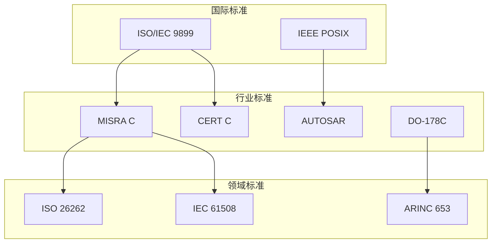

# 国际标准映射关系

> **层级定位**: 06 Thinking Representation / 05 Concept Mappings
> **用途**: 标准与知识主题的关联索引

---

## 国际标准索引

### ISO/IEC标准

| 标准 | 全称 | 适用主题 | 相关文件 |
|:-----|:-----|:---------|:---------|
| ISO/IEC 9899:2018 | C17 Programming Language | 所有C语言核心 | 01_Core_Knowledge_System |
| ISO/IEC 9899:2011 | C11 Programming Language | C11新特性 | 07_Modern_C |
| ISO/IEC 9899:1999 | C99 Programming Language | C99新特性 | 07_Modern_C |
| ISO/IEC 9899:1990 | C89/C90 Programming Language | 基础语法 | 01_Core_Knowledge_System |
| ISO/IEC TR 24731 | Bounds-Checking Interfaces | 安全编程 | 12_Safety_Extensions |
| ISO/IEC 10646 | Universal Coded Character Set | Unicode | 10_Unicode_Support |
| ISO/IEC 14882 | C++ Programming Language | C++对比 | 13_Language_Comparison |

### IEEE标准

| 标准 | 全称 | 适用主题 | 相关文件 |
|:-----|:-----|:---------|:---------|
| IEEE Std 1003.1 | POSIX.1 | 系统编程 | 09_POSIX_API, 06_Advanced_Layer |
| IEEE 754 | Floating-Point Arithmetic | 浮点运算 | 01_Data_Types |
| IEEE 802.11 | Wi-Fi | 网络 | 05_Wireless_Protocol |
| IEEE 802.15.4 | Zigbee PHY/MAC | 物联网 | 05_Wireless_Protocol |
| IEEE 1588 | PTP | 时间同步 | 03_High_Frequency_Trading |

### 行业安全标准

| 标准 | 全称 | 适用主题 | 相关文件 |
|:-----|:-----|:---------|:---------|
| MISRA C:2012 | Motor Industry Software Reliability | 安全编码 | 05_Engineering, 01_Automotive_ECU |
| MISRA C:2004 | Motor Industry Software Reliability | 安全编码 | 05_Engineering |
| CERT C | SEI CERT C Coding Standard | 安全编码 | 所有代码文件 |
| ISO 26262 | Road Vehicles Functional Safety | 汽车安全 | 01_Automotive_ECU |
| DO-178C | Airborne Software | 航空电子 | 02_Avionics_Systems |
| IEC 61508 | Functional Safety | 工业安全 | 07_Space_Computing |
| ISO 21434 | Road Vehicles Cybersecurity | 汽车安全 | 01_Automotive_ECU |
| EN 50128 | Railway Software Safety | 铁路安全 | 05_Engineering |

### 通信标准

| 标准 | 全称 | 适用主题 | 相关文件 |
|:-----|:-----|:---------|:---------|
| 3GPP TS 38.xxx | 5G NR | 5G基带 | 04_5G_Baseband |
| Bluetooth Core Spec | Bluetooth | BLE | 05_Wireless_Protocol |
| CAN ISO 11898 | CAN Bus | 汽车通信 | 01_Automotive_ECU |
| ARINC 429 | Avionics Data Bus | 航空 | 02_Avionics_Systems |
| ARINC 653 | Avionics Partitioning | 航空OS | 02_Avionics_Systems |
| InfiniBand Spec | InfiniBand | 高性能网络 | 12_RDMA_Networking |
| Ethernet IEEE 802.3 | Ethernet | 网络通信 | 08_Network_Programming |

### 多媒体标准

| 标准 | 全称 | 适用主题 | 相关文件 |
|:-----|:-----|:---------|:---------|
| ITU-T H.264 | AVC Video Coding | 视频编解码 | 04_Video_Codec |
| ITU-T H.265 | HEVC | 视频编解码 | 04_Video_Codec |
| ITU-T H.266 | VVC | 视频编解码 | 04_Video_Codec |
| ISO/IEC 14496 | MPEG-4 | 多媒体 | 04_Video_Codec |
| ISO/IEC 23008 | HEVC Standard | 视频编码 | 04_Video_Codec |

### 可信计算

| 标准 | 全称 | 适用主题 | 相关文件 |
|:-----|:-----|:---------|:---------|
| TCG TPM 2.0 | Trusted Platform Module | 硬件安全 | 06_Security_Boot, 07_Hardware_Security |
| ARM TF-A | Trusted Firmware-A | 安全启动 | 06_Security_Boot |
| GlobalPlatform | Secure Element | 安全元件 | 07_Hardware_Security |
| PKCS#11 | Cryptographic Token Interface | HSM | 07_Hardware_Security |
| FIPS 140-2/3 | Security Requirements | 加密模块 | 08_Cryptography |
| Common Criteria | ISO/IEC 15408 | 安全评估 | 09_Security_Certification |

---

## 标准-主题映射矩阵

```
                    MISRA  CERT  POSIX  ISO C  5G   AUTOSAR
                    -----------------------------------------
基础语法              ●      ●      ○      ●      ○      ○
内存管理              ●      ●      ○      ●      ○      ○
并发编程              ●      ●      ●      ●      ○      ○
网络编程              ○      ●      ●      ○      ○      ○
汽车ECU               ●      ●      ○      ●      ○      ●
5G基带                ○      ○      ○      ○      ●      ○
安全启动              ●      ●      ○      ○      ○      ○
航天计算              ●      ●      ○      ○      ○      ○

● = 强相关  ○ = 弱相关
```

---

## 标准层级关系



---

## C语言标准演进时间线

```
1972  ---+---  C语言诞生 (K&R)
         |
1978  ---+--- K&R C (The C Programming Language)
         |
1983  ---+--- ANSI成立X3J11委员会
         |
1989  ---+--- C89/ANSI C 发布
         |
1990  ---+--- ISO/IEC 9899:1990 (C90)
         |
1995  ---+--- C95 (AMD1) - 多字节字符支持
         |
1999  ---+--- ISO/IEC 9899:1999 (C99)
         |         + long long
         |         + _Bool
         |         + 变长数组(VLA)
         |         + 内联函数
         |         + 单行注释
         |         + 混合声明
         |
2000  ---+--- C99修正版
         |
2004  ---+--- C99技术修正
         |
2011  ---+--- ISO/IEC 9899:2011 (C11)
         |         + 多线程支持 (_Thread_local, threads.h)
         |         + 原子操作 (_Atomic)
         |         + 静态断言 (_Static_assert)
         |         + 匿名结构/联合
         |         + 边界检查接口 (Annex K)
         |
2017  ---+--- ISO/IEC 9899:2018 (C17/C18)
         |         + 修复C11缺陷
         |         + 删除gets()
         |         + 无新特性
         |
2023  ---+--- ISO/IEC 9899:2024 (C23)
         |         + nullptr
         |         + auto类型推导
         |         + typeof操作符
         |         + _BitInt任意精度整数
         |         + constexpr
         |         + 标签属性
         |
2026  ---+--- C2x (进行中)
          ...
```

---

## C标准关键特性演进矩阵

| 特性 | C89 | C95 | C99 | C11 | C17 | C23 |
|:-----|:---:|:---:|:---:|:---:|:---:|:---:|
| **// 注释** | ❌ | ❌ | ✅ | ✅ | ✅ | ✅ |
| **变长数组VLA** | ❌ | ❌ | ✅ | ✅ | 可选 | 可选 |
| **long long** | ❌ | ❌ | ✅ | ✅ | ✅ | ✅ |
| **_Bool** | ❌ | ❌ | ✅ | ✅ | ✅ | ✅ |
| **复数类型** | ❌ | ❌ | ✅ | ✅ | ✅ | ✅ |
| **内联函数** | ❌ | ❌ | ✅ | ✅ | ✅ | ✅ |
| **混合声明** | ❌ | ❌ | ✅ | ✅ | ✅ | ✅ |
| **for循环初始化** | ❌ | ❌ | ✅ | ✅ | ✅ | ✅ |
| **_Static_assert** | ❌ | ❌ | ❌ | ✅ | ✅ | ✅ |
| **_Thread_local** | ❌ | ❌ | ❌ | ✅ | ✅ | ✅ |
| **_Atomic** | ❌ | ❌ | ❌ | ✅ | ✅ | ✅ |
| **多线程库** | ❌ | ❌ | ❌ | ✅ | ✅ | ✅ |
| **匿名结构/联合** | ❌ | ❌ | ❌ | ✅ | ✅ | ✅ |
| **char16_t/char32_t** | ❌ | ❌ | ❌ | ✅ | ✅ | ✅ |
| **nullptr** | ❌ | ❌ | ❌ | ❌ | ❌ | ✅ |
| **typeof** | ❌ | ❌ | ❌ | ❌ | ❌ | ✅ |
| **auto** | ❌ | ❌ | ❌ | ❌ | ❌ | ✅ |
| **_BitInt(N)** | ❌ | ❌ | ❌ | ❌ | ❌ | ✅ |
| **constexpr** | ❌ | ❌ | ❌ | ❌ | ❌ | ✅ |
| **_Decimal128** | ❌ | ❌ | ❌ | ❌ | ❌ | ✅ |

---

## 合规性检查清单

### MISRA C:2012 关键规则

| 规则 | 描述 | 检查文件 |
|:-----|:-----|:---------|
| Dir 4.6 | 使用显式类型 | 所有数据类型文件 |
| Rule 17.7 | 检查返回值 | 所有标准库调用 |
| Rule 21.3 | 禁止使用malloc | 嵌入式安全文件 |
| Rule 8.13 | 指针应为const | 接口设计文件 |
| Rule 10.3 | 禁止隐式类型转换 | 类型安全文件 |
| Rule 14.4 | 循环必须有单一出口 | 控制流文件 |
| Rule 15.5 | 单一返回点 | 函数设计文件 |

### CERT C 关键规则

| 规则 | 描述 | 检查文件 |
|:-----|:-----|:---------|
| EXP30-C | 序列点规则 | 表达式文件 |
| MEM30-C | 内存安全 | 内存管理文件 |
| FIO30-C | 文件IO安全 | 文件操作文件 |
| INT30-C | 整数溢出 | 算术运算文件 |
| STR31-C | 字符串安全 | 字符串处理文件 |
| MSC30-C | 伪随机数安全 | 安全随机文件 |
| ERR30-C | 错误处理 | 错误处理文件 |

---

## 标准选择指南

| 应用场景 | 推荐标准 | 理由 |
|:---------|:---------|:-----|
| 通用开发 | C11/C17 | 现代特性 + 稳定 |
| 嵌入式/汽车 | MISRA C:2012 | 安全关键 |
| 安全软件 | CERT C | 漏洞防护 |
| 遗留系统维护 | C89 | 兼容性 |
| 前沿探索 | C23 | 最新特性 |
| 教学学习 | C11 | 平衡特性与复杂度 |
| 航空电子 | DO-178C + MISRA | 高可靠性 |
| 工业控制 | IEC 61508 | 功能安全 |

---

## 标准合规工具

| 工具 | 支持标准 | 类型 | 说明 |
|:-----|:---------|:-----|:-----|
| PC-lint | MISRA/CERT | 静态分析 | 商业工具 |
| Cppcheck | MISRA/CERT | 静态分析 | 开源免费 |
| Coverity | MISRA/CERT | 静态分析 | 商业企业级 |
| Clang Static Analyzer | CERT | 静态分析 | 开源 |
| CompCert | ISO C | 形式化验证 | 验证编译器 |
| Frama-C | ISO C | 形式化分析 | 学术/工业 |

---

> **更新记录**
>
> - 2025-03-09: 创建标准映射关系
> - 2026-03-13: 扩展C标准演进时间线、特性矩阵、合规工具
