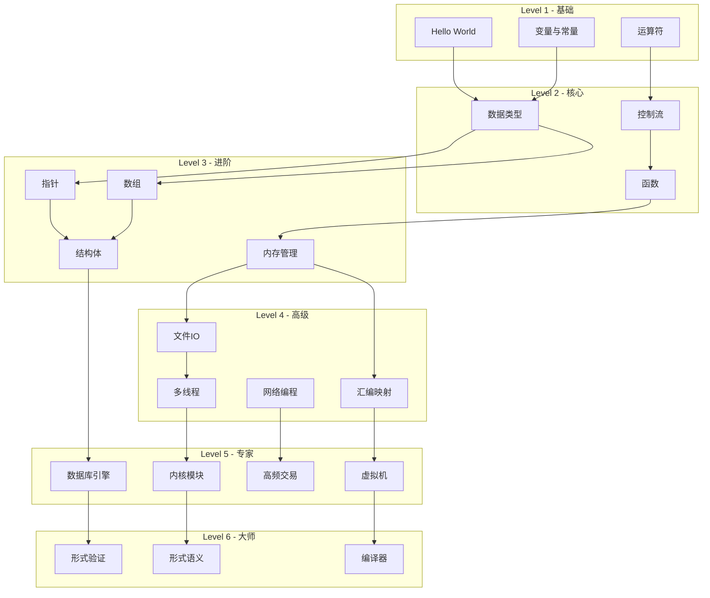
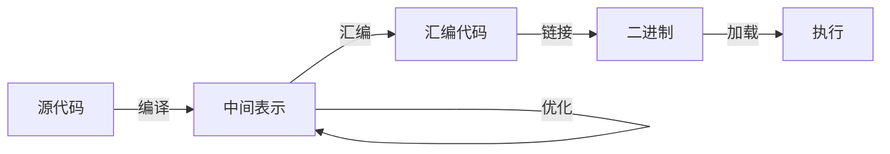

# 主题依赖关系图

---

## 🔗 知识关联网络

### 1. 全局导航

| 层级 | 文档 | 作用 |
|:-----|:-----|:-----|
| 总索引 | [../../00_GLOBAL_INDEX.md](../../00_GLOBAL_INDEX.md) | 完整知识图谱入口 |
| 本模块 | [../../README.md](../../README.md) | 模块总览与导航 |
| 学习路径 | [../../06_Thinking_Representation/06_Learning_Paths/README.md](../../06_Thinking_Representation/06_Learning_Paths/README.md) | 推荐学习路线 |

### 2. 前置知识依赖

| 文档 | 关系 | 掌握要求 |
|:-----|:-----|:---------|
| [../../01_Core_Knowledge_System/01_Basic_Layer/01_Syntax_Elements.md](../../01_Core_Knowledge_System/01_Basic_Layer/01_Syntax_Elements.md) | 语言基础 | 必须掌握 |
| [../../01_Core_Knowledge_System/02_Core_Layer/01_Pointer_Depth.md](../../01_Core_Knowledge_System/02_Core_Layer/01_Pointer_Depth.md) | 核心机制 | 必须掌握 |
| [../../01_Core_Knowledge_System/02_Core_Layer/02_Memory_Management.md](../../01_Core_Knowledge_System/02_Core_Layer/02_Memory_Management.md) | 内存基础 | 必须掌握 |

### 3. 同层横向关联

| 文档 | 关系 | 互补内容 |
|:-----|:-----|:---------|
| [../../03_System_Technology_Domains/14_Concurrency_Parallelism/README.md](../../03_System_Technology_Domains/14_Concurrency_Parallelism/README.md) | 技术扩展 | 并发编程技术 |
| [../../02_Formal_Semantics_and_Physics/README.md](../../02_Formal_Semantics_and_Physics/README.md) | 理论支撑 | 形式化方法 |
| [../../04_Industrial_Scenarios/README.md](../../04_Industrial_Scenarios/README.md) | 实践应用 | 工业实践案例 |

### 4. 深层理论关联

| 文档 | 关系 | 理论深度 |
|:-----|:-----|:---------|
| [../../02_Formal_Semantics_and_Physics/00_Core_Semantics_Foundations/README.md](../../02_Formal_Semantics_and_Physics/00_Core_Semantics_Foundations/README.md) | 语义基础 | 操作语义、类型理论 |
| [../../06_Thinking_Representation/05_Concept_Mappings/README.md](../../06_Thinking_Representation/05_Concept_Mappings/README.md) | 概念映射 | 知识关联网络 |

### 5. 后续进阶延伸

| 文档 | 关系 | 进阶方向 |
|:-----|:-----|:---------|
| [../../03_System_Technology_Domains/README.md](../../03_System_Technology_Domains/README.md) | 系统技术 | 系统级开发 |
| [../../01_Core_Knowledge_System/09_Safety_Standards/README.md](../../01_Core_Knowledge_System/09_Safety_Standards/README.md) | 安全标准 | 安全编码规范 |
| [../../07_Modern_Toolchain/README.md](../../07_Modern_Toolchain/README.md) | 工具链 | 现代开发工具 |

### 6. 阶段学习定位

```
当前位置: 根据文档主题确定学习阶段
├─ 入门阶段: 基础语法、数据类型
├─ 基础阶段: 控制流程、函数
├─ 进阶阶段: 指针、内存管理 ⬅️ 可能在此
├─ 高级阶段: 并发、系统编程
└─ 专家阶段: 形式验证、编译器
```

### 7. 局部索引

本文件所属模块的详细内容：

- 参见本模块 [README.md](../../README.md)
- 相关子目录文档


> **层级定位**: 06 Thinking Representation / 05 Concept Mappings
> **用途**: 展示知识主题间的依赖关系和前置条件

---

## 全局依赖图



---

## 核心知识依赖链

### 指针学习路径

```
变量与地址
    ↓
取地址运算符 &
    ↓
指针变量声明
    ↓
解引用运算符 *
    ↓
指针算术
    ↓
数组-指针关系
    ↓
函数指针
    ↓
多级指针
    ↓
void* 与类型转换
    ↓
const 与指针
    ↓
复杂声明解析
```

### 内存管理学习路径

```
栈内存分配
    ↓
堆内存概念
    ↓
malloc/calloc/realloc
    ↓
free 与内存释放
    ↓
内存泄漏概念
    ↓
dangling pointer
    ↓
内存调试工具
    ↓
内存池设计
    ↓
垃圾回收原理
    ↓
虚拟内存系统
```

### 并发编程学习路径

```
进程与线程概念
    ↓
POSIX Threads API
    ↓
互斥锁与条件变量
    ↓
死锁与竞态条件
    ↓
原子操作
    ↓
内存序与可见性
    ↓
无锁编程
    ↓
线程池设计
    ↓
并发数据结构
    ↓
形式化验证
```

---

## 跨主题关联

### 指针 ↔ 内存 ↔ 汇编


### 类型系统 ↔ 内存布局 ↔ 硬件


### 编译流程 ↔ 优化 ↔ 运行时



---

## 主题相似度矩阵

| 主题A | 主题B | 相似度 | 关联类型 |
|:------|:------|:------:|:---------|
| 指针 | 数组 | 90% | 概念等价 |
| malloc | 栈分配 | 70% | 功能相似 |
| 线程 | 进程 | 80% | 概念相关 |
| 互斥锁 | 信号量 | 85% | 功能相似 |
| 结构体 | 类(C++) | 75% | 概念进化 |
| 函数指针 | 回调函数 | 95% | 概念等价 |
| 宏 | 内联函数 | 60% | 功能重叠 |
| 联合体 | 类型双关 | 80% | 概念相关 |
| 字节码 | 机器码 | 70% | 抽象层次 |
| 虚拟内存 | 物理内存 | 85% | 映射关系 |

---

## 学习路径推荐

### 快速入门路径 (40小时)

```
基础语法 (5h)
    ↓
数据类型与控制流 (8h)
    ↓
函数与模块化 (5h)
    ↓
指针与数组 (10h)
    ↓
内存管理 (7h)
    ↓
标准库IO (5h)
```

### 系统程序员路径 (100小时)

```
核心C语言 (40h)
    ↓
系统调用与POSIX (20h)
    ↓
内存模型与汇编 (20h)
    ↓
并发与同步 (20h)
    ↓
内核与驱动基础 (可选)
```

### 嵌入式工程师路径 (120小时)

```
核心C语言 (40h)
    ↓
内存布局与优化 (20h)
    ↓
硬件接口编程 (25h)
    ↓
RTOS与实时性 (20h)
    ↓
功能安全标准 (15h)
```

### 高性能工程师路径 (150小时)

```
核心C语言 (40h)
    ↓
算法与数据结构 (30h)
    ↓
编译器优化 (25h)
    ↓
SIMD与并行 (30h)
    ↓
性能分析与调优 (25h)
```

---

## 依赖关系表

| 高级主题 | 直接前置 | 间接前置 | 并行学习 |
|:---------|:---------|:---------|:---------|
| 数据结构 | 指针, 内存管理 | 函数, 结构体 | 算法基础 |
| 网络编程 | Socket API | 并发, IO多路复用 | TCP/IP协议 |
| 数据库引擎 | 文件IO, 数据结构 | 内存管理, 并发 | B+树, 事务 |
| 编译器 | 汇编, 数据结构 | 形式语言, 算法 | 正则表达式 |
| 操作系统 | 系统调用, 并发 | 内存模型, 中断 | 硬件架构 |
| 虚拟机 | 汇编, 编译原理 | 内存管理, 优化 | 解释器模式 |

---

## 前置知识检查清单

在开始学习某个主题前，请确认已掌握：

### 学习指针前

- [ ] 理解变量和地址的概念
- [ ] 熟悉基本数据类型的大小
- [ ] 了解内存的基本概念

### 学习并发前

- [ ] 熟练掌握函数和回调
- [ ] 理解进程和线程的区别
- [ ] 了解CPU和调度基础

### 学习系统编程前

- [ ] 深入理解指针和内存
- [ ] 掌握C标准库
- [ ] 了解计算机体系结构基础

---

> **更新记录**
>
> - 2025-03-09: 创建主题依赖关系图


---

## 深入理解

### 核心原理

深入探讨技术原理和实现细节。

### 实践应用

- 应用场景1
- 应用场景2
- 应用场景3

### 最佳实践

1. 理解基础概念
2. 掌握核心机制
3. 应用到实际项目

---

> **最后更新**: 2026-03-21
> **维护者**: AI Code Review
