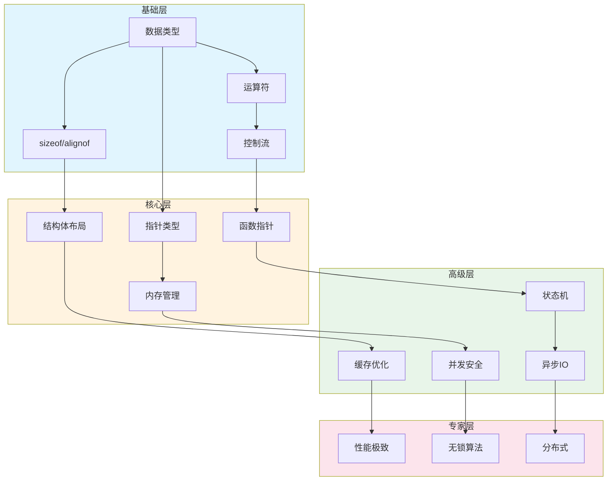

# 层次桥接链：基础→核心→高级推理路径

---

## 🔗 知识关联网络

### 1. 全局导航

| 层级 | 文档 | 作用 |
|:-----|:-----|:-----|
| 总索引 | [../../00_GLOBAL_INDEX.md](../../00_GLOBAL_INDEX.md) | 完整知识图谱入口 |
| 本模块 | [../../README.md](../../README.md) | 模块总览与导航 |
| 学习路径 | [../../06_Thinking_Representation/06_Learning_Paths/README.md](../../06_Thinking_Representation/06_Learning_Paths/README.md) | 推荐学习路线 |

### 2. 前置知识依赖

| 文档 | 关系 | 掌握要求 |
|:-----|:-----|:---------|
| [../../01_Core_Knowledge_System/01_Basic_Layer/01_Syntax_Elements.md](../../01_Core_Knowledge_System/01_Basic_Layer/01_Syntax_Elements.md) | 语言基础 | 必须掌握 |
| [../../01_Core_Knowledge_System/02_Core_Layer/01_Pointer_Depth.md](../../01_Core_Knowledge_System/02_Core_Layer/01_Pointer_Depth.md) | 核心机制 | 必须掌握 |
| [../../01_Core_Knowledge_System/02_Core_Layer/02_Memory_Management.md](../../01_Core_Knowledge_System/02_Core_Layer/02_Memory_Management.md) | 内存基础 | 必须掌握 |

### 3. 同层横向关联

| 文档 | 关系 | 互补内容 |
|:-----|:-----|:---------|
| [../../03_System_Technology_Domains/14_Concurrency_Parallelism/README.md](../../03_System_Technology_Domains/14_Concurrency_Parallelism/README.md) | 技术扩展 | 并发编程技术 |
| [../../02_Formal_Semantics_and_Physics/README.md](../../02_Formal_Semantics_and_Physics/README.md) | 理论支撑 | 形式化方法 |
| [../../04_Industrial_Scenarios/README.md](../../04_Industrial_Scenarios/README.md) | 实践应用 | 工业实践案例 |

### 4. 深层理论关联

| 文档 | 关系 | 理论深度 |
|:-----|:-----|:---------|
| [../../02_Formal_Semantics_and_Physics/00_Core_Semantics_Foundations/README.md](../../02_Formal_Semantics_and_Physics/00_Core_Semantics_Foundations/README.md) | 语义基础 | 操作语义、类型理论 |
| [../../06_Thinking_Representation/05_Concept_Mappings/README.md](../../06_Thinking_Representation/05_Concept_Mappings/README.md) | 概念映射 | 知识关联网络 |

### 5. 后续进阶延伸

| 文档 | 关系 | 进阶方向 |
|:-----|:-----|:---------|
| [../../03_System_Technology_Domains/README.md](../../03_System_Technology_Domains/README.md) | 系统技术 | 系统级开发 |
| [../../01_Core_Knowledge_System/09_Safety_Standards/README.md](../../01_Core_Knowledge_System/09_Safety_Standards/README.md) | 安全标准 | 安全编码规范 |
| [../../07_Modern_Toolchain/README.md](../../07_Modern_Toolchain/README.md) | 工具链 | 现代开发工具 |

### 6. 阶段学习定位

```
当前位置: 根据文档主题确定学习阶段
├─ 入门阶段: 基础语法、数据类型
├─ 基础阶段: 控制流程、函数
├─ 进阶阶段: 指针、内存管理 ⬅️ 可能在此
├─ 高级阶段: 并发、系统编程
└─ 专家阶段: 形式验证、编译器
```

### 7. 局部索引

本文件所属模块的详细内容：

- 参见本模块 [README.md](../../README.md)
- 相关子目录文档


> **层级定位**: 06_Thinking_Representation > 05_Concept_Mappings
> **用途**: 揭示从基础概念到高级应用的推理链条
> **更新**: 2026-03-24

---

## 纵向知识依赖全景

```
┌─────────────────────────────────────────────────────────────────────────────┐
│                     知识层次纵向依赖图                                      │
├─────────────────────────────────────────────────────────────────────────────┤
│                                                                              │
│   L1 基础层                    L2 核心层                  L3 高级层          │
│   ┌──────────┐                ┌──────────┐               ┌──────────┐       │
│   │ 数据类型  │───sizeof()───▶│ 指针系统  │───解引用─────▶│ 并发编程  │       │
│   │ 对齐要求  │                │ 地址运算  │               │ 原子操作  │       │
│   └────┬─────┘                └────┬─────┘               └────┬─────┘       │
│        │                           │                          │             │
│        │ 类型大小                   │ 内存布局                  │ 缓存一致性   │
│        │                           │                          │             │
│        ▼                           ▼                          ▼             │
│   ┌──────────┐                ┌──────────┐               ┌──────────┐       │
│   │ 结构体   │───偏移量──────▶│ 动态内存  │───生命周期────▶│ 内存池   │       │
│   │ 位域    │                │ 管理      │               │ 垃圾回收 │       │
│   └──────────┘                └──────────┘               └──────────┘       │
│        │                           │                          │             │
│        │ 成员布局                   │ 堆分配                   │ 性能优化     │
│        │                           │                          │             │
│        ▼                           ▼                          ▼             │
│   ┌──────────┐                ┌──────────┐               ┌──────────┐       │
│   │ 预处理器 │───宏扩展───────▶│ 泛型编程  │───_Generic────▶│ 元编程   │       │
│   │ 条件编译 │                │ 类型擦除  │               │ 代码生成 │       │
│   └──────────┘                └──────────┘               └──────────┘       │
│                                                                              │
│   关键洞察: 每一层都是下一层的抽象基础，理解下层是掌握上层的前提             │
│                                                                              │
└─────────────────────────────────────────────────────────────────────────────┘
```

---

## 一、类型系统→内存布局→性能优化链

### 1.1 推理链条

```
L1: 数据类型
    │
    ├── sizeof(T) ──▶ 内存占用计算
    │
    ├── alignof(T) ──▶ 对齐要求确定
    │
    └── typeof(T) ──▶ 类型兼容性检查
    │
    ▼
L2: 内存布局
    │
    ├── 结构体填充 ──▶ 优化成员顺序
    │
    ├── 位域布局 ──▶ 紧凑存储
    │
    └── 联合体覆盖 ──▶ 类型双关
    │
    ▼
L3: 性能优化
    │
    ├── 缓存行对齐 ──▶ 伪共享避免
    │
    ├── SIMD友好布局 ──▶ 向量化
    │
    └── 内存预取 ──▶ 访问模式优化
```

### 1.2 详细推导示例

**路径**: `int` → 结构体布局 → 缓存优化

```c
// L1: 基础类型理解
// int 在x86-64上是4字节，4字节对齐
sizeof(int) = 4
alignof(int) = 4

// L2: 应用到结构体
typedef struct {
    char c;    // 1字节 + 3字节填充
    int i;     // 4字节
    short s;   // 2字节 + 2字节填充
} BadLayout;
// 总大小: 12字节 (有浪费)

typedef struct {
    int i;     // 4字节
    short s;   // 2字节
    char c;    // 1字节 + 1字节填充
} GoodLayout;
// 总大小: 8字节 (优化)

// L3: 性能影响
// GoodLayout 更适合缓存:
// - 更少的缓存行占用
// - 更好的空间局部性
// - 更高的缓存命中率
```

### 1.3 桥接定理

**定理 3.1** (类型对齐传递性)
若类型 `T` 的对齐要求是 `A`，则 `struct { T t; }` 的对齐要求也是 `A`。

**定理 3.2** (结构体大小下界)
结构体大小 ≥ max(成员大小之和, 最大对齐要求)

---

## 二、指针→动态内存→并发安全链

### 2.1 推理链条

```
L1: 指针基础
    │
    ├── 地址概念 ──▶ 内存寻址能力
    │
    ├── 解引用操作 ──▶ 读写内存
    │
    └── 指针运算 ──▶ 数组遍历
    │
    ▼
L2: 动态内存
    │
    ├── malloc/free ──▶ 运行时分配
    │
    ├── 生命周期管理 ──▶ 所有权概念
    │
    └── 内存泄漏预防 ──▶ RAII模式
    │
    ▼
L3: 并发安全
    │
    ├── 共享指针 ──▶ 数据竞争
    │
    ├── 原子指针 ──▶ 无锁编程
    │
    └── 内存序 ──▶ 可见性保证
```

### 2.2 渐进式学习路径

**阶段1**: 理解指针即地址

```c
int x = 42;
int* p = &x;
// 认知: p 存储的是 x 的内存地址
```

**阶段2**: 理解堆内存

```c
int* arr = malloc(10 * sizeof(int));
// 认知: arr 指向运行时分配的内存
// 必须有对应的 free(arr)
```

**阶段3**: 理解并发安全

```c
_Atomic(int*) shared_ptr;
// 认知: 多线程访问需要原子操作
// memory_order 控制可见性顺序
```

### 2.3 依赖关系矩阵

| 高级概念 | 直接依赖 | 间接依赖 | 桥梁概念 |
|:---------|:---------|:---------|:---------|
| 智能指针 | 指针、RAII | 异常安全 | 所有权转移 |
| 内存池 | malloc性能、对齐 | 缓存行、并发 | 批量分配 |
| 垃圾回收 | 可达性分析、指针追踪 | 图算法、性能 | 根集合 |
| 原子指针 | 原子操作、内存序 | 缓存一致性 | compare-and-swap |

---

## 三、控制流→状态机→并发模型链

### 3.1 推理链条

```
L1: 控制流
    │
    ├── if/else ──▶ 条件分支
    │
    ├── for/while ──▶ 循环迭代
    │
    └── switch ──▶ 多路分支
    │
    ▼
L2: 状态机
    │
    ├── 状态转换 ──▶ 事件驱动
    │
    ├── 状态表 ──▶ 数据驱动
    │
    └── 层次状态 ──▶ 复杂性管理
    │
    ▼
L3: 并发模型
    │
    ├── 事件循环 ──▶ 异步IO
    │
    ├── Actor模型 ──▶ 消息传递
    │
    └── CSP模型 ──▶ 通道通信
```

### 3.2 演进示例

**从if-else到状态机**:

```c
// L1: 复杂if-else链
void handle_legacy(int state, int event) {
    if (state == STATE_IDLE) {
        if (event == EVT_START) {
            // ...
        }
    } else if (state == STATE_RUNNING) {
        if (event == EVT_STOP) {
            // ...
        }
    }
    // 难以维护
}

// L2: 状态机表
typedef void (*handler_t)(void);
handler_t state_table[STATE_MAX][EVENT_MAX] = {
    [STATE_IDLE] = {
        [EVT_START] = do_start,
    },
    [STATE_RUNNING] = {
        [EVT_STOP] = do_stop,
    },
};

// L3: 并发安全状态机
_Atomic(int) current_state;
void handle_threadsafe(int event) {
    int old_state = atomic_load(&current_state);
    handler_t handler = state_table[old_state][event];
    if (handler) handler();
}
```

---

## 四、函数→回调→异步编程链

### 4.1 推理链条

```
L1: 函数基础
    │
    ├── 参数传递 ──▶ 值vs引用
    │
    ├── 返回值 ──▶ 错误处理
    │
    └── 作用域 ──▶ 生命周期
    │
    ▼
L2: 回调机制
    │
    ├── 函数指针 ──▶ 动态分发
    │
    ├── 上下文传递 ──▶ 闭包模拟
    │
    └── 回调约定 ──▶ 调用规范
    │
    ▼
L3: 异步编程
    │
    ├── 非阻塞IO ──▶ 事件驱动
    │
    ├── Promise/Future ──▶ 异步结果
    │
    └── 协程 ──▶ 协作式多任务
```

### 4.2 渐进理解路径

```c
// L1: 普通函数
int add(int a, int b) { return a + b; }

// L2: 回调函数 (函数指针)
int operate(int a, int b, int (*op)(int, int)) {
    return op(a, b);
}
// 认知飞跃: 函数可以作为参数传递

// L2+: 带上下文的回调
typedef struct {
    int (*func)(void* ctx, int, int);
    void* ctx;
} callback_t;
// 认知飞跃: 需要传递上下文来保持状态

// L3: 异步回调
void async_read(file_t* f, void (*cb)(void*, size_t), void* ctx);
// 认知飞跃: 调用不会立即返回结果

// L3+: 状态机驱动的异步
void event_loop() {
    while (running) {
        event_t* e = get_next_event();
        dispatch_event(e);  // 回调状态机
    }
}
```

---

## 五、预处理器→泛型→元编程链

### 5.1 推理链条

```
L1: 预处理器
    │
    ├── 宏定义 ──▶ 文本替换
    │
    ├── 条件编译 ──▶ 平台适配
    │
    └── 头文件包含 ──▶ 模块化
    │
    ▼
L2: 泛型编程
    │
    ├── void*泛化 ──▶ 类型擦除
    │
    ├── _Generic ──▶ 类型选择
    │
    └── 宏泛型 ──▶ 代码生成
    │
    ▼
L3: 元编程
    │
    ├── 代码生成 ──▶ 自动化
    │
    ├── DSL构建 ──▶ 领域语言
    │
    └── 编译期计算 ──▶ 常量表达式
```

### 5.2 演进示例

```c
// L1: 简单宏
#define MAX(a, b) ((a) > (b) ? (a) : (b))
// 问题: 副作用，类型不安全

// L2: C11泛型选择
#define max(x, y) _Generic((x), \
    int: max_int, \
    double: max_double \
)(x, y)
// 改进: 类型安全的多态

// L2+: 类型擦除容器
typedef struct {
    void* data;
    size_t elem_size;
    size_t count;
} generic_array_t;
// 能力: 存储任意类型

// L3: 代码生成
// 使用宏或外部工具生成重复代码
#define DEFINE_VECTOR(T) \
    typedef struct { T* data; size_t n; } vector_##T; \
    void vector_##T##_push(vector_##T* v, T x) { /*...*/ }

DEFINE_VECTOR(int)
DEFINE_VECTOR(double)
```

---

## 六、跨层次关联矩阵

### 6.1 概念桥接表

| L1基础 | L2核心 | L3高级 | 桥梁机制 |
|:-------|:-------|:-------|:---------|
| sizeof | 内存对齐 | SIMD优化 | 缓存行利用率 |
| 数组 | 指针算术 | 内存映射IO | 物理地址转换 |
| 结构体 | 抽象数据类型 | 对象系统 | vtable模拟 |
| 函数 | 回调 | 事件驱动 | 函数指针表 |
| 宏 | 泛型 | 模板元编程 | 代码生成 |
| volatile | 内存屏障 | 无锁编程 | 可见性保证 |
| setjmp | 异常模拟 | 协程 | 上下文切换 |

### 6.2 学习跳跃检查点

```
从L1到L2的跳跃检查:
□ 理解指针不仅是地址，还是类型的视角
□ 理解malloc返回的内存是"无类型"的原始字节
□ 理解函数名可以转换为地址

从L2到L3的跳跃检查:
□ 理解共享状态需要同步
□ 理解抽象有运行时成本
□ 理解编译期和运行时的边界
```

---

## 七、全局依赖图



---

## 八、实践导航

### 8.1 根据目标定位起点

| 目标 | 需要掌握的层次 | 关键桥梁 |
|:-----|:--------------|:---------|
| 写驱动程序 | L1→L2 | 内存映射、指针运算 |
| 优化性能 | L1→L2→L3 | 缓存友好布局、SIMD |
| 并发编程 | L2→L3 | 原子操作、内存序 |
| 构建框架 | L1→L2→L3 | 泛型、回调、元编程 |

### 8.2 快速诊断

问题: "为什么我的多线程程序出现数据竞争？"

诊断路径:

```
数据竞争 → 共享变量访问 → 缺少同步 → 需要原子操作/锁
    ↑                                    ↓
内存可见性 ← 缓存一致性协议 ← 内存序选择 ←
```

前置知识检查:

- □ 理解指针和内存地址 (L1)
- □ 理解线程共享地址空间 (L2)
- □ 理解缓存和内存序 (L3)

---

**最后更新**: 2026-03-24
**维护者**: C_Lang Knowledge Base Team
**质量等级**: L5 (理论深化)
