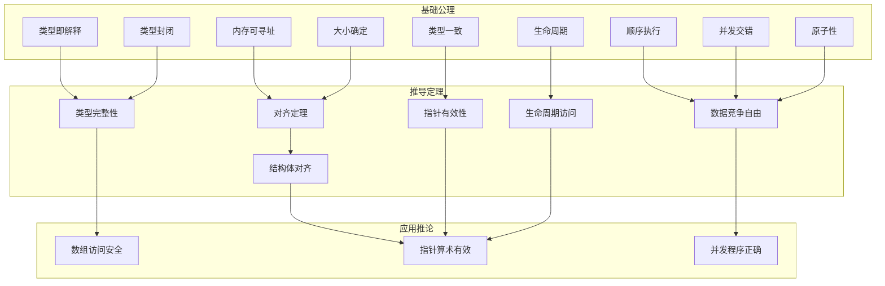

# 定理依赖网络：核心定理的逻辑依赖图

> **层级定位**: 06_Thinking_Representation > 05_Concept_Mappings
> **用途**: 揭示C语言核心定理之间的逻辑依赖关系
> **更新**: 2026-03-24

---

## 定理依赖全景

```
┌─────────────────────────────────────────────────────────────────────────────┐
│                    C语言核心理理依赖网络                                    │
├─────────────────────────────────────────────────────────────────────────────┤
│                                                                              │
│   基础公理                        推导定理                      应用推论     │
│   ┌──────────┐                   ┌──────────┐                  ┌──────────┐ │
│   │ 内存模型  │──────────────────▶│ 对齐定理  │─────────────────▶│ 原子性   │ │
│   │ 公理     │                   │          │                  │ 保证     │ │
│   └────┬─────┘                   └────┬─────┘                  └────┬─────┘ │
│        │                              │                             │       │
│        │ 依赖                         │ 依赖                        │ 依赖  │
│        ▼                              ▼                             ▼       │
│   ┌──────────┐                   ┌──────────┐                  ┌──────────┐ │
│   │ 类型系统  │──────────────────▶│ 类型安全  │─────────────────▶│ 内存安全 │ │
│   │ 公理     │                   │ 定理     │                  │ 保证     │ │
│   └────┬─────┘                   └────┬─────┘                  └────┬─────┘ │
│        │                              │                             │       │
│        │ 依赖                         │ 依赖                        │ 依赖  │
│        ▼                              ▼                             ▼       │
│   ┌──────────┐                   ┌──────────┐                  ┌──────────┐ │
│   │ 执行模型  │──────────────────▶│ 顺序一致  │─────────────────▶│ 并发安全 │ │
│   │ 公理     │                   │ 性条件   │                  │ 保证     │ │
│   └──────────┘                   └──────────┘                  └──────────┘ │
│                                                                              │
│   统一目标: 程序正确性 = 类型安全 + 内存安全 + 并发安全                      │
│                                                                              │
└─────────────────────────────────────────────────────────────────────────────┘
```

---

## 一、基础公理系统

### 1.1 内存模型公理

**公理 M1** (内存可寻址性)
每个字节都有唯一的地址，地址空间是线性的。

```
∀ byte ∈ Memory, ∃! address : address(byte) ∈ AddressSpace
∀ a1, a2 ∈ AddressSpace : a1 = a2 ⟹ byte(a1) = byte(a2)
```

**公理 M2** (类型即解释)
内存内容的语义由其被访问时的类型决定。

```
∀ p : T*, value_at(p) = interpret_bits(memory_at(p), T)
```

**公理 M3** (生命周期)
每个对象有确定的创建和销毁时刻。

```
∀ obj : creation_time(obj) < destruction_time(obj)
```

### 1.2 类型系统公理

**公理 T1** (类型封闭性)
每个表达式都有确定的类型。

```
∀ expr : typeof(expr) ∈ Types
```

**公理 T2** (类型一致性)
赋值操作要求类型兼容。

```
∀ lval = rval : compatible(typeof(lval), typeof(rval))
```

**公理 T3** (大小确定性)
每个类型在特定平台上有确定的大小和对齐。

```
∀ T : sizeof(T) > 0 ∧ alignof(T) | sizeof(T)
```

### 1.3 执行模型公理

**公理 E1** (顺序执行)
单线程程序的执行是确定性的语句序列。

```
execution = [stmt_1, stmt_2, ..., stmt_n]
```

**公理 E2** (并发交错)
多线程执行等价于某种指令级交错。

```
∀ thread executions ∃ interleaving : valid(interleaving)
```

**公理 E3** (原子性)
某些操作是不可分割的整体。

```
atomic(op) ⟹ ∄ intermediate state visible to other threads
```

---

## 二、核心推导定理

### 2.1 对齐定理链

**定理 A1** (对齐必要性)
类型T的地址必须是alignof(T)的倍数。

```
∀ p : T* : (uintptr_t)p % alignof(T) = 0
```

**证明**: 由硬件架构要求，不对齐访问可能导致性能下降或错误。

**定理 A2** (结构体对齐)
结构体的大小是其最大成员对齐的倍数。

```
sizeof(struct S) = max(alignof(member_i)) × n
```

**证明**: 由数组布局要求，元素必须正确对齐。

**定理 A3** (填充字节)
编译器可在成员间插入填充以满足对齐要求。

```
sizeof(struct) ≥ Σ sizeof(member_i)
```

### 2.2 类型安全定理

**定理 TS1** (类型完整性)
若程序无未定义类型转换，则类型解释是良定义的。

```
no_undefined_cast ⟹ well_defined_interpretation
```

**定理 TS2** (指针有效性)
有效指针指向的对象类型与指针类型匹配。

```
valid(p : T*) ⟹ typeof(*p) = T
```

**定理 TS3** (数组边界)
数组索引在有效范围内保证访问安全。

```
0 ≤ i < n ⟹ valid(&arr[i])
```

### 2.3 内存安全定理

**定理 MS1** (生命周期内访问)
仅在对象生命周期内访问该对象是安全的。

```
access(obj) at t ⟹ creation(obj) ≤ t ≤ destruction(obj)
```

**定理 MS2** (无双重释放)
已释放的内存不应再次释放。

```
free(p) ⟹ ¬valid(p) ∧ ¬can_free_again(p)
```

**定理 MS3** (无使用已释放内存)
不应访问已释放的内存（悬空指针）。

```
free(p) ⟹ ¬dereference(p)
```

### 2.4 并发安全定理

**定理 CS1** (数据竞争自由)
对共享可变内存的所有访问都同步则无线程竞争。

```
∀ access to shared mutable : synchronized(access)
```

**定理 CS2** (原子可见性)
原子写对所有线程可见。

```
atomic_store(x, v) ⟹ ∀ threads : eventually_sees(x, v)
```

**定理 CS3** (顺序一致性)
顺序一致的操作在所有线程看来有相同的顺序。

```
seq_cst(op1) ∧ seq_cst(op2) ⟹ global_order(op1, op2)
```

---

## 三、定理依赖关系图



### 3.1 关键依赖链

**链 1**: 内存安全链

```
M1(内存可寻址) → M3(生命周期) → MS1(生命周期访问) → C2(指针算术有效)
```

**链 2**: 类型安全链

```
M2(类型即解释) → T2(类型一致) → TS1(类型完整性) → C1(数组访问安全)
```

**链 3**: 并发安全链

```
E2(并发交错) → E3(原子性) → CS1(数据竞争自由) → C3(并发程序正确)
```

---

## 四、定理应用实例

### 4.1 数组索引安全检查

**问题**: `arr[i]` 是否安全？

**推理过程**:

```
1. 由 T1: arr 有类型 T[n]
2. 由 T3: sizeof(T) 和 alignof(T) 确定
3. 由 A1: arr 地址对齐
4. 由 TS3: 若 0 ≤ i < n，则 &arr[i] 有效
5. 因此: 边界检查确保访问安全
```

### 4.2 无锁队列正确性

**问题**: 无锁队列的 `enqueue` 操作是否正确？

**推理过程**:

```
1. 由 E3: CAS 操作是原子的
2. 由 CS2: CAS 成功后的写入对所有线程可见
3. 由 CS3: 使用 seq_cst 保证顺序
4. 由 CS1: 适当的同步避免数据竞争
5. 因此: 队列操作是线程安全的
```

### 4.3 类型双关合法性

**问题**: `*(float*)&int_var` 是否合法？

**推理过程**:

```
1. 由 M2: 类型决定解释
2. 由 TS1: 若 int 和 float 大小相同，位模式可解释
3. 但: 违反了 T2 (类型一致性)
4. 且: 可能是实现定义行为
5. 结论: 技术上可行但不可移植，应使用 union
```

---

## 五、定理违反的后果

### 5.1 违反层级

| 违反级别 | 示例 | 后果 |
|:---------|:-----|:-----|
| 公理违反 | 访问不存在的内存 | 段错误/崩溃 |
| 定理违反 | 未对齐访问 | 未定义行为/性能下降 |
| 推论违反 | 数组越界 | 安全漏洞/数据损坏 |

### 5.2 常见违反模式

```
违反 M3 (生命周期)
  → 使用已释放内存
  → 悬空指针解引用
  → 后果: 随机崩溃/安全漏洞

违反 TS2 (指针有效性)
  → 类型双关
  → 严格的别名违反
  → 后果: 优化器产生错误代码

违反 CS1 (数据竞争自由)
  → 无保护共享变量
  → 数据竞争
  → 后果: 不可预测的行为
```

---

## 六、证明技术

### 6.1 直接证明

**定理**: `sizeof(T) % alignof(T) = 0`

**证明**:

```
由 T3: alignof(T) 整除 sizeof(T)
因此: sizeof(T) = k × alignof(T), k ∈ Z+
所以: sizeof(T) % alignof(T) = 0
```

### 6.2 反证法

**定理**: 双重释放导致未定义行为。

**证明**:

```
假设: 双重释放是定义良好的
则: 第二次 free 应该成功
但: M3 规定内存已释放，对象不存在
矛盾: 不能释放不存在的对象
结论: 双重释放是未定义行为
```

### 6.3 构造性证明

**定理**: 存在线程安全的单例模式。

**证明**:

```
构造:
  static _Atomic(Instance*) instance = NULL;

  Instance* get_instance() {
      Instance* p = atomic_load(&instance);
      if (p == NULL) {
          p = create_instance();
          Instance* expected = NULL;
          if (!atomic_compare_exchange_strong(
                  &instance, &expected, p)) {
              destroy_instance(p);
              p = expected;
          }
      }
      return p;
  }

验证:
  - CAS 保证只有一个线程创建实例
  - 原子存储保证可见性
  因此: 构造是线程安全的
```

---

## 七、定理网络导航

### 7.1 问题诊断流程

```
问题: 程序崩溃

检查公理:
  ├── 是否访问了无效地址? (M1)
  │   └── 使用调试器检查指针值
  │
  ├── 是否使用了已释放内存? (M3)
  │   └── 使用 AddressSanitizer
  │
  └── 是否类型不匹配? (M2)
      └── 检查编译器警告

检查定理:
  ├── 是否数组越界? (TS3)
  │   └── 检查索引范围
  │
  └── 是否数据竞争? (CS1)
      └── 使用 ThreadSanitizer
```

### 7.2 正确性验证检查表

- [ ] 所有指针在使用前已初始化 (TS2)
- [ ] 所有数组访问在边界内 (TS3)
- [ ] 内存分配有对应的释放 (MS2)
- [ ] 共享数据有适当同步 (CS1)
- [ ] 结构体布局符合预期 (A2)
- [ ] 原子操作使用正确内存序 (CS3)

---

**最后更新**: 2026-03-24
**维护者**: C_Lang Knowledge Base Team
**质量等级**: L5 (理论形式化)
