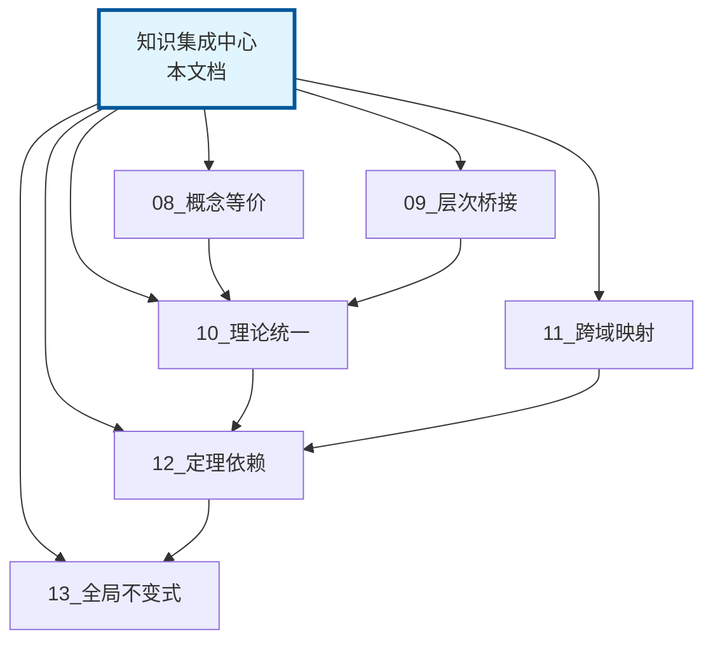

# 知识集成中心：深层关联总览

> **层级定位**: 06_Thinking_Representation > 05_Concept_Mappings
> **用途**: 所有深层关联的汇总索引和导航入口
> **更新**: 2026-03-24

---

## 知识关联全景图

```
┌─────────────────────────────────────────────────────────────────────────────┐
│                    C语言知识深层关联网络总览                                │
├─────────────────────────────────────────────────────────────────────────────┤
│                                                                              │
│   ┌─────────────────────────────────────────────────────────────────────┐  │
│   │                        关联类型图谱                                  │  │
│   ├─────────────────────────────────────────────────────────────────────┤  │
│   │                                                                      │  │
│   │   概念等价性 ──────┐                                                │  │
│   │   (Equivalent)     │                                                │  │
│   │                    │                                                │  │
│   │   层次桥接链 ──────┼───▶ 深层关联层 ◀───┬─── 跨域映射              │  │
│   │   (Bridging)       │       (Core)       │      (Cross-Domain)      │  │
│   │                    │                    │                          │  │
│   │   理论统一 ────────┘                    └─── 全局不变式            │  │
│   │   (Unification)                            (Invariants)            │  │
│   │                                                                      │  │
│   └─────────────────────────────────────────────────────────────────────┘  │
│                                                                              │
│   ┌─────────────────────────────────────────────────────────────────────┐  │
│   │                        导航入口                                      │  │
│   ├─────────────────────────────────────────────────────────────────────┤  │
│   │                                                                      │  │
│   │   [问题诊断] ────▶ 从何开始理解概念?                                │  │
│   │   [学习路径] ────▶ 如何系统化学习?                                  │  │
│   │   [概念查找] ────▶ 某个概念的完整关联?                              │  │
│   │   [定理证明] ────▶ 为什么这个结论成立?                              │  │
│   │                                                                      │  │
│   └─────────────────────────────────────────────────────────────────────┘  │
│                                                                              │
└─────────────────────────────────────────────────────────────────────────────┘
```

---

## 一、关联文档索引

### 1.1 核心关联文档

| 文档 | 核心主题 | 关键洞察 | 适用场景 |
|:-----|:---------|:---------|:---------|
| **08_Concept_Equivalence** | 概念等价性 | 指针/数组/偏移/汇编寻址等价 | 理解概念本质 |
| **09_Level_Bridging** | 层次桥接 | 基础→核心→高级的推理链 | 系统化学习 |
| **10_Theory_Unification** | 理论统一 | 类型/内存/并发三模型统一 | 建立理论框架 |
| **11_Cross_Domain** | 跨域映射 | 编译时↔运行时、静态↔动态 | 掌握边界控制 |
| **12_Theorem_Dependency** | 定理依赖 | 核心定理的逻辑依赖网络 | 形式化理解 |
| **13_Global_Invariants** | 全局不变式 | 跨模块通用约束 | 正确性保证 |
| **14_Knowledge_Integration** | 集成中心 | 所有关联的汇总 | 快速导航 |

### 1.2 关联类型速查

```
需要理解概念等价? ──▶ 08_Concept_Equivalence
    │
    ├── 指针 vs 数组 ──▶ 数组-指针等价链
    ├── 回调演进 ─────▶ 函数抽象等价谱系
    └── 类型表示 ─────▶ 类型-内存对应法则

需要理解层次关系? ──▶ 09_Level_Bridging
    │
    ├── 类型→内存→性能 ──▶ 推理链条 1.1
    ├── 指针→动态→并发 ──▶ 推理链条 2.1
    └── 控制流→状态机 ──▶ 推理链条 3.1

需要理解理论统一? ──▶ 10_Theory_Unification
    │
    ├── 类型-内存关系 ──▶ 类型即内存视图
    ├── 内存-并发关系 ──▶ 内存状态空间
    └── 三模型统一 ────▶ 统一定理网络

需要理解跨域控制? ──▶ 11_Cross_Domain
    │
    ├── 编译时计算 ────▶ 常量表达式链
    ├── 静态→动态 ────▶ 类型擦除技术
    └── 抽象→具体 ────▶ 逐层转换

需要理解形式化基础? ──▶ 12_Theorem_Dependency
    │
    ├── 基础公理 ─────▶ 内存/类型/执行公理
    ├── 核心定理 ─────▶ 对齐/类型安全/并发安全
    └── 定理应用 ─────▶ 数组索引安全检查

需要理解约束保证? ──▶ 13_Global_Invariants
    │
    ├── 内存不变式 ───▶ 对齐/数组/结构体
    ├── 生命周期 ─────▶ 所有权/借用/RAII
    └── 并发不变式 ───▶ 数据竞争自由
```

---

## 二、快速导航

### 2.1 按问题类型导航

**Q1: 为什么数组索引和指针算术等价?**

```
入口: 08_Concept_Equivalence ──▶ 1.1 语义等价定理
      │
      ├── 数学证明: C标准 6.5.2.1
      ├── 编译映射: 源代码→汇编
      └── 性能影响: 访问模式分析
```

**Q2: 如何理解从基础类型到并发安全的演进?**

```
入口: 09_Level_Bridging ──▶ 2.2 渐进式学习路径
      │
      ├── L1: 指针即地址
      ├── L2: 堆内存管理
      └── L3: 原子指针操作
```

**Q3: 类型系统、内存模型、并发模型如何统一?**

```
入口: 10_Theory_Unification ──▶ 一、类型↔内存↔并发统一
      │
      ├── 类型即内存解释
      ├── 内存即状态空间
      └── 三模型统一定理
```

**Q4: 编译时和运行时的边界在哪里?**

```
入口: 11_Cross_Domain ──▶ 1.1 时间维度映射
      │
      ├── 纯编译时: 宏/constexpr
      ├── 混合: const/VLA
      └── 运行时: malloc
```

**Q5: 哪些定理支撑了数组访问的安全性?**

```
入口: 12_Theorem_Dependency ──▶ 4.1 数组索引安全检查
      │
      ├── T1: 类型封闭
      ├── T3: 大小确定
      └── TS3: 数组边界
```

**Q6: C语言有哪些必须遵守的全局不变式?**

```
入口: 13_Global_Invariants ──▶ 一、内存布局不变式
      │
      ├── A1: 对齐不变式
      ├── A2: 数组布局不变式
      └── L1: 所有权不变式
```

### 2.2 按学习阶段导航

```
初学者 ──▶ 09_Level_Bridging
    │
    ├── 理解层次依赖
    └── 掌握学习路径

进阶者 ──▶ 08_Concept_Equivalence
    │
    ├── 理解概念本质
    └── 掌握等价变换

高级 ──▶ 10_Theory_Unification + 11_Cross_Domain
    │
    ├── 建立统一视角
    └── 掌握边界控制

专家 ──▶ 12_Theorem_Dependency + 13_Global_Invariants
    │
    ├── 形式化理解
    └── 正确性保证
```

---

## 三、核心关联摘要

### 3.1 最重要的10个关联

| 排名 | 关联 | 涉及文档 | 核心洞察 |
|:----:|:-----|:---------|:---------|
| 1 | 指针 = 数组 = 偏移 | 08 | 三种语法本质是相同的 |
| 2 | 类型 → 内存布局 → 性能 | 09 | 类型选择影响缓存效率 |
| 3 | 类型系统 ≡ 内存解释 | 10 | 类型是对位模式的解释规则 |
| 4 | 内存 ≡ 状态空间 | 10 | 程序执行是状态转换 |
| 5 | 同步 = 约束执行交错 | 10 | 同步限制了可能的执行序列 |
| 6 | 编译时 ↔ 运行时 | 11 | 程序员可以控制转换时机 |
| 7 | 静态 ↔ 动态绑定 | 11 | 函数指针实现动态分发 |
| 8 | 对齐约束 → 原子保证 | 12 | 对齐是原子操作的基础 |
| 9 | 类型安全 → 内存安全 | 12 | 类型正确保证访问合法 |
| 10 | 不变式是正确性锚点 | 13 | 违反不变式意味着错误 |

### 3.2 关键定理链

```
程序正确性 = 类型安全 + 内存安全 + 并发安全

类型安全链:
T1(类型封闭) → T2(类型一致) → TS1(类型完整性) → 类型安全

内存安全链:
M1(内存可寻址) → M3(生命周期) → MS1(生命周期访问) → 内存安全

并发安全链:
E2(并发交错) → E3(原子性) → CS1(数据竞争自由) → 并发安全
```

---

## 四、实践应用指南

### 4.1 代码审查检查表

基于深层关联的审查要点:

```
□ 概念使用是否恰当?
   ├── 是否混淆了等价的概念?
   └── 是否选择了最适合当前场景的表达?

□ 层次桥接是否合理?
   ├── 是否理解了前置知识?
   └── 是否跨越了不该跨越的层次?

□ 理论约束是否遵守?
   ├── 类型使用是否符合类型系统规则?
   ├── 内存访问是否符合内存模型?
   └── 并发访问是否符合并发模型?

□ 跨域边界是否清晰?
   ├── 编译时/运行时划分是否合理?
   └── 静态/动态选择是否恰当?

□ 定理依赖是否满足?
   ├── 是否依赖了未满足的定理前提?
   └── 是否违反了已知的不变式?
```

### 4.2 问题诊断框架

```
问题描述 ──▶ 归类 ──▶ 定位关联文档 ──▶ 分析根因
    │
    ├── 概念理解问题 ──▶ 08_Concept_Equivalence
    │
    ├── 知识断层问题 ──▶ 09_Level_Bridging
    │
    ├── 理论统一问题 ──▶ 10_Theory_Unification
    │
    ├── 边界控制问题 ──▶ 11_Cross_Domain
    │
    ├── 形式化问题 ────▶ 12_Theorem_Dependency
    │
    └── 不变式违反 ────▶ 13_Global_Invariants
```

### 4.3 学习路径推荐

**快速掌握深层关联 (20小时)**:

```
Week 1: 概念等价性 (5h)
  - 数组-指针等价链
  - 函数抽象谱系

Week 2: 层次桥接 (5h)
  - 类型→内存→性能链
  - 渐进式学习路径

Week 3: 理论统一 (5h)
  - 三模型统一视角
  - 统一定理网络

Week 4: 应用实践 (5h)
  - 跨域映射
  - 定理依赖
  - 全局不变式
```

---

## 五、关联网络可视化

### 5.1 文档间关联



### 5.2 概念关联密度

```
高密度关联区域 (核心概念):
├── 指针-数组-内存地址
├── 类型-内存布局-性能
├── 同步-原子性-内存序
└── 编译时-运行时-优化

中密度关联区域:
├── 函数指针-回调-闭包
├── 结构体-对象-抽象
└── 宏-泛型-元编程

低密度关联区域:
├── 特定库函数
├── 平台相关特性
└── 编译器扩展
```

---

## 六、持续更新计划

### 6.1 待补充关联

- [ ] 形式语义 ↔ 实际代码映射
- [ ] 硬件架构 ↔ 软件优化关联
- [ ] 安全漏洞 ↔ 不变式违反对应
- [ ] 设计模式 ↔ 底层机制实现

### 6.2 关联验证

- [ ] 自动化检查概念链接完整性
- [ ] 验证等价性声明的正确性
- [ ] 补充形式化证明

---

## 七、反馈与贡献

如发现关联错误或缺失，请:

1. 检查相关原文档
2. 验证关联的正确性
3. 提交改进建议

---

**本文档作为深层关联网络的入口和导航中心，建议配合其他关联文档一起阅读。**

**最后更新**: 2026-03-24
**维护者**: C_Lang Knowledge Base Team
**质量等级**: L5 (理论深化)
