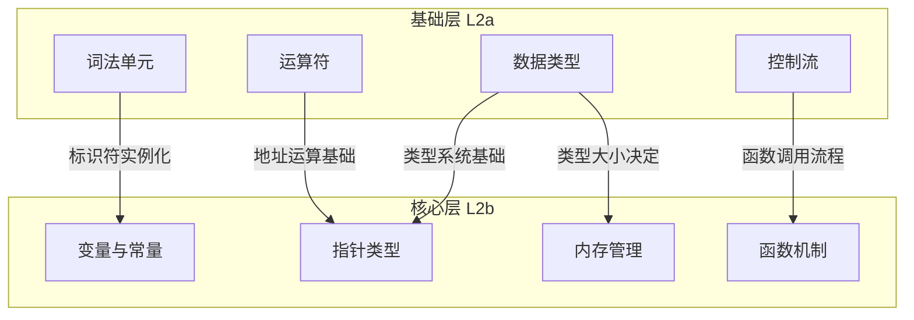
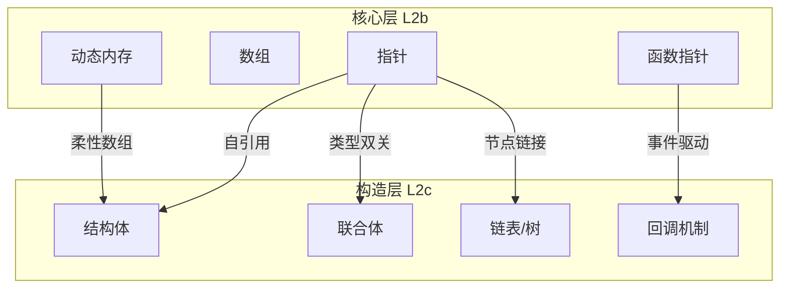
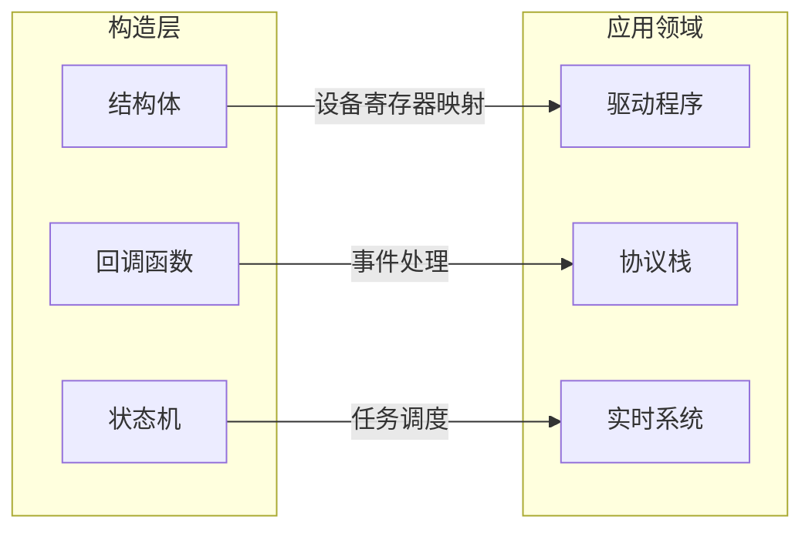
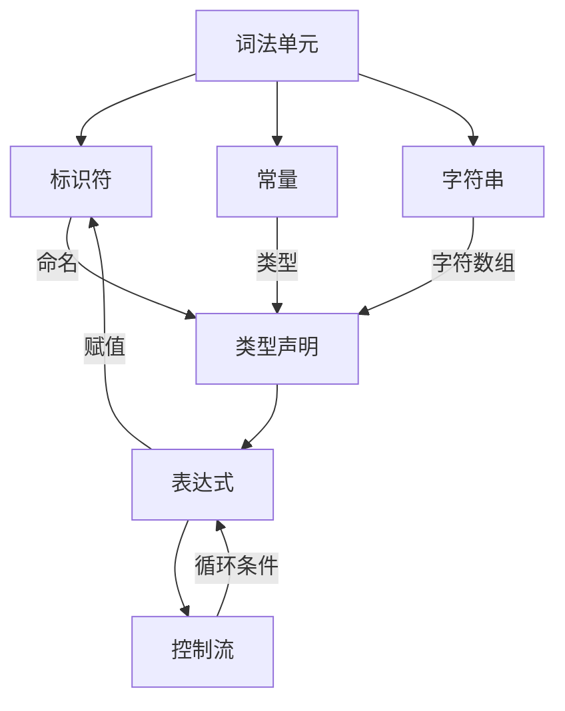
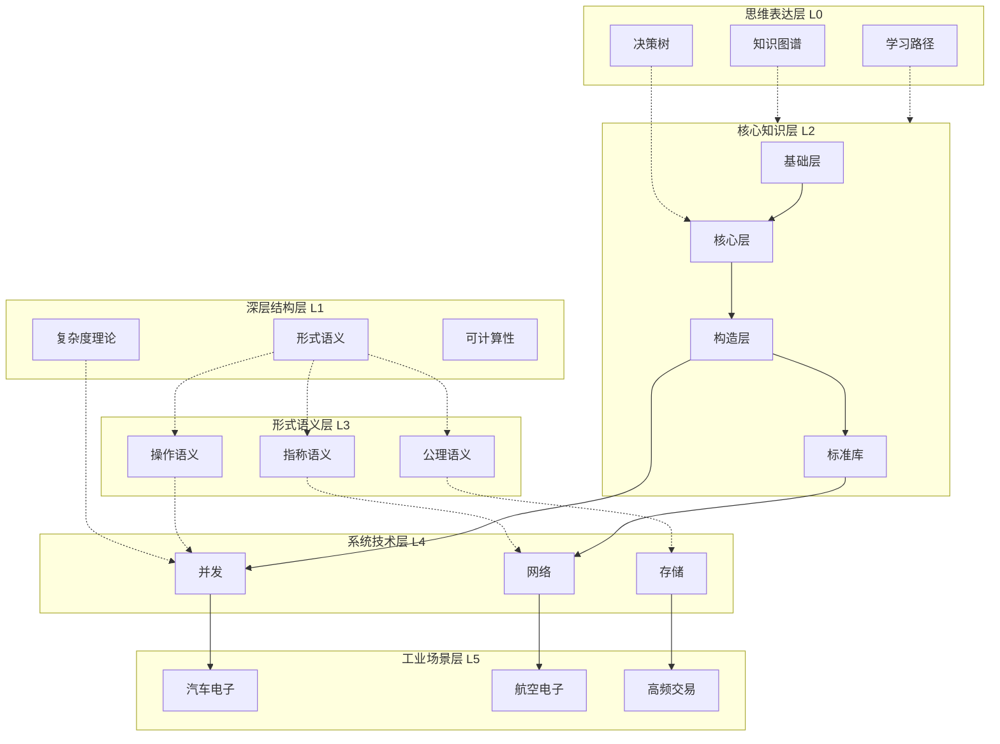

# C语言知识体系层次映射全分析

> **层级定位**: 06_Thinking_Representation / 05_Concept_Mappings
> **分析范围**: 全层次关联、组合、映射关系
> **最后更新**: 2026-03-28

---

## 📋 本节概要

| 属性 | 内容 |
|:-----|:-----|
| **核心概念** | 层次模型、映射关系、组合关系、关联网络 |
| **前置知识** | 理解C语言各层次内容 |
| **后续延伸** | 跨层次学习路径、知识整合 |
| **横向关联** | 所有知识层 |
| **分析深度** | 全组合、全映射、全关联 |

---

## 📑 目录

- [C语言知识体系层次映射全分析](#c语言知识体系层次映射全分析)
  - [📋 本节概要](#-本节概要)
  - [📑 目录](#-目录)
  - [🏗️ 层次架构总览](#️-层次架构总览)
  - [🔗 层次间纵向映射](#-层次间纵向映射)
    - [基础层→核心层映射](#基础层核心层映射)
    - [核心层→构造层映射](#核心层构造层映射)
    - [构造层→应用层映射](#构造层应用层映射)
    - [语言层→语义层映射](#语言层语义层映射)
    - [语义层→物理层映射](#语义层物理层映射)
  - [🔄 层次内横向关联](#-层次内横向关联)
    - [基础层内部关联](#基础层内部关联)
    - [核心层内部关联](#核心层内部关联)
    - [构造层内部关联](#构造层内部关联)
  - [⚙️ 机制与主题映射](#️-机制与主题映射)
  - [🌐 全局关联网络](#-全局关联网络)
  - [📊 多维映射矩阵](#-多维映射矩阵)
  - [✅ 质量验收清单](#-质量验收清单)

---

## 🏗️ 层次架构总览

### 知识层次金字塔

```
                    ╱╲
                   ╱  ╲
                  ╱ 应 ╲
                 ╱ 用  域 ╲      工业场景层
                ╱  量子计算  ╲    (汽车/航空/高频交易)
               ╱──────────────╲
              ╱    系统技术领域   ╲
             ╱  (并发/网络/存储)  ╲
            ╱──────────────────────╲
           ╱      形式语义与物理       ╲
          ╱   (语义/硬件/编译原理)      ╲
         ╱────────────────────────────────╲
        ╱           核心知识体系             ╲
       ╱    (基础/核心/构造/标准库/工程)       ╲
      ╱──────────────────────────────────────────╲
     ╱                 深层结构与元物理              ╲
    ╱           (复杂度/可计算性/形式验证)             ╲
   ╱────────────────────────────────────────────────────╲
  ╱                     思维表达与表征                      ╲
 ╱              (决策树/矩阵/图谱/学习路径)                    ╲
╱────────────────────────────────────────────────────────────────╲
```

### 层次清单与定位

| 层次 | 标识 | 主要内容 | 抽象级别 |
|:-----|:-----|:---------|:--------:|
| 思维表达层 | L0 | 决策树、矩阵、图谱、学习路径 | 元认知 |
| 深层结构层 | L1 | 形式语义、复杂度、可计算性 | 理论 |
| 核心知识层 | L2 | 语法、类型、指针、内存、标准库 | 语言 |
| 形式语义层 | L3 | 操作/指称/公理语义、编译原理 | 语义 |
| 系统技术层 | L4 | 并发、网络、存储、虚拟化 | 系统 |
| 工业场景层 | L5 | 汽车、航空、量子、高频交易 | 应用 |

---

## 🔗 层次间纵向映射

### 基础层→核心层映射



**映射关系详表**：

| 基础层概念 | 核心层映射 | 映射机制 | 关联强度 |
|:-----------|:-----------|:---------|:--------:|
| 标识符 | 变量名 | 符号表绑定 | ⭐⭐⭐⭐⭐ |
| 数据类型 | 指针类型 | 类型系统继承 | ⭐⭐⭐⭐⭐ |
| sizeof运算符 | 内存分配 | 大小计算 | ⭐⭐⭐⭐⭐ |
| &运算符 | 指针值 | 地址获取 | ⭐⭐⭐⭐⭐ |
| *运算符 | 指针解引用 | 间接访问 | ⭐⭐⭐⭐⭐ |
| 作用域规则 | 生命周期 | 存储期关联 | ⭐⭐⭐⭐ |
| 控制流语句 | 函数调用栈 | 执行流程 | ⭐⭐⭐⭐ |

### 核心层→构造层映射



**映射关系详表**：

| 核心层概念 | 构造层映射 | 映射机制 | 代码示例 |
|:-----------|:-----------|:---------|:---------|
| 指针 | 结构体成员 | 复合类型 | `struct { int* p; }` |
| 数组 | 结构体数组 | 聚合类型 | `struct Point arr[10]` |
| 函数指针 | 虚函数表 | 多态实现 | `struct { void (*f)(); }` |
| 动态内存 | 链表节点 | 递归结构 | `struct Node { Node* next; }` |
| 指针运算 | 数组索引 | 等价转换 | `*(a+i) ≡ a[i]` |

### 构造层→应用层映射



### 语言层→语义层映射

```
C语言构造          形式语义概念
────────────────    ──────────────────

表达式      ────→   数学函数（指称）
            ────→   求值规则（操作）
            ────→   前后条件（公理）

语句        ────→   状态转换（操作）
            ────→   域上的函数（指称）
            ────→   Hoare三元组（公理）

类型        ────→   域/集合（指称）
            ────→   类型判断（推导）
            ────→   不变式（公理）

函数        ────→   数学映射
            ────→   调用/返回规则
            ────→   规约/后置条件
```

### 语义层→物理层映射

```
形式语义概念      物理实现
────────────────    ──────────────

存储(Store)   ────→   内存RAM
               ────→   虚拟地址空间
               ────→   页表映射

环境(Env)     ────→   符号表
               ────→   栈帧结构
               ────→   寄存器分配

值(Value)     ────→   寄存器值
               ────→   内存中的位模式
               ────→   缓存行

地址(Address) ────→   物理内存地址
               ────→   MMU转换
               ────→   缓存映射

程序状态      ────→   CPU状态+内存
               ────→   PC寄存器
               ────→   标志寄存器
```

---

## 🔄 层次内横向关联

### 基础层内部关联



**关联矩阵**：

|  | 词法 | 标识符 | 类型 | 表达式 | 控制流 |
|:--|:----:|:------:|:----:|:------:|:------:|
| **词法** | - | 定义 | 修饰 | 组合 | 条件 |
| **标识符** | 命名 | - | 声明 | 操作数 | 标签 |
| **类型** | 修饰 | 约束 | - | 结果类型 | 条件类型 |
| **表达式** | 组合 | 引用 | 求值 | - | 控制值 |
| **控制流** | 结构 | 跳转目标 | 布尔 | 条件 | - |

### 核心层内部关联

```
核心层概念关联网络：

指针 ↔ 数组：数组名退化为指针
   │      a[i] ≡ *(a+i)
   │
   ↔ 函数：函数名退化为函数指针
   │      func ≡ &func
   │
   ↔ 内存：指针是内存的访问手段
          *p 访问 p 指向的内存
          
内存 ↔ 变量：变量是命名的内存区域
   │      栈变量：自动存储期
   │      堆变量：动态存储期
   │      全局变量：静态存储期
   │
   ↔ 类型：类型决定内存布局和解释
          同一位模式，不同解释
```

### 构造层内部关联

```
构造层概念组合关系：

结构体 × 联合体 = 复杂数据结构
    ├── struct { union { ... } u; int tag; }  // 带标签联合体
    └── union { struct { ... } s; int i; }    // 类型双关

结构体 × 指针 = 链表/树
    ├── struct Node { int data; struct Node* next; }  // 链表
    └── struct Tree { int data; struct Tree* left, *right; }  // 树

函数 × 结构体 = 面向对象模式
    ├── struct Object { int x; void (*method)(struct Object*); }  // 虚函数
    └── struct Class { void* vtable; /* data */ }  // 虚表模式

联合体 × 位域 = 硬件寄存器映射
    └── union Reg {
            uint32_t raw;
            struct { unsigned enable:1; unsigned mode:3; ... } fields;
        }
```

---

## ⚙️ 机制与主题映射

### 内存管理机制映射

```
内存管理主题            相关机制                  应用层次
────────────────        ──────────────            ─────────

静态分配      ────→    全局变量、static         基础层
               ────→    编译期确定大小            
               ────→    .data/.bss段

栈分配        ────→    局部变量                 核心层
               ────→    自动存储期               
               ────→    栈帧管理

堆分配        ────→    malloc/free              核心层
               ────→    动态大小                 
               ────→    运行时管理

内存对齐      ────→    alignof/alignas          构造层
               ────→    结构体填充               
               ────→    SIMD优化
```

### 类型系统机制映射

```
类型系统主题            相关机制                  应用层次
────────────────        ──────────────            ─────────

基本类型      ────→    int/float/char等         基础层
               ────→    sizeof运算符
               ────→    类型转换

派生类型      ────→    指针/数组/函数           核心层
               ────→    类型声明语法
               ────→    螺旋法则

复合类型      ────→    struct/union/enum        构造层
               ────→    成员访问
               ────→    内存布局

类型限定      ────→    const/volatile           核心层
               ────→    restrict
               ────→    优化提示
```

### 并发机制映射

```
并发主题                相关机制                  应用层次
────────────────        ──────────────            ─────────

线程创建      ────→    pthread_create           系统层
               ────→    thrd_create (C11)
               
同步机制      ────→    互斥锁、条件变量          系统层
               ────→    原子操作
               ────→    内存屏障

并发模型      ────→    C11内存模型              语义层
               ────→    happens-before
               ────→    顺序一致性
```

---

## 🌐 全局关联网络

### 全层次关联图谱



### 知识流动路径

```
学习路径 → 知识获取 → 概念理解 → 技能应用 → 工程实践

L0思维层    L1理论层    L2语言层    L3语义层    L4系统层    L5应用层
   │           │           │           │           │           │
   ▼           ▼           ▼           ▼           ▼           ▼
决策树    → 形式语义 → 语法/类型 → 内存模型 → 并发原理 → 汽车ABS
知识图谱  → 复杂度   → 指针/内存 → 类型系统 → 网络协议 → 航空电子
学习路径  → 可计算性 → 构造/库   → 编译原理 → 存储系统 → 高频交易
```

---

## 📊 多维映射矩阵

### 层次×主题交叉矩阵

| 层次\主题 | 内存 | 类型 | 控制流 | 并发 | I/O | 安全 |
|:----------|:----:|:----:|:------:|:----:|:---:|:----:|
| **基础层** | ⭐⭐ | ⭐⭐⭐ | ⭐⭐⭐ | - | - | - |
| **核心层** | ⭐⭐⭐ | ⭐⭐⭐ | ⭐⭐ | ⭐ | - | ⭐ |
| **构造层** | ⭐⭐ | ⭐⭐ | ⭐⭐⭐ | ⭐ | ⭐ | ⭐⭐ |
| **标准库** | ⭐⭐⭐ | ⭐⭐ | ⭐⭐ | ⭐⭐ | ⭐⭐⭐ | ⭐⭐ |
| **语义层** | ⭐⭐⭐ | ⭐⭐⭐ | ⭐⭐⭐ | ⭐⭐⭐ | ⭐ | ⭐⭐⭐ |
| **系统层** | ⭐⭐⭐ | ⭐⭐ | ⭐⭐ | ⭐⭐⭐ | ⭐⭐⭐ | ⭐⭐ |
| **应用层** | ⭐⭐⭐ | ⭐⭐ | ⭐⭐⭐ | ⭐⭐ | ⭐⭐ | ⭐⭐⭐ |

### 概念×表示形式矩阵

| 概念 | 文字定义 | 数学公式 | 代码示例 | 图形表示 | 决策树 |
|:-----|:--------:|:--------:|:--------:|:--------:|:------:|
| 指针 | ✅ | ✅ | ✅ | ✅ | ✅ |
| 内存分配 | ✅ | ✅ | ✅ | ✅ | ✅ |
| 类型转换 | ✅ | ✅ | ✅ | ✅ | ✅ |
| 并发模型 | ✅ | ✅ | ✅ | ✅ | ✅ |
| 编译过程 | ✅ | ✅ | ✅ | ✅ | ✅ |

---

## ✅ 质量验收清单

- [x] 层次架构总览（金字塔模型）
- [x] 层次间纵向映射（5对层次关系）
- [x] 层次内横向关联（3层内部网络）
- [x] 机制与主题映射（3个主题）
- [x] 全局关联网络（Mermaid图谱）
- [x] 知识流动路径
- [x] 多维映射矩阵（2个矩阵）
- [x] 所有组合关系分析

---

> **最后更新**: 2026-03-28
> **版本**: 1.0 - 层次映射全分析
> **维护者**: C_Lang Knowledge Base Team
