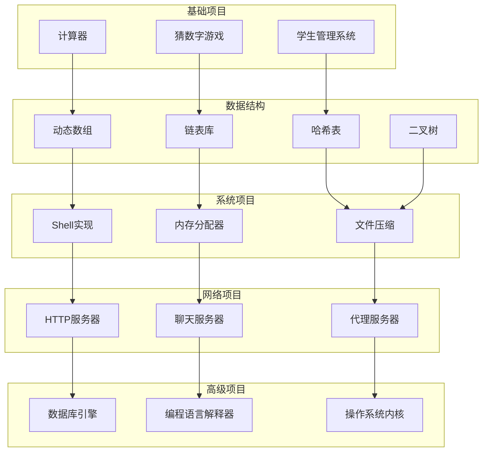

# C语言完整学习路径：从入门到专家级

> **文档定位**: 系统化C语言学习路径规划与资源配置指南
> **表征方式**: 路径图、里程碑、能力矩阵、资源索引
> **目标读者**: 零基础学习者、转语言开发者、进阶提升者

---

## 一、学习路径总览

### 1.1 六阶段学习路线图

```mermaid
flowchart LR
    subgraph L1["阶段1: 基础奠基 (2-4周)"]
        A1[语法要素]
        A2[数据类型]
        A3[控制流]
        A4[基础I/O]
    end

    subgraph L2["阶段2: 核心突破 (4-6周)"]
        B1[指针深度]
        B2[内存管理]
        B3[字符串操作]
        B4[函数进阶]
    end

    subgraph L3["阶段3: 构造设计 (3-4周)"]
        C1[结构体与联合]
        C2[预处理器]
        C3[模块化编程]
        C4[抽象数据类型]
    end

    subgraph L4["阶段4: 进阶实践 (4-6周)"]
        D1[标准库精通]
        D2[调试技术]
        D3[代码质量]
        D4[算法实现]
    end

    subgraph L5["阶段5: 现代C与并发 (3-4周)"]
        E1[C11/C17特性]
        E2[并发编程]
        E3[性能优化]
        E4[跨平台开发]
    end

    subgraph L6["阶段6: 专家领域 (持续精进)"]
        F1[系统编程]
        F2[领域专精]
        F3[开源贡献]
        F4[技术写作]
    end

    L1 --> L2 --> L3 --> L4 --> L5 --> L6
```



### 1.2 学习投入时间规划

| 阶段 | 学习周期 | 每日建议时长 | 总投入时间 | 关键产出 |
|:-----|:--------:|:------------:|:----------:|:---------|
| **阶段1** | 2-4周 | 1-2小时 | 20-40小时 | 能编写简单程序 |
| **阶段2** | 4-6周 | 2-3小时 | 60-90小时 | 掌握指针与内存 |
| **阶段3** | 3-4周 | 2-3小时 | 45-60小时 | 模块化设计能力 |
| **阶段4** | 4-6周 | 2-4小时 | 80-120小时 | 工程级代码质量 |
| **阶段5** | 3-4周 | 3-4小时 | 60-80小时 | 现代C开发能力 |
| **阶段6** | 持续学习 | 灵活安排 | 长期积累 | 专家级水平 |

**总学习周期**: 零基础约6-9个月，有编程基础约4-6个月

---


---

## 📑 目录

- [C语言完整学习路径：从入门到专家级](#c语言完整学习路径从入门到专家级)
  - [一、学习路径总览](#一学习路径总览)
    - [1.1 六阶段学习路线图](#11-六阶段学习路线图)
    - [1.2 学习投入时间规划](#12-学习投入时间规划)
  - [📑 目录](#-目录)
  - [二、阶段能力矩阵](#二阶段能力矩阵)
    - [2.1 六维度能力达成检查表](#21-六维度能力达成检查表)
    - [2.2 详细能力描述](#22-详细能力描述)
  - [三、各阶段详细学习内容](#三各阶段详细学习内容)
    - [3.1 阶段1：基础奠基（2-4周）](#31-阶段1基础奠基2-4周)
      - [学习目标](#学习目标)
      - [核心知识点](#核心知识点)
      - [推荐资源](#推荐资源)
      - [阶段1实战项目](#阶段1实战项目)
      - [阶段1自测检查点](#阶段1自测检查点)
    - [3.2 阶段2：核心突破（4-6周）](#32-阶段2核心突破4-6周)
      - [学习目标](#学习目标-1)
      - [核心知识点](#核心知识点-1)
      - [推荐资源](#推荐资源-1)
      - [阶段2实战项目](#阶段2实战项目)
      - [阶段2自测检查点](#阶段2自测检查点)
    - [3.3 阶段3：构造设计（3-4周）](#33-阶段3构造设计3-4周)
      - [学习目标](#学习目标-2)
      - [核心知识点](#核心知识点-2)
      - [推荐资源](#推荐资源-2)
      - [阶段3实战项目](#阶段3实战项目)
      - [阶段3自测检查点](#阶段3自测检查点)
    - [3.4 阶段4：进阶实践（4-6周）](#34-阶段4进阶实践4-6周)
      - [学习目标](#学习目标-3)
      - [核心知识点](#核心知识点-3)
      - [推荐资源](#推荐资源-3)
      - [阶段4实战项目](#阶段4实战项目)
      - [阶段4自测检查点](#阶段4自测检查点)
    - [3.5 阶段5：现代C与并发（3-4周）](#35-阶段5现代c与并发3-4周)
      - [学习目标](#学习目标-4)
      - [核心知识点](#核心知识点-4)
      - [推荐资源](#推荐资源-4)
      - [阶段5实战项目](#阶段5实战项目)
      - [阶段5自测检查点](#阶段5自测检查点)
    - [3.6 阶段6：专家领域（持续精进）](#36-阶段6专家领域持续精进)
      - [学习目标](#学习目标-5)
      - [核心方向](#核心方向)
      - [推荐资源](#推荐资源-5)
      - [阶段6自测检查点](#阶段6自测检查点)
  - [四、不同背景学习建议](#四不同背景学习建议)
    - [4.1 路径对比矩阵](#41-路径对比矩阵)
    - [4.2 分背景详细建议](#42-分背景详细建议)
      - [零基础学习者](#零基础学习者)
      - [Python转C](#python转c)
      - [Java转C](#java转c)
      - [C++转C](#c转c)
      - [嵌入式开发者转标准C](#嵌入式开发者转标准c)
  - [五、推荐学习资源汇总](#五推荐学习资源汇总)
    - [5.1 必读书籍](#51-必读书籍)
    - [5.2 在线资源](#52-在线资源)
    - [5.3 视频课程](#53-视频课程)
  - [六、常见学习误区与避免方法](#六常见学习误区与避免方法)
    - [6.1 十大学习误区](#61-十大学习误区)
    - [6.2 学习心态建议](#62-学习心态建议)
  - [七、学习进度追踪模板](#七学习进度追踪模板)
    - [7.1 个人学习日志](#71-个人学习日志)
    - [7.2 阶段里程碑检查表](#72-阶段里程碑检查表)
      - [阶段1完成标准](#阶段1完成标准)
      - [阶段2完成标准](#阶段2完成标准)
      - [阶段3完成标准](#阶段3完成标准)
      - [阶段4完成标准](#阶段4完成标准)
      - [阶段5完成标准](#阶段5完成标准)
      - [阶段6持续目标](#阶段6持续目标)
  - [八、社区资源与求助渠道](#八社区资源与求助渠道)
    - [8.1 中文社区](#81-中文社区)
    - [8.2 国际社区](#82-国际社区)
    - [8.3 即时通讯](#83-即时通讯)
    - [8.4 求助指南](#84-求助指南)
  - [九、实战项目进阶路线](#九实战项目进阶路线)
    - [9.1 项目路线图](#91-项目路线图)
    - [9.2 项目推荐清单](#92-项目推荐清单)
      - [入门级（阶段1-2）](#入门级阶段1-2)
      - [进阶级（阶段3-4）](#进阶级阶段3-4)
      - [专家级（阶段5-6）](#专家级阶段5-6)
  - [十、总结与建议](#十总结与建议)
    - [10.1 学习路线总结](#101-学习路线总结)
    - [10.2 核心建议](#102-核心建议)
    - [10.3 下一步行动](#103-下一步行动)
  - [深入理解](#深入理解)
    - [核心原理](#核心原理)
    - [实践应用](#实践应用)
    - [最佳实践](#最佳实践)


---

## 二、阶段能力矩阵

### 2.1 六维度能力达成检查表

| 能力项 | 阶段1 | 阶段2 | 阶段3 | 阶段4 | 阶段5 | 阶段6 |
|:-------|:-----:|:-----:|:-----:|:-----:|:-----:|:-----:|
| **读写C代码** | ✅ | ⭐ | ⭐⭐ | ⭐⭐⭐ | ⭐⭐⭐ | ⭐⭐⭐⭐ |
| **调试能力** | ⚪ | ⚪ | ✅ | ⭐⭐ | ⭐⭐⭐ | ⭐⭐⭐⭐ |
| **内存安全** | ⚪ | ✅ | ⭐ | ⭐⭐ | ⭐⭐⭐ | ⭐⭐⭐⭐ |
| **性能意识** | ⚪ | ⚪ | ⚪ | ✅ | ⭐⭐ | ⭐⭐⭐⭐ |
| **并发编程** | ⚪ | ⚪ | ⚪ | ⚪ | ✅ | ⭐⭐⭐ |
| **系统设计** | ⚪ | ⚪ | ⚪ | ⚪ | ⚪ | ✅ |

### 2.2 详细能力描述

| 等级 | 描述 |
|:-----|:-----|
| ⚪ | 未涉及该能力领域 |
| ✅ | 初步接触，了解基本概念 |
| ⭐ | 基础掌握，能完成简单任务 |
| ⭐⭐ | 熟练应用，能独立解决问题 |
| ⭐⭐⭐ | 精通掌握，能优化和排错 |
| ⭐⭐⭐⭐ | 专家级，能指导和设计架构 |

---

## 三、各阶段详细学习内容

### 3.1 阶段1：基础奠基（2-4周）

#### 学习目标

- 掌握C语言基本语法结构
- 理解数据类型与运算符
- 熟练使用控制流语句
- 能编写100行以内的程序

#### 核心知识点

| 主题 | 具体内容 | 掌握要求 |
|:-----|:---------|:---------|
| **开发环境** | GCC安装、IDE配置、编译流程 | 熟练配置 |
| **数据类型** | 基本类型、类型转换、sizeof | 深入理解 |
| **运算符** | 算术、关系、逻辑、位运算 | 灵活运用 |
| **控制流** | if/else、switch、for/while | 熟练使用 |
| **数组** | 一维/二维数组、初始化 | 基础掌握 |
| **函数** | 定义调用、参数传递、返回值 | 正确使用 |
| **I/O操作** | printf/scanf、文件基础 | 熟练应用 |

#### 推荐资源

**书籍**:

- 《C Primer Plus》第1-6章（Stephen Prata）- 零基础友好
- 《明解C语言》入门篇（柴田望洋）- 图文并茂

**在线课程**:

- 翁凯C语言程序设计（浙江大学）- B站免费
- Harvard CS50 - Introduction to Computer Science

**练习平台**:

- PTA 基础编程题目集
- HackerRank C Practice
- LeetCode 简单题（数组、字符串基础）

#### 阶段1实战项目

| 项目 | 难度 | 知识点覆盖 | 预计时间 |
|:-----|:----:|:-----------|:--------:|
| 计算器程序 | ⭐ | 运算符、控制流 | 2-4小时 |
| 猜数字游戏 | ⭐ | 随机数、循环、条件 | 2-3小时 |
| 学生成绩统计 | ⭐⭐ | 数组、函数、循环 | 4-6小时 |
| 简单通讯录 | ⭐⭐ | 结构体基础、数组 | 6-8小时 |

#### 阶段1自测检查点

- [ ] 能独立编写100行以内的程序
- [ ] 理解变量作用域和生命周期
- [ ] 能使用基本控制结构解决逻辑问题
- [ ] 掌握基本输入输出操作
- [ ] 理解编译错误并能独立修复

---

### 3.2 阶段2：核心突破（4-6周）

#### 学习目标

- 彻底理解指针概念与操作
- 掌握动态内存管理
- 深入理解字符串处理
- 建立内存安全意识

#### 核心知识点

| 主题 | 具体内容 | 掌握要求 |
|:-----|:---------|:---------|
| **指针基础** | 指针变量、取址、解引用 | 核心重点 |
| **指针运算** | 算术运算、数组指针、函数指针 | 深入理解 |
| **动态内存** | malloc/calloc/realloc/free | 熟练使用 |
| **内存泄漏** | 成因、检测、预防 | 必须掌握 |
| **字符串** | 字符串操作、安全函数 | 熟练应用 |
| **递归** | 递归思想、实现技巧 | 理解运用 |
| **作用域** | 全局/局部、static、extern | 深入理解 |

#### 推荐资源

**书籍**:

- 《C程序设计语言》(K&R) - 第5章指针与数组
- 《C和指针》（Kenneth Reek）- 指针最佳教材
- 《深入理解计算机系统》第3章 - 程序的机器级表示

**在线资源**:

- Pointer Fun with Binky - YouTube经典视频
- C语言内存模型详解 - 各类技术博客
- Godbolt Compiler Explorer - 观察汇编生成

**工具**:

- Valgrind - 内存泄漏检测
- AddressSanitizer - 运行时内存错误检测

#### 阶段2实战项目

| 项目 | 难度 | 知识点覆盖 | 预计时间 |
|:-----|:----:|:-----------|:--------:|
| 动态数组实现 | ⭐⭐ | malloc/realloc、指针 | 4-6小时 |
| 链表实现 | ⭐⭐⭐ | 结构体指针、动态内存 | 8-12小时 |
| 字符串处理库 | ⭐⭐ | 字符串操作、安全编程 | 6-8小时 |
| 简单内存分配器 | ⭐⭐⭐⭐ | 内存管理、对齐 | 12-16小时 |
| 链表排序算法 | ⭐⭐⭐ | 指针操作、算法 | 6-10小时 |

#### 阶段2自测检查点

- [ ] 能解释指针与数组的本质区别
- [ ] 能正确使用malloc/free，无内存泄漏
- [ ] 能排查简单内存错误
- [ ] 理解指针运算的语义
- [ ] 能实现基本数据结构（链表、栈、队列）

---

### 3.3 阶段3：构造设计（3-4周）

#### 学习目标

- 掌握结构体与联合的高级用法
- 理解预处理器与条件编译
- 学会模块化编程思想
- 能设计可复用的代码组件

#### 核心知识点

| 主题 | 具体内容 | 掌握要求 |
|:-----|:---------|:---------|
| **结构体** | 定义、嵌套、位域、柔性数组 | 深入掌握 |
| **联合与枚举** | 联合内存布局、枚举应用 | 理解使用 |
| **预处理器** | 宏定义、条件编译、头文件保护 | 熟练应用 |
| **模块化** | 多文件编程、接口设计 | 工程实践 |
| **抽象数据类型** | ADT设计、信息隐藏 | 设计能力 |
| **Makefile** | 编译规则、依赖管理 | 基础掌握 |
| **库开发** | 静态库/动态库创建与使用 | 了解应用 |

#### 推荐资源

**书籍**:

- 《C Interfaces and Implementations》(David Hanson)
- 《C Primer Plus》第14-16章 - 结构体与高级数据表示
- 《Makefile教程》- 陈皓（在线）

**开源项目参考**:

- Glib - GNOME基础库
- SQLite - 模块化设计典范
- Redis - 数据结构实现

#### 阶段3实战项目

| 项目 | 难度 | 知识点覆盖 | 预计时间 |
|:-----|:----:|:-----------|:--------:|
| 泛型动态数组 | ⭐⭐⭐ | 宏、void*、模块化 | 8-12小时 |
| 哈希表实现 | ⭐⭐⭐ | 结构体、哈希算法 | 10-15小时 |
| 二叉搜索树 | ⭐⭐⭐ | 递归、结构体、ADT | 10-14小时 |
| 简单的JSON解析器 | ⭐⭐⭐⭐ | 递归下降、内存管理 | 15-20小时 |
| 命令行工具库 | ⭐⭐⭐ | 模块化设计、接口 | 8-12小时 |

#### 阶段3自测检查点

- [ ] 能设计清晰的模块化程序结构
- [ ] 能编写可复用的头文件与接口
- [ ] 理解编译链接过程
- [ ] 能使用Make管理项目构建
- [ ] 理解信息隐藏与封装原则

---

### 3.4 阶段4：进阶实践（4-6周）

#### 学习目标

- 精通C标准库
- 掌握专业调试技术
- 写出高质量、可维护的代码
- 理解并实现常用算法

#### 核心知识点

| 主题 | 具体内容 | 掌握要求 |
|:-----|:---------|:---------|
| **标准库** | stdio/stdlib/string等全套 | 全面掌握 |
| **调试技术** | GDB、断点、内存检查 | 专业级 |
| **代码质量** | 编码规范、静态分析 | 工程级 |
| **算法实现** | 排序、搜索、数据结构 | 熟练实现 |
| **错误处理** | 错误码、errno、断言 | 规范使用 |
| **UB防范** | 未定义行为识别与避免 | 深入理解 |
| **测试** | 单元测试、测试框架 | 实践掌握 |

#### 推荐资源

**书籍**:

- 《C标准库》（P.J. Plauger）- 标准库实现分析
- 《C陷阱与缺陷》（Andrew Koenig）- 常见错误防范
- 《代码大全》第2版 - 代码质量与工程实践

**工具**:

- GDB - GNU调试器
- Valgrind - 内存分析套件
- Clang Static Analyzer - 静态分析
- Cppcheck - 静态代码检查

**编码规范**:

- Linux Kernel Coding Style
- MISRA C - 嵌入式安全规范

#### 阶段4实战项目

| 项目 | 难度 | 知识点覆盖 | 预计时间 |
|:-----|:----:|:-----------|:--------:|
| 完整的字符串库 | ⭐⭐⭐ | 安全字符串、UTF-8 | 12-16小时 |
| 迷你shell实现 | ⭐⭐⭐⭐ | 进程、文件、解析 | 20-30小时 |
| HTTP客户端 | ⭐⭐⭐⭐ | 网络编程、协议解析 | 20-25小时 |
| 正则表达式引擎 | ⭐⭐⭐⭐⭐ | 状态机、编译原理 | 30-40小时 |
| 内存池实现 | ⭐⭐⭐⭐ | 内存优化、对齐 | 15-20小时 |

#### 阶段4自测检查点

- [ ] 能使用GDB调试复杂问题
- [ ] 能使用Valgrind检测并修复内存错误
- [ ] 能识别并避免常见UB
- [ ] 能编写规范的C代码
- [ ] 能为代码编写单元测试

---

### 3.5 阶段5：现代C与并发（3-4周）

#### 学习目标

- 掌握C11/C17新特性
- 理解C内存模型
- 学会多线程并发编程
- 具备性能优化能力

#### 核心知识点

| 主题 | 具体内容 | 掌握要求 |
|:-----|:---------|:---------|
| **C11特性** | _Generic、_Static_assert、匿名结构 | 熟练应用 |
| **多线程** | threads.h、pthreads | 熟练开发 |
| **原子操作** | stdatomic.h、内存序 | 深入理解 |
| **并发安全** | 锁、条件变量、无锁编程 | 掌握应用 |
| **性能优化** | 缓存友好、SIMD、内联汇编 | 了解进阶 |
| **跨平台** | 条件编译、移植技巧 | 工程实践 |
| **编译器扩展** | GCC/Clang特性、属性 | 了解应用 |

#### 推荐资源

**书籍**:

- 《Modern C》（Jens Gustedt）- 免费开源，现代C必读书
- 《C并发编程》（Allen Downey）
- 《深入理解C11》（迈克尔）

**在线资源**:

- Modern C - <https://modernc.gforge.inria.fr/>
- cppreference.com - C11/C17参考
- LLVM/Clang文档

#### 阶段5实战项目

| 项目 | 难度 | 知识点覆盖 | 预计时间 |
|:-----|:----:|:-----------|:--------:|
| 线程安全队列 | ⭐⭐⭐⭐ | 并发、锁、条件变量 | 12-16小时 |
| 简单的线程池 | ⭐⭐⭐⭐ | 并发设计、任务调度 | 15-20小时 |
| 高性能日志库 | ⭐⭐⭐⭐⭐ | 无锁、批处理、性能 | 20-30小时 |
| 并行排序算法 | ⭐⭐⭐⭐ | 分治、并发、优化 | 15-20小时 |
| 简单的Web服务器 | ⭐⭐⭐⭐⭐ | 并发、I/O、协议 | 30-40小时 |

#### 阶段5自测检查点

- [ ] 能编写线程安全的代码
- [ ] 能进行基本的性能分析与优化
- [ ] 理解C11内存模型
- [ ] 能正确使用原子操作
- [ ] 理解并发编程中的常见问题

---

### 3.6 阶段6：专家领域（持续精进）

#### 学习目标

- 深入系统编程领域
- 选择专业方向深入
- 参与开源项目贡献
- 具备技术影响力

#### 核心方向

| 方向 | 内容 | 相关技术 |
|:-----|:-----|:---------|
| **系统编程** | 操作系统、驱动开发 | Linux内核、系统调用 |
| **嵌入式** | 裸机编程、RTOS | ARM、FreeRTOS |
| **编译器** | 前端、优化、后端 | LLVM、GCC |
| **数据库** | 存储引擎、查询优化 | SQLite、LevelDB |
| **网络** | 协议栈、高性能网络 | DPDK、内核网络 |
| **安全** | 漏洞分析、安全加固 | 逆向、Fuzzing |

#### 推荐资源

**书籍**:

- 《Expert C Programming》（Peter van der Linden）- C专家级深度
- 《Linux内核设计与实现》
- 《深入理解计算机系统》- 系统编程圣经
- 《Compilers: Principles, Techniques, and Tools》- 龙书

**开源项目**:

- Linux Kernel - 顶级C代码典范
- SQLite - 高质量C项目
- Redis - 数据结构与设计模式
- Git - 版本控制 internals

#### 阶段6自测检查点

- [ ] 能阅读并理解Linux内核源码
- [ ] 能设计系统级架构
- [ ] 能为知名开源项目贡献代码
- [ ] 能撰写技术博客或教程
- [ ] 能指导和帮助他人学习C

---

## 四、不同背景学习建议

### 4.1 路径对比矩阵

| 背景 | 起点 | 重点加强 | 预期时间 | 关键难点 |
|:-----|:-----|:---------|:--------:|:---------|
| **无编程经验** | 阶段1完整 | 编程思维培养 | 6-9个月 | 指针概念理解 |
| **有Python经验** | 阶段2开始 | 类型系统、内存管理 | 4-6个月 | 手动内存管理 |
| **有Java经验** | 阶段2开始 | 指针、UB、底层细节 | 4-6个月 | 底层内存操作 |
| **有C++经验** | 阶段3开始 | 标准库、现代C特性 | 3-4个月 | C++特性减法 |
| **有汇编经验** | 阶段2开始 | 抽象思维、数据结构 | 3-4个月 | 高级抽象层次 |
| **嵌入式转C** | 阶段4开始 | 现代C、标准库 | 2-3个月 | 标准C与嵌入式差异 |

### 4.2 分背景详细建议

#### 零基础学习者

**学习策略**:

- 从阶段1完整开始，不跳过任何内容
- 注重理解而非记忆
- 每学完一个概念立即动手实践
- 建立编程思维比语法更重要

**特别注意**:

- 指针是最大难点，需要多花2-3倍时间
- 不要急于进入阶段3，确保阶段2扎实
- 建议配合计算机基础课程学习

**推荐前置知识**:

- 计算机基础知识
- 二进制与十六进制
- 基本算法思维

#### Python转C

**已有优势**:

- 编程思维已建立
- 熟悉基本控制结构
- 了解函数与模块化

**重点突破**:

| 概念 | Python | C | 学习建议 |
|:-----|:-------|:--|:---------|
| 类型 | 动态类型 | 静态强类型 | 重视类型声明 |
| 内存 | 自动GC | 手动管理 | malloc/free必须配对 |
| 数组 | 动态列表 | 固定大小 | 理解数组与指针 |
| 字符串 | 不可变对象 | char数组 | 注意缓冲区溢出 |
| 错误 | 异常 | 返回值/errno | 检查每个返回值 |

**推荐路径**: 阶段2 → 阶段3 → 阶段1补充 → 阶段4+

#### Java转C

**已有优势**:

- 强类型思维
- 面向对象概念（有助于理解ADT）
- JVM知识有助于理解内存

**重点突破**:

| 概念 | Java | C | 学习建议 |
|:-----|:-----|:--|:---------|
| 对象 | 自动管理 | 手动分配 | 深入理解指针 |
| 数组 | 对象引用 | 连续内存 | 数组退化问题 |
| 方法 | 引用传递 | 值传递 | 指针传参 |
| 字符串 | String对象 | char* | 无自动长度管理 |
| 泛型 | 类型擦除 | 宏/void* | 理解C泛型实现 |

**推荐路径**: 阶段2深度 → 阶段3 → 阶段4 → 其他

#### C++转C

**已有优势**:

- C语法基础已具备
- 内存模型理解
- 标准库概念

**特别注意**:

- **禁用C++特性**: 禁用class、模板、异常、STL
- **风格转换**: 从面向对象到面向过程
- **资源管理**: RAII → 手动管理
- **字符串**: string → char[]/char*

**重点学习内容**:

- C标准库完整功能
- C11/C17现代特性
- 函数式编程技巧（函数指针）
- 错误处理模式

**推荐路径**: 阶段3 → 阶段5 → 阶段4 → 阶段6

#### 嵌入式开发者转标准C

**已有优势**:

- 扎实的硬件知识
- 内存受限编程经验
- 位操作熟练

**需要补充**:

| 方面 | 嵌入式C | 标准C | 学习重点 |
|:-----|:--------|:------|:---------|
| 标准 | 编译器相关 | ISO C标准 | 可移植性 |
| 库 | 裁剪版 | 完整标准库 | stdlib/string |
| 特性 | C89为主 | C11/C17 | 现代特性 |
| 调试 | 硬件调试器 | GDB/Valgrind | 软件调试工具 |
| 构建 | IDE/脚本 | Make/CMake | 构建系统 |

**推荐路径**: 阶段4 → 阶段5 → 阶段6 → 阶段3补充

---

## 五、推荐学习资源汇总

### 5.1 必读书籍

| 书名 | 作者 | 难度 | 适用阶段 | 推荐理由 |
|:-----|:-----|:----:|:--------:|:---------|
| 《明解C语言》 | 柴田望洋 | ⭐⭐ | 阶段1 | 零基础最佳入门 |
| 《C Primer Plus》 | Stephen Prata | ⭐⭐ | 阶段1-2 | 全面系统入门书 |
| 《C程序设计语言》 | K&R | ⭐⭐⭐ | 阶段2 | C语言圣经，必读 |
| 《C和指针》 | Kenneth Reek | ⭐⭐⭐ | 阶段2 | 指针最透彻讲解 |
| 《C陷阱与缺陷》 | Andrew Koenig | ⭐⭐⭐ | 阶段4 | 避开常见错误 |
| 《C专家编程》 | Peter van der Linden | ⭐⭐⭐⭐ | 阶段6 | 深入语言本质 |
| 《C标准库》 | P.J. Plauger | ⭐⭐⭐ | 阶段4 | 标准库实现分析 |
| 《Modern C》 | Jens Gustedt | ⭐⭐⭐⭐ | 阶段5 | 现代C必读书 |

### 5.2 在线资源

**官方文档**:

- [cppreference.com](https://cppreference.com) - 最权威的C/C++参考
- [ISO C Standards](https://www.iso-9899.info/wiki/The_Standard) - C标准文档

**学习平台**:

- [exercism.org/tracks/c](https://exercism.org/tracks/c) - 渐进式练习
- [LeetCode](https://leetcode.com) - 算法题（选C语言）
- [Codewars](https://codewars.com) - 编程挑战

**工具**:

- [Godbolt Compiler Explorer](https://godbolt.org) - 在线编译器，观察汇编
- [C Online](https://www.onlinegdb.com/online_c_compiler) - 在线运行环境
- [Valgrind](https://valgrind.org) - 内存检测工具

### 5.3 视频课程

| 课程 | 平台 | 语言 | 适用阶段 |
|:-----|:-----|:----:|:--------:|
| 翁凯C语言 | B站 | 中文 | 阶段1-2 |
| CS50 | edX/Harvard | 英文 | 阶段1 |
| C Programming For Beginners | Udemy | 英文 | 阶段1 |
| Advanced C Programming | Udemy | 英文 | 阶段4-5 |

---

## 六、常见学习误区与避免方法

### 6.1 十大学习误区

| 误区 | 表现 | 后果 | 避免方法 |
|:-----|:-----|:-----|:---------|
| **1. 只看不练** | 看视频、读代码，不动手 | 眼高手低，不会写 | 每个概念都要敲代码 |
| **2. 跳过基础** | 直接学指针，忽视基础 | 根基不稳，后期崩溃 | 按部就班，循序渐进 |
| **3. IDE依赖** | 只用IDE，不关注编译 | 不理解构建过程 | 学会命令行编译 |
| **4. 忽视警告** | 编译器警告不理会 | 隐藏bug，运行时崩溃 | 零警告策略 |
| **5. 不检查返回值** | malloc不判空 | 空指针崩溃 | 每个系统调用检查返回值 |
| **6. 野指针使用** | 释放后继续使用 | 难以调试的崩溃 | 释放后置NULL |
| **7. 缓冲区溢出** | 数组越界访问 | 安全漏洞、崩溃 | 边界检查、安全函数 |
| **8. 忽视内存泄漏** | malloc不free | 程序变慢、崩溃 | 配对原则、工具检测 |
| **9. 盲目追求高级** | 阶段1没学完就看内核 | 一知半解，信心受挫 | 按阶段稳扎稳打 |
| **10. 独自死磕** | 遇到问题不求助 | 浪费时间，效率低 | 善用社区资源 |

### 6.2 学习心态建议

**正确的学习心态**:

1. **接受挫败**: 指针理解不了是正常的，多花时间
2. **重视基础**: 阶段2比想象中更重要
3. **代码量积累**: 至少写10000行代码才算入门
4. **阅读优秀代码**: 学习开源项目的实现
5. **定期复习**: 每周回顾之前学的知识

---

## 七、学习进度追踪模板

### 7.1 个人学习日志

```markdown
## 学习日志模板

### 第___周总结

**学习内容**:
- [ ] 知识点1
- [ ] 知识点2

**代码量统计**:
- 本周编写: ___ 行
- 累计编写: ___ 行

**项目进度**:
- 当前项目:
- 完成度: ___%

**遇到的问题**:
1.
2.

**解决方案**:

**下周计划**:
-

**反思总结**:
```

### 7.2 阶段里程碑检查表

#### 阶段1完成标准

- [ ] 累计编写代码 > 500行
- [ ] 完成2个阶段1项目
- [ ] 能独立调试编译错误
- [ ] 通过阶段1自测题

#### 阶段2完成标准

- [ ] 累计编写代码 > 2000行
- [ ] 完成3个阶段2项目
- [ ] 用Valgrind检测无内存泄漏
- [ ] 实现链表、栈、队列

#### 阶段3完成标准

- [ ] 累计编写代码 > 4000行
- [ ] 完成2个阶段3项目
- [ ] 能设计模块化程序
- [ ] 掌握Makefile基础

#### 阶段4完成标准

- [ ] 累计编写代码 > 7000行
- [ ] 完成2个阶段4项目
- [ ] 熟练使用GDB调试
- [ ] 通过静态分析检查

#### 阶段5完成标准

- [ ] 累计编写代码 > 10000行
- [ ] 完成1个多线程项目
- [ ] 理解C11内存模型
- [ ] 能进行性能优化

#### 阶段6持续目标

- [ ] 累计编写代码 > 20000行
- [ ] 贡献开源项目
- [ ] 在某一领域有专长
- [ ] 能帮助他人学习

---

## 八、社区资源与求助渠道

### 8.1 中文社区

| 社区 | 类型 | 特点 |
|:-----|:-----|:-----|
| [V2EX](https://www.v2ex.com) | 论坛 | 程序员社区，讨论质量高 |
| [知乎](https://www.zhihu.com) | 问答 | C语言话题下有很多优质回答 |
| [博客园](https://www.cnblogs.com) | 博客 | 技术文章丰富 |
| [CSDN](https://www.csdn.net) | 综合 | 资源多，需注意质量筛选 |
| [掘金](https://juejin.cn) | 社区 | 前端为主，但也有C语言内容 |

### 8.2 国际社区

| 社区 | 类型 | 特点 |
|:-----|:-----|:-----|
| [Stack Overflow](https://stackoverflow.com) | 问答 | 最权威的技术问答 |
| [Reddit r/C_Programming](https://reddit.com/r/C_Programming) | 论坛 | C语言专业讨论 |
| [Hacker News](https://news.ycombinator.com) | 新闻 | 技术新闻与讨论 |

### 8.3 即时通讯

- **QQ群**: 搜索"C语言学习"
- **Discord**: C Programming Server
- **Telegram**: C Programming Group

### 8.4 求助指南

**提问前的准备**:

1. 先搜索，确认问题未被解答
2. 准备最小可复现代码
3. 记录完整的错误信息
4. 说明已尝试的解决方法

**提问模板**:

```
问题描述:
期望行为:
实际行为:
环境信息: (OS, 编译器版本)
最小复现代码:
已尝试方案:
```

---

## 九、实战项目进阶路线

### 9.1 项目路线图



### 9.2 项目推荐清单

#### 入门级（阶段1-2）

- 文本冒险游戏
- 迷宫求解器
- 扫雷游戏
- 2048游戏

#### 进阶级（阶段3-4）

- 简易文本编辑器
- LISP解释器
- 正则表达式引擎
- 单元测试框架

#### 专家级（阶段5-6）

- Redis客户端/服务器
- SQLite克隆
- 小型操作系统
- 编译器前端

---

## 十、总结与建议

### 10.1 学习路线总结

```
完整学习周期: 6-9个月（零基础）
关键里程碑:
  第1个月: 掌握基础语法
  第3个月: 攻克指针与内存
  第5个月: 完成中型项目
  第7个月: 掌握现代C特性
  第9个月: 具备工程能力
```

### 10.2 核心建议

1. **坚持编码**: 每天至少写1小时代码
2. **重视调试**: 学会使用专业调试工具
3. **阅读源码**: 学习优秀开源项目的实现
4. **参与社区**: 遇到问题积极求助，也帮助他人
5. **持续学习**: C语言博大精深，保持终身学习

### 10.3 下一步行动

1. 根据自己的背景确定起点
2. 制定每周学习计划
3. 选择第一个项目开始实践
4. 加入学习社区
5. 开始你的C语言之旅！

---

> **使用建议**: 定期返回此文档检查学习进度，确保各阶段能力达标后再进入下一阶段。学习C语言是一场马拉松，保持耐心和热情，你一定能成为C语言专家！

> **最后更新**: 2024年


---

## 深入理解

### 核心原理

深入探讨技术原理和实现细节。

### 实践应用

- 应用场景1
- 应用场景2
- 应用场景3

### 最佳实践

1. 理解基础概念
2. 掌握核心机制
3. 应用到实际项目

---

> **最后更新**: 2026-03-21
> **维护者**: AI Code Review
