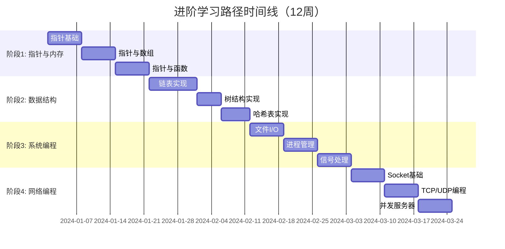

# 进阶学习路径（3-6个月）

> **目标读者**：已掌握C语言基础语法的学习者
> **学习周期**：3-6个月（全职学习约3个月，兼职学习约6个月）
> **前置要求**：完成基础学习路径，熟悉基本语法、控制流和简单函数

---

## 📅 学习路线图



---

## 阶段1：指针与内存（3周）

### 📚 学习材料

| 主题 | 推荐文件/资源 | 学习目标 |
|------|--------------|----------|
| 指针基础 | `knowledge/01_Core_Language/04_Memory/01_pointers_basics.md` | 理解指针本质，掌握取址和解引用 |
| 指针运算 | `knowledge/01_Core_Language/04_Memory/02_pointer_arithmetic.md` | 掌握指针加减、比较运算 |
| 指针与数组 | `knowledge/01_Core_Language/04_Memory/03_pointers_arrays.md` | 理解数组名和指针的关系 |
| 多级指针 | `knowledge/01_Core_Language/04_Memory/04_multilevel_pointers.md` | 掌握二级及以上指针的使用 |
| 函数指针 | `knowledge/01_Core_Language/04_Memory/05_function_pointers.md` | 理解回调函数机制 |
| 内存分配 | `knowledge/01_Core_Language/04_Memory/06_memory_allocation.md` | 熟练使用malloc/free |
| 内存泄漏 | `knowledge/01_Core_Language/04_Memory/07_memory_leaks.md` | 掌握内存泄漏检测方法 |
| Valgrind使用 | `knowledge/05_Tools_Chain/02_Debugging/02_valgrind_guide.md` | 学会使用Valgrind检测内存问题 |

### 🛠️ 实践项目

#### 项目1：动态数组库（Week 1-2）

**代码要求**：

```c
#ifndef DYNAMIC_ARRAY_H
#define DYNAMIC_ARRAY_H

#include <stddef.h>

typedef struct {
    int *data;
    size_t size;
    size_t capacity;
} DynamicArray;

// 基本操作
DynamicArray* da_create(size_t initial_capacity);
void da_destroy(DynamicArray *arr);
int da_push(DynamicArray *arr, int value);
int da_pop(DynamicArray *arr, int *value);
int da_get(DynamicArray *arr, size_t index, int *value);
int da_set(DynamicArray *arr, size_t index, int value);

// 高级操作
int da_insert(DynamicArray *arr, size_t index, int value);
int da_remove(DynamicArray *arr, size_t index);
void da_sort(DynamicArray *arr);
int da_find(DynamicArray *arr, int value);

// 内存管理
void da_shrink_to_fit(DynamicArray *arr);
int da_reserve(DynamicArray *arr, size_t new_capacity);

#endif
```

**必须实现的功能**：

1. ✅ 动态扩容机制（2倍增长策略）
2. ✅ 自动缩容优化（可选）
3. ✅ 边界安全检查
4. ✅ 错误码返回机制
5. ✅ 内存泄漏防护

**测试要求**：

```c
// test_dynamic_array.c
void test_basic_operations();
void test_edge_cases();
void test_memory_safety();
void test_performance();  // 至少支持100万元素
```

#### 项目2：字符串处理库（Week 3）

**代码要求**：

```c
// 实现自己的字符串类型
typedef struct {
    char *data;
    size_t length;
    size_t capacity;
} MyString;

// 必须实现
MyString* str_create(const char *initial);
void str_destroy(MyString *str);
int str_append(MyString *str, const char *suffix);
int str_insert(MyString *str, size_t pos, const char *substring);
int str_replace(MyString *str, const char *old, const char *new);
char** str_split(MyString *str, const char *delimiter, size_t *count);
```

### ✅ 检验标准

| 检验项 | 通过标准 | 自测方法 |
|--------|----------|----------|
| 指针基础 | 能正确解释`int *p`和`int* p`的区别 | 向他人讲解指针声明 |
| 指针运算 | 能心算`p + n`的实际地址偏移 | 完成20道指针运算题 |
| 多级指针 | 能正确使用三级指针 | 实现三维数组动态分配 |
| 内存管理 | 零内存泄漏 | Valgrind报告clean |
| 项目完成 | 通过所有单元测试 | 代码覆盖率>80% |

### 🚧 常见困难及解决方案

| 困难 | 原因分析 | 解决方案 |
|------|----------|----------|
| 指针概念模糊 | 混淆指针地址和指针指向的值 | 画图理解：方框是内存，箭头是地址 |
| 野指针错误 | 释放后未置NULL，返回局部变量地址 | 使用"释放即置NULL"原则，静态分析工具 |
| 内存泄漏 | malloc未配对free | 采用RAII模式，每个malloc对应一个free |
| 缓冲区溢出 | 未检查边界 | 始终使用安全函数，封装边界检查 |
| 段错误调试难 | 不知道在哪里崩溃 | 学习GDB，设置ulimit -c unlimited |

---

## 阶段2：数据结构（3周）

### 📚 学习材料

| 主题 | 推荐文件/资源 | 学习目标 |
|------|--------------|----------|
| 链表基础 | `knowledge/02_Data_Structures/01_Linked_Lists/01_singly_linked_list.md` | 掌握单向链表操作 |
| 双向链表 | `knowledge/02_Data_Structures/01_Linked_Lists/02_doubly_linked_list.md` | 实现双向链表 |
| 循环链表 | `knowledge/02_Data_Structures/01_Linked_Lists/03_circular_list.md` | 理解循环链表应用 |
| 栈与队列 | `knowledge/02_Data_Structures/02_Stack_Queue/01_stack_implementation.md` | 数组和链表实现 |
| 二叉树 | `knowledge/02_Data_Structures/03_Trees/01_binary_tree.md` | 掌握四种遍历方式 |
| 二叉搜索树 | `knowledge/02_Data_Structures/03_Trees/02_bst.md` | 实现BST基本操作 |
| 平衡树 | `knowledge/02_Data_Structures/03_Trees/03_avl_tree.md` | 理解旋转平衡机制 |
| 哈希表 | `knowledge/02_Data_Structures/04_Hash/01_hash_table.md` | 掌握哈希函数和冲突解决 |
| 算法复杂度 | `knowledge/02_Data_Structures/00_Algorithm_Analysis/01_complexity.md` | 分析时间和空间复杂度 |

### 🛠️ 实践项目

#### 项目1：通用链表库（Week 1）

**代码要求**：

```c
#ifndef LINKED_LIST_H
#define LINKED_LIST_H

#include <stddef.h>

// 节点定义
typedef struct ListNode {
    void *data;
    struct ListNode *next;
    struct ListNode *prev;
} ListNode;

// 链表定义
typedef struct {
    ListNode *head;
    ListNode *tail;
    size_t size;
    size_t data_size;
    void (*free_fn)(void *);  // 自定义释放函数
} LinkedList;

// 生命周期
LinkedList* list_create(size_t data_size, void (*free_fn)(void *));
void list_destroy(LinkedList *list);

// 增删改查
int list_push_front(LinkedList *list, const void *data);
int list_push_back(LinkedList *list, const void *data);
int list_pop_front(LinkedList *list, void *out);
int list_pop_back(LinkedList *list, void *out);
ListNode* list_find(LinkedList *list, const void *data,
                    int (*cmp)(const void *, const void *));
int list_remove(LinkedList *list, ListNode *node);

// 高级操作
void list_sort(LinkedList *list, int (*cmp)(const void *, const void *));
LinkedList* list_reverse(LinkedList *list);
void list_foreach(LinkedList *list, void (*fn)(void *, void *), void *arg);

#endif
```

**进阶挑战**：

- 实现迭代器模式
- 支持多线程安全（可选）
- 实现快速排序算法对链表排序

#### 项目2：哈希表实现（Week 2-3）

**代码要求**：

```c
#ifndef HASH_TABLE_H
#define HASH_TABLE_H

#include <stddef.h>
#include <stdbool.h>

#define HT_INITIAL_CAPACITY 16
#define HT_LOAD_FACTOR 0.75

typedef struct HashEntry {
    char *key;
    void *value;
    struct HashEntry *next;  // 链地址法
} HashEntry;

typedef struct {
    HashEntry **buckets;
    size_t capacity;
    size_t size;
    size_t value_size;
    void (*free_value)(void *);
} HashTable;

// 核心API
HashTable* ht_create(size_t value_size, void (*free_value)(void *));
void ht_destroy(HashTable *ht);
int ht_insert(HashTable *ht, const char *key, const void *value);
bool ht_get(HashTable *ht, const char *key, void *out);
bool ht_remove(HashTable *ht, const char *key);
bool ht_contains(HashTable *ht, const char *key);

// 迭代支持
typedef struct {
    HashTable *ht;
    size_t bucket_idx;
    HashEntry *current;
} HTIterator;

HTIterator ht_iterator(HashTable *ht);
bool ht_next(HTIterator *it, char **key, void **value);

#endif
```

**必须实现的功能**：

1. ✅ 动态扩容（rehashing）
2. ✅ 多种哈希函数（可选切换）
3. ✅ 链地址法冲突解决
4. ✅ 负载因子监控
5. ✅ 完整的迭代器支持

### ✅ 检验标准

| 检验项 | 通过标准 | 测试方法 |
|--------|----------|----------|
| 链表操作 | 所有操作O(1)或O(n) | 100万次操作测试 |
| 树遍历 | 能非递归实现所有遍历 | 手写非递归遍历代码 |
| BST平衡 | 理解AVL旋转原理 | 画出旋转过程图 |
| 哈希表 | 查找平均O(1) | 10万元素查找<10ms |
| 内存安全 | 无内存泄漏 | Valgrind验证 |

### 🚧 常见困难及解决方案

| 困难 | 原因分析 | 解决方案 |
|------|----------|----------|
| 指针混乱 | 链表操作涉及多个指针 | 画图跟踪，明确每个指针作用 |
| 内存重复释放 | 不清楚所有权归属 | 定义清晰的所有权规则 |
| 树递归难理解 | 递归思维不熟练 | 先理解递归三要素：终止条件、递归步骤、合并结果 |
| 哈希冲突 | 不理解冲突处理 | 实现时打印哈希分布 |
| 迭代器失效 | 遍历时修改结构 | 学习失效规则，必要时复制数据 |

---

## 阶段3：系统编程（3周）

### 📚 学习材料

| 主题 | 推荐文件/资源 | 学习目标 |
|------|--------------|----------|
| 文件I/O基础 | `knowledge/03_System_Programming/01_File_IO/01_file_basics.md` | 掌握open/read/write/close |
| 标准I/O库 | `knowledge/03_System_Programming/01_File_IO/02_stdio.md` | 理解缓冲机制 |
| 文件描述符 | `knowledge/03_System_Programming/01_File_IO/03_file_descriptors.md` | 理解fd和打开模式 |
| 内存映射 | `knowledge/03_System_Programming/01_File_IO/04_mmap.md` | 掌握mmap/munmap |
| 进程概念 | `knowledge/03_System_Programming/02_Processes/01_process_basics.md` | 理解进程状态 |
| 进程创建 | `knowledge/03_System_Programming/02_Processes/02_fork_exec.md` | 掌握fork/execve |
| 进程控制 | `knowledge/03_System_Programming/02_Processes/03_wait_exit.md` | 掌握wait/waitpid |
| 信号基础 | `knowledge/03_System_Programming/03_Signals/01_signal_basics.md` | 理解信号机制 |
| 信号处理 | `knowledge/03_System_Programming/03_Signals/02_signal_handlers.md` | 编写安全信号处理 |
| IPC基础 | `knowledge/03_System_Programming/04_IPC/01_pipe_fifo.md` | 掌握管道通信 |

### 🛠️ 实践项目

#### 项目1：文件复制工具（Week 1）

**代码要求**：

```c
// mycp.c - 支持多种复制模式的文件复制工具
#include <stdio.h>
#include <stdlib.h>
#include <unistd.h>
#include <fcntl.h>
#include <sys/mman.h>
#include <sys/stat.h>
#include <string.h>

// 复制模式
typedef enum {
    MODE_SIMPLE,     // 简单读写
    MODE_BUFFERED,   // 缓冲复制
    MODE_MMAP,       // 内存映射
    MODE_SENDFILE    // 零拷贝
} CopyMode;

// 功能要求：
// 1. 支持4种复制模式，可命令行选择
// 2. 显示复制速度和进度
// 3. 支持大文件（>4GB）
// 4. 支持目录递归复制
// 5. 保留文件属性

int copy_file(const char *src, const char *dst, CopyMode mode);
int copy_directory(const char *src, const char *dst, CopyMode mode);
void show_progress(off_t current, off_t total);
```

**性能对比**：

| 文件大小 | 简单读写 | 缓冲复制 | mmap | sendfile |
|----------|----------|----------|------|----------|
| 100MB | 记录 | 记录 | 记录 | 记录 |
| 1GB | 记录 | 记录 | 记录 | 记录 |
| 10GB | 记录 | 记录 | 记录 | 记录 |

#### 项目2：迷你Shell（Week 2-3）

**代码要求**：

```c
// myshell.c - 功能完整的迷你Shell

// 必须支持的功能：
// 1. 命令解析（引号、转义、变量展开）
// 2. 内建命令：cd, pwd, exit, export, echo
// 3. 管道：cmd1 | cmd2 | cmd3
// 4. 重定向：>, <, >>
// 5. 后台执行：cmd &
// 6. 信号处理：Ctrl+C, Ctrl+Z
// 7. 作业控制：fg, bg, jobs

// 数据结构
typedef struct Job {
    int job_id;
    pid_t pgid;
    char *command;
    int status;  // RUNNING, STOPPED, DONE
    struct Job *next;
} Job;

// 核心函数
int parse_command(char *input, Command *cmd);
int execute_command(Command *cmd);
int execute_pipeline(Command **cmds, int n);
int execute_redirection(Command *cmd, Redirection *redirs);
void handle_signal(int sig);
void job_control(int action, int job_id);
```

**功能检查清单**：

- [ ] `ls -la | grep \.c | wc -l` 正常工作
- [ ] `cat < input.txt > output.txt` 正常工作
- [ ] `sleep 10 &` 后台执行
- [ ] `fg %1` 恢复作业到前台
- [ ] Ctrl+C 只终止前台作业
- [ ] Ctrl+Z 暂停前台作业

### ✅ 检验标准

| 检验项 | 通过标准 | 测试方法 |
|--------|----------|----------|
| 文件I/O | 理解所有打开标志位 | 解释O_APPEND vs O_TRUNC |
| 进程管理 | 能解释fork输出规律 | 5道fork输出预测题全对 |
| 信号处理 | 编写异步信号安全代码 | 使用sigaction，只调用安全函数 |
| Shell功能 | 通过功能检查清单 | 逐项测试 |
| 错误处理 | 所有系统调用检查返回值 | 代码审查 |

### 🚧 常见困难及解决方案

| 困难 | 原因分析 | 解决方案 |
|------|----------|----------|
| fork输出混乱 | 不理解缓冲区复制 | 在fork前flush stdout |
| 僵尸进程 | 未wait子进程 | 使用signal(SIGCHLD, SIG_IGN)或waitpid |
| 信号丢失 | 信号不排队 | 使用sigaction的SA_RESTART |
| 竞态条件 | 信号和主程序竞争 | 只设置volatile sig_atomic_t标志 |
| 管道同步 | 读写顺序问题 | 理解pipe的阻塞特性 |

---

## 阶段4：网络编程（3周）

### 📚 学习材料

| 主题 | 推荐文件/资源 | 学习目标 |
|------|--------------|----------|
| Socket基础 | `knowledge/04_Network_Programming/01_Socket_Basics/01_socket_intro.md` | 理解socket抽象 |
| TCP协议 | `knowledge/04_Network_Programming/01_Socket_Basics/02_tcp_basics.md` | 理解TCP三次握手 |
| UDP协议 | `knowledge/04_Network_Programming/01_Socket_Basics/03_udp_basics.md` | 理解无连接通信 |
| 地址转换 | `knowledge/04_Network_Programming/01_Socket_Basics/04_address_conversion.md` | 掌握字节序和地址转换 |
| 并发模型 | `knowledge/04_Network_Programming/02_Concurrent_Server/01_concurrency_models.md` | 理解多进程/多线程/select/poll/epoll |
| IO多路复用 | `knowledge/04_Network_Programming/02_Concurrent_Server/02_io_multiplexing.md` | 掌握select/poll/epoll |
| HTTP协议 | `knowledge/04_Network_Programming/03_Application_Layer/01_http_basics.md` | 理解HTTP请求响应 |

### 🛠️ 实践项目

#### 项目1：Echo服务器（Week 1）

**代码要求**：

```c
// 实现4种并发模型的Echo服务器

// 1. 迭代模型（单进程）
void iterative_echo(int port);

// 2. 多进程模型
void fork_echo(int port);

// 3. 多线程模型
void thread_echo(int port);

// 4. IO多路复用模型
void select_echo(int port);
void poll_echo(int port);
void epoll_echo(int port);

// 性能测试要求：
// - 使用wrk或ab进行压力测试
// - 记录每种模型的QPS和内存占用
// - 测试并发连接数：10, 100, 1000, 10000
```

#### 项目2：HTTP服务器（Week 2-3）

**代码要求**：

```c
// tinyhttpd.c - 功能完整的HTTP服务器

// 功能需求：
// 1. HTTP/1.1协议支持
// 2. 支持GET/POST/HEAD方法
// 3. 静态文件服务
// 4. CGI支持（执行外部程序）
// 5. 虚拟主机支持
// 6. 访问日志
// 7. 配置文件支持

// 核心数据结构
typedef struct {
    char method[16];
    char path[256];
    char version[16];
    char headers[20][256];
    int header_count;
    char *body;
    size_t body_length;
} HttpRequest;

typedef struct {
    int status_code;
    char status_text[64];
    char headers[20][256];
    int header_count;
    char *body;
    size_t body_length;
} HttpResponse;

// 核心函数
int parse_http_request(const char *raw, HttpRequest *req);
int build_http_response(HttpResponse *res, char *buf, size_t buf_size);
int serve_static_file(HttpRequest *req, HttpResponse *res, const char *root);
int serve_cgi(HttpRequest *req, HttpResponse *res, const char *cgi_path);
```

**HTTP功能检查清单**：

- [ ] `curl http://localhost:8080/` 返回index.html
- [ ] `curl -X POST -d "name=test" http://localhost:8080/cgi-bin/test.cgi` CGI执行
- [ ] 支持Range请求
- [ ] 支持Keep-Alive连接
- [ ] 正确的MIME类型识别
- [ ] 访问日志格式：`%h %l %u %t "%r" %>s %b`

### ✅ 检验标准

| 检验项 | 通过标准 | 测试方法 |
|--------|----------|----------|
| Socket API | 熟练使用所有常用API | 不查文档写出完整服务器 |
| TCP理解 | 能画出三次握手四次挥手 | 手绘时序图 |
| 并发模型 | 理解每种模型的优缺点 | 对比QPS和内存占用 |
| HTTP协议 | 能手写HTTP请求和响应 | 用telnet调试 |
| 服务器功能 | 通过功能检查清单 | 逐项curl测试 |

### 🚧 常见困难及解决方案

| 困难 | 原因分析 | 解决方案 |
|------|----------|----------|
| 字节序错误 | 忘记htonl/htons | 所有网络数据使用标准转换函数 |
| 粘包问题 | TCP流式传输特性 | 设计消息边界或使用固定长度 |
| 僵尸连接 | 客户端异常断开 | 使用TCP keepalive或应用层心跳 |
| C10K问题 | 资源限制 | 使用epoll + 非阻塞IO |
| 缓冲区溢出 | 未检查接收数据长度 | 始终限制接收长度 |

---

## 📊 阶段总结与进阶

### 各阶段时间投入建议

| 阶段 | 理论学习 | 实践编码 | 调试优化 | 总计 |
|------|----------|----------|----------|------|
| 指针与内存 | 10h | 25h | 15h | 50h |
| 数据结构 | 15h | 30h | 15h | 60h |
| 系统编程 | 15h | 25h | 20h | 60h |
| 网络编程 | 15h | 30h | 25h | 70h |
| **总计** | **55h** | **110h** | **75h** | **240h** |

### 推荐项目组合

完成本路径后，建议完成以下综合项目：

1. **Redis客户端库**：综合运用指针、数据结构、网络编程
2. **SQLite简化版**：综合运用文件I/O、B树、内存管理
3. **代理服务器**：综合运用并发编程、网络编程、系统调用

### 学习检查清单

- [ ] 能独立实现通用链表库
- [ ] 能独立实现哈希表（含动态扩容）
- [ ] 能编写功能完整的Shell
- [ ] 能实现多并发模型的Echo服务器
- [ ] 能实现支持CGI的HTTP服务器
- [ ] 所有项目通过Valgrind内存检查
- [ ] 能向他人清晰解释指针概念

---

> **下一路径**：[高级学习路径](./03_Advanced_Learning_Path.md)
