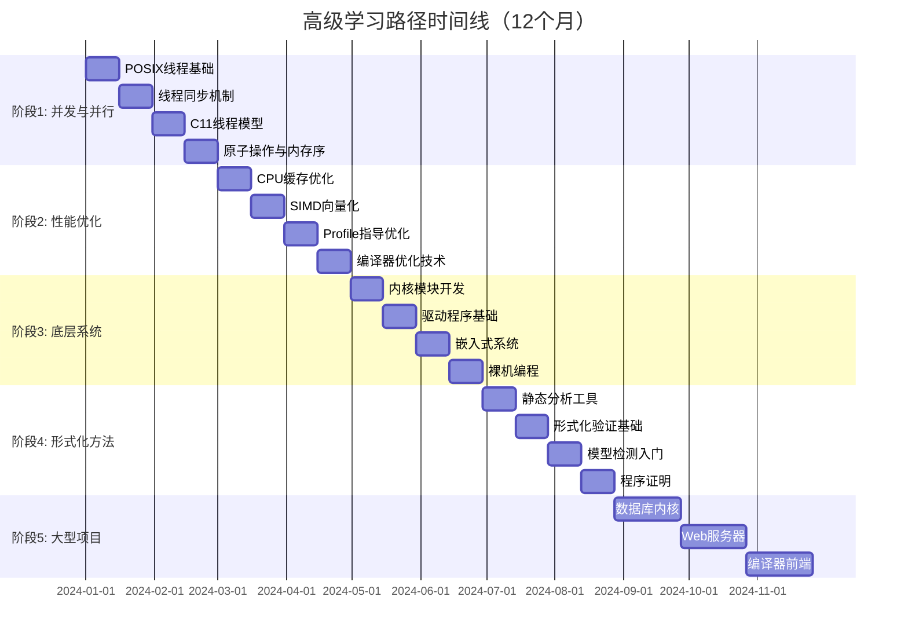

# 高级学习路径（6-12个月）

> **目标读者**：已完成进阶学习路径的开发者
> **学习周期**：6-12个月（全职学习约6个月，兼职学习约12个月）
> **前置要求**：熟练掌握指针、数据结构、系统编程、网络编程
> **目标职位**：高级C开发工程师、系统架构师、性能优化专家

---

## 📅 学习路线图



---


---

## 📑 目录

- [高级学习路径（6-12个月）](#高级学习路径6-12个月)
  - [📅 学习路线图](#-学习路线图)
  - [📑 目录](#-目录)
  - [阶段1：并发与并行（1.5个月）](#阶段1并发与并行15个月)
    - [📚 学习材料](#-学习材料)
    - [🛠️ 实践项目](#️-实践项目)
      - [项目1：高并发线程池（Week 1-2）](#项目1高并发线程池week-1-2)
      - [项目2：无锁队列（Week 3-4）](#项目2无锁队列week-3-4)
      - [项目3：并行排序算法（Week 5-6）](#项目3并行排序算法week-5-6)
    - [✅ 检验标准](#-检验标准)
    - [🚧 常见困难及解决方案](#-常见困难及解决方案)
  - [阶段2：性能优化（1.5个月）](#阶段2性能优化15个月)
    - [📚 学习材料](#-学习材料-1)
    - [🛠️ 实践项目](#️-实践项目-1)
      - [项目1：SIMD矩阵运算库（Week 1-3）](#项目1simd矩阵运算库week-1-3)
      - [项目2：高性能日志库（Week 4-6）](#项目2高性能日志库week-4-6)
    - [✅ 检验标准](#-检验标准-1)
    - [🚧 常见困难及解决方案](#-常见困难及解决方案-1)
  - [阶段3：底层系统（1.5个月）](#阶段3底层系统15个月)
    - [📚 学习材料](#-学习材料-2)
    - [🛠️ 实践项目](#️-实践项目-2)
      - [项目1：简单内核模块（Week 1-2）](#项目1简单内核模块week-1-2)
      - [项目2：裸机LED闪烁（ARM Cortex-M）（Week 3-4）](#项目2裸机led闪烁arm-cortex-mweek-3-4)
    - [✅ 检验标准](#-检验标准-2)
    - [🚧 常见困难及解决方案](#-常见困难及解决方案-2)
  - [阶段4：形式化方法（1.5个月）](#阶段4形式化方法15个月)
    - [📚 学习材料](#-学习材料-3)
    - [🛠️ 实践项目](#️-实践项目-3)
      - [项目1：使用Frama-C验证代码（Week 1-3）](#项目1使用frama-c验证代码week-1-3)
      - [项目2：CBMC有界模型检测（Week 4-6）](#项目2cbmc有界模型检测week-4-6)
    - [✅ 检验标准](#-检验标准-3)
    - [🚧 常见困难及解决方案](#-常见困难及解决方案-3)
  - [阶段5：大型项目实践（3个月）](#阶段5大型项目实践3个月)
    - [项目1：简化版SQLite（4周）](#项目1简化版sqlite4周)
    - [项目2：高性能Web服务器（4周）](#项目2高性能web服务器4周)
    - [项目3：C编译器子集（4周）](#项目3c编译器子集4周)
  - [📊 阶段总结](#-阶段总结)
    - [技能矩阵](#技能矩阵)
    - [推荐认证](#推荐认证)


---

## 阶段1：并发与并行（1.5个月）

### 📚 学习材料

| 主题 | 推荐文件/资源 | 学习目标 |
|------|--------------|----------|
| POSIX线程基础 | `knowledge/01_Core_Language/07_Concurrency/01_pthreads_basics.md` | 掌握pthread_create/join |
| 互斥锁与条件变量 | `knowledge/01_Core_Language/07_Concurrency/02_mutex_condvar.md` | 理解线程同步原语 |
| 读写锁与屏障 | `knowledge/01_Core_Language/07_Concurrency/03_rwlock_barriers.md` | 掌握高级同步机制 |
| 线程池实现 | `knowledge/01_Core_Language/07_Concurrency/04_thread_pool.md` | 实现生产级线程池 |
| 并发问题 | `knowledge/01_Core_Language/07_Concurrency/05_concurrency_problems.md` | 识别竞态条件、死锁 |
| C11线程 | `knowledge/01_Core_Language/07_Concurrency/06_c11_threads.md` | 使用标准C线程API |
| C11原子操作 | `knowledge/01_Core_Language/07_Concurrency/07_c11_atomics.md` | 掌握原子类型和内存序 |
| 内存模型 | `knowledge/01_Core_Language/07_Concurrency/08_memory_model.md` | 理解C11内存模型 |
| lock-free编程 | `knowledge/01_Core_Language/07_Concurrency/09_lock_free.md` | 实现无锁数据结构 |

### 🛠️ 实践项目

#### 项目1：高并发线程池（Week 1-2）

**代码要求**：

```c
#ifndef THREAD_POOL_H
#define THREAD_POOL_H

#include <stddef.h>
#include <stdbool.h>

typedef struct ThreadPool ThreadPool;
typedef void (*TaskFunc)(void *arg);

// 线程池配置
typedef struct {
    size_t min_threads;      // 最小线程数
    size_t max_threads;      // 最大线程数
    size_t queue_capacity;   // 任务队列容量
    size_t keepalive_time;   // 空闲线程存活时间(ms)
    bool enable_metrics;     // 是否启用统计
} TPConfig;

// 统计信息
typedef struct {
    size_t active_threads;
    size_t idle_threads;
    size_t total_tasks;
    size_t completed_tasks;
    size_t rejected_tasks;
    double avg_wait_time;    // 平均等待时间(ms)
    double avg_exec_time;    // 平均执行时间(ms)
} TPMetrics;

// API
ThreadPool* tp_create(const TPConfig *config);
void tp_destroy(ThreadPool *pool, bool wait_pending);
int tp_submit(ThreadPool *pool, TaskFunc func, void *arg,
              size_t timeout_ms);
bool tp_get_metrics(ThreadPool *pool, TPMetrics *metrics);
void tp_shutdown(ThreadPool *pool);

#endif
```

**高级特性**：

1. ✅ 动态扩缩容（根据负载调整线程数）
2. ✅ 多种拒绝策略（Abort/Discard/CallerRuns）
3. ✅ 任务优先级支持
4. ✅ 优雅关闭（等待或立即）
5. ✅ 完善的性能指标
6. ✅ 使用C11原子操作实现无锁队列

**性能基准**：

| 指标 | 目标值 |
|------|--------|
| 任务提交延迟 | < 1μs |
| 100万任务吞吐量 | > 100万/秒 |
| 内存占用 | < 10MB |
| 线程切换开销 | < 10μs |

#### 项目2：无锁队列（Week 3-4）

**代码要求**：

```c
#ifndef LOCK_FREE_QUEUE_H
#define LOCK_FREE_QUEUE_H

#include <stdatomic.h>
#include <stdbool.h>
#include <stddef.h>

// Michael-Scott队列实现
typedef struct LFQueueNode {
    _Atomic(void *) data;
    _Atomic(struct LFQueueNode *) next;
} LFQueueNode;

typedef struct {
    _Atomic(LFQueueNode *) head;
    _Atomic(LFQueueNode *) tail;
    _Atomic(size_t) size;
    char padding[64 - 3 * sizeof(atomic_uintptr_t) - sizeof(atomic_size_t)];
} LFQueue;

LFQueue* lfq_create(void);
void lfq_destroy(LFQueue *queue);
bool lfq_enqueue(LFQueue *queue, void *data);
bool lfq_dequeue(LFQueue *queue, void **data);
size_t lfq_size(LFQueue *queue);
bool lfq_is_empty(LFQueue *queue);

// 多生产者多消费者队列（MPMC）
typedef struct {
    // 环形缓冲区实现
    _Atomic(size_t) head;
    _Atomic(size_t) tail;
    size_t capacity;
    _Atomic(void *) *buffer;
} MPMCQueue;

MPMCQueue* mpmcq_create(size_t capacity);
void mpmcq_destroy(MPMCQueue *queue);
bool mpmcq_enqueue(MPMCQueue *queue, void *data);
bool mpmcq_dequeue(MPMCQueue *queue, void **data);

#endif
```

**验证要求**：

- 使用helgrind/ThreadSanitizer验证无数据竞争
- 100线程并发测试1小时无错误
- 与mutex版本对比性能（预期5-10倍提升）

#### 项目3：并行排序算法（Week 5-6）

**代码要求**：

```c
// 实现以下并行算法：

// 1. 并行快速排序
void parallel_qsort(void *base, size_t nmemb, size_t size,
                    int (*cmp)(const void *, const void *));

// 2. 并行归并排序
void parallel_mergesort(void *base, size_t nmemb, size_t size,
                        int (*cmp)(const void *, const void *));

// 3. 并行基数排序（针对整数）
void parallel_radixsort(int *arr, size_t n);

// 性能对比（在8核机器上）：
// - 单线程快速排序
// - 并行快速排序
// - std::sort (C++)
// - tbb::parallel_sort (Intel TBB)
```

### ✅ 检验标准

| 检验项 | 通过标准 | 测试方法 |
|--------|----------|----------|
| 线程同步 | 能识别所有竞态条件 | 通过helgrind检测 |
| 死锁避免 | 无死锁发生 | 压力测试24小时 |
| C11原子 | 正确使用内存序 | 解释seq_cst vs acquire/release |
| 无锁编程 | 无ABA问题 | 使用标记指针或Hazard Pointer |
| 性能达标 | 达到基准要求 | 基准测试 |

### 🚧 常见困难及解决方案

| 困难 | 原因分析 | 解决方案 |
|------|----------|----------|
| 死锁 | 锁获取顺序不一致 | 定义全局锁顺序，使用try_lock |
| 伪共享 | 多个线程修改同一缓存行 | 使用padding对齐到64字节 |
| ABA问题 | 无锁算法中值重复出现 | 使用标记指针或Hazard Pointer |
| 内存序混淆 | 不理解C11内存模型 | 从seq_cst开始，逐步优化 |
| 调试困难 | 并发问题难以复现 | 使用ThreadSanitizer，写确定性测试 |

---

## 阶段2：性能优化（1.5个月）

### 📚 学习材料

| 主题 | 推荐文件/资源 | 学习目标 |
|------|--------------|----------|
| CPU缓存体系 | `knowledge/05_Tools_Chain/04_Performance/01_cache_hierarchy.md` | 理解L1/L2/L3缓存 |
| 缓存优化技术 | `knowledge/05_Tools_Chain/04_Performance/02_cache_optimization.md` | 掌握缓存友好代码 |
| 分支预测 | `knowledge/05_Tools_Chain/04_Performance/03_branch_prediction.md` | 减少分支预测失败 |
| SIMD基础 | `knowledge/05_Tools_Chain/04_Performance/04_simd_basics.md` | 使用SSE/AVX指令 |
| 自动向量化 | `knowledge/05_Tools_Chain/04_Performance/05_auto_vectorization.md` | 帮助编译器向量化 |
| Profile指导优化 | `knowledge/05_Tools_Chain/04_Performance/06_pgo.md` | 使用PGO提升性能 |
| 编译器优化 | `knowledge/05_Tools_Chain/04_Performance/07_compiler_optimizations.md` | 理解-O3优化级别 |
| 性能分析工具 | `knowledge/05_Tools_Chain/04_Performance/08_profiling_tools.md` | 熟练使用perf/vtune |

### 🛠️ 实践项目

#### 项目1：SIMD矩阵运算库（Week 1-3）

**代码要求**：

```c
#ifndef SIMD_MATRIX_H
#define SIMD_MATRIX_H

#include <stddef.h>

// 矩阵定义
typedef struct {
    float *data;
    size_t rows;
    size_t cols;
    size_t stride;  // 行步长，支持子矩阵
} Matrix;

// 创建和销毁
Matrix* mat_create(size_t rows, size_t cols);
Matrix* mat_create_aligned(size_t rows, size_t cols, size_t alignment);
void mat_destroy(Matrix *mat);

// 基础运算（SSE/AVX实现）
void mat_add(const Matrix *a, const Matrix *b, Matrix *result);
void mat_sub(const Matrix *a, const Matrix *b, Matrix *result);
void mat_mul_scalar(const Matrix *a, float scalar, Matrix *result);

// 矩阵乘法（分块+SIMD优化）
void mat_mul(const Matrix *a, const Matrix *b, Matrix *result);
void mat_mul_blocked(const Matrix *a, const Matrix *b, Matrix *result,
                     size_t block_size);
void mat_mul_simd(const Matrix *a, const Matrix *b, Matrix *result);
void mat_mul_avx512(const Matrix *a, const Matrix *b, Matrix *result);

// 转置（缓存友好）
void mat_transpose(const Matrix *src, Matrix *dst);
void mat_transpose_blocked(const Matrix *src, Matrix *dst, size_t block_size);

// 性能对比测试
void benchmark_all_multiplications(size_t n);

#endif
```

**优化目标**（4096x4096矩阵乘法）：

| 实现版本 | 目标性能 | 相对加速 |
|----------|----------|----------|
| 朴素三重循环 | 5 GFLOPS | 1x |
| 缓存分块(64x64) | 20 GFLOPS | 4x |
| SSE4.2向量化 | 40 GFLOPS | 8x |
| AVX2 (256-bit) | 80 GFLOPS | 16x |
| AVX-512 (512-bit) | 120 GFLOPS | 24x |
| 理论峰值 | ~150 GFLOPS | 30x |

#### 项目2：高性能日志库（Week 4-6）

**代码要求**：

```c
#ifndef HIGH_PERF_LOG_H
#define HIGH_PERF_LOG_H

#include <stdarg.h>
#include <stdbool.h>
#include <stdint.h>

// 日志级别
typedef enum {
    LOG_LEVEL_TRACE = 0,
    LOG_LEVEL_DEBUG,
    LOG_LEVEL_INFO,
    LOG_LEVEL_WARN,
    LOG_LEVEL_ERROR,
    LOG_LEVEL_FATAL
} LogLevel;

// 配置
typedef struct {
    LogLevel level;
    const char *file_path;
    size_t max_file_size;
    size_t max_files;        // 轮转文件数
    bool async_mode;         // 异步模式
    size_t queue_size;       // 异步队列大小
    bool compress_old;       // 压缩旧日志
} LogConfig;

// API
int log_init(const LogConfig *config);
void log_shutdown(void);

// 格式化日志（使用宏减少开销）
#define LOG_TRACE(fmt, ...) \
    log_write(LOG_LEVEL_TRACE, __FILE__, __LINE__, fmt, ##__VA_ARGS__)
#define LOG_DEBUG(fmt, ...) \
    log_write(LOG_LEVEL_DEBUG, __FILE__, __LINE__, fmt, ##__VA_ARGS__)
#define LOG_INFO(fmt, ...) \
    log_write(LOG_LEVEL_INFO, __FILE__, __LINE__, fmt, ##__VA_ARGS__)
#define LOG_ERROR(fmt, ...) \
    log_write(LOG_LEVEL_ERROR, __FILE__, __LINE__, fmt, ##__VA_ARGS__)

void log_write(LogLevel level, const char *file, int line,
               const char *fmt, ...);

// 性能目标：单线程 > 1GB/s，异步 > 2GB/s
#endif
```

**关键优化技术**：

1. 零拷贝：使用mmap写入
2. 批量刷新：缓冲到一定大小再fsync
3. 无锁队列：单生产者单消费者环形缓冲区
4. 预格式化：编译时解析格式字符串
5. 二进制日志：可选的二进制格式减少解析开销

### ✅ 检验标准

| 检验项 | 通过标准 | 测试方法 |
|--------|----------|----------|
| 缓存命中率 | > 95% | perf stat -e cache-misses |
| SIMD加速比 | > 8x | 对比标量版本 |
| 分支预测 | < 1% miss | perf stat -e branch-misses |
| 内存对齐 | 所有关键结构对齐 | 检查结构体布局 |
| PGO效果 | 提升 > 10% | 对比编译前后性能 |

### 🚧 常见困难及解决方案

| 困难 | 原因分析 | 解决方案 |
|------|----------|----------|
| 缓存未命中 | 数据访问模式不连续 | 重构数据布局，使用SOA而非AOS |
| SIMD代码复杂 |  intrinsics难以编写 | 使用ISPC或自动向量化辅助 |
| 过度优化 | 代码可读性极差 | 保留参考实现，条件编译优化版本 |
| 性能回退 | 优化后反而更慢 | 始终使用perf验证每次优化 |
| 编译器不合作 | 编译器拒绝向量化 | 使用__builtin_unreachable等提示 |

---

## 阶段3：底层系统（1.5个月）

### 📚 学习材料

| 主题 | 推荐文件/资源 | 学习目标 |
|------|--------------|----------|
| 内核模块基础 | `knowledge/03_System_Programming/05_Kernel/01_kernel_modules.md` | 理解内核模块结构 |
| 字符设备驱动 | `knowledge/03_System_Programming/05_Kernel/02_char_device.md` | 实现简单驱动 |
| 中断处理 | `knowledge/03_System_Programming/05_Kernel/03_interrupts.md` | 理解中断上下文 |
| 内存管理 | `knowledge/03_System_Programming/05_Kernel/04_kernel_memory.md` | 内核内存分配 |
| 嵌入式C | `knowledge/03_System_Programming/06_Embedded/01_embedded_c.md` | 裸机编程基础 |
| 硬件抽象 | `knowledge/03_System_Programming/06_Embedded/02_hal.md` | 编写硬件抽象层 |
| 实时系统 | `knowledge/03_System_Programming/06_Embedded/03_rtos.md` | 理解实时调度 |
| 启动代码 | `knowledge/03_System_Programming/06_Embedded/04_bootloader.md` | 理解启动流程 |

### 🛠️ 实践项目

#### 项目1：简单内核模块（Week 1-2）

**代码要求**：

```c
// hello_kernel.c - 第一个内核模块
#include <linux/module.h>
#include <linux/kernel.h>
#include <linux/init.h>
#include <linux/fs.h>
#include <linux/cdev.h>
#include <linux/uaccess.h>

#define DEVICE_NAME "mydevice"
#define CLASS_NAME "myclass"
#define BUFFER_SIZE 1024

static int major_number;
static struct class *my_class = NULL;
static struct device *my_device = NULL;
static char device_buffer[BUFFER_SIZE];
static int buffer_pos = 0;

// 文件操作
static int my_open(struct inode *inode, struct file *file) {
    printk(KERN_INFO "mydevice: opened\n");
    return 0;
}

static int my_release(struct inode *inode, struct file *file) {
    printk(KERN_INFO "mydevice: closed\n");
    return 0;
}

static ssize_t my_read(struct file *file, char __user *user_buffer,
                       size_t len, loff_t *offset) {
    // 实现读取逻辑
}

static ssize_t my_write(struct file *file, const char __user *user_buffer,
                        size_t len, loff_t *offset) {
    // 实现写入逻辑
}

static struct file_operations fops = {
    .open = my_open,
    .release = my_release,
    .read = my_read,
    .write = my_write,
};

// 模块初始化和清理
static int __init my_init(void) {
    // 注册字符设备
}

static void __exit my_exit(void) {
    // 注销设备
}

module_init(my_init);
module_exit(my_exit);
MODULE_LICENSE("GPL");
MODULE_AUTHOR("Your Name");
MODULE_DESCRIPTION("Simple kernel module");
```

#### 项目2：裸机LED闪烁（ARM Cortex-M）（Week 3-4）

**代码要求**：

```c
// main.c - STM32F4裸机程序

#include <stdint.h>

// 寄存器定义
#define RCC_BASE        0x40023800
#define GPIOA_BASE      0x40020000

#define RCC_AHB1ENR     (*(volatile uint32_t *)(RCC_BASE + 0x30))
#define GPIOA_MODER     (*(volatile uint32_t *)(GPIOA_BASE + 0x00))
#define GPIOA_ODR       (*(volatile uint32_t *)(GPIOA_BASE + 0x14))

#define RCC_AHB1ENR_GPIOAEN     (1 << 0)
#define GPIO_MODER_MODER5_POS   (5 * 2)
#define GPIO_MODER_MODER5_MASK  (0x3 << GPIO_MODER_MODER5_POS)
#define GPIO_MODER_MODER5_OUT   (0x1 << GPIO_MODER_MODER5_POS)
#define GPIO_ODR_OD5            (1 << 5)

// 启动代码（在start.S中）
extern void _start(void);
extern void _estack(void);

// 向量表
__attribute__((section(".isr_vector")))
void (*const vector_table[])(void) = {
    _estack,    // 栈顶
    _start,     // 复位处理
};

// 延迟函数
void delay(volatile uint32_t count) {
    while (count--) {
        __asm__ volatile ("nop");
    }
}

// 主函数
int main(void) {
    // 使能GPIOA时钟
    RCC_AHB1ENR |= RCC_AHB1ENR_GPIOAEN;

    // 配置PA5为输出（LED）
    GPIOA_MODER &= ~GPIO_MODER_MODER5_MASK;
    GPIOA_MODER |= GPIO_MODER_MODER5_OUT;

    // LED闪烁
    while (1) {
        GPIOA_ODR ^= GPIO_ODR_OD5;  // 切换LED状态
        delay(500000);
    }

    return 0;
}

// 启动代码（最小实现）
void _start(void) {
    // 初始化.bss段（清零）
    extern uint32_t _sbss, _ebss;
    for (uint32_t *p = &_sbss; p < &_ebss; p++) {
        *p = 0;
    }

    // 初始化.data段（从Flash复制到RAM）
    extern uint32_t _sdata, _edata, _sidata;
    uint32_t *src = &_sidata;
    for (uint32_t *dst = &_sdata; dst < &_edata; dst++) {
        *dst = *src++;
    }

    // 调用main
    main();

    // 如果main返回，进入死循环
    while (1);
}
```

**链接脚本**：

```ld
/* linker_script.ld */
MEMORY
{
    FLASH (rx) : ORIGIN = 0x08000000, LENGTH = 1024K
    RAM (rwx)  : ORIGIN = 0x20000000, LENGTH = 128K
}

SECTIONS
{
    .text : {
        KEEP(*(.isr_vector))
        *(.text*)
        *(.rodata*)
        _etext = .;
    } > FLASH

    _sidata = LOADADDR(.data);
    .data : {
        _sdata = .;
        *(.data*)
        _edata = .;
    } > RAM AT > FLASH

    .bss : {
        _sbss = .;
        *(.bss*)
        *(COMMON)
        _ebss = .;
    } > RAM

    _estack = ORIGIN(RAM) + LENGTH(RAM);
}
```

### ✅ 检验标准

| 检验项 | 通过标准 | 测试方法 |
|--------|----------|----------|
| 模块编译 | 成功编译.ko文件 | make编译无错误 |
| 设备注册 | /dev/mydevice可用 | ls /dev/mydevice |
| 读写测试 | echo/cat正常工作 | 功能测试 |
| 裸机启动 | 程序正确运行 | LED闪烁 |
| 内存布局 | 理解链接脚本 | 解释各段作用 |

### 🚧 常见困难及解决方案

| 困难 | 原因分析 | 解决方案 |
|------|----------|----------|
| 内核崩溃 | 空指针解引用等 | 使用VMware/VirtualBox测试 |
| 模块加载失败 | 版本不匹配 | 使用相同内核源码编译 |
| 硬件不工作 | 时钟未使能 | 检查参考手册时钟章节 |
| 调试困难 | 无法printf | 使用串口输出或调试器 |
| 启动失败 | 向量表错误 | 确保向量表在Flash起始位置 |

---

## 阶段4：形式化方法（1.5个月）

### 📚 学习材料

| 主题 | 推荐文件/资源 | 学习目标 |
|------|--------------|----------|
| 静态分析介绍 | `knowledge/05_Tools_Chain/05_Formal_Methods/01_static_analysis.md` | 理解静态分析原理 |
| Clang Static Analyzer | `knowledge/05_Tools_Chain/05_Formal_Methods/02_clang_analyzer.md` | 使用CSA |
| Coverity/Polyspace | `knowledge/05_Tools_Chain/05_Formal_Methods/03_coverity.md` | 商业工具使用 |
| 形式化验证基础 | `knowledge/05_Tools_Chain/05_Formal_Methods/04_formal_verification.md` | 理解霍尔逻辑 |
| Frama-C | `knowledge/05_Tools_Chain/05_Formal_Methods/05_frama_c.md` | 使用Frama-C验证 |
| CBMC | `knowledge/05_Tools_Chain/05_Formal_Methods/06_cbmc.md` | 有界模型检测 |
| 模型检测 | `knowledge/05_Tools_Chain/05_Formal_Methods/07_model_checking.md` | 理解LTL/CTL |

### 🛠️ 实践项目

#### 项目1：使用Frama-C验证代码（Week 1-3）

**代码要求**：

```c
// 使用ACS注释验证安全属性

/*@
    requires \valid(arr + (0..n-1));
    requires n >= 0;
    assigns \nothing;
    ensures \result == -1 || (0 <= \result < n);
    ensures \result != -1 ==> arr[\result] == key;
    ensures \result == -1 ==>
            \forall integer i; 0 <= i < n ==> arr[i] != key;
*/
int binary_search(const int *arr, int n, int key);

/*@
    requires \valid(dest + (0..n-1));
    requires \valid(src + (0..n-1));
    requires n >= 0;
    requires \separated(dest + (0..n-1), src + (0..n-1));
    assigns dest[0..n-1];
    ensures \forall integer i; 0 <= i < n ==> dest[i] == src[i];
*/
void safe_memcpy(int *dest, const int *src, int n);

/*@
    requires \valid(ptr);
    requires *ptr > INT_MIN;
    assigns *ptr;
    ensures *ptr == \old(*ptr) - 1;
*/
void safe_decrement(int *ptr);
```

**验证目标**：

1. 证明无数组越界访问
2. 证明无整数溢出
3. 证明无空指针解引用
4. 证明后置条件成立

#### 项目2：CBMC有界模型检测（Week 4-6）

**代码要求**：

```c
// 状态机实现，使用CBMC验证属性

typedef enum { STATE_IDLE, STATE_RUNNING, STATE_PAUSED, STATE_STOPPED } State;

typedef struct {
    State state;
    int counter;
    bool initialized;
} StateMachine;

// 使用CBMC验证以下属性：
// 1. 状态转换总是有效的
// 2. counter不会溢出
// 3. 必须先initialize才能start
// 4. stop后不能resume

void sm_init(StateMachine *sm);
void sm_start(StateMachine *sm);
void sm_pause(StateMachine *sm);
void sm_resume(StateMachine *sm);
void sm_stop(StateMachine *sm);

// CBMC验证桩
#ifdef CBMC
void verify_state_machine(void) {
    StateMachine sm;

    // 非确定性选择操作
    int choice;
    __CPROVER_assume(choice >= 0 && choice < 5);

    switch (choice) {
        case 0: sm_init(&sm); break;
        case 1: sm_start(&sm); break;
        case 2: sm_pause(&sm); break;
        case 3: sm_resume(&sm); break;
        case 4: sm_stop(&sm); break;
    }

    // 验证不变量
    __CPROVER_assert(sm.counter >= 0, "Counter non-negative");
    __CPROVER_assert(sm.state >= STATE_IDLE && sm.state <= STATE_STOPPED,
                     "Valid state");
}
#endif
```

### ✅ 检验标准

| 检验项 | 通过标准 | 测试方法 |
|--------|----------|----------|
| ACS注释 | 正确编写函数契约 | Frama-C WP验证通过 |
| 循环不变量 | 证明循环正确性 | 所有循环有不变量 |
| CBMC验证 | 无反例产生 | cbmc --unwind 10 |
| 覆盖率 | > 90% 分支覆盖 | gcov报告 |
| 安全属性 | 证明关键属性 | 形式化验证报告 |

### 🚧 常见困难及解决方案

| 困难 | 原因分析 | 解决方案 |
|------|----------|----------|
| 证明失败 | 前置条件不足 | 加强requires |
| 循环不终止 | 无法找到ranking函数 | 显式写出loop variant |
| 工具报告难懂 | ACSL语法复杂 | 参考ACSL教程 |
| 状态空间爆炸 | CBMC无法完成 | 减少unwind次数，分解函数 |
| 工具链配置 | 环境配置复杂 | 使用Docker镜像 |

---

## 阶段5：大型项目实践（3个月）

### 项目1：简化版SQLite（4周）

**核心功能**：

```c
// 实现B树存储引擎、SQL解析器、执行引擎

// 支持的SQL：
// CREATE TABLE users (id INTEGER PRIMARY KEY, name TEXT, age INTEGER);
// INSERT INTO users VALUES (1, 'Alice', 25);
// SELECT * FROM users WHERE age > 20;
// UPDATE users SET age = 26 WHERE id = 1;
// DELETE FROM users WHERE id = 1;

// 架构：
// 1. SQL解析器 (lexer + recursive descent parser)
// 2. B+树存储引擎 (page-based, 4KB pages)
// 3. 执行引擎 (volcano iterator model)
// 4. 事务管理 (WAL日志)
```

### 项目2：高性能Web服务器（4周）

**核心功能**：

```c
// 参考Nginx架构：
// 1. 主进程 + 多Worker进程
// 2. epoll事件驱动（边缘触发）
// 3. 线程池处理磁盘I/O
// 4. HTTP/1.1 keep-alive + pipeline
// 5. 内存池管理
// 6. 配置文件热加载

// 性能目标：
// - 单机10万并发连接
// - 静态文件 > 1GB/s
// - 延迟P99 < 10ms
```

### 项目3：C编译器子集（4周）

**核心功能**：

```c
// 实现C子集编译器：
// - 数据类型：int, char, 指针, 数组
// - 控制流：if/else, while, for, return
// - 函数：声明、定义、调用
// - 递归下降解析器
// - 简单的IR（三地址码）
// - x86-64代码生成

// 架构：
// 1. 词法分析（手写的lexer）
// 2. 语法分析（递归下降）
// 3. 语义分析（符号表、类型检查）
// 4. IR生成
// 5. 寄存器分配（简单贪心）
// 6. 代码生成
```

---

## 📊 阶段总结

### 技能矩阵

| 技能领域 | 阶段1 | 阶段2 | 阶段3 | 阶段4 | 阶段5 |
|----------|-------|-------|-------|-------|-------|
| 并发编程 | ⭐⭐⭐ | ⭐ | ⭐ | - | ⭐⭐ |
| 性能优化 | ⭐ | ⭐⭐⭐ | ⭐ | - | ⭐⭐ |
| 底层系统 | - | - | ⭐⭐⭐ | - | ⭐ |
| 形式化方法 | - | - | - | ⭐⭐⭐ | - |
| 架构设计 | ⭐ | ⭐⭐ | ⭐ | ⭐ | ⭐⭐⭐ |

### 推荐认证

- **Linux Foundation**: Linux Kernel Development
- **ARM**: ARM Accredited Engineer
- **ISO**: 功能安全认证（如从事汽车/航空）

---

> **返回**：[进阶学习路径](./02_Intermediate_Learning_Path.md) | **继续**：[专业方向路径](./04_Specialization_Paths.md)


---

## 深入理解

### 核心原理

深入探讨技术原理和实现细节。

### 实践应用

- 应用场景1
- 应用场景2
- 应用场景3

### 最佳实践

1. 理解基础概念
2. 掌握核心机制
3. 应用到实际项目

---

> **最后更新**: 2026-03-21  
> **维护者**: AI Code Review
