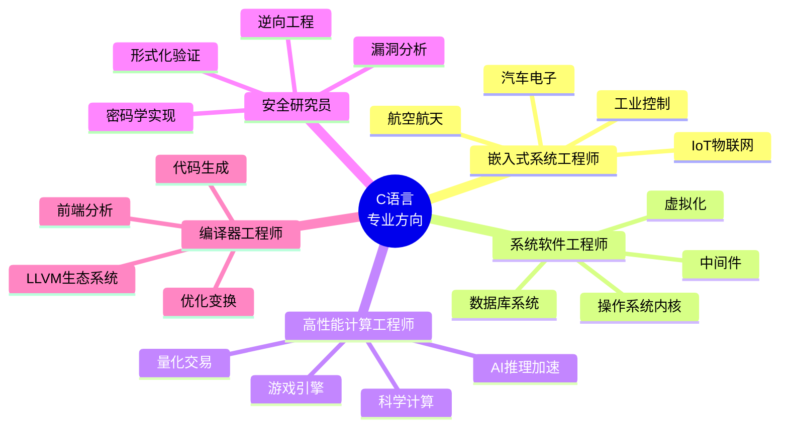
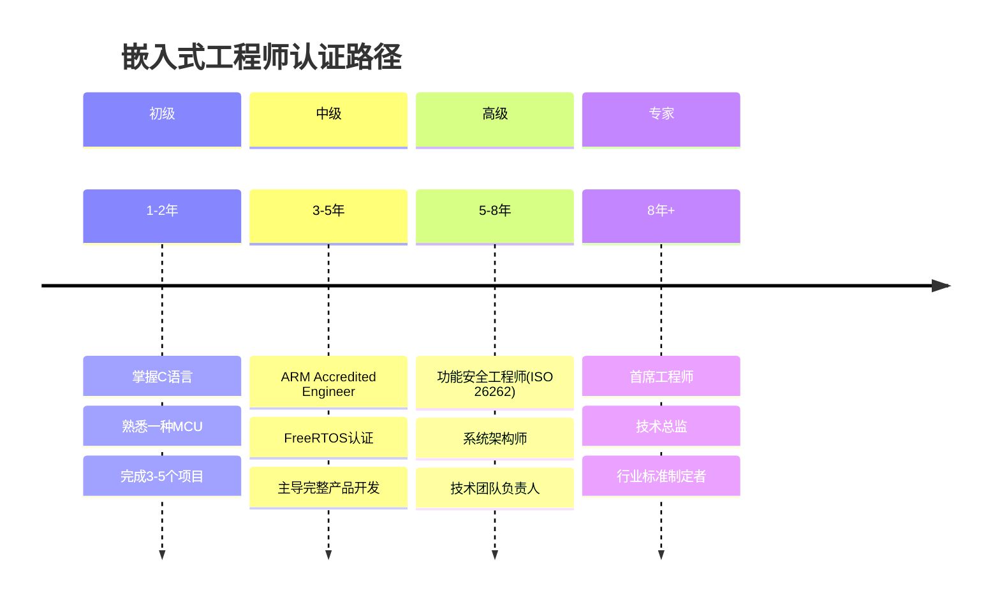

# 专业方向路径

> **目标读者**：已完成高级学习路径，希望在特定领域深耕的开发者
> **目标**：成为特定领域的专家级工程师

---

## 专业方向概览



---


---

## 📑 目录

- [专业方向路径](#专业方向路径)
  - [专业方向概览](#专业方向概览)
  - [📑 目录](#-目录)
  - [方向1：嵌入式系统工程师](#方向1嵌入式系统工程师)
    - [🎯 方向概述](#-方向概述)
    - [📚 核心技能要求](#-核心技能要求)
      - [必备技能](#必备技能)
      - [进阶技能](#进阶技能)
    - [📖 必读材料](#-必读材料)
      - [基础阶段](#基础阶段)
      - [进阶阶段](#进阶阶段)
    - [🛠️ 实践项目建议](#️-实践项目建议)
      - [初级项目（1-2个月）](#初级项目1-2个月)
      - [中级项目（2-4个月）](#中级项目2-4个月)
      - [高级项目（3-6个月）](#高级项目3-6个月)
    - [📝 认证与进阶路径](#-认证与进阶路径)
    - [💼 推荐公司](#-推荐公司)
  - [方向2：系统软件工程师](#方向2系统软件工程师)
    - [🎯 方向概述](#-方向概述-1)
    - [📚 核心技能要求](#-核心技能要求-1)
      - [必备技能](#必备技能-1)
      - [进阶技能](#进阶技能-1)
    - [📖 必读材料](#-必读材料-1)
      - [操作系统方向](#操作系统方向)
      - [数据库方向](#数据库方向)
    - [🛠️ 实践项目建议](#️-实践项目建议-1)
      - [初级项目（1-2个月）](#初级项目1-2个月-1)
      - [中级项目（2-4个月）](#中级项目2-4个月-1)
      - [高级项目（3-6个月）](#高级项目3-6个月-1)
    - [📝 认证与进阶路径](#-认证与进阶路径-1)
    - [💼 推荐公司](#-推荐公司-1)
  - [方向3：高性能计算工程师](#方向3高性能计算工程师)
    - [🎯 方向概述](#-方向概述-2)
    - [📚 核心技能要求](#-核心技能要求-2)
      - [必备技能](#必备技能-2)
    - [📖 必读材料](#-必读材料-2)
    - [🛠️ 实践项目建议](#️-实践项目建议-2)
      - [项目1：矩阵运算库优化](#项目1矩阵运算库优化)
      - [项目2：游戏物理引擎](#项目2游戏物理引擎)
      - [项目3：高频交易引擎](#项目3高频交易引擎)
    - [📝 认证与进阶路径](#-认证与进阶路径-2)
    - [💼 推荐公司](#-推荐公司-2)
  - [方向4：安全研究员](#方向4安全研究员)
    - [🎯 方向概述](#-方向概述-3)
    - [📚 核心技能要求](#-核心技能要求-3)
      - [必备技能](#必备技能-3)
    - [📖 必读材料](#-必读材料-3)
    - [🛠️ 实践项目建议](#️-实践项目建议-3)
      - [项目1：漏洞挖掘实践](#项目1漏洞挖掘实践)
      - [项目2：简单病毒分析](#项目2简单病毒分析)
    - [📝 认证与进阶路径](#-认证与进阶路径-3)
  - [方向5：编译器工程师](#方向5编译器工程师)
    - [🎯 方向概述](#-方向概述-4)
    - [📚 核心技能要求](#-核心技能要求-4)
      - [必备技能](#必备技能-4)
    - [📖 必读材料](#-必读材料-4)
    - [🛠️ 实践项目建议](#️-实践项目建议-4)
      - [项目1：C子集编译器](#项目1c子集编译器)
      - [项目2：LLVM Pass开发](#项目2llvm-pass开发)
    - [📝 认证与进阶路径](#-认证与进阶路径-4)
    - [💼 推荐公司](#-推荐公司-3)
  - [跨领域通用技能](#跨领域通用技能)


---

## 方向1：嵌入式系统工程师

### 🎯 方向概述

嵌入式系统是C语言最传统也是最重要的应用领域，涵盖从8位单片机到多核SoC的广泛范围。

| 细分领域 | 典型应用 | 薪资范围（年薪） |
|----------|----------|------------------|
| 汽车电子 | ECU、ADAS、车载娱乐 | 30-80万 |
| 航空航天 | 飞控系统、卫星载荷 | 40-100万 |
| 工业控制 | PLC、DCS、机器人 | 25-60万 |
| IoT物联网 | 智能家居、可穿戴设备 | 20-50万 |

### 📚 核心技能要求

#### 必备技能

| 技能 | 熟练度要求 | 学习资源 |
|------|-----------|----------|
| C/C++嵌入式编程 | 精通 | `knowledge/03_System_Programming/06_Embedded/` |
| 实时操作系统 | 精通 | FreeRTOS/RT-Thread源码 |
| 硬件原理 | 熟悉 | 数字电路、模拟电路 |
| 通信协议 | 精通 | CAN/LIN/Ethernet/SPI/I2C/UART |
| 调试技术 | 精通 | JTAG/SWD/逻辑分析仪 |
| 功能安全 | 了解 | ISO 26262 / DO-178C |

#### 进阶技能

| 技能 | 应用场景 | 学习路径 |
|------|----------|----------|
| AUTOSAR | 汽车电子 | Classic AUTOSAR架构 |
| MbedTLS | 安全通信 | TLS/DTLS实现 |
| Device Tree | Linux嵌入式 | ARM设备树详解 |
| Yocto/Buildroot | 系统构建 | 嵌入式Linux构建 |

### 📖 必读材料

#### 基础阶段

| 文件路径 | 主题 | 重要性 |
|----------|------|--------|
| `knowledge/01_Core_Language/06_Bit_Manipulation/` | 位运算与寄存器操作 | ⭐⭐⭐⭐⭐ |
| `knowledge/03_System_Programming/06_Embedded/01_embedded_c.md` | 嵌入式C语言 | ⭐⭐⭐⭐⭐ |
| `knowledge/03_System_Programming/06_Embedded/02_hal.md` | 硬件抽象层设计 | ⭐⭐⭐⭐⭐ |
| `knowledge/03_System_Programming/06_Embedded/03_rtos.md` | 实时操作系统 | ⭐⭐⭐⭐⭐ |
| `knowledge/03_System_Programming/06_Embedded/04_bootloader.md` | 启动代码 | ⭐⭐⭐⭐ |

#### 进阶阶段

| 文件路径 | 主题 | 重要性 |
|----------|------|--------|
| `knowledge/03_System_Programming/06_Embedded/05_autosar.md` | AUTOSAR架构 | ⭐⭐⭐⭐ |
| `knowledge/03_System_Programming/06_Embedded/06_safety_critical.md` | 功能安全 | ⭐⭐⭐⭐ |
| `knowledge/05_Tools_Chain/03_Build_System/02_cross_compilation.md` | 交叉编译 | ⭐⭐⭐⭐ |
| `knowledge/05_Tools_Chain/04_Performance/11_power_optimization.md` | 功耗优化 | ⭐⭐⭐ |

### 🛠️ 实践项目建议

#### 初级项目（1-2个月）

| 项目名称 | 目标平台 | 核心技能 |
|----------|----------|----------|
| LED控制与PWM调光 | STM32 | GPIO、定时器、中断 |
| 温度采集系统 | STM32 + DS18B20 | 单总线协议、ADC |
| 串口通信助手 | STM32 | UART、DMA、环形缓冲区 |
| 简易示波器 | STM32F4 + LCD | ADC、DMA、图形显示 |

#### 中级项目（2-4个月）

| 项目名称 | 目标平台 | 核心技能 |
|----------|----------|----------|
| 实时操作系统移植 | ARM Cortex-M | 上下文切换、调度器 |
| CAN总线通信节点 | STM32 + CAN | CAN协议、过滤器配置 |
| 电机FOC控制 | STM32F4 | PWM、ADC、PID、Clarke/Park变换 |
| 以太网数据采集 | STM32F7 + LWIP | TCP/IP、DMA、嵌入式Web服务器 |

#### 高级项目（3-6个月）

| 项目名称 | 目标平台 | 核心技能 |
|----------|----------|----------|
| 汽车BCM车身控制器 | S32K | AUTOSAR、功能安全、诊断协议 |
| 飞控系统 | STM32H7 | 传感器融合、控制算法、冗余设计 |
| 工业网关 | ARM Linux | 多协议转换、边缘计算、OTA |
| 智能音箱 | ESP32 | 音频编解码、WiFi/BT、语音识别 |

### 📝 认证与进阶路径



### 💼 推荐公司

| 类型 | 代表公司 | 特点 |
|------|----------|------|
| 汽车电子 | 博世、大陆、电装 | 薪资高、技术成熟 |
| 芯片原厂 | 英飞凌、NXP、ST | 技术深度、资源丰富 |
| 互联网硬件 | 小米、大疆、华为 | 创新快、产品导向 |
| 工业控制 | 西门子、三菱、汇川 | 稳定性强、行业壁垒 |

---

## 方向2：系统软件工程师

### 🎯 方向概述

系统软件工程师构建计算机系统的基础设施，包括操作系统、数据库、中间件等核心组件。

| 细分领域 | 典型产品 | 薪资范围（年薪） |
|----------|----------|------------------|
| 操作系统内核 | Linux Kernel、Windows NT | 50-150万 |
| 数据库系统 | MySQL、PostgreSQL、Redis | 50-150万 |
| 中间件 | Kafka、RocketMQ、Nginx | 40-120万 |
| 虚拟化/容器 | KVM、Docker、Kubernetes | 50-150万 |

### 📚 核心技能要求

#### 必备技能

| 技能 | 熟练度要求 | 学习资源 |
|------|-----------|----------|
| C/C++系统编程 | 精通 | `knowledge/03_System_Programming/` |
| 操作系统原理 | 精通 | MIT 6.S081 / CMU 15-445 |
| 数据结构与算法 | 精通 | `knowledge/02_Data_Structures/` |
| 并发编程 | 精通 | `knowledge/01_Core_Language/07_Concurrency/` |
| 性能优化 | 精通 | `knowledge/05_Tools_Chain/04_Performance/` |
| 调试与排错 | 精通 | GDB、SystemTap、perf |

#### 进阶技能

| 技能 | 应用场景 | 学习路径 |
|------|----------|----------|
| eBPF | 内核观测 | BPF Performance Tools |
| io_uring | 高性能I/O | Linux异步I/O新接口 |
| DPDK | 网络加速 | 内核旁路技术 |
| SPDK | 存储加速 | 用户态NVMe驱动 |

### 📖 必读材料

#### 操作系统方向

| 文件路径 | 主题 | 重要性 |
|----------|------|--------|
| `knowledge/03_System_Programming/05_Kernel/01_kernel_modules.md` | 内核模块 | ⭐⭐⭐⭐⭐ |
| `knowledge/03_System_Programming/05_Kernel/02_memory_management.md` | 内存管理 | ⭐⭐⭐⭐⭐ |
| `knowledge/03_System_Programming/05_Kernel/03_process_scheduler.md` | 进程调度 | ⭐⭐⭐⭐⭐ |
| `knowledge/03_System_Programming/05_Kernel/04_vfs.md` | 虚拟文件系统 | ⭐⭐⭐⭐ |
| `knowledge/03_System_Programming/05_Kernel/05_network_stack.md` | 网络协议栈 | ⭐⭐⭐⭐ |

#### 数据库方向

| 文件路径 | 主题 | 重要性 |
|----------|------|--------|
| `knowledge/02_Data_Structures/03_Trees/04_b_tree.md` | B树/B+树 | ⭐⭐⭐⭐⭐ |
| `knowledge/03_System_Programming/02_Processes/05_ipc_shared_memory.md` | 共享内存 | ⭐⭐⭐⭐ |
| `knowledge/04_Network_Programming/06_Distributed_Systems/` | 分布式系统 | ⭐⭐⭐⭐ |
| `knowledge/05_Tools_Chain/04_Performance/12_io_optimization.md` | I/O优化 | ⭐⭐⭐⭐⭐ |

### 🛠️ 实践项目建议

#### 初级项目（1-2个月）

| 项目名称 | 技术点 | 学习目标 |
|----------|--------|----------|
| 简易Shell | fork/exec/pipe | 进程管理 |
| 内存分配器 | malloc/free | 内存管理算法 |
| 简单文件系统 | FUSE | 文件系统设计 |
| 用户态线程库 | ucontext | 上下文切换 |

#### 中级项目（2-4个月）

| 项目名称 | 技术点 | 学习目标 |
|----------|--------|----------|
| KV存储引擎 | LSM-Tree | 存储引擎设计 |
| 简易数据库 | SQL解析/B+树 | 数据库内核 |
| TCP协议栈 | 用户态协议栈 | 网络协议实现 |
| 协程库 | 无栈协程 | 并发编程 |

#### 高级项目（3-6个月）

| 项目名称 | 技术点 | 学习目标 |
|----------|--------|----------|
| Linux内核驱动 | 字符/块设备 | 内核开发 |
| 分布式KV系统 | Raft/ gossip | 分布式一致性 |
| 高性能代理 | epoll/DPDK | 网络性能优化 |
| 容器运行时 | cgroups/namespaces | 容器技术 |

### 📝 认证与进阶路径

| 级别 | 要求 | 认证 |
|------|------|------|
| 初级 | 完成xv6/MIT 6.S081 | - |
| 中级 | 贡献Linux内核 | Linux Foundation认证 |
| 高级 | 主导子系统设计 | - |
| 专家 | 内核Maintainer | Linux Foundation Fellow |

### 💼 推荐公司

| 类型 | 代表公司 | 特点 |
|------|----------|------|
| 云厂商 | AWS、阿里云、腾讯云 | 规模大、技术先进 |
| 数据库公司 | PingCAP、OceanBase、涛思数据 | 专业深度 |
| 操作系统 | 麒麟、统信、华为 | 国产化机遇 |
| 开源社区 | Linux Foundation、CNCF | 影响力 |

---

## 方向3：高性能计算工程师

### 🎯 方向概述

高性能计算（HPC）工程师专注于榨取硬件极限性能，应用于科学计算、金融、游戏等领域。

| 细分领域 | 典型应用 | 薪资范围（年薪） |
|----------|----------|------------------|
| 科学计算 | 气象模拟、分子动力学 | 40-100万 |
| 量化交易 | 高频交易、风险计算 | 80-500万 |
| 游戏引擎 | 物理模拟、渲染引擎 | 50-150万 |
| AI推理加速 | 深度学习推理优化 | 60-200万 |

### 📚 核心技能要求

#### 必备技能

| 技能 | 熟练度要求 | 学习资源 |
|------|-----------|----------|
| C/C++性能优化 | 精通 | `knowledge/05_Tools_Chain/04_Performance/` |
| SIMD编程 | 精通 | SSE/AVX/NEON/SVE |
| CUDA/OpenCL | 熟悉 | GPU并行编程 |
| 并行算法 | 精通 | MPI/OpenMP |
| 性能分析 | 精通 | VTune/perf/Nsight |
| 数值计算 | 熟悉 | BLAS/LAPACK/FFT |

### 📖 必读材料

| 文件路径 | 主题 | 重要性 |
|----------|------|--------|
| `knowledge/05_Tools_Chain/04_Performance/01_cache_hierarchy.md` | 缓存体系 | ⭐⭐⭐⭐⭐ |
| `knowledge/05_Tools_Chain/04_Performance/02_cache_optimization.md` | 缓存优化 | ⭐⭐⭐⭐⭐ |
| `knowledge/05_Tools_Chain/04_Performance/04_simd_basics.md` | SIMD基础 | ⭐⭐⭐⭐⭐ |
| `knowledge/05_Tools_Chain/04_Performance/09_gpu_programming.md` | GPU编程 | ⭐⭐⭐⭐ |
| `knowledge/05_Tools_Chain/04_Performance/10_parallel_algorithms.md` | 并行算法 | ⭐⭐⭐⭐⭐ |

### 🛠️ 实践项目建议

#### 项目1：矩阵运算库优化

```c
// 目标：实现接近Intel MKL性能的GEMM

// 优化步骤：
// 1. 朴素三重循环 (5 GFLOPS)
// 2. 缓存分块 (20 GFLOPS)
// 3. SSE向量化 (40 GFLOPS)
// 4. AVX2向量化 (80 GFLOPS)
// 5. AVX-512 (120 GFLOPS)
// 6. 汇编优化 (150 GFLOPS)

// 参考：BLIS、OpenBLAS源码
```

#### 项目2：游戏物理引擎

| 模块 | 技术点 | 性能目标 |
|------|--------|----------|
| 刚体动力学 | RK4积分器 | 1000物体@60fps |
| 碰撞检测 | SAP/BVH | < 1ms检测时间 |
| 约束求解 | PBD/XPBD | 稳定堆叠100+物体 |
| 软体模拟 | FEM/PDE | 实时布料模拟 |

#### 项目3：高频交易引擎

| 组件 | 技术要求 | 延迟目标 |
|------|----------|----------|
| 行情解码 | FPGA/内核旁路 | < 1μs |
| 策略计算 | 无锁数据结构 | < 5μs |
| 订单发送 | DPDK/kernel bypass | < 10μs |
| 往返延迟 | 端到端 | < 20μs |

### 📝 认证与进阶路径

| 级别 | 要求 | 代表 |
|------|------|------|
| 初级 | 掌握SIMD编程 | - |
| 中级 | 优化达到理论峰值50% | - |
| 高级 | 多卡GPU优化 | CUDA认证 |
| 专家 | 架构设计、团队领导 | 首席架构师 |

### 💼 推荐公司

| 类型 | 代表公司 | 特点 |
|------|----------|------|
| 量化基金 | Two Sigma、Citadel、九坤 | 薪资顶尖 |
| 游戏公司 | 米哈游、Epic、Unity | 技术有趣 |
| 超算中心 | 国家超算中心、实验室 | 科研导向 |
| AI芯片 | 英伟达、海光、寒武纪 | 软硬件结合 |

---

## 方向4：安全研究员

### 🎯 方向概述

安全研究员专注于软件安全，包括漏洞挖掘、逆向分析、形式化验证等。

| 细分领域 | 典型工作 | 薪资范围（年薪） |
|----------|----------|------------------|
| 漏洞分析 | 0day挖掘、漏洞利用 | 50-200万 |
| 逆向工程 | 恶意软件分析、协议逆向 | 40-150万 |
| 形式化验证 | 关键系统验证 | 50-150万 |
| 密码学实现 | 算法实现、侧信道防护 | 60-200万 |

### 📚 核心技能要求

#### 必备技能

| 技能 | 熟练度要求 | 学习资源 |
|------|-----------|----------|
| C/C++底层编程 | 精通 | 深入理解内存布局 |
| 汇编语言 | 精通 | x86/ARM汇编 |
| 二进制分析 | 精通 | IDA Pro、Ghidra |
| 调试技术 | 精通 | GDB、WinDbg |
| 漏洞原理 | 精通 | 缓冲区溢出、UAF等 |

### 📖 必读材料

| 文件路径 | 主题 | 重要性 |
|----------|------|--------|
| `knowledge/01_Core_Language/04_Memory/07_memory_leaks.md` | 内存问题 | ⭐⭐⭐⭐⭐ |
| `knowledge/01_Core_Language/04_Memory/08_buffer_overflow.md` | 缓冲区溢出 | ⭐⭐⭐⭐⭐ |
| `knowledge/01_Core_Language/04_Memory/09_use_after_free.md` | UAF漏洞 | ⭐⭐⭐⭐⭐ |
| `knowledge/05_Tools_Chain/05_Formal_Methods/` | 形式化方法 | ⭐⭐⭐⭐ |
| `knowledge/05_Tools_Chain/02_Debugging/05_reverse_debugging.md` | 逆向调试 | ⭐⭐⭐⭐ |

### 🛠️ 实践项目建议

#### 项目1：漏洞挖掘实践

```c
// 目标：在开源软件中找出CVE级别的漏洞

// 学习路径：
// 1. 复现经典漏洞（Heartbleed、Shellshock）
// 2. 使用AFL fuzzing发现崩溃
// 3. 分析崩溃成因，编写PoC
// 4. 提交CVE

// 工具链：
// - AFL/AFL++
// - libFuzzer
// - AddressSanitizer
// - Valgrind
```

#### 项目2：简单病毒分析

| 阶段 | 内容 | 工具 |
|------|------|------|
| 静态分析 | PE结构、导入表 | PE-bear、CFF Explorer |
| 动态分析 | 行为监控 | Procmon、Wireshark |
| 逆向分析 | 核心逻辑还原 | IDA Pro、x64dbg |
| 报告撰写 | IOC提取、处置建议 | - |

### 📝 认证与进阶路径

| 级别 | 要求 | 认证 |
|------|------|------|
| 初级 | 理解常见漏洞类型 | OSCP |
| 中级 | 独立挖掘漏洞 | CEH、GREM |
| 高级 | 0day研究 | 知名CTF排名 |
| 专家 | 漏洞研究专家 | 安全峰会演讲 |

---

## 方向5：编译器工程师

### 🎯 方向概述

编译器工程师构建编程语言的工具链，是现代软件开发的基石。

| 细分领域 | 典型产品 | 薪资范围（年薪） |
|----------|----------|------------------|
| 前端分析 | Clang、Rustc | 50-150万 |
| 优化变换 | LLVM、GCC | 50-150万 |
| 代码生成 | LLVM Backend、V8 TurboFan | 60-200万 |
| JIT编译 | Java HotSpot、.NET CLR | 60-200万 |

### 📚 核心技能要求

#### 必备技能

| 技能 | 熟练度要求 | 学习资源 |
|------|-----------|----------|
| C/C++编程 | 精通 | 编写复杂数据结构 |
| 形式语言 | 精通 | 龙书、虎书、鲸书 |
| 数据流分析 | 精通 | 静态单赋值(SSA) |
| 汇编/机器码 | 精通 | 目标架构指令集 |
| LLVM框架 | 熟悉 | LLVM源码 |

### 📖 必读材料

| 文件路径 | 主题 | 重要性 |
|----------|------|--------|
| `knowledge/05_Tools_Chain/01_Compiler/` | 编译器基础 | ⭐⭐⭐⭐⭐ |
| `knowledge/02_Data_Structures/07_Graphs/` | 图算法 | ⭐⭐⭐⭐⭐ |
| `knowledge/05_Tools_Chain/04_Performance/06_pgo.md` | PGO优化 | ⭐⭐⭐⭐ |
| `knowledge/05_Tools_Chain/05_Formal_Methods/01_static_analysis.md` | 静态分析 | ⭐⭐⭐⭐ |

### 🛠️ 实践项目建议

#### 项目1：C子集编译器

```c
// 实现一个C子集的完整编译器

// 支持特性：
// - 类型：int, char, 指针, 数组
// - 控制流：if/else, while, for, return
// - 函数：声明、定义、调用、递归
// - 优化：常量折叠、死代码消除、寄存器分配

// 架构：
// 1. 词法分析（手写的lexer）
// 2. 语法分析（递归下降）
// 3. 语义分析（符号表、类型检查）
// 4. IR生成（LLVM IR或自定义三地址码）
// 5. 优化pass
// 6. 代码生成（x86-64汇编）
```

#### 项目2：LLVM Pass开发

| Pass类型 | 功能 | 学习价值 |
|----------|------|----------|
| FunctionPass | 函数内分析 | LLVM基础 |
| LoopPass | 循环优化 | 性能关键 |
| MachinePass | 机器码生成 | 后端技术 |
| ModulePass | 全局分析 | 链接时优化 |

### 📝 认证与进阶路径

| 级别 | 要求 | 代表 |
|------|------|------|
| 初级 | 完成编译器课程 | CS143、CS243 |
| 中级 | LLVM贡献者 | - |
| 高级 | 主导语言特性 | - |
| 专家 | 语言设计者 | - |

### 💼 推荐公司

| 类型 | 代表公司 | 特点 |
|------|----------|------|
| 大厂 | 谷歌、苹果、微软 | 影响广泛 |
| 芯片公司 | ARM、Intel、华为 | 软硬结合 |
| AI公司 | OpenAI、商汤 | AI编译器 |
| 数据库 | PingCAP、StarRocks | 查询优化 |

---

## 跨领域通用技能

无论选择哪个专业方向，以下技能都是必不可少的：

| 技能 | 重要性 | 学习资源 |
|------|--------|----------|
| 英语阅读 | ⭐⭐⭐⭐⭐ | 阅读技术文档和论文 |
| 技术写作 | ⭐⭐⭐⭐ | 撰写设计文档 |
| 代码审查 | ⭐⭐⭐⭐⭐ | 参与开源项目Review |
| 开源贡献 | ⭐⭐⭐⭐ | GitHub贡献 |
| 演讲分享 | ⭐⭐⭐ | 技术博客、演讲 |

---

> **返回**：[高级学习路径](./03_Advanced_Learning_Path.md) | **继续**：[面试准备路径](./05_Interview_Preparation_Path.md)
